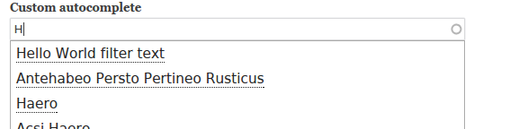

Бывают моменты, когда необходимо в форме предоставить выбор, но чекбоксы, радио
кнопки и селект по каким-то причинам не подходят. Например, много значений,
использовать их будет крайне не удобно, а порой и вовсе не разумно. Для этого
можно задействовать автодополнение для нужного элемента формы, как правило, оно
всегда применяется для поля типа textfield.

Если вы имели дело с автодополнениями в Drupal 7, то особо ничего нового вы не
узнаете, разве что посмотрите на изменения и небольшие нововведения которые были
произведены в Drupal 8.

Если коротко, то:

- `#autocomplete_path` заменен на `#autocomplete_route_name`;
- Теперь вместо адреса до автокомплита используется название роутинга;
- Следовательно путь автокомплита теперь объявляется не через hook_menu, а через
  роутинг;
- В Drupal 8 появился новый элемент формы `'#type' => 'entity_autocomplete'`,
  который позволяет создавать автодополнение по сущностям без своего роутинга.

## Создание собственного автодополнения для поля

Для старта нам понадобится какая-нибудь форма, в которой будет элемент с которым
мы будем работать. В дальнейшем код будет писаться с условием что наш модуль
имеет название helloworld.

### Добавляем роут для автодополнения

Первым делом давайте объявим путь по которому будет обрабатываться запрос на
автодополнение. Делается это в `modulename.routing.yml`.

```php {"header":"/src/Controller/CustomAutocomplete.php"}
<?php
/**
 * @file
 * Contains \Drupal\helloworld\Controller\CustomAutocomplete.
 */

namespace Drupal\helloworld\Controller;

// Указываем зависимости.
use Symfony\Component\HttpFoundation\JsonResponse;
use Symfony\Component\HttpFoundation\Request;
use Drupal\Core\Database\Database;
use Drupal\Component\Utility\Html;

class CustomAutocomplete {

  /**
   * Метод который будет возвращять результаты для автодополнения.
   *
   * {@inheritdoc}
   */
  public function autocomplete(Request $request) {
	    // Получаем текущий запрос автокомплита. ($_GET['q'])
    $string = $request->query->get('q');
    // В данном массиве будут результаты для автодополнения, которые будут
    // выданы пользователю при вводе.
    // Каждый результат является массивом состоящим из значения и метки.
    // Значение - то что будет вставлено в поле автозаполнения, метка - то что
    // будет показано в выпадающем списке с возможными автодополнениями для
    // пользователя.
    $matches = [];

    if ($string) {
      // Делаем выборку по всему содержимому типа node, где заголовок похож
      // на введенный в поле автодополнения.
      $query = \Drupal::database()->select('node_field_data', 'n')
        ->fields('n', array('nid', 'title'))
        ->condition('n.title', '%' . $string . '%', 'LIKE')
        ->range(0, 10);
      // Выполняем запрос и получаем результаты.
      $result = $query->execute();

      // Добавляем результаты в массив.
      foreach ($result as $row) {
        $value = Html::escape($row->title . ' (' . $row->nid . ')');
        $label = Html::escape($row->title);
        $matches[] = ['value' => $value, 'label' => $label];
      }
    }

    return new JsonResponse($matches);
  }

}
```

### Подключаем наше кастомное автодополнение к полю формы

Теперь дело за малым. Нам осталось подключить наше автодополнение к нужному полю
формы и всё готово!

```php
$form['custom_autocomplete_field'] = [
  '#type' => 'textfield',
  '#title' => $this->t('Custom autocomplete'),
  // Название роутинга для нашего автодополнения.
  '#autocomplete_route_name' => 'helloworld.custom_autocomplete',
];
```

И если вы всё сделали правильно, то в результате должно получиться следующее:



## Автодополнение с использованием entity_autocomplete

Как я уже упомянул выше, в drupal 8 появился новый элемент entity_autocomplete.
Он позволяет делать базовые автодоплнения по сущностям без необходимости
написания своего роутинга и контроллера, тем самым экономя вам кучу времени.
Ведь именно по сущностям, как правило, и пишутся кастомные автодполнения.

В самом базовом виде имеет следующий вид:

```php
$form['core_autocomplete'] = [
  '#title' => $this->t('Core autocomplete'),
  '#type' => 'entity_autocomplete',
  '#target_type' => 'node',
];
```

И всё! И данный пример будет работать как то, что мы написали выше
самостоятельно, с роутингом и контроллером. Удобно, не так ли? Но это далеко не
всё, он ещё имеет некую гибкость, которую придуют ему дополнительные параметры:

- `#selection_settings` - с их помощью вы сможете добавлять некоторые настройки.
  В данном случае он является массивом и может содержать список бандлов (типов
  сущности) по которым будет идти фильтрация.

```php
// В данном примере автодополнение будет происходить по заголовкам сущности типа node
// и её типам содержимого article и page.
'#target_type' => 'node',
'#selection_settings' => array(
  'target_bundles' => array('article', 'page'),
),
```

- `#default_value`  в данном параметре принимается объект сущности, или массив
  объектов сущностей которые будут установлены в качестве значений по умолчанию.

```php
$controller = \Drupal::entityManager()->getStorage('node');
...
'#default_value' => $controller->load(1),
```

- `#tags` при значении `TRUE`, позволяет устанавливать множественное значение
  через запятую.

```php
$controller = \Drupal::entityManager()->getStorage('node');
...
'#tags' => TRUE,
'#default_value' => $controller->loadMultiple([1,2,3]),
```

- `#autocreate` если установлен, то в случае, если указаны несуществующие
  сущности, то они будут созданы.

```php
'#type' => 'entity_autocomplete',
'#target_type' => 'taxonomy_term',
'#autocreate' => array(
  'bundle' => 'tags', // Обязательный параметр. Указывается какой тип будет создаваться.
  'uid' => 1, // Необязательный параметр. В нём указывается id пользователя, который будет числиться автором созданного материала. Если не указано, будет использован id текущего пользователя.
),
```

Вот так создаются автодополнения с использованием функционала из ядра. На этом
всё.

## Ссылки

- [Исходный код модуля с примером](example/helloworld)
