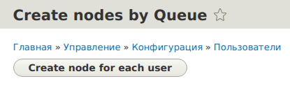
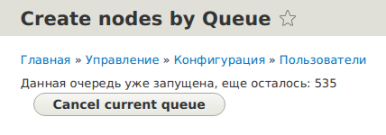
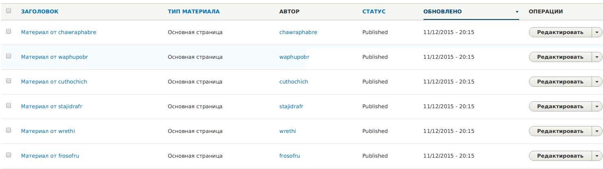

Иногда требуется произвести обработку большого кол-ва данных. При этом такой
обьем данных может выйти за лимиты выполнения скрипта php, поэтому необходимо
как-то раздробить такое выполнение. Для выполнения через UI
есть [Batch API][d8-batch-api]. Он выполняется средствами AJAX до тех пор, пока
открыта страница с Batch операцией и если закрыть вкладку в момент операции, или
потерять соединение с интернетом, то операция оборвется и придется начинать
сначала. Batch API как был в Drupal 7, так и перекачевал в Drupal 8, поэтому
если вам нужен именно он, то я
рекомендую [почитать об этом у xandeadx](http://xandeadx.ru/blog/drupal/395).

В данной статье я расскажу о Queue API, который стоит на уровень ниже Batch.
Собственно батч на нем и основан. Он позволяет нам создавать "очереди" и
выполнять их программно. Например это удобно для создания импорта или обработки
больших обьемов данных.

Т.е. Queue API может работать полностью без участия пользователя, когда Batch
API именно "визуальная" надстройка, которая требует как минимум держать активной
вкладку в момент выполнения batch операции.

## Теория

Я расскажу о создании очереди с использование базы данных. Т.е. очередь будет
храниться в базе данных. Всего в ядре их
четыре: [DatabaseQueue](https://api.drupal.org/api/drupal/core%21lib%21Drupal%21Core%21Queue%21DatabaseQueue.php/class/DatabaseQueue/8), [Batch](https://api.drupal.org/api/drupal/core%21lib%21Drupal%21Core%21Queue%21Batch.php/class/Batch/8), [Batch Memory](https://api.drupal.org/api/drupal/core%21lib%21Drupal%21Core%21Queue%21BatchMemory.php/class/BatchMemory/8)
и [Memory](https://api.drupal.org/api/drupal/core%21lib%21Drupal%21Core%21Queue%21Memory.php/class/Memory/8).
Вы также можете обьявлять свои типы очередей при
помощи [QueueInterface](https://api.drupal.org/api/drupal/core%21lib%21Drupal%21Core%21Queue%21QueueInterface.php/interface/QueueInterface/8).

Первым делом необходимо создать очередь.

```php
# Создаем нашу очередь с названием my_custom_queue.
$queue = \Drupal::queue('my_custom_queue');
$queue->createQueue();
```

Далее нам нужно наполнить очередь данными:

```php
# Добавляем данные в очередь
$queue->createItem([
  'key' => 'value',
  'nested' => [
    'key' => 'value'
  ]
]);
```

После того как вы наполнили очередь всеми данными, с ней можно начинать
работать. Следовательно необходимо получать элементы очереди. Для получения
текущего элемента очереди:

```php
$current_item = $queue->claimItem();
```

После того как все необходимые действия с данным элементом закончены, его нужно
удалить из очереди:

```php
$queue->deleteItem();
```

Мы также можем удалить очередь:

```php
$queue->deleteQueue();
```

Также может оказаться полезным получение количества оставшихся элементов в
очереди:

```php
$items_in_queue = $queue->numberOfItems();
```

В принципе осталось всё это собрать в единое целое.

## Практика

Давайте для примера создадим форму в которой будет лишь одна кнопка, при нажатии
на которую мы будем получать список всех пользователей на сайте, добавлять их в
очередь, а затем создавать материал от их имени.

### Обьявляем форму для загрузки

Первым делом объявим страницу с формой.

```php {"header":"Листинг: /src/Form/QueueNode.php"}
<?php
/**
 * @file
 * Contains \Drupal\helloworld\Form\QueueNode.
 */

namespace Drupal\helloworld\Form;

use Drupal\Core\Form\FormBase;
use Drupal\Core\Form\FormStateInterface;
use Drupal\Component\Render\FormattableMarkup;

/**
 * Объявляем нашу форму для создания очереди.
 */
class QueueNode extends FormBase {

  /**
   * {@inheritdoc}.
   */
  public function getFormId() {
    return 'queue_node_form';
  }

  /**
   * {@inheritdoc}.
   */
  public function buildForm(array $form, FormStateInterface $form_state) {
    # Получаем нашу очередь, чтобы блокировать доступ к кнопку, если она еще
    # активна.
    $queue = \Drupal::queue('helloworld_mass_sending');
    if ($number_of_items = $queue->numberOfItems()) {
      $form['info_text'] = [
        '#type' => 'markup',
        '#markup' => new FormattableMarkup('<div>Данная очередь уже запущена, еще осталось: @number</div>', [
          '@number' => $number_of_items,
        ]),
      ];

      $form['delete'] = [
        '#type' => 'submit',
        '#value' => $this->t('Cancel current queue'),
        '#disable' => TRUE,
      ];

    }
    else {
      $form['submit'] = [
        '#type' => 'submit',
        '#value' => $this->t('Create node for each user'),
        '#disable' => TRUE,
      ];
    }

    return $form;
  }

  /**
   * {@inheritdoc}
   */
  public function validateForm(array &$form, FormStateInterface $form_state) {

  }

  /**
   * {@inheritdoc}
   */
  public function submitForm(array &$form, FormStateInterface $form_state) {
    # Получаем объект очереди.
    $queue = \Drupal::queue('helloworld_mass_sending');

    # Если нажата кнопка удаления, мы удаляем нашу очередь.
    if ($form_state->getTriggeringElement()['#id'] == 'edit-delete') {
      $queue->deleteQueue();
    }
    else {
      # Получаем список всех активных пользователей на сайте.
      $query = \Drupal::database()->select('users_field_data', 'u')
        ->fields('u', array('uid', 'name'))
        ->condition('u.status', 1);
      $result = $query->execute();

      # Создаем нашу очередь.
      $queue->createQueue();

      # Добавляем данные в очередь
      foreach ($result as $row) {
        $queue->createItem([
          'uid' => $row->uid,
          'name' => $row->name,
        ]);
      }
    }
  }

}
```

В данной форме у нас два поведения. Изначально на форме кнопка "Создать ноды для
пользователей", при нажатии которой из базы мы берем всех активных пользователей
и ложем в нашу очередь их имя и UID. В случае если очередь уже имеется и не
пустая, мы выводим текст сообщающий об этом, а также количество оставшихся
элементов в очереди, а также кнопку для удаления данной очереди, чтобы можно
было создать новую.

### Добавляем роут

```yml {"header":"Листинг: helloworld.routing.yml"}
helloworld.queue_node:
  path: '/admin/config/people/queue-node'
  defaults:
    _title: 'Create nodes by Queue'
    # Подгружаем форму по неймспейсу.
    _form: '\Drupal\helloworld\Form\QueueNode'
  requirements:
    _permission: 'administer node'
```

### Выполняем очередь

Вариантов как выполнять очередь может быть много, но мы не будем придумывать
ничего заурядного и просто повесим выполнение на крон.

Для этого объявляем нашу операцию для крона. От Drupal 7 отличий совершенно
никаких, hook_cron() никуда не делся.

```php {"header":"Листинг: helloworld.module"}
<?php

/**
 * @file
 */

use Drupal\node\Entity\Node;

/**
 * Implements hook_cron().
 */
function helloworld_cron() {
  $queue = \Drupal::queue('helloworld_mass_sending');
  # Время которое мы отводим на выполнение очередей за данный крон. (30 сек)
  $end = time() + 30;
  while (time() < $end && ($item = $queue->claimItem())) {
    # Данные которые мы добавляли в очередь находятся в $item->data.
    $node = Node::create(array(
      'type' => 'page',
      'title' => 'Материал от ' . $item->data['name'],
      'langcode' => 'ru',
      'uid' => $item->data['uid'],
      'status' => 1,
      'field_fields' => array(),
    ));
    $node->save();

    # Удаляем его из очереди, так как материал создан.
    $queue->deleteItem($item);
  }
}
```

### Проверяем

Заходим на страницу с нашей формой: /admin/config/people/queue-node. Вы должны
увидеть единственную кнопку для создания очереди.



Если мы на неё нажмём, должна создаться очередь. Если она создалась, вы увидите
кол-во оставшихся элементов в очереди, а также кнопк удля принудительного
удаления очереди.



После успешного выполнения крона, должны появиться материалы.



В случае если очередь успела выполниться за первый крон, вы увидите кнопку для
создания новой очереди, если же не успело, то обновленное кол-во оставшихся
элементов в очереди.

## P.s.

Данный материал не является исчерпывающим по Queue API, на самом деле о нем еще
можно написать не одну статью такого обьема. Например, как создавать свой тип
Queue наследуюясь от QueueInterface.

Также данный пример лишь **показывает принцип работы с Queue API**, и не
является идеальным для большого обьема данных. Например если вы хотите добавить
в очередь большое кол-во материалов, то лучше использовать для добавления в
очередь Batch или cron. И это опять же, отдельная тема. Так как добавляя
материал по крону и при этом работая с ним постоянно, надо контролировать чтобы
там не выполнялись по несколько раз одни и теже элементы и т.д. Для этого у
каждого элемента очереди есть дата его создания (`$item>created`) и т.д.

Спасибо за внимание.

[d8-batch-api]: ../../../../2018/09/11/d8-batch-api/index.ru.md
