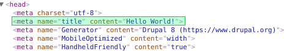

На данный момент Metatag ещё не готов к продакшену, и следовательно, метатеги
придется добавлять программно. Да и мало ли, metateg не панацея и не решение
всех проблем, поэтому программный вариант будет нужен всегда.

У drupby появилась статья по
тому [как изменять и удалять метатеги](http://drup.by/snippets/drupal-8-udalenie-i-izmenenie-metategov).
Но вот как добавлять почему-то нет, поэтому добавлю самю :)

## Добавляем свой метатег на все страницы

Например, добавляем метатег title с содержимым Hello World.

```html

<meta name="title" content="Hello World!">
```

В своём модуле пишем:

```php
/**
 * Implements hook_preprocess_html().
 */
function MYMODULE_preprocess_html(&$variables) {
  $title = [
    '#tag' => 'meta',
    '#attributes' => [
      'name' => 'title',
      'content' => 'Hello World!',
    ],
  ];
  $variables['#attached']['html_head'][] = [$title, 'title'];
}
```



## Добавление метатега только на странице сущности

Пример выше добавит метатег вообще на все страницы сайта. Но что делать если
надо только для определенной сущности?

```php
/**
 * Implements hook_entity_view().
 */
function MYMODULE_entity_view(array &$build, \Drupal\Core\Entity\EntityInterface $entity, \Drupal\Core\Entity\Display\EntityViewDisplayInterface $display, $view_mode, $langcode) {
  # Добавляем только, если сущность типа "нода".
  if ($entity->getEntityTypeId() == 'node') {
    $title = [
      '#tag' => 'meta',
      '#attributes' => [
        'name' => 'title',
        # В данном случае, заголовок в метатеге будет взят из сущности.
        'content' => \Drupal\Component\Utility\SafeMarkup::checkPlain($entity->title->value),
      ],
    ];
    $build['#attached']['html_head'][] = [$title, 'title'];
  }
}
```

Также полезным может оказаться получение ID сущности, чтобы добавить метатег на
странице только определенной сущности.

```php
$entity->id();
```

И получение подтипа сущности (bundle):

```php
$entity->bundle();
```

Вот и всё, а как удалять и изменять их - ссылка выше. Разница от добавления
практически минимальная и в названии хука.

P.s. В Drupal 7 метатеги можно было менять, изменять, ну и добавлять в
template.php (в файле темы), теперь править можно все также в файле темы
THEMENAME.theme, а вот добавлять **только в модуле**. Т.е. хук из статьи
работает только в модулях, а вот alter хука, доступен из темы. Спасибо drupby за
поправку.
