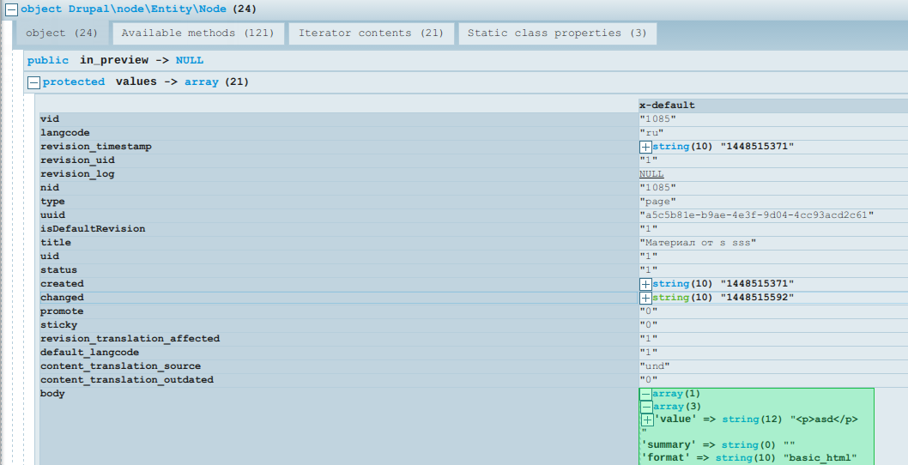

В Drupal 8 достаточно сильно изменился подход для работы с сущностями,
разумеется, в лучшую сторону. Работа с сущностями стала более "понятной" и
приятной.

Собственно очень часто на проектах приходится создавать сущности программно, об
этом я и расскажу.

## Немного полезной информации

По сути все сущности создаются абсолютно идентично, разница лишь в том, что они
имеют разные "ключи" и надо понимать где их искать, и что из них использовать.
Если с поиском проблем вообще не должно быть, так как структура теперь всегда
абсолютно идентична, то вот что использовать, придется немного подумать. Хотя
заглянув в базу, или изучив код сущности будет ясно что к чему. О чём это я,
узнаете чуть попозже.

Итак, как я выше написал, сущности теперь искать не сложно. Давайте найдем
объявление сущности node, это нам потребуется чтобы узнать какие свойства
необходимы для её создания. Так как это сущность из ядра Drupal 8, то совершенно
очевидным будет поиск в /core/modules/node. По сути так будет у каждой сущности,
мы ищём одноименный модуль. Далее всё просто, объявленные сущности хранятся в
/src/Entity. Следовательно файл с сущностью node мы найдем по пути:
/core/modules/node/src/Etntity/Node.php.

Далее нас интересует раздел entity_keys в аннотации. В нём мы можем узнать,
какие данные мы можем дополнительно передать при создании сущности, и вообще что
принимает данная сущность. Вот листинг из Node.

```php
entity_keys = {
  "id" = "nid",
  "revision" = "vid",
  "bundle" = "type",
  "label" = "title",
  "langcode" = "langcode",
  "uuid" = "uuid",
  "status" = "status",
  "uid" = "uid",
},
```

По сути это нам дает понять, что у этой сущности есть id, бандлы, статусы, языки
и т.д. В основном здесь самым полезным является - ключ для конкретного значения.
Например две сущности могут иметь bundle, но при этом называться он может у
сущностей как угодно и, следовательно, задавать нужно по ключу конкретной
cущности. Многие из них мы можем как задавать, так и опускать при создании
сущности. А некоторые не можем, так как они генерируются автоматически, например
nid, vid, uuid. А вот например uid, langcode будут взяты автоматически
основываясь на текущем пользователи, если при создании не указать свои данные. В
целом это типичные наборы для сущности. Просто я это упоминаю к тому, что
некоторые сущности могут содержать другие ключи, и их передача при создании
может вызывать фатальную ошибку. Поэтому, перед созданием, стоит подглядывать
туда, чтобы знать, что можно передать и как.

Например вот листинг ключей для сущности термина таксономии:

```php
entity_keys = {
  "id" = "tid",
  "bundle" = "vid",
  "label" = "name",
  "langcode" = "langcode",
  "uuid" = "uuid"
},
```

Допустим сразу видно, что у термина таксономии отсутствует ключ "статус".
Следовательно, его передача может вызвать ошибку, так как сущность не будет
ожидать этого. Также отстутствует id ревизии, но нас это не волнует, так как он
генерируется автоматически. Также стоит обратить внимание какой ключ у bundle
термина и node.

## Программное создание ноды

Ну а создавать сущности очень просто. Первым делом нужно подключить пространство
имён необходимой сущности в том файле, в котором вы хотите создавать программно
сущность. Для Node это `use Drupal\node\Entity\Node;` - это всё можно либо "
додумать" самостоятельно, посмотреть в файле сущности, или просто
воспользоваться IDE, которое само автодополнит и укажет пространство имён по
названию сущности. Например в phpStorm, Вписав Node и нажав Enter, мы получим то
же самое `use Drupal\node\Entity\Node;`;

Затем уже идёт создание сущности. Вот минимальный пример для создания ноды.

```php
$node = Node::create([
  'type' => 'page',
  'title' => 'Заголовок материала',
]);
$node->save();
```

Как вы можете заметить, мы указали лишь заголовок и тип материала (машинное имя
bundle), и этого вполне достаточно для создания материала.

Вот пример с большим количеством параметров:

```php
$node = Node::create([
  'type' => 'page',
  'title' => 'Материал на русском',
  'langcode' => 'ru',
  'uid' => 1,
  'status' => 1,
])->save();
```

В данном примере мы дополнительно указали язык материала, UID автора, а также
статус (1 = активный). Также обратите внимание на формат записи.
Теперь `->save()` вызывается сразу, так тоже можно, в принципе, кому как
удобнее.

И последний пример, который окажется полезным - создания сущности с значениями
полей. До этого мы лишь указывали значение для заголовка, но тип материала page
также имеет поле body (содержимое), которое мы также можем заполнить программно,
как и любое другое поле.

Значения полей добавляются к ключам в массив в формате:

```php
'field_name' => [
  ['value' => 'value'],
]
```

У полей с множественными значениями соответственно будет так:

```php
'field_name' => [
  ['value' => 'value'],
  ['value' => 'value2']
]
```

У каждого поля свой формат и подход в хранении данных, и самый простой вариант
посмотреть как туда "отдавать" данные - это создать через админку нужное
содержимое с нужными значениями в нужном поле, затем программно загрузить её и
посмотреть "что внутри".

```php
# kint поставляется с devel
# Загружаем ноду по NID.
kint(Node::load($nid));
```

В результате мы увидим вывод для конкретной сущности и сможем посмотреть что "
внутри".



Как мы видим, поле body имеет следующий вид:

```php
'body' => [
  [
    'value' => '<p>Hello World/p>',
    'summary' => '',
    'format' => 'full_html',
  ]
]
```

Следовательно, добавить значение в поле body при создании можно так:

```php
$node = Node::create([
  'type' => 'page',
  'title' => 'Заголовок материала',
  'body' => [
    [
      'value' => '<p>Hello World/p>',
      'summary' => '',
      'format' => 'full_html',
    ]
  ]
]);
$node->save();
```

## Программное создание термина таксономии

Обратите внимание на entity_keys из начала статьи. Метка (label) у термина уже
имеет ключ name, вместо title у node, а назвние бандла (словаря) не type, а vid.

```php
use Drupal\taxonomy\Entity\Term;
...
$term = Term::create([
  'name' => 'My term',
  'vid' => 'tags',
  'parent' => '1',
]);
```

```php {"header":"Добавление термина в качестве \"дочернего\"."}
$term = Term::create([
  'name' => 'My term',
  'vid' => 'tags',
  # tid термина родителя.
  'parent' => '1',
]);
$term->save();
```

```php {"header":"Добавление веса для термина"}
$term = Term::create([
  'name' => 'My term',
  'vid' => 'tags',
  'weight' => '100',
]);
```

Вот и всё. Принцип создания всех сущностей очень похож, разница в ключах для
основных данных сущности. Ну и конечно стоит вооружиться Kint, он даст очень
много полезной информации и данных. Например, узнать что еще принимает сущность
термина таксономии можно во вкладке Iterator contents (kint). Там я, например,
нашел weight и parent для термина.
