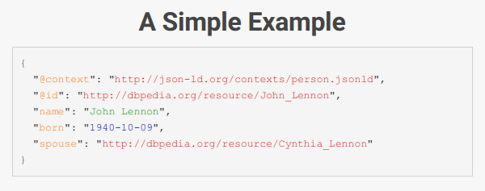
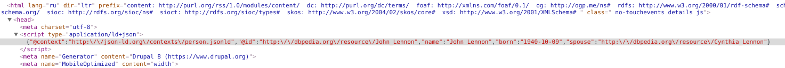
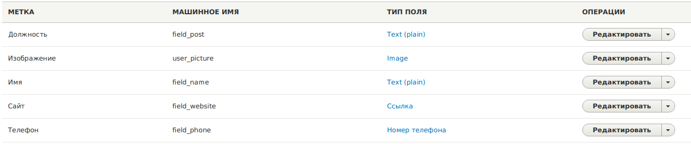
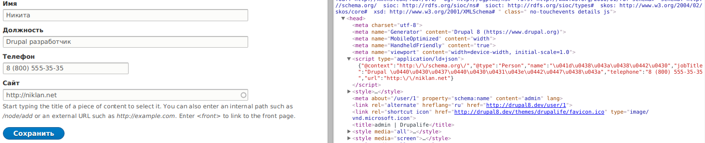

Вам наверное часто приходилось, или же приходится добавлять семантические данные
на страницу. Микроразметка, RDFa, schema.org и другие. Я думаю, что это всегда
немного геморойное занятие, так как они напрямую вставляются в HTML разметку в
качестве аттрибутов, требуют некую структуру и т.д. В общем и целом, в текущем
виде они скорее заноза в одном месте, нежели удобные средства (я говорю именно о
том как оно всё добавляется, а не о пользе самих микроразметок).

Видимо у народа накипело, и появился стандарт (а не просто чья-то поделка)
json-ld. Он, по сути, является надстройкой над микроразметкой, схемой и т.д. Он
позволяет использовать любой из этих стандартов, но записывать их не в атрибуты
html тегов, а в формате 1 JSON строки вверху сайта. Это ли не круто? Вместо
писанины кучи тегов, атрибутов, достаточно сформировать JSON и вставить его
в `<head>`. Этот стандарт поддерживается как Google, так и Yandex в полном
объеме. Так что, совершенно очевидно, за ним будущее ибо он проще, удобнее и
гибче. Собственно я расскажу как его добавлять на страницы в Drupal 8.

## Пример вставки json-ld

На самом то деле, я решил эту статью написать после статьи
о [программном добавлении метатегов](/blog/81) ибо их подход совершенно
идентичен. Я давно уже хотел про json-ld что-то написать, решил попробовать его
применить по принципу метатегов, и оно сработало :)

Если зайти на [сайт json-ld](http://json-ld.org/) то можно увидеть пример:



Давайте его добавим на все страницы сайта (пока это не особо важно). В данном
примере больше всего вас должен заинтересовать синтаксис render array для
json-ld:

```php
/**
 * Implements hook_page_attachments().
 */
function MYMODULE_page_attachments(array &$page) {
  # Наш render array.
  $json_ld = [
    # Тип тега HTML, по стандарту json-ld - он <script>
    '#tag' => 'script',
    # Атрибут type по стандарту должен быть такого значения. Никаким другим.
    '#attributes' => [
      'type' => 'application/ld+json',
    ],
    #
    '#value' => \Drupal\Component\Serialization\Json::encode([
      '@context' => 'http://json-ld.org/contexts/person.jsonld',
      '@id' => 'http://dbpedia.org/resource/John_Lennon',
      'name' => 'John Lennon',
      'born' => '1940-10-09',
      'spouse' => 'http://dbpedia.org/resource/Cynthia_Lennon',
    ])
  ];

  $page['#attached']['html_head'][] = [$json_ld, 'json-ld'];
}
```

И на каждой странице должен появиться наш тег с данными:



По сути это всё что нужно знать.

## Добавление JSON-LD на страницу пользователя

Как я уже написал, то что выше - это все что нужно знать, дальше дело фанатазии
и потребностей.

Для примера, давайте добавим
информцию [schema.org Person](http://schema.org/Person). Думаю нам хватит таких
данных: имя, должность, телефон и адрес сайта. Разумеется, так как мы уже
добавляем динамический json-ld, нам придется тянуть данные из профиля
пользователя, а чтобы их оттуда тянуть, они там должны как-то храниться. Не
выдумывая ничего, я просто добавил соответствующие поля:



Затем, когда у нас есть поля, нам достаточно их вывести:

```php
/**
 * Implements hook_entity_view().
 */
function MYMODULE_entity_view(array &$build, \Drupal\Core\Entity\EntityInterface $entity, \Drupal\Core\Entity\Display\EntityViewDisplayInterface $display, $view_mode, $langcode) {
  # Добавляем только к сущности "пользователь"
  # Также мы будем выводить данные только на странице пользователя. Ведь нам
  # не нужно выводить их везде где выводятся пользователи, а толкьо на его
  # конкретной странице.
  if ($entity->getEntityTypeId() == 'user' && $view_mode == 'full') {
    $json_ld = [
      '#tag' => 'script',
      '#attributes' => [
        'type' => 'application/ld+json',
      ],
      '#value' => \Drupal\Component\Serialization\Json::encode([
        '@context' => 'http://schema.org/',
        '@type' => 'Person',
        'name' => $entity->field_name->value,
        'jobTitle' => $entity->field_post->value,
        'telephone' => $entity->field_phone->value,
        'url' => $entity->field_website->uri,
      ])
    ];

    $build['#attached']['html_head'][] = [$json_ld, 'json-ld'];
  }
}
```

И смотрим что на странице:



Вот так вот просто добавляются семантические данные, без возни с тегами, без
возни с оберткой. Просто и понятно в одном хуке.
