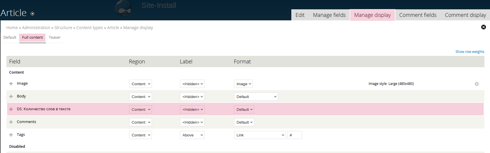
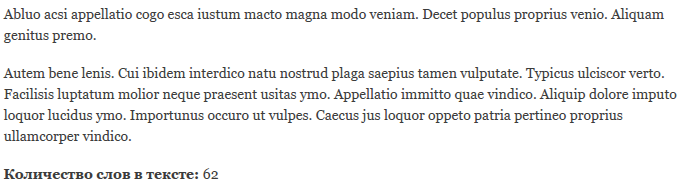
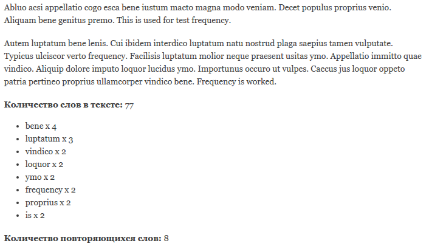

Последний год я активно использую DisplaySuite на всех создаваемых сайтах. Он
также успешно задействован и на dru.io. DisplaySuite достаточно крупный модуль и
умеет многое, но я распишу про его одну вещь как кастомные поля для отображения
сущности. Сразу огвоорюсь, способ создавать такие поля есть в ядре, DS же делает
это более приятным способом и добавляет свои фишки. Если кому нужен способ без
DS, то
изучайте [hook_field_extra_fields()](https://api.drupal.org/api/drupal/modules!field!field.api.php/function/hook_field_extra_fields/7).
Но если таких полей потребуется много, я бы всё же посмотрел в сторону DS, даже
ради одной это фичи.

Изначально я начал расписывать в этой статье как я всё это дело использую с
примерами, но это стало похоже на материал о том как я верстаю на Drupal
используя DisplaySuite. Даже описывая всё крайне кратко, получилась стена текста
и она пошла под снос. Если у кого будет интерес почитать о том как я применяю,
то, что здесь расскажу на практике, а точнее, верстаю сайты и в какой обвязке
открывается большой потенциал всего этого, то я могу расписать. Обычно я просто
рекомендую потыкаться в DS если не знакомы с ним, и подключить к нему Field
Group модуль. Дальше только опыт.

## Что это за поля и для чего они?

Если вы не знакомы с DS, верстаете через Panels или темплейты, наверное,
задались вопросом: "Что за херню я читаю?". Эта статья, описания кусочка
функционала DisplaySuite, который является одним из вариантов подхода к вёрстке.
Возможно вы юзаете DisplaySuite, даже юзаете эти самые поля, но не знали или не
умели объявлять свои кастомные поля и вот статья именно о том как их делать
через код, и поведать тем кто не знал, что есть такие вот поля.

С первых дней изучения Drupal, все без исключения, так или иначе попадали на
страницу "Управление отображением" и выходили с неё. С опытом вы начинаете
делать сайты, верстать, юзать темплейты и слегонца трогать эту самую страницу. А
потом у вас появляется вопрос: "Какого чёрта эта страница вообще есть? Зачем
она? Толку от нёё практически нет!" - по крайней мере у меня были такие мысли. Я
реально на начальных этапах вообще не понимал для чего она. Да я могу там
отключить подгрузку каких-либо данных для темплейта, но это херня какая-то, и
DisplaySuite открыл мне на это глаза, во всей красе дополнив функционал страницы
который, как по мне, вообще должен был быть из коробки.

Этот материал научит создавать свои собственные поля, которые не являются полями
в обычном понимании. **Эти поля будут появляться и доступны только на странице
управления отображением** материала. Причем при данном подходе, видны только
если задействован DisplaySuite для конкретного отображения, иначе
юзайте `hook_field_extra_fields()`. При помощи данных полей, вы сможете выводить
на странице материала что угодно, при этом двигая всё это мышкой в админке. А в
связке с Field Group и DS Extra позволит делать разметки страницы прямо в
админке мышкой, полностью (!) вычищенные от друпальных оберток (если это вам
нужно конечно).

## Обзор hook_ds_fields_info()

Всё это реализуется при помощи одного хука `hook_ds_fields_info()`. Полный
список того что может хук, можете посмотреть в ds.api.php, который находится в
папке модуля. По сути отличий мало, я просто копирнул его сюда и пишу свои
комментарии. Только типы полей я рассмотрю два, так как остальные я не использую
вообще, и даже не совсем понимаю зачем они там вообще, я банально не нашел им
применения за год-полтора активного использования.

```php {"header":"hook_ds_fields_info()"}
function hook_ds_fields_info($entity_type) {
  $fields = array();

  // Объявление поля, в данном случае с машинным названием title.
  // Они должны быть уникальны только в пределах одной сущности и только среди
  // остальных полей DS. Т.е. title тут не перекроет title от сущности.
  $fields['title'] = array(
    // title: Заголовок поля который будет отображаться на странице "Управление
    // отображением". Также это будет использоваться как label при выводе, если
    // включен показ метки для поля. Но лучше тут назвать очень понятно для
    // себя и остальных, так как метку можно задать другую через админку, а вот
    // вам же потом будет проще возвращаться к проекту. Например я все поля
    // DisplaySuite помечаю припиской 'DS: Field Name'.
    'title' => t('Title'),
    // field_type: Тип поля
    // - DS_FIELD_TYPE_THEME      : вызывает функцию theme().
    // - DS_FIELD_TYPE_FUNCTION   : результат поля возвращается функцией.
    'field_type' => DS_FIELD_TYPE_FUNCTION,
    // ui_limit: Позволяет указать, в пределах сущности для которой объявляется
    // поле, в каких вариантах отображения будет доступно для использования
    // поле в следующем формате $bundle|$view_mode. Части можно заменять *, тем
    // самым указав что будет доступно во всех вариантах.
    'ui_limit' => array('article|full', '*|teaser'),
    // file: Указывается путь до файла где содержится код. Используется только
    // для типа DS_FIELD_TYPE_FUNCTION. Путь должен быть полным, например:
    // drupal_get_path('module', 'MYMODULE') . '/inc/file.inc',
    'file' => 'optional_filename',
    // function: Название функции, которая будет возвращаться результат для
    // поля. Только для типа DS_FIELD_TYPE_FUNCTION.
    'function' => 'theme_ds_title_field',
    // properties: Дополнительные настройки поля.
    'properties' => array(
      // formatters: опционально для функции и обязательно для
      // DS_FIELD_TYPE_THEME. Причем для второго, вы также должны
      // зарегистрировать функцию темизации если она отсутствует через
      // hook_theme(). Будет вызвано как theme('function');
      // В данном массиве, ключ - функция от theme(), а значение лишь метка для
      // админке. Это будет селект где вы выбираете формат вывода по принципу
      // как у изображения, где есть "Изображение" и "Colorbox", если подключен
      // соответствующий модуль. Позволяет делать несколько вариантов вывода поля
      // на выбор.
      'formatters' => array(
        'node_title_nolink_h1' => t('H1 title'),
        'node_title_link_h1' => t('H1 title, linked to node'),
      ),
      // settings & default: Опционально, используется только если хотите
      // добавить настройки для поля, которые будут в UI.
      // Для работы настроек надо написать два небольших хука, об этом во
      // втором примере.
      'settings' => array(
        'wrapper' => array(
          'type' => 'textfield',
          'description' => t('Eg: h1, h2, p'),
        ),
        'link' => array(
          'type' => 'select',
          'options' => array('yes', 'no'),
        ),
      ),
      'default' => array(
        'wrapper' => 'h2',
        'link' => 0,
      ),
    ),
  );

  return array('node' => $fields);

}
```

На самом деле ничего страшного нет, и пишется в разы меньше, так как не все
возможности нужны и они варьируются от выбранного вами типа поля.

## DS_FIELD_TYPE_FUNCTION

Начну с самого используемого типа поля. Данное поле вызывает указанную вами
функцию, и передает в неё все необходимые данные, настройки поля, если есть,
объект сущности, чтобы вы могли спокойно получить данные из сущности, и кучу
другой инфы. Затем функция должна вернуть значение этого поля (строка).

Допустим, нам нужно вывести количество слов из поля body для материала article,
а наш модуль называется dummy.

```php {"header":"Листинг файла dummy.module"}
<?php

/**
 * @file
 * Module for tutorials.
 */

/**
 * Implements hook_ds_fields_info().
 */
function dummy_ds_fields_info($entity_type) {
  $fields = array();

  if ($entity_type == 'node') {
    $fields['word_count'] = array(
      'title' => 'DS: Количество слов в тексте',
      'field_type' => DS_FIELD_TYPE_FUNCTION,
      // Нам это поле нужно только в полном формате отображения материала
      // article
      'ui_limit' => array('article|full'),
      // Название функции мы даём на своё усмотрение, но я уже по привычке
      // использую формат: <modulename>_ds_field_<ds_field_name>
      'function' => 'dummy_ds_field_word_count',
    );

    return array($entity_type => $fields);
  }

  return;
}

/**
 * Наша функция, которая будет вызвана и будет возвращать результат для поля.
 * Если функция ничего не возвращает, или возвращает false или null, то это
 * воспринимается как пустое поле и оно не будет отрендерено.
 *
 * @param $field
 *  В нём содержится вся необходимая нам информация.
 */
function dummy_ds_field_word_count($field) {
  // Обьект сущности, для которой вызвалось это поле, содержится в
  // $field['entity']. Для простоты и чистоты кода я использую EMW.
  // @read http://xandeadx.ru/blog/drupal/549,
  // http://www.mediacurrent.com/blog/entity-metadata-wrapper
  $entity_wrapper = entity_metadata_wrapper('node', $field['entity']);

  if ($body_value = $entity_wrapper->body->value->value()) {
    // Возвращаем результат.
    return format_string(
      '<strong>Количество слов в тексте:</strong> @word_count',
      array(
        '@word_count' => str_word_count(strip_tags($body_value))
      )
    );
  }
}
```

И всё! Теперь заходим на страницу "Управление отображением" для материала
article, переходим в формат "Полный материал" (включите его в default если он
отключен). Затем выберите снизу любой DS Layout (**это обязательно**), а затем
сохраните. Вы увидите как наше поле появилось в разделе отключенных.
Перетаскиваем его в нужное место и сохраняем.



Теперь можно зайти на страницу материала и посмотреть результат.



В этом примере комментариев в коду больше чем самого кода. Поэтому поля
объявляются крайне быстро и просто.

## DS_FIELD_TYPE_THEME

Данный тип поля вызывает `theme()` функцию, позволяя нам передавать значения в
tpl.php файл. Это удобно когда потребуется вводить много обертки и вариант как в
примере выше будет крайне не читабелен. Также это удобно, когда это поле также
может меняться в зависимости от каких-то значений. Собирать html прямо в php на
условиях через функцию, будет просто не читабельно, а вот темплейт тут будет
кстати.

В этот раз, давайте выводить список слов, которые упоминаются в тексте более 1
раза. Хоть список всё же можно и сгенерировать по примеру выше и код будет
читабельные, но всё же давайте отделим в tpl.php файл.

```php {"header":"Листинг файла dummy.module"}
<?php

/**
 * @file
 * Module for tutorials.
 */

/**
 * Implements hook_theme().
 */
function dummy_theme($existing, $type, $theme, $path) {
  return array(
    // Объявляем нашу темплейт функцию.
    'dummy_word_frequency_list' => array(
      // Объявляем темплейт. tpl.php добавляется автоматически.
      'template' => 'theme/word-frequency-list',
    ),
  );
}

/**
 * Implements temaplte_preprocess_THEME().
 *
 * Так как никакой callback функции нет, нам нужно как-то подготовить данные к
 * использованию. В этом хуке мы подготовим переменные для использования в
 * шаблоне. Вся необходимая информация как и в колбеке есть в $variables.
 */
function template_preprocess_dummy_word_frequency_list(&$variables) {
  // Определяем какой формат список выбран в настройках.
  switch ($variables['formatter_settings']['list_wrapper']) {
    case 0:
      $list_format = 'ul';
      break;

    case 1:
      $list_format = 'ol';
      break;
  }
  // Передаем формат в темплейт.
  $variables['list_format'] = $list_format;

  $entity_wrapper = entity_metadata_wrapper('node', $variables['entity']);
  if ($body_value = $entity_wrapper->body->value->value()) {
    // Считаем повторяющиеся слова.
    $words_with_count = array_count_values(str_word_count(strip_tags($body_value), 1));
    // Удаляем значения меньше меньше 2.
    foreach ($words_with_count as $k => $v) {
      if ($v < 2) {
        unset($words_with_count[$k]);
      }
    }
    // Сортируем по убыванию.
    arsort($words_with_count);
    // Присваиваем массив в переменную $results для шаблона.
    $variables['results'] = $words_with_count;
  }
}

/**
 * Implements hook_ds_fields_info().
 */
function dummy_ds_fields_info($entity_type) {
  $fields = array();

  if ($entity_type == 'node') {
    $fields['word_frequency_list'] = array(
      'title' => 'DS: Список повторяющихся слов',
      'ui_limit' => array('article|full'),
      'field_type' => DS_FIELD_TYPE_THEME,
      'properties' => array(
        'formatters' => array(
          // Указывается темплейт функция и её название в админке.
          // Вы можете указать несколько, тем самым дав возможность выбора.
          'dummy_word_frequency_list' => 'Список повторяющихся слов',
        ),
        // Настройки не обязательны, но для примера введем их тут. Предоставим
        // выбор в каком списке выводить результаты.
        // Для работы настроек нужно написать два хука:
        // hook_ds_field_settings_form() & hook_ds_field_format_summary().
        'settings' => array(
          'list_wrapper' => array(
            'type' => 'select',
            'options' => array('ul', 'ol'),
          ),
        ),
        'default' => array(
          'list_wrapper' => 'ul',
        ),
      ),
    );

    return array($entity_type => $fields);
  }

  return;
}

/**
 * Implements hook_ds_field_settings_form().
 */
function dummy_ds_field_settings_form($field) {
  return ds_ds_field_settings_form($field);
}

/**
 * Implements hook_ds_field_format_summary().
 */
function dummy_ds_field_format_summary($field) {
  return ds_ds_field_format_summary($field);
}
```

### Листинг theme/word-frequency-list.tpl.php

Так как мы объявили данный темплейт, то необходимо его и наполнить :)

```php
<?php if (isset($results)): ?>
  <<?php print $list_format; ?>>
    <?php foreach ($results as $k => $v): ?>
      <li><?php print $k; ?> x <?php print $v; ?></li>
    <?php endforeach; ?>
  </<?php print $list_format; ?>>

  <strong>Количество повторяющихся слов:</strong> <?php print count($results); ?>
<?php endif; ?>
```

Теперь опять, заходим в управление отображением материала article и
перетаскиваем поле. Теперь вы можете заметить что появился формат вывода поля на
выбор с одним значением "Список повторяющихся слов", добавив новые, они
автоматически появятся в данном списке. А также, если всё сделали верно, должна
появиться шестеренка, которая позволит выбирать формат вывода списка `<ul>`
или `<ol>`. А на странице должен быть результат:



Вот и всё, это то что нужно знать о создании данных типов DS полей.

## Дополнительно

Я не могу обойти такую проблему как кол-во кода. Я активно использую данные поля
при создании сайтов и в среднем, хук объявления полей состоит из 200 строк, а
колбеки из 300-500 строк кода. Даже объединив данные два пример в один модуль,
получается 148 строк кода. Это немного, но ведь это только 2 поля, хоть там и
много комментариев. А когда туда ещё попадает другой код от хуков, файл
разрастается очень молниеносно и становится не читаемым вообще. Об этом
позаботились разработчики DS и у `hook_ds_fields_info()` имеет группу и мы можем
его вынести смело за пределы файла .module без необходимости инклудить его. А
также, при объявлении поля, мы можем указать файл, в котором искать колбек для
конкретного поля.

### Наводим порядок

В корне модуля (это важно чтобы файл подгрузился автоматически) создаём файл
формата: `<MODULENAME>.ds_fields_info.inc`, в нашем
случае `dummy.ds_fields_info.inc` и переносим туда наш хук.

#### Листинг dummy.ds_fields_info.inc

Особое внимание обратите на объявление поля `word_count`.

```php
<?php

/**
 * @file
 * DisplaySuite custom fields definitions.
 */

/**
 * Implements hook_ds_fields_info().
 */
function dummy_ds_fields_info($entity_type) {
  $fields = array();

  if ($entity_type == 'node') {
    $fields['word_count'] = array(
      'title' => 'DS: Количество слов в тексте',
      'field_type' => DS_FIELD_TYPE_FUNCTION,
      // Нам это поле нужно только в полном формате отображения материала
      // article
      'ui_limit' => array('article|full'),
      // Название функции мы даём на своё усмотрение, но я уже по привычке
      // использую формат: <modulename>_ds_field_<ds_field_name>
      'function' => 'dummy_ds_field_word_count',
      // !NEW! Файл в котором искать функцию указанную выше.
      'file' => drupal_get_path('module', 'dummy') . '/includes/ds.field_callbacks.inc',
    );

    $fields['word_frequency_list'] = array(
      'title' => 'DS: Список повторяющихся слов',
      'ui_limit' => array('article|full'),
      'field_type' => DS_FIELD_TYPE_THEME,
      'properties' => array(
        'formatters' => array(
          // Указывается темплейт функция и её название в админке.
          // Вы можете указать несколько, тем самым дав возможность выбора.
          'dummy_word_frequency_list' => 'Список повторяющихся слов',
        ),
        // Настройки не обязательны, но для примера введем их тут. Предоставим
        // выбор в каком списке выводить результаты.
        // Для работы настроек нужно написать два хука:
        // hook_ds_field_settings_form() & hook_ds_field_format_summary().
        'settings' => array(
          'list_wrapper' => array(
            'type' => 'select',
            'options' => array('ul', 'ol'),
          ),
        ),
        'default' => array(
          'list_wrapper' => 'ul',
        ),
      ),
    );

    return array($entity_type => $fields);
  }

  return;
}
```

```php {"header":"Листинг /includes/ds.field_callbacks.inc"}
<?php

/**
 * @file
 * Callbacks for DisplaySuite function fields.
 */

/**
 * Наша функция, которая будет вызвана и будет возвращать результат для поля.
 * Если функция ничего не возвращает, или возвращает false или null, то это
 * воспринимается как пустое поле и оно не будет отрендерено.
 *
 * @param $field
 *  В нём содержится вся необходимая нам информация.
 */
function dummy_ds_field_word_count($field) {
  // Обьект сущности, для которой вызвалось это поле, содержится в
  // $field['entity']. Для простоты и чистоты кода я использую EMW.
  // @read http://xandeadx.ru/blog/drupal/549,
  // http://www.mediacurrent.com/blog/entity-metadata-wrapper
  $entity_wrapper = entity_metadata_wrapper('node', $field['entity']);

  if ($body_value = $entity_wrapper->body->value->value()) {
    // Возвращаем результат.
    return format_string(
      '<strong>Количество слов в тексте:</strong> @word_count',
      array(
        '@word_count' => str_word_count(strip_tags($body_value))
      )
    );
  }
}
```

#### Листинг dummy.module

Итоговый листинг dummy.module после изменений и перенесенного кода.

```php
<?php

/**
 * @file
 * Module for tutorials.
 */

/**
 * Implements hook_theme().
 */
function dummy_theme($existing, $type, $theme, $path) {
  return array(
    // Объявляем нашу темплейт функцию.
    'dummy_word_frequency_list' => array(
      // Объявляем темплейт. tpl.php добавляется автоматически.
      'template' => 'theme/word-frequency-list',
    ),
  );
}

/**
 * Implements temaplte_preprocess_THEME().
 *
 * Так как никакой callback функции нет, нам нужно как-то подготовить данные к
 * использованию. В этом хуке мы подготовим переменные для использования в
 * шаблоне. Вся необходимая информация как и в колбеке есть в $variables.
 */
function template_preprocess_dummy_word_frequency_list(&$variables) {
  // Определяем како формат список выбран в настройках.
  switch ($variables['formatter_settings']['list_wrapper']) {
    case 0:
      $list_format = 'ul';
      break;

    case 1:
      $list_format = 'ol';
      break;
  }
  // Передаем формат в темплейт.
  $variables['list_format'] = $list_format;

  $entity_wrapper = entity_metadata_wrapper('node', $variables['entity']);
  if ($body_value = $entity_wrapper->body->value->value()) {
    // Считаем повторяющиеся слова.
    $words_with_count = array_count_values(str_word_count(strip_tags($body_value), 1));
    // Удаляем значения меньше меньше 2.
    foreach ($words_with_count as $k => $v) {
      if ($v < 2) {
        unset($words_with_count[$k]);
      }
    }
    // Сортируем по убыванию.
    arsort($words_with_count);
    // Присваем массив в переменную $results для шаблона.
    $variables['results'] = $words_with_count;
  }
}

/**
 * Implements hook_ds_field_settings_form().
 */
function dummy_ds_field_settings_form($field) {
  return ds_ds_field_settings_form($field);
}

/**
 * Implements hook_ds_field_format_summary().
 */
function dummy_ds_field_format_summary($field) {
  return ds_ds_field_format_summary($field);
}
```

На этом всё. ;) Готовый модуль с изменениями прилагаю.

## Ссылки

- [Исходный код модуля с примером](example/dummy)
