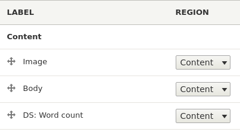
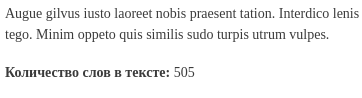
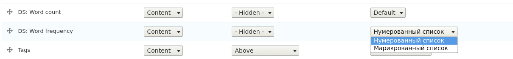
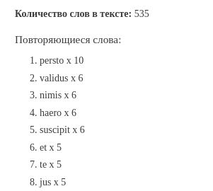
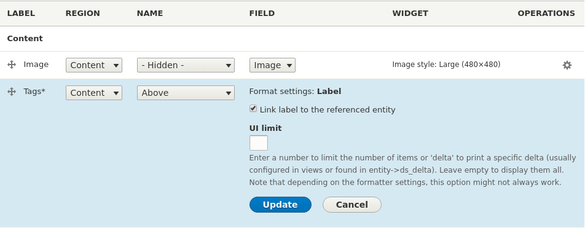
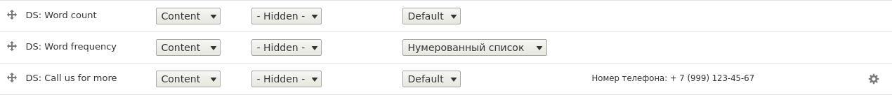
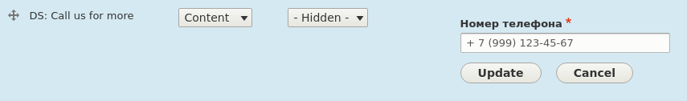
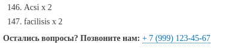

В прошлой статье я
написал [как создавать собственные DisplaySuite поля в Drupal 7][d7-create-display-suite-field].
После я решил посмотреть и разобраться как они работают в Drupal 8. И в этой
статье я уже расскажу как создать те же самые поля, но в реалиях Drupal 8.

## Что поменялось и как работают

Изменился подход. Теперь, как и большинство других хуков, hook_ds_fields_info()
заменён системой плагинов. Это реально удобнее и позволяет сохранять модуль
понятным и чистым. Это, к слову, решает проблему переизбытка кода в файле о
котором я рассказывал в статье для D7.

Display Suite предоставляет два типа плагинов `DsField` и `DsFieldTemplate`.
Обратите внимание, что для создания полей используется _только_ `DsField`. Вы
можете подумать что `DsFieldTemplate` это замена `DS_FIELD_TYPE_THEME`, но это
не так. Этот тип плагинов позволяет объявлять обработчики полей. Если вы знакомы
с DS, вы видели что есть возможность выбора Field Template после активации
соответствующей функции. После этого появлялся выбор: Full reset, Expert,
Minimal - вот это они и есть, а этот тип плагина позволяет добавлять их туда. *
*Все поля теперь объявляются через один плагин**.

Поля для DisplaySuite хранятся по адресу `src/Plugin/DsField`, у каждого поля
свой файлик который содержит класс, который, в свою очередь, наследуется
от `DsFieldBase`. Также, новой особенностью является то, что в D7 поле
возвращало строку со значением, в D8 поле должно возвращать render array, и если
вы хотите вернуть строку, то возвращать придется render array с markup. В
основном концепция осталась прежней, но вот подход соответственно изменился.

Так как типов полей теперь нет вообще, все зависит от того что вы хотите
вернуть, то я приведу просто разные примеры с демонстрацией различных
возможностей.

*P.s. далее по коду подразумевается что модуль, в котором пишется код,
называется dummy*.

## Пример №1 - набор минимум

В данном примере показан набор минимум. В котором мы объявляем поле и выводим
данные в нём, работая с сущностью.

Давайте создадим поле для материала `article`, которое будет выводить количество
слов в материале.

Информация о поле указывается как и у всех в аннотации к классу. Плагин
принимает следующие данные:

* **id**: машинное имя поля. В нижнем регистре, латинские буквы и знак
  подчеркивания.
* **title**: Человекопонятное имя поля, просто лейбл для админки.
* **entity_type**: Название сущности для которой применимо поле. Сущность одна!
* **provider**: Указываем кто предоставляет поле, в данном случае название
  нашего модуля.
* **ui_limit**: bundle|view_mode - указываем на каких подтипах сущности и его
  форматах вывода будет доступно поле. Используйте знак * для значения 'all'.
  Несколько значений указываются в следующем
  формате: `{"article|teaser", "news|*", "*|*"}`

```php {"header":"Листинг файла src/Plugin/DsField/WordCount.php"}
<?php

namespace Drupal\dummy\Plugin\DsField;

use Drupal\ds\Plugin\DsField\DsFieldBase;
use Drupal\Component\Render\FormattableMarkup;

/**
 * Поле которое выводит количество слов в содержимом.
 *
 * @DsField(
 *   id = "word_count",
 *   title = @Translation("DS: Word count"),
 *   provider = "dummy",
 *   entity_type = "node",
 *   ui_limit = {"article|full"}
 * )
 */
class WordCount extends DsFieldBase {
  /**
   * {@inheritdoc}
   *
   * Метод который должен вернуть результат для поля.
   */
  public function build() {
    // Записываем для удобства объект текущей сущности в переменную.
    $entity = $this->entity();
    // Проверяем есть ли значение в поле body. Если поле ничего не вернет
    // это воспринимается как пустое поле и оно не выводится.
    if ($body_value = $entity->body->value) {
      return [
        '#type' => 'markup',
        '#markup' => new FormattableMarkup(
          '<strong>Количество слов в тексте:</strong> @word_count',
          [
            '@word_count' => str_word_count(strip_tags($body_value))
          ]
        )
      ];
    }
  }
}
```

Теперь заходим в управление отображением типа материала article, формат вывода "
Full content", и там должно появиться поле.



На странице материала теперь будет выводиться количество слов в тексте:



_Разумеется это не весть текст на скрине ;)_

Если оно у вас не появилось, сбросьте кэш `drush cr` или перейдите по
url `/core/rebuild.php`. Если вы не отключали кэширование,
советую [сделать отключение кэширование бэкенда](https://github.com/Niklan/Trash/blob/master/Drupal/8.x/disable_cache.md).

## Пример №2 - выбор формата

Для добавления своих форматов мы должны добавить метод `formatters()`.

В D7 у поля типа `DS_FIELD_TYPE_THEME` была возможность указания форматов
вывода, данные форматы становятся на выбор в админке, по принцппу как, например,
у поля body, где вы вбираете выводить полный текст или обрезанный. В отличии от
D7, в D8 не требуется объявлять одноименную theme функцию, которая будет вызвана
при выборе соответствующего формата. Основываясь на том что вывод будет через
render array, то вы можете использовать уже существующие theme функции, или же
объявить свои для конкретных случаев. Говоря проще, theme функция объявляется
при необходимости.

Теперь мы создадим поле, в котором будем выводить список слов из текста, которые
употребляются в нём более одного раза. Также предоставим выбор списка,
маркированный или нумерованный - это и будет формат вывода.

```php {"header":"Листинг src/Plugin/DsField/WordFrequency.php"}
<?php

namespace Drupal\dummy\Plugin\DsField;

use Drupal\ds\Plugin\DsField\DsFieldBase;

/**
 * Поле выводит список повторяющихся слов из поля body.
 *
 * @DsField(
 *   id = "word_frequency",
 *   title = @Translation("DS: Word frequency"),
 *   provider = "dummy",
 *   entity_type = "node",
 *   ui_limit = {"article|full"}
 * )
 */
class WordFrequency extends DsFieldBase {

  /**
   * {@inheritdoc}
   * Это наш собственный метод в котором мы подготавливаем массив с
   * повторящимися полями и их количеством повторений. Сделано это лишь для
   * поддержания чистоты кода и читабельности, это не обязательный метод.
   */
  public function prepareWordFrequencyArray() {
    $entity = $this->entity();
    if ($body_value = $entity->body->value) {
      # Получаем весь список повторяющихся слов.
      $words_with_count = array_count_values(str_word_count(strip_tags($body_value), 1));
      # Удаляем значения меньше меньше 2.
      foreach ($words_with_count as $k => $v) {
        if ($v < 2) {
          unset($words_with_count[$k]);
        }
      }
      # Сортируем по убыванию.
      arsort($words_with_count);
      # Теперь нам надо создать массив со значениями, чтобы было проще отдавать
      # на рендер. Нам нужен чтобы ключ был любым а значение: "Слово х N".
      $results = [];
      foreach ($words_with_count as $word => $count) {
        $results[] = $word . ' x ' . $count;
      }
      # Возвращаем результат.
      return $results;
    }
  }

  /**
   * {@inheritdoc}
   */
  public function formatters() {
    # Возвращаем массив с возможными форматами: ключ => метка.
    return ['ol' => 'Нумерованный список', 'ul' => 'Маркированный список'];
  }

  /**
   * {@inheritdoc}
   */
  public function build() {
    $config = $this->getConfiguration();
    # Записываем выбранный формат в переменную.
    $list_type = $config['field']['formatter'];
    return [
      '#theme' => 'item_list',
      '#title' => 'Повторяющиеся слова:',
      '#items' => $this->prepareWordFrequencyArray(),
      '#list_type' => $list_type,
    ];
  }
}
```

В админке должен появиться выбор формата вывода:



Ну а при заходе на страницу, должны увидеть список:



## Пример №3 - форма с настройками

Также у нас есть возможность объявлять форму с настройками для нашего поля.
Чтобы какие-то данные пользователи могли менять прямо в админке. С этим нам
поможет справиться метод `settingsForm()`, в котором мы и объявим форму
настроек. Также тут есть ещё один метод `settingsSummary()`, он позволяет
выводить краткую справку о настройках на странице полей, без необходимости
раскрывать форму. Это очень удобно и полезно, только сразу оговорюсь, в
методе `settingsSummary()` отсутствуют форматы поля, поэтому они пригодны
исключительно для вывода значений настроек или собственной информации.



На картинке выше, поле Tags раскрыто, и перед нами форма с настройками для поля,
а поля выше, Image, в столбце Widget выводится краткая информация о выбранных
настройках для данного поля - это как раз и есть `settingsSummary()`.

Теперь перейдем непосредственно к практической части. Пример может тупой, но
лучше ничего не придумал. Допустим у нас на сайте есть какой-то раздел, например
услуги, и клиент хочет чтобы под каждым материалом была справка типа: "Остались
вопросы? Позвоните нам +7 (999) 123-45-67". В данном случае DS отличное для
этого решение, в добавок, мы можем вынести номер телефона в настройки данного
поля, чтобы в дальнейшем, кто будет управлять сайтом, без проблем мог его
поменять. При этом не нужны никакие страницы с настройками, а также не придется
хардкодить в темплейтах. Также в любой момент это позволит поменять позицию или
вовсе отключить данную информацию.

```php {"header":"Листинг файла src/Plugin/DsField/CallusForMore.php"}
<?php

namespace Drupal\dummy\Plugin\DsField;

use Drupal\Component\Render\FormattableMarkup;
use Drupal\ds\Plugin\DsField\DsFieldBase;
# Необходимо для формы.
use Drupal\Core\Form\FormStateInterface;

/**
 * Поле которое выводит количество слов в содержимом.
 *
 * @DsField(
 *   id = "call_us_for_more",
 *   title = @Translation("DS: Call us for more"),
 *   provider = "dummy",
 *   entity_type = "node",
 *   ui_limit = {"article|full"}
 * )
 */
class CallUsForMore extends DsFieldBase {

  /**
   * {@inheritdoc}
   *
   * Задаем настройки по умолчанию.
   */
  public function defaultConfiguration() {
    $config = [
      'telephone' => '+7 (999) 123-45-67',
    ];
    return $config;
  }

  /**
   * {@inheritdoc}
   * Данный метод должен возвращать форму в соответствии с Form API.
   */
  public function settingsForm($form, FormStateInterface $form_state) {
    # Получаем конфигурацию
    $config = $this->getConfiguration();
    # Название элемента формы должно равняться ключу в конфигах.
    $form['telephone'] = [
      '#type' => 'tel',
      '#title' => 'Номер телефона',
      '#default_value' => $config['telephone'],
      '#required' => TRUE,
    ];
    return $form;
  }

  /**
   * {@inheritdoc}
   *
   * В общем списке полей выводим информацию о номере телефона, чтобы не
   * приходилось загружать форму для проверки. Каждое значение массива будет
   * выводиться с новой строки.
   */
  public function settingsSummary($settings) {
    $config = $this->getConfiguration();
    return ['Номер телефона: ' . $config['telephone']];
  }

  /**
   * {@inheritdoc}
   */
  public function build() {
    # Получаем настройки с нашим телефоном.
    $config = $this->getConfiguration();
    return [
      '#type' => 'markup',
      '#markup' => new FormattableMarkup(
        '<strong>Остались вопросы? Позвоните нам:</strong> <a href="tel:@phone">@phone</a>',
        [
          '@phone' => $config['telephone'],
        ]
      )
    ];
  }
}
```

Теперь заходим в настройки отображения и видим что у нас выводится номер
телефона, который указан в настройках:



А если мы нажмём на шестерёнку у данного поля, то у нас откроется наша форма с
настройками:



А вот так это выводится в самом материале:



Вот и всё! Рассмотрел все основные методы для формирования поля. Как по мне, так
подход в D8 на голову превосходит создание полей для D7. Он быстрее, проще и
понятнее.

[d7-create-display-suite-field]: ../../../../2016/03/29/d7-create-display-suite-field/index.ru.md
