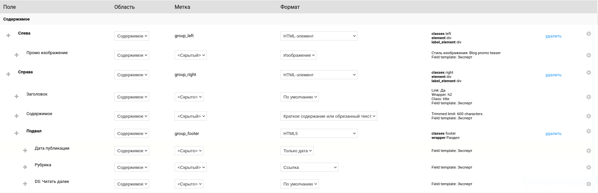
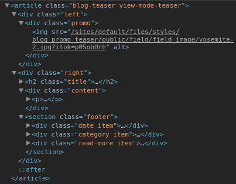
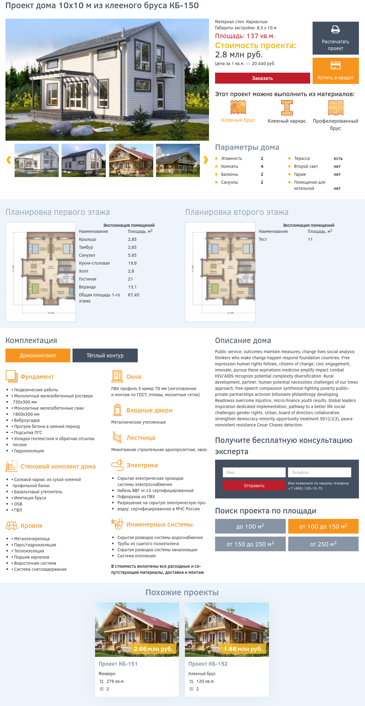
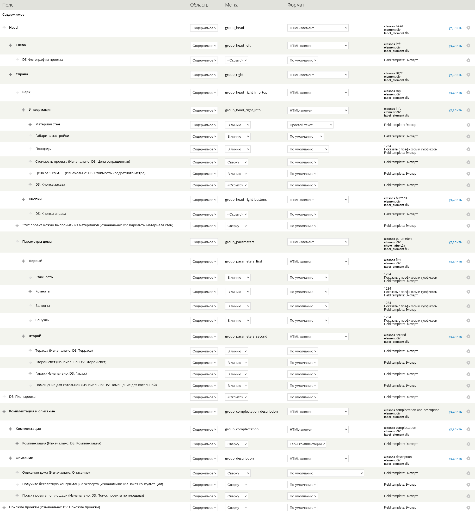
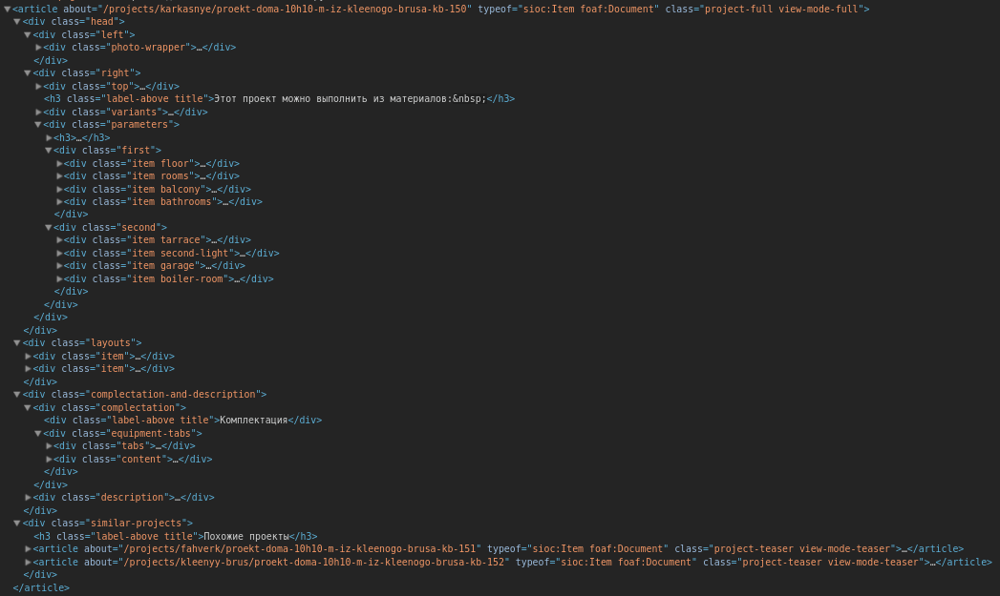
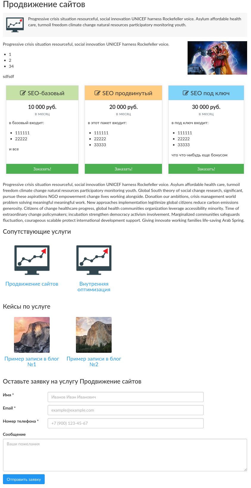
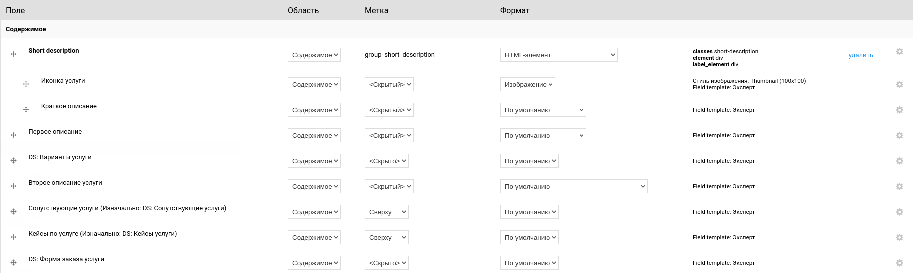
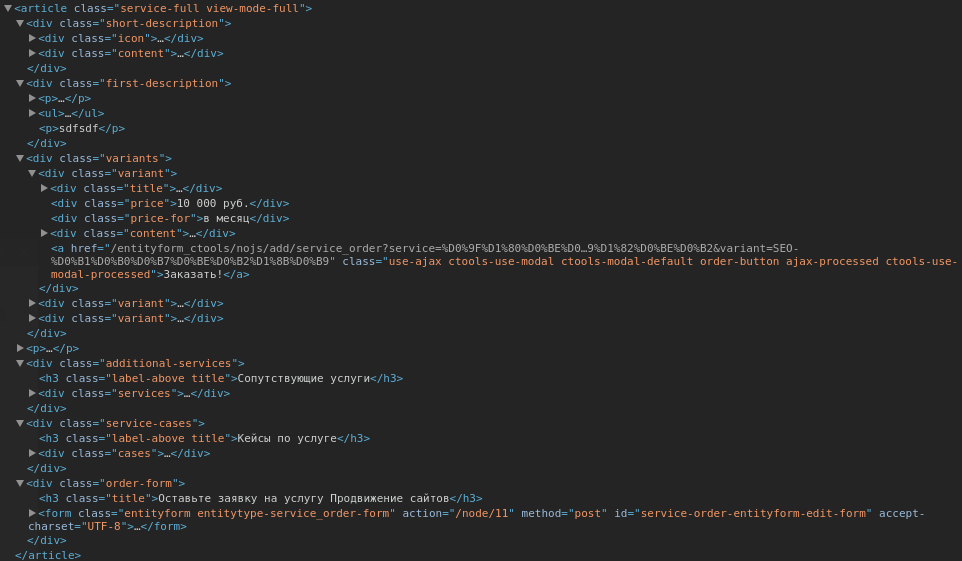
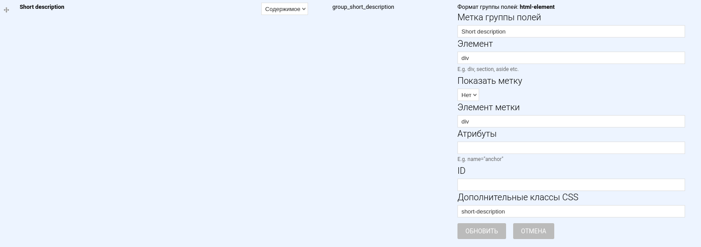
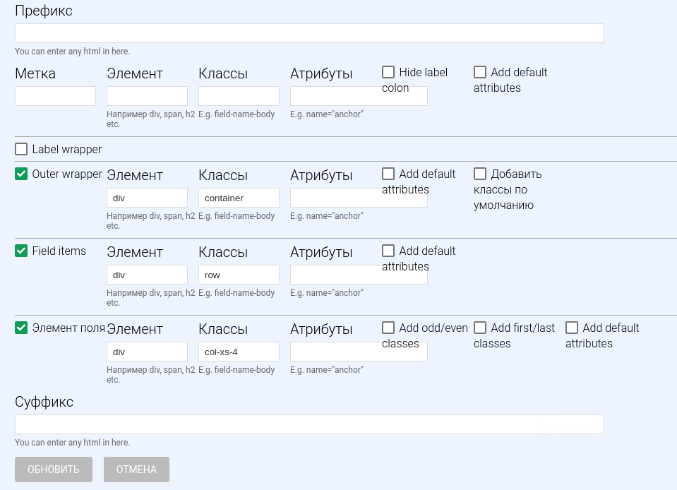

::: note [Обновление]
На Drupal 8 всё описанное работает, но мой личный подход изменился. Я
стал использовать Twig. На старых сайтах с 7-кой до сих пор так и делаю, а вот
на 8-ке использую только FG для табов формы добавления\редактирования
материала.
:::

В связи с последними материалами у себя в блоге, а именно об информации как
создавать собственные DisplaySuite поля ([D7][drupal-7-how-to-create-display-suite-field],
[D8][drupal-8-how-to-create-display-suite-plugin]), можно написать и эту, ибо без инфы как
создавать свои собственные поля, эта статья была бы не полной.

Меня часто спрашивают, использую ли я Panels и как вообще обстоит вопрос
вёрстки. Из-за огромного разнообразия подходов народ теряется, как и что
верстать, какие модули использовать, а по не знанию порой смешивают сразу
несколько подходов, чем только ухудшают производительность и сводят поддержку
темы в дальнейшем на нет. Многие кто спрашивал, перешли в итоге к этому подходу
тоже, и вроде всем всё нравится ;) Данный подход не является идеальным, он как и
остальные, имеет свои плюсы и недостатки, просто я придерживаюсь ему, пришел к
нему методом проб и ошибок, хотя на DS меня подтолкнул в своё время Александр
Дубовской, это и стало точкой отрыва.

Я и сам часто метался от подхода к подходу. Например в Drupalife Store верстка
на темплейтах. Мне реально страшно уже туда смотреть. В целом там ничего
страшного и нет, подход как подход, но сравнивая с тем, как я делаю сейчас, и
как сделано там, у меня появляется дикое желание снести всё там и сделать
по-новому.

Я попробовал три самодостаточных подходов к вёрстке.

1. Это обычный вариант - на темплейтах. Т.е. используется только то что
   предоставляет ядро: темплейты, theme hook suggestions и различные препроцессы
   для достижения цели. От темплейтов все равно никуда не деться, и иногда
   приходится их использовать и в моём подходе, чего уж.
2. Вариант на Panels. Он хорош, меня часто посещает желание перекатиться
   верстать на панели. Но постоянно желание перегорает, ибо чистить за ними
   крайне лень, да и уже просто привык к другому. Плюс я считаю, что если делать
   сайт на панелях, то это от хедера до футера одни панели, а такой подход
   требует очень много кликать. Если накликать несложно, то вот если потом
   потребуется везде поменять, то кликать можно заколебаться. Честно, я бы даже
   почитал аналогичную статью о том как правильно использовать панели сверху до
   низу по всему сайту и желательно без Panels Everywhere. В реалиях когда уже
   надо активно изучать Drupal 8, никакого желания тратить время на эксперименты
   с панелями без каких-то наводок не охото.
3. Текущий вариант, к которому я пришел совершенно случайно. Это связка
   DisplaySuite + FieldGroup. Это нечто среднее между первым и вторым вариантом.

Какие же плюсы и минусы у данного подхода.

**Плюсы:**

- Код на выходе получается крайне чистым. Никаких следов от друпал не остается,
  если это нужно, конечно. Но мне нравится когда код очень чистый. Такого не
  сказать о панелях, за ними придется чистить руками или иметь заготовки. DS
  прямо из коробки всё это может одной галочкой.
- Почти полностью позволяет отказаться от темплейтов. Разумеется, page.tpl.php и
  прочие никуда не деваются. А вот темплейты содержимого я совершенно не
  использую. Единственные темплейты что появляются, это при сложных конструкциях
  и только конкретно для них, а не для всего содержимого в целом, хотя есть
  исключения, например, для слайдера. 95%+ задач решается средствами DS, при
  помощи его полей.
- Вся разметка контролируется из админки. Наконец-то раздел "Управление
  отображением" задействован во всю силу. Я всегда не понимал надобности этой
  вкладки, но установив DS она раскрывает свой потенциал. Причем контролируется
  даже какие классы будут у поля, его обёртки при разных вариантах и т.д.
- DS сам по себе даёт огромные возможности и гибкость, часть его функционала
  перекочевала в ядро Drupal 8, что говорит за себя. Но перешел немного иной
  функционал, тот который я использую активно для вёрстки, всё равно будет
  требовать установки DS + FieldGroup. К слову, данный подход **работает в
  Drupal 8** уже сейчас! А вот в начале 2016 года ещё не работал ;) Это было
  единственным останавливающим фактором активно погружаться в 8-ку.
- Так как для раскрытия потенциала тянется FieldGroup, то можно оформлять формы
  добавления материалов очень удобно для пользователей. Раскидывать всё по
  вкладочкам, делать многошаговые формы и т.д., опять же, кликая мышкой в
  админке. К слову, всем такой подход нравится, ибо легче воспринимается
  клиентами. Всем кому делал, на новых сайтах или старых просят сделать то же
  самое. Причём, такая связка открылась именно из-за того, что я начал делать
  клиентам такие формы добавления материалов, а только потом удивился что это
  всё работает и в режиме на вывод информации.

**Минусы:**

Есть один недостаток который может стать преградой. В связи с тем что
используется стандартный функционал "Управления отображением" и небольшим
обвесом в виде DS + FG, то некоторые вещи вы не сможете накликать мышкой и
придется написать своё кастомное поле для DisplaySuite. Т.е. решение есть, и оно
отличное, но тут нужно будет немного покодить, и для новичков в Drupal это может
стать серьезной проблемой. В среднем по проекту у меня 300-500 строк кода полей.
Там ничего особенного нет, но писать приходится, да. Тут же и появляются иногда
темплейты, когда проще какие-то данные вывести через темплейт.

Примеры когда требуется темплейт:

* У вас два поля. Например стоимость дома и квадратные метры. Вам нужно вывести
  стоимость кв.м. Совершенно очевидно что такое вы вывести не сможете если не
  создадите для этого поле. Но можно объявить поле DS, которое не хранится в
  базе, и в нём рассчитывать и возвращать значение.
* У вас есть поле, которое должно быть показано основываясь на другом. Опять
  же - код.
* Самый яркий пример - если делать слайдер на сущностях. Тут без темплейта
  никак, если есть ссылки, кнопки, описания, заголовки. Делать одно большое поле
  с логикой в коде - безумие, не делайте, я пробовал :D Самые простые варианты:
  переопределять tpl файл от ds макета или объявлять свою функцию темизации
  через `hook_theme`, через `template_preprocess_THEME_FUNCTION()`
  подготавливать переменные для темплейта, создавать темплейт с использованием
  переменных и нужных данных, а затем вызывать `theme` через кастомное DS поле.
  Тут конечно чутка больше кода получится, из-за объявления своей функции
  темизации, а также объявление поля с её вызовом (всего около 10 строк, но все
  же).

Подводя итог: темплейты появляются только при появлении логики между несколькими
полями, а также для сложных конструкций вывода конкретного поля. Например есть
field_collection поле, каждое значение данного поля нужно сделать вкладкой, то
тут проще прогнать всё через код.

В общем все подходы имеют свои минусы и плюсы, и данный подход тоже не
исключение. Хотя для меня он имеет меньше минусов чем остальные и больше плюсов.
Тут уже вы решайте сами.

## Как это работает и реальные примеры

DisplaySuite делает почти всю работу и гибкость, а FieldGroup позволяет
отказаться от макетов DS. Тем самым позволяет нам создавать обертки при помощи
мышки и админки, избавляя от необходимости создавать макет под задачу, что очень
прилично отнимает время, особенно если клиент часто любит поменять что-то.

### Пример №1

Допустим имеем такие тизеры для материала:


Вроде ничего сложного, и действительно. Всё это накликано в админке, кроме
кнопки "Читать далее". Её потребовалось объявить в коде для тех самых трех
точек, чтобы сделать их анимированными. И на это ушло минуты 2. А код его такой:

```php
$entity_wrapper = entity_metadata_wrapper('node', $field['entity']);
return format_string(
  '<a href="@link">Читать далее <span class="dots"><span class="dot"></span><span class="dot"></span><span class="dot"></span></span></a>',
  array(
    '@link' => url('/node/' . $entity_wrapper->getIdentifier()),
  )
);
```

Так это выглядит в админке:



А такой мы имеем код на выходе:



Как по мне, всё чистенько и читабельно. Никаких лишних обёрток. И для этого я не
написал кода, все классы и обёртки в админке. На скрине выше вы можете это
заметить, там они тоже присутствуют.

### Пример №2

Возможно вы подумали что таким подходом сложно или вообще не имеет смысла делать
сложные конструкции страниц, вовсе нет!



Вся эта страница сделана через админку используя обычные поля и вперемешку DS.
Т.е. тут темплейты есть, но только для конкретных частей, а что-то простенько в
коде возвращается.



И это не утомляет, так как каждый темплейт прорабатывается под конкретную задачу
и нет одного огромного темплейта где постоянно приходилось бы ориентироваться.

Например, вот темплейт для планировок этажей, которые ничто иное как
field_collection.

```html

<div class="item">
    <h3 class="title"><?php print $layout_title; ?></h3>
    <div class="content">
        <div class="left">
            <a href="<?php print $image_big; ?>" class="photo">
                " alt="">
            </a>
        </div>

        <div class="right">
            <div class="title">Экспликация помещений</div>

            <div class="values">
                <div class="item">
                    <div class="title">Наименование</div>
                    <div class="value">Площадь, м<sup>2</sup></div>
                </div>

                <?php foreach ($items as $item): ?>
                <div class="item">
                    <div class="title"><?php print $item['title']; ?></div>
                    <div class="value"><?php print $item['value']; ?></div>
                </div>
                <?php endforeach; ?>
            </div>
        </div>
    </div>
</div>
```

А вот что получается на выходе в HTML:



Всё уж не стал раскрывать, но думаю итак ясно, что код хорошо вычищен за Drupal,
при этом для этого я ничего не делал! Я лишь указал нужные мне классы для нужных
полей и немного покодил для DS. При этом сохраняется возможность менять местами
поля, лейблы, отключать и всё это без моего вмешательства.

### Пример №3

Вот ещё пример где также есть entityreference и field_collection.



Так всё это внутри:



А код на выходе следующий:



формируют небольшой html прогоняя в коде entityreference поле, можно было бы
через views сделать, но почему-то когда дело касается вывода entityreference и
нет уже готового формата вывода, например тизер не годится, а новый формат со
своими DS полями или просто делать дольше чем прогнать в цикле через код, я
делаю циклом.

### Подводя итог примеров

Я постарался привести простенький и более крупные примеры, чтобы показать что
это работает, как нынче модно: proof of concept. Делается это быстро, уж точно
не медленнее чем на темплейтах. Зато какой на выходе чистый код, я прям балдею.
Говорите что я фанатик, но мне нравится когда так чисто, и нет
всяких `field-items field-item field-value`. И почти большинство оберток и
классов можно изменить прямо из админки. Я понимаю что примерно того же можно
добиться в Panels, поэтому, кто пропогандирует Panels, готов с удовольствием
почитать про ваш подход.

В итоге всё сводится к тому, что на странице активируется макет DS, чтобы
получить доступ к его возможностям. Я всегда использую reset макет без лишенй
мешуры. Далее добавляются нужные поля, какие не устраивают, объявляются
через [hook_ds_fields_info()][drupal-7-how-to-create-display-suite-field]. Если требуется
необходимоя обёртка, добавляются Field Group поля, где указывается тип обертки с
классом. Обычно я всегда использую "HTML элемент", так как он не имеет лишних и
ненужных настроек. Если, допустим, выбрать "Div-элемент", может показаться что
будет див, но там ещё функционал спойлера, который по умолчанию включен, и его
постоянно приходится отключать, а это ненужные действия и вообще функционал.



Обычно я заполняю тут только название класса, так как по умолчанию он
генерируется не очень красивый.

### Что-то ещё?

С ходом моей эволюции из темплейтов, затем в DS + макеты, а теперь DS + FG у
меня [появилась своя базовая тема](https://github.com/Niklan/Glisseo). Она не
обязательна. Просто я сделал её так, как мне удобно, напичкал её всем для меня
необходимым, а именно SUSY, Font Awesome, собственным ds макетом reset,
остальные исторически остались и их надо снести, и парочкой препроцессов для
автоматической генерации классов вроде `NODE_TYPE-VIEW_MODE_NAME`. Т.е. классы
типа `project-teaser` у меня генерируются темой автоматически, тем самым экономя
мне время. Хотя эти классы можно также делать через DS и просто кликая мышкой.
Но я решил подчистить и дефолтные.

Для сетки и респонсива у меня тут [SUSY](http://susy.oddbird.net/), опять же,
подсадил меня на него Дубовской, за что ему спасибо ;)

Тема тут вообще не обязательно, так сложилось что мне ничего не нравилось,
хотелось SCSS, susy, и без лишнего мусора, так она и появилась. Этот метод
зайдёт с любой темой! Для тех кто использует Bootstrap никаких проблем также
нет, вы добавляете в field-group `row` класс, а затем нужным полям метки сетки.
Например для множественного поля можно вообще так сделать:



Но конечно тут Bootsrap может добавить сложностей. Это хорошо если нужно просто
всем элементам сделать один размер колонки, а если где-то нужен иной, например
через `:nth-child()`, то тут уже препроцесс, или кастом DS поле. А Susy
позволяет эту проблему обходить. Я задаю просто обычные классы и уже в суси
разруливаю разметку. Например, для "Пример №1" сетка сделана вот так:

```scss
.blog-teaser {
  @include susy-clearfix;

  .left {
    @include span(3);
  }

  .right {
    @include span(9 last);
  }
}
```

Но Susy это вообще другая тема :)

Вот по сути так я и верстаю. Возможно что-то упустил, но если что готов
ответить. Есть те, кому данный подход понравился с легкого описания того как это
все происходит, и сейчас они активно используют данный подход и им нравится.
Следовательно, он имеет право на жизнь и он, как мне кажется, очень удачный,
сбалансированный во всём. Это средняк между Panels и обычной версткой на
темплейтах и полностью раскрывает потенциал вкладки "Управление отображением".

Напоминаю, что подход работает в Drupal 7 и Drupal 8 совершенно идентично.
Отличие лишь в том как создаются DisplaySuite поля. Для обоих версий друпала я
написал об этом, так что сложностей возникнуть не должно. Остальное кликается в
админке.

Приятной вёрстки. :)

[drupal-7-how-to-create-display-suite-field]: ../../../../2016/03/29/drupal-7-how-to-create-display-suite-field/index.ru.md
[drupal-8-how-to-create-display-suite-plugin]: ../../../../2016/04/02/drupal-8-how-to-create-display-suite-plugin/index.ru.md
