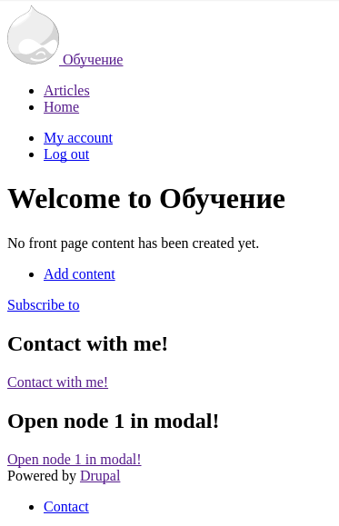

Иногда бывают такие моменты, что есть необходимость создать для каких-то
конкретных страниц, разделов или конкретной страницы. Целей то может быть и
много, но задача тут одна. В 8-ке для этого есть theme negotiator. Это такой
небольшой сервис который и позволяет определить системе какую тему подключать на
той или иной странице, в условиях Drupal 8, на том или ином роутинге.

**Тема, которая так или иначе может быть активирована (установлена), должна быть
включена в Appearance**

Первым делом давайте объявим наш theme negotiator. Это простенький класс всего с
двумя необходимыми методами:

1. `applies(RouteMatchInterface $route_match)` - метод который отвечает за
   условия выбора. Если он возвращает TRUE, тогда вызывается следующий метод,
   если false, то данный negotiator пропускается. По факту, вся логика выборки
   должна находиться здесь.
2. `determineActiveTheme(RouteMatchInterface $route_match)` - метод вызываемый в
   случае если `applies()` вернул TRUE.

Давайте рассмотрим на примере, например, включив тему Stark для главной
страницы. Первым делом надо включить (установить) данную тему в админке. Так как
эта тема в ядре, то просто жмем install и идем далее.

Теперь нужно объявить наш класс. Он должен располагаться в `/src/Theme`. Назовем
его `StarkForFront` и заполним следующим кодом.

```php {"header":"Листинг /src/Theme/StarkForFront.php"}
<?php

namespace Drupal\dummy\Theme;

use Drupal\Core\Routing\RouteMatchInterface;
use Drupal\Core\Theme\ThemeNegotiatorInterface;
use Drupal\Core\Path\PathMatcherInterface;

/**
 * Sets the Stark for frontpage.
 */
class StarkForFront implements ThemeNegotiatorInterface {

  /**
   * @var \Drupal\Core\Path\PathMatcherInterface
   */
  protected $pathMatcher;

  /**
   * StarkForFront constructor.
   * @param \Drupal\Core\Path\PathMatcherInterface $pathMatcher
   */
  public function __construct(PathMatcherInterface $pathMatcher) {
    $this->pathMatcher = $pathMatcher;
  }

  /**
   * {@inheritdoc}
   */
  public function applies(RouteMatchInterface $routeMatch) {
    return $this->pathMatcher->isFrontPage();
  }

  /**
   * {@inheritdoc}
   */
  public function determineActiveTheme(RouteMatchInterface $routeMatch) {
    # Машинное имя темы, которую необходимо активировать.
    return 'stark';
  }
}
```

И последним, вторым, шагом станет то, что мы данный класс добавим в сервисы. Для
этого нужно добавить в корень модуля файл `MYMODULE.services.yml` и объявить
свой сервис.

```yml
services:
  theme.negotiator.stark_for_front:
    class: Drupal\dummy\Theme\StarkForFront
    arguments: ['@path.matcher']
    tags:
      - { name: theme_negotiator, priority: -40 }
```

Как вы можете заметить, мы также можем указывать приоритет. Если сработают сразу
два theme negotiator на одной странице, то приоритет отдастся тому, у которого
будет больший приоритет. У theme negotiator из ядра приоритет -100, так что
имейте это ввиду.

Ну и чтобы убедиться что всё сделали правильно, заходим на главную страницу
сайта и смотрим на результат.



Не пугайтесь, это не развалившаяся тема, а Stark, так что всё правильно :)

Вот так вот просто можно переключать темы.

Ну и небольшая подсказка на последок.

```php {"header":"Включение темы для определенного типа содержимого."}
public function applies(RouteMatchInterface $route_match) {
  if ($route_match->getRouteName() == 'entity.node.canonical') {
    $node = $route_match->getParameter('node');
    if ($node->bundle() == 'NODE_TYPE') {
      return TRUE;
    }
  }
  return FALSE;
}
```

P.s. Спасибо [drupby](http://drup.by/) за подсказку, как оптимизировать то что
было, код в статье чутка исправлен.
