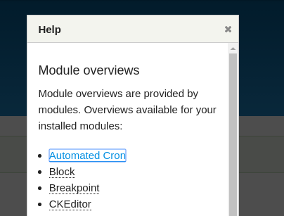
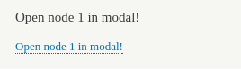
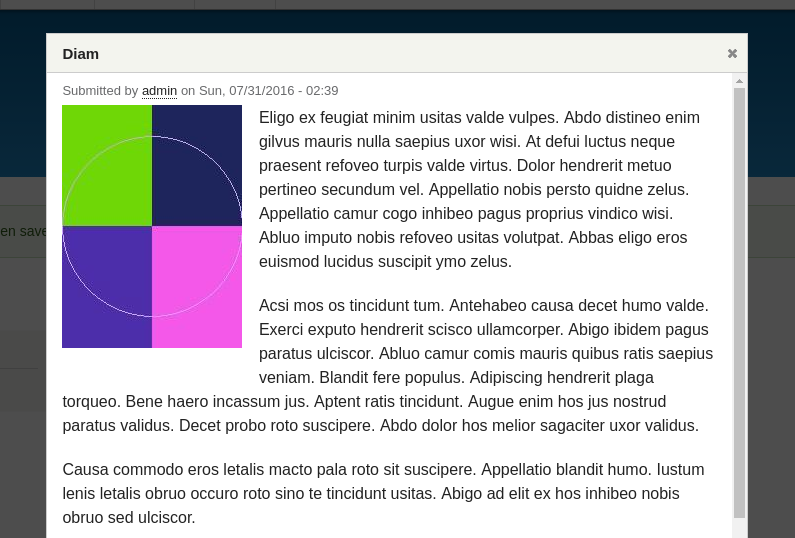
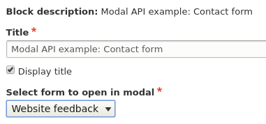
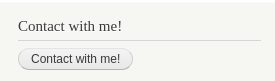
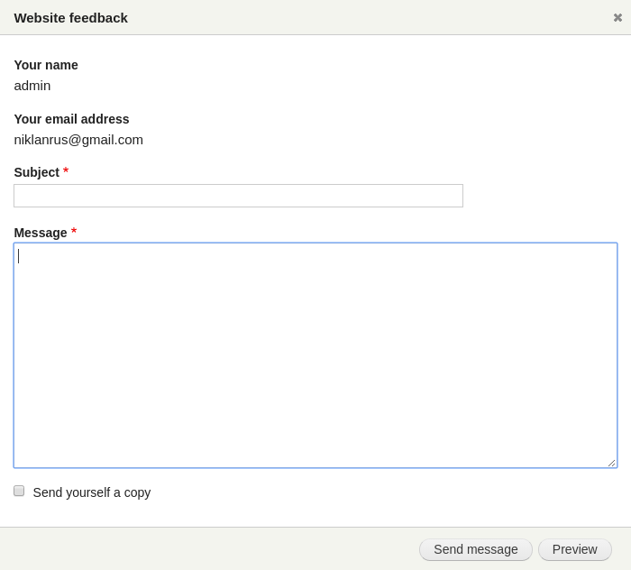
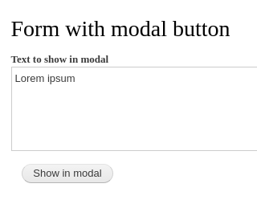
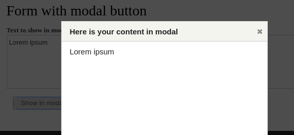
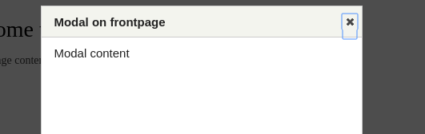
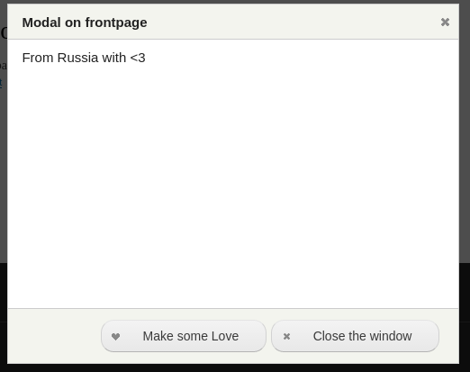

В Drupal 7 для модальных окон я использовал Ctools Modal, в 8-ке подобный
функционал появился в ядре, и он достаточно сильно отличается от того как это
сделано в 7-ки и ctools, возможно ctools потом завезет свой Modal API.

Modal API теперь в ядре, он обзавелся новыми возможностями, стал проще к
пониманию и использованию. Модальные окна в ядре основаны на Jquery UI Dialog.
Лично для меня, это как плюс, так и минус. Плюс в том что это уже известный
элемент, отточен, без багов, куча опций из коробки. Ctools Modal очень
хорошенько в этом плане уступает. Он даже нормально позиционировать окно без
фикса не может. Минус который я заметил, это то, что не получится переопределить
форму под свои задачи как это можно было сделать в Ctools. С другой стороны,
если честно, у меня все формы как dialog из jquery ui, и в 99.999% стандартного
форматирования мне хватит просто с головой. Так что это лишь мои придирки.

Для того чтобы это всё завелось, нам необходимо подключать
библиотеку `core/drupal.dialog.ajax`, не зависимо от того способа который будет
использоваться. Подключив эту библиотеку, у вас автоматически также
подключатся: `core/jquery`, `core/drupal`, `core/drupalSettings`, `core/drupal.ajax`, `core/drupal.dialog`.

Вызывать модальные окна можно откуда угодно, и я опишу все варианты которые я
смог найти в ядре.

Для открытия модального окна достаточно указать HTML ссылку с путем до страницы,
содержимое которой будет загружено в модальное окно, классом `use-ajax`,
парочкой data атрибутов и подключенной библиотекой на странице. Звучит сложно?
На самом деле нет!

Итак ссылку вы можете создать как угодно, руками, render array, не важно, чтобы
она работала как вызов модального окна мы обязательно должны указать:

- `href` ссылка до страницы, содержимое которой будет отображено;
- `class` как минимум должен содержать `use-ajax`, далее на ваше усмотрение;
- `data-dialog-type` должен принимать `modal`.

Всё, это набор минимум. Вы также можете передавать параметры для модального окна
при помощи атрибута `data-dialog-options`, который принимает
настройки [jQuery Dialog API](https://api.jqueryui.com/dialog/) в формате
encoded json. Например: `data-dialog-options="{"width": 700}"`.

Ну и не забыть подключить библиотеку! В связи с тем, что в Drupal 8 библиотеки
грузятся только на тех страницах, где они используются, то цеплять библиотеку на
все страницы сайта, если в этом нет необходимости - моветон. Поэтому
изучите [как подключаются библиотеки в Drupal 8](http://niklan.net/blog/72) и
выберите подходящий способ чтобы не грузить `core/drupal.dialog.ajax` и все его
зависимости в холостую.

## Пример №1 - просто ссылка в блоке

Допустим вы хотите что-то открыть в модальном окне, а ссылку поместить в обычный
блок созданный через административный интерфейс. Вы создаете блок в
административном интерфейсе со следующим содержимым.

```html
<a href="/admin/help" class="use-ajax" data-dialog-type="modal">Помощь в
    модальном окне</a>
```

При попытке нажать на ссылку, вы просто перейдете по ней, это означает что мы не
подключили библиотеку. Разумеется, мы будем следовать best practice и не будем
подключать библиотеку глобально на всем сайте, а подключим её только к этому
блоку. Это означает что `core/drupal.dialog.ajax` со всеми зависимостями будет
грузиться только на тех страницах, где присутствует данный блок, и если блок
отсутствует на странице и больше ни один модуль не вызывает данную библиотеку,
то все эти JS файлы просто на просто не будут даже отдаваться пользователю.
Самый очевидный вариант решения - использовать `hook_block_view_alter()` для
нашего блока и подключать библиотеку в его render array. Это мы и сделаем.

**Далее по тексту, подразумевается что весь код пишется в модуле с
названием _dummy_**

```php {"header":"hook_block_view_alter() в dummy.module"}
/**
 * Implements hook_block_view_alter().
 */
function dummy_block_view_alter(array &$build, \Drupal\Core\Block\BlockPluginInterface $block) {
  switch ($build['#id']) {
    # Машинное имя блока.
    case 'linktohelp':
      $build['#attached']['library'][] = 'core/drupal.dialog.ajax';
  }
}
```



## Пример №2 - вывод ссылки при помощи render array

Всё достаточно просто, не так ли? Давайте немного усложним задачу кодом и
сделаем вызов модального окна немного "динамическим". Для этого мы опишем свой
блок, который будет при помощи render array генерировать ссылку на модальное
окно, а также добавим простенькую настройку.

```php {"header":"Листинг /src/Plugin/Block/BlockWithModalHtmlLink.php"}
<?php

/**
 * @file
 * Contains \Drupal\dummy\Plugin\Block\BlockWithModalHtmlLink.
 */

namespace Drupal\dummy\Plugin\Block;

use Drupal\Component\Render\FormattableMarkup;
use Drupal\Component\Serialization\Json;
use Drupal\Core\Block\BlockBase;
use Drupal\Core\Form\FormStateInterface;
use Drupal\Core\Url;

/**
 * @Block(
 *   id = "block_with_modal_html_link",
 *   admin_label = @Translation("Modal API example: HTML link"),
 * )
 */
class BlockWithModalHtmlLink extends BlockBase {

  public function defaultConfiguration() {
    return [
      'nid' => '1',
    ];
  }

  /**
   * {@inheritdoc}
   */
  public function blockForm($form, FormStateInterface $form_state) {
    $form = parent::blockForm($form, $form_state);
    $config = $this->getConfiguration();

    $form['nid'] = [
      '#type' => 'textfield',
      '#title' => 'NID to display in modal',
      '#default_value' => $config['nid'],
    ];

    return $form;
  }

  /**
   * {@inheritdoc}
   */
  public function blockSubmit($form, FormStateInterface $form_state) {
    $this->configuration['nid'] = $form_state->getValue('nid');
  }

  /**
   * {@inheritdoc}
   */
  public function build() {
    $config = $this->getConfiguration();
    return [
      '#type' => 'link',
      '#title' => new FormattableMarkup('Open node @nid in modal!', ['@nid' => $config['nid']]),
      '#url' => Url::fromRoute('entity.node.canonical', ['node' => $config['nid']]),
      '#options' => [
        'attributes' => [
          'class' => ['use-ajax'],
          'data-dialog-type' => 'modal',
          'data-dialog-options' => Json::encode([
            'width' => 700,
          ]),
        ]
      ],
      '#attached' => ['library' => ['core/drupal.dialog.ajax']],
    ];
  }

}
```





В данном примере мы создали свой блок, в котором можно указать ID ноды, которая
будет загружаться в модальном окне. При нажатии на ссылку в данном блоке у нас
будет открываться содержимое материала.

Обратите внимание, подгружается именно содержимое, а не вся страница. Т.е.
Drupal ищет route по данному пути, и вызывает его контроллер, который отдает
содержимое без рендера всей страницы целиком.

## Пример №3 - ещё раз render array

Давайте ещё раз проделаем то же самое. В этот раз в качестве содержимого мы
загрузим контактную форму модуля contact. Для этого нам потребуется объявить ещё
раз наш блок. Можете даже устроить себе challange и попробовать самостоятельно
написать такой блок, а затем сравнить с тем что написал я, он не очень сильно
отличается от того как грузится нода, зато покопаться все же придется
поверхностно.

```php {"header":"Листинг /src/Plugin/Block/BlockWithModalContactForm.php"}
<?php

/**
 * @file
 * Contains \Drupal\dummy\Plugin\Block\BlockWithModalContactForm.
 */

namespace Drupal\dummy\Plugin\Block;

use Drupal\Component\Serialization\Json;
use Drupal\Core\Block\BlockBase;
use Drupal\Core\Form\FormStateInterface;
use Drupal\Core\Url;

/**
 * @Block(
 *   id = "block_with_modal_contact_form",
 *   admin_label = @Translation("Modal API example: Contact form"),
 * )
 */
class BlockWithModalContactForm extends BlockBase {

  /**
   * {@inheritdoc}
   */
  public function getContactForms() {
    $bundle_info = \Drupal::service('entity_type.bundle.info')
      ->getBundleInfo('contact_message');
    $forms = [];
    foreach ($bundle_info as $k => $v) {
      $forms[$k] = $v['label'];
    }
    unset($forms['personal']);
    return $forms;
  }

  /**
   * {@inheritdoc}
   */
  public function defaultConfiguration() {
    return [
      'form' => NULL,
    ];
  }

  /**
   * {@inheritdoc}
   */
  public function blockForm($form, FormStateInterface $form_state) {
    $form = parent::blockForm($form, $form_state);
    $config = $this->getConfiguration();

    $form['form'] = [
      '#type' => 'select',
      '#title' => 'Select form to open in modal',
      '#options' => $this->getContactForms(),
      '#empty_option' => '- Select -',
      '#default_value' => $config['form'] ? $config['form'] : FALSE,
      '#required' => TRUE,
    ];

    return $form;
  }

  /**
   * {@inheritdoc}
   */
  public function blockSubmit($form, FormStateInterface $form_state) {
    $this->configuration['form'] = $form_state->getValue('form');
  }

  /**
   * {@inheritdoc}
   */
  public function build() {
    $config = $this->getConfiguration();
    return [
      '#type' => 'link',
      '#title' => 'Contact with me!',
      '#url' => Url::fromRoute('entity.contact_form.canonical', ['contact_form' => $config['form']]),
      '#options' => [
        'attributes' => [
          'class' => ['use-ajax', 'button', 'button--small'],
          'data-dialog-type' => 'modal',
          'data-dialog-options' => Json::encode([
            'width' => 700,
          ]),
        ]
      ],
      '#attached' => ['library' => ['core/drupal.dialog.ajax']],
    ];
  }

}
```

Как я и говорил, блок по сути идентичен тому что был ранее с нодой. Я добавил
лишь один метод, для получения списка всех доступных контактных форм на сайте за
исключением персональной контактной офрмы и вывел их в качестве настройки блока,
чтобы можно было выбирать какую форму подгружать, заменил роут на
соответствующий и всё! Ах да, я ещё добавил пару классов, чтобы ссылка
смотрелась как кнопка ;)







Заметили как кнопки формы автоматически добавились в нижний враппер для красоты
и удобства? И всё это автоматически. Единственный мелкий недостаток - форма
субитится без аякса. С другой стороны, зачем? Все обязательные поля проходят
проверку на стороне клиента. Но все же, аякс формы несколько круче и гибче, и
при кастомной валидации не будет редиректа, и вообще редиректа после субмита. О
том как делать формы аяксовыми я расскажу в следующем материале.

## Пример № 4 - как ajax callback

Модальные окна можно также открывать после выполнение какого-либо ajax запроса.
У меня в голову что-то не приходит никаких практических примеров, так как этот
вариант скорее больше для административных форм. Но давайте просто объявим
страницу, на которой будет форма, в форме будет кнопка с AJAX колбэком и
текстовым полем, по нажатию на кнопку будем показывать содержимое текстового
поля в модальном окне.

```php {"header":"Листинг /src/Form/FormWithModalButton.php"}
<?php
/**
 * @file
 * Contains \Drupal\dummy\Form\FormWithModalButton.
 */

namespace Drupal\dummy\Form;

use Drupal\Core\Ajax\AjaxResponse;
use Drupal\Core\Ajax\OpenModalDialogCommand;
use Drupal\Core\Form\FormBase;
use Drupal\Core\Form\FormStateInterface;

/**
 * Form with modal window.
 */
class FormWithModalButton extends FormBase {

  /**
   * {@inheritdoc}.
   */
  public function getFormId() {
    return 'form_with_modal_button';
  }

  /**
   * {@inheritdoc}.
   */
  public function buildForm(array $form, FormStateInterface $form_state) {
    $form['text'] = [
      '#type' => 'textarea',
      '#title' => 'Text to show in modal',
      '#default_value' => 'Lorem ipsum',
    ];

    $form['show_im_modal'] = [
      '#type' => 'button',
      '#name' => 'show_im_modal',
      '#value' => 'Show in modal',
      '#ajax' => [
        # Вы также можете указать просто callback функцию а не метод.
        # Если собираетесь использовать метод другого класса, то нужно
        # указывать метод включая пространство имен, Drupal\module\Class::method
        'callback' => '::ajaxModal',
      ],
    ];

    return $form;
  }

  /**
   * {@inheritdoc}
   */
  public function submitForm(array &$form, FormStateInterface $form_state) {
    drupal_set_message('Form submitted.');
  }

  /**
   * {@inheritdoc}
   */
  public function ajaxModal(array &$form, FormStateInterface $form_state) {
    $content['#markup'] = $form_state->getValue('text');
    $content['#attached']['library'][] = 'core/drupal.dialog.ajax';
    $title = 'Here is your content in modal';
    $response = new AjaxResponse();
    $response->addCommand(new OpenModalDialogCommand($title, $content, ['width' => '400', 'height' => '400']));
    return $response;
  }

}
```

Как можно увидеть из кода, модальное окно вызвать при аякс ответе не так то и
сложно. Подключаем библиотеку (это достаточно сделать при самом аяксе), и
вернуть команду на открытие модального окна `OpenModalDialogCommand` с
необходимыми параметрами и содержимым. В нашем случае содержимое бы берем из
текущего состояния формы `$form_state`.





## Пример №5 - вызов модального окна из JS

Ну и последний пример будет как вызвать модальное окно из JS. Для этого мы
объявим свой скрипт как библиотеку, в котором и будем вызывать наше модальное
окно. А подключать свой JS мы будем только на главной. Дальнейший код. я думаю,
в комментариях не нуждается.

```yml {"header":"Листинг dummy.libraries.yml - объявляем наш JS"}
modal.from.js:
  version: 1.x
  js:
    js/modal_form.js: { }
  dependencies:
    - core/drupal.dialog.ajax
```

```php {"header":"Листинг dummy.module"}
/**
 * Implements hook_preprocess_HOOK().
 */
function dummy_preprocess_page(&$variables) {
  # Подключаем только на главной странице.
  if (\Drupal::service('path.matcher')->isFrontPage()) {
    $variables['#attached']['library'][] = 'dummy/modal.from.js';
  }
}
```

```js {"header":"Листинг js/modal_form.js"}
(function ($, Drupal, drupalSettings) {

  'use strict';

  Drupal.behaviors.dummy_modal_form_js = {
    attach: function (context, settings) {
      var frontpageModal = Drupal.dialog('<div>Modal content</div>', {
        title: 'Modal on frontpage',
        dialogClass: 'front-modal',
        width: 400,
        height: 400,
        autoResize: true,
        close: function (event) {
          // Удаляем элемент который использовался для содержимого.
          $(event.target).remove();
        }
      });
      // Отображает модальное окно с overlay.
      frontpageModal.showModal();
      // Вы также можете использовать
      // frontpageModal.show();
      // чтобы отобразить модальное окно без overlay, и все элементы за
      // модальным окном останутся активными.
    }
  }

}(jQuery, Drupal, drupalSettings));
```



В JS вызове также можно добавлять различные настройки в соответствии с jQuery
Dialog UI. Например мы можем добавлять кнопки со своим поведением.

```js {"header":"JS с добавленными кнопками"}
(function ($, Drupal, drupalSettings) {

  'use strict';

  Drupal.behaviors.dummy_modal_form_js = {
    attach: function (context, settings) {
      var frontpageModal = Drupal.dialog('<div>Modal content</div>', {
        title: 'Modal on frontpage',
        dialogClass: 'front-modal',
        width: 500,
        height: 400,
        autoResize: true,
        close: function (event) {
          $(event.target).remove();
        },
        buttons: [
          {
            text: 'Make some Love',
            class: 'love-class',
            icons: {
              primary: 'ui-icon-heart'
            },
            click: function () {
              $(this).html('From Russia with <3');
            }
          },
          {
            text: 'Close the window',
            icons: {
              primary: 'ui-icon-close'
            },
            click: function () {
              $(this).dialog('close');
            }
          }
        ]
      });
      frontpageModal.showModal();
    }
  }

}(jQuery, Drupal, drupalSettings));
```



На этом всё, спасибо за прочтение. Модуль с кодом прилагается.

## Ссылки

- [Исходный код модуля с примером](example/dummy)
