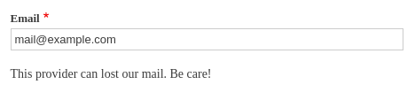
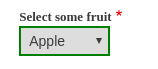
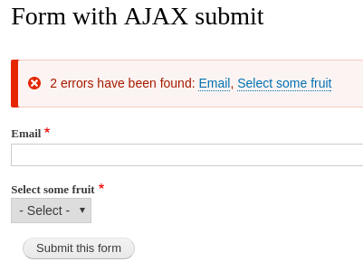
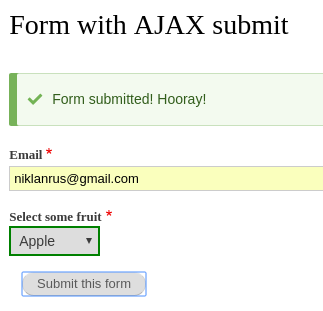
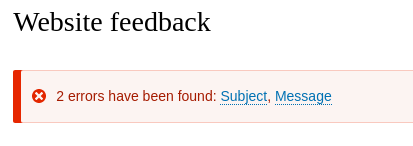

На всех моих последних Drupal сайтах (D7) все формы выполняются через AJAX, так
как это имеет множество преимуществ, от банального быстрого получения результата
заполнения формы, ошибок или сообщения об успешном выполнении, до небольшого
увеличения производительности за счет обработки одной формы, вместе рендера всей
страницы с проверкой формы. В 8-ке никуда эта особенность не делась, но, к
сожалению, пока что это лишь срезает одну крутую штуку, появившуюся в Drupal 8 -
это html5 required элементы формы, которые проверяются на стороне клиента и
сразу выдают ошибку что форма обязательна к заполнению или не соответствует
нужному формату. Это удобно тем что даже нет необходимости слать запрос на
сервер для элементарнейших проверок, но, к сожалению, обратная сторона медали -
отказ от этого функционала, он просто перестает работать и форма субмитится
игнорируя это. Но нет худа без добра, в 8.1 уже есть эксперементальный модуль
для inline form error, который может очень даже решить проблему и даже добавить
крутости, так как это уже будет контролироваться кодом, и можно будет менять
сообщение, оформление, положение, чего html5 предоставить не может.

Что же, приступим. Для начала нам нужна какая-то форма. Как делать формы я уже
писал, и приводил не один пример, поэтому я сразу приведу листинг формы над
которой мы будем шаманить.

```yml {"header":"dummy.routing.yml"}
dummy.ajax_form_submit_example:
  path: '/dummy/ajax-form-submit-example'
  defaults:
    _form: '\Drupal\dummy\Form\AjaxFormSubmitExample'
    _title: 'Form with AJAX submit'
  requirements:
    _permission: 'access content'
```

```php {"header":"/src/Form/AjaxFormSubmitExample.php"}
<?php
/**
 * @file
 * Contains \Drupal\dummy\Form\AjaxFormSubmitExample.
 */

namespace Drupal\dummy\Form;

use Drupal\Core\Form\FormBase;
use Drupal\Core\Form\FormStateInterface;

/**
 * Form with modal window.
 */
class AjaxFormSubmitExample extends FormBase {

  /**
   * {@inheritdoc}.
   */
  public function getFormId() {
    return 'ajax_form_submit_example';
  }

  /**
   * {@inheritdoc}.
   */
  public function buildForm(array $form, FormStateInterface $form_state) {
    $form['email'] = [
      '#title' => 'Email',
      '#type' => 'email',
      '#required' => TRUE,
    ];

    $form['select'] = [
      '#title' => 'Select some fruit',
      '#type' => 'select',
      '#options' => [
        'apple' => 'Apple',
        'banana' => 'Banana',
        'orange' => 'Orange',
      ],
      '#empty_option' => '- Select -',
      '#required' => TRUE,
    ];

    $form['submit'] = [
      '#type' => 'submit',
      '#name' => 'submit',
      '#value' => 'Submit this form',
    ];

    return $form;
  }

  /**
   * {@inheritdoc}
   */
  public function submitForm(array &$form, FormStateInterface $form_state) {
    drupal_set_message('Form submitted! Hooray!');
  }

}
```

## Валидация

Теперь начинается уже самое интересное, мы будем делать эту форму аяксовой.
Начнем, пожалуй, с аякс валидации элементов, ради забавы, а может даже кому-то и
когда пригодится практическое применение. Почему бы и нет.

Так как эта форма наша, валидации мы будем объявлять прямо в классе формы,
поэтому я буду писать лишь новые методы. Для валидации всей формы писать методы
не будем, так как нам хватит того что оба поля обязательны, а валидации на AJAX
будут забавы ради, и не сколько даже валидировать, сколько реагировать на
взаимодействие с формой.

Сначала разберемся с полем для email, будем проверять, если почта
на `example.com` домене, то будем писать что письмо может не дойти. Для начала
давайте добавить к элементу формы email `#ajax` параметр со всеми настройками.

```php

$form['email'] = [
  '#title' => 'Email',
  '#type' => 'email',
  '#required' => TRUE,
  '#ajax' => [
    # Если валидация находится в другом классе, то необходимо указывать
    # в формате Drupal\modulename\ClassName::methodName.
    'callback' => '::validateEmailAjax',
    # Событие, на которое будет срабатывать наш AJAX.
    'event' => 'change',
    # Настройки прогресса. Будет показана гифка с анимацией загрузки.
    'progress' => array(
      'type' => 'throbber',
      'message' => t('Verifying email..'),
    ),
  ],
  # Элемент, в который мы будем писать результат в случае необходимости.
  '#suffix' => '<div class="email-validation-message"></div>'
];
```

```php
/**
 * {@inheritdoc}
 */
public function validateEmailAjax(array &$form, FormStateInterface $form_state) {
  $response = new AjaxResponse();
  if (substr($form_state->getValue('email'), -11) == 'example.com') {
    $response->addCommand(new HtmlCommand('.email-validation-message', 'This provider can lost our mail. Be care!'));
  }
  else {
    # Убираем ошибку если она была и пользователь изменил почтовый адрес.
    $response->addCommand(new HtmlCommand('.email-validation-message', ''));
  }
  return $response;
}
```



А теперь давайте разберемся с селектором фруктов. С ним мы тоже побалуемся,
сделаем небольшую "валидацию", которая будет реагировать на выбор на выбор
фрукта и добавлять рамку вокруг селекта соответствующего цвета.

```php
$form['select'] = [
  '#title' => 'Select some fruit',
  '#type' => 'select',
  '#options' => [
    'apple' => 'Apple',
    'banana' => 'Banana',
    'orange' => 'Orange',
  ],
  '#empty_option' => '- Select -',
  '#required' => TRUE,
  '#ajax' => [
    'callback' => '::validateFruitAjax',
    'event' => 'change',
  ],
  '#prefix' => '<div id="fruit-selector">',
  '#suffix' => '</div>',
];
```

```php
/**
 * {@inheritdoc}
 */
public function validateFruitAjax(array &$form, FormStateInterface $form_state) {
  $response = new AjaxResponse();
  switch ($form_state->getValue('select')) {
    case 'apple':
      $style = ['border' => '2px solid green'];
      break;

    case 'banana':
      $style = ['border' => '2px solid yellow'];
      break;

    case 'orange':
      $style = ['border' => '2px solid orange'];
      break;

    default:
      $style = ['border' => '2px solid transparent'];
  }
  $response->addCommand(new CssCommand('#fruit-selector select', $style));
  return $response;
}
```



Вот и всё. Вы можете использовать данный подход для чего угодно. Вы можете
объявить свой кастомный валидатор на заполнение поля, который будет проверяться
при отправке формы, и вызывать его в AJAX, и в зависимости от результата,
выдавать ошибки или что-то ещё.

## AJAX отправка (субмит) формы

Ну и осталось самое, наверное, полезное и главное из данной статьи. Хотя, если
вы хоть раз делали аякс формы на 7-ке, вам не составит труда догадаться что в
данном случае нужно сделать для этого. Всё супер просто и намного легче 7-ки.

Всё что нам необходимо сделать для AJAX отправки формы, это добавить точно такой
же метод к кнопке отправки, который будет лишь получать системные сообщения, в
которых выводятся сообщения об ошибках в форме или успешном отправлении и
выводить их в форме. Приступим.

```php {"header":"Добавляем новый элемент формы"}
# Добавляем в форму новый элемент где будем выводить системные сообщения.
$form['system_messages'] = [
  '#markup' => '<div id="form-system-messages"></div>',
  '#weight' => -100,
];
```

```php {"header":"Добавляем AJAX субмит к форме"}
$form['submit'] = [
  '#type' => 'submit',
  '#name' => 'submit',
  '#value' => 'Submit this form',
  '#ajax' => [
    'callback' => '::ajaxSubmitCallback',
    'event' => 'click',
    'progress' => [
      'type' => 'throbber',
    ],
  ],
];
```

```php {"header":"AJAX callback"}
/**
 * {@inheritdoc}
 */
public function ajaxSubmitCallback(array &$form, FormStateInterface $form_state) {
  $ajax_response = new AjaxResponse();
  $message = [
    '#theme' => 'status_messages',
    '#message_list' => drupal_get_messages(),
    '#status_headings' => [
      'status' => t('Status message'),
      'error' => t('Error message'),
      'warning' => t('Warning message'),
    ],
  ];
  $messages = \Drupal::service('renderer')->render($message);
  $ajax_response->addCommand(new HtmlCommand('#form-system-messages', $messages));
  return $ajax_response;
}
```





Вот и всё! Дальше лишь фантазия и необходимость.

## AJAX отправка сторонней формы

Мы рассмотрели как работать с AJAX в собственной форме. Но что если нужно
добавить то же самое но к сторонней форме? Например у вас есть форма от модуля
Contact, и вы хотите ей пользоваться, но вам не хватает AJAX отправки. Что же,
это не проблема, делается это примерно точно также, с одним лишь отличием, что
вы будете работать с чужой формой и поэтому тут появляется `hook_form_alter()`,
в остальном ситуация точно такая же.

Первым делом нам нужно объявить объект, который и будет заниматься нашим AJAX
субмитом нужны форм и объявить метод который мы будем дергать при AJAX.

```php {"header":"Листинг /src/AjaxContactSubmit.php"}
<?php

/**
 * @file
 * Contains \Drupal\dummy\AjaxContactSubmit.
 */

namespace Drupal\dummy;

use Drupal\Component\Utility\Html;
use Drupal\Core\Ajax\AjaxResponse;
use Drupal\Core\Ajax\HtmlCommand;
use Drupal\Core\Form\FormStateInterface;

/**
 * Class AjaxContactSubmit
 * @package Drupal\dummy\AjaxContactSubmit
 */
class AjaxContactSubmit {

  /**
   * Ajax form submit callback.
   *
   * @param array $form
   * @param \Drupal\Core\Form\FormStateInterface $form_state
   * @return \Drupal\Core\Ajax\AjaxResponse
   */
  public function ajaxSubmitCallback(array &$form, FormStateInterface $form_state) {
    $ajax_response = new AjaxResponse();
    $message = [
      '#theme' => 'status_messages',
      '#message_list' => drupal_get_messages(),
      '#status_headings' => [
        'status' => t('Status message'),
        'error' => t('Error message'),
        'warning' => t('Warning message'),
      ],
    ];
    $messages = \Drupal::service('renderer')->render($message);
    $ajax_response->addCommand(new HtmlCommand('#' . Html::getClass($form['form_id']['#value']) . '-messages', $messages));
    return $ajax_response;
  }

}
```

```php {"header":"Добавляем hook_form_BASE_FORM_ID_alter()."}
use Drupal\Component\Utility\Html;

...

/**
 * Implements hook_form_BASE_FORM_ID_alter().
 */
function dummy_form_contact_message_form_alter(&$form, \Drupal\Core\Form\FormStateInterface $form_state, $form_id) {
  # Добавляем элемент куда будем выводить сообщения об ошибках или успешном
  # отправлении формы.
  $form['system_messages'] = [
    '#markup' => '<div id="' . Html::getClass($form_id) . '-messages"></div>',
    '#weight' => -100,
  ];

  # Добавляем наш AJAX колбек для кнопки. Так как он находится в отдельном
  # объекте, то указывать нужно полный путь с пространством имен.
  $form['actions']['submit']['#ajax'] = [
    'callback' => 'Drupal\dummy\AjaxContactSubmit::ajaxSubmitCallback',
    'event' => 'click',
    'progress' => [
      'type' => 'throbber',
    ],
  ];
}

```



На этом всё, модуль с примерами прилагаю.

## Ссылки

- [Исходный код модуля с примером](example/dummy)
