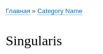

В Drupal 8 хлебные крошки из коробки покрывают, наверное, 99% необходимого. Я
даже не смог придумать нормального примера для гайда, так как все разруливали
хлебные крошки из ядра самостоятельно. Если кому интересно, этим
занимается [PathBasedBreadcrumbBuilder](https://api.drupal.org/api/drupal/core!modules!system!src!PathBasedBreadcrumbBuilder.php/8.2.x).
Иными словами, если вы будете генерировать URL для всего на сайте иерархические
/category-name/content-name, то Drupal сам разрулит и установит хлебные крошки.
В иных случаях можно написать свои, и делается это легче простого.

Хлебные крошки в D8 - это сервис, который, в свою очередь, является классом, у
которого всего 2 метода `applies()` и `build()`. Звучит знакомо? А то как
же, [программное переключение темы][drupal-8-theme-negotiator] работает по тому же
принципу. Первый отвечает за простую логику, должен текущий сервис хлебных
крошек работать на данной странице или нет, и если ответ положительный, то мы
генерируем хлебные крошки.

Я не знаю даже что ещё тут рассказать, ибо всё настолько просто, что я просто
приведу код с примером и небольшими комментариями. Напишу лишь небольшую заметку
о том что он делает. У меня есть на сайте тип материала article, а также словарь
таксономии с категориями. Соответственно у article есть поле field_category,
которое ссылается на нужную категорию. Данный код создает хлебные крошки
следующего вида: Главная -> Категория. Этот код потребуется только если у вас не
иерархические URL, или у материала адрес системного вида node/{NID}. Если бы был
иерархический - то ничего бы писать и не пришлось.

```php {"header":"Объявляем сервис dummy.service.yml"}
services:
  dummy.article_breadcrumb:
    class: Drupal\dummy\ArticleBreadcrumbBuilder
    arguments: []
    tags:
      - { name: breadcrumb_builder, priority: 10 }
```

```php {"header":"Листинг /src/ArticleBreadcrumbBuilder.php"}
<?php

/**
 * @file
 * Contains Drupal\dummy\ArticleBreadcrumbBuilder.
 */

namespace Drupal\dummy;

use Drupal\Core\StringTranslation\StringTranslationTrait;
use Drupal\Core\Breadcrumb\Breadcrumb;
use Drupal\Core\Breadcrumb\BreadcrumbBuilderInterface;
use Drupal\Core\Link;
use Drupal\Core\Routing\RouteMatchInterface;
use Drupal\node\NodeInterface;
use Drupal\taxonomy\Entity\Term;

/**
 * Class ArticleBreadcrumbBuilder.
 */
class ArticleBreadcrumbBuilder implements BreadcrumbBuilderInterface {
  # Необходимо чтобы использовать $this->t().
  use StringTranslationTrait;

  /**
   * {@inheritdoc}
   */
  public function applies(RouteMatchInterface $route_match) {
    $node = $route_match->getParameter('node');
    # Только если мы находимся на странице сущности node типа article.
    return $node instanceof NodeInterface && $node->getType() == 'article';
  }

  /**
   * {@inheritdoc}
   */
  public function build(RouteMatchInterface $route_match) {
    $breadcrumb = new Breadcrumb();
    $node = $route_match->getParameter('node');
    # Добавляем первую крошку на главную страницу.
    $links = [Link::createFromRoute($this->t('Home'), '<front>')];
    # Вторую крошку добавляем если категория задана в поле field_category.
    if (!$node->field_category->isEmpty()) {
      $tid = $node->field_category->target_id;
      $category_term = Term::load($tid);
      # Добавляем хлебную крошку на страницу термина.
      $links[] = Link::createFromRoute($category_term->name->value, 'entity.taxonomy_term.canonical', ['taxonomy_term' => $tid]);
    }
    # Указываем контекст для кэширования данной хлебной крошки. В нашем случае
    # будет кэшироваться только для текущего адреса url.
    $breadcrumb->addCacheContexts(['url.path']);
    return $breadcrumb->setLinks($links);
  }
}
```



P.s. В Drupal 8, получается, что задавать хлебные крошки особо то и не придется,
только для очень специфичных случаев. А я боялся, как же я буду жить без
замечательного
модуля [Path Breadcrumbs](https://www.drupal.org/project/path_breadcrumbs), а
оно вон как. :) Он даже по факту и не нужен уже.

Код прилагаю.

## Ссылки

- [Исходный код модуля с примером](example/dummy)

[drupal-8-theme-negotiator]: ../../../../2016/08/30/drupal-8-theme-negotiator/index.ru.md
