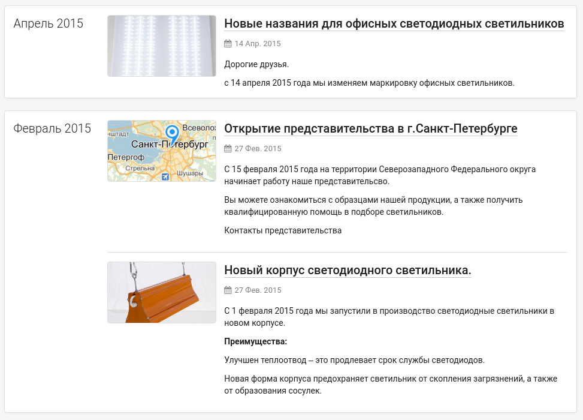
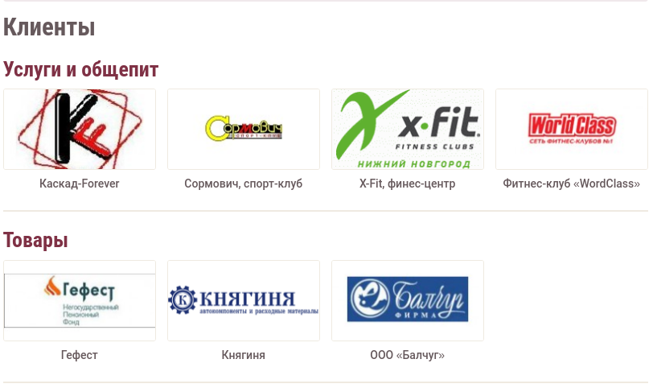
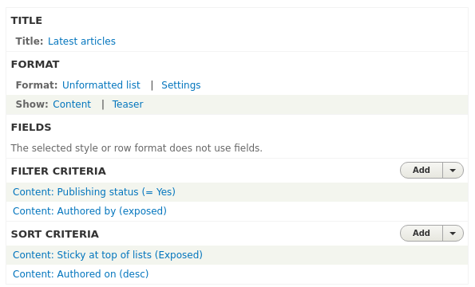
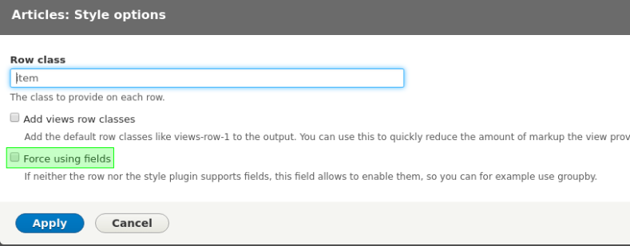
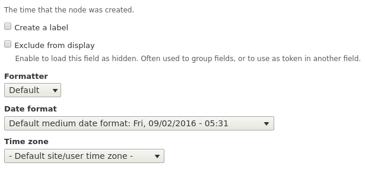
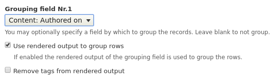
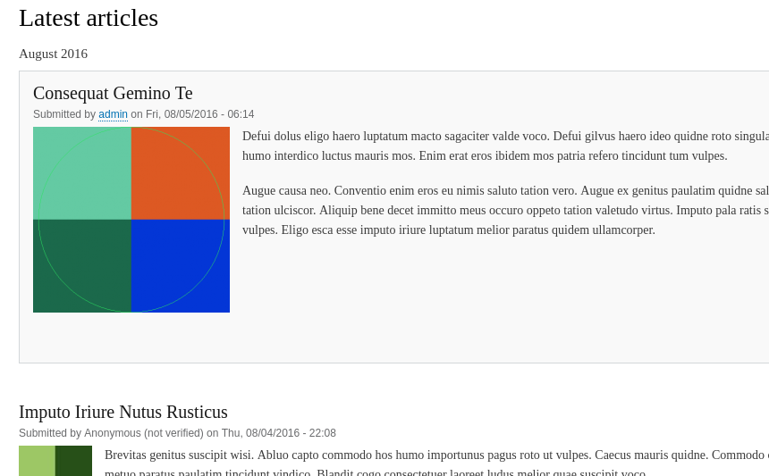
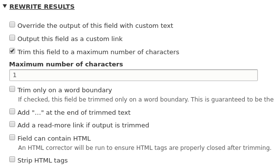
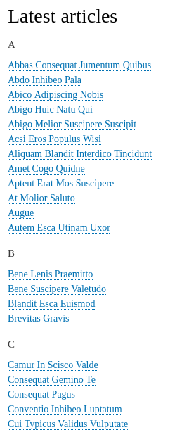

Что-то последние все последние материалы у меня технические и давненько не было
что-то попроще, но не менее полезного. В этот раз я расскажу о группировке
материалов во Views.

С этой проблемой я столкнулся давно, году в 2013, когда серьезно занялся
изучением Drupal. Тогда я только ещё знакомился и многих хитростей не знал, и
часто прибегал к помощи сторонних модулей для решения своих задач, так как сил
написать свой просто бы не хватило. И была задача, чтобы все материалы были
выведены на одной странице, но сгруппированы по определенному признаку. То ли на
тот момент во Views такой возможности не было, то ли я не смог найти это в сети,
но зато я нашел для этого даже целый модуль, который это делал и делал это очень
плохо. В последнее время что-то меня часто на проектах стали просить сделать ту
или иную группировку содержимого, и я решил с этой темой разобраться и
оказалось, что во Views эта возможность есть из коробки, а я никогда не обращал
на это внимание. И вот дошли руки написать об этом :)

Уточняю сразу, гайд пишу по скринам Drupal 8, но в Drupal 7 это делается
абсолютно также, вообще без изменений.

Что же за группировка такая? Это возможность во Views объединять выводимые
материалы по определенному признаку. У этой возможности очень большой круг
применения, например у сайта с едой - можно построить меню с группировкой по
составу, или же по типу блюда, у медицинских сайтов по назначению, или же просто
по первой букве, как часто на них бывает. Вот ещё парочка, визуальных примеров.

Так как же это делается? Давайте рассмотрим парочку примеров.

## Пример №1

Начнем с примера который совпадает с первым изображением, будем группировать
материалы по месяцу и году. Допустим у вас уже имеется views для вывода нужного
содержимого на странице в обычном виде.

Для того чтобы группировать материалы, нам нужны поля, а конкретно, одно поле по
значению которого будут группироваться материалы. Если у вас настроен вывод
полей - то ничего сложного, вы добавляете нужное поле, в нашем случае поле с
датой создания материала, и переходите к следующему шагу. А что если вы
используете готовый вывод, или какой-то иной от полей? Вы можете заметить что
поля вам добавлять нельзя, как у меня на скриншоте. На самом деле можете, просто
для этого нужно Views указать, что нам даже при таком выводе нужны поля, и он
даст возможность их использовать. Для этого необходимо нажать на настройки у
формата вывода и выбрать "Принудительное использование полей".

После этого у нас появится возможность добавлять поля к нашему отображению.
Теперь нам нужно добавить поле с датой публикации материала. Добавляем
соответствующее поле и видим множество настроек.

Нас эти настройки интересуют, почему? Views будет группировать по полю, но
откуда он знает как именно группировать? Для этого он группирует по конечному
результату поля, а не по его исходному значению или чему-то ещё. Т.е. если
отталкиваться от моего скриншота выше, группировка будет по формату даты
09/02/2016 05:31 - так как выбран данный формат даты и это будет результат поля.
Вероятность что будет несколько материалов в 1 минуту - практически нереально
для обычно сайта и просто бесполезно. Самое оптимальное, группировать по
формату "Месяц ГОД". Для этого нам нужно сделать так, чтобы результат этого поля
принимал данное значение. Это делается супер-просто, в формате даты, мы должны
выбрать <abbr title="Пользовательский \ Собственный">Custom</abbr> и ввести
нужный формат в соответствии с форматами дат PHP. Соответственно вводим нужный
нам формат `F Y`

Ну и теперь нам необходимо включить группировку по значению данного поля. Для
этого возвращаемся в настройки нашего формата вывода, где мы включали
принудительное использование полей и видим что появилось новое поле для выбора
группировки в котором нам нужно выбрать, какое поле будет использоваться для
группировки материалов в данном Views.

Вот так просто группируются материалы по чему угодно.

## Пример №2

Давайте рассмотрим ещё один пример, который может оказаться полезным. Давайте
сгруппируем материалы по первой букве их заголовка. Можете попробовать сделать
сами.

Для этого нам потребуется опять же, немного похимичить с выводимым значением
поля. Первым делом, нужно, конечно же, добавить поле заголовка материала, чтобы
оно стало доступным для группировки. Но ведь группировка будет происходить по
цельному заголовку, а нам нужно по первой букве. Для этого в настройках поля
есть раздел <abbr title="Перезписать результаты">Rewrite results</abbr>, который
позволяет нам влиять на конечный результат значения. В нём нас интересует
конкретно одна
опция <abbr title="Обрезать это поле до определенного количество символов">Trim
this field to a maximum number of characters</abbr>, которое позволяет обрезать
значение поля. Так как мы группируем по первой букве заголовка, то и обрезать
нам нужно до одного символа.

Далее нам необходимо данное поле выбрать в качестве группирующего содержимое. Ну
и будет так же неплохо и логично добавить сортировку по заголовку в порядке
возрастания, чтобы всё шло по алфавиту.

На этом всё, спасибо за прочтение. :)
