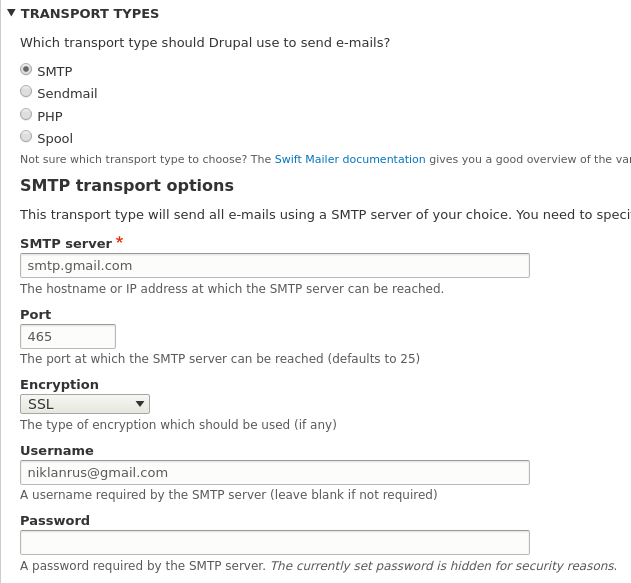
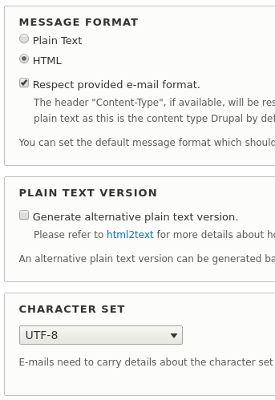
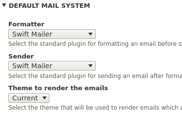

Изначально я хотел просто разобраться с модулем Contact, написать как править
формат писем которые он отправляет, я конечно же полез в ядро, и там особо не
разгуляться. HTML письма отправлять нельзя, без дополнительного альтера,
максимум текст подправить, поэтому я решил влезть в тему поглубже и нашел куда
более мощное решение. Но если вам хочется все делать руками и через код, то в
поможет вам `hook_mail_alter()` и функция, которая отвечает за подготовку писем
модуля
Contact - [contact_mail()](https://api.drupal.org/api/drupal/core!modules!contact!contact.module/function/contact_mail/8.2.x).
В общем все, как и в D7. Вы также можете получать значения кастомных полей вот
так: `$contactMessage = $message['params']['contact_message'];`
и `$contactMessage->get('field_name')->getString();`

А я расскажу о более комплексном подходе, потому что, как мне кажется, он будет
более востребован и необходим. Я начал изучать как дела обстоят в 8-ке, и если в
Drupal 7 для отправки HTML писем, как правило,
используется [Mime Mail](https://www.drupal.org/project/mimemail), то в Drupal 8
ситуация совершенно иная. Тут все рекомендуют
использовать [Swift Mailer](https://www.drupal.org/project/swiftmailer) - как
оказалось, это небольшая библиотека для PHP, чтобы отправлять письма от
SensioLabs, тех что создали Symfony и Twig, которые активно используются в
Drupal 8. Так что даже логично, юзать либу из одной экосистемы, и к этим ребятам
есть доверие. Соответственно модуль лишь обвязка для библиотеки которое позволит
использовать все её возможности, но об этом попозже.

## Улучшение модуля Contact

[Contact Storage](https://www.drupal.org/project/contact_storage) - невероятно
полезный модуль если вы собираетесь использовать Contact из ядра. Я вообще не
понимаю, как так получилось что такого функционала не оказалась в ядре вместе с
самим Contact. Он настолько очевидный и необходимый, при этом это по сути
функционал Entifyform. Раз уже сделали его аналог в ядре, почему бы сразу не
допилили до ума. Данный модуль раскрывает Contact полноценно как формы-сущности,
побуду немного гадалкой и сказу что его потом и внедрят в ядро. Причем на его
странице прямо и написано, что цель - попасть в ядро. Что же добавляет данный
модуль:

- Позволяет отправлять письма в формате HMTL.
- Хранение всех отправленных сообщений на сайте. Это очень круто! Ведь никакой
  сбой или проблемы с почтой не потеряют письмо, он продублируется и на сайте.
  Разумеется с возможностью редактировать и удалять их.
- Возможность указать свой путь для редиректа после успешной отправки формы.
- Также позволяет указать свой алиас пути для страницы отправки формы, чтобы не
  пользать на страницу управления алиасами.
- Позволяет одной галочкой отключать кнопку Preview.
- Позволяет ограничить количество отправлений через форму для пользователей.
- Добавляет возможность клонировать формы.

## Установка необходимых модулей

А теперь вернемся непосредственно к письмам. Для дальнейшей работы нам
понадобятся следующие
модули [Mail System](https://www.drupal.org/project/mailsystem), [Swift Mailer](https://www.drupal.org/project/swiftmailer)
и Contact Storage. **Обращаю внимание** сразу на то, что Swift Mailer
нужно (!) [ставить через composer][drupal-8-composer] иначе он просто не будет
работать.

```php
composer require drupal/swiftmailer:~1.0
```

## Настройка Swift Mailer

Давайте сразу настроим Swift Mailer `/admin/config/swiftmailer/transport`. На
данной странице вам нужно выбрать как будет отправляться почта и данные для
отправки. Аналогично модулю SMTP.



Вверху переключившись на вкладку Messages, вы также можете настроить в каком
формате будут уходить письма.



## Настройка модуля Mail System

Модуль 1 в 1 как в Drupal 7 перекочевал и на Drupal 8. Всё что он делает,
позволяет выбирать, какие интерфейсы будут использоваться для форматирования и
отправки письма, с возможностью указывать тонкие настройки под конкретные модули
и задачи. Разумеется нам по дефолту нужно выбрать Swift Mailer, так как он будет
отсылать и формировать письма.



## Настройка модуля Contact

Для начала нам нужно включить поддержку html писем для Contact в настройках
добавленные модулем Contact Storage (`/admin/structure/contact/settings`). Тут
никаких сложностей не должно возникнуть.

А вот далее нам надо добавить формат вывода mail для сущности Contact Message.
Он используется для формирования письма, если присутствует, конечно. Эта
особенность захардкожена в самом модуле Contact (`contact_mail()`).

Для этого заходим в настройки View Modes (/admin/structure/display-modes/view) и
для Contact message добавлем


Теперь нужно перейти в настройки управления отображением для нужной контактной
формы и включить формат вывода Mail.


После чего у вас сверху появится вкладка Mail и там вы сможете настроить то, как
сообщение будет отправлено на почту, включая порядок и какие поля необходимо
отправлять. Для формирования разметки вы также можете использовать
здесь [DisplaySuite + FieldGroup][drupal-7-how-to-theme-using-display-suite-and-field-group]. Но и не забывайте что HTML писем
достаточно большое количество ограничений, поэтому все же лучше взять контроль
над результатом письма при помощи темплейт файла.

Следовательно, вы можете здесь настраивать как и что будет формировать тело
письма. Вы можете использовать различные layouts и темплейты для того чтобы
сформировать содержимое письма. Но что если вы хотите сделать общий каркас
оформления отправляемых писем от модуля Contact? Тут нам и поможет Siwft Mailer.
Он добавляет свой собственный шаблон swiftmailer.html.twig со следующим
содержанием по умолчанию:

```twig {"header":"swiftmailer.html.twig"}
<html>
<head>
<style type="text/css">
table tr td {
  font-family: Arial;
  font-size: 12px;
}
</style>
</head>
<body>
<div>
  <table width="800px" cellpadding="0" cellspacing="0">
    <tr>
      <td>
        <div style="padding: 0px 0px 0px 0px;">
          {{ body }}
        </div>
      </td>
    </tr>
  </table>
</div>
</body>
</html>
```

Как вы могли понять, всё что вы настроите на вывод в управлении отображением
Mail будет вставлено в body переменную данного темплейта.

Так вот, как же менять эту обертку под себя? Данный модуль регистрирует them
hook suggestions для данного темплейт файла в следующем
формате `swiftmailer-MODULE-KEY.html.twig`. Следовательно, вы можете объявить
следующие темплейты:

- swiftmailer.html.twig - будет использоваться для всех отправляемых писем с
  сайта через Swift Mailer класс, если не определен ни один из шаблонов ниже.
- swiftmailer--contact.html.twig - будет использоваться для всех сообщений
  отправляемых модулем contact.
- swiftmailer--contact--page-mail.html.twig - будет использоваться для
  сообщений, отправленных из формы получателям данной контактной формы.

У Contact также есть следующие ключи:

- page-copy - копия письма отправляемая отправителю в случае если поставлена
  соответствующая галочка.
- page-autoreply - письмо которое отправляется в качестве автоматического ответа
  отправителю после отправки его письма.
- user-mail - письмо отправляемое через персональную контактную форму
  получателю (пользователю).
- user-copy - копия письма отправителю, отправленное через персональную
  контактную форму.

Я решил что хочу переопределить вообще все исходящие contact письма и сделать им
единый стиль оформления. Для этого в теме вашего сайта находится папа templates,
в неё мы и помещаем нужный нам темплейт swiftmailer--contact.html.twig

```twig {"header":"swiftmailer--contact.html.twig"}
<html>
<head>
  <style type="text/css">
    table tr td {
      font-family: Arial;
      font-size: 14px;
    }
  </style>
</head>
<body style="background-color: #222222;">
<div style="width: 100%; padding: 20px 0; background-color: #222222;">
  <div style="max-width: 600px; margin: auto;">
    <table role="presentation" cellspacing="0" cellpadding="0" border="0"
           align="center" width="100%" style="max-width: 600px;">
      <tbody>
      <tr>
        <td>
          
        </td>
      </tr>
      </tbody>
    </table>
    <table role="presentation" cellspacing="0" cellpadding="0" border="0"
           align="center" width="100%" style="max-width: 600px;">
      <tbody>
      <tr>
        <td style="background: white; padding: 30px">
          {{ body }}
        </td>
      </tr>
      </tbody>
    </table>
  </div>
</div>
</body>
</html>
```


В целом это всё. Дальше лишь ваша фантазия и необходимость правки макета письма.

Обращу лишь внимание на ещё одну особенность. Изображение я вставил не просто
так, посмотрите на путь до него: `src="image:http://i.imgur.com/AZQIFhO.png"` -
приставка image перед адресом до изображения не просто так, она указывает Swift
Mailer, что это изображение должно быть вставлено в письмо и отправлено вместе с
ним через CID (Content-ID), при этом такой файл не отображается как
прикрепленный. Это некий аналог data:base64.

С таким подходом, например, Gmail не запрашивает разрешение на подгрузку
изображений из внешних источников, прежде чем отобразить их, а сразу показывает.

[drupal-8-composer]: ../../../../2016/09/03/drupal-8-composer/index.ru.md
[drupal-7-how-to-theme-using-display-suite-and-field-group]: ../../../../2016/04/04/drupal-7-how-to-theme-using-display-suite-and-field-group/index.ru.md
