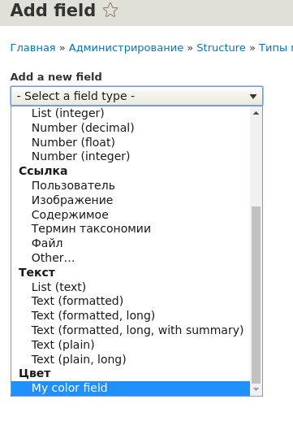

В ядре Drupal 8 появилось множество новых полей, которые в Drupal 7 присутствуют как контриб модули, это значит что в ядре есть типы полей почти на все случаи жизни, но что если ни один из типов полей не удовлетворяет вашим требованиям? Тогда поле можно объявить самому!

Честно говоря, мне даже не приходилось объявлять свои типы полей в Drupal 7, поэтому эта тема для меня особенно интересна и я её решил изучить сразу на 8-ке. Давайте для примера создадим модуль, который будет добавлять на сайт новый тип поля - цвет в соответствии с [html5 элементом](https://developer.mozilla.org/en-US/docs/Web/HTML/Element/input/color).

Так как в ядре присутствует одноименный модуль Color, а следующее очевидное название Color Field занято контрибным модулем, поэтому я решил назвать модуль My Color Field (my_color_field). Не самое удачное название, зато не будет конфликтовать с существующими проектами, ведь это всего лишь для обучения а не реального применения.

Из чего же состоят типы полей:

- FieldType - непосредственное объявление нашего поля;
- FieldFormatter - отвечает за формирования значений нашего поля на вывод, грубо говоря варианты/форматы вывода;
- FieldWidget - это форма с настройками для нашего поля, которое вы видите в административном интерфейсе сразу после добавления нового поля, а также при его редактировании.

Скажу наперед, что данные классы хранятся в папке `src/Plugin/Field` в одноименных подпапках.

А теперь будем идти по порядку и разберемся с каждым шагом подробнее.

## Объявляем свой модуль

Самый простой шаг, мы должны сообщить Drupal о нашем модуле, поэтому объявляем простенький **my_color_field**.info.yml в соответствующей папке.

~~~yml {"header":"my_color_field.info.yml"}
name: 'My color field'
description: 'Custom colorpicker field.'
type: module
core: 8.x
version: 1.x
package: Field types
dependencies:
  - field
~~~

## Field Type

Теперь нам необходимо объявить непосредственно тип нашего поля. На данном шаге мы сообщаем Drupal что модуль добавляет такой-то тип поля, имеет такие поля в базе данных для хранения данных и такого типа. В аннотации мы также указываем какой формат вывода и виджет будет использовать по-умолчанию для данного типа поля. Они обязаны быть, так как будут использоваться также в ситуациях, когда был удален дополнительный формат вывода и\или виджет для поля.

~~~php {"header":"Листинг src/Plugin/Field/FIeldType/MyColorFieldItem.php"}
<?php

/**
 * @file
 * Contains Drupal\my_color_field\Plugin\Field\FieldType\MyColorFieldItem.
 */

namespace Drupal\my_color_field\Plugin\Field\FieldType;

use Drupal\Core\Field\FieldItemBase;
use Drupal\Core\Field\FieldStorageDefinitionInterface;
use Drupal\Core\TypedData\DataDefinition;

/**
 * @FieldType(
 *   id = "my_color_field",
 *   label = @Translation("My color field"),
 *   module = "my_color_field",
 *   description = @Translation("Custom color picker."),
 *   category = @Translation("Color"),
 *   default_widget = "my_color_field_html5_input_widget",
 *   default_formatter = "my_color_field_default_formatter"
 * )
 */
class MyColorFieldItem extends FieldItemBase {

  /**
   * {@inheritdoc}
   *
   * Объявляем поля для таблицы где будут храниться значения нашего поля. Нам
   * хватит одного значения value типа text и размером tiny.
   *
   * @see https://www.drupal.org/node/159605
   */
  public static function schema(FieldStorageDefinitionInterface $field_definition) {
    return array(
      'columns' => array(
        'value' => array(
          'type' => 'text',
          'size' => 'tiny',
          'not null' => FALSE,
        ),
      ),
    );
  }

  /**
   * {@inheritdoc}
   *
   * Это указывает Drupal на то, как нужно хранить значения этого поля.
   * Например integer, string или any.
   */
  public static function propertyDefinitions(FieldStorageDefinitionInterface $field_definition) {
    $properties['value'] = DataDefinition::create('string')
      ->setLabel(t('Hex color'));

    return $properties;
  }
}
~~~

## Field Widget

Данный класс отвечает за то, как будет выглядеть форма ввода и редактирования поля - грубо говоря input. Это лишь административный элемент. Для виджета можно объявлять настройки, по принципу как они объявляются в Field Formatter (см. ниже).

~~~php {"header":"Листинг src/Plugin/Field/FieldWidget/MyColorFieldHTML5InputWidget.php"}
<?php

/**
 * @file
 * Contains \Drupal\my_color_field\Plugin\Field\FieldWidget\MyColorFieldHTML5InputWidget.
 */

namespace Drupal\my_color_field\Plugin\Field\FieldWidget;

use Drupal\Core\Field\FieldItemListInterface;
use Drupal\Core\Field\WidgetBase;
use Drupal\Core\Form\FormStateInterface;

/**
 * @FieldWidget(
 *   id = "my_color_field_html5_input_widget",
 *   module = "my_color_field",
 *   label = @Translation("HTML5 Color Picker"),
 *   field_types = {
 *     "my_color_field"
 *   }
 * )
 */
class MyColorFieldHTML5InputWidget extends WidgetBase {

  /**
   * {@inheritdoc}
   *
   * В данном методе мы настраиваем форму в которой наше значение для поля будет
   * вводиться и редактироваться - это то, что видят юзеры в админке при работе
   * с данным полем.
   */
  public function formElement(FieldItemListInterface $items, $delta, array $element, array &$form, FormStateInterface $form_state) {
    $element += [
      '#type' => 'color',
      '#default_value' => isset($items[$delta]->value) ? $items[$delta]->value : '',
      '#size' => 7,
      '#maxlength' => 7,
      '#element_validate' => [
        [$this, 'hexColorValidation'],
      ],
    ];

    return ['value' => $element];
  }

  /**
   * {@inheritdoc}
   *
   * По сути валидация как таковая и не нужна, ведь HTML5 input и не позволяет
   * руками вводить цвет, но в случае, если браузер не поддерживает данный
   * элемент, или ещё какие-то аномалии, лучше всего проверять его на
   * соответствие HEX формату #FFFFFF.
   */
  public function hexColorValidation($element, FormStateInterface $form_state) {
    $value = $element['#value'];
    if (!preg_match('/^#([a-f0-9]{6})$/iD', strtolower($value))) {
      $form_state->setError($element, t('Color is not in HEX format'));
    }
  }

}
~~~

## Field Formatter

В данном классе мы должны подготавливать вывод значения поля. Также мы можем объявлять настройки для нашего формата, которые в дальнейшем использовать для вывода поля.

В нашем случае мы объявим сразу два формата вывода:

- Первый будет выводить HEX цвет выбранный в поле. Он также будет использоваться как формат вывода по умолчанию;
- Второй будет выводить div выбранного цвета. Размеры данного элемента будут задаваться в настройках формата поля.

~~~php {"header":"Листинг src/Plugin/Field/FieldFormatter/MyColorFieldDefaultFormatter.php"}
<?php

/**
 * @file
 * Contains \Drupal\my_color_field\Plugin\Field\FieldFormatter\MyColorFieldDefaultFormatter.
 */

namespace Drupal\my_color_field\Plugin\Field\FieldFormatter;

use Drupal\Core\Field\FormatterBase;
use Drupal\Core\Field\FieldItemListInterface;

/** *
 * @FieldFormatter(
 *   id = "my_color_field_default_formatter",
 *   label = @Translation("HEX color"),
 *   field_types = {
 *     "my_color_field"
 *   }
 * )
 */
class MyColorFieldDefaultFormatter extends FormatterBase {

  /**
   * {@inheritdoc}
   */
  public function viewElements(FieldItemListInterface $items, $langcode) {
    $element = [];

    foreach ($items as $delta => $item) {
      # Выводим наши элементы.
      $element[$delta] = [
        '#type' => 'markup',
        '#markup' => $item->value,
      ];
    }

    return $element;
  }

}
~~~

~~~php {"header":"Листинг src/Plugin/Field/FieldFormatter/MyColorFieldDivFormatter.php"}
<?php

/**
 * @file
 * Contains \Drupal\my_color_field\Plugin\Field\FieldFormatter\MyColorFieldDivFormatter.
 */

namespace Drupal\my_color_field\Plugin\Field\FieldFormatter;

use Drupal\Component\Render\FormattableMarkup;
use Drupal\Core\Field\FormatterBase;
use Drupal\Core\Field\FieldItemListInterface;
use Drupal\Core\Form\FormStateInterface;

/** *
 * @FieldFormatter(
 *   id = "my_color_field_div_formatter",
 *   label = @Translation("Div element with background color"),
 *   field_types = {
 *     "my_color_field"
 *   }
 * )
 */
class MyColorFieldDivFormatter extends FormatterBase {

  /**
   * {@inheritdoc}
   *
   * Настройки по умолчанию для нашего формата вывода.
   */
  public static function defaultSettings() {
    return [
      'width' => '80',
      'height' => '80',
    ] + parent::defaultSettings();
  }

  /**
   * {@inheritdoc}
   *
   * Форма с настройками для нашего формата вывода.
   */
  public function settingsForm(array $form, FormStateInterface $form_state) {
    $elements = parent::settingsForm($form, $form_state);

    $elements['width'] = array(
      '#type' => 'number',
      '#title' => t('Width'),
      '#field_suffix' => 'px.',
      '#default_value' => $this->getSetting('width'),
      '#min' => 1,
    );

    $elements['height'] = array(
      '#type' => 'number',
      '#title' => t('Height'),
      '#field_suffix' => 'px.',
      '#default_value' => $this->getSetting('height'),
      '#min' => 1,
    );

    return $elements;
  }

  /**
   * {@inheritdoc}
   *
   * Данный метод позволяет вывести кратку информацию о текущих настройках поля
   * на странице управления отображением.
   */
  public function settingsSummary() {
    $summary = [];
    $settings = $this->getSettings();

    $summary[] = t('Width @width px.', array('@width' => $settings['width']));
    $summary[] = t('Height @height px.', array('@height' => $settings['height']));

    return $summary;
  }

  /**
   * {@inheritdoc}
   */
  public function viewElements(FieldItemListInterface $items, $langcode) {
    $element = array();
    $settings = $this->getSettings();

    foreach ($items as $delta => $item) {
      // Render each element as markup.
      $element[$delta] = [
        '#type' => 'markup',
        '#markup' => new FormattableMarkup(
          '

',
          [
            '@width' => $settings['width'] . 'px',
            '@height' => $settings['height'] . 'px',
            '@color' => $item->value,
          ]
        ),
      ];
    }

    return $element;
  }

}
~~~

## Проверка нашего поля

Этого вполне достаточно для работы данного поля. Самое время включить модуль и посмотреть на наше поле. Для этого я к типу материала Article добавлю два поля нового типа, каждый из которых будет выводиться в одном из форматов вывода.

Вот и всё, на самом деле объявлять поля не так сложно. Главное не путаться в FieldWidget и FieldFormatter. В остальном всё похоже на Form API.
