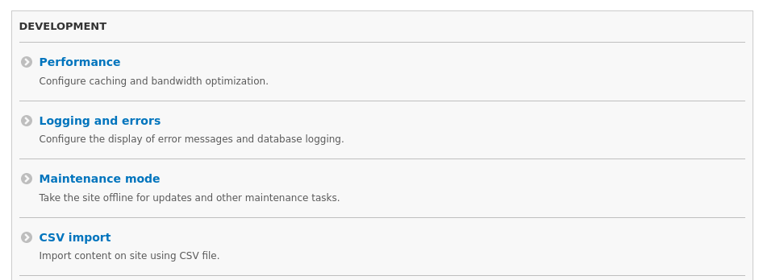
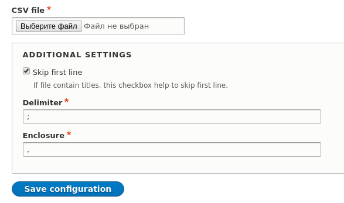
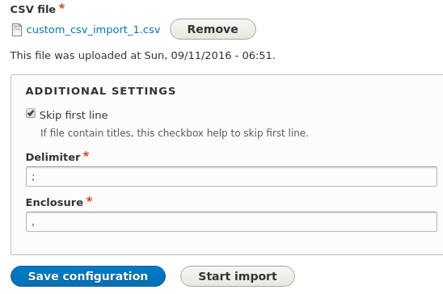
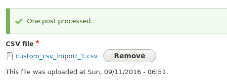
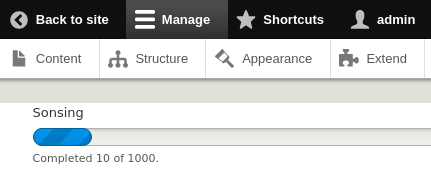
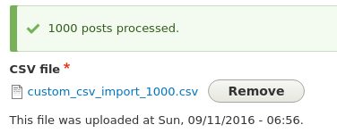

На этот раз я решил рассказать что-то комплексное. Поэтому решил написать статью
о создании собственного импорта содержимого на сайт из CSV файла. Как мне
кажется, это достаточно полезный пример, так как он приближен к реальным
задачам. Это и не менее полезно для изучения, ведь тут сразу Form API, File API,
Entity API и Batch operations, роутинги и ещё чего по мелочи. В общем целый
букет того, что я рассматривал по отдельности. Всего по чуть-чуть и в итоге мы
получаем реальный кейс который может встретиться в реальной работе.

Разумеется, писать что-то универсальное - это очень огромная работа, поэтому мы
напишем такой код, который будет подходить почти под все задачи импорта, для
конкретной ситуации нужно будет лишь менять CSV файл и метод отвечающий за
конкретную работу над строкой, остальные части кода покрывают, если не все, то
большинство задач для данной цели, ибо это банальные настройки, сохранения и
подготовка данных. Так сказать, итоговый модуль можно будет использовать как
скелет для своего импорта.

План у нас будет следующий:

- Нам нужно создать в административном интерфейсе формочку.
- В эту форму мы добавим поле для загрузки CSV файла и мелкими настройками,
  которые специфичны только для CSV - знак разделителя столбца, знак ограничения
  поля и галочку для прописка или считывания первой строки в таблице.
- Далее мы напишем простенький объект, который будет отвечать за всю работу с
  CSV и импорт данных на сайт.

Как легко всё это кажется, так легко всё это и делается. Я постараюсь разжевать
всё достаточно подробно.

## Создание модуля

Первым делом нам нужен модуль, в который мы будем всё это писать. Я назвал
модуль `custom_csv_import` и далее по материалу нужно отталкиваться именно от
этого названия. Если вы назовете модуль по своему - учтите это.

Всё что нам нужно для создания модуля, это создать соответствующую папку в
корневой папке modules, а затем, создать файлик `custom_csv_import.info.yml` в
котором мы и укажем что это модуль.

```yaml {"header":"Листинг custom_csv_import.info.yml"}
name: 'Custom CSV import'
type: module
core: 8.x
version: 1.x
```

## Создание класса для работы с CSV

Первым делом мы сразу напишем наш обработчик для CSV. В котором будет вся работа
с CSV и его данными. В нём у нас будет парсится CSV файл, подготавливаться и
запускаться batch операция, ну и разумеется происходить импорт.

Давайте назовем его CSVBatchImport и закиним в папку /src.

```php {"header":"Листинг src/CSVBatchImport"}
<?php

namespace Drupal\custom_csv_import;

/**
 * Class CSVBatchImport.
 *
 * @package Drupal\custom_csv_import
 */
class CSVBatchImport {

}

```

Для начала мы добавим конструктор нашему классу и парочку свойств (переменных).

```php {"header":"CSVBatchImport: конструктор и свойства"}
# Нам необходимо также импортировать объект File для работы с CSV файлом.
use Drupal\file\Entity\File;

...

# Здесь мы будем хранить всю информацию о нашей Batch операции.
private $batch;

# FID для CSV файла.
private $fid;

# Объект файла.
private $file;

# Мы также добавим возможность игнорировать первую строку у csv файла,
# которая может использоваться для заголовков столбцов.
# По умолчанию первая линия будет считываться и обрабатываться.
private $skip_first_line;

# Разделитель столбцов CSV.
private $delimiter;

# Ограничитель поля CSV.
private $enclosure;

/**
 * {@inheritdoc}
 */
public function __construct($fid, $skip_first_line = FALSE, $delimiter = ';', $enclosure = ',', $batch_name = 'Custom CSV import') {
  $this->fid = $fid;
  $this->file = File::load($fid);
  $this->skip_first_line = $skip_first_line;
  $this->delimiter = $delimiter;
  $this->enclosure = $enclosure;
  $this->batch = [
    'title' => $batch_name,
    'finished' => [$this, 'finished'],
    'file' => drupal_get_path('module', 'custom_csv_import') . '/src/CSVBatchImport.php',
  ];
}
```

Наш объект будет обязательно принимать `$fid` csv файла, и несколько
необязательных параметров. Внутри конструктора мы записываем все необходимые для
нас данные в свойства чтобы в дальнейшем было проще обращаться к ним. Мы также
затем добавим вызов ещё одного метода, но об этом попозже, мы ведь его ещё не
создали ;)

Сразу добавим все необходимые для работы с batch методы, а точнее, мы создадим
методы которые нам помогут сформировать batch операцию и запустить её.

```php {"header":"CSVBatchImport: методы для batch операций"}
/**
 * {@inheritdoc}
 *
 * В данном методе мы подготавливаем операции для импорта. В него мы будем
 * передавать данные из CSV файла в виде массива. Каждая строка из файла
 * будет добавлена в операцию данным методом.
 */
public function setOperation($data) {
  # Первым параметром операции передается callback который будет вызван для 
  # обработки данной операции, а вторым - массив переменных которые будут
  # переданы операции на обработку. Так как мы работаем из объекта, то мы
  # в первом параметре передаем массив из самого объекта и названия метода
  # который будет вызван для обработки операции.
  $this->batch['operations'][] = [[$this, 'processItem'], $data];
}

/**
 * {@inheritdoc}
 * Метод для регистрации нашей batch операции, которую мы подготовили.
 */
public function setBatch() {
  batch_set($this->batch);
}

/**
 * {@inheritdoc}
 * Метод для ручного запуска выполнения batch операций.
 */
public function processBatch() {
  batch_process();
}

/**
 * {@inheritdoc}
 *
 * Метод который будет вызван по окончанию всех batch операций, или в случае
 * возникновения ошибки в процессе.
 */
public function finished($success, $results, $operations) {
  if ($success) {
    $message = \Drupal::translation()
      ->formatPlural(count($results), 'One post processed.', '@count posts processed.');
  }
  else {
    $message = t('Finished with an error.');
  }
  drupal_set_message($message);
}
```

Если вы ранее работали с batch операциями, то вы должны заметить то что в Drupal
7 они делаются абсолютно точно также, в Drupal 8 для них нет никакой ООП
обвязки, мы написали её сами для себя. А если не знакомы и хотите поподробнее,
то рекомендую [почитать статью у xandeadx](http://xandeadx.ru/blog/drupal/395).

Как вы могли заметить `processBatch()` и `setBatch()` отделены друг от друга,
так как поведение из 7-ки никуда не исчезло. Process batch нужно вызывать лишь в
тех случаях, когда set batch вызывается не из субмита формы. В нашем случае
импорт будет на субмите кнопки формы, и следовательно, `processBatch()` нам
вообще не понадобится, но если вдруг вы решите вызывать импорт откуда-то
программно, то это будет полезный метод для запуска операций.

Теперь же мы напишем метод для парсинга CSV файла. Мы будем считывать файл
построчно и каждую строку, а точнее данные её столбцов мы будем добавлять в
операции batch при помощи только что написанным методом `setOperation()`.

```php {"header":"CSVBatchImport: метод для парсинга CSV"}
/**
 * {@inheritdoc}
 *
 * В данном методе мы обрабатываем наш CSV строка за строкой, а не грузим
 * весь файл в память, так что данный способ значительно менее затратный
 * и более шустрый.
 *
 * Каждую строку мы получаем в виде массива, а массив передаем в операцию на
 * выполнение.
 */
public function parseCSV() {
  if (($handle = fopen($this->file->getFileUri(), 'r')) !== FALSE) {
    # Если необходимо пропустить первую строку csv файла, то мы просто в
    # холостую грузим и ничего не делаем с ней.
    if ($this->skip_first_line) {
      fgetcsv($handle, 0, ';');
    }
    while (($data = fgetcsv($handle, 0, ';')) !== FALSE) {
      $this->setOperation($data);
    }
    fclose($handle);
  }
}
```

Так как данный метод фактически обязательный для использования и без него все
остальное просто не имеет никакого смысла, то давайте добавим вызов данного
метода прямо в конструктор класса, чтобы при создании объекта файл сразу
парсился.

```php
public function __construct($fid, $skip_first_line = FALSE, $batch_name = 'Custom CSV import') {
  ...
  $this->parseCSV();
}
```

Ну и наконец добавим последний метод в наш класс, который и будет импортировать
данные. Мы будем писать метод `processItem()`, который мы и указывали в качестве
callback у операций. Этот метод самый важный и потому он будет самый
востребованный во всем модуле, так как его нужно менять и править под себя в
соответствии с необходимым импортом и CSV файлом. Грубо говоря чтобы
модифицировать весь модуль импорта под задачу, правиться CSV файл и данный
метод, остальные нет никакой необходимости менять. Потому он самый большой и
самый важный для понимания.

```php {"header":"CSVBatchImport: метод processItem()"}
use Drupal\node\Entity\Node;
use Drupal\taxonomy\Entity\Term;

... 

/**
 * {@inheritdoc}
 *
 * Обработка элемента (строки из файла). В соответствии со столбцами и их
 * порядком мы получаем их данные в переменные. И не забываем про $context.
 */
public function processItem($id, $title, $body, $tags, &$context) {
  # Если указан id, значит мы правим ноду а не создаем.
  if (!empty($id)) {
    $node = Node::load($id);
  }
  else {
    $node = Node::create([
      'type' => 'article',
      'langcode' => 'ru',
      'uid' => 1,
      'status' => 1,
    ]);
  }

  $node->title = $title;
  $node->body = [
    'value' => $body,
    'format' => 'full_html',
  ];
  # Так как мы можем задать несколько тегов через запятую в файле, нам их
  # необходимо обработать соответствующим образом.
  $tags_array = explode(',', $tags);
  # Теги в поле хранятся не по названию, а по TID, следовательно, нам придется
  # для каждого тега найти его ID, а в этот массив мы будем записывать их
  # значения;
  $tags_ids = [];
  foreach ($tags_array as $k => $v) {
    $query = \Drupal::entityQuery('taxonomy_term');
    $query->condition('vid', 'tags');
    $query->condition('name', $v);
    $query->range(0, 1);
    $result = $query->execute();
    $tid = reset($result);

    # Если термин с таким названием нашелся - просто добавляем.
    if ($tid) {
      $tags_ids[] = $tid;
    }
    # Иначе создаем новый термин.
    else {
      $term = Term::create([
        'name' => $v,
        'vid' => 'tags',
      ]);
      $term->save();
      $tags_ids[] = $term->tid->value;
    }
  }
  $node->field_tags = $tags_ids;
  $node->save();

  # Записываем результат в общий массив результатов batch операции. По этим
  # данным мы будем выводить кол-во импортированных данных.
  $context['results'][] = $node->id() . ' : ' . $node->label();
  $context['message'] = $node->label();
}
```

Если все сделали правильно, итоговый файл должен получиться следующим. Не такой
то он и большой без комментариев ;)

```php {"header":"Листинг src/CSVBatchImport.php"}
<?php

namespace Drupal\custom_csv_import;

use Drupal\file\Entity\File;
use Drupal\node\Entity\Node;
use Drupal\taxonomy\Entity\Term;

/**
 * Class CSVBatchImport.
 *
 * @package Drupal\custom_csv_import
 */
class CSVBatchImport {

  private $batch;

  private $fid;

  private $file;

  private $skip_first_line;

  private $delimiter;

  private $enclosure;

  /**
   * {@inheritdoc}
   */
  public function __construct($fid, $skip_first_line = FALSE, $delimiter = ';', $enclosure = ',', $batch_name = 'Custom CSV import') {
    $this->fid = $fid;
    $this->file = File::load($fid);
    $this->skip_first_line = $skip_first_line;
    $this->delimiter = $delimiter;
    $this->enclosure = $enclosure;
    $this->batch = [
      'title' => $batch_name,
      'finished' => [$this, 'finished'],
      'file' => drupal_get_path('module', 'custom_csv_import') . '/src/CSVBatchImport.php',
    ];
    $this->parseCSV();
  }

  /**
   * {@inheritdoc}
   */
  public function parseCSV() {
    if (($handle = fopen($this->file->getFileUri(), 'r')) !== FALSE) {
      if ($this->skip_first_line) {
        fgetcsv($handle, 0, ';');
      }
      while (($data = fgetcsv($handle, 0, ';')) !== FALSE) {
        $this->setOperation($data);
      }
      fclose($handle);
    }
  }

  /**
   * {@inheritdoc}
   */
  public function setOperation($data) {
    $this->batch['operations'][] = [[$this, 'processItem'], $data];
  }

  /**
   * {@inheritdoc}
   */
  public function processItem($id, $title, $body, $tags, &$context) {
    if (!empty($id)) {
      $node = Node::load($id);
    }
    else {
      $node = Node::create([
        'type' => 'article',
        'langcode' => 'ru',
        'uid' => 1,
        'status' => 1,
      ]);
    }

    $node->title = $title;
    $node->body = [
      'value' => $body,
      'format' => 'full_html',
    ];
    $tags_array = explode(',', $tags);
    $tags_ids = [];
    foreach ($tags_array as $k => $v) {
      $query = \Drupal::entityQuery('taxonomy_term');
      $query->condition('vid', 'tags');
      $query->condition('name', $v);
      $query->range(0, 1);
      $result = $query->execute();
      $tid = reset($result);
      if ($tid) {
        $tags_ids[] = $tid;
      }
      else {
        $term = Term::create([
          'name' => $v,
          'vid' => 'tags',
        ]);
        $term->save();
        $tags_ids[] = $term->tid->value;
      }
    }
    $node->field_tags = $tags_ids;
    $node->save();
    $context['results'][] = $node->id() . ' : ' . $node->label();
    $context['message'] = $node->label();
  }

  /**
   * {@inheritdoc}
   */
  public function setBatch() {
    batch_set($this->batch);
  }

  /**
   * {@inheritdoc}
   */
  public function processBatch() {
    batch_process();
  }

  /**
   * {@inheritdoc}
   */
  public function finished($success, $results, $operations) {
    if ($success) {
      $message = \Drupal::translation()
        ->formatPlural(count($results), 'One post processed.', '@count posts processed.');
    }
    else {
      $message = t('Finished with an error.');
    }
    drupal_set_message($message);
  }

}
```

Считаю нужным разжевать входящие аргументы
метода. `$id`, `$title`, `$body`, `$tags` и `&$context`. Все аргументы, кроме
последнего - это тот самый массив `$data` из метода `setOperation()`. Т.е. мы
распарсили строку CSV файла, у которого столбцы id, заголовок, содержимое
материала,теги. `parseCSV()`, поместил их в соответствующий массив, в том же
порядке, затем этот массив мы добавили в операцию, затем операция во время
выполнения отдала его нам, но не также в массиве, а каждый элемент массива
передает нам в качестве аргумента в том же самом порядке что и в массиве -
следовательно, как и в csv файле столбцы, а также добавляет последний аргумент с
информацией о ходе batch операции. Ну а дальше мы эти данные используем для
создания или изменения материала.

## Создание формы

Осталась очень простая часть, тем не менее, такая же значимая и важная как сам
импорт. Нам осталось написать свою форму в которой будут некоторые настройки +
форма для загрузки файла.

Если вы не работали раньше с формами в Drupal или не успели познакомиться с ними
в 8-ке, то рекомендую прочитать небольшой [материал по Form API][drupal-8-form-api],
чтобы не буксовать на мелочах и не расписывать то что уже расписано. Опираясь на
тот же материал, нам необходимо создать форму с настройками, и для этого лучше
всего нам подойдет ConfigFormBase.

Напоминаю что формы хранятся в папке /src/Form, следовательно там мы и создаем
наш файл с формой настроек. Я назвал его **ImportForm**.

```php {"header":"Листинг src/Form/ImportForm.php"}
<?php

namespace Drupal\custom_csv_import\Form;

use Drupal\Core\Form\ConfigFormBase;
use Drupal\Core\Form\FormStateInterface;

/**
 * Class ImportForm.
 *
 * @package Drupal\custom_csv_import\Form
 */
class ImportForm extends ConfigFormBase {

  /**
   * {@inheritdoc}
   */
  protected function getEditableConfigNames() {
    return ['custom_csv_import.import'];
  }

  /**
   * {@inheritdoc}
   */
  public function getFormId() {
    return 'import_form';
  }

  /**
   * {@inheritdoc}
   */
  public function buildForm(array $form, FormStateInterface $form_state) {
    $config = $this->config('custom_csv_import.import');
    return parent::buildForm($form, $form_state);
  }

  /**
   * {@inheritdoc}
   */
  public function validateForm(array &$form, FormStateInterface $form_state) {
    parent::validateForm($form, $form_state);
  }

  /**
   * {@inheritdoc}
   */
  public function submitForm(array &$form, FormStateInterface $form_state) {
    parent::submitForm($form, $form_state);
  }

}
```

С этим каркасом мы и продолжим работать. Тут не должно быть ничего сложного, так
как мы всего лишь объявляем форму для редактирования конфигураций и загрузки
файлов, сохраняем всё по субмиту и запускаем импорт при нажатии соответствующей
кнопки.

Начнем с объявления непосредственно нашей формы.

```php {"header":"ImportForm: метод buildForm()"}
use Drupal\file\Entity\File;

...

/**
 * {@inheritdoc}
 */
public function buildForm(array $form, FormStateInterface $form_state) {
  $config = $this->config('custom_csv_import.import');

  $form['file'] = [
    '#title' => $this->t('CSV file'),
    '#type' => 'managed_file',
    '#upload_location' => 'public://',
    '#default_value' => $config->get('fid') ? [$config->get('fid')] : NULL,
    '#upload_validators' => array(
      'file_validate_extensions' => array('csv'),
    ),
    '#required' => TRUE,
  ];

  # Если загружен файл, отображаем дополнительные элементы формы.
  if (!empty($config->get('fid'))) {
    $file = File::load($config->get('fid'));
    $created = \Drupal::service('date.formatter')
      ->format($file->created->value, 'medium');

    $form['file_information'] = [
      '#markup' => $this->t('This file was uploaded at @created.', ['@created' => $created]),
    ];


    # Добавляем кнопку для начала импорта со своим собственным submit handler.
    $form['actions']['start_import'] = [
      '#type' => 'submit',
      '#value' => $this->t('Start import'),
      '#submit' => ['::startImport'],
      '#weight' => 100,
    ];
  }

  $form['additional_settings'] = [
    '#type' => 'fieldset',
    '#title' => t('Additional settings'),
  ];

  $form['additional_settings']['skip_first_line'] = [
    '#type' => 'checkbox',
    '#title' => t('Skip first line'),
    '#default_value' => $config->get('skip_first_line'),
    '#description' => t('If file contain titles, this checkbox help to skip first line.'),
  ];

  $form['additional_settings']['delimiter'] = [
    '#type' => 'textfield',
    '#title' => t('Delimiter'),
    '#default_value' => $config->get('delimiter'),
    '#required' => TRUE,
  ];

  $form['additional_settings']['enclosure'] = [
    '#type' => 'textfield',
    '#title' => t('Enclosure'),
    '#default_value' => $config->get('enclosure'),
    '#required' => TRUE,
  ];

  return parent::buildForm($form, $form_state);
}
```

Ничего сложного, ведь так? Мы всего то объявили формочку с парочкой настроек.
Теперь нам нужно поработать с отправкой данных формы, сохранять изменения и
записывать файл, ведь сам он не запишется.

```php {"header":"ImportForm: метод submitForm()"}
/**
 * {@inheritdoc}
 */
public function submitForm(array &$form, FormStateInterface $form_state) {
  parent::submitForm($form, $form_state);
  $config = $this->config('custom_csv_import.import');
  # Сохраняем FID файлов, чтобы в дальнейшем было проще обращаться.
  $fid_old = $config->get('fid');
  $fid_form = $form_state->getValue('file')[0];

  # Первым делом проверяем, загружались ли ранее файлы, и если загружались
  # отличается ли новый файл от предыдущего.
  if (empty($fid_old) || $fid_old != $fid_form) {
    # Если ранее загружался, то получается что в форму загружен новый файл,
    # следовательно, нам необходимо указать что старый файл мы больше не
    # используем.
    if (!empty($fid_old)) {
      $previous_file = File::load($fid_old);
      \Drupal::service('file.usage')
        ->delete($previous_file, 'custom_csv_import', 'config_form', $previous_file->id());
    }
    # Теперь, не важно, был ли старый файл или нет, нам нужно сохранить
    # новый файл.
    $new_file = File::load($fid_form);
    $new_file->save();
    # Также мы должны указать что наш модуль использует данный файл.
    # В противном случае файл удалится через определенное время указанное
    # в настройках файловой системы Drupal. По-умолчанию через 6 часов.
    \Drupal::service('file.usage')
      ->add($new_file, 'custom_csv_import', 'config_form', $new_file->id());
    # Сохраняем всю необходимую для нас информацию в конфиги.
    $config->set('fid', $fid_form)
      ->set('creation', time());
  }

  $config->set('skip_first_line', $form_state->getValue('skip_first_line'))
    ->set('delimiter', $form_state->getValue('delimiter'))
    ->set('enclosure', $form_state->getValue('enclosure'))
    ->save();
}
```

Если вы вчитывались в код самой формы, то должны были заметить что нам не
хватает одного метода - `startImport()`, который вызывается по нажатию на кнопку
начала импорта файла. Его мы сейчас и добавим.

```php {"header":"ImportForm: метод startImport()"}
use Drupal\custom_csv_import\CSVBatchImport;

...

/**
 * {@inheritdoc}
 *
 * Метод для начала импорта из файла.
 */
public function startImport(array &$form, FormStateInterface $form_state) {
  $config = $this->config('custom_csv_import.import');
  $fid = $config->get('fid');
  $skip_first_line = $config->get('skip_first_line');
  $delimiter = $config->get('delimiter');
  $enclosure = $config->get('enclosure');
  $import = new CSVBatchImport($fid, $skip_first_line, $delimiter, $enclosure);
  $import->setBatch();
}
```

Как я написал выше - он вызывается при нажатии на кнопку импорта, а всё что он
делает, создает наш объект для импорта, передает туда id файла и наши настройки,
после чего и создает batch операцию, но не запускает, так как запустит её сама
форма.

Итоговый листинг файла с формой:

```php {"header":"Листинг src/Form/ImportForm.php"}
<?php

namespace Drupal\custom_csv_import\Form;

use Drupal\Core\Form\ConfigFormBase;
use Drupal\Core\Form\FormStateInterface;
use Drupal\file\Entity\File;
use Drupal\custom_csv_import\CSVBatchImport;

/**
 * Class ImportForm.
 *
 * @package Drupal\custom_csv_import\Form
 */
class ImportForm extends ConfigFormBase {

  /**
   * {@inheritdoc}
   */
  protected function getEditableConfigNames() {
    return ['custom_csv_import.import'];
  }

  /**
   * {@inheritdoc}
   */
  public function getFormId() {
    return 'import_form';
  }

  /**
   * {@inheritdoc}
   */
  public function buildForm(array $form, FormStateInterface $form_state) {
    $config = $this->config('custom_csv_import.import');

    $form['file'] = [
      '#title' => $this->t('CSV file'),
      '#type' => 'managed_file',
      '#upload_location' => 'public://',
      '#default_value' => $config->get('fid') ? [$config->get('fid')] : NULL,
      '#upload_validators' => array(
        'file_validate_extensions' => array('csv'),
      ),
      '#required' => TRUE,
    ];

    if (!empty($config->get('fid'))) {
      $file = File::load($config->get('fid'));
      $created = \Drupal::service('date.formatter')
        ->format($file->created->value, 'medium');

      $form['file_information'] = [
        '#markup' => $this->t('This file was uploaded at @created.', ['@created' => $created]),
      ];

      $form['actions']['start_import'] = [
        '#type' => 'submit',
        '#value' => $this->t('Start import'),
        '#submit' => ['::startImport'],
        '#weight' => 100,
      ];
    }

    $form['additional_settings'] = [
      '#type' => 'fieldset',
      '#title' => t('Additional settings'),
    ];

    $form['additional_settings']['skip_first_line'] = [
      '#type' => 'checkbox',
      '#title' => t('Skip first line'),
      '#default_value' => $config->get('skip_first_line'),
      '#description' => t('If file contain titles, this checkbox help to skip first line.'),
    ];

    $form['additional_settings']['delimiter'] = [
      '#type' => 'textfield',
      '#title' => t('Delimiter'),
      '#default_value' => $config->get('delimiter'),
      '#required' => TRUE,
    ];

    $form['additional_settings']['enclosure'] = [
      '#type' => 'textfield',
      '#title' => t('Enclosure'),
      '#default_value' => $config->get('enclosure'),
      '#required' => TRUE,
    ];

    return parent::buildForm($form, $form_state);
  }

  /**
   * {@inheritdoc}
   */
  public function validateForm(array &$form, FormStateInterface $form_state) {
    parent::validateForm($form, $form_state);
  }

  /**
   * {@inheritdoc}
   */
  public function submitForm(array &$form, FormStateInterface $form_state) {
    parent::submitForm($form, $form_state);
    $config = $this->config('custom_csv_import.import');
    $fid_old = $config->get('fid');
    $fid_form = $form_state->getValue('file')[0];

    if (empty($fid_old) || $fid_old != $fid_form) {
      if (!empty($fid_old)) {
        $previous_file = File::load($fid_old);
        \Drupal::service('file.usage')
          ->delete($previous_file, 'custom_csv_import', 'config_form', $previous_file->id());
      }
      $new_file = File::load($fid_form);
      $new_file->save();
      \Drupal::service('file.usage')
        ->add($new_file, 'custom_csv_import', 'config_form', $new_file->id());
      $config->set('fid', $fid_form)
        ->set('creation', time());
    }

    $config->set('skip_first_line', $form_state->getValue('skip_first_line'))
      ->set('delimiter', $form_state->getValue('delimiter'))
      ->set('enclosure', $form_state->getValue('enclosure'))
      ->save();
  }

  /**
   * {@inheritdoc}
   */
  public function startImport(array &$form, FormStateInterface $form_state) {
    $config = $this->config('custom_csv_import.import');
    $fid = $config->get('fid');
    $skip_first_line = $config->get('skip_first_line');
    $delimiter = $config->get('delimiter');
    $enclosure = $config->get('enclosure');
    $import = new CSVBatchImport($fid, $skip_first_line, $delimiter, $enclosure);
    $import->setBatch();
  }
}
```

## Добавление настроек по умолчанию

Теперь мы добавим настройки по умолчанию для полей считывания первой строки,
разделителя и ограничителя строки.

Настройки по умолчанию добавляются через yml файл, так как это ConfigFormBase.
Мы должны создать одноименный конфигурациям файл `custom_csv_import.import.yml`
в папке `config/install`. Это значит, что данные конфигурации будут
импортированы при активации модуля.

```yaml {"header":"Листинг config/install/custom_csv_import.import.yml"}
skip_first_line: 1
delimiter: ';'
enclosure: ','
```

## Добавление страницы для формы

Импорт сделали, форму сделали, осталось всё это где-то выводить. Я решил что
форма будет доступна по адресу `/admin/config/development/csv_import` - т.е. я
хочу далее добавить ссылку на страницу в раздел Development административной
страницы с конфигурациями. Первым делом мы конечно же делаем роутинг для нашей
формы с соответствующим адресом.

```yaml {"header":"Листинг custom_csv_import.routing.yml"}
custom_csv_import.admin_settings:
  path: '/admin/config/development/csv_import'
  defaults:
    _form: '\Drupal\custom_csv_import\Form\ImportForm'
    _title: 'Import Form'
  requirements:
    _permission: 'access administration pages'
  options:
    _admin_route: TRUE
```

Но ссылка не добавится в раздел Development просто потому что мы сохранили
иерархию пути как это было в Drupal 7. Нам нужно дополнительно указать ссылку на
наш адрес в соответствующем разделе. Для этого нам необходимо создать
mymodule.links.menu.yml.

```yaml {"header":"Листинг custom_csv_import.links.menu.yml"}
custom_csv_import.admin_settings:
  title: 'CSV import'
  description: 'Import content on site using CSV file.'
  route_name: custom_csv_import.admin_settings
  parent: 'system.admin_config_development'
```

Как видите, ничего сложного. Указываешь роут который отвечает за адрес ссылки и
родительский роут в котором необходимо добавить нашу ссылку.

## Проверка модуля

Настало время проверять модуль. Для тестов я заготовил два
файла [импорт из 1 материала](attachment/custom_csv_import_1.csv)
и [импорт из 1000 материалов](attachment/custom_csv_import_1000.csv).
Для начала я рекомендую тестить именно на одном материале, разницы от 1000 по
сути никакой, на 1000 можно потестить разве что скорость выполнения.

Первым делом включаем наш модуль и заходим на страницу конфигураций сайта. И
если на предыдущем шаге все сделали верно, вы найдете ссылку на нашу форму
импорта в разделе Development.



Жмём на неё и переходим на нашу форму.



Если не пропускали раздел с настройками по умолчанию, то они должны были
подтянутся и заполнить 3 поля с настройками. Оба приложенных импорта имеют
заголовки в первой строке поэтому мы её пропускаем и поэтому у нас стоит галочка
по умолчанию.

Давайте загрузим файл импорта. Тут проблем быть не должно. Выбираем
понравившейся импорт и жмём на кнопку сохранения настроек.



Как можно заметить, у нас появилась информация о дате загрузки данного файла и
тут меня осенило что дату загрузки файла можно брать из самого файла, а не
записывать при субмите в конфиг, ну да ладно, не критично :) Также появилась
заветная кнопочка импорта и если на неё нажать, у вас начнется импорт.



И если всё прошло плавно без ошибок - поздравляю, можно вливать файл на 1000
материалов и смотреть как он их за нас добавит :), но помните, вкладку с
импортом закрывать нельзя, иначе всё прервется.





Конечно это не идеальный вариант импорта, но вполне шустрый и простой для
внедрения и изменения. Возможно я ещё вернусь к данной теме но уже с более
интересными решениями типа Migrate API, которые нынче в ядре. Ведь их можно
использовать не только для миграции со старого сайта, но и для добавления и
изменения контента, там встроены очень крутые штуки именно для этих задач. Но
пока что в 8-ке мне не доводилось встречаться с миграциями из кода, так что
оставлю эту тему на потом.

Готовый модуль прилагаю.

P.s. Я тут ещё создал [Telegram канал](https://telegram.me/niklannet),
присоединяйтесь, буду там что-то помимо записей в блог закидывать.

## Ссылки

- [Исходный код модуля с примером](example/custom_csv_import)

[drupal-8-form-api]: ../../../../2015/10/16/drupal-8-form-api/index.ru.md
