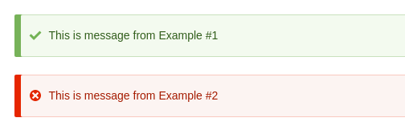
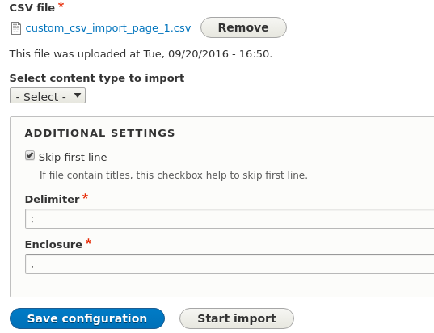

Продолжаем штурмовать Drupal 8 и на этот раз я расскажу о том, как создавать
свои типы плагинов. Что же такое плагины? Это маленькие кусочки
функциональности, которые что-то выполняют, дополняют или объявляют. Плагины
один из фундаментальных столпов Drupal 8, на них делаются поля, DS поля, блоки,
да вообще много чего. Если у вас есть потребность добавить что-то своё в уже
существующее на сайте - то с вероятностью 99% это будут плагины.

Пишутся они очень просто, поэтому я разделю этот материал на 2 части:

1. Очень мелкий каркас для плагина - чтобы показать основные этапы и набор
   минимум.
2. Практический пример, так сказать, чтобы показать на практике использование
   плагинов.

## Состав плагина

Плагины состоят из:

- Аннотации - это то что в комментариях задается. По сути можно передать
  какие-то базовые данные о плагине без необходимости писать код и методы. Т.е.
  данные что у плагина всегда будут статичны внутри него и не будут меняться ни
  при каких обстоятельствах - можно выносить в аннотации, например: id плагина и
  его заголовок. Обязательно, как минимум, должен содержать id;
- Интерфейс плагина - тут мы описываем какие методы плагин обязан описать у
  себя;
- База плагина (Plugin Base) - абстрактный класс, который наследуется от
  интерфейса плагина и позволяет для методов задать значения по-умолчанию, тем
  самым сделав эти методы не обязательными для объявления, если поведения из
  базового хватает. Это очень востребовано для получения данных из аннотации,
  так как они получаются всегда одним путем, то их можно описать в базе плагина;
- Менеджер плагина (это сервис) - это класс который описывает где искать наш
  плагин, и указывает что является интерфейсом плагина и аннотацией. Также здесь
  мы можем зарегистрировать `hook_alter` для изменения информации о плагине
  через хуки.

Вроде много всего, но они настолько мелкие кусочки, что ничего страшного в этом
нет, просто каждый выполняет свою работу и они разделены.

## Пример №1: объявление простенького плагина

Давайте реализуем очень-очень примитивный плагин и совершенно бесполезный, но он
не будет загружен логикой, поэтому он отлично продемонстрирует набор минимум для
плагина и как всё устроено.

Поставим сразу себе задачу. Нам нужен код, который будет выводить системные
сообщения на определенных страницах. Мы создадим для этого систему плагинов.
Каждый плагин будет отвечать за конкретное сообщение и тип сообщения, а также
список страниц на которых необходимо выводить данное сообщение.

Сразу давайте прикинем что куда. Например в аннотации мы вынесем 100% id
плагина, но вот сообщение и тип системного сообщения мы вынесем в методы, также
как и адреса по которым показывать данное сообщение. Мы могли бы вынести само
сообщение и его типа также в аннотации, там есть и переводы и никто не мешает
ввести всё это, но мало ли это при каких-то обстоятельствах ещё потребуется
логика, аннотации тут же заглохнут и оставляем там только ID.

Итак, приступаем. Всё лучше выполнять сразу в том порядке, в котором я описал
состав плагина, так как по такой цепочке вы логически будете заполнять данные из
предыдущих пунктов, а не прыгать между классами.

Первым делом нам необходимо [объявить свой модуль][d8-hello-world]. Давайте
назовем его **plugin_messages**. Думаю это не составит труда и двигаемся дальше.

Далее нужно объявить аннотации для нашего плагина. Аннотации находятся
в `src/Annotation`. Называть свой плагин мы будем в честь нашего же модуля
PluginMessages. Хоть это и добавит тавтологии в название некоторых файлов,
ничего страшного. Соответственно мы будем стараться именовать все файлы плагинов
схоже. Следовательно, наш файл аннотаций мы назовем PluginMessages, как и сам
плагин в дальнейшем.

```php {"header":"Листинг src/Annotation/PluginMessages.php"}
<?php

namespace Drupal\plugin_messages\Annotation;

use Drupal\Component\Annotation\Plugin;

/**
 * Аннотации для плагина PluginMessages.
 *
 * @Annotation
 */
class PluginMessages extends Plugin {

  /**
   * ID плагина.
   */
  public $id;

}
```

Всего мы объявили 1 параметр в аннотации - id, он **обязателен** для всех типов
плагинов. Это будет машинное имя плагина, чтобы мы могли их идентифицировать
как-то. На каждый нужный параметр в аннотациях вы объявляете одноименные
переменные внутри класса.

Теперь нам нужно объявить интерфейс плагина. Этот интерфейс будет использоваться
как каркас для будущих плагинов, в нём мы объявим все необходимые для нас
методы. Но напрямую интерфейсы никто не использует, как правило модуль, который
объявляет свой тип плагинов, сразу же и объявляет Plugin Base, который и
наследуется от интерфейса. В нём, как правило, задается логика и код для
некоторых методов в интерфейсе, которые не имеет никакого смысла объявлять в
каждом плагине так как код будет один.

Сразу хочу немного уйти в сторонку и сказать что я не нашел четкой инструкции
где хранить данные файлы (plugin manager\interface\base). Некоторые контрибы их
хранят в корне `src/Plugin`, а кто-то следует ядру. В ядре они хранятся в `src`.
Поэтому мы не будем ничего выдумывать и будем писать их прямо в `src`, так как
это сделано в ядре, но имейте ввиду, что эти файлы ищутся и в других папках.

Итак, объявляем наш интерфейс для плагина.

```php {"header":"Листинг src/PluginMessagesPluginInterface.php"}
<?php

namespace Drupal\plugin_messages;

use Drupal\Component\Plugin\PluginInspectionInterface;

interface PluginMessagesPluginInterface extends PluginInspectionInterface {

  /**
   * Метод, через который мы будем получать ID плагина.
   */
  public function getId();

  /**
   * Метод, через который будем получать тип сиситемного сообщения.
   */
  public function getMessageType();

  /**
   * Метод, который будет возвращать непосредственно само сообщение.
   */
  public function getMessage();

  /**
   * Данный метод будет возвращать список страниц на которых необходимо выводить
   * данное сообщение.
   */
  public function getPages();

}
```

Как я и писал выше, у нас будет небольшая тавтология в названии файла, чтобы не
путаться, первая часть - PluginMessages - название нашего плагина, а вот
PluginInterface как бы метка что это интерфейс для плагина. По факту этот файл
может называться как угодно, но мы все же будем следовать ядру и здравому
смыслу.

По методам всё ясно и из комментариев к ним, тут не должно быть никаких проблем.
Теперь мы объявим базу для плагинов, от которой будут наследоваться все будущие
плагины. Обратите внимание что данный класс должен быть абстрактным.

```php {"header":"Листинг src/PluginMessagesPluginBase.php"}
<?php

namespace Drupal\plugin_messages;

use Drupal\Component\Plugin\PluginBase;

abstract class PluginMessagesPluginBase extends PluginBase implements PluginMessagesPluginInterface {

  /**
   * Конструктор плагина - он в 99% случаев будет именно такой. По-умолчанию он
   * записывает все данные переменные в одноименные локальные свойства плагина.
   */
  public function __construct(array $configuration, $plugin_id, $plugin_definition) {
    parent::__construct($configuration, $plugin_id, $plugin_definition);
  }

  /**
   * {@inheritdoc}
   */
  public function getId() {
    # Возвращаем значение аннотации $id.
    return $this->pluginDefinition['id'];
  }

  /**
   * По-умолчанию все наши сообщения будут иметь тип status, если плагин не
   * укажет своего.
   */
  public function getMessageType() {
    return 'status';
  }

  /**
   * {@inheritdoc}
   */
  public function getMessage() {
    return '';
  }

  /**
   * {@inheritdoc}
   */
  public function getPages() {
    return [];
  }

}
```

Теперь нам осталось объявить менеджер нашего плагина.

```php {"header":"Листинг src/PluginMessagesManager.php"}
<?php

namespace Drupal\plugin_messages;

use Drupal\Component\Plugin\Factory\DefaultFactory;
use Drupal\Core\Cache\CacheBackendInterface;
use Drupal\Core\Extension\ModuleHandlerInterface;
use Drupal\Core\Plugin\DefaultPluginManager;

/**
 * Менеджер нашего плагина PluginMessages
 */
class PluginMessagesManager extends DefaultPluginManager {

  /**
   * {@inheritdoc}
   */
  public function __construct(\Traversable $namespaces, CacheBackendInterface $cache_backend, ModuleHandlerInterface $module_handler) {
    parent::__construct(
      'Plugin/PluginMessages',
      $namespaces,
      $module_handler,
      'Drupal\plugin_messages\PluginMessagesPluginInterface',
      'Drupal\plugin_messages\Annotation\PluginMessages'
    );
    # Регистрируем hook_plugin_messages_info_alter();
    # Это позволит править информацию уже существующих плагинов. Не обязательно,
    # в нашей ситуации даже бесползено, но для примера пусть будет.
    $this->alterInfo('plugin_messages_info');
    # Задаем ключ для кэша плагинов.
    $this->setCacheBackend($cache_backend, 'plugin_messages');
    $this->factory = new DefaultFactory($this->getDiscovery());
  }

}
```

Тут, как видите, тоже ничего сложного, менеджеры у 99% модулей будут идентичны,
лишь подставляются свои названия. Но давайте разъясню за `prent::_construct`. На
самом деле тут вдаваться и нет смысла, нас интересуют 1, 4 и 5 параметры. Там
всё очень очевидно:

- 1 Адрес где будут искаться плагины нашего типа.
- 4 Интерфейс плагина.
- 5 Аннотации плагина.

А вот 2 и 3 куда не понятнее, но они и не меняются, но вдруг пригодится:

2. `$namespaces` - содержит корневые пути, необходимые для поиска плагинов в
   соответствии с неймспейсами.
3. `$module_handler` - позволяет узнать инфу о модулях, какие включены и т.д.
   Также используется для поиска информации о плагинах.

Они передаются при создании нашего менеджера плагина, а мы их используем "как
есть", так что вообще не парьтесь о них.

Остался последний штрих, надо указать Drupal что мы объявили свой тип плагинов,
а плагины - это сервисы. Соответственно мы должны создать
plugin_messages.services.yml где окончательно объявим свой плагин и укажем путь
до его менеджера.

```yaml {"header":"Листинг plugin_messages.services.yml"}
services:
  plugin.manager.plugin_messages:
    class: Drupal\plugin_messages\PluginMessagesManager
    parent: default_plugin_manager
```

Вот и всё! Да-да, так просто в пару шагов объявляется свой тип плагинов, ничего
сложного, а какая гибкость!

Но чего-то не хватает, не так ли? Конечно, мы не рассмотрели как теперь эти
плагины использовать, но данный момент мы отложим ещё на чуть-чуть.

### Объявляем парочку плагинов-примеров

Для того чтобы использовать плагины и показывать какие-либо примеры как их
применять, нам нужны плагины которые используют наш тип. Мы объявим парочку
прямо в нашем же модуле. Ведь нет никакой разницы где будет объявлен плагин, в
своём или чужом модуле, поэтому не будем усложнять свои задачи и объявим в том
же самом, так сказать, плагины по-умолчанию.

Сначала объявим плагин-минимум, где не будет ничего кроме каркаса плагина и
сообщения. Назовем его DefaultPluginExample1.

```php {"header":"Листинг src/Plugin/PluginMessages/DefaultPluginExample1.php"}
<?php

/**
 * @file
 * Пример плагина.
 */
namespace Drupal\plugin_messages\Plugin\PluginMessages;

use Drupal\plugin_messages\Annotation\PluginMessages;
use Drupal\plugin_messages\PluginMessagesPluginBase;

/**
 * @PluginMessages(
 *   id="default_plugin_example_1",
 * )
 */
class DefaultPluginExample1 extends PluginMessagesPluginBase {

  /**
   * Возвращаем сообщение данного плагина.
   */
  public function getMessage() {
    return 'This is message from Example #1';
  }

}
```

Вот так простенько объявляется созданный нами плагин. Мы должны указать его ID и
сообщение, остальные данные подтянутся у нас из PluginMessagesPluginBase.

Теперь объявим второй плагин, в нем мы заполним все возможные метода.

```php {"header":"Листинг src/Plugin/PluginMessages/DefaultPluginExample2.php"}
<?php

/**
 * @file
 * Пример плагина.
 */
namespace Drupal\plugin_messages\Plugin\PluginMessages;

use Drupal\plugin_messages\Annotation\PluginMessages;
use Drupal\plugin_messages\PluginMessagesPluginBase;

/**
 * @PluginMessages(
 *   id="default_plugin_example_2",
 * )
 */
class DefaultPluginExample2 extends PluginMessagesPluginBase {

  /**
   * Возвращаем сообщение данного плагина.
   */
  public function getMessage() {
    return 'This is message from Example #2';
  }

  /**
   * {@inheritdoc}
   */
  public function getMessageType() {
    return 'error';
  }

  /**
   * {@inheritdoc}
   */
  public function getPages() {
    return [
      '/node/*',
      '/contact',
      '<front>',
    ];
  }

}

```

Во втором примере у нас появилось два дополнительных метода. Мы изменили тип
системного сообщения на "ошибку" и указали на каких страницах показывать данное
сообщение.

И вот, у нас свой тип плагинов, и даже есть два плагина-примера, осталось это
как-то всё завести, ведь Durpal не знает что ему с этим делать. И это будет
последним штрихом в создании плагина, мы будем пользоваться им. Мы сами решаем
где и как вызывать плагины, как с их данными обращаться и т.д., тут никаких
ограничений нет вообще, поэтому нам стоит прикинуть куда писать код. Так как мы
всего лишь выводим системные сообщения, да ещё их вывод зависит от страниц, то
нам надо подцепиться на какой-то хук, который будет отрабатывать на каждой
странице. Самый очевидный вариант `hook_preprocess_page()`, им то мы и
воспользуемся.

Хуки по прежнему объявляются в MODULENAME.module, там и будем писать наш хук. Но
прежде чем мы его напишем, я сразу сделаю памятку на будущее по всем полезным
методам для работы с плагинами в целом.

```php {"header":"Полезные методы для работы с плагинами"}
# Доступ к сервису наших плагинов.
$plugin_service = \Drupal::service('plugin.manager.plugin_messages');
# Получение информации о всех объявленных плагинах. (массив)
$plugin_definitions = $plugin_service->getDefinitions();
# Получение данных о конкретном плагине, по его ID.
$plugin_definition = $plugin_service->getDefinition('default_plugin_example_1');
# Проверяет, есть ли данный плагин или нет.
$has_plugin_definition = $plugin_service->hasDefinition('default_plugin_example_1');
# Создает объект плагина. Вторым параметром вы можете передать массив с
# нужной для вас информацией. Эти данные доступны в плагине
# $this->configuration - это удобно когда необходимо плагинам передавать
# какую-либо информацию которая может оказаться полезной. Например сущность
# если этот плагин как-то взаимодействует с сущностью. Таким образом авторам
# кастомных плагинов не придется искать конкретную сущность и загружать её.
$plugin_instance = $plugin_service->createInstance('default_plugin_example_1');
```

И наконец-то последний кусок кода который и будет работать с нашими плагинами.
Напоминаю, пишем его в `hook_preprocess_page()`.

```php {"header":"plugin_messages_preprocess_page()"}
/**
 * Implements hook_preprocess_page().
 */
function plugin_messages_preprocess_page(&$variables) {
  $plugin_service = \Drupal::service('plugin.manager.plugin_messages');
  foreach ($plugin_service->getDefinitions() as $plugin_id => $plugin) {
    $instance = $plugin_service->createInstance($plugin_id);
    $message_type = $instance->getMessageType();
    $message = $instance->getMessage();
    # Переводим массив с адресами для отображения в строку, где каждый элемент
    # массива с новой строки.
    $pages = implode("\n", $instance->getPages());
    $current_path = \Drupal::service('path.current')->getPath();
    $path_match = \Drupal::service('path.matcher')->matchPath($current_path, $pages);

    # Мы будем выводить сообщение, если не задано страниц для вывода - это
    # значит что сообщение нужно выводить везде, а если задано, то только на тех
    # страницах (паттернах) которые указаны. Поддерживаются <front>, node/*.
    if (empty($instance->getPages()) || $path_match) {
      drupal_set_message($message, $message_type);
    }
  }
}

```

Теперь можно включать модуль и проверять! Если все сделали правильно, то на
главной вы должны увидеть два сообщения, а например, на /user - всего одну, так
как второй плагин не проходит условия, ведь в списке доступных путей отсутствует
соответствующий паттерн, а первый проходит, так как у него нет никаких
требований к пути.



Вот так всё просто. Очень гибкое решение для расширяемости чего угодно. А мы
пойдем дальше.

## Пример №2: Подключаем систему плагинов к CustomCSVImport

В прошлой статье я
написал [как создать свой импорт из CSV][d8-custom-csv-import].
И решил что покажу более наглядный пример по внедрению системы плагинов. Идею
импорта из CSV мы менять не будем, хотя и импорт из разных источников тоже можно
вынести в плагины, но он планировался как импорт из CSV и мы будем идти по этому
пути. Что же можно внедрить туда в качестве плагинов? Например, плагины по
импорту файлов. Мы загружаем файл, а затем выбираем плагин для импорта. В
зависимости от выбранного плагина, данные будут обрабатываться иначе и можно
будет пихать разные CSV файлы для разных задач через одну форму. Это мы и
сделаем, только по смыслу мы будем объявлять плагины для конкретного типа
материала. Т.е. для каждого материала можно будет объявить свой плагин - и он
будет импортировать данные из CSV в конкретный тип с соответствующей обработкой
данных из строк.

Для этого нам придется добавить систему плагинов в модуль, а также провести
небольшой рефактор кода, так как некоторые части будут заменены плагинами. Я
очень настоятельно рекомендую хотя бы глазами пробежаться по соответствующей
статье, там же и скачать готовый модуль, с которым мы будем далее работать. На
местах которые объяснены в той статье, я тут останавливаться не будут. Только
плагины и рефакторинг.

Итак, перед нами модуль, который выполняет свою задачу и мы решили внедрить
систему плагинов, с чего начать? Ну во-первых надо конечно же отталкиваясь от
задач модуля и его логики, продумать что можно вынести в плагины, а что оставить
как есть. Во-вторых, нужно написать сам плагин. В-третьих, то что мы вынесли в
плагин нужно будет внедрить в существующий код, заменив старый - новым.

Итак, приступим, и сразу опишем что выносим, что оставляем. В целом, код в том
модуле на 90% универсален для импорта из любого CSV файла хоть куда, за работу с
данными у нас отвечает `CSVBatchImport::processItem()`, который и создает\правит
сущности. В наше случае, пока что, Article. Остальной код отвечает за настройки
и подготовку импорта - их трогать нам нет смысла, они подойдут для 100%
вариантов импорта, а вот `processItem()` как раз и нужно выносить в плагины.
Соответственно, у нас будет плагин с единственным методом `processItem()` - ему
мы будем отдавать данные из CSV файла, а именно, данные из каждой строки по
очереди, а данный метод будет работать с каждой строчкой уникально, как это
сейчас и реализовано. А в аннотации мы добавим обязательный id, и label - для
метки, которую будем выводить в форме загрузке на выбор. Плагин назовем *
*CustomCSVImport**.

Начнем с аннотаций.

```php {"header":"Листинг src/Annotation/CustomCSVImport.php"}
<?php

namespace Drupal\custom_csv_import\Annotation;

use Drupal\Component\Annotation\Plugin;

/**
 * Annotations for CustomCSVImport plugins.
 *
 * @Annotation
 */
class CustomCSVImport extends Plugin {

  /**
   * The plugin ID.
   */
  public $id;

  /**
   * Label will be used in interface.
   */
  public $label;

}
```

Теперь объявляем интерфейс для плагина.

```php {"header":"Листинг src/CustomCSVImportPluginInterface.php"}
<?php

namespace Drupal\custom_csv_import;

use Drupal\Component\Plugin\PluginInspectionInterface;

interface CustomCSVImportPluginInterface extends PluginInspectionInterface {

  /**
   * {@inheritdoc}
   */
  public function getId();

  /**
   * {@inheritdoc}
   */
  public function getLabel();

  /**
   * {@inheritdoc}
   */
  public function processItem($data, &$context);

}
```

Заметьте, мы также сразу в интерфейсе указали что будем передавать два аргумента
в метод `processItem()`.

- `$data` - массив с данными строки из CSV, которые необходимо обработать.
- `$context` - информация о batch операции.

Обратите внимание что аргумента теперь 2. Старый метод в CSVBatchImport пока что
выглядит так: `processItem($id, $title, $body, $tags, &$context)` - так как мы
всегда загружаем файл с четкой структурой столбцов, заранее определенный нами. С
плагинами такое не прокатит, каждый плагин может работать с нужным кол-вом
столбцов, поэтому мы их будем отдавать массивом, в соответствии с порядком
столбцов. Т.е. если абстрагироваться от текущего метода, чтобы получить `$title`
нам придется обратиться к массиву `$data[1]`.

Теперь объявим базу для плагинов.

```php {"header":"Листинг src/CustomCSVImportPluginBase.php"}
<?php

namespace Drupal\custom_csv_import;

use Drupal\Component\Plugin\PluginBase;

abstract class CustomCSVImportPluginBase extends PluginBase implements CustomCSVImportPluginInterface {

  /**
   * {@inheritdoc}
   */
  public function __construct(array $configuration, $plugin_id, $plugin_definition) {
    parent::__construct($configuration, $plugin_id, $plugin_definition);
  }

  /**
   * {@inheritdoc}
   */
  public function getId() {
    return $this->pluginDefinition['id'];
  }

  /**
   * {@inheritdoc}
   */
  public function getLabel() {
    return $this->pluginDefinition['label'];
  }

  /**
   * {@inheritdoc}
   */
  public function processItem($data, &$context) {
    $context['results'][] = 'Result name';
    $context['message'] = 'Status message';
  }

}
```

Создаем менеджер плагина.

```php {"header":"Листинг src/CustomCSVImportManager.php"}
<?php

namespace Drupal\custom_csv_import;

use Drupal\Component\Plugin\Factory\DefaultFactory;
use Drupal\Core\Cache\CacheBackendInterface;
use Drupal\Core\Extension\ModuleHandlerInterface;
use Drupal\Core\Plugin\DefaultPluginManager;

/**
 * Provides an CustomCSVImport plugin manager.
 */
class CustomCSVImportManager extends DefaultPluginManager {

  /**
   * {@inheritdoc}
   */
  public function __construct(\Traversable $namespaces, CacheBackendInterface $cache_backend, ModuleHandlerInterface $module_handler) {
    parent::__construct(
      'Plugin/CustomCSVImport',
      $namespaces,
      $module_handler,
      'Drupal\custom_csv_import\CustomCSVImportPluginInterface',
      'Drupal\custom_csv_import\Annotation\CustomCSVImport'
    );
    # hook_custom_csv_import_info_alter();
    $this->alterInfo('custom_csv_import_info');
    $this->setCacheBackend($cache_backend, 'custom_csv_import');
    $this->factory = new DefaultFactory($this->getDiscovery());
  }

}
```

Осталось зарегистрировать наш плагин в сервисах.

```yaml {"header":"Листинг custom_csv_import.services.yml"}
services:
  plugin.manager.custom_csv_import:
    class: Drupal\custom_csv_import\CustomCSVImportManager
    parent: default_plugin_manager
```

И вот наш плагин уже готов. Сразу давайте перенесем наш старый код для импорта
Article из csv в плагин, а также добавим плагин для Page. Пока что копипастом
выносим код импорта из старого метода, внутренности мы заменим после этого.

```php {"header":"Листинг src/Plugin/CustomCSVImport/Article.php"}
<?php

namespace Drupal\custom_csv_import\Plugin\CustomCSVImport;

use Drupal\Core\Annotation\Translation;
use Drupal\custom_csv_import\Annotation\CustomCSVImport;
use Drupal\custom_csv_import\CustomCSVImportPluginBase;
use Drupal\node\Entity\Node;
use Drupal\taxonomy\Entity\Term;

/**
 * Class Article
 * @package Drupal\custom_csv_import\Plugin\CustomCSVImport
 *
 * @CustomCSVImport(
 *   id = "article",
 *   label = @Translation("Article")
 * )
 */
class Article extends CustomCSVImportPluginBase {

  /**
   * Import article node.
   *
   * @param $data
   * @param $context
   */
  public function processItem($data, &$context) {
    list($id, $title, $body, $tags) = $data;
    if (!empty($id)) {
      $node = Node::load($id);
    }
    else {
      $node = Node::create([
        'type' => 'article',
        'langcode' => 'ru',
        'uid' => 1,
        'status' => 1,
      ]);
    }

    $node->title = $title;
    $node->body = [
      'value' => $body,
      'format' => 'full_html',
    ];
    $tags_array = explode(',', $tags);
    $tags_ids = [];
    foreach ($tags_array as $k => $v) {
      $query = \Drupal::entityQuery('taxonomy_term');
      $query->condition('vid', 'tags');
      $query->condition('name', $v);
      $query->range(0, 1);
      $result = $query->execute();
      $tid = reset($result);

      if ($tid) {
        $tags_ids[] = $tid;
      }
      else {
        $term = Term::create([
          'name' => $v,
          'vid' => 'tags',
        ]);
        $term->save();
        $tags_ids[] = $term->tid->value;
      }
    }
    $node->field_tags = $tags_ids;
    $node->save();
    $context['results'][] = $node->id() . ' : ' . $node->label();
    $context['message'] = $node->label();
  }

}
```

```php {"header":"Листинг src/Plugin/CustomCSVImport/Page.php"}
<?php

namespace Drupal\custom_csv_import\Plugin\CustomCSVImport;

use Drupal\Core\Annotation\Translation;
use Drupal\custom_csv_import\Annotation\CustomCSVImport;
use Drupal\custom_csv_import\CustomCSVImportPluginBase;
use Drupal\node\Entity\Node;

/**
 * Class Article
 * @package Drupal\custom_csv_import\Plugin\CustomCSVImport
 *
 * @CustomCSVImport(
 *   id = "page",
 *   label = @Translation("Page")
 * )
 */
class Page extends CustomCSVImportPluginBase {

  /**
   * Import article node.
   *
   * @param $data
   * @param $context
   */
  public function processItem($data, &$context) {
    list($id, $title, $body) = $data;
    if (!empty($id)) {
      $node = Node::load($id);
    }
    else {
      $node = Node::create([
        'type' => 'page',
        'langcode' => 'ru',
        'uid' => 1,
        'status' => 1,
      ]);
    }

    $node->title = $title;
    $node->body = [
      'value' => $body,
      'format' => 'full_html',
    ];
    $node->save();
    $context['results'][] = $node->id() . ' : ' . $node->label();
    $context['message'] = $node->label();
  }

}
```

И вот у нас уже два плагина, для статей и страниц (новый, его не было ранее в
модуле).

Теперь осталось всё это подключить в наш старый код, заменив ненужные части на
новые, а также добавить недостающие.

Для начала давайте переделаем CSVBatchImport.php.

```php {"header":"src/CSVBatchImport.php"}
# Первым делом добавляем два новых свойства.
# Будем хранить id плагина и его объект.
private $importPluginId;
private $importPlugin;

# Нам необходимо немного поменять __construct().
# В него теперь мы дополнительно первым аргументом будет передавать id
# плагина, и на основе этого сразу создавать его объект.
public function __construct($plugin_id, $fid, $skip_first_line = FALSE, $delimiter = ';', $enclosure = ',', $batch_name = 'Custom CSV import') {
  $this->importPluginId = $plugin_id;
  $this->importPlugin = \Drupal::service('plugin.manager.custom_csv_import')->createInstance($plugin_id);
  ...
}

# Немного меняем метод отвечающий за формирование операций для Batch.
# Мы теперь передаем не $this а $this->ImportPlugin (теперь за импорт отвечает
# плагин а не текущий объект). Также мы раньше передавали $data, а теперь
# мы передаем его в качестве массива.
public function setOperation($data) {
  $this->batch['operations'][] = [[$this->importPlugin, 'processItem'], [$data]];
}

# Также нужно удалить processItem() метод, просто за ненадобностью, больше
# он нам не нужен, его код мы перенесли в плагин Article.
```

Учитывая данные правки вносим соответствующие правки в форму.

```php {"header":"src/Form/ImportForm.php"}
# Добавляем метод который будет формировать список плагинов для селекта.
protected function getPluginList() {
  $definitions = \Drupal::service('plugin.manager.custom_csv_import')->getDefinitions();
  $plugin_list = [];
  foreach ($definitions as $plugin_id => $plugin) {
    $plugin_list[$plugin_id] = $plugin['label']->render();
  }
  return $plugin_list;
}

# Добавляем селект в нашу форму buildForm().
...
$form['file_information'] = [
  '#markup' => $this->t('This file was uploaded at @created.', ['@created' => $created]),
];

$form['import_plugin'] = [
  '#title' => $this->t('Select content type to import'),
  '#type' => 'select',
  '#required' => TRUE,
  '#options' => $this->getPluginList(),
  '#empty_option' => '- Select -',
];

# Тут мы добавляем новый параметр #name, чтобы идентифицировать клик
# на данную кнопку. 
$form['actions']['start_import'] = [
  '#type' => 'submit',
  '#value' => $this->t('Start import'),
  '#submit' => ['::startImport'],
  '#weight' => 100,
  '#name' => 'start_import',
];
...

# Нам также теперь необходимо написать валидацию. Мы добавили селект с выбором
# плагина на импорт, но мы не будем записывать значение, чтобы случайно, загрузив
# новый файл, не отдать его на импорт ранее выбранному плагину.
# Мы также не помечаем его обязательным, так как при сохранении настроек он будет
# ругаться что мы ничего не выбрали, но нам и не нужно. Поэтому принуждать выбрать
# будем только при нажатии на кнопку начала импорта.
public function validateForm(array &$form, FormStateInterface $form_state) {
  parent::validateForm($form, $form_state);
  if ($form_state->getTriggeringElement()['#name'] == 'start_import' && !$form_state->getValue('import_plugin')) {
    $form_state->setErrorByName('import_plugin', t('You must select content type to import.'));
  }
}

# В колбек для старта импорта вносим корректировки.
# Мы просто дополнительно передаем ID плагина первым аргументом.
public function startImport(array &$form, FormStateInterface $form_state) {
  ...
  $plugin_id = $form_state->getValue('import_plugin');
  $import = new CSVBatchImport($plugin_id, $fid, $skip_first_line, $delimiter, $enclosure);
  $import->setBatch();
}
```

А дальше всё как и раньше. Мы загружаем файл, выбираем плагин отвечающий за
импорт, и стартуем его. CSVBatchImport разбирает CSV файл по строкам а затем
запускает Batch. Batch передает построчно данные строк в виде массива в
соответствующем порядке столбцов таблицы в выбранный нами плагин импорта. А
плагин уже выполняет импорт.

Вот вам два файла для теста двух
плагинов: [article](/sites/default/files/blog/attachment/2016/9/20/custom_csv_import_article_1.csv)
и [page]
/sites/default/files/blog/attachment/2016/9/20/custom_csv_import_page_1.csv).

Если всё сделано верно, у вас появится селект и в соответствии с выбранным типом
контента (плагина) будет производиться импорт из загруженного файла.



Если все сделали верно, то импорт будет осуществляться в соответствии с
выбранным плагином.

Тут есть куда и дальше расширять модуль. Очень было бы неплохо хранить для
каждого плагина свой файл, но это уже не касается данной темы, это можно
реализовать через аякс ребилд формы при выборе типа содержимого.

Вот и всё, два примера работы с плагинами, с чистого листа и в существующем
модуле. Оба модуля прилагаю. Залетайте также на мой
канал [в Telegram](https://telegram.me/niklannet) там я пишу по мелочи, не
только о Drupal.

[d8-hello-world]: ../../../../2014/10/12/d8-hello-world/index.ru.md
[d8-custom-csv-import]: ../../../../2016/09/11/d8-custom-csv-import/index.ru.md
