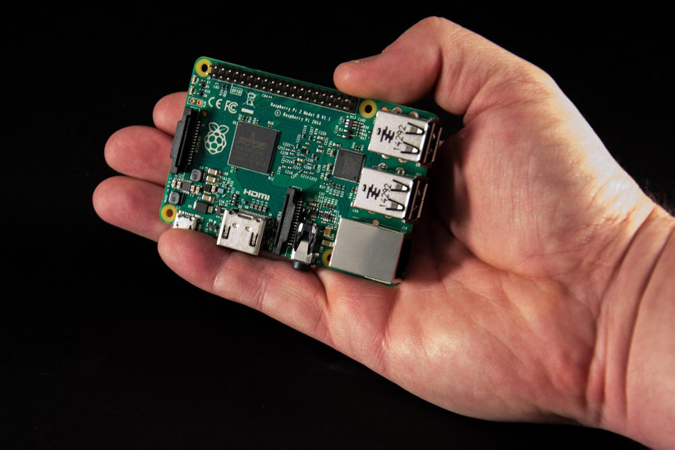
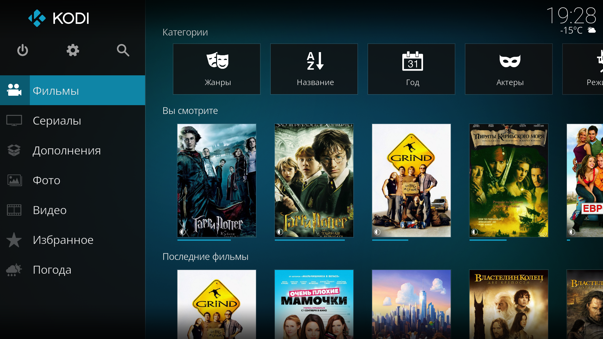
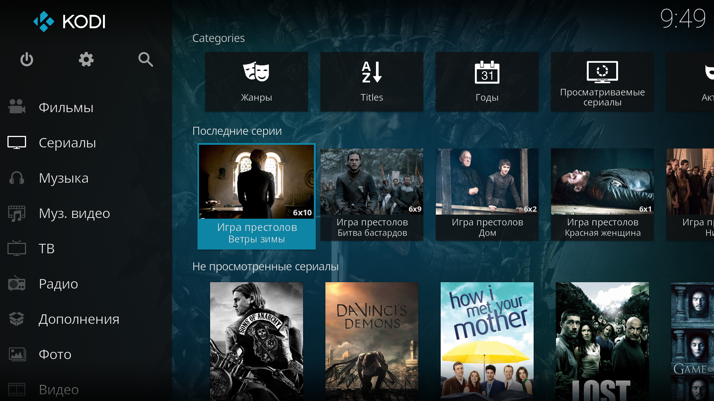
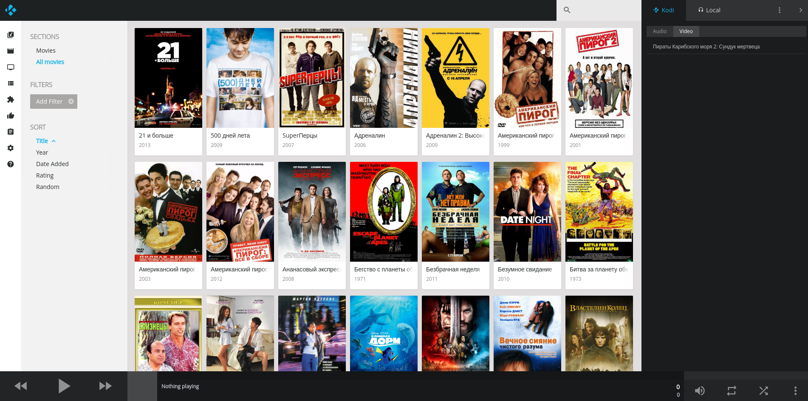
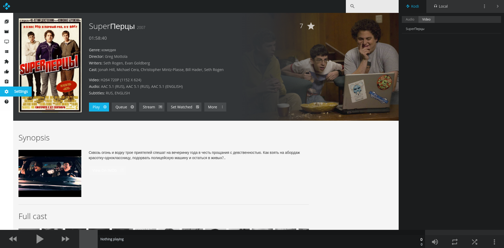
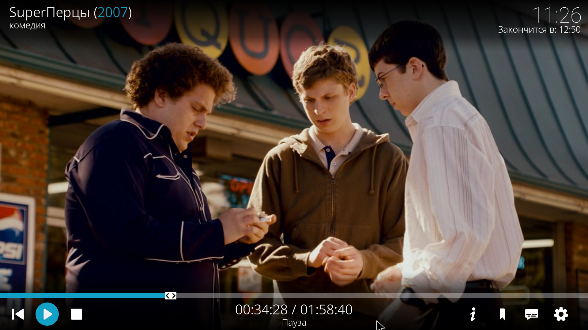

Невероятно, но факт - череду статей о Drupal 8 продолжает статья не о вебе. Хочу
поделиться опытом создания медиацентра для ТВ, так как это оказалось настолько
интересно, что я с ноября до сих пор играюсь с ним. Этот длиннотекст будет полон
восхваления и обожания о том, о чем написано, так как столько годноты в одном
месте я давно не находил :)

Первое, что, скорее, бросилось в глаза - промо картинка с малиной (Raspberry).
Кто в курсе - сразу понял о чем пойдет речь, но хочу опередить что это
реализуемо на любом устройстве которое подключается к монитору или телевизору.
Можно задействовать старенький ПК, или ноутбук, просто это не будет миниатюрно.
А кто не знает к чему тут малина - ниже распишу кратко о том что это и что можно
сделать помимо медиацентра.

_Это не техническая статья, скорее больше обзор и впечатления от того что я
нарыл и связал вместе._

_TL;DR Raspberry - лучший подарок и игрушка для IT-шника, Kodi - просто топовый
медиацентр_

## Кому это будет интересно и почему я про это написал

_Ниже стена текста бла-бла-бла, можно пропустить._

Смею предположить что у большинства читающих имеется опыт работы со смарт ТВ.
Лично у меня опыт двух телевизоров Samsung 2013 г., LG 2016 г. вызывают просто
гнев и негодование. Искреннее не понимаю, зачем туда это всё впихивают и
накручивают за это цену, не понимаю что там стоит за железо, которое падает от
нехватки памяти при открытии сайта отличного от гугла, яндекса. Так что опыт
сопровождался болью. При том что эти смарт ТВ обновят 1-2 раза непонятно для
чего, возможно для завоза новой рекламы в стор, и на этом обновления
заканчиваются. Например у самсунга еще веселее, спустя 3 года — в том году,
начали дистанционно отключать службы, уведомляя о том, что устарели и больше не
поддерживаются. Отключили рекомендации, часть программ и т.д. В итоге там от
смарт ТВ осталось - нихера, одни иконки. Браузер нещадно падает или уводит телик
в ребут от первого же сайта с обилием рекламы или js, на которые нарваться не
так то и сложно. Приложения как правило там бесполезные — новости, статейки, в
итоге смарт тв превратился в тыкву. На прошлогоднем телеке не так печально, но
ситуация не лучше, меньше чем через год также уходит в ребут на многих сайтах,
особенно если там есть медиа контент.

Также у меня был опыт использования андроид приставки, который также оказался не
очень приятным. Даже если откинуть недостатки приставки от самого производителя,
где совершенно неюзабельная прошивка, отсутствие каких-либо обновлений вообще,
постоянно зависание, то остаются недостатки таких приставок в целом, когда
приложения развиваются и растут в объеме и в тех. требованиях, и это начинает
просто лагать ибо железо не вывозит, ну и разумеется цена нормальных приставок
начинается от 7к, которые с их начинкой через год-два также выдохнутся чисто по
железу. Но если у вас где-то завалялась такая приставка — стоит попробовать
поставить всё что я опишу ниже, там софт практически не растет в потреблении.

Поэтому я встал перед выбором, взять ли новую приставку андроид от Xiaomi, либо
собрать свою, и решил рискнуть, так как сумма риска была 3000 руб, против
приставки за 7.5к. И вот эта статья именно о том что этот риск оказался не то
что оправдывающим, но просто впечатляющим. До сих пор нахожусь в восторге от
такой связки. Если вам нужен именно медиацентр, играть видосики а не ползать по
сайтам, но иметь возможность все же стримить из инета - то этот вариант намного
лучше любой андроид приставки просто по всем параметрам и дальше вы узнаете
почему. Даже если учесть что оба девайса необходимо заменять ежегодно — распбери
выигрыват по цене и возможностям. Так как если он выдохнется для медиацентра, на
нем всегда можно развернуть что-то другое, а рутать андроид приставки и возиться
с ними будет куда сложнее.



## Raspberry Pi

_Ниже стена текста бла-бла-бла, можно пропустить._

Если вы не слышали про Raspberry Pi — это маленький ПК (плата с процом и прочими
модулями), с которым вы можете делать что угодно. Характеристики зависят от
модели, я брал последнюю из мощных Raspberry Pi 3 Model B, она обладает
следующими характеристиками:

* **Процессор:** Broadcom 2837 quad-core ARM Cortex-A53 64bit (1,2GHz), OpenGL
  2.0
* **Оперативная память:** 1Gb
* **Видеовыход:** HDMI
* **А/V выход:** А/V выход 3.5мм jack 4 pin
* **USB:** USB 2.0 х 4
* **Сеть:** WiFi 802.11n, 10/100Mb RJ45 Ethernet
* **Bluetooth:** Bluetooth 4.1, Bluetooth Low Energy
* **Карта памяти:** Micro SD
* **GPIO:** 40

Возможно вы начали прикидывать что бы вы сделали с этой машиной помимо
медиацентра, и верно, сделать можно просто уйму всего. Я вообще покупал на самом
деле не только для медиацентра, но и для стриминга игр с ПК на телик. И да, это
работает супер — FullHD @ 60fps, инпутлаг 1-4ms, потери в качестве минимальные.
Например тот же софт на средней мощности ноутбуке с 8ГБ оперативки, GeForce
650M, и i5 тянул в качестве в 2 раза хуже чем распбери и зависал. Но тут скорее
wifi модуль старенький, а также софт для Windows на Java, а для распбери на сях.
Кому интересно это - [Moonlight](http://moonlight-stream.com/). Так что
владельцы карточек Nvidia с поддержкой Nvidia Share могут сделать себе полный
аналог [Steam Link](http://steamlink.buka.ru/) который стоит 7к, за 2.5-3к. И
даже лучше, так как вы не будете ограничены библиотекой стима, можно будет
запускать любой софт для стрима. Правда потребуется активное охлаждение, но это
стоит 50 рублей.

На нем также можно развернуть полноценные десктопы, но они не будут уж такими
отзывчивыми, но вот Raspbian (Debian + XFCE) просто летают, можно работать в
офисных пакетах, нагрузка на проц не прыгает выше 10%, оперативка держится
всегда меньше половины. Лаги начинаются только открыв хром с медиа. 1080p на
YouTube в последний раз когда я смотрел, тащил с подлагиваниями, но там
выпускали обновление на GPU какое-то, говорили производительность подняли, но
мне уже не интересно было. Я тот же YouTube могу смотреть через медиацентр о
котором и пойдет речь.

Если захотеть, можно установить Android TV. Google портировали Android TV для
Raspberry 3, официальных сборок нет на данный момент, но уже есть куча
кастомных, андроид тв поддерживает распбери уже на уровне ядра, он не лагает в
1080 вообще.

Любители старых игр также получат огромный простор для ностальгии. Я вам лишь
дам ссылку [RetroPi](https://retropie.org.uk/) дальше копайте сами. Там просто
куча таких сборок. Эмулируются вообще все старые консольки, даже PS One и PSP,
разумеется на последнем распбери без лагов и всё в 1 ОС. Даже эмуляторы
приставок есть типа файтингов которые в торговых центрах раньше стояли. Люди
делают полноценные [игровые стенды](https://www.youtube.com/watch?v=K3QXLQ1UXqs)
у себя дома на такой связке и продаются даже специальные манипуляторы с
кнопками.

У кого руки не из одного места, и богатая фантазия, творят просто невероятные
вещи.
Например [умные зеркала](https://www.youtube.com/watch?v=fkVBAcvbrjU) ([тут тоже вроде распбери под капотом](https://www.youtube.com/watch?v=sh2EJzplkpM))
и прочие невероятные штуки. Можно развернуть OwnCloud и прочие сервисы, nginx,
apache, да хоть свой дев сервачек, никаких проблем.

А если немного вернуться к вебу, то на нем можно запустить даже phpStorm и
работать. Я не проверял, но гайдов навалом, думаю запустится сразу, а после
оптимизации по гайдам будет намного лучше работать. Ну мало ли, вы захотите
поизвращаться). Учтите что система жрет там порядка 20-40МБ - остальное уйдет
phpStorm.

Если вы не знаете что подарить IT-шнику на какой-то праздник — это просто
верняк, по началу не понятно что с ним делать, а потом начинаешь гуглить, и
сидишь думаешь, что бы первым попробовать. Каждый придумает ему назначение, а за
такие деньги он просто находка. Играться он будет не один месяц, и подарок
выйдет очень запоминающимся.

Чтобы опередить вопросы, сразу напишу что
брал [тут](https://ru.aliexpress.com/item/2016-NEW-Original-Raspberry-Pi-3-Model-B-Board-1GB-LPDDR2-BCM2837-64-bit-Quad-Core/32626862737.html).
Обратите внимание, у него нету никаких дисков, он работает через Micro SD, так
что лучше сразу там же и купите у продавца. Минимум 8гб. 4гб - занимает
Raspbian, порядка 2-3гб занимает медицентр (на отдельной ОС сам медиацентр 100
мб). Мне хватает, я взял просто две по 8. Если хотите медиацентр, а также
смотреть кинцо из онлайна, то лучше иметь внешний накопитель, иначе берите сразу
32гб+, чтобы с запасом, но лучше все же внешний жесткий диск. У меня в итоге 8гб
флешка под систему + 4ТБ + 1ТБ внешние диски. Для медиацентра охлаждение не
нужно. Иногда перегревается но не критично. У меня работает 24\7 - почему? Вы
узнаете позже.



## Медиацентр KODI

### KODI и разновидности

Я поражаюсь как не знал о [Kodi](https://kodi.tv/) до этого момента - это просто
супер медиаплеер для всего что только можно воспроизвести.
Он [OpenSource](https://github.com/xbmc/xbmc), следовательно билды создаются под
все востребованные системы — Windows, Linux, MacOS, iOS, Android. Если у вас
есть какое-то старое устройство которое можно подключить к монитору, телику и он
имеет хотя бы 500мб оперативки, на нем можно развернуть такой медиацентр. Т.е.
Raspberry тут вообще не обязатален. Просто если хотите что-то мелкое и
непрожорливое к телику, что вообще не издает звуков - то он отличный выбор.

У этого плеера куча вариантов дистрибуции. Куча неофициальных дистрибутивов с
разными плюсами и минусами, только для Raspberry я попробовал следующие
варианты:

* [OSMC](https://osmc.tv) - впервые поставил именно эту сборку, на неё же и
  вернулся, её же поставил и маме на распбери. На скринах в статьи везде
  KODI 17, в OSMC Kodi 16 на данный момент. Какой недостаток у этой системы? Она
  имеет только стабильный билд. Для кого-то это даже не недостаток. Т.е. никаких
  найтли билдов, бета-версий, ничего (upd. для Kodi 17 билды уже есть, гайд в
  самом низу). Только релиз, только хардкор. Как говорится, чик-чик и в
  продакшен. Жирный плюс, который лично для меня очень важен - Debian под
  капотом. Если вы не знакомы с линуксом - для вас этот пункт-пустышка, но лично
  для меня это простор для кастомизации.
* [LibreELEC](https://libreelec.tv/) - я так понял отпочковавшийся проект от
  OpenELEC, намного активнее второго, имеет дефолтный KODI со своими
  репозиториями для апдейта. Пользовался им недолго после OSMC. Очень просто
  переключаться на бета версии системы и обратно на стейблы. В такой переходный
  момент Kodi это чудесно - так как изменения кардинальные и сидеть на старой
  как-то не хотелось, но все же вернулся к OSMC дожидаться официального релиза
  Kodi 17 - так как у этой системы, лично для меня, есть фатальный недостаток -
  там Linux Kernel + скомпиленный и настроенный на автозапуск Kodi. Никаких
  пакетных менеджеров, ничего там нет. В остальном система скорее перевешивает
  OSMC, если откинуть то что вы тут ничего особо не сделаете с системой, так как
  компилить из исходников занятие такое. Надо понимать и держать в уме, что у
  Kodi есть куча дополнений, которые интегрируются с системными программами, но
  при этом их не устанавливая, и на дебиане их поставить дело пары секунд, а вот
  тут геморои на часы, а то и дни.

Т.е. если вам нужна максимальная производительность, хотя особой разницы в
скорости между ними нет вообще, вы не хотите ничего тюнить, видеть линукс, он
вам не интересен - берите LibreELEC, в этом плане он на голову выше OSMC. Пока
вы не нарветесь на потребности которые требуют вмешательства в систему - это
будет замечательный дистрибутив. Но вот, например, захотели вы развернуть FTP
сервачек на своём распбери, дальше поймете зачем, и тут оп! и всё, приехали, в
OSMC это можно сделать через apt-get, и даже проще, там скрипт установки FTP
сервера прямо в системе, только скажи что надо и он сам все пропишет и настроит,
а на LibreELEC вам надо самим найти программу, повезло если там бинарник уже
лежит под вашу архитектуру, иначе придется компилировать, в любом случае надо
руками настраивать и прописывать автозапуск с системой - в общем занятие на
любителя. По опыту скажу, нарваться на аддон требующий системный софт - очень
проблематично, скорее вы найдете обвязку в Kodi для какого-то софта который
хотите чем нарветесь на интеграцию просто так не знаю про него. Но я вот один
раз нарвался, и тогда то я и откатился на OSMC. Благо перекат занимает минут 10,
так как базу сосканить дело быстрое, все же на дисках.

Есть ещё куча разных сборок с коди для Rasbperry - но это самые известные. Ранее
упомянутый RetroPi также имеет возможность запуска KODI и он там предустановлен,
и наоборот, его можно запускать из KODI через дополнение но билды есть только
под LibreELEC (гуглите Gamestarter). И сейчас официально от KODI развивается
раздел в медиацентре для игр и репозиториями для их дополнений — видимо скоро
это будет на уровне самого KODI.

Так что перед тем как что-то делать, вы можете прямо сейчас поставить на свою ОС
KODI и посмотреть что это за зверь. Правда на момент написания стабильная версия
KODI 16, которая кардинально отличается в визуальном плане от KODI 17. В плане
функционала 1 в 1. Но UX сильно поменялся, так что впечатления от версий разные.

### Какие форматы поддерживает KODI?

Очевидный вопрос для данного рода софта. Я всегда считал лидером в этом VLC, и
даже не удивлюсь если они как-то сотрудничают. Но данный вопрос я бы и вовсе
перефразировал: Какие форматы KODI не поддерживает? Я просто отвечу так — не
знаю, но он жрет даже ISO образы DVD\Blu-Ray. Так что если у вас завалялась
отличная коллекция фильмов на дисках, и есть внешние накопители, и вы хотите
собрать медиатеку, то снимаете образы с дисков, складываете на диск и вуаля -
всё готово.

Опять же, имеется сомнение? Проще поставить на ПК и скормить ему интересующий
формат. Могу сказать одно точно. Видео в кодеке VC1 - глючат везде, даже на
мощном ПК - так как этот кодек требует покупки лицензии, которая стоит 1 фунт на
офф. сайте распбери и привязывается к железке навсегда. Ну это мало ли, у вас
такие видео есть, я предупредил ;)

### Что это за зверь и что он умеет

Буду рассказывать обо всем по порядку. Так как возможностей у него просто уйма.
На скринах половина отключена, а другая не показана.


#### Фильмы

Этот тот раздел за что я так сильно полюбил KODI и пришел в неимоверный восторг.
Если у вас своя коллекция фильмов, те же ISO файлы с DVD дисков, не важно - он
собирает это всё в единую медиатеку. Добавляет постеры на нужном языке,
описание, актерский состав, трейлеры, постеры, рейтинги и т.д. Отслеживает что
вы просмотрели и сколько раз, где остановились и даже есть возможность спрятать
сюжет во избежание сполейров. Группирует фильмы по коллекциям если у фильма
более 1 части. Всё это тонко настраивается, от параметров сканирования, до
параметров вывода и воспроизведения.

Информацию о фильмах он берет с не менее интересного
сайта [The Movie Database](https://www.themoviedb.org/) - это что-то Wikipedia в
мире фильмов и сериалов. К парочке фильмов я сам добавил трейлеры с youtube на
русском и названия - после обновления медиатеки все мои изменения пришли
моментально, без всякой премодерации - что просто круто. Я даже знать не знал о
таком сайте. В целом такие источники данных можно подключать через дополнения,
там есть и Kinopoisk и IMDB. Но в связи с тем что API нет или дорого, там
парсятся страницы - что очень, ну очень долго. У TMDB - API бесплатный и без
ограничений для всех. Сайт находка просто. Некоторую информацию о медиафайле
можно чтобы он парсил непосредственно из файла, превьюшки глав, формат видео,
разрешение, кодек и т.д.

Медиатека, на основе распарсеных данных о фильме, дробится на несколько
вариантов и позволяет просматривать её по разным критериям: жанр, год выпуска,
конкретный актер, продюсер, киностудия, рейтинг, название, коллекция. В общем
фильмы раскладываются по полочкам и вы их можете просматривать как вам угодно
или настроить свой собственный фильтр по всем данным сразу. В отображении всех
фильмов можно менять варианты отображения что позволит настроить медиатеку как
вам удобно.

На главном экране выбрав раздел фильмов но не перейдя в него, он показывает
фильмы которые вы начали смотреть, но не досмотрели, последние фильмы которые
добавлены в медиатеку. А также непросмотренные, случайные фильмы и предложения
конкретных жанров.



#### Сериалы

Этот раздел похож на раздел фильмов. Его отличие в том, что он показывает
сколько всего серий данного сериала у вас в медиатеке и сколько вы просмотрели.
Если вы оперативно пополняете её, он будет показывать новые серии. Также он
указывает какую серию сейчас нужно смотреть так как помечает уже просмотренные.
Информацию он также берет с TMDb ил других источников. Но сразу предупреждаю, не
забудьте в настройках указать скрытие описания для не просмотренных серий - так
как по опыту, например, у сериала "Остаться в живых" такие описания, что серию и
вовсе смотреть не нужно. Так что крайне не рекомендую включать данную опцию так
как при паузе видео оно также отображается и глаза сами лезут прочитать. Также
прикольно что у каждой серии есть свой рейтинг а не общий на весь сериал и можно
установить свой для конкретной серии.

#### Музыка и муз. видео

Эти разделы подойдут для тех кто хранит музыку локально. Я пользуюсь Google
Music, поэтому даже не пробовал их. Полагаю он также может парсить инфу из
различных источников. Точно знаю что там есть режим вечеринки, который хаотично
что-то крутит и ещё что-то делает, но я, честно, не пробовал. Эти два раздела я
просто скрываю. Там есть возможность установки дополнений, и например, можно
также слушать Google Music. Но надо понимать что у GM нету API и этот аддон
имеет крайне скудный функционал.

#### ТВ и Радио

Я очень хотел попробовать ТВ, так как то что я видел в инете - просто
впечатляет. Он как и все смарт тв, умеет в планировку телепрограммы, отложенную
запись эфиров, пауза и т.д. Для этого, к сожалению, нужно IPTV, а наш провайдер
только планирует данную услугу и неизвестно когда она появится. Но если у вас
она имеется — данный медиацентр покроет 100% использование телевизора. Серьезно,
будь у меня IPTV, я не вижу ни одной причины переключаться на основой режим
телика с распбери. Это просто всё в одном решение. Я хоть телик и не смотрю, но
побаловаться хотелось. Я так пологаю он ещё с медиатекой интегрируется как-то.
Как минимум записывать новые серии для сериала отложенно и сохранять в отдельную
папочку сериала он явно умеет, следовательно, библиотека будет пополняться
автоматически. Учитывая что его можно держать 24\7 включеным, а сам телик
выключенным — это просто 10 из 10.

#### Видео

Этот раздел не сколько про видео, сколько файловый менеджер. Тут можно задать
папки для медиатеки и прямой выбор файлов с носителей. Я его задену чуть позже,
в основном совершенно бесполезный раздел. Один раз настроил и забыл, так как
обновление идет автоматом.

#### Дополнения

Это ещё один жирнющий плюс медиацентра — у него есть возможность написания
собственных дополнений для медиацентра на Python. Есть собственный репозиторий,
куда вы можете добавить приложение, если оно, конечно, удовлетворяет
требованиям, либо можете создать свой собственный, независимый репозиторий со
своим софтом и условиями, коих также навалом и они не менее интересные чем
официальные.

Например, там есть YouTube, Twitch, [Pusbullet][pushbullet-api-width-drupal-7] из
того что я попробовал и мне очень понравилось. YouTube вам так и так предложат
установить, так как трейлеры грузятся именно оттуда и этот аддон нужен для
воспроизведения, а Twitch я поставил из любопытства, я не фанат смотреть как
играют, но иногда когда ходишь по квартире прикольно послушать треп парочки
интересных людей. Можно добавлять различные RSS читалки и следить за новостями
прямо с медиацентра.

Также, например, даже есть аддон Docker! Да, они не совсем называются аддонами,
Kodi их называет "приложения", так как они устанавливают именно ПО на систему и
добавляют интеграцию с KODI. Так что да, установив там докер, все уведомления
будут поступать на Kodi. Да что там, можно все уведомления с телефона,
оповещения о звонке всё выводить на Kodi.

Единственное, что там нет, и то, не факт — браузера. Но я, честно, даже не
искал. Зачем? Он просто не нужен, серьезно, все потребности покрываются
дополнениями или ядром.

По сути этот раздел клад и, наверное, ядро всего медиацентра, так как он
позволяет делать то, чего там нет, и расширять то, что уже имеется. У
медиацентра просто офигенный API, я серьезно, хоть и не полный, я например нашел
отсутствующую команду которая мне была нужна, но потом я нашел как это делается
штатными средствами. Очень хочется что-то написать, но пока нет идей. Ну и
разумеется, сообщество не сидит на месте, там
просто [тьма тмущая дополнений](http://addons.kodi.tv/), можно найти что угодно.
И это только официальный репозиторий, в неофициальных не менее интересные
аддоны, как правило их выносят по причинам удобства разработки, либо из-за того
что Kodi их не добавляет в свой репозиторий по причинам боязни. Я думаю вы
догадались о какого рода аддонах идет речь, об одном из них я напишу ниже.

Спустя 2 месяца использования, ползанья по инету в поисках инфы по Kodi и всём
что с ним связано, я остался в восторге от их сообщества. Оно мне чем-то
напоминает друпальное, очень много толковых людей, очень много халявы в виде
дополнений и стороннего ПО высокого качества. Об одном я также позже расскажу, я
даже вдонатил им, насколько крутые штуки делают люди из сообщества. Kodi —
отличный пример OpenSource и я прямо в негодовании от того что не знал о нем
раньше.

## Веб-сервер

Это не тот веб-сервер о котором вы подумали. В Kodi есть свой собственный
встроенный веб сервер, который включается галочкой в настройках. Что же это? А
это очень интересная штука, хотя я ей и не пользуюсь.

Эта галочка активирует веб-сервер, который хостит у себя сайт, который,
полностью позволяет управлять медиацентром. По дефолту он доступен по
адресу http://DEVICE_IP_ADDRESS:8080. Вы можете пробросить порт в интернет и
управлять медиацентром откуда угодно, у него есть возможность задать логин и
пароль на вход, сразу под галочкой активации - не забудьте!

Этот раздел одна из причин почему я уже делаю обзор на вот-вот выходящий Kodi
17, так как в нём полностью, прямо кардинально переработали данную особенность
медиацентра. Теперь это не тупо белая страница со списком файликов и управления
плеером, это полноценный инструмент для работы с медиацентром непосредственно.



В нем есть все те же разделы, кроме ТВ и Радио. Он полностью позволяет
просматривать, редактировать и управлять медиатекой. Вы можете как создавать
очередь воспроизведения, так и управлять текущим воспроизведением, повторы,
перемотки, паузы, громкость - все моментально прилетает на сам медиацентр.



Помимо всех возможностей медиацентра по управлению файлами тут тоже есть
интересные штуки. На удобной странице он сразу рекомендует посмотреть похожие
фильмы, фильмы с конкретным актером, а также фильмы вышедшие в данном году - и
только те что есть у вас в медиатеке. Вы можете смотреть информацию, фильтровать
как угодно и если смотрели на скрин внимательно, там есть кнопка "Stream",
которая позволяет просматривать данный медиафайл прямо в браузере. Да-да, именно
так. Поэтому ставьте пароль если пробрасываете его в интернет. К сожалению, эта
опция появилась только сейчас и она очень недоработана, так как ни один мой
видеофайл так и не завелся в стриминг, так как медиацентр вообще не перекодирует
видео, он пытается напрямую отправить файл в браузер в `<video>`, так ещё и
неправильно его генерирует для каждого формата. Там есть на выбор 2 плеера.
Встроенный HTML5 и VLC Web - первый, как я написал, косячит, второй вообще не
понял что такое, учитывая что у меня стоит VLC последней версии, а гугление
напрямую не выдает вообще ничего. Пробовал и на винде и на линуксе - везде
одинакого, также пробовал во всех браузерах. Но есть куда стремится, видимо это
задел на будущее. Было бы супер если бы они сделали resampling для стриминга. (
upd. в новых билдах Kodi 17 уже большинство контента воспроизводится через
html5)

И да, отсюда можно полностью пользоваться дополнениями. Правда весь поток что
они делают будет выводится на медиацентр, и по крайней мере сейчас, выбор файлов
вызывается также прямо на медиацентре (если такое надо аддону) и модальные окна
с настройками, в остальном всё можно сделать из браузера.

## Управление с ТВ

Вариантов управления на самом деле OVER9000, можно подключить клаво-мышь, если
сенсорный экран, а может джойстик от Xbox, PS или обычный Logitech - он и это
умеет, можно управлять пультом вашего телевизора, да-да, и это он умеет, если у
вас телик не совсем древний, а скорее это так если там есть HDMI, то воткнув
распберии или что вы там юзаете в HDMI 1, так как правило он идет с поддержкой
CEC (если не завелось откройте доку к телику такие порты помечаются отдельно), а
это значит что телик автоматически вьедет что ему подключили и пульт будет
работать для управления KODI. К сожалению, на тех двух теликах где я поставил
эти медацентры пульты не очень удобные для такого. На одном вообще нет кнопок,
там сенсорная панель как на ноутбуках и регуляторы громкости с переключением
каналов - всё, что создает очень много проблем ввиду того что львиная доля
функционала вообще не пашет, банально не хватает кнопок. А на втором пульт
работает хорошо, но отзывчивость какая-то топорная - видимо телик тупит на
передачу сигнала, а часть кнопок и вовсе не перестает вызывать функционал телика
что очень мешает работать. Но вариантов много и всё зависит от вашего пульта,
для Kodi есть куча пультов, от простых, до
прямо [вот таких](https://ru.aliexpress.com/store/product/English-or-Russian-Rii-mini-i8-2-4G-wireless-Keyboard-Fly-Air-Mouse-Touchpad-for-TV/1659037_32532867617.html).
Я реально задумался его купить, но потом я нашел Yatse.

## Yatse

[Yatse](https://play.google.com/store/apps/details?id=org.leetzone.android.yatsewidgetfree) -
это программа для Android. Если у вас телефон на отличной от android ОС, то,
увы, раздел можете пролистывать сразу, разработка ведется только под андроид. Но
не стоит унывать, есть куча софта для управления Kodi, просто ищите в сторе, как
минимум есть официальные проги от команды Kodi, возможно для вашей ОС тоже есть
люди из сообщества которые запилили годноту.

Вы можете посмотреть скрины прямо в сторе, хоть некоторые из них серьезно
устарели. Приложение бесплатное, абсолютно без рекламы (!) и там есть покупка
анлокера за 150руб, которые открывает парочку дополнительных настроек, тем
оформления, цветов и стриминг локально. Серьезно - оно того не стоит вообще, я
гарантирую, я купил этот анлокер исключительно чтобы поддержать разработчиков,
так как приложение очень качественное, оно очень помогает и ни разу не подвело.
Стримить локально можно намного проще и удобнее даже чем это делает Yatse, как
по мне. Так как он стрим переводит в медиаплеер который вы укажите, и
рекомендует MX Player - то проще сразу в самом MX Player зайти в Remote и там по
UPnP будет вся медиатека Kodi без доп настроек.

Данный "пульт" позволяет управлять всеми аспектами плеера. А теми что не
позволяет, дает возможность сделать команды используя официальная Kodi API. Т.е.
вы можете делать свои кнопочки для каких-то функций, прикольная штука но
необходимости крайне мало. Он также позволяет управлять удаленными медиацентрами
откуда угодно и тащить оттуда контент, но тогда в подключении надо указать IP
адрес для внешки, пробросить порт 8080 и включить веб-сервер (так как запросы
такого рода пойдут через него).

Он также синхронизируется с медиатекой. Вы можете просматривать все фильмы
которые есть на медиацентре, описания, фильтры вообще все что я писал выше обо
всем он умеет также. Вы можете делать плейлисты, управлять воспроизведение от и
до, он также рекомендует фильмы, показывает недосмотренные и непросмотренные,
показывает какую серию в сериале вам сейчас нужно смотреть и какие вы
просмотрели. Защищает от спойлеров и т.д.

Также можно управлять дополнениями, 1 в 1 как в вебе со всеми минусами.

Есть куча различных виджетов, очень и очень тонкие и гибкие настройки,
возможность голосового управления медиацентром, в общем какой-то швейцарский
нож.

В общем для управления я рекомендую именно это приложение. Я не знаю как можно
уже сделать лучше.



## Воспроизведение

И тут остался раздел непосредственно о воспроизведении чего-либо. Но в основном
это касается видеофайлов. Вроде бы казалось тут то всё будет стандартно, но даже
тут я нашел то, чего мне не хватало на ТВ.

Как вы могли заметить выше на скриншоте, во время воспроизведения показывается
информация о названии фильма, год выпуска и жанры, текущее время и во сколько
закончится фильмы (что очень интересно и полезно порой).

Ниже расположены элементы управления воспроизведением, и тут достаточно много
интересных фич.

### Info

Тут все просто, показывается постер, описание и прочая информация о фильме, но в
урезанном виде, чтобы не закрывать весь фильм.

### Закладки

По умолчанию там отображаются главы фильма, если такие имеются в проигрываемом
медиафайле. Вы также можете добавлять свои "закладки", и они будут сортироваться
по времени вместе с главами. Очень удобно если хотите сохранить какие-то заметки
в фильме.

### Субтитры

Ну тут всё понятно, он предлагает выбрать какие субтитры показывать, их смещение
времени, и на каком языке. Также позволяет загрузить субтитры из интернета, если
отсутствуют локальные.

### Настройки

Вот тут очень много интересных штук.

#### Настройки звука и субтитров

В данном разделе можно регулировать уселение громкости в db, и уменьшение
громкости в db — такой прием полезен для выравнивания звука, если речь тихая а
спецэффекты орут так что глохнешь. Позволяет настроить смещение звука с видео в
точности до микросекунд, выбор аудиопотока, включение стерео на все каналы,
прямо вывод звука и те же самые настройки субтитров из предыдущего раздела.

#### Настройки видео

Можно выбирать различные видеопотоки, если такое возможно, конечно. Метод
деинтерлейсинга и метод масштабирования видео. Моя любимая опция - режим
увеличения, куча различных вариантов показа видео, но я там нашел то что искал и
хотел всегда на телике "увеличенный", он автоматически увеличивает так, чтобы не
было черных полос, при этом не растягивая видео, но ясное дело, срезая бока. Для
меня это просто офигенная фича, а то у современных фильмов порой какие-то
совершенно неадекватные черные полосы. Соответственно ниже идут опции для
увелечения, степень увелечения, пропорции, смещение, постобработка - но я ими не
пользуюсь.

Ещё ниже есть настройки контрастности видео, яркости, шумоподавления, настройки
резкости и нелинейного увеличения. Если у вас телевизор с поддержкой 3D, ниже
идут опции для вас - формат 3D, настройки глубины и т.д., возможность смены
ракурсов местами и т.д. Я такого даже не видел на теликах со встроенным 3D (
смены ракурсов).

А в самом низу калибровка дисплея, но это мало ли, у вас по каким-то причинам
отображение идет неверно.

В основном это все что можно сделать во время воспроизвдения. Все эти настройки
и намного больше экспертных находятся в соответствующем разделе медиацентра а не
воспроизведения.

Ещё приятной особенностью было то, что во время воспроизвдения, видео как бы
можно "сворачивать" и делать другие свои дела на медиацентре, оно продолжит
играть а видео будет идти на фоне и если фон текущих действия позволяет вы
будете видеть фильм. Например включили кинцо и пошли читать RSS или более
подробную информацию об актере, фильме и т.д.

В целом это всё что касается непосредственно медиацентра как софта. Я описал
максимум половину, там просто куча функций, показ погоды под временем, различные
поведения при действия с ТВ. Можно сделать чтобы видео выключалось, или
ставилось на паузу когда ТВ выключается, или когда вы переключаетесь с HDMI
порта. При чем на разные действия можно задать свое поведение. Это супер удобно.
Можно включить видео и поставить таймер на телике, а когда телевизор выключится,
медиацентр уйдет в спящий режим, выключится, или, например, перезагрузится. То
же самое с включением и отключением. Когда вы включаете какое-то видео на
воспроизведение на ТВ, то, в случае если ТВ отключен, он включит его, дождется
полного запуска, переключит на нужный HDMI, и после того когда это все будет
готово, запустится воспроизведение видео. Поэтому Yatse крутая штука. Вы можете
запустить оттуда видео а телик сам включится.

Теперь уже я напишу о чем-то более полезном или же просто мелкие такие гайды и
опыт.

## Медиатека

Как вы видели я очень часто её упоминаю, она очень полезная если у вас есть
файлы конкретных фильмов, не важно в каком формате. Но просто скормив файлы она
сама не появится. Я первые пару дней не понимал зачем раздел видео и сериалы и
как все так делают красиво. И когда я начал рыться как это делается, я нарвался
на ещё парочку невероятных особенностей системы. Хотя казалось бы, куда уж ещё
лучше.

Медиатека составляется из файлов которые может воспроизвести KODI, iso образы
dvd\blue-ray, конкретные видеофайлы и т.д. Где они хранятся - это не важно, вам
это надо указать руками и только тогда она начнет выстраиваться и обновляться.

Первое что вам придется сделать, для вашего же удобства, можно и оставить как
есть, но лучше идти
по [рекомендациям Kodi](http://kodi.wiki/view/naming_video_files). Сериалы и
фильмы раскладывать в разные папки. Я наверное повозился часок, но не пожалел.
Не важно где будут эти папки и на каком языке, главное чтобы было все по
полочкам. Для удачного парсинга лучше называть фильмы так: "Название фильма (год
выпуска)", так, в случае совпадения названий для нескольких фильмов - не
возникнет проблемы, но если такое все же произошло, можно руками выбрать какой
это на самом деле фильмы. Сериалы лучше раскладывать по папкам. Для конкретного
сериала делать свою папку, для сезона свою, а файл с конкретной серией должен
содержать номер сезона и серии. Все возможные варианты названий есть по ссылке
ранее. Если качаете сериалы с торрентов - сожрет сразу, просто назовите папку "
Сериал (год выпуска)", так как там обычно S01E01 - и это как раз самый
предпочтительный вариант. Всякие там релиз от васи он как стоп слова принимает.
Ну в общем я ссылку выше кинул, думаю разберетесь. Есть куча софта для ПК,
которая может делать базы для KODI на пк.

По дефолту медиатека хранится в каких-то .db файликах. Там вся инфа о том что у
вас есть, откуда брать файл, и вся ваша инфа, смотрели ли, где остановились,
рейтинг и т.д. Вообще всё в общем. Если вас это не устраивает, можете прочитать
в kodi wiki как переключить бд в SQL. Тогда будет база данных с возможность вам
подключаться к ней и управлять через запросы.

### Как сделать медиатеку?

#### Локальная медиатека

Допустим файлы у вас на флешке коди или подключенном жестком диске.

* Заходим в "Видео", переходим в "Файлы". Тут будут типа папки с файлами, вам
  нужно добавить новую.
* Жмем "Добавить видео".
* В всплывающем окне выбираем папку на диске или локально с фильмами или
  сериалами, смотря что добавляете. Процедура одинаковая но их надо четко
  разделять.
* После выбора папки он спросит, что там лежит? Указывайте то что выбрали, если
  фильмы, то фильмы, по дефолту он будет использовать TMDb базу, тут же можете
  скачать доп источники. Если устраивает TMDb, то крайне рекомендую настроить.
  Чуть ниже будет кнопка "Настройки", там выбираете нужный язык, на котором вы
  хотите видеть трейлеры, и на каком языке вы хотите видеть всю остальную
  информацию о фильме - описание, постеры и т.д. Также там есть возможность
  парсить русскую информацию, но названия фильмов отображать в оригинале.
* Далее жмете "ок" и он спросит, хотите ли вы просканировать медиатеку?
  Соглашайтесь и начнется парсинг информации, и ваша медиатека начнет очень
  стремительно пополнятся и раздел видео и\или сериалы оживет.

#### Внешняя медиатека

Вот это то, что прямо очень и очень меня порадовало. После такого приятного
опыта с медиацентром, я заказал второй распбери чтобы сделать точно такой же
медицентр маме, чтобы она не мучилась. Она раньше любила смотреть сериалы через
браузер ТВ, так как когда их показывали по ТВ она их не успевала смотреть, а в
последнее время браузер стал непригодным вообще, он перестал воспроизводить
вообще всё, железно уводит телик в ребут. Может с попытки 20 повезет и реклама
будет не тяжелая и он прогрузит - но это пытка, да и мама не очень в этом шарит
и разбираться ей не хочется.

Так вот, пока ехал распбери я все копал дальше и я не начинал писать эту статью
до тех пор пока не попробовал этот вариант на деле. И это, просто 10 из 10. Дело
в том, что при выборе папки с файлами, у вас на выбор все папки распбери, USB
диски и т.д, локальные сети UPnP и т.д. (например если делаете несколько
медиацентров в одной сети). Но есть очень интересный пункт, который находится в
самом низу и его не видно не пролистав, и называется он "Добавить сетевой
адрес". Ну и как вы поняли, да, там можно подключаться куда-то и он будет
строить медиатеку из того источника, соответственно и воспроизводить оттуда.
Разумеется, никто не запрещает миксовать источники - всё работает как надо. Так
вот вместо того чтобы отдавать маме весь диск, я просто пробросил порты на свой
распбери, поставил пароли и подключил её распбери по FTP, в котором забиндил
свой диск для доступа. Вуаля, вся медиатека стала доступна и на её распбери.
40гб файл - не проблема - стримит на ура, при этом я даже пробовал запускать на
самом распбери видео, и 2 потока с него из внешки (т.е. чтобы 3 файла
запрашивались с моего распбери, 2 из внешних источников и один локальн) - пашет
на ура, распбери пофиг, даже не напрягается. Упирается все лишь в вашу скорость
интернета. У нашего провайдера для клиентов между собой локальная сеть
100мб\сек, и она вообще походу в обход основной идет, так как запустив стрим
файла в 10гб из другого дома (ну для реальных тестов) у меня упал пинг до одного
ресурса с 62 до 64ms. Скорость интернета выдавалась с погрешность как и заявлено
80мб\сек, что просто офигенски. Ведь таким образом у меня получилось сделать
семейную библиотеку из фильмов. И если у нас что-то появляется, это сразу
появляется и у неё. Именно поэтому Kodi очень бы не помешал resampling, но
учитывая что 40гб идет без прогрузок, а все что меньше 20гб вообще без
буферизации, т.е. нажал и сразу играет - как локально, то надо ли оно.

Заинтересовало? Думаю да, если у вас такая же ситуация как у меня. И на вабор у
нас куча вариантов как подключиться к внешней библиотеке:

* FTP - тут всё ясно. Но для этого надо ставить демона в систему. OSMC может из
  коробки это сделать My OSMC -> App Store -> FTP Server -> Install. У LibreELEC
  уже ручками. Из внешнего доступа самый быстрый вариант.
* SFTP (SSH) - самый быстрый в плане настройки, и самый понятный. Ничего ставить
  не нужно, просто пробрасываете SSH порт (22) во внешку на распбери, и
  заходите. Медленнее FTP.
* Samba - не пробовал.
* NFS - не пробовал.
* RSS Лента - не понял, не пробовал. Видимо там как-то пути до файлов парсятся.
* UPnP сервер - наверное лучшее решение для шаринга. Работает просто
  фантастически быстро, наверное ТОП 1 по скорости из всех вариантов. Недостаток
  достаточно серьезный - это локальная штука и во внешку её не открыть вообще
  никак, она тупо не умеет. Конечно, всегда есть решения. Надо поднять VPN на
  основном медиацентре, подключить другой к этому VPN (коди умеет подключаться,
  а ставить надо руками), и тогда вы типа будете в одной локальной сети и UPnP
  увидит всё и скорость все равно будет выше FTP это просто железно. Но тут надо
  пробовать, мне пока лень. Я хочу именно чтобы он только к файлам конектился по
  VPN а не весь центр, я не хочу чтобы весь трафик с медиацентра мамы катался
  через мой. Я в VPN не силен и буду разбираться как-нибудь потом, хотя особо и
  не нужно на самом то деле. FTP за глаза.
* WebDAV (HTTP) - не совсем вникал что это, поэтому не юзал.
* WebDAV (HTTPS) - то же что и выше, но шифруется.
* HTTP - всё просто. Вам надо поднять веб сервачек в котором будут папки с
  файлами. Делается руками. Работает, по заверениям, в каких-то случаях намного
  быстрее FTP, так как лучше заточен под потоки особенно больших файлов, это
  все-таки не качалка. Если попробуете - отпишитесь как делали.
* HTTPS - то же что и выше, но шифруется.

Подключаются они как и локальные медиатеки, единственное вам надо добавить
подключение и просто выбирать его, в остальном 1 в 1 как всё описано про
локальный импорт.

Вполне солидный список вариантов подключения, не правда ли? Давайте расскажу про
два варианта которые я использую попеременно.

#### FTP

Вариант, который я **не рекомендую** без необходимости, хоть он и шустрее SFTP.
Пробуйте если есть проблемы или SFTP не вывозит по скорости. У меня такая
возникла. OSMC по каким-то причинам не может подключиться по SFTP вообще никуда,
пишет что нет доступа у него. Я нагуглил - это конфликты сертификатов и скорее
всего у OSMC (Debian) который они используют он устарел. (**upd.** в OSMC с Kodi
17 проблема отсутствует, ниже гайд как обновиться) Мне настолько было влом
вникать в это, что я просто решил попробовать вариант с FTP, ибо он быстрее по
скорости да и особой разницы не должно быть, но я тут столько граблей половил,
так что поэтому не рекомендую. Но если вы не испугаетесь что написано ниже, в
целом - работает потрясающе. Ни прогрузок, ничего, летает как ракета.

Первое что потребуется, установить FTP сервак на тот медиацентр который основной
и к которому подключен диск с файлами. Там всё просто. Как я выше написал, из
местного OSMC апп стора качаем FTP сервер и готово. Теперь зайдя под логином и
паролем (osmc\osmc) вы будите видеть домашнюю папку. Вам остается пробросить 21
порт во внешку.

И вот тут то пошло веселье. Вы видите __только__ домашнюю папку. Если у вас
медиатека на съемных носителях как у меня - то они монтируются в /media, а у вас
будет /home/osmc. chroot sftpd будет запрещать уходить в директории, которые не
находятся в зоне изоляции /home/osmc - сделано это с целью безопасности. Говоря
простым языком - всё что по иерархии ниже /home/osmc — вам туда нельзя. Например
вы можете перейти в /media через FileZilla, видеть все папки и файлы, но попытка
скачать - ничего не даст, вам просто откажет в доступе, даже если у вас есть на
это права. И тут уже начал играть бубен и слышны танцы под него. Ну и я начал
рыть в инете. Просто жесть сколько я перерыл и перепробовал. Нашел 1 железный
способ, который работает 100%, но не автоматический и после ребута распбери или
отсоединения диска и подключения вновь - он отваливается и надо прописывать
снова. Я
задал [вопрос на stackoverflow](http://unix.stackexchange.com/questions/339561/bind-usb-drive-to-home-directory-on-demand),
если вы можете помочь мне в этом, пишите в комментах или там. Я просто не могу
довести это до автоматизма.

Суть такая, симлинки делать не выйдет. Даже если вы сделаете симлинк, Kodi
сможет зайти по нему на флешку, видеть все папки, все файлы, всё будет ок, пока
вы не попытаетесь запустить файл. Он чухнет что вы уже в /media и откажет в
доступе. Потому что симлинк лишь ссылается, и путь изменится. Есть вариант
покруче. Можно папку флешки забиндить на другую папку, тем самым сделав
абсолюнто идентичную основной, только на другом пути, при этом старый также
останется. Она будет 1 в 1 как та, но иметь корневой путь какой вы хотите.
Поэтому делаем вот так.

```bash
# Первым делом, нам нужно создать папку куда будет монтироваться наш USB диск.
# Я решил что я создам папку Media, а там внутри папку 4TB для конкретного диска.
# Заходим по ssh на OSMC.
ssh osmc@RaspberryIP
# Пароль osmc
# Делаем первую папку
mkdir Media
# Делаем вторую
mkdir Media/4TB
# А теперь вы должны найти как называется ваш диск в /media (он должен быть подключен)
ls /media
# У меня он называется 4TB
# Теперь мы биндим его в нашу папку. Сначала папку ЧТО, затем КУДА.
sudo mount --bind /media/4TB ~/Media/4TB
```

И вот последнюю команду надо каждый раз выполнять при ребуте. В целом, не
проблема учитывая что у меня он перезагружается только когда я что-то натворю и
он зависнет.

Поэтому FTP пробуйте только при проблемах с SFTP. Серьезно, вы не получите +100%
к скорости, а геморрой гарантирован.

#### SFTP

Рекомендую делать по нему пока не будет проблем. Так как из коробки что OSMC,
что LibreELEC включит вам SSH. Доступы у каждого разные

* OSMC: osmc\osmc
* LibreELEC: root\libreelec

Я очень, прямо настоятельно рекомендую сменить пароли от этих юзеров если вы
хотите открыть порты в интернет. Делается просто, заходите по ssh под данными
пользователями и пишите команду `passwd` — после чего вам предложат ввести новый
пароль.

Далее все просто, вы при добавлении удаленного источника выбираете SSH\SFTP:

* Адрес — IP адрес куда подключаться и где медиафайлы. У меня динамический IP и
  роутер умеет отсылать данные на всякие там no-ip.org и прочие сервисы
  автоматически. Также он предоставляет свой собственный, без гемору и
  регистрации (ASUS). Поэтому придумайте как лучше обойти это, менять каждый раз
  IP - дело не из веселых, особенно, если вы хотите этот распбери отдать кому-то
  типа мамы. Поверьте, она не разберется как его изменить. Добавить намного
  проще.
* Путь — тут можно указать базовую точку на которую подключится ssh. Из коробки,
  если оставить пустым /home/USERNAME. Опять же, на уровень ниже вы не уйдете
  через встроенный файловый менеджер Kodi. Поэтому в этом поле лучше
  указать `media`. Таким образом он при подключении перейдет в /media. Вы будете
  видеть все подключенные диски сразу.
* Порт — тут всё ясно, у SSH\SFTP из коробки 22, я сделал так что во внешку он
  через роутер определяется как 2222. Т.е. роутер ловит обращение на порту 2222,
  и перенаправляет на 22 порт локально распбери. Можете делать 2222 каким угодно
  для вас. Чем больше там рандома - тем меньше вероятность взлома.
* Логин и пароль используйте выше из указанных, пароль если поменяли, то,
  конечно же, пишите свой.

Если всё ок, это подключение появится в общем списке на выбор, а при выборе
откроется папка /media и вы увидите все подключенные диски и сможете делать что
хотите.

Например я выбираю 4TB/Movies и помечаю что эта папка с фильмами, дальше он сам
будет сканировать её при появлении новых файлов на SFTP, а точнее, на флешке.
Т.е. больше это настраивать не придется, если у вас ничего не изменится в
настройках.

.png)

## Yarr

*Позже я [написал статью][kodi-quasar] про другой плагин, он намного круче!
Советую сразу начинать с него.*

Совершенно очевидно, что при таком большом сообществе, отличном медиацентре и
очень мощном API, не могло не появится что-то полезное, что не добавят в
репозитории Kodi. И такого софта навалом. Я расскажу лишь об одном.

Так как я хотел чтобы мама не только смотрела что есть у нас, но и могла
просмотривать пропущенные серии сериалов, большинство которых то и вовсе не
показывают по TV в России, то единственное место где их можно достать —
торренты. И да, на Kodi можно смотреть потоково с торрентов.

Аддонов, как я уже сказал, куча, но есть один, который сделан русским разрабом,
и работает вполне сносно, хотя некоторые моменты меня в нем напрягают, но даже
мама смогла с первого раза разобраться как им пользоваться. Называется
он — [Torrenter](http://xbmc.ru/forum/showthread.php?t=6837). Там есть вся
информация о его установке. Можете по SFTP через FileZilla
закинуть [файлик с репозиторием](https://bitbucket.org/DiMartino/myshows.me-kodi-repo/downloads/repository.myshows.me.zip)
в домашнюю папку. А в Kodi выбрать "Установить из zip файла", выбрав этот файл,
появится новый репозиторий дополнений. В нем и лежит дополнение Torrenter. Думаю
это не составит никаких трудностей.

Я лишь кратко опишу что он умеет. Разумеется, он умеет открывать .torrent
файлики, с навигаций внутри по папкам и файлам, запуск нужных. Умеет также
проигрывать магнет ссылки. Мне больше удобнее маме по SFTP закидывать .torrent
файлики раскладывая их по папочкам.

Есть поиск по трекерам, куча на выбор из русских нормальных только 2-3, но поиск
очень и очень топорный, я вам гарантирую, порой быстрее и проще просто зайти с
компа или мобилки, найти нужное, выкачать торент файлик - и закинуть по SFTP.
Так и возвращаться к нему будет проще.

Очень удобная опция, что можно задать ему разное поведение на работу с
торрентами. Например там три варианта при открытии торрента: Спросить что
сделать, Удалить, Сохранить. Первый вариант предлагает последующие два, а они в
свою очередь, либо удаляют файл после просмотра, либо оставляют на диске пока вы
не очистите через аддон или физически не удалите из папки. Он их удаляет не
моментально, но достаточно быстро. Я так думаю у вас есть пару минут после
закрытия просмотра файла - после чего он их удаляет. Так что если вам по
каким-то причинам нужен файлик, вы можете прожать паузу и файлик перетащить из
папки аддона, которую вы сами и укажите.

Работает в целом хорошо, нареканий к скорости работы нет. Новый интерфейс,
который они активно впраивают "Окно поиска", просто феерически неудобное, оно не
имеет части функционала, совершенно не в стиле Kodi, вообще собственное все,
неудобное управление и прочие проблемы.

Также он умеет интегрироваться с торрентами по Web интерфейсам, но я не понимаю
что это и зачем. Видимо если вы поставили торрент качалки в систему - он
повзолит ими управлять. Я так вижу. Ну вот на том же LibreELEC вы ничего из
этого поставить просто так не сможете, геморрой будет адский.

## В завершении

Статейка конечно вышла ой ой ой какая здоровая. Я даже не ожидал что она так
растянется. Но я расписал по максимуму что только можно было. Больше описывать
нет никакого смысла, дальше я рекомендую вам ставить лично Kodi на ОС, весит она
немного, и пробовать. Если понравится, уже сами думайте куда вы её хотите
ставить, оставить на ПК или как-то подключать к телику.

Как я уже написал, у меня на Raspberry Pi 3 Model B он летает. 4К он конечно не
умеет вообще, но 1080 тянет вообще отлично. Из-за этого медиацентра купил второй
специально чтобы заменить смарт тв и у мамы. Пока что у неё пару дней опыта
использования, но ей очень понравилось. Когда-то я брал ей android приставку, а
когда-то объяснял как смотреть онлайн. Постоянно были какие-то проблемы, куча
вопросов, с Kodi же вообще без вопросов, ей всё оказалось просто и понятно. Я
очень жду когда выйдет Kodi 17 на OSMC — так как мне кажется там починят
проблему с SFTP, и новый коди сам по себе просто шикарный. Он ещё проще чем
старый. И по личным ощущениям — намного производительнее.

Я ни капли не жалею что купил Rasbperry. Ведь надо понимать что тут можно
ограничиваться не только медиацентром. Можно делать что угодно, а покупая ТВ
приставку за 6-7к вы получаете, допустим Android TV и всё. Да, там можно сверху
накатить Kodi, но надо понимать что это все же уже не совсем то. Опять же, на
систему вы особо ничего не поставите. Подключаться к Android TV по ssh и прочим
протоколам будет скорее всего не так просто так как там явно это с целью
безопасности позакрывали из коробки. Тут же воткнул в сеть и сразу Kodi,
запускается очень и очень быстро. Секунд может 10-15. И опять же, простор для
действий, можно поставить тот же RetroPi, или Rasbian. А если Raspberry устареет
и перестанет вывозить Kodi, что очень сомнительно, ибо Kodi тянут все версии
Rasbpberry Pi до сих пор, даже 1 версия, у которой там вообще смешные
характеристики и 512мб оперативки, то всегда его можно переделать под другие
задачи. Т.е. такая связка по факту покупается на года, и через год ничего не
придется менять потому что железо не вывозит. Тем более сейчас Kodi выкатывает
очень кардинальный апдейт версий и новая версия даже шустрее старой, так что в
ближайшие годы я вообще не думаю что Kodi начнет что-то такое творить что
распбери не вывезет.

Так что если говорить о Rasbpberry — это за свои деньги офигенный девайс с
огромным кругом применения. Я прямо убежден, что это идеальный подарок IT-шнику,
особенно который не знает что он хочет. Это не какой-то гаджет который устареет
через год два и с одной задачей, тут именно игрушка для IT-шника под его нужды и
интересы. Я уже писал, что изначально я вообще покупал его в первую очередь
чтобы игрушки стримить с ПК на ТВ и играть на большом экране, и чисто случайно
нарвался на Kodi. Плавно переходя к Kodi, то это реально отличный OpenSource
продукт, который вызывает восторг. Я не понимаю почему производители ТВ не
начинают с ними сотрудничать. Ведь это прямо как Android для мобилок, полностью
гнется, кастомизируется, даже свои репозитории ставить можно. Это бы помогло и
Kodi, и смарт тв бы стали юзабельными. Учитывая то, что железо, которое ему
необходимо стоит по факту кратно меньше чем распбери. И это при том, что
производители напрямую имея доступ к ТВ сигналу, могли бы интегрировать его в
сам Kodi без каких-либо проблем. Я ещё раз вам рекомендую, если вам это
интересно, поставьте Kodi, лучше 17, а не 16, и попробуйте.

На этом думаю всё. Если есть какие-то вопросы, задавайте, отвечу. Я не силен в
такого рода статьях, да я их и особо не писал. Поэтому какие-то моменты явно
написаны неясно, особенно для неподготовленных читателей.


P.s. Вот такой набор мне обошелся в 3 400р. Это всё что мне нужно было для того
чтобы маме собрать медиацентр.

Единственное на что хочу обратить ваше внимание. Корпус покупайте осоторожно,
очень многие корпусы, в том числе и тот что на фотке - не имеют возможности
крепления охлаждения, если вы решите взять и его. Как правило такие крепления
есть у прозрачных корпусов. Это видно по фоткам, для охлаждения там как правило
4 резьбы вокруг дырки в форме круга.

### Обновление от 28.01.2017

В общем, я в дебрях форума отрыл как переключить OSMC на Kodi 17 версию. Там уже
готов новый репозиторий. Обновление прошло плавно и всё мигрировало отлично.
Работает так же шустро как LibreELEC, также заработал SFTP и работает очень
шустро, поэтому с FTP тут больше нет необходимости возится. Также стало
воспроизводиться большинство видео через веб версию в HTML5 плеере - что тоже,
не может не радовать. Стримит ОЧЕНЬ шустро.

Если у вас до сих пор OSMC с Kodi 16 - его легко отличить от Kodi 17, если у вас
интерфейс ни как на скриншотах в статьей а с синим фоном и горзонтальным меню по
середине экрана - это 16 версия.

```php {"header":"Как обновить OSMC Kodi 16 до Kodi 17"}
# Подключаемся по SSH к коди. Пароль по дефолту osmc
ssh osmc@IP
# Заходим под рута
sudo -s
# Добавляем новый источник пакетов (там лежит Kodi 17)
echo "deb http://apt.osmc.tv krypton main" >> /etc/apt/sources.list
# Обновляем информацию об источниках
apt-get update
# Запускаем обновление и ребутаем систему
apt-get -y dist-upgrade && reboot
```

[pushbullet-api-width-drupal-7]: ../../../../2015/01/31/pushbullet-api-width-drupal-7/index.ru.md
[kodi-quasar]: ../../../../2017/04/05/kodi-quasar/index.ru.md
