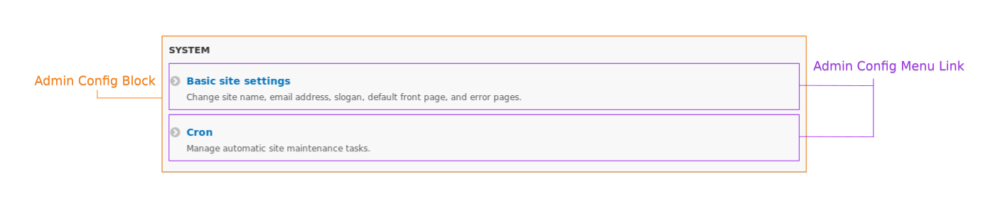
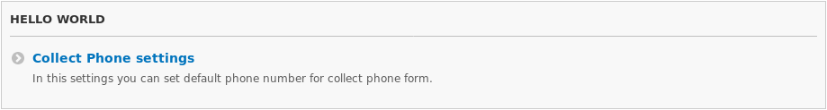
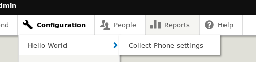
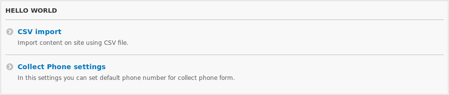

Я уже и не помню когда создавал сайт без кастомного кода, и как правило, всегда
приходится делать какие-то формы и страницы с настройками и прочими настройками.
По первости я их раскидывал по разным категориям на странице конфигурации, а
потом понял, что это путанница, весь кастомный функционал разбросан и сливает с
контрибом, что может вводить в заблуждение. Потом я пришел к тому, что для
кастомных модулей стал делать единый раздел на странице конфигурации, чтобы все
кастомные настройки и функционал с интерфейсом были собраны в единую кучу.

*Если кому интересно аналогичное под **Drupal 7**, можете посмотреть
на [этот код](https://github.com/Niklan/Trash/blob/master/Drupal/7.x/hook_menu.php).
В 7-ке это не так запутанно реализуется и особо объяснять не имеет смысла.*



Все кто работал с Drupal видел данные разделы на странице конфигурации, и часто
к ним приходится обращаться. По этому вполне логично все кастомные настройки
также отделить в отдельный регион. Делается это очень просто, хотя и немного
запутанно на первый взгляд.

Данные "блоки" делятся на два элемента, непосредственном блок конфигурации с
заголовком, он является контейнером для второго элемента — ссылок, которые ведут
уже непосредственно на какие-то страницы и имеют заголовок, а также могут иметь
описание.

## Практика

Для основы я возьму модуль Hello World
из [статьи про Form API][d8-form-api]. Так как там реализована страница с
настройками для модуля и он отлично подходит для примера.

Например, если вы разделяете код на несколько модулей, то "блок" конфигурации
обьявляйте в основном модуле (core), чтобы остальные спокойно могли от него
ссылаться.

Итак приступим. Первым делом нам нужно обьявить путь для контейнера. Да, он
должен быть, это будет страница со ссылками внутри "блока", если к ней
обратиться по прямому пути.

Например на скриншоте выше блок System, он имеет путь /admin/config/system, а
вложенные ссылки /admin/config/system/something (это не обязательно, но
желательно). Таким образом собираются и хлебные крошки, и если пользователь
сотрет часть пути он не попадет на битую страницу.

Для моего Hello World модуля я хочу сделать /admin/config/hello-world страницу.
Для этого необходимо добавить роутинг в helloworld.routing.yml.

```yaml {"header":"helloworld.routing.yml"}
hello_world.admin_config_hello_world:
  path: '/admin/config/hello-world'
  defaults:
    _controller: '\Drupal\system\Controller\SystemController::systemAdminMenuBlockPage'
    _title: 'Hello World'
  requirements:
    _permission: 'access administration pages'
```

Это самый обычный роут, единственное отличие от остальных, это пермишн для
доступа, чтобы не пускало кого попало, и системный контроллер. Это самое важное
во всей статье. Это то, что позволяет добавить свой блок на страницу
конфигурации.

Данная страница станет контейнером/блоком для наших ссылок на настройки.

В модуле Hello World уже есть путь /admin/config/helloworld (без дефиса),
который используется для формы с настройками. Сразу же его перенесем в новый
раздел, изменив путь на новый.

```yaml {"header":"helloworld.routing.yml"}
# Я также заменил название роута чтобы оно было более "правильным" чем было до этого.
hello_world.collect_phone_admin_settings:
  path: '/admin/config/hello-world/phone-settings'
  defaults:
    _form: '\Drupal\helloworld\Form\CollectPhoneSettings'
    _title: 'Settings for CollectPhone form.'
  requirements:
    _permission: 'administer site configuration'
```

Вот и всё, ну почти. Мы сделали путь для "блока" и добавили вложенный роут для
настроек. Если вы сбросите кэш, ничего не появится, но почему жу так? Потому что
это лишь роуты, эти страницы будут открываться по прямому запросу, но на
странице конфигурации не появятся. А чтобы они там появились, нам нужно сделать
ссылки на них. Так как, грубо говоря, страница конфигурации, это такое
своеобразное меню, то там ничего не появится пока не добавишь в это самое меню
ссылки.

Ссылки добавляются в файл `MYMODULE.links.menu.yml`, который должен быть в корне
модуля. Если нету, создайте.

Первым делом добавляем ссылку на "блок".

```yaml {"header":"helloworld.links.menu.yml"}
hello_world.admin_config_hello_world:
  title: 'Hello World'
  parent: system.admin_config
  route_name: hello_world.admin_config_hello_world
  weight: -50
```

В листинге выше:

* **title** — заголовок блока на странице конфигурации. Заголовок страницы
  задается в роутинге.
* **parent** — роут дочерней ссылки. В нашем случае страницы конфигурации.
* **route_name** — название роута которые отвечает за ссылку. Это наш роут для "
  блока".
* **weight** — отвечает где будет выводиться "блок", так как это ссылка для
  него. Сортировка в Drupal 8 на данной странице идет слева-направо сверху-вниз.
  *В Drupal 7 сортировка идет либо в левом, либо в правом столбце сверху-вниз.*

Пока вы не добавите вложенные ссылки в данную ссылку, то данный блок не появится
на странице. Таким образом для его отображение нужна как минимум одна вложенная
ссылка. Ну чтож, нам есть что добавлять, и мы вложем ссылку на форму настроек
модуля Hello World.

```yaml {"header":"helloworld.links.menu.yml "}
hello_world.collect_phone_settings:
  title: 'Collect Phone settings'
  description: 'In this settings you can set default phone number for collect phone form.'
  parent: hello_world.admin_config_hello_world
  route_name: hello_world.collect_phone_admin_settings
  weight: 1
```

Всё аналогично предыдущей ссылке. Только в данном случае родителем стала наша
ранее созданная ссылка для блока, а роут от страницы с настройками. Вес в данном
случае уже влияет на сортировку внутри данного блока.

И вот теперь, если вы сбросите кэш, вы увидите свой раздел и ссылку на странице
конфигурации.



Если у вас установлен Admin Toolbar, то и там это всё появится!



## Дополнительно

Чтобы ещё больше внести ясность и просто показать дополнительный пример. Я
покажу как добавить ссылку в данный блок из другого модуля.

Далеко за заготовкой я ходить не буду, возьму модуль из статьи
про [CSV импорт][d8-custom-csv-import] только из статьи про
[оптимизацию импорта][d8-csv-import-optimization] так как там все изменения
связанные с этим модулем.

Давайте добавим ссылку на страницу CSV импорта в данный блок конфигурации.

К слову, у нас там уже нечто аналогичное реализовано, только добавлен он в
раздел Development, нам лишь необходимо перенести его в наш собственный.

Первым делом мы поправим роут для страницы импорта, чтобы он соответствовал
нашему блоку.

```yaml {"header":"custom_csv_import.routing.yml"}
custom_csv_import.admin_settings:
  path: '/admin/config/hello-world/csv-import' # Заменили на новый путь
  defaults:
    _form: '\Drupal\custom_csv_import\Form\ImportForm'
    _title: 'Import Form'
  requirements:
    _permission: 'access administration pages'
  options:
    _admin_route: TRUE
```

С роутом готово, мы лишь заменяем его путь и всё, и то, лишь для того чтобы он
был с аналогичной иерархией пути.

В данном модуле даже есть links.menu.yml файл, нам опять же, достаточно лишь
слегка поправить, чтобы ссылка появилас в нашем собственном блоке

```yaml {"header":"custom_csv_import.links.menu.yml"}
custom_csv_import.admin_settings:
  title: 'CSV import'
  description: 'Import content on site using CSV file.'
  route_name: custom_csv_import.admin_settings
  parent: hello_world.admin_config_hello_world # Меняем на нового родителя
```

Мы лишь заменяем системное название родительской ссылки.

Сбрасываем кэш, смотрим, BINGO!



Теперь у вас есть собственный раздел на странице конфигурации, куда можно
складывать все кастомные настройки модулей и их ни с чем будет не спутать.

[d8-form-api]: ../../../../2015/10/16/d8-form-api/index.ru.md
[d8-custom-csv-import]: ../../../../2016/09/11/d8-custom-csv-import/index.ru.md
[d8-csv-import-optimization]: ../../../../2017/03/16/d8-csv-import-optimization/index.ru.md
