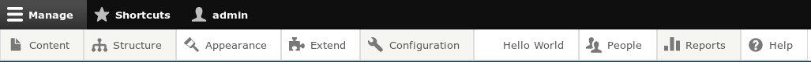
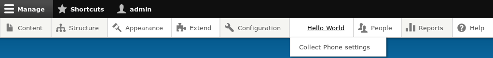
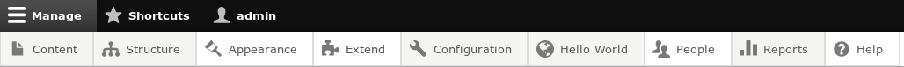

В продолжении темы про 
[создание собственного раздела на странице конфигурации][d8-custom-configure-section]
я решил дополнить её статьей о том, как добавить свой собстенный пункт в 
административный тулбар.

Добавление раздела на страницу конфигурации это хорошо, но что если необходимо
сделать пункт в тулбаре? На самом деле, подход абсолютно идентичен тому как это
делается для страницы конфигурации, с мелкими отличиями из-за особенности
тулбара, но суть и подход в целом тот же самый. При этом они оба отлично
уживаются вместе и можно добавлять как на страницу конфигурации, так и в тулбар
одновременно.

За основу этой статьи я
беру [модуль](/sites/default/files/blog/attachment/2017/3/17/hello%20and%20csv.tar.gz)
из предыдщей статьи.

В данном модуле у нас имеется файл `helloworld.routing.yml` в котором обьявлена
страница ("блок") для пунктов на странице конфигурации, и путь для формы с
настройками модуля. Мы задействуем оба роута. Первый `/admin/config/hello-world`
станет основным пунктом в тулбаре, а
второй `/admin/config/hello-world/phone-settings` будет в виде вкладки.

Если вы читали предыдущую статью и пользуетесь Administrative Toolbar, вы
заметили что наведя на "Конфигурация", там появляся наш пункт Hello World и все
его ссылки были также вложены в данное выпадающее меню. В текущем варианте это
не прокатит, вложенные пункты придется обьявлять нам самостоятельно.

Так как роутинги у нас уже готовы и с ними полный порядок, нам остается сделать
совсем ничего.

## Добавляем основной пункт меню в тулбар

Первым делом мы добавим пункт Hello World в тулбар. Для этого, нам необходимо
в `helloworld.links.menu.yml` добавить ссылку на нашу страницу указав в качестве
родителя роутинг для тулбара.

```yaml {"header":"helloworld.links.menu.yml"}
hello_world.admin_toolbar_hello_world:
  title: 'Hello World'
  parent: system.admin
  route_name: hello_world.admin_config_hello_world
  weight: 0
```

Опять же, если вы читали предыдущую статью, то можете обратить внимание, что
отличие от `hello_world.admin_config_hello_world` — который добавляет раздел на
странице конфигурации лишь в parent. Для страницы кофнигурации
это `system.admin_config`, а для тулбара `system.admin`. Вот и вся разница между
статьями.

Если сбросить кэш, вы увидите пункт в тулбаре.



## Добавляем вложенную ссылку

Вложенные ссылки опять же, делаются абсолютно также. Нам лишь нужно указать в
качестве родителя только что созданную ссылку (выше).

```yaml {"header":"helloworld.links.menu.yml"}
hello_world.admin_toolbar_collect_phone_settings:
  title: 'Collect Phone settings'
  description: 'In this settings you can set default phone number for collect phone form.'
  parent: hello_world.admin_toolbar_hello_world
  route_name: hello_world.collect_phone_admin_settings
  weight: 1
```

Опять же, сбрасываем кэш и смотрим что получилось.



Вы глядит как-то инородно, верно? А всё потому что не хватает иконки!

## Добавление иконки

В идеале, как и другие пункты меню, иконка должна иметь размер 16x16 px, иметь
цвет #787878 и быть в формате svg.

Всё это, конечно, на ваше усмотрение. Я лишь сделал иконку соответствующую
данным параметрам из иконки FontAwesome. Назвал её **globe.svg** и положил в
папку **/img** (которая наоходится в корне модуля).

Иконки подключаются в тулбаре при помощи CSS. У каждого пункта меню, есть
собственный класс, который генерируется автоматически. Если вы копировали код из
статьи, то класс у ссылки Hello World
будет `toolbar-icon-hello-world-admin-toolbar-hello-world`.

Данному классу, на элемент `:before` мы должены добавить данную иконку в
качестве `background-image`.

Для этого, создаем папку **css** в корне модуля, в нём создаем файл *
*helloworld.toolbar.css** и добавляем нашу иконку.

```css {"header":"css/helloworld.toolbar.css"}
.toolbar-icon-hello-world-admin-toolbar-hello-world:before {
  background-image: url('../img/globe.svg');
}
```

Далее нам необходимо обьявить этот файл в виде библиотеки, и подключить данную
библиотеку к тулбару.

Первым делом, вспоминая [Libraries API][d8-libraries-api], нам необходимо 
объявить наш css файл в качестве библиотеки. Для этого создаем файл 
**helloworld.libraries.yml** и добавляем наш файл стилей.

```yml {"header":"helloworld.libraries.yml"}
helloworld.toolbar:
  version: VERSION
  css:
    theme:
      css/helloworld.toolbar.css: { }
```

Библиотеку обьявили, теперь надо её подключить к тулбару. Лучше всего, как по
мне, использовать хук `hook_preprocess_HOOK` и повесить подключение данной
библиотеки (стиля) непосредственно к тулбару. Если модуль тулбар по каким-то
причинам отключат, то и библиотека перестанет подключаться. Соответственно,
гостям эта библиотека также не будет грузится.

```php {"header":"helloworld.module"}
/**
 * Implements hook_preprocess_HOOK().
 */
function helloworld_preprocess_toolbar(&$variables) {
  $variables['#attached']['library'][] = 'helloworld/helloworld.toolbar';
}
```

Сбрасываем кэш, перезагружаем страницу и смотрим на результат.



Готовый модуль, как обычно, во вложениях.

[d8-custom-configure-section]: ../../../../2017/03/17/d8-custom-configure-section/index.ru.md
[d8-libraries-api]: ../../../../2015/10/15/d8-libraries-api/index.ru.md
