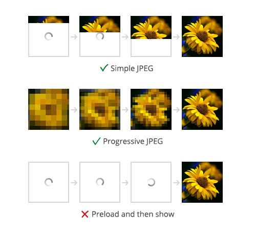

Скорее всего, вы
пользуетесь [Google PageSpeed Tools](https://developers.google.com/speed/pagespeed/)
или [Test My Site](https://testmysite.thinkwithgoogle.com/) и если вы ничего не
тюните, он будет ругаться на размер картинок. Причем порой ругается на картинок
20, и типа, пережми, сохрани 19кб! Полное безумие. Уменьшай, не уменьшай
качество сжатия в Drupal, он будет ругаться и дальше, пока ты не уменьшишь
качество по шкале шакалов до 5+, он всё будет ныть что не так, и то не факт что
спасет. Такие проверки делают, наверное, вообще все тестировщики сайтов и орут
что размер не оптимален. Эта статья, именно о том, как в пару строк, сделать их
оптимальными, при этом, увеличив их качество.

Как [рекомендует Google](https://developers.google.com/speed/docs/insights/OptimizeImages) (
в англоязычной версии статьи, в русской там какой-то бред) — сжимать картинки
лучше всего через ImageMagick. ImageMagick — это такая консольная утилита
которая позволяет пережимать и конвертировать данные. Она идет по дефолту во
всех Linux системах, разве что, в каких-нибудь core и minimal она может
отсутствовать, и то не факт. В Windows, я не знаю, скорее всего, эта штука
ставится отдельно, и тут я вам не советник. Придется вам тут разобраться.

Если вы пользуетесь Linux и ваш сервер на Linux, то можно даже особо не
париться, эта либа поставляется в виде пакета `convert`. Если интересно,
установлено ли, можно проверить командой `convert -version`

```bash
Version: ImageMagick 6.8.9-9 Q16 x86_64 2017-03-14 http://www.imagemagick.org
Copyright: Copyright (C) 1999-2014 ImageMagick Studio LLC
Features: DPC Modules OpenMP
Delegates: bzlib cairo djvu fftw fontconfig freetype jbig jng jpeg lcms lqr ltdl lzma openexr pangocairo png rsvg tiff wmf x xml zlib
```

У меня вывел следующий результат. Это значит что всё стоит и работает. Это можно
сделать и дальше, точнее, это сделает за вас модуль.

Если у вас шаред хостинг, то тут тоже, ничего вам посоветовать не могу. На VPS
вы можете поставить пакет самостоятельно, если отсутствует, что сомнительно. На
хостингах скорее всего тоже стоит, но может быть ограничен к ней доступ. Тут уж
только проверять. Например, на Drupalhosting доступ есть.

Не ждите от этого гайда чуда, он лишь позволит немного сбросить общий весь
картинок, и следовательно вес страницы в целом, примерно на 10-20%, что в свою
очередь, ускорит загрузку и все эти проверки-нытики не будут вас доставать.

Но оптимизацией размера и сжатия мы не ограничимся. Через ImageMagick мы можем
сделать Progressive PNG\JPG. Это когда картинка на медленном соединении грузится
не сверху-внизу, оставляя внизу белый экран, а видна сразу в очень плохом
качестве (пиксилизованная) и постепенно прогружается в качестве.



Так что убьем сразу двух зайцев.

Сообщаю наперед результаты сжатия для общей картины. У каждой картинки и
исходного формата будет разный конечный результат, все сильно зависит от самой
картинки, но примерно уловить можно.

Исходный 6000x4000, размер 3.86МБ, jpg. Он пережимается в ноде до 1000х1000, и
вот [результаты](/sites/default/files/blog/attachment/2017/3/31/comparsion.png):

* Сжатие Drupal из коробки, степень сжатия 75% — 106,3кб
* Сжатие Drupal из коробки, степень сжатия 85% — 144,9кб
* Сжатие ImageMagick из коробки, степень сжатия 75% — 108,1кб
* Сжатие ImageMagick из коробки, степень сжатия 85% — 148,3кб
* Сжатие ImageMagick с оптимизацией, степень сжатия 75% — 103,7кб
* Сжатие ImageMagick с оптимизацией, степень сжатия 85% — 141.2кб

Как вы можете обратить внимание, ImageMagick из коробки сделает только хуже, его
нужно тюнить. Он не может пережать нормально, если ему не обьяснить как. Разница
конечно смешная и файл не очень красочный, но везде по чуть-чуть, в итоге
серьезно экономится в целом по странице + progression загрузка, что тоже круто.

## Установка модуля ImageMagick

Первым делом необходимо установить и включить
модуль [ImageMagick](https://www.drupal.org/project/imagemagick). После
включения перейти на страницу `/admin/config/media/image-toolkit` и вы увидите
что появилось чем пережимать.

Если у вас установлен IM и всё в порядке, раздел Verision Information после
выбора IM будет заполнен тем что выводит `convert -version`. Там же вы можете
подкорректировать откуда вызывать данную команду, например для Windows там можно
указать путь до .exe, для Linux ничего указывать не нужно, всё настроится
самостоятельно. На Drupal 7 будет написано convert, а на Drupal 8 будет пустым.

Обратите внимание что настройки качества хранятся разные, для дефолтного GD2, и
IM.

## Оптимизируем на Drupal 7

Делается это очень просто, как на 7-ке, так и на 8-ке, но немного отличается
код. Модуль ImageMagick предоставляет парочку хуков, которые позволяют нам
внедряться на различных этапах сжатия картинки, и мы этим воспользуемся. Нас
интересует `hook_imagemagick_arguments_alter()`, который позволяет добавлять и
менять аргументы, которые уйдут команде convert. Основываясь на рекомендациях
гугла, нам необходимо использовать `-sampling-factor 4:2:0` для более
качественного сжатия с меньшими потерями. И для progression изображений мы
должны использовать `-interlace Plane`.

```php {"header":"MYMODULE.module"}
/**
 * Implements hook_imagemagick_arguments_alter().
 */
function MYMODULE_imagemagick_arguments_alter(&$args, $context = array()) {
  # https://developers.google.com/speed/docs/insights/OptimizeImages
  $args['google_advice'] = '-sampling-factor 4:2:0';
  # Progression JPEG and interlaced PNG's support.
  $args['progression'] = '-interlace Plane';
  # Clean image for all unused data. EXIF etcetera.
  $args['strip'] = '-strip';
}
```

После этого сбрасываем кэш, чтобы хук подцепился.

Теперь, необходимо сбросить все ранее сгенерированные картинки, и при заходе на
страницу будут генерироваться новые. Для этого
воспользуйтесь `drush image-flush --all` или конкретный стиль
изображения `drush image-flush STYLENAME`, также можно просто ввести команду без
аргумента `drush image-flush` и он предоставит на выбор какие стили почистить.
Это удалит старые изображения и при заходе сгенерирует новые.

Всё!

## Drupal 8

Аналогично как и в Drupal 7, только слегка другой код.

```php {"header":"MYMODULE.module"}
/**
 * Implements hook_imagemagick_arguments_alter().
 */
function MYMODULE_imagemagick_arguments_alter(\Drupal\imagemagick\ImagemagickExecArguments $arguments, $command) {
  // https://developers.google.com/speed/docs/insights/OptimizeImages
  $arguments->add('-sampling-factor 4:2:0');
  // Progression JPEG and interlaced PNG's support.
  $arguments->add('-interlace Plane');
  // Clean image for all unused data. EXIF etcetera.
  $arguments->add('-strip');
}
```

Сброс кэша, `drush image-flush` и вы готовы!

Вот и всё. Чтобы посмотреть на progression в действии, перейдите в Chrome или в
FireFox в режим адаптивного дизайна. У обоих браузеров есть возможность выбор
эмуляции скорости интернета. Выбирайте самый маленький, GPRS 50кб\сек, тогда вы
увидите насколько круто грузятся теперь изображения при медленном интернете.

**UPD** Добавлен третий аргумент `-strip` который срезает приличное кол-во
данных. Он удаляет все метаданные у файла, EXIF и тому подобное. Например, файл
у меня весил 86кб, только срезав метаданные он уменьшился до 22кб! В обрезанных
и оптимизированных изображения эти данные в 99.9% случаях просто не нужны.

**UPD 17.06.2017** ImageMagick для Drupal 8 теперь имеет вторую версию.
Необходимо отключить (удалить из админки) старый модуль, затем поставить новый.
Новый ставится исключительно
композером: `composer require drupal/imagemagick:~2.0`. Если вы не знакомы с
композером у меня [есть статья][drupal-8-composer] про это. Код для 8-ки обновлен в
соответствии с API, старый будет еррорить.

[drupal-8-composer]: ../../../../2016/09/03/drupal-8-composer/index.ru.md
