**Achtung!** Так как я по гайду назвал тип материала advertisement, uBlock, AdBlock и прочие блокировщики рекламы могут срезать картинки со страницы. Если картинки или куски кода пропали — отключите их на данной странице, все равно рекламы на сайте нет.

[Commerce License](https://www.drupal.org/project/commerce_license) — фреймворк для продажи доступа, по сути, к чему угодно, как удаленно, так и локально на сайте, при помощи Drupal Commerce.

Из коробки данный модуль, по сути, вообще ничего не дает. У него есть UI для управления лицензиями, но создавать вы ничего не сможете. Все типы лицензий придется описывать самостоятельно, причем документация немного запутанная и неполная, даже погуглив, нет четкого материала даже на английском языке, как сделать это от и до на конкретном примере. В основном поверхностное описание, либо разбор уже написанных, что ещё больше путает, ибо там сплошные колбеки которые никак не описаны и непонятно что они делают. Я решил написать данную статью, так как считаю, что данный модуль решение множества задач связанных с продажей чего-либо, на что хватит фантазии, и это не обязательно должны быть товары.

## Что такое License на практике

Каждая License — это сущность, она имеет свой ID, владельца (тот, кому принадлежит лицензия), дату создания, и дату деактивации (если нужно, например продажу ролей на время, или публикации временной), статус лицензии и продукт через который получена, и самое важное Access Data. На нем мы остановимся поглубже чуть позже. По сути, это лишь то, что покупает пользователь, а что там будет — это лишь ваша фантазия и задача. 

Так как лицензия сущность, то она поддерживает bundle, каджый бандл и является типом лицензии, которвые вы можете обьявлять сколько хотите, как и сторонние модули. Соответственно, каждый тип лицензии имеет свой функционал, задачу и поведение, а Commerce Lincese лишь всё это унифицирует и дает инструменты.

Самое важное, это уловить то, что тип лицензии, это бандл сущности commerce_license, который объявляется несколько специфически, но базовые вещи там все же следуют стандартной логике.

## Что мы будем делать

Для примера, я решил сделать продажу платных публикаций на сайте, допустим, пусть это будет публикация объявления. Это по сути не важно, но отлично подойдет для демонстрации возможностей.

Далее, допустим, мы хотим чобы люди могли купить N-ое кол-во публикацией и тратить когда хотят. Допустим, мы будем продавать следующие товары:

* Стандартная публикация — 1 объявление;
* Расширенная публикация — 1 объявление и возможность закрепить 1 своё объявление вверху списка на 1 час.
* VIP-публикация — неограниченное кол-во публикаций в течении 1 недели, и 5 закреплений вверху списка на 1 час. Но с ограниченным временем действия, данная "лицензия" будет сгорать через 1 неделю с момента покупки.

Этим мы и займемся.

## Создаем тип материала "Объявление"

Особо заморачиваться на создание типа материала обьявления я не стал, и сделал так:

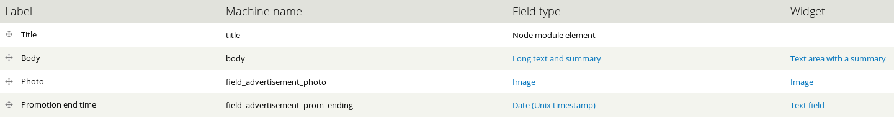

Сразу же, перейдем в управление доступом и дадим возможность авторизованым пользователям создавать данный тим материала и редактировать свои собственные. Ограничивать будем программно.

Тут никаких трудностей возникнуть не должно. Всё достаточно просто.

## Создаем тип товара и сами товары для commerce

Сразу же, сделаем всё самое простое и уйдем в код. Лицензии цепляются к товарам, соответственно, нам необходимо создать отдельный тип товара, который будет связан с нашим типом лицензии, чтобы небыло в дальнейшем никакой путанницы.

Я решил что назову тип товара "Платная публикация объявления" (paid_ad_publishing) и добавлю поля для хранения, сколько публикаций каких публикаций он добавляет. Для этого я добавил два поля: "Количество публикаций" и "Количество закреплений". Оба поля обязательных типа Integer (целое число). Единственный момент на который хочу обратить внимание, это то, что для "Количество публикаций" минимальное значение я указал -1 (минус один), так будет указываться неограниченное число публикаций (потому что я решил что так проще определять, у вас это число может быть просто огромным тип 10000). Для "Количество закреплений" минимальное значение 0.

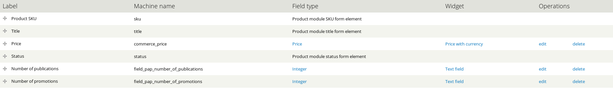

Сразу же добавлю все вышеперечисленные товары используя наш новый тип товара.

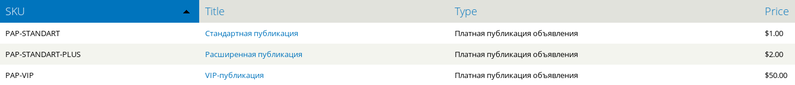

## Создаем представление для товаров

Как и у любого товара в Commerce, чтобы люди могли добавлять его в корзину, нам необходимо сделать дисплейт для товаров. А это значит, нужно создать свой тип материала для этой штуки. Я назвал pap_display (pap - сокр. paid advertisement product) и сделал набор минимум.

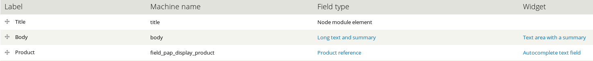

Далее, я делаю три отображения наших товаров, соответственно.

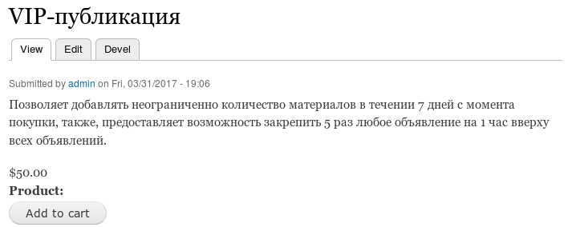

Пока что на админке остановимся, почти всё тут готово, вернемся несколько позже, время писать код!

## Создание Commerce License Plugin

Commerce License использует систему плагинов Ctools, при помощи которой мы и должны добавлять наши "плагины", которые, в свою очередь, являются бандлами для сущности commerce_license.

Первым делом, нам нужен модуль куда будем писать весь код. Я назвал свой, как ни странно, paid_advertisement_license.

Первым делом, объявляем `hook_ctools_plugin_directory()` и указываем где лежат плагина для commerce_license.

~~~php {"header":"paid_advertisement_license.module"}
/**
 * Implements hook_ctools_plugin_directory().
 */
function paid_advertisement_license_ctools_plugin_directory($owner, $plugin_type) {
  if ($owner == 'commerce_license') {
    return "plugins/$plugin_type";
  }
}
~~~

Теперь в корне модуля создаем папку `plugins`, а в ней ещё одну папку `license_type`. В данной папке мы должны добавить файл плагина. Называться он может как угодно и иметь расширение **.inc**. Я назвал, опять же, очевидно **paid_advertisement_license.inc**. 

В данном файле, мы описываем плагин. Описание это переменная `$plugin` — массив содержащий немного информации:

* title — название плагина;
* class — название класса, который будет подгружен и использоваться для типа лицензии (самое важное). Должно содержать лишь название самого класса. Если хотите отделить класс от данного файла (что лучше сделать), то он должнн называться также, плюс приставка `[ClassName].class.php`.
* weight — вес плагина, по всей видимости влияет лишь на то, какой по счету в списке в админке данный плагин будет выводиться. Вообще не важная штука, я ставлю 1.

~~~php {"header":"plugins/license_type/paid_advertisement_license.inc"}
<?php

/**
 * @file
 * Provides a license type plugin.
 */

$plugin = array(
  'title' => t('Paid advertisement license'),
  'class' => 'PaidAdvertisementLicense',
  'weight' => 1,
);
~~~

Теперь нам необходимо создать соответствующий класс. Данный класс должен наследоваться от `CommerceLicenseBase` или `CommerceLicenseRemoteBase` в зависимости от того, какого типа лицензия. В нашем случае, выходить за пределы сайта не нужно, поэтому нам нужен первый.

Для начала я сделаю просто каркас и файл, а наполнять будем по ходу.

~~~php {"header":"plugins/license_type/PaidAdvertisementLicense.class.php"}
<?php

/**
 * @class PaidAdvertisementLicense
 */
class PaidAdvertisementLicense extends CommerceLicenseBase  {
    
}
~~~

Настало время описать методы, которые мы можем здесь объявить. Их не так много, а важных и вовсе парочка.

* `accessDetails()` — возвращает строку с информацией о лицензии. Должно быть четко и по делу, это просто текстовая строка. Например, если пользователь купил файл, то она должна возвращять ссылку на данный файл. Или если он купил компьютерную игру, то там должен содержаться лицензионный ключ. В целом, вы можете и написать произвольные данные. Мы, например, будем писать количество оставшихся публикаций и закреплений у конкретной лицензии. Т.е. это не строго что если покупаете файл, то возвращать должно ссылку и больше ничего, просто тут надо разумно ограничиться и не пихать туда стену текста.
* `fields()` — в данном методе можно объявлять поля. Так как плагин превратится в bundle для сущности, учитывайте что там не Form API. Логика там такаяже как у [field_create_field()](https://api.drupal.org/api/drupal/modules!field!field.crud.inc/function/field_create_field/7.x) и [field_create_instalce()](https://api.drupal.org/api/drupal/modules%21field%21field.crud.inc/function/field_create_instance/7.x). Я на этом ещё остановлюсь поподробнее позже.
* `isConfigurable()` — определяет, является ли данная лицензия настраиваемой. Если TRUE, то данная лицензия будемт иметь свою форму, которую пользователь сможет вызвать на любом этапе оформления покупки, но не после завершения заказа. Это позволяет добавлять произвольные данные пользователем, ну мало ли. По умолчанию TRUE, если не нужно — отключайте, это вызывает дополнительные методы, о которых ниже. Вместо обращения напряму к `$form_state['values']` всегда используйте `$form_values = drupal_array_get_nested_value($form_state['values'], $form['#parents'])` — это касается всех методов работы с формой в данном плагине.
* `form(&$form, &$form_state)` — всё по аналогии с обычными формами, здесь вы можете обьявить форму которая будет показываться юзеру при помощи Form API. Но не забывайте что там форма сущности, и цеплять поля необходимо через field_attach_form(). *Вызывается только при isConfigurable TRUE.* 
* `formValidate($form, &$form_state)` — валидация данных формы объявленной в методе `form()`. *Вызывается только при isConfigurable TRUE.* 
* `formSubmit(&$form, $form_state)` — логика после успешного субмита формы. *Вызывается только при isConfigurable TRUE.* 
* `checkoutCompletionMessage()` — может возвращать html строку. Выводится после успешного завершения заказа с данной лицензией.
* `activate()` — логика при вызове активации лицензии.
* `expire()` — логика при истечении действия лицензии. Например, наша лицензия, когда количество доступных публикаций достигнет 0, она станет недействительной, т.е. истечет, и если тут что-то написать, оно вызовится. Т.е. это не касается только лицензий с конечной датой, это касается вообще всех.
* `suspend()` — логика при приостановке лицензии.
* `revoke()` — логика отмены лицензии.
* `renew($expires)` — логика продления лицензии. В параметре `$expires` будет находиться unix timestamp с новой датой окончания.
* `synchronize()` — только для `CommerceLicenseRemoteBase`. Описывает логику синхронизации лицензии с удаленным сервером. Например, если какие-то данные лицензии обновляются со стороннего сервера, тут должно быть вся логика получения и записи этих данных.

Это все доступные методы для обоих базовых классов. Отличаются они лишь последним методом, у удаленной есть synchronize, у обычной нет. Все эти методы не обязательны, заполняются и добавляются исключительно при необходимости.

Давайте пройдем по порядку по всем что нам нужны.

### fields()

Данный метод самый важный для понимания, все остальные очень простые, но этот надо понять, особенно если вы не создавали поля программно при помощи [field_create_field()](https://api.drupal.org/api/drupal/modules!field!field.crud.inc/function/field_create_field/7.x) и [field_create_instalce()](https://api.drupal.org/api/drupal/modules%21field%21field.crud.inc/function/field_create_instance/7.x). В данном методе объявляются поля для нашего бандла (типа лицензии). Это полноценные поля из Field API, а не те что в Form API и это надо четко уловить, иначе всё развалится.

Данный метод должен возвращать массив следующего вида:

~~~php
$fields['FIELD_NAME'] = array(
  'field' => array(
    // Объявление поля
  ),
  'instance' => array(
    // Объявление инстанца поля.
  ),
);
~~~

Если проводить аналогию с интерфейсом и функцями то данный массив можно объяснить так:

* FIELD_NAME — машинное название поля. Как в интерфейсах field_name, только тут нет приставки field, если вы не напишите её сами. Здесь максимальная длина строки может быть 32, не забывайте об этом! С приставкой field_, как и в интерфейсе, 17. Но так как тут её можно опустить, можно задействовать все 32. Допускаются только латинские буквы, цифры и знак подчеркивания.
* field — это массив который будет скормлен функции field_create_field() и соответственно, должен соответствовать данной функции. Тут объявляется поле очень базово, если проводить аналогию с UI то это выбор типа поля, максимальное количество значений для всех инастанцов данного поля.
* instance — это непосердственно конкретный экземпляр поля. Допустим, вы создали поле в админке или кодом field_name, вы по дефолту, в UI привязаываете  экземлпяр данного поля к материалу где создали поле, но в дальнейшем, вы можете использовать данное поле и в других типах материала создавая новый экземпляр. Это аналог функции field_create_instance(), где вы можете уже указать лейбл поля, описание, сделать его обязательным, указать значение по умолчанию, выбрать виджет используемый в админке для работы с полем и т.д. В UI это шаг после сразу после создания поля на странице полей, страница с кучей галочек.

Работает это как и те две функции, просто все их значения объявляются в массиве. Так как у Commerce License бандлов нету никаого UI, то всякие мелочи типа описания поля и виджета можно смело опускать, пусть используются по умолчанию.

Если вы не знаете как объявить поле, и никогда это не делали, хотите определенный тип поля, но не знаете, что же делать? Как же эти массивы заполнять? Здесь можно воспользоваться очень простым способом. В любом типе материала создаете нужное вам поле со всеми значениями, и затем, например на странице `/devel/php` (должен быть включен модуль Devel) выводите инфу о данном поле и он вам вернет все эти массивы. Например, я по материалу создал поле "Количество публикаций" (field_pap_number_of_publications), оно типа Integer, обязательное, имеет минимальное значение -1 и создано у товара commerce типа paid_ad_publishing. Чтобы получить информацию о том как объявлено это поле, я перехожу на страницу девела и ввожу:

~~~php {"header":"url: /devel/php"}
$field = field_info_field('field_pap_number_of_publications');
// Entity Type, Field Name, Entity Bundle - бандл где используется интересующие конфиги поля.
$instance = field_info_instance('commerce_product', 'field_pap_number_of_publications', 'paid_ad_publishing');
dpm($field, 'field');
dpm($instance, 'instance');
~~~

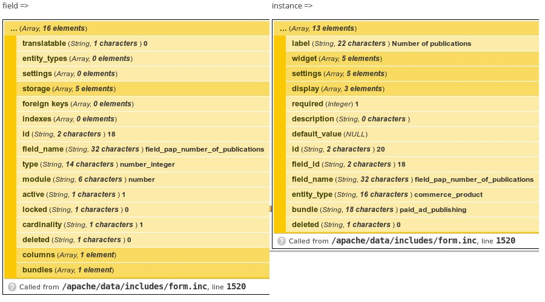

Вот мы и получили необходимые массивы с данными. Они большие, там намного больше информации, нам же достаточно указать только то что нам необходимо поменять, всё остальное заполнится значениями по умолчанию.

Теперь, разобравшись что это за метод и что ему нужно скармливать, вернемся к нему и добавим интересующие нас поля. Нам потребуется 2 поля. Первое будет хранить количество оставшихся публикаций, но также может иметь минимальное значение -1 для бесконечных публикаций, типа integer. Второе будет хранить количество возможных прикреплений материала на 1 час. В общем аналогичные поля из товара, только они будут храниться в лицензии и мы будем с ними взаимодействовать. При публикации будем вычитать из первого, а при закреплении из второго.

Создаем два поля для нашей лицензии.

~~~php {"header":"Метод fields() в классе PaidAdvertisementLicense"}
/**
 * Implements EntityBundlePluginProvideFieldsInterface::fields().
 */
static function fields() {
   // Базовый класс добавляет поле типа Integer, в котором хранит
   // количество renewal — т.е. сколько раз лицензия была продлена.
  $fields = parent::fields();

  $fields['pap_publications_left'] = array(
    'field' => array(
      // Такой тип у Integer поля.
      'type' => 'number_integer',
    ),
    'instance' => array(
      'label' => 'Publications left',
      'settings' => array(
        'min' => -1,
      )
    ),
  );

  $fields['pap_promotions_left'] = array(
    'field' => array(
      'type' => 'number_integer',
    ),
    'instance' => array(
      'label' => 'Publications left',
    ),
  );

  return $fields;
}
~~~

Минимальное значение для оставшихся публикаций я лишь добавил как пример, по факту, и его не нужно заполнять. Так как вся работа с полем будет исключительно программно, и у нас будет железная логика для работы с полями, то там ничего иного и не появится.

### isConfigurable()

Данный метод отвечает за то, будет ли у лицензии собственная форма во время покупки. У нас не будет, по умолчанию она включена, нам необходимо её отключить.

~~~php
/**
 * Implements CommerceLicenseInterface::isConfigurable().
 */
public function isConfigurable() {
  return FALSE;
}
~~~

### accessDetails()

Данный метод должен возвращать строку с информацией о лицензии. Мы будем возвращать оставшееся количество публикаций и закреплений.

Немного отойдя в сторону,  отмечу, что базовые классы предоставляют обертку в виде [Entity Metadata Wrapper](http://xandeadx.ru/blog/drupal/549) и готовый wrapper находитя в классе и вызывается следующим образом `$this->wrapper`. Лучше используйте его для работы с полями, так как он круче, проще и понятнее. И вообще EMW крутая штука, если ещё не используете, переходите везде где только работаете с сущностями и полями.

Возвращаясь к нашему методу, давайте отдадим текст с информацией об остатках на лицензии:

~~~php
/**
 * Implements CommerceLicenseInterface::accessDetails().
 */
public function accessDetails() {
  $publications_left = $this->wrapper->pap_publications_left->value();
  $promotions_left = $this->wrapper->pap_promotions_left->value();
  return format_string('Доступных публикаций: @publications Доступных закреплений: @promotions', array(
    '@publications' => ($publications_left == -1) ? 'Неограниченно' : $publications_left,
    '@promotions' => $promotions_left,
  ));
}
~~~

### save()

Данный метод вызывается при сохранении сущности лицензии вашего типа. При создании и обновлении. Тут, крайне рекомендую вызывать `parent::save()` так как он меняет статусы для лицензии, контролирует лицензии с ограниченным временем и много чего по мелочи, и непосредственно вызов сохранение сущности вообще, в противном случае придется всё это описывать и контролировать руками.

Здесь у нас будет логика деактивации лицензии по истечению лимитов. Если количество доступных пубилкаций и закреплений опустилось до 0, в момент сохранения, мы деактивируем лицензию. В случае с бесконечными лицензиями, у нас будет ограничение в 7 дней и лицензия будет деактивироваться автоматически через данный срок, следовательно, все непотраченные закрепления сгорят, даже если будет больше 0. Следовательно, данный код будет игнорироваться так как не пройдет условия.

~~~php
/**
 * Overrides Entity::save().
 */
public function save() {
  // Получаем значения оставшихся публикаций и закреплений.
  $publications_left = $this->wrapper->pap_publications_left->value();
  $promotions_left = $this->wrapper->pap_promotions_left->value();
  if ($publications_left == 0 && $promotions_left == 0) {
    // Если оба значения упали до 0, значит лицензию нужно деактивировать.
    $this->status = COMMERCE_LICENSE_EXPIRED;
  }

  parent::save();
}
~~~

### activate()

Данный метод вызывается при активации лицензии. В момент активации мы будем получать из товара количество предоставляемых им пубилкаций и закреплений и записывать в лицензию, чтобы в дальнейшем, при измении товара это никак не повлияло на уже активированные лицензии.

Обратите внимание что я проверяю на статус "создан". Данный статус присваивается лицензии когда в корзину добавлен товар, который связан с текущим типом лицензии. Т.е. это указывает на факт что лицензия создана и находится где-то на этапах покупки, т.е. заказ ещё не оплачен. Почему я делаю данную проверку? Так как лицензия имеет и другие статусы, которые не дактивируют её по факту, но позволяют её в дальнейшем сделать активной. Например `suspend()` позволяет временно "заморозить" лицензию, чтобы разморозить её придется активировать, но если мы не сделаем эту проверку, то после `suspend()` лицензия уйдет на активацию и опять получит обновленные лимиты на публикации, т.е. сделает всё тоже что и делает `renew()`. А это косяк, поэтому и проверяем, что лимиты записываются только когда лицензия активируется из статуса `CREATED`. У удаленных лицензий есть ещё статус `COMMERCE_LICENSE_PENDING`, и если вы решите делать удаленную лицензию, то не забывайте проверять и на него, так как он означет что лицензия нуждается в синхронизации но ещё не активна.

~~~php
/**
 * Implements CommerceLicenseInterface::activate().
 */
public function activate() {
  if ($this->status == COMMERCE_LICENSE_CREATED) {
    // Записываем в поля нашей лицензии, значения из соответствующих полей
    // товара комерца. Доступ к которому можно получить через
    // $this->wrapper->product.
    $this->wrapper->pap_publications_left = $this->wrapper->product->field_pap_number_of_publications->value();
    $this->wrapper->pap_promotions_left = $this->wrapper->product->field_pap_number_of_promotions->value();
  }

  parent::activate();
}
~~~

### renew()

Данный метод нам тоже пригодится для примера. Мы добавим сюда логику обновления лицензии. Так как данный метод можно вызывать из администритивного интерфейса, это очень полезно, чтобы администратор мог в любой момент обновить лицензию и начислить все лимиты заного в соответствии с товаром.

~~~php
/**
 * Implements CommerceLicenseInterface::renew().
 */
public function renew($expires) {
  $this->wrapper->pap_publications_left = $this->wrapper->product->field_pap_number_of_publications->value();
  $this->wrapper->pap_promotions_left = $this->wrapper->product->field_pap_number_of_promotions->value();
  parent::renew($expires);
}
~~~

## Подключаем нашу лицензию к товарам

Всё что нужно для объявления своего типа лицензии мы сделали, теперь самое время включать свой модуль, если вы этого ещё не сделали.

Далее нам необходимо указать что наш типа товара "Платная публикация объявления" имеет лицензии, после этого у товара появтся спец. поля от лицензий и мы сможем подкорректировать наши товары. Для этого заходим в License Settings `/admin/commerce/config/license` и ставим галочку на против нашего типа товара и сохраняем.

Так как тип лицензии у нас один (если вы не включали других) то в форму редактирования товара добавиться лишь одно поле "License Duration" где выбирается длительность лицензии, неограниченно или определенное время. По дефолту всем товарам проставилось Unlimited, но нашему VIP товару нужно сделать ограничение в 7 дней, для этого зайдите в редактирование данного товара и установите соответствующее ограничение.

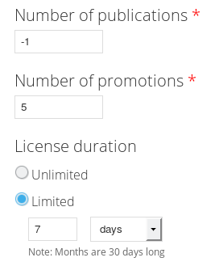

Также надо пробежать по всем товарам с лицензиями и просто сохранить их, чтобы у них установилась связь с нашим типом лицензии. Его не видно так как оно доступно одно на сайте, но по факту там скрытый селект.

## Проверка №1

Пока не ушли ещё дальше и глубже, стоит проверить работу лицензии. Для этого, например, можете покупать товары с лицензиями и смотреть что будет появляться на странице лицензий: `/admin/commerce/licenses`.

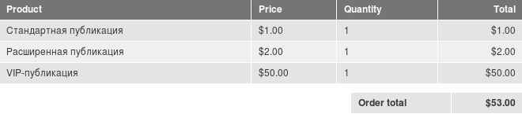

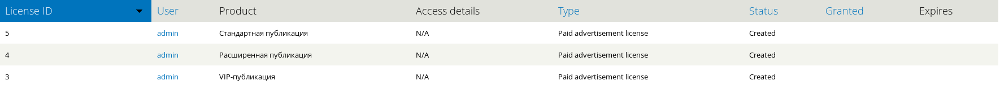

Всё работает, лицензии появились. Вы наверное задаетесь вопросом, а почему у VIP-пупбликации нет время окончания, у всех статус "Создано" и нету Access Details которые мы заполняли?

Это правильное поведение в моём случае. Лицензии активируются при помощи Rules. Commerce License поставляет всего 2 рулса для активации лицензии и у меня не сработал ни один, и это верно. А поставляет он следующие рулсы:

* Activates licenses of a free order — активирует лицензии по окончанию заказа, если сумма товаров (!) была равна 0. В моем случае сумма товаров $53 и разумеется, рулс не прошел.
* Activates licenses of an order — активирует лицензии после успешной оплаты заказа. У меня нет платежных системы и вообще модуль оплаты отключен, опять же, он никак не мог пройти условия.

Вы можете создавать свои, на подобии этих, или править их же под свои задачи. Я не буду, а активирую все лицензии через админку на странице лицензий, заодно и проверю, как сработает `activate()` метод.

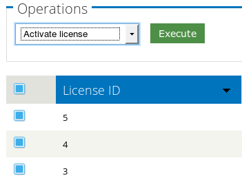

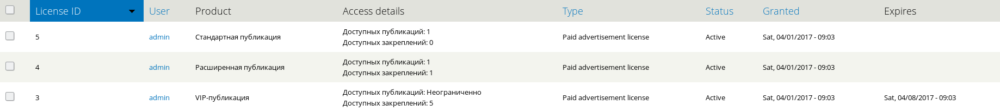

Вот так выглядят лицензии после активации. Там есть и наша информация из `accessDetails()` которая показывает сколько публикаций осталось у каждой лицензии.

## Пишем функции-хелперы

Теперь нам надо написать парочку функций, которые помогут нам в дальнейшем проще интегрировать лицензии в нашу логику.

### Получение активных лицензий для пользователя

Данная функция будет возвращать список активных лицензий для указанного пользователя.

~~~php
/**
 * Returns array of objects with active Paid Advertisements Licenses for user.
 */
function paid_advertisement_license_get_user_active_licenses($uid = NULL) {
  if (!$uid) {
    global $user;
    $uid = $user->uid;
  }

  $result = &drupal_static(__FUNCTION__ . $uid);
  if (!isset($result)) {
    $query = new EntityFieldQuery;
    $query->entityCondition('entity_type', 'commerce_license')
      ->entityCondition('bundle', 'paid_advertisement_license')// как название файла плагина
      ->propertyCondition('status', COMMERCE_LICENSE_ACTIVE)
      ->propertyCondition('uid', $uid);

    $query_result = $query->execute();
    if (isset($query_result['commerce_license'])) {
      $result = array_keys($query_result['commerce_license']);
    }
    else {
      $result = array();
    }
  }

  return $result;
}
~~~

### Получение остатка по лицензиям

В данной функции мы получаем массив с остатком возможных публикаций и закреплений материала.

~~~php
/**
 * Returns how much publication and promotions left in total.
 */
function paid_advertisement_license_get_user_balance($uid = NULL) {
  $licenses = paid_advertisement_license_get_user_active_licenses($uid);
  $result = array(
    'publications' => 0,
    'promotions' => 0,
  );
  foreach ($licenses as $license_id) {
    $wrapper = entity_metadata_wrapper('commerce_license', $license_id);
    $result['promotions'] += $wrapper->pap_promotions_left->value();
    $publications_left = $wrapper->pap_publications_left->value();
    if ($publications_left == -1) {
      $result['publications'] = $publications_left;
    }
    elseif ($result['publications'] != -1) {
      $result['publications'] += $publications_left;
    }
  }
  return $result;
}
~~~

### Списание с баланса

При помощи данной функции мы сможем списывать с баланса лицензии(ий) определенные остатки. Например списывать пубилкаци или закрепления по отдельности, или оба вместе. Приоритет отдается самой старой лицензии, когда лимит списываемого баланса достигает 0, мы переходим к следующей лицензии и списываем у неё. Мы можем либо списать 1 остаток, либо не списать ничего. Вызов данной функции подразумевает что списывается там где есть баланс, т.е. мы не будем вызывать эту функцию там где баланса будет не достаточно. Также мы игнорируем списание публикаций если хотябы одна из лицензий активна и имеет неограниченное кол-во публикаций. Допустим, юзер имеет 2 лицензии, первая имеет 5 публикаций, а вторая неограниченная но действует 7 дней. Первая была куплена раньше чем вторая, но при списании баланса мы будем игнорировать это, так как имеется активная лицензия с неограниченным количеством, и списываться начнет только после её окончания.

~~~php
/**
 * Subtracts from balance publication and promotions. Priority is given to
 * oldest licenses.
 *
 * @param $publications
 *   0 or 1, any number greater than one will be equated to one.
 * @param $promotions
 *   0 or 1, any number greater than one will be equated to one.
 */
function paid_advertisement_license_subtract_from_balance($publications = 0, $promotions = 0, $uid = NULL) {
  $publications = ($publications > 1) ? 1 : $publications;
  $promotions = ($promotions > 1) ? 1 : $promotions;
  $licenses = paid_advertisement_license_get_user_active_licenses($uid);
  $balance = paid_advertisement_license_get_user_balance($uid);
  foreach ($licenses as $license_id) {
    $wrapper = entity_metadata_wrapper('commerce_license', $license_id);
    $license_publications_left = $wrapper->pap_publications_left->value();
    $license_promotions_left = $wrapper->pap_promotions_left->value();

    // Subtract publications at first. We don't subtract if publications is
    // unlimited.
    if ($balance['publications'] > 0 && $publications > 0 && $license_publications_left > 0) {
      $wrapper->pap_publications_left = $license_publications_left - 1;
      $publications--;
    }

    // Subtract promotions.
    if ($balance['promotions'] > 0 && $promotions > 0 && $license_promotions_left > 0) {
      $wrapper->pap_promotions_left = $license_promotions_left - 1;
      $promotions--;
    }

    $wrapper->save();
  }
}
~~~

### Отключение закрепления у материалов спустя час

Данная функция будет находить все материалы типа объявления у которых истекло время заркепления и снимать его с него.

~~~php
/**
 * Find all advertisement
 */
function paid_advertisement_license_disable_expired_promotions() {
  $query = new EntityFieldQuery;
  $query->entityCondition('entity_type', 'node')
    ->entityCondition('bundle', 'advertisement')
    ->propertyCondition('sticky', NODE_STICKY)
    ->fieldCondition('field_advertisement_prom_ending', 'value', REQUEST_TIME, '<');

  $result = $query->execute();
  if (isset($result['node'])) {
    $nids = array_keys($result['node']);
    foreach ($nids as $nid) {
      $wrapper = entity_metadata_wrapper('node', $nid);
      $wrapper->sticky = FALSE;
      $wrapper->field_advertisement_prom_ending = NULL;
      $wrapper->save();
    }
  }
}
~~~

## Пишем остальные хуки и логику

Осталось нам всё что мы сделали собрать в единое целое и соединить.

### hook_permission()

Первым делом напишем hook_permission. В нем мы объявим два пермишена:

1. Пропуск проверки остатка лицензий и публикацию без списания с лицензий. Это будет полезно для админов и прочих ролей которые должны обходить все проверки.
2. Право редактировать дату окончания закрепления. По-умолчанию это поле будет скрыто от всех, а время высчитываться и выстанавливаться автоматически, но мы оставим возможность ролям, у которых будет данное разрешение, самостоятельно устанавливать время окончания закрепления.

~~~php
/**
 * Implements hook_permission().
 */
function paid_advertisement_license_permission() {
  return array(
    'bypass balance check paid advertisement license' => array(
      'title' => t('Bypass balance check'),
    ),
    'edit promotion ending time paid advertisement license' => array(
      'title' => t('Edit promotion ending time'),
    ),
  );
}
~~~

### Крон на снятие закрепленных материалов

Тут два пути, всё зависит от того как вам потребуется это использовать и какие лимиты будут у вас. Первый — вы можете использовать дефолтный hook_cron(), второй — сторонний модуль для контроля крона, например [Elysia Cron](https://www.drupal.org/project/elysia_cron).

Первый, конкретно для случая из статьи не подходит. Минимальное время для крона которое можно устновить в ядре — 1 час. У нас, по дефолту, 1 закрепление делается на 1 час, и получается что если закрепить материал через секунду после крона, то материал провесит закрепленным не час, а 1 час 59 минут и 59 секунд. Т.е. большинство материалов будет весить строго больше 1 часа, вплодь до почти двух часов. Я, например, хочу чтобы данная операция производилась каждые 5 минут, поэтому тут очень поможет Elysia Cron, поэтому код будет для него.

~~~php
/**
 * Implements hook_cronapi().
 */
function paid_advertisement_license_cronapi($op, $job = NULL) {
  $items['disable_expired_promotions'] = array(
    'description' => 'Disable expired promotions for paid advertisements',
    'rule' => '*/5 * * * *', // every 5 minutes
    'callback' => 'paid_advertisement_license_disable_expired_promotions',
  );

  return $items;
}
~~~

### Модифицируем форму добавления и редактирования объявления

Нам необходимо внести правки в форму редактирования и добавления объявлений. Так как они открыты всем, нам нужно ограничивать доступ если отсутствуют доступные публикации на балансе при редактировании, контролировать закрепления и наши пермишены.

Первым делом мы определяем, это форма создания или редактирования, если создания, то проверяем остаток на балансе для публикаций. Если остаток равен 0, мы пишем сообщение что для публикацией недостаточно остатка и редиректим на страницу /store, где находятся товары с пубилкациями.

Также мы добавляем кастомный чекбокс для закрепления материала вверху списка. Он активен если количество закреплений на балансе больше 0. Он отображается как на форме редактирования, так и на форме создания материала.

В конце мы добавляем свой собственный callback для субмита формы в самое начало.

~~~php
/**
 * Implements hook_form_FORM_ID_alter().
 */
function paid_advertisement_license_form_advertisement_node_form_alter(&$form, &$form_state, $form_id) {
  $nid = $form['nid']['#value'];
  $balance = paid_advertisement_license_get_user_balance();

  // Node creation form.
  if ($nid == NULL) {
    if ($balance['publications'] == 0 && !user_access('bypass balance check paid advertisement license')) {
      drupal_set_message(t('You don\'t have enough publications available.'), 'warning');
      drupal_goto('store');
    }
  }

  // Hide promotion ending time field.
  if (!user_access('edit promotion ending time paid advertisement license')) {
    $form['field_advertisement_prom_ending']['#access'] = FALSE;
  }

  // Adding promotion checkbox.
  $form['promote_advertisement'] = array(
    '#type' => 'checkbox',
    '#title' => t('Promotes this advertise on one hour'),
  );

  if ($balance['promotions'] == 0) {
    $form['promote_advertisement']['#attributes']['disabled'] = 'disabled';
    $form['promote_advertisement']['#description'] = t('You don\'t have enough promotions available.');
  }

  // Add custom submit callback.
  array_unshift($form['actions']['submit']['#submit'], 'paid_advertisement_license_form_advertisement_node_form_submit');
}
~~~

Далее описываем свой собственный submit callback, в котором мы, определяем новая ли нода. Если новая, мы проверяем баланс и права, если у юзера нет прав на пропуск проверки баланса, и баланс на публикации не бескоенчный, мы вычитаем с баланса 1 публикацию.

В случае ещё юзера поставил галочку для закрепления материала, мы также, вычитаем с баланса одно закрепление. Если это было редактировании, и материал уже закреплен, а пользователь снова нажал на галочку и сохранил, ещё 1 час закрепления добавится к текущему остатку.

~~~php
/**
 * Custom submit handler for Advertisement node.
 */
function paid_advertisement_license_form_advertisement_node_form_submit($form, &$form_state) {
  $values = &$form_state['values'];
  $promote = $values['promote_advertisement'];
  $wrapper = entity_metadata_wrapper('node', $form_state['node']);
  $is_new = $wrapper->is_new->value();
  $balance = paid_advertisement_license_get_user_balance();

  if ($is_new && !user_access('bypass balance check paid advertisement license') && $balance['publications'] != -1) {
    paid_advertisement_license_subtract_from_balance(1);
  }

  if ($promote) {
    $values['sticky'] = TRUE;
    if ($current_ending = $wrapper->field_advertisement_prom_ending->value()) {
      // Adds additional hour to exists time.
      $wrapper->field_advertisement_prom_ending = $current_ending + 60 * 60;
    }
    else {
      $wrapper->field_advertisement_prom_ending = REQUEST_TIME + 60 * 60;
    }

    if (!user_access('bypass balance check paid advertisement license')) {
      paid_advertisement_license_subtract_from_balance(0, 1);
    }
  }
}
~~~

## Проверка №2

Тут всё просто, покупаем лицензии и проверяем. Если все сделали верно, за публикацию будет вычитаться с баланса 1 публикация, и аналогично с закреплением. По крону каждые 5 минут будет производиться поиск материалов на сайте, которые закреплены, но время закрепления истекло, мы снимаем с них закрепление и они уходят в общий список.

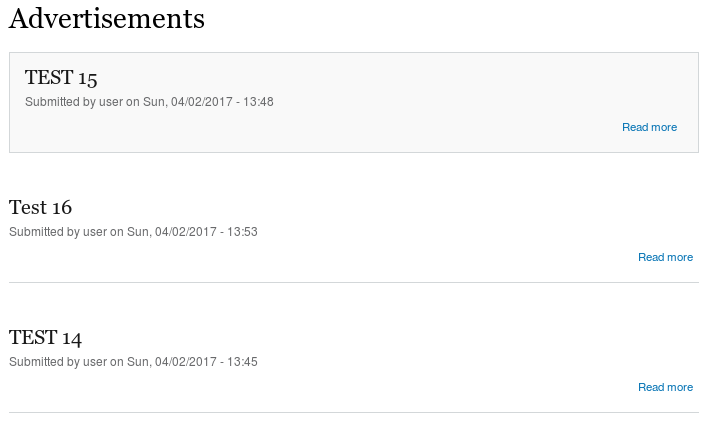

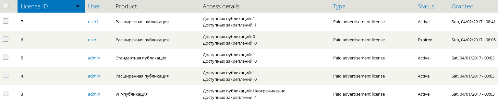

Готовый модуль вы можете скачать ниже в аттачментах.
