Надо заметить, я даже удивлен что нашлось под 10 человек в [чатике](https://t.me/niklannet/136) кому интересна тема c Kodi.

В общем, если кто не в курсе, я писал [как я собирал себе медиацентр](/blog/135) на Raspberry и Kodi, и в конце я рассказал про плагин Torrenter который умеет воспроизводить торрент файлы. У него достаточно проблемы как было так и осталось, последние пару месяцев он вообще перестал работать, например у моей мамы, я особо не пользовался и проверять не стал.

Так вот, есть очень мощная альтернатива и она в активной разработке. Ещё в январе оно работало так, что хотелось застрелиться, так ещё и русские торренты совершенно не поддерживались, он предлагали писать свои плагины под это дело, идея походу затухла так как выбор был вообще никакой. Но по каким-то причинам они передумали и сделали 1 плагин, который умеет интегрироваться с огромным количеством торрентов, в том числе и русскоязычных.

Несомненно плюсом я считаю то, что он позволяет добавлять фильмы и сериалы в медиатеку Kodi, где они будут как обычные фильмы и множество других фишек. Например, в каком качестве выдавать результаты, ограничения по скоростям и возможность загружать фильм\сериал без необходимости удержания его на паузе, можно запустить кучу торрентов и оставить в пассивном режиме.

## Установка и настройка Quasar

[Quasar](http://quasar.surge.sh/) распространяется через GitHub, по причинам что Kodi сообщество не одобряет подобные плагины, хотя по факту, это странное решение, ведь торрент протокол используется не только для пиратсва. Есть куча бесплатного контента (не спираченого), авторского контента и сам по себе Quasar вообще не имеет никакого отношения к торрентам. Он просто умеет работать с протоколом и интегрировать это в библиотеку, всё.

Плагин достаточно мощный, скачать последнюю версию вы можете прямо по ссылке выше или в разделе релизов на GitHub, заодно почитав что поменялось. Поддерживает он все платформы, поэтому дальнейшие инструкции для всех идентичные.

### Установка

Первым делом качаем архив для интересующей вас платформы и архитектуры. У Raspberry 2 и 3 это Linux arm v7 (да у малинки 3 v8, но аддон от v7 работает успешно).

После загрузки, вам нужно закинуть его на устройство где Kodi, ну что бы было легко открыть данный файл. После этого запускаем Kodi, переходим в дополнения и выбираем установить новые дополнения, нас интересует "Установить из zip-файла". Если у вас Kodi 17+ то по дефолту там стоит запрет на установку из внешних репозиториев, он предложит включить это на свой страх и риск.

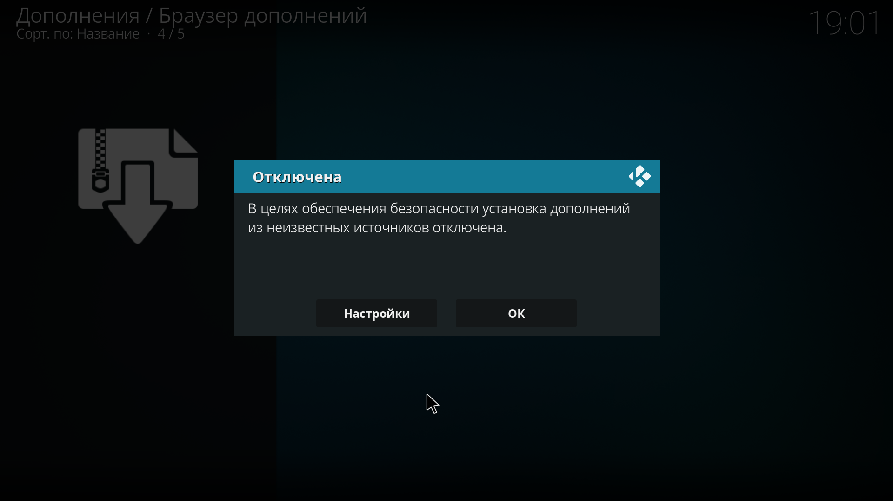

Вам нужно нажать на кнопку "Настройка", иначе все отменится. Он перебросит в настройки и там будет пункт "Установка из не доверенных источников", вам нужно включить данную опцию.

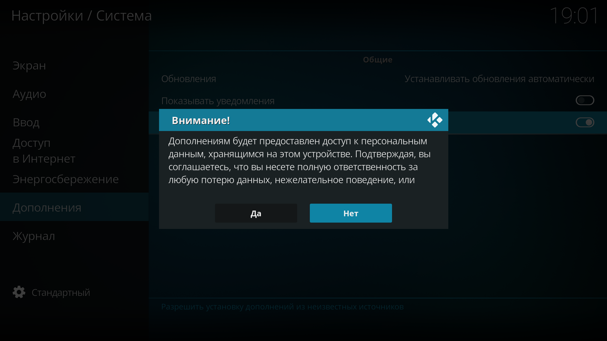

Вас последний раз предупреждают что это может быть опасно, но раз решились, то жмем "Да".

Далее опять устанавливаем дополнение из zip файла, на этот раз он откроет файловый менеджер, и вам нужно выбрать архив скаченный с их сайта. После успешной установки появится оповещение.

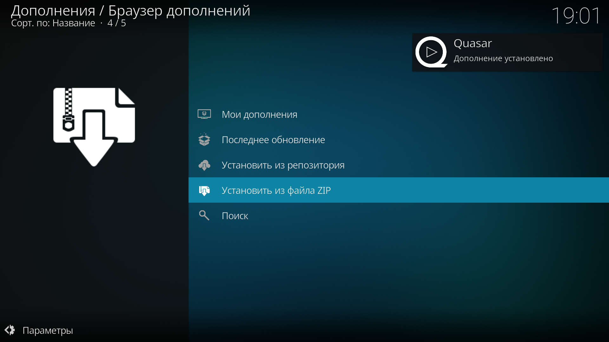

Вот и всё, плагин установлен!

Сразу после установки он будет ругаться что не указана папка для загрузок, и кидать на страницу настроек.

### Настройка

В настройках куча всего интересного, честно говоря, я особо ничего не менял, лишь настроил первые 3 пункта, остальное личные предпочтения каждого.

Во-первых, указывается папка куда будут грузиться временные файлы плагина, а вторым пунктом (уже не обязательно) указывается папка для медиатеки. Третьим пунктом идет сайт откуда парсить инфу о файлах, я предпочитаю The Movie DB, тут уж кому что ближе.

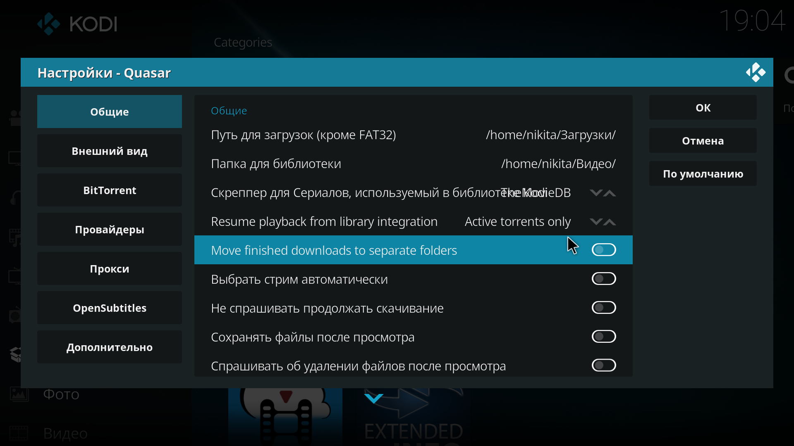

И вот на пункте "Папка для библиотеки"  стоит немного тормознуть, так как он очень важный если вы хотите добавлять торрент файлы в библиотеку фильмов и сериалов.

Тут нужно указать папку, где он будет собирать библиотеку. По данному пути будут созданы 2 папки: Shows, Movies, а внутрь он будет складывать "фильмы" и "сериалы", для того чтобы вы могли собрать медиатеку, ведь для этого нужны файлы. Но хранить он будет не полноценные фильмы, а файлики с правильной структурой и названием с расширением .strm, которые внутри содержат такую штуку: "plugin://plugin.video.quasar/library/movie/play/251516". Т.е. вы можете сами создавать такие файлики, заменяя ID фильма\сериала на нужный. Но это будет не удобно, так как в Quasar для этого есть удобный интерфейс.

Для того чтобы интегрировать всё это в медиатеку вам нужно подключить эти две папки и настроить как с обычными файлами. Если вы этого не делали, в [прошлой статье](/blog/135) ищите по заголовку "Локальная медиатека", всё абсолютно идентично, только выбирать нужно папки созданные Quasar. Весят, как вы понимаете, они ничего, поэтому можно даже создавать на мелком носителе типа флешки.

Если вы по каким-то причинам решите не удалять файл после просмотра, или предзагрузить его, он будет хранить его в папке указанной для загрузки, а не в данных папках, так что ничего страшного не случится.

Продолжаем веселуху и включаем самое крутое и для чего этот модуль создавался.

### Активация и установка Quasar Burst

Quasar Burst — это дополнение которое распространяется (теперь) через репозиторий Quasar, который добавляется при установке Quasar. Оно позволяет искать фильмы\сериалы, в общем любой соответствующий медиаконтент на торрентах, и предоставляет кучу настроек как искать и где искать.

Для его установки первым делом нужно включить репозиторий Quasar, который изначально отключен. Для этого заходим в Дополнения -> Мои дополнения -> Репозитории дополнений и там будет Quasar Repository в отключенном состоянии.

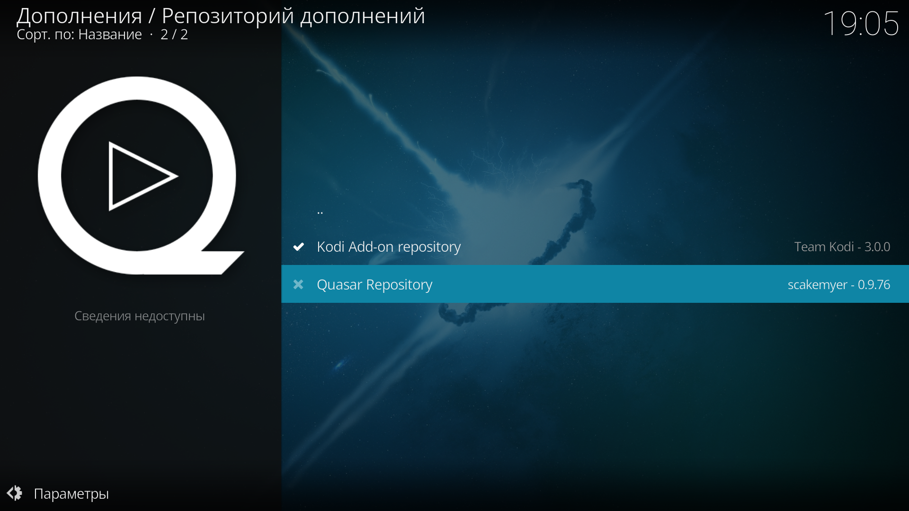

Нажимаем на него и внизу выбираем пункт "Включить". После включения опять заходим в дополнения, выбираем установку из репозиториев, выбираем репозиторий Quasar и устанавливаем Quasar Burst.

После установки нужно зайти в настройки Quasar Burst и настроить торренты под себя и вообще поведение.

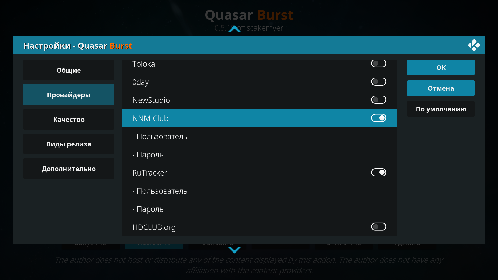

В самом верху по дефолту включены пару зарубежных торрентов, можете их отключить если вам не нужен зарубежный контент, а также все остальные открытые трекеры, т.е. где можно качать без регистрации торрент файлы. Ниже, под чертой, идут закрытые, где потребуется ввод своего логина и пароля, в том числе и русские.

Всё, теперь можно пользоваться дополнением.

### Использование

Зайдя в аддон нас встречает выбор что мы хотим сделать.

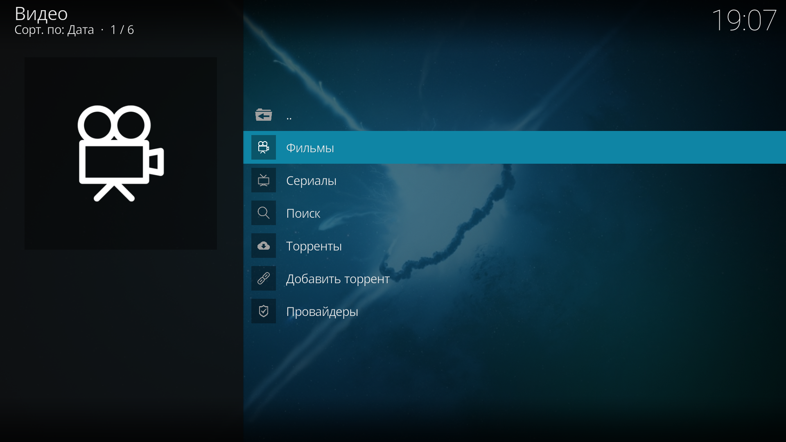

* **Фильмы** — все что касается фильмов.
* **Сериалы** — все что касается сериалов.
* **Поиск** — открывает окно поиска по всем (!) торрент трекерам по названию, т.е. на выходе не будет разбивки на фильмы\сериалы, будет открыт просто список найденых торрент файлов.
* **Торренты** — менеджер загрузок, там отображаются загруженные торренты, и загружаемые, а также поставленные на паузу. Оттуда можно удалить их, включая загруженные ими файлы, или поставить на воспроизведение.
* **Добавить торрент** —  добавляет торрент файл либо по магнет ссылке, либо через файл.
* **Провайдеры** — там будут провайдеры и их настройки, в нашем случае будет один единственный Quasar Burst.

Если зайти, например, в фильмы, то мы увидем дополнительные пункты, которые я разжевывать уже не буду.

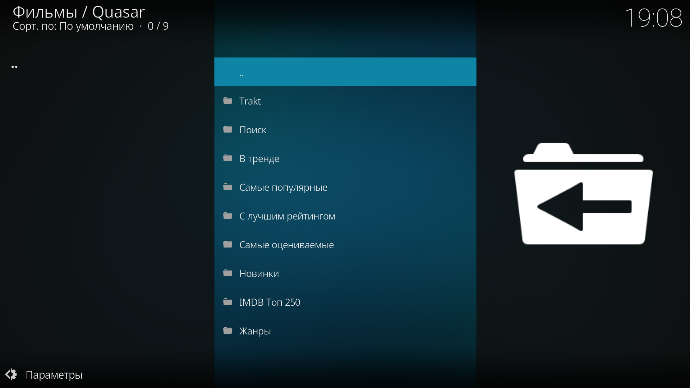

Отмечу лишь что Trakt — это такой сервис трекинга чего вы посмотрели и рекомендаций, бесплатный и этот пункт для интеграции и взаимодействия с ним.

Поиск, в данном случае, будет искать непосредственно по фильмам, а рейтинги, я не знаю откуда они собираются, но пологаю что часть из выбранного сервиса в настройках, а часть с каких-то иных источников, ибо "в тренде" всегда одинаковый не зависимо от выбранного источника данных.

Например я вбил в поиск короткометражку "Кунг Фьюри".

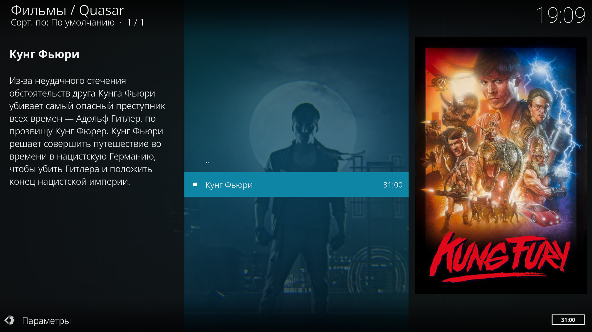

Так как это поиск в фильмах, то он нашел непосредственно через выбранный сервис, и выдал всю информацию о нем. Если бы было несколько фильмов с похожим названием, он вывел бы и их.

Тут же, в контекстном меню можно добавить данный фильм в свою коллекцию, и прочие пункты специфичные исключительно для плагина Quasar.

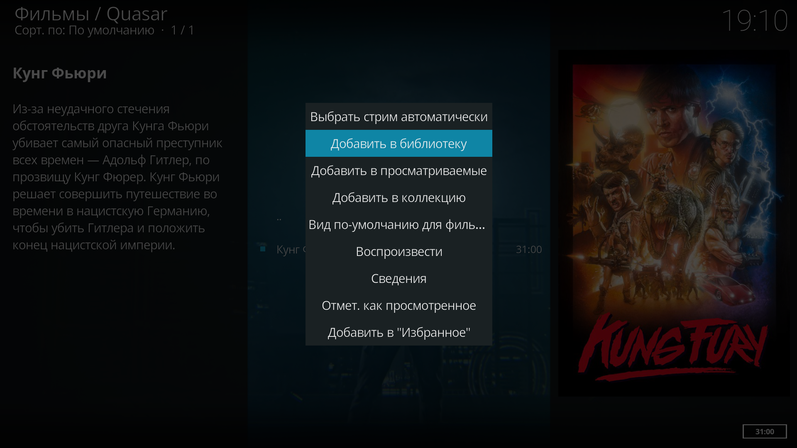

После добавления он сам предложит моментально обновить библиотеку или отложить на потом и сделать руками.

После обновления библиотеки, все добавленные таким способом файлы не потребуется больше искать в Quasar.

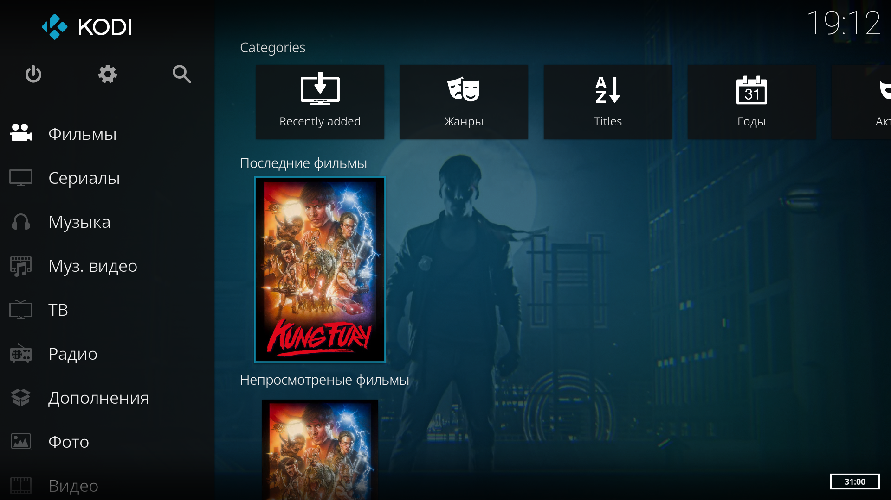

И вот тут то самое интересное. При запуске фильма, ведь у вас его нет, он быстренько опросит все включенные вами торрент трекеры (статус будет в правом углу), и выдаст вам список на выбор, предоставив вам всю необходимую информацию.

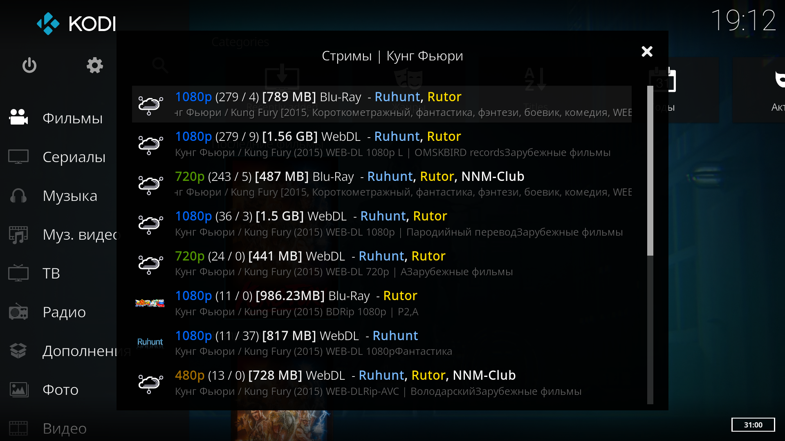

Как вы можете заметить, он умеет находить похожие торрент файлы и объединять их в общий и подключать сидов со всех сразу.

Когда вы выбираете нужный вам торрент файл, начинается буферизация (по дефолту 20 мб).

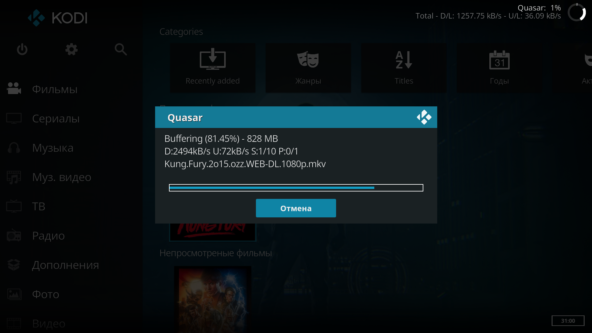

А затем запускается воспроизведение файла.

Если вы остановите воспроизведение, по умолчанию (если ничего подобного не меняли), он спросит, хотите ли вы продолжить загрузку фильма, а затем, если откажитесь, спросит, удалить ли уже загруженный файл или оставить (можно удалить в дальнейшем через Quasar - Торренты или физически).

Допустим, вы вышли, отказались от завершения загрузки, отказались от сохранения файла, но вдруг, решили посмотреть заново. Когда вы опять откроете фильм, он уже будет знать что вы его запускали и предложит не искать ничего на трекерах, и сразу воспользоваться тем же торрент файлом что вы выбрали в прошлый раз. И тут у вас два выбора, согласиться и стрим сразу запустится, либо отказаться.

### Web UI

Данный плагин также предоставляет веб-интерфейс с возможностью контролировать загрузки и добавлять новые посредством магнет ссылки или ссылки на torrent файл (загружать нельзя). 

Данный интерфейс находится по адресу http://localhost:65251/web/ — если это распбери или удаленный медиацентр, то вместо localhost, разумеется, нужно указывать его IP и чтобы порт был проброшен. В данном случае никакой защиты в виде пароля у данного интерфейса нет.

Вот и всё, такой вот аддон. Придется немного повозиться с установкой, немного разобраться, но это просто шикарные инструмент. Одна только интеграция в библиотеку бесценна.

## Фикс для nnmclub и rutracker

Я написал небольшой фикс, который фиксит адреса для двух трекеров выше. По аналогии можете менять и у других.

Фиксится это достаточно просто, достаточно в папку kodi добавить файлик с определенным содержанием. Вот пути до папки KODI на разных системах:

- android: Android/data/org.xbmc.kodi/files/.kodi/
- iOS: /private/var/mobile/Library/Preferences/Kodi
- Linux: ~/.kodi
- Mac: /Users/USERNAME/Library/Application Support/Kodi,
- LibreELEC / OpenELEC: /storage/.kodi
- Windows: 	Пуск - вводим %APPDATA%\kodi  - жмем Enter

Относительно данной папки, в зависимости от системы, нужно зайти в следующую вложенную директорию: `userdata/addon_data/script.quasar.burst`. В данной папке создаем файл `overrides.py` и пишем в него следующее:

~~~python {"header":"overrides.py"}
overrides = {
    #
    # Mirrors for Russian trackers.
    #

    # RuTracker
    'rutracker': {
        'root_url': 'http://maintracker.org',
        'base_url': 'http://maintracker.org/forum/tracker.php?nm=QUERYEXTRA&prev_new=0&prev_oop=1&f[]=-1&o=10&s=2&oop=1&pn=',
        'parser': {
            'torrent': "'http://maintracker.org/forum/%s' % item(tag='a', attribute='href', order=4)"
        }
    },

    # nnm-club
    'nnmclub': {
        'root_url': 'https://nnm-club.name',
        'base_url': 'https://nnm-club.name/forum/tracker.php?nm=QUERYEXTRA&prev_sd=1&prev_a=1&prev_my=0&prev_n=0&prev_shc=1&prev_shf=0&prev_sha=0&prev_shs=1&prev_shr=0&prev_sht=0&o=10&s=2&tm=-1&a=1&sd=1&ta=-1&sns=-1&sds=-1&pn&submit=1',
        'parser': {
            'torrent': "'https://nnm-club.name/forum/%s' % item(tag='a', attribute='href', order=2)"
        }
    },

} 
~~~

Данный файл просто меняет значения в конфигах для трекеров где используется URL на их зеркала. Вот и всё. В случе чего можете сами поправить.

Перезапускаете KODI если он был запущен, включаете данные провайдеры, если они ещё не включены, и все опять работает.
