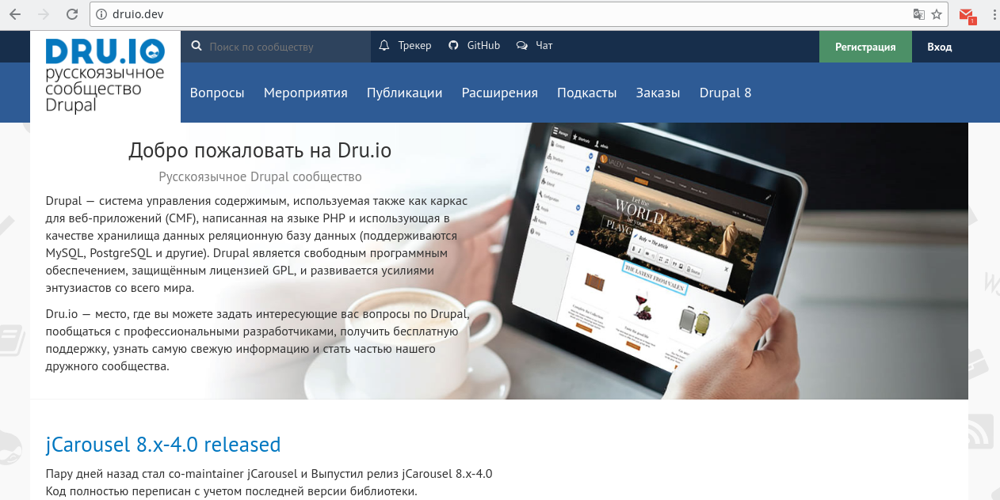
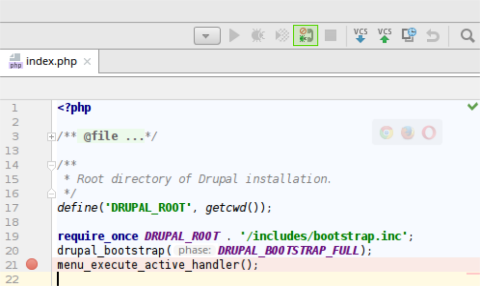
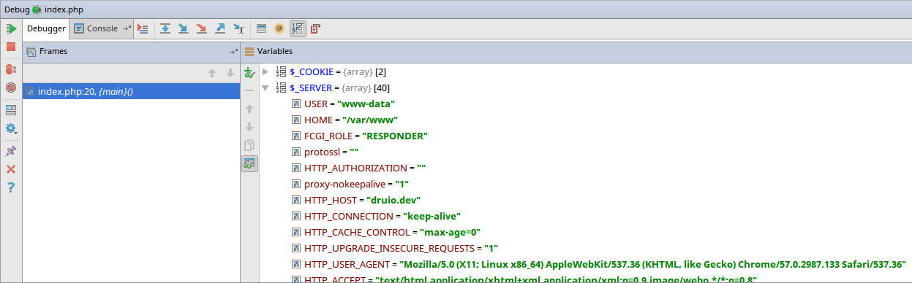

[Drupal VM](https://drupalvm.com) — локальная среда для разработки на Drupal.
Она разворачивает в виртуалке полноценный веб-сервер для работы с Drupal сайтом,
предоставляя базовую конфигурацию сервера с тюнингом под Drupal, а также кучей
опциональных пакетов для более глубокой разработки и тестов.

Данный материал — инструкция, как его использовать и настроить на работу в
Ubuntu. Он также есть и
на [Mac](http://docs.drupalvm.com/en/latest/getting-started/installation-macos/)
и
на [Windows](http://docs.drupalvm.com/en/latest/getting-started/installation-windows/),
если вам нужно под них, тогда лучше обратиться к соответствующим документациям,
так как процесс установки серьезно отличается.

## Что в комплекте Drupal VM

Веб-сервер Apache или Nginx (на выбор), PHP 7.1.x (с возможностью отката до
5.6), MySQL 5.7.x (или MariaDB, или PostgreSQL), поддержка Drupal 7 и 8.

Также, по желанию, можно установить следующие пакеты: Drupal Console, Drush,
Varnish, Apache Solr, Elasticsearch, Node.js, Selenium, Ruby, Memcached, Redis,
SQLite, Blackfire, Tideways, XHProf, XDebug, Adminer, Pimp my Log, MailHog.

По-умолчанию кроме основных пакетов ставятся: adminer, Drupal Console, Drush,
MailHog, Pimp My Log и Varnish. Всё это очень просто отключается.

Разумеется, вас никто не ограничивает, внутри обычная убунту и можно ставить
какие угодно пакеты под свои задачи, просто указанные выше софтины поставятся и
настроятся автоматически, а делается это лишь 1 строчкой в файлик.

Сам Drupal VM использует Vagrant и VirtualBox, что в свою очередь отделяет
каждый сайт в отдельную виртуальную систему (ubuntu) и там все разворачивает,
соответственно всё за вас настраивает и делает синхронизацию папки сайта между
хостом (вишей локальной системой) и виртуалкой. Работает все это очень шустро,
но конкретно на Ubuntu простая установка Drupal VM будет очень сильно лагать,
поэтому надо будет его подопнуть поставив несколько дополнительных пакетов
которые являются опциональными для работы, но без них синхронизация крайне
медленная.

## Установка всех необходимых пакетов для Drupal VM

### Установка Vagrant

Первым делом нам необходимо установить Vagrant, на основе которого всё это и
реализуется:

```bash
sudo apt-get install vagrant
```

**Пакеты в репозиториях не актуальные**, так что лучше скачать
Vagrant [в виде deb пакета](https://www.vagrantup.com/downloads.html).

### Установка VirtualBox

Vagrant может работать с несколькими софтинами для виртуализации: VIrtualBox,
Parallels и VMWare. Но в данном случае лучше не рисковать и юзать VirtualBox,
учитывая что системного интерфейса там никакого не будет, он справится просто
превосходно, и его не потребуется настраивать. В случае Parallels требуется
платные издания Pro или Business, для VMWare платный плагин для интеграции с
вагрантом.

Устанавливать VirtualBox можно смело из репозиториев:

```bash
sudo apt-get install virtualbox
```

### Установка NFS

NFS в данном случае не Need for Speed, а Network File System, хотя эта утилита
про то же что и игра — про скорость. Эта утилита по дефолту будет
устанавливаться в виртуальную машину, но она также требуется на хосте для
быстрой синхронизации между двумя системами, а именно — файлов сайта.

Устанавливать NFS не обязательно, но крайне желательно, без него разработка
будет пыткой, например, если поправить файлик css на хосте, то он доедет до
виртуалки в районе 5-10 секунд, а если файл покрупнее или изменений больше,
например поставили модуль, можно идти за чаем.

Ставится это всё дело всё также из стандартых репозиториев:

```bash
sudo apt-get install nfs-kernel-server nfs-common
```

## Установка Ansible

Ansible помогает пробрасывать команду drush на хост, а также ускоряет различные
проверки при установке и provision виртуалки.

```php
sudo apt-get install software-properties-common
sudo apt-add-repository ppa:ansible/ansible
sudo apt-get update
sudo apt-get install ansible
```

### Установка Vagrant Host Updated

Данный плагин для Vagrant позволяет автоматически прописывать все хосты в
/etc/hosts вашей системы, чтобы вы имели доступ к сайту и всем сервисам через
браузер, в противном случае, вам придется это делать постоянно руками. Данный
плагин не засоряет hosts файл, после отключения виртуальной машины, он удаляет
все что туда добавил. Так что плагин не обязательный, но крайне желательный если
вы не хотите себе добавлять проблем.

```bash
vagrant plugin install vagrant-hostsupdater
```

На этом установка всего необходимого для Drupal VM закончена, ничего сложного и
делается это один раз на системе и больше к этому возвращаться не придется.
Теперь можно переходить непосредственно к Drupal VM.

## Установка Drupal VM

Назвать это установкой, конечно не очень корректно, но пусть будет так. Сам
Drupal VM — это просто куча файликов с настройками для Vagrant и скриптами на
установку софта в виртуальной ОС чтобы вам не пришлось ничего делать. Попутно
там лежит файлик для Vagranta который объясняет что с этим всем делать. Проще
говоря, сам Drupal VM это просто наборы инструкций для вагранта, которые
предоставляются нам в виде конфиг файла из которого всё собирается.

### Качаем Drupal VM

Скачать самую последнюю версию Drupal VM
можно [на GitHub](https://github.com/geerlingguy/drupal-vm/releases). У каждого
релиза прикреплены 2 архива, качайте любой, у них лишь разные расширения.

Далее вам необходимо просто распаковать данный архив в любом удобном для вас
месте, и назвать как вам удобнее и понятнее, данная папка будет всем для
будущего сайта с его виртуальной системой, там будут как все настройки, так и
файлы сайта (в отдельной вложенной папке).

### Настройка Drupal VM

В папке, которая из архива, есть файлы и папки которые необходимы для работы
Drupal VM. Для настройки используются config.yml файлы. По дефолту всегда
используется **default.config.yml** файл. Данный файл нельзя редактировать (на
самом деле можно), так как если вы захотите обновить файлы Drupal VM у вас всё
слетит. В данной папке вы можете создавать файлы **config.yml** и *
*local.config.yml**, которые будут перекрывать переменные **default.config.yml
**.

Суть там такая, сначала грузится **default.config.yml** со всеми возможными
переменными и значениями по умолчанию, далее грузится (если имеется) файл  *
*config.yml**, который заменяет значения переменные из default файла на новые,
только те что указаны в config.yml, затем грузится **local.config.yml** (если
имеется), который также заменяет ранее объявленные переменные своими.

Для чего это нужно? Default оно и ясно, там все возможные переменные со своими
настройками, далее, вы создаете **config.yml** и добавляете туда переменные из *
*default** которые вы хотите переопределить и переопределяете на нужные. *
*local.config.yml** нужен если вы хотите хранить проект сайта в репозитории
непосредственно с Drupal VM конфигами. Это позволит работать в одинаковой среде
нескольким разработчикам, за счет одинаково сконфигурированного **config.yml**,
но также каждому из разработчиков локально для себя переопределить общие
настройки. Например, может кому-то хочется выделить больше оперативки и
процессоров, при этом не трогая общие настройки которые приедут всем, а данный
файл добавить в .gitignore.

В нашем случае нас интересует только **config.yml** в котором вы задаете только
те параметры, которые вас не устраивают в default. Некоторые из них я рассмотрю
ниже, это те, которые могут быть полезными и востребованными для переопределения
в большинстве случаев.

Пойдем сверху вниз.

#### vagrant_box

Данный параметр из коробки трогать не стоит, но я все же упомяну его. Это
название системы которая будет установлена в VirtualBox и где будет установлен
весь необходимый софт для сервера. Т.е. вы можете менять системы и версии без
проблем, но если не понимаете зачем и как это работает, лучше не трогать. По
дефолту там последняя Ubuntu LTS.

#### vagrant_hostname

`vagrant_hostname: drupalvm.dev`

Данный параметр отвечает за то, по какому адресу будет открываться ваш будущий
сайт из виртуалки. Данный параметр можно менять после отключения Drupal VM
системы, он лишь прописывается в hosts в момент включения и убирается в момент
отключения.

#### vagrant_machine_name

`vagrant_machine_name: drupalvm`

То как будет называться система. По сути не на что не влияет, но если вы хотите
запускать более 2 таких "серверов" одновременно, лучше задать данный параметр
понятным для себя, так как по SSH он будет отображаться в
терминале `username@drupavm` — это позволит вам не путаться и понимать к какой
системе вы сейчас подключены. Так что лучше его задать.

#### vagrant_ip

`vagrant_ip: 192.168.88.88`

IP адрес который будет отдан Drupal VM на время запуска. По дефолту везде стоит
тот что выше, вы можете указать по сути любой, но особо не имеет смысла если вы
не хотите запускать более 1 системы одновременно. Вы также можете поставить IP
0.0.0.0 для автоматической генерации IP, но для этого не забудьте поставить
плагин для вагранта: `vagrant plugin install vagrant-auto_network`. Без
необходимости трогать нет смысла.

#### drupalvm_webserver

`drupalvm_webserver: apache`

В случае Drupal 8 рекомендуется использовать nginx. Так как BigPipe в ядре уже
является стабильным и очень ощутимо ускоряет загрузку страниц без необходимости
что-то настраивать и делать на стороне сайта, это шикарное решение из коробки.
Но оно требует правильных настроек сервера, для ответов которые делает BigPipe
нужно отключать буферизацию и сжатие. Он передает необходимые параметры, но
этого мало для Apache. Там требуется отключение буферизации, тонкая настройка
mod_php. По крайней мере это касается связки apache + php-fpm, которая
используется в Drupal VM, в случае с nginx, он по заголовку ответа понимает что
сжатие и буферизацию данному ответу проводить не нужно и соответственно
ускорение получается максимальным.

#### vagrant_synced_folders

Данный раздел позволяет настроить пути для синхронизации между хостом и
виртуалкой.

По умолчанию тут настроена синхронизация файлов с сайтом и прочими сервисами с
текущей папкой.

```yaml
vagrant_synced_folders:
  - local_path: .
    destination: /var/www/drupalvm
    type: nfs
    create: true
  # Дополнительная синхронизация
  # - local_path: .
  #   destination: /var/www/drupalvm
  #   type: nfs
  #   create: true
```

Выше я скопипастил дефолтное значение и в виде коммента добавил пример как
добавить ещё одну синхронизацию. Их можно делать столько, сколько вам нужно. Из
коробки хватит того что установлено по умолчанию, дальше по потребностям.

Чтобы было понятнее о чем тут настройки, надо рассказать как работает веб сервер
в виртуалке. Drupal VM делает так, что все что касается веб сервера ставится в
/var/www/drupalvm директорию виртуальной машины. Как правило, там находится
папка drupal, внутри которой и лежит сайт.

В настройках local_path отвечает за то, где у вас на компьютере будут держаться
данные файлы, а destination — где они будут на виртуалке. Учитывая всё что выше
написал, если оставить настройки как есть, то содержимое папки с виртуалки
/var/www/drupalvm будет синхронизироваться с папкой "." (точка linux означает
текущую папку), а именно, с папкой где лежит config.yml, в общем та что вы
вытащили из архива и куда её положили. Так как на виртуалке там хранится папка
drupal, внутри которой всё и находится, то у вас в папке где config.yml также
будет создана папка drupal, внутри которой будет Drupal со своими файлами.

type на Ubuntu так и оставляйте NFS иначе будет лагать, а create позволяет
создавать папки если они отсутствуют, или вам придется делать всё это руками.

Дефолтное значение стоит менять только при острой необходимости и только когда
понимаете что делаете. Если хотите добавить дополнительные папки для
синхронизации, не забудьте добавить и стандартное значение, так как переменные
затираются полностью, а не дополняют друг друга.

#### vagrant_memory и vagrant_cpus

Данные два параметра позволяют ограничить ресурсы для виртуальной машины. По
умолчанию 2гб оперативки и одно ядро. Для большинства сайтов этого хватит за
глаза, тут вы правите при необходимости и с учетом вашей системы. Например у
меня на дефолтном конфиге Drupal 8 с отключенным кэшем и включенным дебагом и
ребилдом Twig отдает страницы за 100ms. Т.е. одного ядра и 2гб там за глаза.

#### drupal_build_makefile

`drupal_build_makefile: false`

Если установлен true, то при первом запуске Drupal VM он попытается найти файл *
*drupal.make.yml** в корне папки и установить Drupal на основе указанных там
настроек. Для примера поставляется **example.drupal.make.yml**. Данный файл
собирается при помощи Drush

#### drupal_build_composer

`drupal_build_composer: false`

Аналогично параметру выше, но проект будет собран при помощи composer. Из
коробки ищет файл **drupal.composer.json**, в комплекте также предоставляется
пример в **example.drupal.composer.json**.

Если данный параметр ставите на true, то drupal_build_makefile должен быть false
и наоборот.

#### drupal_build_composer_project

`drupal_build_composer_project: true`

Собирает сайт при помощи команды `composer create-project`. **Обратите внимание
** данный параметр установлен по умолчанию на true. Если вы не поменяете
drupal_install_site то при первом запуске он установит Drupal при помощи данный
команды. Либо отключайте установку, если хотите сделать сами или подключить уже
существующий сайт, либо выбирайте каким методом ставить.

Также, если это стоит true, то drupal_build_composer и drupal_build_makefile
должны быть в false. Т.е. из всей этой троицы true допустимо только одной
переменной.

#### drupal_install_site

`drupal_install_site: true`

Означает что при первом запуске он установит Drupal сайт на основе выбранного
выше способа, а там, какие уже конфиги указаны, так и поставит. По дефолту везде
ставится Drupal 8. Если вообще не трогать эти параметры, то при первом запуске
будет установлен Drupal 8 dev при
помощи `composer create-project drupal-composer/drupal-project:8.x-dev --prefer-dist --stability dev --no-interaction`.

У каждого из параметров есть свои доп. настройки, а в дефолтном конфиге также
можно посмотреть переменные для дефолтных пользователей и пароля. По умолчанию
устанавливается логин и пароль admin, стандартный профиль.

#### installed_extras

То, какие доп. пакеты будут установлены, из коробки: adminer, Drupal Console,
Drush, MailHog, Pimp My Log и Varnish. Если хотите переопределить, то копируйте
переменную полностью и комментируйте/раскомментируйте нужные пакеты.

#### php_version

`php_version: "7.1"`

В большинстве случаев этой версии хватит всем, даже сайту на Drupal 7 (
проверенно все работает). Если по каким-то причинам нужна другая версия, тут её
можно указать. На данный момент доступны: 5.6, 7.0, 7.1, актуальные доступные
версии можно посмотреть в комментарии к данному параметру default файла.

Ниже также присутствуют другие настройки для php.

В целом, больше тут особо важного ничего нет. Можете сами покапаться и
посмотреть что можно затюнить.

## Пример использования

Несколько примеров по установке на Drupal VM.

### Виртуалка для разработки сайта с 0

Первым делом качаем архив, если этого еще не сделано, и кладем куда вам удобно.
В корне данной папки создаем **config.yml**.

Так как сайт с 0, я особо не хочу заморачиваться с загрузкой ядра и установкой,
то сделаю сделаю конфиг так чтобы он скачал ядро при помощи Drush.

```php {"header":"config.yml"}
# Адрес по которому будет открываться сайт.
vagrant_hostname: drupal8.dev
# Название машины в виртуалке.
vagrant_machine_name: drupal8dev

# Лимит памяти я увеличиваю до 512 Мб.
php_memory_limit: "512M"
# Для Drupal 8 4к файлов в Opcache маловато, учитывая что ядро содержит больше.
php_opcache_max_accelerated_files: 10000

# Отключаем сборку через compose create-project
drupal_build_composer_project: false
# Включаем установку при помощи Drush
drupal_build_makefile: true
```

Далее заходим при помощи консоли в данную папку и пишем `vagrant up` (без
sudo!), он начнет сверку всех данных и настроек. Если это новый сервак, он все
скачает и установит. Самый первый запуск может быть долгим, так как ему ещё
потребуется скачать ubuntu или ту систему что вы указали, в дальнейшем уже будет
использовать скаченную ранее и ожидать только процесс установки. Все последующие
запуски уже установленной виртуалки будут практически моментальными.

Если всё сделали верно, то по адресу (основываясь на конфиге
выше) http://drupal8.dev будет открываться уже установленный сайт. А
дополнительная информация будет находится по
адресу: http://dashboard.drupal8.dev

## Установка руками с нуля или готового проекта

Данный способ про то, как сделать нужные папки и установить в ручном режиме,
либо уже имеющийся сайт. Пример будет на существующем сайте, установка
отличается лишь тем что ненужно импортировать базу.

Этот способ предпочтительный, так как drush make и compser будут выполняться
очень долго из-за того что происходит постоянная двухсторонняя синхронизация
файлов. В случае с 8-кой это критично. Без SSD использовать метод выше лучше не
стоит, пустая трата времени.

При таком подходе нам нужно будет отключить установку и настроить пути для
синхронизации, так как в таком случае, я так понял, лучше не использовать
дефолтный `/var/www/drupalvm`.

Для примера я буду
разворачивать [dru.io из репозитория](https://github.com/dru-io/Dru.io).

Первым делом создаем папку где будет код друпала и с которой будем работать. Я
далеко ходить не буду и создам папку drupal внутри папки с вагрант файлом и
скачаю туда код dru.io.

```bash
# Заходим в папку где лежит drupalvm конфиги.
# Создаем папку
mkdir drupal
cd drupal
# Точка в конце нужна чтобы он не создавал подпапку а скопировал в текущую.
git clone https://github.com/dru-io/Dru.io.git .
```

Далее настраиваем конфиги для vagrant.

```yaml {"header":"config.yml"}
# Адрес по которому будет открываться сайт.
vagrant_hostname: druio.dev
# Название машины в виртуалке.
vagrant_machine_name: druio.dev

# Лимит памяти я увеличиваю до 512 Мб.
php_memory_limit: "512M"

# Отключаем установку и сборку сайта, так как мы будем делать всё руками.
drupal_build_makefile: false
drupal_build_composer: false
drupal_build_composer_project: false
drupal_install_site: false

# Настраиваем синхронизацию папок.
vagrant_synced_folders:
  - local_path: ./drupal
    destination: /var/www/druiodev
    type: nfs
    create: true

# Указываем где находится ядро Drupal. Оно должно равняться значению destination выше.
drupal_core_path: /var/www/druiodev
```

Теперь запускаем vagrant при помощи `vagrant up` и ждем установки системы и
синхронизации файлов с виртуалкой.

Если все сделали верно, то по указанному в config адресу (druio.dev в случае
выше) будет запускаться установка сайта. Если вы хотите чистый сайт, следующие
шаги вам не нужны. Для базы используйте drupal в качестве БД и логина с паролем.

### Импорт базы через GUI

Для импорта используется адрес adminer.{{ vagrant_hostname }}. Следовательно, из
конфига выше адрес будет следующим: http://adminer.druio.dev — там будет
adminer, где используя drupal для всех значений можно попасть в базу и сделать
импорт.

### Импорт через консоль

Не всегда GUI позволяет импортировать базы, особенно большие, и это происходит
значительно медленнее чем это делать через консоль. В моем случае импорт будет
через консоль, для начала надо будет скачать базу, распаковать и затем вливать.

```bash
# Первым делом заходим в папку `./drupal` где находится ядро сайта и которая синхронизируется с виртуалкой.
# Качаем актуальную базу dru.io или вы просто скиньте .sql файлик в данную папку.
wget http://dru.io/sites/default/files/database.sql.gz
# Распаковываем архив
gunzip database.sql.gz
# Теперь заходим по ssh на виртуалку и переходим в синхронизируемую папку
vagran ssh
cd /var/www/druiodev/
# Тут находится уже наш архив и распакованный файл или ваш если вы просто его перенесли.
# Импортируем
mysql -udrupal -p drupal < database.sql
```

После вызова последней команды он запросит пароль, который также по умолчанию
является `drupal`. Обратите внимание что после -u где пишется логин, пробел не
ставится, там никаких ошибок в команде нет.

Так как сайт существующий нам надо закинуть и поправить settings.php файл.

```php {"header":"Для Drupal 7"}
$databases = array(
  'default' => array(
    'default' => array(
      'database' => 'DATABASE_NAME',
      'username' => 'DATABASE_USERNAME',
      'password' => 'DATABASE_PASSWORD',
      'host' => 'localhost',
      'port' => '',
      'driver' => 'mysql',
      'prefix' => '',
    ),
  ),
);
```

И если всё сделано верно, то у вас откроется сайт.



## Полезные команды

* Поднятие вагранта (drupalvm), вызывается из папки: `vagrant up`
* Остановка: `vagrant halt`
* Полное удаление виртуалки (для пересоздания или чистки): `vagrant destroy` —
  сервер должен быть отключен.
* Обновление параметров виртуалки, например решили поменять версию php, или
  переключиться с apache на nginx, а может просто адрес сменить. Для этого не
  нужно переустанавливать, достаточно поменять config.yml и
  написать: `vagrant provision`
* Вы можете вызывать с локальной машины drush команды просто указав домен
  сайта: `drush @druio.dev.druio.dev status`. Первым указывается
  vagrant_machine_name, а через точку vagrant_hostname. Так как они одинаковые,
  получилась такая команда. Остальные консольные штуки, типа drupal console,
  нужно вызывать через SSH.
* Войти в терминал виртуалки по ssh: `vagrant ssh`
* http://dashboard.druio.dev/ — вся необходимая информация о виртуалке.

## Включение XDebug

И последним примером в статье станет то как установить xdebug на виртуалку и как
подключить его к PHPStorm. Заодно это будет примером как ставить доп. пакеты и
использовать provision.

Первым делом вы должны запустить виртуалку, хотя это можно сделать и потом. А
затем мы должны поправить config.yml. Так как мы перезапишем этим самым
полноценно переменную installed_extras, то нам необходимо её скопировать к себе
и раскомментировать нужный пакет.

```php {"header":"config.yml"}
installed_extras:
  - adminer
  # - blackfire
  - drupalconsole
  - drush
  # - elasticsearch
  # - java
  - mailhog
  # - memcached
  # - newrelic
  # - nodejs
  - pimpmylog
  # - redis
  # - ruby
  # - selenium
  # - solr
  # - tideways
  # - upload-progress
  - varnish
  # Убираем решетку у xdebug
  - xdebug
  # - xhprof
```

Все остальные закомментированные можете либо удалить, либо оставить. Тут уж на
ваше усмотрение.

Теперь необходимо запустить их "установку", для этого
вызываем `vagrant provision`. Эта команда просканирует настройки и установит
недостающие пакеты, и внесет все прочие необходимые изменения если такие
имеются.

После того как provision завершится, всё готово к использованию.

Первым делом
качаем [расширение для Chrome](https://chrome.google.com/webstore/detail/xdebug-helper/eadndfjplgieldjbigjakmdgkmoaaaoc)
или [делаем руками](https://www.jetbrains.com/phpstorm/marklets/) куки для
дебага. В случае с расширением, на нужном сайте когда нужен дебаг, переключем
его в режим Debug, когда не нужен, отключаем. В данном случае надо включить
зайдя на свой сайт.

Затем в php storm необходимо поставить куда-нибудь breakpoint и включить
прослушку соединений дебагера.



Теперь при заходе на сайт при включенном дебаге и поставленном breakpoint у вас
вся инфа будет появляться в phpstorm.



Думаю на этом стоит остановиться.

Так как Drupal VM достаточно гибкий, то писать можно много чего, но в данной
статьей я покрыл все что необходимо знать и пользоваться им на Ubuntu. В случае
чего всегда
есть [официальная документация](http://docs.drupalvm.com/en/latest/).
