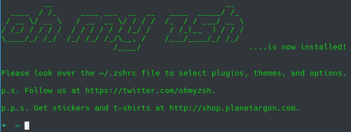
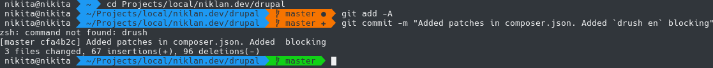

Хочу поделиться очень отличным шелом, а по большей части, фреймворком созданным для него, который превратит вашу консоль в очень информативный и продуктивный инструмент. 

Данный материал пригодет только для пользователей unix-подобных систем, а именно Linux и MacOS. На MacOS не знаю что да как, но судя по всему установка и настройка совершенно не отличаются друг от друга. Соответственно его можно ставить и на веб-сервера.


## Что это и зачем оно


Немного введу в курс дела, чтобы вы понимали что это такое и что оно даст. Во-первых, потребуется установить новую оболочку для терминала Zsh и переключиться на неё (кто не в курсе, они живут рядом с друг-другом и не затирают аналоги, так что можно всегда вернуться обратно, например на bash в ubuntu, + можно каждому юзеру выбирать свою, так что это совершенно безопасно). Во-вторых, мы поставим фреймворк для Zsh, который позволяет писать различные плагины, темы и т.д. для данной оболочки, что, собственно, и делает её такой удобой, так как люди написали кучу годноты.


Я не могу вам описать всех возможностей, ибо некоторые из них не так заметны и не сразу бросаются в глаза. Например, при указании пути до файла\папки Tab в Zsh, делает то же самое что и в bash, но куда круче, а я заметил это спустя неделю, так как не обращал внимания. Он мало того что может учитывать регистры папок и поправлять вас, так и список папок также можно визуально перебирать табом, что просто очень удобно и ускоряет работу.

Я вообще изначально ставил данный шелл и фреймворк только ради Git плагина, который показывает (если вы находитесь в папках с репозиторием), актуально ли текущее состояние репозитория, в какой ветке находимся, имеются ли новые изменения в файлах, есть ли коммиты или изменения. В общем всю необходимую информацию. Не нужно проверять ветку через `git branch -v`, проверять есть ли изменения через `git status` и т.д.

У него есть куча интеграций с различными программами и системными утилитами, которые позволяют сделать работу с терминалом намного, намного приятнее. Ведь, особенно, с Drupal 8, работать с ним нужно все чаще и больше.


## Установка Zsh и Oh My Zsh


Первым делом нужно установить оболочку Zsh, для этого в Ubuntu необходимо просто  запросить данный пакет, так как он находится в официальных репозиториях:


```php {"header":"Установка Zsh на Ubuntu"}
sudo apt install zsh
```

Далее нам необходимо поставить фреймворк [Oh My Zsh](https://github.com/robbyrussell/oh-my-zsh). Разработчики предлагают два варианта установки, по сути они одинаковые, вам просто предоставляется выбор как вытянуть скрипт установщика, `wget` или `curl`, это лишь важно в тех случаях, когда на системе нет одного из них (частенько можно встретить отсутствие curl), и вы не хотите ставить пакет ради этого, или нет прав. Я также пишу вам два варианта, а какой использовать решайте сами:


```sh {"header":"Установка Oh My Zsh"}
# Curl
sh -c "$(curl -fsSL https://raw.githubusercontent.com/robbyrussell/oh-my-zsh/master/tools/install.sh)"
# Wget
sh -c "$(wget https://raw.githubusercontent.com/robbyrussell/oh-my-zsh/master/tools/install.sh -O -)"
```

После данной установки, у вас запросят пароль чтобы переключить шел для текущего пользователя на Zsh. Вводим, и всё готово!



Из коробки он хоть уже и дает больше информации, как по мне, он выглядит хуже оригинального. Для этого в OMZ есть поддержка тем и плагинов, которые могут в корне менять оболочку.


## Где и что находится


Данный раздел я не мог упустить так как он может очень сильно помочь в дальнейшем. Фреймворк Oh My Zsh находится в папке `~/.oh-my-zsh` — там, в свою очередь, находятся все файлы фреймворка. А сама папка ничто иное как репозиторий Oh My Zsh. Но удалять папку просто так не стоит, там для этого есть специальный скрипт, ниже напишу как.

Все настройки для Oh My Zsh находятся в файле `~/.zshrc`. О нем подробнее будет ниже.


## Установка плагинов


Начнем с установки нужных нам плагинов. Из коробки там стоит только git, больше никакие плагины не активированы. Список всех додступных плагинов поставляемых с фреймворком можно посмотреть [на странице wiki](https://github.com/robbyrussell/oh-my-zsh/wiki/Plugins), с описанием для чего они используются.

Например я хочу поставить себе следующие плагины:

- **npm** — добавлят поддержку автодополнения к команде npm
- **vagrant** — так как я часто пользуюсь vagrant из-за [Drupal VM](/blog/147), то мне он тоже не помешает. Также как и npm добавляет поддержку автодополнения. Там же есть и **docker**.
- **composer** — в 8-ке очень активно [использую composer](/blog/130), а данный плагин опять же, добавляет автодополнение, и помимо этого различные полезные синонимы команд. Например `cu` = ` composer update`.
- **sudo** — частенько бывает и такое, что вбиваешь или копируешь команду из интернета, но для неё требуются права супер-пользователя. Постоянно переводить курсор и дописывать муторно, а данный плагин позволяет просто нажать два раза `Esc`, и он сам добавит sudo в начало команды.
- **web-search** — а иногда случается ситуация, что роешься в консоли и забыл какую-то команду, нужно гуглануть, и чтобы не переключаться на браузер, не кликать на строку поиска, данный плагин позволяет написать `google drupal 8 composer`, и в браузере по умолчанию сразу откроются результаты.

Там куча других плагинов, можно писать свои, выбирайте на свой вкус и под свои задачи, я продолжу гайд как поставить указаныне выше плагины (остальные ставятся абсолютно также).

Для того чтобы включить данные плагины (они уже есть в комплекте), достаточно отредактировать файл `~/.zshrc`. Для этого, в ubuntu, достаточно написать `nano ~/.zshrc` или `vi ~/.zshrc`, что вам удобнее. Открываем данный файл на редактирование и ищем строку `plugins=(git)` и добавляем туда все нужные нам плагины, учитывая список выше, вышло следующее: `plugins=(git npm vagrant composer sudo web-search)`. После изменения данного файла, **всегда** необходимо прописывать `source ~/.zshrc`, иначе изменения вступят в силу только после перезагрузки.

После этого можете тестировать работу. 


## Установка тем оформления


Из коробки оформление Zsh кому-то может и приглянуться, но мне оно не зашло. Называется она `robbyrussell`. Но есть куча других тем, по ссылке [полный список тем](https://github.com/robbyrussell/oh-my-zsh/wiki/themes) которые идут в комплекте Oh My Zsh.

Я покажу как включать темы на примере оформления **agnoster**, так как оно больше всего мне по душе и иногда также требует дополнительных действий для корректной работы.

Для включеня данной темы нам опять, достаточно открыть `~/.zshrc` файли найти строку `ZSH_THEME="robbyrussell"` и заменить стандартную тему на нужную, в моем случае `agnoster`, итого получается `ZSH_THEME="agnoster"`. Не забываем про `source ~/.zshrc`. И всё уже работает!



Если у вас вместо иконок Git или нету "уголков" в строке навигации, то вам нужно поставить спец. шрифты с данными иконками. Множество тем требует установки данных шрифтов, они никак не помешают, но будет работать как нужно. Если всё как и на скринах - ставить не нужно, если же нет, то ниже инструкция для вас.

Давайте установим [пропатченные шрифты](https://github.com/powerline/fonts):


```sh
# clone
git clone https://github.com/powerline/fonts.git
# install
cd fonts
./install.sh
# clean-up a bit
cd ..
rm -rf fonts
```

Этого уже будет достаточно, можно работать. Но некоторые моменты я ещё затрону.


## Настройки


Я их не правлю, но выписал с обьяснением чтобы было проще ориентироваться. Напоминаю что все они в `~/.zshrc`. Если настройка закомментирована, то вы можете расскоментировать её удалив `#`, то что указано в значении которое закомментировано - является противоположным значению по умолчанию.

- `CASE_SENSITIVE="true"` — чуствительность к регистру. Как я указал в начале статьи, он сам может исправлять регистр если видит что в текущем ничего не найдено. Если это мешает, установив данный параметр в true, поведение будет привычное bash.
- `HYPHEN_INSENSITIVE="true"` — включает автоматическую замену между "_" и "-". Аналогично параметру выше, но касается только дефиса и подчеркивания.
- `DISABLE_AUTO_UPDATE="true"` — позволяет отключить автоматическое обновления Oh My Zsh.
- `export UPDATE_ZSH_DAYS=13` — задает переодично проверки обновлений.
- `DISABLE_LS_COLORS="true"` — позволяте отключить цветовую палитру при выводе команды `ls`.
- `DISABLE_AUTO_TITLE="true"` — отключение автоматического заголовка терминала.
- `ENABLE_CORRECTION="true"` — включает корректировку команд. Например, вводя `compozer` он выдаст запрос: `correct 'compozer' to 'composer'?`.
- `COMPLETION_WAITING_DOTS="true"` — включает точки ожидания ввода аргументов. Например введя `composer` и нажав `Tab`, он будет перебирать доступные команды (из-за одноименного плагина), а если ввести `java` и нажать таб, у него нет вариантов автодополнения (они будут появляться по мере их успешнного ввода в терминале и кэшироваться) он будет отображать красные точки для обязательного ввода которые можно отменить только `Ctrl + C`.
- `DISABLE_UNTRACKED_FILES_DIRTY="true"` — отключает пометку неиспользуемых файлов в пределе Git репозитория как "гразных", что увеличивает скорость скана для git. Не могу сказать точнее что это и как это работает, но это напрямую связанно с git вообще, а не только плагином.
- `HIST_STAMPS="mm/dd/yyyy"` — позволяет менять формат даты для команды `history`.
- `ZSH_CUSTOM=/path/to/new-custom-folder` — позволяет добавить дополнительный путь до папки где будут храниться кастомные плагины и темы. По дефолту `~/.oh-my-zsh/custom`, она также будет функционаривать, т.е. параметр не перезатерающийся.

Это все настройки Oh My Zsh, ниже по файлу вы найдете различные переменные и примеры использования. 


## Фиксим проблему с PATH


В Linux (не знаю как в MacOS), и в текущей версии я такой проблемы не словил, есть или можеть быть проблема что вы вбиваете команду в Zsh, а он говорит её нет. И это нормальное поведение, ведь в момент установки у вас был другой шелл, и возможно путь до бинарника указан в его индивидуальных настройках. Чтобы это исправить, достаточно указать путь до папки с бинарником(ами) в PATH переменную системы. Но bash'овский вариант `export PATH=/usr/local/bin:$PATH` прокатит до перезагрузки.

Вариант первый, это в файле конфига `~/.zshrc` раскомментировать соответсвующую строку в самом начале и добавить нужные пути, либо добавить их прямо из терминала:


```sh
# Добавить в конец переменной
path+=('/home/USERNAME/SOMEPATH/bin')
# Добавить в начало переменной
path=('/home/USERNAME/SOMEPATH/bin' $path)
# Отгрузить новую переменную
export PATH
```

## Удаляем Oh My Zsh


Если вам потребуется полностью удалить Oh My Zsh и сам шелл с системы, то это делается достаточно просто:


```sh {"header":"Удаление"}
# Удаляем Oh My Zsh и всё что с ним связано
uninstall_oh_my_zsh
# Удаляем Zsh
sudo apt uninstall zsh
```
