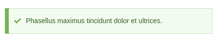

Данный материал я хотел написать, наверное, уже больше года, наконец-то нашел в
себе желание расписать о том, что же такое сервисы в Drupal 8. В общем сложно о
простом, погнали!

## О сервисах

В Drupal 8 появилась такая штука как Services (сервисы), которая является ничем
иным как Service Container из Symfony 2, просто адаптированным под Drupal.
Местами синтаксис из Symfony 3, местами из Symfony 2, т.е. как бы можно читать
гайды из симфони про сервисы, но проверяя так ли данные параметры работают в
обертке друпала. Если вы пишите код, то вы уже 100% натыкались на сервисы, и
если не писали, то столкнетесь с ними очень и очень быстро. Но зачастую, их
использование сводится к копипасту из гайдов\ответов или же простому запоминанию
нужных. Но что же там под капотом, зачем это, как делать свои сервисы, когда их
делать и почему это нужно делать — в этом материале я постараюсь ответить на все
эти вопросы.

Сразу отвечая на простой вопрос: "Нужно ли их использовать в своих модулях?" —
да, и всегда. Это решает кучу "проблем", делает код читабельнее и
организованнее, а главное — гибче. И по ходу материала, вы поймете, почему
именно так. Если сразу немного подвести итог, то каждый объект в вашем модуле,
который не является плагином или чем-то подобным, должен быть объявлен как
сервис, и использоваться во всем коде через сервисы, а не напрямую. Так что да,
в Drupal 8, использование сервисов для своих объектов это — best practice.

Говоря простым языком о сервисах — это инструментарий для работы с объектами и
контроля всех зависимостей, который позволяет работать через централизованный
API. Какие же преимущества у сервисов перед обычным созданием объекта и
добавление зависимости в `use`:

- Самое главное, конечно, это гибкость. Это не совсем может показаться очевидным
  изначально, но сервисы по сути сделаны именно для этого. Учитывая что все
  объекты Drupal (кроме глобального `\Drupal`, который в свою очередь обертка
  для самых востребованных сервисов и объектов) объявлены через сервисы и
  вызываются соответственно, это позволяет заменять существующие сервисы, при
  необходимости, на свои, не хакая при этом ядро. Не нравится как что-то
  работает в ядре или ином модуле — заменяете сервис из ядра своим и
  контролируйте как вам нужно. Конечно это будет мало востребованно, прямо в
  экзотических случаях, с сервисами модулей, возможно уже будет чаще встречаться
  такой подход, но все же, это не отменяет того факта, что благодаря сервисам,
  можно заменять куски ядра на свои, не трогая при этом ядро вообще.
- Вторым немаловажным удобством явлется то, что не нужно писать все инклуды и
  запоминать названия объектов. Вы мне возрозите: "Да сейчас нигде этого не
  нужно делать, все делает за тебя IDE" — и вы окажитесь правы. Но все равно,
  код от этого становится чище, и унифицированнее что ли. Вам не нужно
  запоминать названия объектов, намного проще запоминать названия сервисов, так
  как они, зачастую короче и информативнее. Тут лишь вкусовщина на самом деле.
- А третий плюс вытекает из второго и я уже о нем упомянул. Кода становится
  меньше, хоть он и генерируется IDE. А если нужно поправить быстренько что-то
  на FTP без IDE? Вы сразу полюбите сервисы.
- Четвертый плюс — то что объекты для сервисов писать проще чем без них, когда
  дело косается зависимостей. Они сами создаются и передаются, и не нужно писать
  под это код, что опять же, сокращает общее кол-во кода в проекте. Об этом
  будет все непосредственно в разборе.
- Пятый плюс вытекает совершенно очевидно, когда в модуле все кастомные объекты
  на сервисах, намного проще ориентироваться в коде данного модуля, а именно в
  объектах. Можно в соответствующем файле сразу узнать сколько кастомных
  объектов, и банально из названия догадаться что они делают, что они требуют,
  без необходимости рыться по папкам. Это как `routes` и `libraries` — если вам
  нужно узнать что объявлет тот или иной модуль, вы просто заходите в корень и
  смотрите соответствующие файлы, а не ищите по файлам, куда и что засунули.

Вам может показаться что СЛОЖНА, но на самом деле это очень просто. Наверное
одно из самых простых вещей в 8-ке для понимания и использования. Хотя текста и
примеров будет достаточно чтобы отпугнуть.

## Разбор синтаксиса и возможностей

Многим хватит за глаза только данного раздела без последующих примеров, ибо всё
ну настолько просто и очевидно, насколько это только может быть.

Сервисы объявляются в корне модулей со следующим
именованием: `MODULENAME.services.yml`. Так что для объявления своих сервисов
достаточно создать соответствующий файлик и наполнить, как и аналогичные `yml`
файлы, только учитыая его возможности.

Данный файл делится на два раздела `parameters` (он не обязательный) и является
лишь кастомными параметарми объекту по-умолчанию, а также `services`, где
непосредственно объявляются сервисы, и он обязателен.

Вот примерный вариант файла `.services.yml`:

```yml {"header":"Пример файла с сервисами"}
parameters:
  my_awesome_parameters:
    awesome_key: 'awesome_value'
    another_awesomeness: 1234567
    deep_example:
      first_level: true
      second_level: ['wow', 'such flexible']
services:
  my_awesome_object:
    class: Drupal\mymodule\AwesomeObject
  my_tuned_object:
    class: Drupal\mymodule\TunedObject
    arguments: ['@my_awesome_object', '%my_awesome_parameters%']
```

Кому-то можно на этом заканчивать читать гайд, ибо это, по сути всё, реально всё
что нужно знать о сервисах. Если вы уже писали код в 8-ке, сообразить что будет
дальше и что с этим делать, думаю труда не составит, но если не понятно или
интересно подробнее, мы катимся на дно текста дальше.

Давайте разбавим водой тот пример выше. Как уже понятно, и написано ранее —
параметры это возможность создать параметры, которые передадутся в нужный
сервис(ы). В данном случае `my_awesome_parameters` передадутся в
сервис `my_tuned_object`, который по факту является инстанцом от
объекта `TunedObject`. Мы чутка позже разберемся с первым аргументом, а вот
второй будет какраз то что объявлено в параметрах, передастся он в виде массива,
а что вы с ним делать будете — решать вам. Напоминаю, раздел `parameters` не
обязательный.

Что касается `services` — он обязательный и минимальный его набор, это
пример `my_awesome_object`, где мы даем название сервиса для
объекта `AwesomeObject`. Как не сложно догадаться то `my_awesome_object` — это
название сервиса, а объект и есть "сервис". Т.е. достаточно указать название
сервиса и неймспейс объекта, и мы готовы к бою. А вот второй пример уже для
более жестоких решений, как вы уже догадались, первым аргументом
в `my_tuned_object` объект мы передаем ссылку на сервис `my_awesome_object`, а
он в свою очередь передаст первым параметром инстанц объекта `AwesomeObject`.
Запутанно? Возможно, но это просто! Дальше разжуется, а если нет, примеры
добьют.

А что ещё может принимать сервис? На удивление много чего:

- `abstract`: Сервис станет абстрактным. Подразумевается что использоваться
  будет в связке с `parent`. Принимает булевое значение true\false, из коробки
  false. Указывать `class` для такого сервиса не обязательно. Более подробно
  в `parent`.
- `alias`: Позволяет добавить синоним для сервиса. Nuff said. Сервис будет
  доступен как по оригинальному названию, так и по синониму. Нужно для
  сокращения названий, если такое потребуется. Или если сменили название
  сервиса, но решили подержать старое название какое-то время чтобы все успели
  изменить в коде, проще говоря обратная совместимость.
- `arguments`: С этими ребятами мы уже познакомились слегка выше, да какой там
  слегка. Уже познакомились. Это массив с аргументами, которые будут переданы
  объекту сервиса в `__construct()` в соответствующем порядке. Можно передавать
  как другие сервисы, используя `@service.name`, так и
  переменные `%my_parameters%`. Обратите внимание что у параметров символ
  процента также должен быть и в конце, что не касается сервисов. Вы можете
  также передавать тут сырые данные, если уже требуются массивы, обращайтесь к
  параметрам.
- `calls`: Почти что аргументы. Вот только аргументы передаются
  в `__construct()` при создании инстанца объекта, а эти передаются в указанный
  метод класса. Все остальное аналогично аргументам, и ссылки на сервисы, и
  параметры. Например:

```yml {"header":"Пример calls в services.yml"}
services:
  my_awesome_object:
    class: Drupal\mymodule\AwesomeObject
  my_tuned_object:
    class: Drupal\mymodule\TunedObject
    calls:
      - [tunedMethod, ['@my_awesome_object', '%my_awesome_parameters%']]
```

```php {"header":"Пример calls в TunedObject"}
class TunedObject {

  private $awesome_object;
  private $awesome_parameters;

  /**
  * Соответствует тому что указали в calls.
  */
  public function tunedMethod(Drupal\mymodule\AwesomeObject $awesome_object, array $awesome_parameters) {
    $this->awesome_object = $awesome_object;
    $this->awesome_parameters = $awesome_parameters;
  }

}
```

- `class`: Ну тут всё ясно. Указывается класс который будет вызываться как
  сервис.
- `configurator`: Позволяет задать поведение после (!) инициализации сервиса,
  при помощи стороеннго объекта. Имеет следующий
  синтаксис: `['@my_awesome_object', configure]` — если это добавить к
  сервису `my_tuned_object` основываясь на примере выше, то после создания
  экземплера объекта `TunedObject` будет
  вызван `AwesomeObject::configure(Drupal\mymodule\AwesomeObject $awesome_object)`.
  Как вы видите, туда передается уже инициализированный экземпляр
  объекта `AwesomeObject`, вы можете сделать что угодно, и уже в таком виде оно
  будет у юзера. Т.е. это такой слой где можно подлезать как бы после создания
  объекта, но до того как он уже окажется в переменной у других модулей. Не могу
  придумать применения и примера для использования. Скорее просто для разделения
  кода, возможно для удобной интеграции сервисов от симфони или ещё чего. Из
  самого очевидного что мне пришло в голову, это альтерить чужие объекты,
  добавляя конфигуратор, который будет добавлять доп. данные в объект, при этом
  не заменяя весь сервис полностью.
- `factory`: Может принимать значения: неймспейс
  объекта - `Drupal\mymodule\Object`, неймспейс и
  метод `Drupal\mymodule\Object::create`, название сервиса `my_awesome_object` (
  без @ и кавычек), или же сервис с методом `my_awesome_object:awesomeMethod`. В
  данном случае `arguments` будут переданны именно в `factory` объект. А данный
  объект, должен вернуть готовый к работе экземпляр (инстанц) объекта данного
  сервиса. ШТА?! Кароче, это для тех случаев, когда вы хотите чтобы экземпляр
  сервиса строился намного гибче, с более мощной логикой, вы сами создаете
  экзампляр, можете напихать туда каких-нибудь данных, что-то поправить под
  ситуацию, и вернуть уже такой экземпляр, а юзер его получит.
- `parent`: Название сервиса (без кавычек и @) который будет использован в
  качестве базы для сервиса. Это что-то типа наследования в PHP, только
  примитивно. Он унаследует все аргументы, и т.д., и передаст текущему сервирсу.
  Например, это удобно, когда у вас много сервисов с одними и теми же
  аргументами, и чтобы не повторяться, объявляется абстрактный сервис с ними,
  без указаная класса и все передастся в текущий.
- `properties`: Позволяет указать свойства объекта для сервиса. В ядре всё это
  делается в `__construct()`. Это скорее всего обусловлено тем, что у данного
  подхода **есть недостатки**. 1-ый: присвоение свойства не имеет четкого
  момента присвоения и может даже измениться в процессе существования объекта.
  Т.е. нет 100% гарантии что там будет лежать объект а не NULL. 2-ой: в
  конструкторе можно и нужно указывать типы получаемых аргументов, тут такое
  сделать не выйдет. Нет никакой гарантии что там будет нужный объект, и объект
  вообще. В общем, по возможности избегайте его, или используйте при очень
  простых конструкциях, либо покрывайте всевозможными тестами. Но если
  потребуется:

```php {"header":"Пример properties в yml"}
services:
  my_awesome_object:
    class: Drupal\mymodule\AwesomeObject
  my_tuned_object:
    class: Drupal\mymodule\TunedObject
    properties: 
      awesome_object: '@my_awesome_object'
```

```php {"header":"Пример properties в php"}
class TunedObject {

  // Тут будет объект AwesomeObject, или не будет ¯_(ツ)_/¯
  public $awesome_object;

}
```

- `public`: true\false. Если установлен как `false` (дефолт `true`), читай
  приватный, его можно будует использовать только в качестве аргумента для
  других сервисов. Хорошее дополнение к `abstract` и не только.
- `scope`: Определяет как долго будет жить экземпляр сервиса. Может
  быть: `container` (из коробки) — экземпляр один и тот же, `prototype` — на
  каждый вызов сервиса, создает новый экземпляр, `request` — если я правильно
  понял, новый экземпляр создается на каждый вызов (т.е. при вызове метода
  сначала создатся чистый экземпляр, а уже затем вызовется метод). Уверенно
  докладываю, в ядре данный параметр не используется (юзается дефолт), и вам,
  скорее всего, не потребуется.
- `tags`: Это типа теги у материала, только для сервиса, и от этого меняется их
  поведение и позволяет объединять их в группы, но не все так просто. За ними
  всегда стоит какой-то код, который ищет данные сервисы по тегу, и использует
  их. Естественно, в таком случае сервис должен четко соблюдать требования того
  кода, что вызывает сервисы с этим тегом, или словим эксепшен. В общем, сервисы
  помеченные тегами, напрямую, как правило, не вызываются (но никто и не
  запрещает), их вызывает иной сервис или код, который этот тег и "объявил" (
  обьявляется он формально). Он может принимать:
  - `name` — название тега (по нему и будут искать сервисы с одним тегом);
  - `tag` — внутреннее именование "тега" внутри того кода, который дергает
    сервисы по данному тегу, может быть опущено, по дефолту принимает название
    сервиса;
  - `priority` — вес для данного сервиса внутри тегов, может быть использовано,
    а может и нет, всё зависит от кода который использует данные сервисы. По
    умолчанию у всех сервисов priority = 0, а вызываются они от большего к
    меньшему. То есть сервис с приоритетом 100, вызовется раньше сервиса с
    приоритетом 50;
  - `call` — название метода, который нужно вызвать для получения результата,
    опять же, зависит от того как данные сервисы используются. Он может быть
    обязательным, а может быть и опущен, а может код позволяет переопределить
    таким способом дефолтный метод. Это уже все будет в документациях к тем
    модулям, которые будут этим баловаться, так что на этот параметр вы не
    нарветесь пока это не будет указано в документации.

На этом со всеми возможными значениями для сервисов покончено. Только не
пугайтесь, на деле самые ходовые `class`, `arguments`, изредка `tags`.
Большинство из них чисто ситуативные, когда дефолтный подход ну никак не
подходит.

Мы разобрали всё что касается объявления сервисов, у нас осталось только
научиться их вызывать и писать. Давайте начнем с вызова. Основываясь на примерах
выше, те два сервиса можно вызывать в любом месте следующим образом:

```php {"header":"Как вызываются сервисы"}
// В переменных будут экземпляры тех самых объектов.
$awesome_object = \Drupal::service('my_awesome_object');
$tuned_object = \Drupal::service('my_tuned_object');
```

И… мы научились пользоваться сервисами. Осталось только рассмотреть различные
пример от и до, чтобы закрепить темку, и можно в продакшен.

Кстати, небольшой недостаток сервисов (хотя думаю, в скором времени решится) и "
простой" фикс aka костыль. Суть в том, что засунув экземпляр в переменную через
сервис, IDE, по крайней мере PhpStorm не видит что там за объект (хотя он врёт!
с интеграцией симфони он всё видит, я позже напишу как это включается), и как
результат не умеет в автокомплит методов. Причем нажав на переменную с `Ctrl` он
бросает нас на объект. ШТА?! Ну кароче, какой-то косяк, или не баг а фича, но
фиксится это добавлением коммента у переменной. Например для `$tuned_object`
выше достаточно
написать: `/** @var \Drupal\mymodule\TunedObject $tuned_object */` и автокомплит
чудесным образом появится.

Самое время подкрепить материал примерами.

## Пример № 1 — самый простой вариант

Начнем с объявления самого простого сервиса. Создадим объект, который будет
выдавать рандомный текст из массива. Весь код будет в кастомном модуле **dummy
**.

Первым делом нам нужно написать объект в котором будут храниться рандомные
сообщения и метод для выбора рандомного сообщения, который просто будет
возвращаеть само сообщение. Класс который будет отвечать за это
назову `RandomMessageGenerator`.

```php {"header":"src/RandomMessageGenerator.php"}
<?php

namespace Drupal\dummy;

/**
 * Class RandomMessageGenerator
 *
 * @package Drupal\dummy
 */
class RandomMessageGenerator {

  // Массив с сообщениями.
  private $messages;

  /**
   * {@inheritdoc}
   */
  public function __construct() {
    // Записываем сообщения в свойство.
    $this->setMessages();
  }

  /**
   * Здесь мы просто задаем все возможные варианты сообщений.
   */
  private function setMessages() {
    $this->messages = [
      'Lorem ipsum dolor sit amet, consectetur adipiscing elit.',
      'Phasellus maximus tincidunt dolor et ultrices.',
      'Maecenas vitae nulla sed felis faucibus ultricies. Suspendisse potenti.',
      'In nec orci vitae neque rhoncus rhoncus eu vel erat.',
      'Donec suscipit consequat ex, at ultricies mi venenatis ut.',
      'Fusce nibh erat, aliquam non metus quis, mattis elementum nibh. Nullam volutpat ante non tortor laoreet blandit.',
      'Suspendisse et nunc id ligula interdum malesuada.',
    ];
  }

  /**
   * Метод, который возвра
   */
  public function getRandomMessage() {
    $random = rand(0, count($this->messages) - 1);
    return $this->messages[$random];
  }

}
```

Теперь самое время объявить свой первый сервис. Для этого, в первую очередь,
нужно создать соответствующий файл: `dummy.services.yml` и добавить туда свой
объект:

```yml {"header":"dummy.services.yml"}
services:
  dummy.random_message:
    class: Drupal\dummy\RandomMessageGenerator
```

Вот и всё! Наше сервис готов, не забудьте сбросить кэш. Вызвать его можно при
помощи `\Drupal::service('dummy.random_message')` и использовать под свои нужды.
Давайте для примера сделаем, чтобы при загрузке страницы каждый раз выдавался
рандомный текст из сервиса. Для этого мы подключимся на `hook_preprocess_html()`
и вызовем оттуда сервис и получим от него сообщение, а затем выведем в
системные.

```php {"header":"dummy.module"}
<?php

/**
 * @file
 * Main file for hooks and custom functions.
 */

/**
 * Implements hook_preprocess_HOOK().
 */
function dummy_preprocess_html(&$variables) {
  $random_message = \Drupal::service('dummy.random_message')->getRandomMessage();
  drupal_set_message($random_message);
}
```



## Пример №2 — добавляем сервис и связываем с первым

Я ничего лучше не придумал, но тоже пойдет. В этом примере мы добавим новый
объект, который будет непосредственно вызывать `drupal_set_message()` и
передавать туда рандомное сообщение, а также со случайным статусом. Для этого
давайте сделаем объект `RandomDrupalMessage`. Заодно и затащим сюда параметры
для примера. В них мы положим все возможные статусы для `drupal_set_message()`.
Начнем с объекта:

```php {"header":"src/RandomDrupalMessage.php"}
<?php

namespace Drupal\dummy;

/**
 * Class RandomDrupalMessage
 *
 * @package Drupal\dummy
 */
class RandomDrupalMessage {

  // Тут мы будем хранить все возможные типы вывода сообщений для
  // drupal_set_message() из параметров сервиса.
  private $message_types;
  // В данном свойстве мы будем хранить экземпляр объекта
  // RandomMessageGenerator.
  private $random_message_generator;

  /**
   * При создании экземпляра данного объекта, сервисы автоматически передадут
   * сюда все указанные аргументы. Если в качестве аргументы был указан другой
   * сервис, то будет передан уже готовый экземпляр данного сервиса.
   */
  public function __construct(\Drupal\dummy\RandomMessageGenerator $random_message_generator, array $message_types) {
    $this->random_message_generator = $random_message_generator;
    $this->message_types = $message_types;
  }

  /**
   * Этот метот как раз будет выводить сообщение ипользуя объект из первого
   * сервиса и параметры из services.yml
   */
  public function setRandomMessage() {
    $random_message = $this->random_message_generator->getRandomMessage();
    $random_message_type = rand(0, count($this->message_types) - 1);
    drupal_set_message($random_message, $this->message_types[$random_message_type]);
  }

}
```

```yml {"header":"dummy.services.yml"}
parameters:
  dummy.message_types: ['status', 'warning', 'error']

services:
  dummy.random_message:
    class: Drupal\dummy\RandomMessageGenerator
  dummy.random_drupal_message:
    class: Drupal\dummy\RandomDrupalMessage
    arguments: ['@dummy.random_message', '%dummy.message_types%']
```

После этого нам нужно поправить вывод в `hook_preprocess_html()` на новый
сервис:

```php {"header":"dummy.module"}
/**
 * Implements hook_preprocess_HOOK().
 */
function dummy_preprocess_html(&$variables) {
  \Drupal::service('dummy.random_drupal_message')->setRandomMessage();
}
```

Сбрасываем кэш, и теперь при каждом заходе будет выдаваться рандомное сообщение
из сервиса `dummy.random_message` и выводиться при помощи вызова метода
сервиса `dummy.random_drupal_message`, который выбирает случайный тип сообщения
из параметра `message_types`.

Что касается создания и управления сервисами считаю что вполне достаточно,
больше показывать и расписывать нечего.

## Альтерим сервисы

Как я указал в начале материала, сервисы позволяют замену объектов, тем самым
меняя логику на нужную, без использования хаков.

При помощи альтера мы можем менять абсолютно любой сервис объявленный в друпал,
делается это достаточно просто, но имеет очень жесткую структуру.

1. Файл обязательно должен находиться в `src` папке модуля, который должен
   альтерить сервисы.
2. Название должно строго следоватеть **CamelCase** и иметь следующее название,
   на примере модуля `my_module`: `MyModuleServiceProvider.php`. Обратите
   внимание что нижнее подчеркивание убирается, и слово шедшее за подчеркиванием
   начинается с большой буквы. Это очень важно если ваш модуль имеет название из
   двух слов. В противном случае это просто не заработает. В нашем случае
   будет `DummyServiceProvider.php`.

В качестве примера заменим класс у сервиса `dummy.random_message` на класс
от `dummy.random_drupal_message`. Понятное дело что это вызовет ошибки, ну да
ладно, как пример пойдет.

```php {"header":"src/DummyServiceProvider.php"}
<?php

namespace Drupal\dummy;

use Drupal\Core\DependencyInjection\ContainerBuilder;
use Drupal\Core\DependencyInjection\ServiceProviderBase;

/**
 * Class DummyServiceProvider
 *
 * @package Drupal\dummy
 */
class DummyServiceProvider extends ServiceProviderBase {

  /**
   * {@inheritdoc}
   */
  public function alter(ContainerBuilder $container) {
    // Получаем обьявление сервиса.
    $definition = $container->getDefinition('dummy.random_message');
    // Устанавливаем новое значение для 'class'.
    $definition->setClass('Drupal\dummy\RandomMessageGenerator');
  }

}
```

Также в данном файле можно программно регистрировать сервисы. Но мне кажется это
очень плохой затеей, так как это будет сложно контролировать. И данная
регистрация достаточно скудная по возможностям, она принимает лишь название
сервиса и класс.

## Устанавливаем сервис в качестве зависимости для формы

У Form API есть такая возможность как указание сервисов в качестве зависимости
для формы. Делается это следующим образом. Для объекта формы создается статичный
метод `create`, который принимает в качестве
аргумента `ContainerInterface $container`. И возвращать статичный объект с
указанием всех необходимых сервисов. Далее, эти сервисы в том же самом порядке
передадутся в конструктор формы.

Чтобы гадать, приведу пример.

```php {"header":"Пример формы с зависимостями в виде сервисов"}
<?php

namespace Drupal\dummy;

use Drupal\Core\Form\FormBase;
use Drupal\Core\Form\FormStateInterface;
use Symfony\Component\DependencyInjection\ContainerInterface;

/**
 * Class DummyFormWithServiceDependency
 *
 * @package Drupal\dummy
 */
class DummyFormWithServiceDependency extends FormBase {

  protected $random_message_generator;
  protected $random_drupal_message;

  /**
   * DummyFormWithServiceDependency constructor.
   *
   * В данный конструктор передаются экземпляры сервисов в том же самом порядке,
   * в каком они указаны в методе create. Соответственно там и указывается что
   * будет передано и загружено.
   *
   * @param \Drupal\dummy\RandomMessageGenerator $random_message_generator
   * @param \Drupal\dummy\RandomDrupalMessage    $random_drupal_message
   */
  public function __construct(\Drupal\dummy\RandomMessageGenerator $random_message_generator, \Drupal\dummy\RandomDrupalMessage $random_drupal_message) {
    $this->random_message_generator = $random_message_generator;
    $this->random_drupal_message = $random_drupal_message;
  }

  /**
   * В данном методе мы указываем все нужные нам сервисы
   */
  public static function create(ContainerInterface $container) {
    // Передаваться они будут в соответствующем порядке.
    return new static(
      $container->get('dummy.random_message'),
      $container->get('dummy.random_drupal_message')
    );
  }

  /**
   * {@inheritdoc}.
   */
  public function getFormId() {
    return 'dummy_form_with_service_dependecy';
  }

  /**
   * {@inheritdoc}.
   */
  public function buildForm(array $form, FormStateInterface $form_state) {
    $this->random_drupal_message->setRandomMessage();

    $form['random_message'] = [
      '#markup' => $this->random_message_generator->getRandomMessage(),
    ];

    return $form;
  }

  public function submitForm(array &$form, FormStateInterface $form_state) {
    parent::submitForm();
  }
}

```

Данная форма будет выводить рандомный текст рандомного типа на странице где
будет данная форма, а состоять форма будет из рандомного текста. Бесполезный
пример, но он исключительно для понимания как работают зависимости, всё
остальное разжовано выше или [раньше][d8-form-api].

На этом тема с сервисами, считаю, полностью покрыта и закрыта. Больше тут
добавить нечего. Разве что убавить. ;)

[d8-form-api]: ../../../../2015/10/16/d8-form-api/index.ru.md
