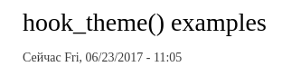
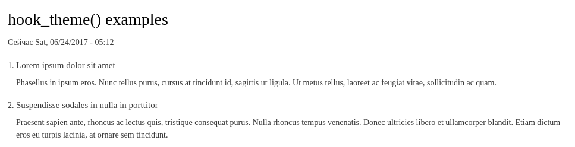
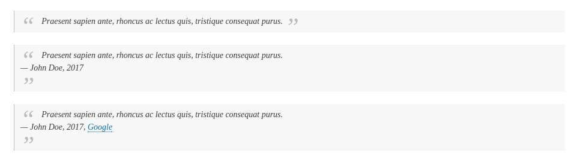
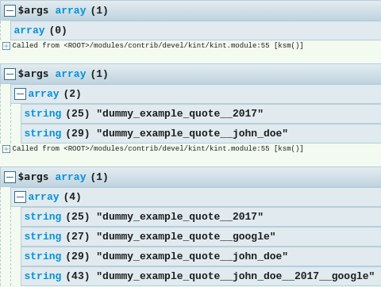
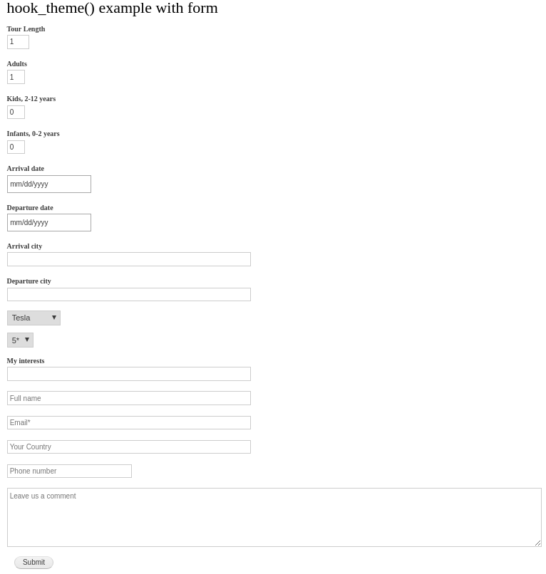
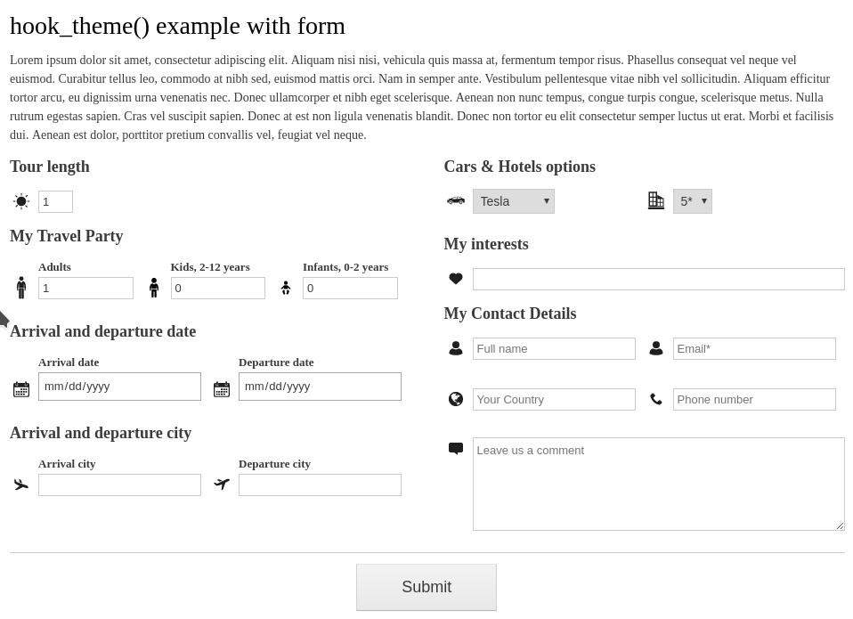

Что-то решил рассмотреть hook_theme(), так как быстрый гугл ничего на русском особо не выдал, в основном легкие заметки, а я про него еще со времен D7 хотел написать и забыл, но раз уже 8-ка в самом разгаре, разумеется, гайд будет под 8-ку. Сразу скажу, в с 8-ке в целом осталось как в 7-ке, но с легкими изменениями. Удален `template_process_HOOK()`, удалена функция `theme()`, theme hook suggestion объявляются теперь через `hook_theme_suggestions_HOOK()` (см. пример 3).

## Что за хук и где используется

`hook_theme()` один из самых фундаментальных хуков в Drupal, как в 7-ке, так и в 8-ке. Всё что вы видите на страницах, так или иначе проходит через данный хук. Все темплейты которые вы создаете или имеете в своей теме — это всё его работа. Он намного глобальнее чем просто хук. Он за собой тащит кучу совершенно новых. Например, `hook_preprocess_HOOK()` напрямую связан с `hook_theme()` и без него не представляет никакой ценности. Вы наверняка использовали его множество раз, например `hook_preprocess_html()`, `hook_preprocess_page()`, `hook_preprocess_node()` и т.д., и если не копали глубже, возможно, даже не подозревали, что это всё от `hook_theme()` и без него их бы не было. Даже создавая любой темплейт в теме, будь то `page.html.twig` или `node.html.twig`, или даже `node--1.html.twig` — всё это делает данный хук. Следовательно поняв данный хук, вы откроете целый пласт возможностей в Drupal касающийся темизации и вывода данных. Ведь данный хук можно использовать под огромный спектр задач, он вас практически никак не ограничивает.

## Разбор хука

Данный хук работает как в модулях так и в темах. Но не забывайте, объявив данный хук в теме, он будет доступен для использования только на тех страницах,  где используется данная тема. Больше никакой разницы нет. Соответственно объявляется данный хук по старинке в виде функции в `MYMODULE.module` — для модулей, и `THEMENAME.theme` — для тем.

Пример данного хука, пока что без практической ценности:

~~~php {"header":"Пример hook_theme()"}
/**
 * Implements hook_theme().
 */
function MYMODULE_theme($existing, $type, $theme, $path) {
  return [
    'my_template_first' => array(
      'variables' => [
        'example' => NULL,
      ],
    ),
    'my_template_second' => array(
      'render element' => 'element',
    ),
  ];
}
~~~

В примере выше мы зарегистрировали 2 "хука темы", по сути, это минимум, который достаточен. Эти два варианта кардинально отличаются друг от друга.

Данный хук должен возвращать массив, ключи в первом уровне которого будут становиться "хуками темы" (theme hooks). Возвращаясь к упоминаниям выше, в хук `hook_preprocess_HOOK()` вместо слова `HOOK` подставляется именно эти ключи, данные которых вы хотите модифицировать. Следовательно `hook_preprocess_page()` — это работа с данными `page` хука темы который объявлен также как и выше. Ради интереса вы можете посмотреть как это обьявлено в ядре, почти все самое ходовое находится в файле `core/includes/theme.inc` на строке 1719 в функции `drupal_common_theme()`. Это не прямой вызов `hook_theme()`, а функция, которая вызывается в нужный момент в `hook_theme()`, но структура аналогичная.

С ключами, думаю, более-менее должно быть ясно. Далее, данный ключ должен содержать ещё один массив, в котором находятся параметры, как например, из примера выше `variables` и `render array`. И тут важно запомнить, обьявляя хук темы — он может содержать только один из данных "параметров", то есть либо `variables`, либо `render array`, так как они используются для совершенно разных задач, хотя всё остальное работает идентично и остальные параметры и поведение применимы к обоим. Теперь самое время рассмотреть все возможные данные:

- `variables`: Используется совместно с `#theme` (далее вы поймете, если не сталкивались). Грубо говоря, данный theme hook будет использоваться для собственного темплейта под какую-то задачу. Соответственно это массив, он может быть как пустым, так и содержать все возможные переменные, которые необходимы темплейту с их значениями по умолчанию. Допустим, вы хотите сделать темплейт файл, который принимает какие-то данные, так вот тут вы можете указать все данные которые нужны с их значениями по умолчанию, если же вы не знаете какие значения нужны по умолчанию или не нужны вообще, то принято использовать NULL. Более подробно об этом всем будет разжевано дальше.
- `render element`: Если указан данный ключ, то его значение (строка) — это лишь название переменной где будет храниться render array с данными. Очень часто используется просто `element`, но, например, в `page` используется одноименный рендер элемент. Это как раз тот самый что вы используете в `page.html.twig`, например `{{ page.content }}`. Вот `page` и есть тот самый `render element`. Также он используется для объявления темплейтов форм, следовательно в данном случае значение ставится `form`, так как в эту переменную будет передан render array формы. Данный вид theme hook можно вызывать *только* как render array (`'#type' => 'theme_hook_name'`). Без необходимости не используйте, а предпочтите `variables`, если вам не нужно работать с render array в данном theme hook. Когда он вам потребуется Drupal сам скажет, он будет ругаться что не указан `render element`, вот тогда вы и поймете что пора переводить theme hook с переменных на него. Резюмирую случаи где только он и нужен: темизации форм, темизация render array элементов, в том числе при объявлении своих.
- `file`: Это название файла, который будет загружен если данный theme hook был вызван. Например вы туда можете положить всю необходимую логику для данного theme hook, чтобы он не грузился без причины. Порой данные хуки сопроваждаются очень приличным кол-вом кода, так как имеют очень большую гибкость, да банально — это организация кода. 
- `path`: По умолчанию все темплейты ищутся в папке `/templates` модуля\темы, а `file` в корне папки модуля\темы, вы можете указать прямой путь до папки где искать `template` и `file`. Путь должен быть от корня ядра Drupal, а не модуля. Для удобства в `hook_theme()` передается аргумент `$path` содержащий путь до текущего модуля\темы и вы можете использовать его в своих целях, например: `$path . '/theme'`. **Важно**: указав данное значение, `template` и `file` должны находиться по этому пути и нигде иначе, т.е. file в корне модуля\темы уже не будет работать.
- `template`: Название темплейт файла, который будет использоваться для рендера. Все данные будут переданы в данный темплейт и его результат уже будет использован для вывода. Указывать расширение здесь не нужно, оно будет автоматически добавлено в соответствии с тем движком, который используется для рендера. Например из коробки Twig, и соответственно для темплейта `node.html.twig` тут нужно указать просто `node`.  Название *не должно* содержать нижних подчеркиваний, только тире. Если данное значение не установлено вами, то оно будет установлено автоматически по той же самой логике. Название `theme hook` будет установлено как значение с заменой нижних подчеркиваний на тире. **Важно**: темплейт файлы по умолчанию ищутся в `/templates`, либо в той папке, которая указана в `path`, но *в обоих случаях* они должны находиться в корне данной папки, никаких вложений, но (!) если вы делаете переопределение темплейта theme hook в активной теме, там можно ложить в `/templates` со вложениями.
- `base hook`:  Базовое название для theme hook если планируется использовать theme hook suggestions (это для подобных случаев: node, node--1, node--news, node--news--1 — здесь везде базово node). Не имеет смысла задавать если идентично основному theme hook.
- `pattern`:  Используется для `node, node--1, node--news, node--news--1` — в данном значении указывается лишь начальный паттерн для будущих suggestions. Для определения динамической части используется `__` (двойное нижнее подчеркивание). Например, чтобы добавить `my_template_first`, из примера выше, поддержку паттернов, достаточно указать `my_template_first__`. Все возможные комбинации и, непосредственно, сам выбор какой использовать производится дальше. На данном этапе указываются не все паттерны, а лишь откуда начинается динамическая часть.
- `preprocess functions`: Здесь можно указать функции которые будут отвечать за препроцессинг данных. Использовать надо лишь когда реально требуется, а это, скорее всего, не случится, так как дефолтные значения покрывают все запросы. Для модулей это `template_preprocess_HOOK()`. Не путайте с `hook_preprocess_HOOK()`, работают они абсолютно идентично, но `template_preprocess_HOOK()` разрешно использовать только в модуле который определил данный theme hook, и он вызывается раньше `hook_preprocess_HOOK()`. Об этом позже.
- `override preprocess functions`: Значение `TRUE` в данном параметре полностью отключает все препроцессы кроме оригинального от модуля\темы который объявил данный theme hook. Это может пригодиться когда вы не хотите давать возможность внедриться в подготовку сторонним модулям. Как правило не нужно, только в экзотических случаях.
- `type`: Здесь указывается кем объявлен данный theme hook. Может быть `module`, `theme` или `theme_engine`. Крайне не рекомендую использовать, ибо толку мало, устанавливается автоматически.
- `theme path`: Путь до темы или модуля который регистрирует theme hook. Аналогично параметру выше, нет никакого практического примеренения заменять то что устанавливается автоматически.

Это все возможные параметры. Как вы видите, часть из них вообще можно забыть моментально, такие как последние два, некоторые из них, скорее всего, никогда не пригодятся, как `preprocess functions` и  `override preprocess functions`, а параметры как `pattern` и `base hook` — ситуативные. Остается всего лишь два базовых которые определяют поведение — `variables` и `render element`,  а также `file`, `path`, `template` — которые позволят поменять, в случае необходимости местоположение темплейтов, добавить отдельный файл для препроцесса и дать иное название темплейту.

Например, я, на проектах, если объявляю данный хук *в теме*, то `file` указываю `themename.theme.inc`, а также меняю `path` на `$path . '/templates/theme` чтобы все кастомные темплейты находились в отдельной папке и было сразу видно что они кастомные. Так как я написал выше, темплейты объявленные модулем\темой не могут иметь вложение если они их собственные. Тут я не могу сказать что это best practice, просто пока лучше вариант не нашел. Хранить все кучей в `/templates` мне не нравится, я люблю когда все лежит на своих местах, ибо при увеличении числа темплейтов начинается бардак. Будет интересно послушать в комментариях кто где хранит свои кастомные темплейты.

## Примеры вызовов theme hooks

Сразу рассмотрим как они вызываются, а всё остальное уже разберем непосредственно на примерах.

~~~php
// Вызов theme hook обьявленный через variables.
$result_array = [
  '#theme' => 'my_template_first',
];
// В случае если вам нужно самому отрендерить — рендерим, зачастую достаточно
// просто вернуть массив и Drupal отрендерит самостоятельно. Тут всё зависит
// от того где вызывается код.
$result = \Drupal::service('renderer')->render($result_array);
// Аналогичный пример но с передачей переменной. В данном случае переменные
// передаются как часть render array, с добавлением # к названию переменной.
$result_array = [
  '#theme' => 'my_template_first',
  '#example' => 'Custom value',
];

// А теперь рассмотрим вызов для render element. Переменные передаются
// аналогично примеру выше, и аналогично, этот рендер массив либо
// возвращается, либо рендерится самостоятельно. Всё от ситуации.
// Но учтите, render element должен быть зарегистрирован в качестве элемента,
// просто так вызывать по названию theme hook нельзя. Он не самодостаточный.
$result = [
  '#type' => 'my_template_second',
];
~~~

Теперь можно переходить к примерам и практике, так как объяснять данный хук проще всего именно на практике, в теории это полная каша.

Для того чтобы увидеть результаты примеров, их куда-то нужно выводить. Поэтому для всех примеров я создам страницу `/hook-theme` где и будут выводиться все примеры. Вы можете написать сами или использовать свои заготовки, или же просто уже [скачать готовую заготовку](/sites/default/files/blog/attachment/2017/6/23/dummy_start.tar.gz) где только данный роут. _Мне казалось что у меня даже есть материал про Routing API, но даже нагуглить не смог, так что, пометил что надо расковырять и его ;)_

## Пример №1 — простое объявление theme hook

В данном примере мы объявим обычный theme hook который будет выводить дату. Не совсем тот пример ради которого следует объявлять theme hook, но нам лишь для понимания как оно работает. Далее по коду, подарузмевается что модуль имеет название `dummy` — учитывайте это если вы пишете в своем модуле.

Первым делом нам нужно зарегистрировать `theme hook`. У нас нет вообще ничего, поэтому нужно создать `.module` файл, если его ещё нет, и написать свой `hook_theme`. В данном примере нам особо ничего не нужно, это будет просто очень минимальный хук.

~~~php {"header":"dummy.module"}
/**
 * Implements hook_theme().
 */
function dummy_theme($existing, $type, $theme, $path) {
  return [
    'dummy_example_first' => [
      'variables' => [],
    ],
  ];
}
~~~

Это очень минимальный набор для варианта с `variables`. Из примера выше, theme hook это `dummy_example_first`. Переменных мы никаких не требуем, поэтому значение оставляем пустым массивом, но никаких `FALSE` или пустых строк тут не должно быть.

Сбросив кэш, данный theme hook уже станет доступен. Но от него никакой пользы. Давайте сразу создадим для него препроцесс, и добавим туда текущую дату и время. Препроцессы позволяют нам работать с данными до тех пор, пока они не попадут на рендер движку для темизации, по умолчанию в 8-ке — Twig. Мы можем меняеть данные, добавлять, удалять, в общем делать все что хотим. Для этого существует два основных хука:

1. `template_preprocess_HOOK()` — в случае если theme hook объявлен в модуле, `THEMENAME_preprocess_HOOK()` — если объявлен в теме. Данный хук вызывается всегда самым первым, а уже затем отдается остальным модулям и темам на обработку. Здесь вы закладываете свои базовые переменные и данные, так как вы владелец данного theme hook. **Обратите внимание**, слово `template` в первом примере, *не заменяется* на название модуля, оно прямо так и пишется.
2. `hook_preprocess_HOOK()` — уже знакомый для многих хук. Он используется сторонними модулями и темами чтобы выполнять аналогичные действия что и хук выше. Аналогично как вы хукаете page или node, чтобы добавить своих классов, библиотек или что-то поправить или убрать ненужное.

Резюмируя и подводя короткий итог: 1-ый вариант используется если theme hook объявлен в этом же модуле\теме, 2-ой для всех остальных.

Слово `HOOK` (именно то что большими буквами) в хуке заменяется на название theme hook который нужно "обработать". В данные хуки передается всего 1 аргумент `&$variables`, кто-то сокращенно пишет `&$vars`. Лично я придерживаюсь полного варианта как в ядре, но это дело вкуса. Самое важное тут, это то, что данный аргумент *всегда* является переменной-ссылкой. Никаких `return` данный хук не должен вызывать, вы должны менять данные внутри `&$variables`. Это массив, а ключи первого уровня данной переменной будут становиться переменной в темплейте. Следовательно, `$variables['foo'] = 'bar'` создаст для темплейта переменную foo со значением bar, а затем вы сможете использовать её в темплейте, а можете и не использовать.

Переходим к созданию данного хука. Так как мы не указали для `dummy_example_first` значение `file` то хук остается писать исключительно в `dummy.module`. Так как мы хотим выводить дату, то нам потребуется её получать. В темплейте такого делать нельзя (upd, меня поправили что можно через `date` фильтр Twig), именно для этого есть препроцесс хуки, которые позвляют всю логику вынести из темплейтов в соответствующие функции.

~~~php {"header":"dummy.module"}
/**
 * Implements template_preprocess_HOOK().
 * Обработчик переменных для первого примера.
 */
function template_preprocess_dummy_example_first(&$variables) {
  $date_formatter = \Drupal::service('date.formatter');
  $variables['date'] = $date_formatter->format(time());
}
~~~

Выше мы задействовали [сервис](/blog/150) для форматирования времени и передали в него текущее время на момент генерации темплейта. Затем мы положили значение в `$variables['date']`, из чего следует, что значение (дата) будет находится в переменной `date` и мы сможем вызвать её в шаблоне сколько угодно раз.

Теперь самое время подготовить шаблон. Так как мы не указали `template` то название theme hook автоматически трансфомрируется в темплейт, где нижнее подчеркивание заменяется на тире. В нашем примере получается следующий результат: `dummy-example-first`. Из коробки движок для темизаций используется Twig, его темплейты должны иметь расширение `.html.twig`. Это значит что мы должны создать файл `dummy-example-first.html.twig`. Опять, мы не указали `path` и данный файл будет искаться по дефолтному пути от корня модуля\темы в папке `/templates`. Собственно создаем данную папку, а в ней файл со следующим содержимым:

~~~twig {"header":"templates/dummy-example-first.html.twig"}

  Сейчас {{ date }}

~~~

Внутри темплейта вы ограничены только вашими потребностями. Единственное что стоит запомнить — никакой логики здесь быть не должно, она вся должна быть в препроцесс хуке. Но всякие циклы и условия тут, конечно же, разрешены. В D7 тут можно было в прямом смысле, если цензурно, гадить, и люди знатно гадили, но твиг это хорошенько режет и всю динамику и гибкие данные вам просто придется добавлять через preprocess. Поэтому особо тут нечего добавить.

Теперь нам нужно добавить вывод данного примера на страницу `/theme-hook`. Нам ведь нужно как-то посмотреть результат. Для этого заходим в контроллер для данного пути и добавляем его в виде render array, и возвращаем результат.

~~~php {"header":"src/Controller/HookThemeExamples.php"}
/**
 * {@inheritdoc}
 */
public function page() {
  return [
    '#theme' => 'dummy_example_first',
  ];
}
~~~

Сбрасываем кэш, заходим на страницу и вы должны увидеть свой результат:

## Пример 2 — добавляем и используем переменные

В данном примере мы добавим возможность передавать значения в наш theme hook, а следовательно и темплейт. Допустим мы будем выводить список, а выбор, маркированный или нумерованный мы сделаем в переменной, также мы в переменной будем передавать массив с данными для списка, а каждый элемент может содержать заголовок и текст, при этом оба будут не обязательными. Мы также сделаем так, чтобы если значения не были переданы, мы не будем возвращать ничего. Поехали!

Первым делом нужно добавить наш theme hook в наш `hook_theme()`. На этот раз, мы препроцесс функцию вынесем за пределы `.module` файла, а от первого примера там и оставим, хотя и его можно туда будет перенести, но как пример я его трогать не буду. 

~~~php {"header":"dummy.module"}
/**
 * Implements hook_theme().
 */
function dummy_theme($existing, $type, $theme, $path) {
  return [
    'dummy_example_first' => [
      'variables' => [],
    ],
    // Данный пример будет использоваться для вывода содержимого в виде списка,
    // а его препрцоесс мы венесем в отдельный файл.
    'dummy_example_second' => [
      'variables' => [
        'list_type' => 'ul',
        'items' => NULL,
      ],
      'file' => 'dummy.theme.inc',
    ]
  ];
}
~~~

Как вы можете заметить, мы обьявили две переменные которые мы хотим принимать: `list_type` для указания какой тип списка будет использоваться, по умолчанию установили в `ul`, а также `items`, в который можно передать массив с данными. Данные будут массивом, каждый элемент также будет являться массивом и может содержать два ключа `title` и `text`, которые мы будем использовать. 

Вы должны понимать, что передавать то можно сколько угодно переменных, и какие угодно, это не значит что раз мы объявили эти две переменные, другие не будут приниматься, нет, будут, просто это значит, что у нас под них просто нет логики, мы их не ожидаем там. И то что я выше написал, что items будет массивом состоящим из других массивов с ключами `title` и `text`, это лишь мое предпочтение и я исходя из этого дальше будут писать препроцесс и темплейт файл. Это формальность которую вы сами задаете и пишете уже под это код.

Надеюсь с переменными всё понятно, поэтому нам нужно создать в корне модуля файл `dummy.theme.inc`, в котором будет наш препроцесс для  темплейта. Файл, я думаю создадите сами, а вот препроцесс я немного распишу. На самом деле, в такой простой задачке препроцесс по сути не нужен, если будет соблюдаться четкая структура переменных выше, то никакой обработки не нужно. Передадут верно — выведется, нет — не выведется, это всё уже отрегулируется на уровне темплейта. Но что-то же для примера в препроцесс засунуть нужно, и мы сделаем проверку переменной `list_type`, чтобы она могла быть только `ul` или `ol`, если же в неё передадут что-то иное, мы сменим на значение по умолчанию `ul`. Собственно, вот такой препрцоесс:

~~~php {"header":"dummy.theme.inc"}
/**
 * Implements template_preprocess_HOOK().
 */
function template_preprocess_dummy_example_second(&$variables) {
  // Для удобства записываю значение переменной list_type в локальную переменную
  // в виде ссылки.
  $list_type = &$variables['list_type'];
  // Задаем список допустимых типов.
  $allowed_list_types = ['ol', 'ul'];
  // Если передано значение не из массива выше, мы устанавливаем значение по
  // умолчанию.
  if (!in_array($list_type, $allowed_list_types)) {
    $list_type = 'ul';
  }
}
~~~

Как вы видите, переменные, которые мы объявили, да и вообще, которые будут передаваться, находятся по соответствующим ключам. Мы, по сути, передаем всегда массив и с ним работаем. Просто в темплейте, ключи превратяться в переменные. Например, мы не работали тут с `items`, но она там есть, нам просто нет смысла с ней работать, но она также дальше передастся в темплейт. В препроцессах мы работаем с теми данными которые нам не нужны в сыром виде или же требуют проверки как тип списка.

Далее создаем темплейт и выводим все нужные нам переменные.

~~~html {"header":"templates/dummy-example-second.html.twig"}
{#
/**
 * Тут мы проверяем, есть ли данные в переменной items. Если массив пустой или
 * вовсе не был передан, то мы ничего рендерить не будем. Соответственно наш
 * theme hook ничего не вернет и на странице ничего не будет.
 */
#}

  {# Делаем обертку для списка подставляя значение переменной в тег. #}
  <{{ list_type }}>
    {# Выводим наши данные из items. #}
    
      <li>
        
          <h3 class="title">{{ item.title }}</h3>
        
        
          
{{ item.text }}

        
      </li>
    
  </{{ list_type }}>

~~~

Теперь, когда мы имеем все необходимое, осталось только вывести на нашей тестовой странице. Если вы не знаете, то render array могут быть как многоуровневые, так и быть в одном большом массиве, как у форм, поэтому мы теперь примеры будем помещать в массив с render array, а затем возвращать на рендер странице.

~~~php {"header":"src/Controller/HookThemeExamples.php"}
/**
 * {@inheritdoc}
 */
public function page() {
  $results = [];
  // Пример №1.
  $results[] = [
    '#theme' => 'dummy_example_first',
  ];
  // Пример №2.
  $results[] = [
    '#theme' => 'dummy_example_second',
    '#list_type' => 'ol',
    '#items' => [
      [
        'title' => 'Lorem ipsum dolor sit amet',
        'text' => 'Phasellus in ipsum eros. Nunc tellus purus, cursus at tincidunt id, sagittis ut ligula. Ut metus tellus, laoreet ac feugiat vitae, sollicitudin ac quam.',
      ],
      [
        'title' => 'Suspendisse sodales in nulla in porttitor',
        'text' => 'Praesent sapien ante, rhoncus ac lectus quis, tristique consequat purus. Nulla rhoncus tempus venenatis. Donec ultricies libero et ullamcorper blandit. Etiam dictum eros eu turpis lacinia, at ornare sem tincidunt.'
      ]
    ],
  ];
  return $results;
}
~~~

Не забываем сбросить кэш, и обновляем нашу страницу с примерами.

Стоит упомнять что в препроцесс передаются не только ваши переменные, также туда добавляются некоторые системные, вы также можете их использовать. Но есть три переменных которые имеют особенное поведение.

Если вы для своего theme hook укажите что хотите получать переменные `attributes`, `title_attributes` или `content_attributes` учтите их поведение. Они должны быть либо NULL, либо массивом, как пустым, так и с аттрибутами, либо экземпляром объекта Attribute(). В случае если это экземпляр объекта, ядро просто пройдет мимо, если это это не пустой массив, он сам создаст из массива новый экземпляр объекта Attribute(). Например, `['class' => 'test test2', 'id' => 'my-id']` будет равносильно: `$atrriute->addClass('test test2');`, `$attribute->setAttribute('id', 'my-id');`. Проще всего передавать туда обычный массив, а всё остальное сделает ядро. 

Данное поведение заработает только если вы укажете эти переменные в своём theme_hook, в остальных случаях эти значения хоть и будут в `$variables`, но они всегда будут пустыми, даже если вы туда что-то передавали. Соответствено и использоавть данные переменные для других целей не получится, ядро попробует скормить ваши данные этому объекту, он, разумеется, не поймет что ему дали и выдаст эксепшн.

Там есть другие переменные типа `is_admin`, `user` и т.д., можете сами их посмотреть. Они могут вам немного помочь. Таких поведений как у трех выше там нет.

## Пример №3 — паттерны

Паттерны позволяют вам делать переопределение темплейтов под определенные задачи. Самые очевидные примеры которые дадут понять о чем я: `block.html.twig`, `block--region-left.html.twig`, `block--block--1.html.twig` или `node.html.twig`, `node--news.html.twig`, `node--1.html.twig`.

Данный пример будет именно про то, как создавать такую поддержку переопределения темплейта, как регистрируются такие варианты и как они определяются.

Всё это реализуется при помощи `pattern` параметра для `theme hook` и, как правило, в связке с какими-то перемеными из `variables`, можно и без них , но вы будете очень сильно ограничены, так как данных для таких наборов будет мало.

Первым делом нам нужно создать пример, который бы можно было как-то вариативно менять. Я опять ничего хорошего не придумал, и поэтому будет следующее: мы объявим theme hook для цитат, самых обычных цитат. Он будет принимать непосредственно цитату, автора цитаты, год цитаты, название источника цитаты, а также ссылку на источник цитаты.

Мы сделаем возможность чтобы темплейты переопределялись по всем параметрам, так будет лучше видно как это работает. Начнем с объявления theme hook в `hook_theme()` (старые примеры опущены, он просто добавляется ниже):

~~~php {"header":"dummy.module"}
'dummy_example_quote' => [
  'variables' => [
    'quote' => NULL,
    'author' => NULL,
    'year' => NULL,
    'source_title' => NULL,
    'source_url' => NULL,
  ],
  'file' => 'dummy.theme.inc',
  'pattern' => 'dummy_example_quote__',
],
~~~

Здесь стоит остановиться немного лишь на `pattern`, я просто напоминаю, что тут указывается базовая "регулярка" для будущих паттернов для всех темплейтов. Нижнее подчеркивание в названии темплейтов будет заменяться автоматически на тире. Следовательно, он будет искать темплейты с `dummy-example-quote--SOMETHING.html.twig`, где SOMETHING мы будем указывать сами, если же ни один темплейт по такому паттерну подходящий под конкретный вызов не попадается, он применит стандартный `dummy-example-quote.html.twig`. Базовый темплейт в любом случае должен обязательно быть объявлен.

Пока что с паттернами мы отойдем в сторонку и доделаем до конца. Сначала мы сделаем preprocess для нашего темплейта для того чтобы добавить новую переменную — ссылку на источник. В нашем случае мы получаем два параметра для источника, заголовок и ссылку. Если указана только ссылка — мы не будем ничего выводить, если же указан один заголовок — мы будем выводить лишь его, если же указана и ссылка и заголовок, то будем в препроцессе генерировать нужную нам ссылку, всё это будет в одной переменной чтобы было проще выводить и проверять. А также полноценно генерировать содержимое для футера цитаты, чтобы все разделить через запятые.

~~~php {"header":"dummy.theme.inc"}
// Добавьте вверху файла
use Drupal\Core\Link;
use Drupal\Core\Url;

/**
 * Implements template_preprocess_HOOK().
 */
function template_preprocess_dummy_example_quote(&$variables) {
  // Устанавливаем значение по умолчанию для новой переменной.
  $variables['source'] = NULL;
  // Сразу же переношу в локальную переменную-ссылку для дальнейшего удобства.
  $source = &$variables['source'];

  // Если переданы оба значения, то используем их для генерации ссылки.
  if ($variables['source_title'] && $variables['source_url']) {
    // Генерируем объект URL.
    $url = Url::fromUri($variables['source_url'], [
      'attributes' => [
        'target' => '_blank',
        'rel' => 'nofollow',
      ]
    ]);
    // Генерируем ссылку.
    $source = Link::fromTextAndUrl($variables['source_title'], $url)->toString();
  }
  elseif ($variables['source_title']) {
    $source = $variables['source_title'];
  }

  // Добавляем все объявленные переменные в один общий массив.
  $footer = [];
  !$variables['author'] ?: $footer[] = $variables['author'];
  !$variables['year'] ?: $footer[] = $variables['year'];
  !$source ?: $footer[] = $source;
  // И соединяем их в одну строку если там что-то есть.
  $variables['footer'] = !empty($footer) ? implode(', ', $footer) : FALSE;
}
~~~

Создаем дефолтный темплейт файл. Он будем использоваться по умолчанию если в дальнейшем паттерны не найдут переопределения. И хорошая база для копирования для будущих переопределений.

~~~html {"header":"templates/dummy-example-quote.html.twig"}

<blockquote>
  
{{ quote }}

  
    <footer>
      — {{ footer|raw }}
    </footer>
  
</blockquote>

~~~

И последнее что нам остается, набросать сразу несколько различных примеров чтобы проверить как поведение, так и в дальнейшем задействовать для паттернов.

~~~php {"header":"src/Controller/HookThemeExamples.php"}
// Примеры для №3
$results[] = [
  '#theme' => 'dummy_example_quote',
  '#quote' => 'Praesent sapien ante, rhoncus ac lectus quis, tristique consequat purus.',
];
$results[] = [
  '#theme' => 'dummy_example_quote',
  '#quote' => 'Praesent sapien ante, rhoncus ac lectus quis, tristique consequat purus.',
  '#author' => 'John Doe',
  '#year' => 2017,
];
$results[] = [
  '#theme' => 'dummy_example_quote',
  '#quote' => 'Praesent sapien ante, rhoncus ac lectus quis, tristique consequat purus.',
  '#author' => 'John Doe',
  '#year' => 2017,
  '#source_title' => 'Google',
  '#source_url' => 'https://google.com/',
];
~~~

Не забываем сбросить кэш, и смотрим на странице результат!

Теперь, когда мы видим что всё в порядке, мы можем заняться паттернами. Паттерны объявляются в `hook_theme_suggestions_HOOK()`. Данный хук можно объявлять в файле указанном в `file`. В него передается массив `$variables` со всеми переменными объявленными в `variables` theme hook, а также их значениями. Также туда передается дополнительная переменная `theme_hook_original` — она содержит название theme hook который это объявил. Сам хук должен возвращать массив со всеми возможными вариантами переопределения. Вызывается он **до** всех preprocess, так что там сырые данные. Например на блоках:

- `block--MODULE--DELTA`
- `block--MODULE`
- `block--DELTA`

Первое на что следует обратить внимание, базовое название `block` не указывается — оно вызывается автоматически если ни один из этого списка не сработает. Второе, что следует понимать, он ищет темплейты сверху внизу, это значит у `block--MODULE--DELTA` самый высокий приоритет, и если найден темплейт с таким паттерном, то он применится и дальше поиск остановится. **Важно** ищет он их сверху вниз, но объявляются они в обработном порядке. Т.е. первым в массиве там идет `block--DELTA`, а  в конце `block--MODULE--DELTA`. Т.е. где так расписаны паттерны, это для удобства, в коде же чутка наоборот.

Вместо MODULE и DELTA вы, подставляете значения переменых на основе тех что имеются на данный момент генерации. Т.е. паттерны будут становиться динамическими, а не статическими. И после того как найден подходящий темплейт по паттерну, ему отдадутся все переменные и отправят на рендер как и с оригиальным темплейтом. А что там будет делать юзер с ними, это уже нас не касается.

Вернемся к нашему примеру, давайте сделаем такие варианты паттернов:

- `dummy_example_quote--AUTHOR--YEAR--SOURCE` — сразу на трех значениях, чтобы показать что таких составных может быть неограниченное кол-во.
- `dummy_example_quote--AUTHOR` — темплейт под конкретного автора.
- `dummy_example_quote--SOURCE` — темплейт под источник.
- `dummy_example_quote--YEAR` — темплейт под конкретный год.

Собственно, давайте это объявим прямо в коде, не забывая, что паттерны сверху в таком порядке для удобства восприятия, а объявляются в обратном порядке!

~~~php {"header":"dummy.theme.inc"}
/**
 * Implements hook_theme_suggestions_HOOK().
 */
function dummy_theme_suggestions_dummy_example_quote(array $variables) {
  $suggestions = [];
  // Подключаем транслитерацию для будущих изменений.
  $transliteration = \Drupal::transliteration();
  // Сначала переносим значения в локальные переменные для удобства.
  $author = $variables['author'];
  $year = $variables['year'];
  $source = $variables['source_title'];
  // Затем надо поработать с переменными.
  // Первым делом подготовим имя автора для использования в названии темплейта.
  // Оно, должно быть из латинских символов. А что если передали кириллицу?
  //  Мы должны это предусмотреть.
  if ($author) {
    // Первым делаем транслетирируем имя.
    $author = $transliteration->transliterate($author);
    // Переводм в нижний регистр.
    $author = strtolower($author);
    // Заменяем пробелы на нижнее подчеркивание, тире использовать НЕЛЬЗЯ.
    // В конечном итоге, например Иванов Иван будет ivanov_ivan, John Doe станет
    // john_doe.
    $author = str_replace(' ', '_', $author);
  }
  // Год нас не интересует, а вот название источника может быть длинным и опять
  // же, на разных языках. Проделываем аналогично с именем автора.
  if ($source) {
    $source = $transliteration->transliterate($source);
    $source = strtolower($source);
    $source = str_replace(' ', '_', $source);
  }
  // Добавляем паттерн для года.
  if ($year) {
    $suggestions[] = 'dummy_example_quote__' . $year;
  }
  // Для источника.
  if ($source) {
    $suggestions[] = 'dummy_example_quote__' . $source;
  }
  // Добавляем паттерн для автора.
  if ($author) {
    $suggestions[] = 'dummy_example_quote__' . $author;
  }
  // Ели все переменные заданы регистрируем самый гибкий паттерн.
  if ($author && $year && $source) {
    $suggestions[] = 'dummy_example_quote__' . $author . '__' . $year . '__' . $source;
  }

  return $suggestions;
}
~~~

Сбрасываем кэш и готово!

Помните те три цитаты для примера выше? Так вот, если вывести для них suggestions мы увидим следующую картинку:

Первая цитата не получила them hook suggestions, потому что там не передается ни автор, ни название источника, ни год.

У второй цитаты нет лишь источника, поэтому там уже два theme hook suggestions.

У третей цитаты есть все, поэтому там все возможные варианты переопределения.

Теперь обьясню как это использовать. Во-первых, не забывайте что массив с theme hook suggestions генерируется в ином порядке от того что мы написали и следовательно, читать его нужно соответственно. Он пойдет снизу вверх. Получается для третей цитаты он попытается найти `dummy_example_quote__john_doe__2017__google`, если переопределения не найдется, пойдет искать `dummy_example_quote__john_doe` и т.д. Что вам сделать чтобы переопределить темплейт для цитат от John Doe, 2017 года и источника Google? Достаточно создать соответствующий файл, заменив все нижнии подчеркивания на тире, а также добавить расширение движка темизации. Получим следующее: `dummy-example-quote--john-doe--2017--google.html.twig`,

**Важно!** Данные темплейты (которые переопределяют) ищутся исключительно в активной теме, в папке `/templates` и всех её подпапках. То есть модуль, объявивший theme hook не может использовать эти переопределения, они не будут работать. Также эти theme suggestions можно вызывать программно прямо в render array: `['theme' => 'dummy_example_quote__2017']`. Не знаю какая цель для этого, видимо чтобы использовать определенный темплейт в определенном месте, т.е. принудительно вызывать рендер темплейта под год, когда есть темплейт для источника, например.

### Дополнение к примеру №3.

Вы также можете вызывать\объявлять theme hook suggestion без хука выше, прямо из render array, но действовать они будут икслючительно в данном вызове. Пример:

~~~php
$render_array = [
  '#theme' => [
    'dummy_example_quoute__john_die__2017__google',
    'dummy_example_quoute__johnn_doe',
    'dummy_example_quoute__google',
    'dummy_example_quoute__2017',
    'dummy_example_quoute',
  ],
];
~~~

Обратите внимание что тут они обьявляются уже сверху вниз. Вы также выше можете сгенерировать массив и передать его в '#theme`. Но лучше всего обьявлять это через хук. Либо делать соответствующую функцию для вызова, чтобы другие модули также могли вызывать с suggestions. Используйте этот вариант когда реально подходит под задачу.

На этом примеры для theme hook через `variables` заканчиваются и мы переходим к render element, так как больше тут рассказывать вообще нечего.

## Пример №4 — темизируем форму при помощи render element

Конкретно на Render Element мы останавливаться не будем, так как это отдельная тема и я её как-нибудь раскрою отдельно, она использует `hook_theme()`, но это связка, чем прямое использование, поэтому раскрывать тут это смысла нет, будет вообще каша.

Мы рассмотрим как можно использовать `hook_theme()` в связке с `render element` для темизации форм на сайте. Абсолютно все формы на сайте, не важно как созданы они, программно, в админке, не важно и кем они созданы, ядром, сторонним модулем — все формы на сайте пробуют вызвать theme hook одноименный своему form_id, и если такой найден, передают данные в него на рендер, а в `render element` нужно установить `form`, и в данной переменной окажется вся форма. Ядро просто перед самым рендером формы добавляет `'#theme' => 'form_id'`, а найдется такой theme hook или нет, дело ваше. Это очень полезно знать если вы хотите очень гибко оформить какую-либо форму.

Для примера я создал большую формочку для того чтобы было нагляднее. Для неё я создал адрес `/hook-theme-form` и собственно там форма выводится. Без лишних подробностей вот все необходимое для копипаста. Так как это я уже расписывал в топике про [Form API](/blog/73) — можете изучить или освежить память, если что-то вызовет трудности при объявлении формы.

~~~php {"header":"src/Form/HookThemeFormExample.php"}
<?php

namespace Drupal\dummy\Form;

use Drupal\Core\Form\FormBase;
use Drupal\Core\Form\FormStateInterface;

/**
 * Class HookThemeFormExample
 *
 * @package Drupal\dummy\Form
 */
class HookThemeFormExample extends FormBase {

  /**
   * {@inheritdoc}
   */
  public function getFormId() {
    // Обратите на это внимание, данное значение будет использовано в качестве
    // theme hook.
    return 'hook_theme_form_example';
  }

  /**
   * {@inheritdoc}.
   */
  public function buildForm(array $form, FormStateInterface $form_state) {
    $form['tour_length'] = [
      '#type' => 'number',
      '#default_value' => 1,
      '#min' => 1,
      '#max' => 30,
    ];

    $form['adults'] = [
      '#type' => 'number',
      '#title' => 'Adults',
      '#default_value' => 1,
      '#min' => 1,
      '#max' => 4,
    ];

    $form['kids'] = [
      '#type' => 'number',
      '#title' => 'Kids, 2-12 years',
      '#default_value' => 0,
      '#min' => 0,
      '#max' => 4,
    ];

    $form['infants'] = [
      '#type' => 'number',
      '#title' => 'Infants, 0-2 years',
      '#default_value' => 0,
      '#min' => 0,
      '#max' => 4,
    ];

    $form['arrival_date'] = [
      '#type' => 'date',
      '#title' => 'Arrival date',
    ];

    $form['departure_date'] = [
      '#type' => 'date',
      '#title' => 'Departure date',
    ];

    $form['arrival_city'] = [
      '#type' => 'textfield',
      '#title' => 'Arrival city',
    ];

    $form['departure_city'] = [
      '#type' => 'textfield',
      '#title' => 'Departure city',
    ];

    $form['car'] = [
      '#type' => 'select',
      '#options' => [
        'Tesla',
        'Mercedes',
        'BMW',
      ],
    ];

    $form['hotel'] = [
      '#type' => 'select',
      '#options' => [
        '5*',
        '4*',
        '3*',
      ],
    ];

    $form['my_interests'] = [
      '#type' => 'textfield',
    ];

    $form['name'] = [
      '#type' => 'textfield',
      '#required' => TRUE,
      '#attributes' => [
        'placeholder' => 'Full name',
      ],
    ];

    $form['email'] = [
      '#type' => 'email',
      '#required' => TRUE,
      '#attributes' => [
        'placeholder' => 'Email*',
      ],
    ];

    $form['country'] = [
      '#type' => 'email',
      '#attributes' => [
        'placeholder' => 'Your Country',
      ],
    ];

    $form['phone'] = [
      '#type' => 'tel',
      '#attributes' => [
        'placeholder' => 'Phone number',
      ],
    ];

    $form['comment'] = [
      '#type' => 'textarea',
      '#attributes' => [
        'placeholder' => 'Leave us a comment',
      ],
    ];

    $form['submit'] = [
      '#type' => 'submit',
      '#value' => 'Submit',
    ];

    return $form;
  }

  /**
   * {@inheritdoc}
   */
  public function submitForm(array &$form, FormStateInterface $form_state) {
    drupal_set_message('Good Job!');
  }

}
~~~

~~~yaml {"header":"dummy.routing.yml"}
dummy.hook_theme_form:
  path: '/hook-theme-form'
  defaults:
    _title: 'hook_theme() example with form'
    _form: '\Drupal\dummy\Form\HookThemeFormExample'
  requirements:
    _permission: 'access content'
~~~

Вот такую формочку мы будем оформлять.

Приступаем. В этом деле самое главное знать form_id  нужной формы. В нашей кастомной он `hook_theme_form_example` — это значит что мы должны объявить одноименный theme hook, чтож, объявляем:

~~~php {"header":"dummy_theme() в dummy.module"}
'hook_theme_form_example' => [
  'render element' => 'form',
  'file' => 'dummy.theme.inc',
],
~~~

Объявлять препроцесс в данном случае — дело ваше, я объявлю. Так как мы объявляем данный theme hook в модуле, а тема по умолчанию используется Bartik — это значит что написать стили для формы без создания темы не получится, а как тогда показать? Я сделаю стили прямо в модуле и буду цеплять их вместе с формой, заодно и вы в готовом модуле увидите полностью оформленную форму и сможете поиграться с ней. Для этого я объявлю библиотеку со стилями. Опять же, если не знакомы или что-то подзабыли, про [Libraries API](/blog/72) я расписывал отдельно.

~~~yaml {"header":"dummy.libraries.yml"}
hook_theme_form.css:
  version: VERSION
  css:
    theme:
      styles/css/styles.css: { }
~~~

А также добавляем библиотеку в  нашу форму. Так как форма наша, мы можем объявить подключение библиотеки прямо в форме, но если форма не ваша, это делается в препроцессе. Cтили относящиеся к определенному theme hook разумнее вынести в его препроцесс, чтобы они не подключались с формой если theme hook не вызван, ведь разметки не будет и соответственно стили не нужны. *Хотя можно подключить прямо в Twig темплейте `{{ attach_library('module/library.name') }}`.*

Стили я сюда тащить не буду. Ибо много, а смысла мало, всё сможете найти в готовом модуле. Да и не про это статья.

Теперь нам нужно создать темплейт для формы. Так как мы не указали параметр `template`, как и ранее, theme hook трансформируется а темплейт. Следовательно, нам нужно создать `hook-theme-form-example.html.twig`. Там будет находиться переменная `form`, которая является render array текущей формы. Там доступны все элементы и мы можем выводить все что нам угодно где угодно. Вы можете просто вывести всю форму `{{ form }}`, но тогда не будет никакого смысла в theme hook. Вы также можете обращаться к элементам формы напрямую: `{{ form.name }}` и это выведет только определенное поле формы, таким образом выводите все поля где и как нужно, а затем оформляете стилями. Так как тут обычный html, можете тащить сюда что хотите, и дополнительные текста, и картинки вставлять. В общем оформлять форму как вам угодно. Можете также добавлять нужные переменные в препроцессе и выводить их точно также как и в обычном theme hook.

Самое важное при темизации формы, это не забыть вывести следующие элементы: `{{ form.form_build_id }}`, `{{ form.form_token }}`, `{{ form.form_id }}` — без них форма не будет работать. Это невидимые элементы, их можно смело выводить как сверху, так и снизу темплейта. Также следует обратить внимание на то, что у нашей формы кнопка субмит определена напрямую `$form['submit']` — значит вывести мы её можем как `{{ form.submit }}`, но у большинства модулей, в особенности из ядра, и вообще так правильнее делать, они находятся в другом массиве `$form['actions']['submit']` — то уже выводить нужно `{{ form.actions.submit }}`. Самый быстрый способ, пробовать вариант с actions, если не появилась, то без этой приставки, если и просто не появилось, то в препроцессе смотрите в `$variables['form']` где там субмит и как он называется. 

Также следует запомнить, что при таком подходе если выводите хоть 1 элемент формы прямым вызовом `{{ form.field_name }}`, то выводя там же `{{ form }}` будет дубль поля. Говоря проще, тут проще и лучше всего делать вывод каждого поля руками, впрочем для этого оно и используется. Так что не забудьте поля!

Вот такой получился у меня темплейт для формы выше:

~~~html {"header":"templates/hook-theme-form-example.html.twig"}
{{ form.form_build_id }}
{{ form.form_token }}
{{ form.form_id }}

  Lorem ipsum dolor sit amet, consectetur adipiscing elit. Aliquam nisi nisi, vehicula quis massa at, fermentum tempor risus. Phasellus consequat vel neque vel euismod. Curabitur tellus leo, commodo at nibh sed, euismod mattis orci. Nam in semper ante. Vestibulum pellentesque vitae nibh vel sollicitudin. Aliquam efficitur tortor arcu, eu dignissim urna venenatis nec. Donec ullamcorper et nibh eget scelerisque. Aenean non nunc tempus, congue turpis congue, scelerisque metus. Nulla rutrum egestas sapien. Cras vel suscipit sapien. Donec at est non ligula venenatis blandit. Donec non tortor eu elit consectetur semper luctus ut erat. Morbi et facilisis dui. Aenean est dolor, porttitor pretium convallis vel, feugiat vel neque.

  

    

      
Tour length

      

        {{ form.tour_length }}
      

    

    

      
My Travel Party

      

        {{ form.adults }}
        {{ form.kids }}
        {{ form.infants }}
      

    

    

      
Arrival and departure date

      

        {{ form.arrival_date }}
        {{ form.departure_date }}
      

    

    

      
Arrival and departure city

      

        {{ form.arrival_city }}
        {{ form.departure_city }}
      

    

  

  

    

      
Cars & Hotels options

      

        {{ form.car }}
        {{ form.hotel }}
      

    

    

      
My interests

      

        {{ form.my_interests }}
      

    

    

      
My Contact Details

      

        

          {{ form.name }}
          {{ form.email }}
          {{ form.country }}
          {{ form.phone }}
        

        {{ form.comment }}
      

    

  

  {{ form.submit }}

~~~

После темизации, у меня получился следующий результат:

В итоге форма получилась намного компактнее и легче для восприятия. Выглядеть она будет так везде где бы не вызывалась, в модальном окне, или ещё где-то, она будет выглядеть именно такю. 

Это все сделано на коленке для демонастрации как это делается. А оформлять вы можете как хотите и как нужно, при таком подходе гибкость очень большая. Весь этот пример есть в конечном модуле, со всеми стилями. 

## Конец

Надеюсь вам был полезен данный материал, хоть они и не совсем полный, мы немного все же опустили `render array`, так как я считаю, что это совершенно не для данной темы, но её нужно знать прежде чем лезть в Render Element. Да и в целом, зная `hook_theme()`, как он работает и его возможности, вы сможете делать намного больше красивых элементов и форм, выводить разметку из кода в шаблоны и многое-многое другое. Как я уже упомянул в начале статьи, этот хук просто везде, вы с ним не на прямую, так косвенно поработаете, банально с препроцессами для других theme hook. Даже если вам не потребуется объявлять свой theme hook, вы, залезая в препроцесс к чужому, будете понимать что происходит, как работает и что вы можете там сделать.

Что-то мне кажется гайд получился немного тяжеловатым для восприятия, но я верю, у вас всё получится, если что, спрашивайте и поправляйте меня в комментариях.
