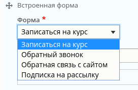
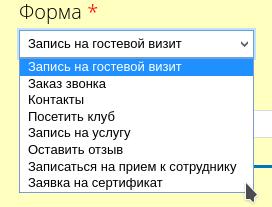

Иногда случается такая ситуация, что вы хотите создать поле типа список (селект,
радио кнопки, чекбоксы), но содержимое в нем должно быть так или иначе
динамическим.

Например, вы делаете параграф, и хотите добавить возможность вставки формы в
него, для этого вам нужно сделать селект инпут со всеми доступными формами
модуля Contact, но вы не хотите вбивать все возможные формы руками, порой их
бывает много, и любое добавление\удаление формы повлечет за собой необходимость
проконтролировать это везде где прописано руками. В общем геморой и ненадежно. А
связи (entityreference) устанавливают связь на сущности, а не их типы\бандлы.
Можно конечно найти готовый модуль под это дело, но стоит ли перегружать проект
из-за такой мелочи контрибом? Да и это лишь один пример, может значения нужно
тянуть вообще с внешнего источника, тут уже точно кастомчик под задачу.

Вы может подумаете, да чо там, альтернуть форму где эти поля, и
подсунать `#options` нужный список — это тоже неверный подход в таком случае.
Да, это поможет, до поры до времени, ведь сам Drupal эти значения знать не
будет, и это очень быстро приведет к ошибке и проблемам, а если всплывет позже,
ещё хуже, так как придется всеравно переделывать и, возможно, даже придется
вспоминать и догадываться почему так происходит. Т.е. эти данные что вы
подставите, будут только в форме, но не дальше неё. Очень ненадежное решение.

Для этого как в Drupal 7, так и в 8-ой версии есть специальная настройка для
данного типа полей: `allowed_values_function` — в ней указывается название
функции которая будет возвращать тот самый массив для `#options`, но он будет
доступен повсюду, даже если вызвать его через EMW в
7-ке: `$wrapper->field_name->optionsList()` — сделая это через альтер формы, вы
тут ничего не получите, будет пусто.

Поэтому в этом гайде инфомация о том, как установить `allowed_values_function`.
Что в 7-ке, что в 8-ке это делается какими-то странными путями, причем далеко не
очевидными. Это создавая поле программно, никаких проблем, вы сразу это
указываете, но что делать если поле создано в админке? Туда подлезть уже нужно
правильно, хука с альтером никакого для этого нет. Но есть не менее надежные и
хорошие решения, которые, в случае чего, легко откатить и воспроизвести повторно
на другом проекте.

*Далее по тексту подразумевается что модуль в котором пишется код имеет название
dummy, учитывайте это при копипасте в свои модули.*.

## Drupal 8

В Drupal 8 это делается несколько проще чем в в 7-ке, и из кода вам придется
написать только функцию которая возвращает значения для селекта.

Первым делом пишется функция. Я, для примера, привожу код, который возвращает
список доступных форм от модуля Contact. В качестве ключа используется машинное
имя контактной формы (из-за их особенности вызова), а значением является просто
название формы. Данная функция должна принимать 3
аргумента: `FieldStorageConfig $definition`, `ContentEntityInterface $entity = NULL`
и `$cacheable`. В нашем случае они не нужны вообще. Но если потребуется, то
можете пользоваться.

```php
/**
 * Custom option list for field node.field_example_dynamic_select
 */
function dummy_node_field_example_dynamic_select_options_list(FieldStorageConfig $definition, ContentEntityInterface $entity = NULL, $cacheable) {
  $options = [];
  $bundle_info = \Drupal::service('entity_type.bundle.info');
  $bundles = $bundle_info->getBundleInfo('contact_message');
  foreach ($bundles as $machine_name => $info) {
    $options[$machine_name] = $info['label'];
  }
  // Отключаем на выбор персональную контактную форму.
  unset($options['personal']);
  return $options;
}
```

Теперь, для нужного поля, нужно указать данную функцию в
параметре `allowed_values_function`, просто как строку. Для этого:

1. Заходим: Конфигурация - Разработка - Синхронизация конфигурации.
2. Переходим на вкладку "Экспортировать".
3. Переходим на дополнительную вкладку ниже "Один элемент".
4. В "Тип конфигурации" выбираем "Хранилище полей".
5. В "Имя конфигурации" выбираем наше поле.
6. Вы увидите конфиг файл для данного поля. В нем будет раздел `settings`, а в
   нем два параметра `allowed_values` и `allowed_values_function`. Если вы
   делаете динамически значения, то `allowed_values` должен оставаться `{ }` —
   то есть пустым массивом. Прям тут можете и править значения. Затем в другой
   ставим название нашей функции и получаем примерно
   следующее: `allowed_values_function: dummy_node_field_example_dynamic_select_options_list`.
7. Выделяем все что находится в textarea и копируем в буфер обмена.
8. Переходим на вкладку "Импортировать".
9. Также переходим на второй раздел "Один элемент".
10. В "Тип конфигурации", аналогично, выбираем "Хранилище полей".
11. В textarea вставляем то что скопировали с изменениями. Если изменения не
    вноссили на экспорте, вносите тут!
12. И жмете кнопку "Импортировать".

Всё готово. Теперь где бы не было это поле, значения там будут тащиться из
данной функции.



## Drupal 7

Так как в 7-ке нету конфигураций и всё лежит прямо в базе, нам придется
использовать соответствующий API + hook для достижения цели.

Для начала, аналогично, создаем функцию, которая будет возвращать данные для
селекта. В качестве примера на 7-ке, функция ниже возвращает список все
Entityform форм, где ключ — машинное имя формы, а меткой является название
формы.

```php {"header":"dummy.module"}
/**
 * Custom option list for field field_example_dynamic_select.
 * 
 * @see dummy.install
 */
function dummy_node_field_example_dynamic_select_options_list() {
  $entity_info = entity_get_info('entityform');
  $allowed_values = array();
  foreach ($entity_info['bundles'] as $bundle_name => $bundle_info) {
    $allowed_values[$bundle_name] = $bundle_info['label'];
  }
  return $allowed_values;
}
```

Так как я выше написал, в 7-ке нет конфигураций, нам нужно изменить конфигурацию
поля. Делается это исключительно кодом. Код, конечно, можно дернуть в
каком-нибудь `/devel/php` — но это будет крайне опасно на будущее, так как тут
хотябы будет след от этих действий. Ведь в 7-ке с этим не так прозрачно как в
8-ке, там в конфиге можно посмотреть что и как, а тут это заморчоеннее, надо
либо в базу лезть либо код по памяти писать. И вообще это не очень хорошо так
поля менять.

Мы сделем "правильным" путем, и объявим `hook_update_N()`. Если у вас данный хук
не объявлен, то он будет иметь аналогичные цифры, а если объявлен, то вы,
вероятнее всего, знаете как их менять.

Собственно нам нужен `.install` файл где пишутся данные хуки. Если нету, то
создаем и объявляем наш хук.

```php {"header":"dummy.install"}
<?php

/**
 * @file
 * Main hook for installation and update.
 */

/**
 * Implements hook_update_N().
 */
function dummy_update_7101(&$sandbox) {
  // Загружаем информацию о нужном поле.
  $field_info = field_info_field('field_example_dynamic_select');
  // Убираем дефолтные значения.
  unset($field_info['settings']['allowed_values']);
  // Устанавливаем функцию которая возвращает значения.
  $field_info['settings']['allowed_values_function'] = 'dummy_node_field_example_dynamic_select_options_list';
  // Сохраняем изменения поля.
  field_update_field($field_info);
}
```

После этого нужно зайти на страницу `/update.php` и запустить обновление. Данные
настройки применятся и вы увидите результат.



В случае чего, вы можете смело удалять поле, но если решите откатить обратно —
не поленитесь, напишите `dummy_update_7102` (или какой там у вас будет номер по
счету) и проделайте аналогичное просто сделайте `unset`
для `allowed_values_function`. А доступные значения можете уже задать через UI.
