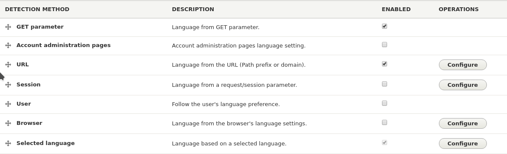
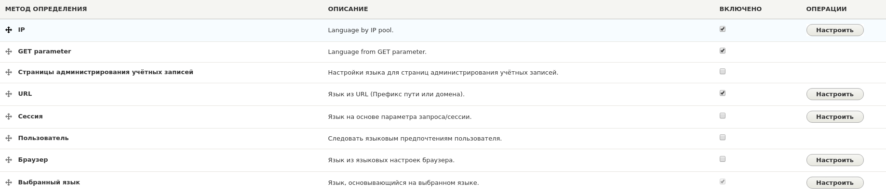
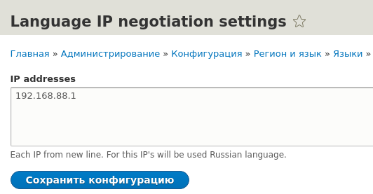

В этом материале рассмотрим как добавить свой <abbr title="дословно — языковой посредник">Language Negotiator</abbr>, который отвечает за выбор языка сайта.

Логика, какой язык будет использоваться для тех или иных частей сайта, определяется в Language Negotiator плагинах. Для их работы требуется активация модуля Language, так как он добавляет поддержку нескольких языков на сайт и предоставляет данные плагины.


## Разбор плагина


Плагин очень простой, поэтому гайд будет мелкий.

Сам плагин объявляется в `src/Plugin/LanguageNegotiation` расширяя `LanguageNegotiationMethodBase`. Для его работы достаточно объявить метод `getLangcode()` и указать аннотацию.

Аннотация состоит из следующего:

* `id`: Идентификатор данного negotiatior. Судя по ядру указывается он по принципу машинных имен, только вместо нижнего подчеркивания используется тире. Данный ID указывается не напрямую, а через `const METHOD_ID = 'my-id';`, а уже в данном значении аннотации подставляется данная константа.
* (опционально) `type`: Определяет на какие типы языков влияет данный плагин. Для каких-то экзотических задач, когда, например, интерфейс должен быть на одном языке, а сам сайт на другом. Если опустить данный параметр, будет подразумеваться что указаны все сразу. Указываются в виде массива и прямыми вызовами констант LanguageInterfece: `\Drupal\Core\Language\LanguageInterface::TYPE_*`. Их всего три:
  *  `TYPE_CONTENT`: Определяет язык для содержимого.
  *  `TYPE_INTERFACE`: Определяет язык пользовательского интерфейса.
  *  `TYPE_URL`: Определяет какой язык будет использоваться для генерации URL.
* (опционально) `weight`: Вес данного negotiator среди других по умолчанию. Особо не имеет смысла, так как они попадают в соответствующий интерфейс где их вес спокойно настраивается.
* `name`: Название negotiator. Используется в административном интерфейсе.
* (опционально) `description`: Его описание. Используется в административном интерфейсе.
* (опционально) `config_route_name`: Название роута, который будет вести на форму настроек данного negotiator, если они ему требуются. Обычная связка Routing API + Form API.

Что касается метода `getLangcode()`, то он принимает по дефолту `Request $request = NULL`, где вы можете получить всю необходимую информацию о текущем обращении к сайту. Возвращать он должен NULL или же код языка который должен быть активирован. В случае если вернулся NULL, то определение языка передастся следующему по весу negotiator и так до самого последнего <abbr title="Выбранный язык">Selected language</abbr>, который включен по дефолту и не отключается.

*Далее по примерам подразумевается что модуль имеет название dummy.*


## Пример №1 — простое определение языка


Начну, пожалуй, с того, что напомню вам, что при создании модуля, не забудьте указать модуль `language` в качестве зависимости своего модуля. Так как без него ваш плагин будет бесполезен.

Первым делом простенький пример, который будет выбирать язык на основе GET параметра `set-lang`, который мы будем проверять на полученные данные, и если значение данного параметра соответствует одному из активных языков на сайте, мы переключим пользвателя на данный язык. Всё очень просто.

Для начала нужно объявить плагин. Создаем его в `src/Plugin/LanguageNegotiation`,  назовем `LanguageNegotiationParameter`.

```php {"header":"src/Plugin/LanguageNegotiation/LanguageNegotiationParameter.php"}
<?php

namespace Drupal\dummy\Plugin\LanguageNegotiation;

use Drupal\language\LanguageNegotiationMethodBase;
use Symfony\Component\HttpFoundation\Request;

/**
 * @LanguageNegotiation(
 *   id = \Drupal\dummy\Plugin\LanguageNegotiation\LanguageNegotiationParameter::METHOD_ID,
 *   name = @Translation("GET parameter"),
 *   description = @Translation("Language from GET parameter."),
 * )
 */
class LanguageNegotiationParameter extends LanguageNegotiationMethodBase {

  /**
   * ID нашего плагина.
   */
  const METHOD_ID = 'get-parameter';

  /**
   * {@inheritdoc}
   */
  public function getLangcode(Request $request = NULL) {
    $langcode = NULL;

    // Если вы хотите выполнять какое либо условие, обязательно проверяйте на
    // существование $this->languageManager && $request для избежания ошибок.
    // При помощи $request->query->get('set-lang') мы получаем $_GET['set-lang']
    // и узнаем передали его или нет.
    if ($this->languageManager && $request && $request->query->get('set-lang')) {
      // Получаем доступные на сайте языки. Они идут в виде массива:
      // langcode => Language Name. Поэтому мы сразу получаем только ключи, так
      // как определять будем по ним.
      $langcodes = array_keys($this->languageManager->getLanguages());
      $set_lang = $request->query->get('set-lang');
      // Если указанный пользователям язык присутствует на сайте, мы
      // устанавливаем как язык для всего сайта.
      if (in_array($set_lang, $langcodes)) {
        $langcode = $set_lang;
      }
    }

    return $langcode;
  }

}
```

Теперь достаточно включить модуль, если уже включен, то сбросить кэш, перейти на страницу `/admin/config/regional/language/detection` и там увидите свой negotiator. Справа достаточно поставить галочку и перетащить его вверх.



Теперь если вы к адресу добавите `?set-lang=ru`, то, если у вас включен русский язык, вы увидите все на русском, как интерфейс так и содержимое. Если же нету, то дальше пойдет проверка по URL (см. скриншот) и т.д. Если параметр удалить, то язык будет определяться уже URL, так как наш вернет NULL. Вы можете хранить результат, например, в кукисах, что и как уже будет работать дело ваше. А мы плавно перекатываемся ко второму примеру.


## Пример №2 — добавляем настройки


Данный пример лишь пример с настройками, ничего особенного тут не будет. В нём мы создадим настройку где указываются список IP для которых включить русский язык.

Для начала создадим форму с настройкой, обычный [Form API](/blog/73).

```php {"header":"src/Form/LanguageNegotiationIpSettings.php"}
<?php

namespace Drupal\dummy\Form;

use Drupal\Core\Form\ConfigFormBase;
use Drupal\Core\Form\FormStateInterface;

/**
 * {@inheritdoc}
 */
class LanguageNegotiationIpSettings extends ConfigFormBase {

  /**
   * {@inheritdoc}.
   */
  public function getFormId() {
    return 'collect_phone';
  }

  /**
   * {@inheritdoc}
   */
  protected function getEditableConfigNames() {
    return [
      'dummy.language_negotiation_ip_settings',
    ];
  }

  /**
   * Создание нашей формы.
   *
   * {@inheritdoc}.
   */
  public function buildForm(array $form, FormStateInterface $form_state) {
    $config = $this->config('dummy.language_negotiation_ip_settings');
    $form['ips'] = [
      '#type' => 'textarea',
      '#title' => $this->t('IP addresses'),
      '#description' => $this->t('Each IP from new line. For this IP\'s will be used Russian language.'),
      '#default_value' => $config->get('ips'),
    ];

    return parent::buildForm($form, $form_state);
  }

  /**
   * {@inheritdoc}
   */
  public function submitForm(array &$form, FormStateInterface $form_state) {
    $this->config('dummy.language_negotiation_ip_settings')
      ->set('ips', $form_state->getValue('ips'))
      ->save();
  }

}
```

Далее создаем роут для данной формы с настройками.  Все negotiators из ядра имеют пути: `/admin/config/regional/language/detection/NAME`, и мы воспользуемся данным шаблоном для нашего пути.

```yaml {"header":"dummy.routing.yml"}
dummy.language_negotiation_ip_settings:
  path: '/admin/config/regional/language/detection/ip'
  defaults:
    _form: '\Drupal\dummy\Form\LanguageNegotiationIpSettings'
    _title: 'Language IP negotiation settings'
  requirements:
    _permission: 'administer site configuration'
```

Осталось только создать наш negotiatior:


```php {"header":"src/Plugin/LanguageNegotiation/LanguageNegotiationIp.php"}
<?php

namespace Drupal\dummy\Plugin\LanguageNegotiation;

use Drupal\language\LanguageNegotiationMethodBase;
use Symfony\Component\HttpFoundation\Request;

/**
 * @LanguageNegotiation(
 *   id = \Drupal\dummy\Plugin\LanguageNegotiation\LanguageNegotiationIp::METHOD_ID,
 *   name = @Translation("IP"),
 *   description = @Translation("Language by IP pool."),
 *   config_route_name = "dummy.language_negotiation_ip_settings"
 * )
 */
class LanguageNegotiationIp extends LanguageNegotiationMethodBase {

  /**
   * ID нашего плагина.
   */
  const METHOD_ID = 'ip';

  /**
   * {@inheritdoc}
   */
  public function getLangcode(Request $request = NULL) {
    $langcode = NULL;

    if ($this->languageManager && $request) {
      // Получаем настройку.
      $ips = $this->config->get('dummy.language_negotiation_ip_settings')->get('ips');
      // Создаем массив.
      $ips_array = explode(PHP_EOL, $ips);
      $user_ip = \Drupal::request()->getClientIp();

      if (in_array($user_ip, $ips_array)) {
        // Устанавливаем русский язык если IP юзера находится в списке
        // указанных.
        $langcode = 'ru';
      }
    }

    return $langcode;
  }

}
```

В идеале, нужно добавить ещё конфиги при установке:

```php {"header":"config/install/dummy.language_negotiation_ip_settings.yml"}
ips: ''
```

Сбрасываем кэш, вклчюаем и переносим вверх.



Как вы можете заметить, появилась кнопка "Настроить", нажав на неё, мы попадем на страницу с настройками для нашего negotiator:



Теперь если зайдете на сайт, и у вас будет IP один из введенных, то язык сменится на русский, если же нет, то отправится нашему второму negotiotaor который проверит на `?set-lang` и далее по списку, пока язык не определится.

Вот так просто. Если нужны другие примеры, можете посмотреть как реализованы остальные из списка, которые легко найти в ядре: `core/modules/language/src/Plugin/LanguageNegotiation`.
