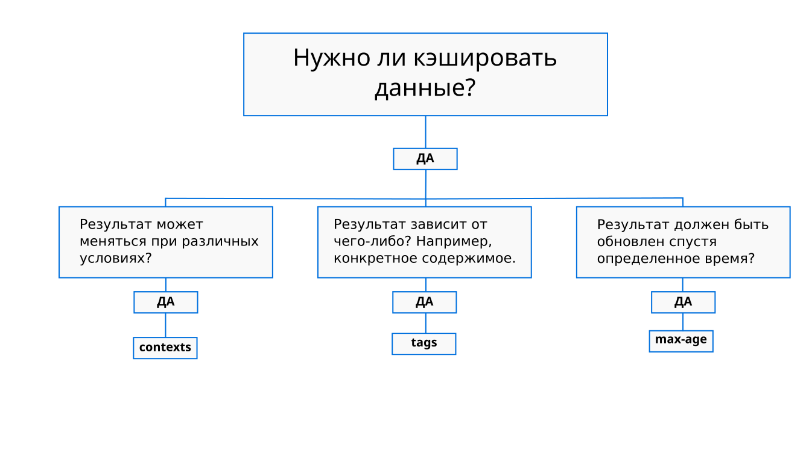
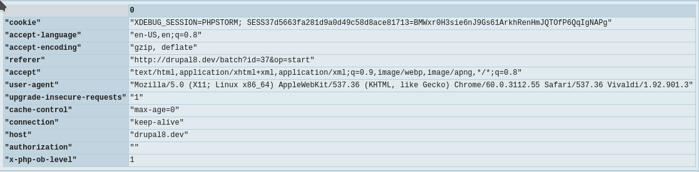
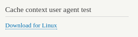
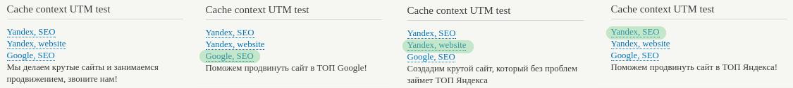

Продолжая статью про [#lazy_builder][drupal-8-lazy-builder] мы переходим к самому
кэшированию в Drupal 8.

Так как в 8-ке всё перевели на Render API, то кэширование теперь внедряется
прямо на уровне render array при помощи ключа `#cache` и делится на три
самостоятельных типа:

* `tags`: Прямо так и понимайте — это теги кэша, на основе которых Drupal
  принимает решение, обновить какой-то кэш или нет. Это такие "зависимости", и
  если одна из них поменяется — кэш содержащий данный тег(и) автоматически
  инвалидируется.
* `contexts`: Данный тип кэша позволяет делать кэш вариативным, например для
  разных ролей. Это уже деление кэша на разные "варианты" в зависимости от
  контекста вызова содержимого. Очень часто основываются на HTTP запросе.
* `max-age`: Самый простой тип кэша, который хранит в секундах, как долго данный
  кэш будет жить. Как только время пройдет — он инвалидируется. При помощи
  данного свойства можно отключать кэширование вообще, так и делать его вечным.

То же самое в картинке:



Все три вышеперечисленные типы кэширования могут работать вместе, они лишь
дополняют друг-друга, также они могут быть во вложенных элементах.

Если сократить до одного предложения, то: `contexts` отвечает за вариативность
кэша в зависимости от условий запроса содержимого, `tags` за связи с какими-то
элементами, сущностями, содержимым и т.п. для которых данныйэ кэш актуален и
изменения данных связей повелечет инвалидацию кэша и самый простой `max-age`
отвечает за время жизни самого кэша.

Должно быть всё просто, так как ничего сложного, на самом деле, нет. Что
касается наследования, то все `#cache` **элементы наследуются от дочерних
элементов к родительскому**. Они обьединяются в одну конфигурацию. Если,
например, главная страница сделана при помощи Views, который выводит материалы,
и там, допустим, есть node с id 10. То теги
получатся: `node:10`,  `config:views.view.VIEW_NAME` и остальные ноды попавшие
на страницу. Таким образом, изменение одной из нод или настроек вьюса, повлечет
за собой инвалидацию данного кэша.

Разбирать каждый из вариантов кэширования мы будем по очереди, чтобы не было
каши. Поняв за что отвечает каждый из них, и как он влияет на жизнь и поведение
кэша, у вас не будет сложности объединять их между собой.

## Cache tags

Теги кэша — это такие метки для кэша, на основе которых он определяет какой кэш
нужно <abbr title="Пометить как неактуальный">инвалидировать</abbr> для
последующей генерации нового содержимого.

Ядро предоставляет два встроенных формата записи кэш тегов, которые
автоматически будут контролироваться ядром:

* `<entity type ID>:<entity ID>`: тег связанный с определенной сущностью по её
  названию и id. Когда данная конкретная `сущность:id` будет обновлена, данный
  кэш автоматически будет инвалидирован. Пример: `node:7`, `user:17`.
* `config:<configuration name>`: тег связаный с определенной конфигурацией.
  Аналогично как и выше, инвалидируется при изменении определенной конфигурации.
  Пример: `config:system.performance`, `config:system_site`.

Также вы можете добавлять свои теги, и в дальнейшем самостоятельно, при
определенных условиях, инвалидировать. Их формат записи должен
быть `my_cache_tag` — т.е. все через нижнее подчеркивание. Среди предоставляемых
по умолчанию имеются такие теги используемые самой системой:

* `node_list` (`<entity_type>_list`):  инвалидирует когда любой материал
  сущности `Node` создан.
* `library_info`: инвалидирует когда информация о библиотеках на сайте
  обновлена.

### Пример использования cache tags

```php
$build = [
  '#theme' => 'my_awesome_theme_hook',
  '#cache' => [
    'tags' => ['user:1', 'node:2', 'my_custom_tag'],
  ],
];
```

Результат примера выше будет закэширован пока хотябы один тег не будут
инвалидирован. А это произойдет если будет изменен профиль (сущность)
пользователя с UID 1, либо материал node с id 2, либо инвалидирован кастомный
тег `my_custom_tag`. И тут мы подходим к вопросу инвалидации.

### Программная инвалидация тэгов

Тэги инвалидируются программно, сущности это делают сами в своих методах и
логике, а вот кастомные теги вы должны инвалидировать самостоятельно, хотя вы
тем же способом можете инвалидировать и теги сущностей, мало ли потребуется
такое.

Инвалидируются они следующим образом:

```php {"header":"Инвалидация cache tags"}
// Пример 1 — Правильный
\Drupal::service('cache_tags.invalidator')
  ->invalidateTags(['my_custom_tag']);

// Пример 2 — Запасной
use Drupal\Core\Cache;
Cache::invalidateTags(['my_custom_tag']);
```

Если по каким-то причинам не работает вызов сервиса, то используется второй
пример, во всех остальных случаях первый (вызов через сервис).

Вы можете инвалидировать сколько и какие угодно теги, передавая их в массив друг
за другом. Вот так всё просто!

## Cache contexts

Контексты позволяют добавить варианты кэша. Их может быть указано сколько угодно
и какие угодно (из доступных). Каждый контекст это определенный сервис (всегда)
созданный с определенными методами и именованием, о том как они создаются будет
чуть ниже. В момент генерации кэша, он запрашивает все контексты, они возвращают
строку или целое число, затем он на основе этих данных смотрит, есть ли для
такой комбинации кэш, и если есть, то отдает его, а если нет, генерирует новый
вариант.

**Надо понимать** что контексты нельзя напрямую инвалидировать как в случае с
тегами. По дефолту, если вы не укажите попутно `max-age` или `tags` он будет
закэширован навсегда в пределах контекста, и только сброс общего кэша, или же
если есть родитель, то его условия очистят их значения. Конечно, можно по CID их
чистить по одному, но это безумно и куда сложнее. Если проще: в ядре нет
механизма прямой очистки конкретного кэша по контексту.

Контексты указываются примерно как теги. Также они могут иметь иерархию,
дочерние контексты отделяются от родительских через `.`, но при этом могут иметь
динамический параметр, который отделяется `:`, который может указать
пользователь.

Ядро предоставляет следующие контексты:

```text {"header":"cache contexts из ядра"}
cookies
  :name
headers
  :name
ip
languages
  :type
request_format
route
  .book_navigation
  .menu_active_trails
    :menu_name
  .name
session
  .exists
theme
timezone
url
  .path
    .is_front // Available in 8.3.x or higher.
    .parent
  .query_args
    :key
    .pagers
      :pager_id
  .site
user
  .is_super_user
  .node_grants
    :operation
  .permissions
  .roles
    :role
```

Давайте посмотрим на самый первый контекст: `cookies:name`. Вы можете
игнорировать указание динамического значения, в данном случае `:name`, то в
таком случае будет автоматически поставлено `all` (на самом деле, там не в
буквальном смысле передается `all`, это подразумевается что вам не важно на чем
именно оно будет основываться, все что есть, все сгодится). Например, если
укажите `cookies:my_cookie`, то кэш будет иметь разные варианты в зависимости от
Cookies в браузере пользователя с именем `my_cookie`. Если оно не имеет
значения — один вариант, если имеет — то каждый вариант значения будет иметь
свой кэш. Например значение `my_cookie` 1 и 2, это указывает Drupal что для 1
надо сгенерировать один результат, а для 2, другой.

Теперь рассмотрим цепочку `url`:

* `url`:  Просто указав данный путь, кэш будет ориентироваться на обычный url
  сайта, например: `http://example.com/`. Учитывает `$_GET`, порт (если указан),
  а также протокол.
  * `url.path`:  Будет отдавать полный путь до текущей страницы включая домен.
    Например: `http://example.com/blog/title`.
    * `url.path.is_front`: Возвращает 1 если главная и 0 если нет.
    * `url.path.parent`: Данный контекст возвращает только путь без начального
      слеша и последнего слага. Если опираться на пример выше, то результат
      будет: `blog`, а для `http://example.com/blog/title/and-another-one`
      результат будет `blog/title`.
  * `url.query_args`: Будет генерировать строку на основе `$_GET` запроса.
    Например: `http://example.com/?foo=bar&baz=boom` превратится
    в `foo=bar&baz=boom` и кэшироваться будует под каждый вариант такого
    запроса.
  * `url.query_args:key`: Позволяет сделать только на основе определенного
    аргумента: `url.query_args:foo` — будет учитывать только данный аргумент.
  * `url.query_args.pagers`: Позволяет делать варианты на основе значения
    пейджера на странице и его ID. У разных pager id будут разные кэши!
    * `url.query_args.pagers:pager_id`: Позволяет сократить контекст до
      определенного пейджера.
  * `url.site`:  Этот контекст аналогичен основному, учитывает протокол, а также
    поддомен и порт (если указан), но не учитывает `$_GET` и дальнейший путь.
    Например: `http://example.com`, `http://www.example.com` (обратите внимание
    что тут нет на конце `/`).

Я думаю тут ничего сложного нет, главное уловить разницу между тегами, которая
уже должна быть очевидной. Также, надо понимать, что контексты нельзя просто
взять и написать, они должны быть обязательно подкреплены сервисами. Каждая
часть разделенная точкой из примеров выше имеет свой собственный сервис.
Только `:arg` передается родительскому в качестве аргумента.

## Cache max-age

С этим вообще всё настолько просто, что даже нет особо тормозить и разьяснять.
Данное значение содержит число секунд, спустя которое кэш будет инвалидирован.

- `60`: Спустя минуту кэш будет создан заново.
- `0`: Полностью отключает кэш. Помеченные элементы данным числом не будут
  кэшироваться вообще.
- (по умолчанию) `\Drupal\Core\Cache\Cache::PERMANENT`: Данный кэш **не будет**
  инвалидирован сроком жизни. Он будет существовать до тех пор, пока кэш в
  системе не будет сброшен или же не инвалидируется один из тегов, если они там
  есть.

**Это все** что следует о них знать. Самый сложный из понимания contexts, так
как он самый гибкий, поэтому ему я уделю особое внимание и ниже будет пример как
создавать свои контексты. Поняв три данных параметра, считайте вы поняли
кэширование в Drupal.

Если вас не интересует создание собственного контекста, статья на этом
завершена ;)

## Создание собственного контекста

Создание контекста для кэша состоит из следующих этапов:

1. Создание объекта который реализовывает <mark>один из двух</mark> интерфейсов:
   - `CacheContextInterface`: стандартный интерфейс который требует объявить три
     метода.
   - `CalculatedCacheContextInterface`: абсолютный аналог предыдущего с
     единственным отличием, что данный интерфейс обязан принимать аргумент в двух
     методах. Данный интерфейс используется для контекстов <mark>где требуется
     возможность ввода аргумента</mark>. Например `my_context:arg`.
2. Объявление данного объекта в качестве [сервиса][drupal-8-services]. Данный сервис
   должен удовлетворять следующим требованиям, нарушение хотябы одного из них
   повлечет за собой то что контекст не будет объявлен:
   - Он должен иметь тег `cache.context` для того чтобы Cache API смог его
     обнаружить.
   - Он обязательно должен начинаться с `cache_context.`, а уже после точки пишите
     название своего контекста. Если контекст вложенный, как,
     например `url.path.is_front`, то нужно
     объявить: `cache_context.url.path.is_front`. Учтите, что удаляя
     часть `is_front` оставшееся часть должна продолжать работать. На самом деле
     это не обязательно, но так все устроено в ядре, и это логично, ваши контексты,
     если они вложенные, должны идти от общего к более узким, таким образов
     разработчики смогут сужать пул контекста или же расширять его.
   - Он <mark>всегда</mark>, не зависимот от задач и ситуации принимает
     аргумент `@request_stack`, который является сервисом
     содержащий `RequestStack`, в котором вся необходимая информация о текущем
     запросе. Будете ли вы его использовать или нет, дело ваше, но в качестве
     аргумента сервису указать вы его обязаны, но вот в `__construct()` уже можно
     не принимать, если не нужно.

Теперь пройдемся по методам которые необходимо объявить для интерфейсов. Каждый
из них <mark>обязательнный</mark>.

- `getLabel()`: должен возвращать человечское название контекста кэширование.
  Используется в администритивном интерфейсе.
- `getContext()`: возвращает строку, которая является результатом контекста.
  Постарайтесь не возвращать тут огромные строки, если уж прямо очень много
  данных, лучше всего прогоняйте через `md5()` и подобные функции. Данный метод
  может возвращать только: string, int, float и прочие базовые типы, которые
  можно интерпритировать как строку, никаких массивов и уж темболее объектов там
  возвращать нельзя. Если ваш контекст
  реализует `CalculatedCacheContextInterface` то он обязательно должен принимать
  аргумент. Если вы хотите вернуть результат подразумевающий что контекст не
  подготовлен, общий вариант или не важно что будет, то просто возвращайте
  пустую строку, никаких `TRUE`, `FALSE` и `NULL`.
- `getCachebaleMetadata()`: возвращает информацию о "кэшируемости" данного
  контекста. Так сказать базовые значения, которые будут также добавлены к
  элементу который его вызывает. Если ваш контекст
  реализует `CalculatedCacheContextInterface` то он обязательно должен принимать
  аргумент. Вот такие варианты данный метод может вернуть:
  - Пустой объект `CacheableMetadata` — в таком случае это означает, что данный
    контекст можно кэшировать без проблем, кэш будет зависить от других
    элементов и не контролироваться нами. То есть нас не волнует как будут
    кэшировать данные где используется данный контекст, мы его используем для
    добавления вариативности.
  - Массив содержащий <mark>max-age = 0</mark>. Это означает что данный контекст
    вообще не кэшируемый. Т.е. везде где указан данный контекст в кэш массиве,
    будет генерироваться при каждом запросе. И если
    используется [#lazy_builder][drupal-8-lazy-builder], он будет задействован для
    генериации содержимого с данным контекстом.
  - Массив содержащий <mark>max-age > 0</mark> и <mark>cache tags</mark>. Он
    будет кэшироваться с данными параметрами и может быть инвалидирован через
    тег, либо будет очищаться по истечению указаного времени в max-age. Как я
    писал выше, если содержимое содержащее данный контекст или выше по дереву
    массива будет содержать cache tags и contexts, то они будут обьеденины.

Также в ядре существует базовый класс который также можно зайдествовать в своём
контексте: `RequestStackCacheContextBase`. Он просто добавляет `RequestStack` в
свойство `requestStack`, и принимает его в конструкторе. Используйте его если
хотите что-то вытащить из запроса, так как это хоть и немного, но сократит код.

### Пример №1. Свой собственный контекст с примером

В данном примере мы объявим свой контекст: `dummy_request_header:parameter`. Он
будет основываться на header запроса. Вот пример что там может быть:



Так как мы принимает аргумент `:parameter` то наш контекст будет доступен
как `dummy_request_header`, так и `dummy_request_header:parameter`. Вы должны
предусмотреть в таком случае, что при обращении без аргумента контекст тоже
что-то вернул. Наличие аргумента у контекста не делает его обязательным, если
выхотите чтобы при обращении к контексту без аргумента как бы "ничего не было",
просто возвращайте всегда пустую строку, в таком случае у всех таких контекстов
будет одно содержимое.

Исходя из задачи, нам нужно реализовывать `CalculatedCacheContextInterface` так
как будем принимать аргументы, а также расширять `RequestStackCacheContextBase`,
чтобы не перегружать код.

Так как `dummy_request_header` массив, и мы не можем его просто так вернуть, мы
будем соединять массив в строку, а затем получать его hash при помощи `md5()`.
Таким образом мы значительно сократим значение, которое в сыром виде хранится в
БД, а также будет достаточно отличная уникальность и вероятность
совпадения `md5()` при разных значениях стремится к 0.

Первым делом делаем объект для нашего будущего контекста. В ядре нет четкого
указания где держать подобные объекты, можете в `src`, можете где-то ещё, им не
важна структура, так как это не плагины. Но я последую тому как это сделано в
ядре и создам его в `src/Cache/Context`. Назову я его соответствующе названию
контекста `DummyRequestHeaderCacheContext`.

```php {"header":"src/Cache/Context/DummyRequestHeaderCacheContext.php"}
<?php

namespace Drupal\dummy\Cache\Context;

use Drupal\Core\Cache\CacheableMetadata;
use Drupal\Core\Cache\Context\CalculatedCacheContextInterface;
use Drupal\Core\Cache\Context\RequestStackCacheContextBase;

/**
 * Cache context ID: 'dummy_request_header'.
 */
class DummyRequestHeaderCacheContext extends RequestStackCacheContextBase implements CalculatedCacheContextInterface {

  /**
   * {@inheritdoc}
   */
  public static function getLabel() {
    return t('Dummy request header');
  }

  /**
   * {@inheritdoc}
   */
  public function getContext($parameter = NULL) {
    $request_headers = $this->requestStack->getCurrentRequest()->headers;
    if ($parameter) {
      if ($request_headers->has($parameter)) {
        return (string) $request_headers->get($parameter);
      }
      else {
        return '';
      }
    }
    else {
      // If none parameter is passed, we get all available during request and
      // merges them into single string, after that we hash it with md5 and
      // return result.
      $headers_string = implode(';', array_map(function ($entry) {
        return $entry[0];
      }, $request_headers->all()));
      return md5($headers_string);
    }
  }

  /**
   * {@inheritdoc}
   */
  public function getCacheableMetadata($parameter = NULL) {
    return new CacheableMetadata();
  }
}
```

И объявляем наш объект в качестве сервиса cache context.

```yaml {"header":"dummy.services.yml"}
services:
  cache_context.dummy_request_header:
    class: Drupal\dummy\Cache\Context\DummyRequestHeaderCacheContext
    arguments: ['@request_stack']
    tags:
      - { name: cache.context }
```

Немного вернусь к объекту. Вы можете заметить комментарий у
класса: `Cache context ID: 'dummy_request_header'`. Не путайте его с
аннотациями. Это не обязательно. Такой комментарий содержит каждый контекст в
ядре, это для удобства поиска в коде, поэтому я последовал их примеру.

Далее нам нужно, например, создать блок для тестирования нашего объекта. В нем
все будет крайне просто. Мы будем брать `user-agent` из заголовка, пытаться
определить операционную систему, и выводить сыслку, якобы на загрузку программы
для данной платформы. Но вот проблема, `user-agent` содержит не только
операционную систему, а также архитектуру, движок браузера, версию движка,
браузер, его версию. Получается что кэшей будет просто навалом и они будут очень
часто повторяться, так как строка, которую будет возвращать контекст (
user-agent) будет большая и очень разная.

Что мы можем сделать в данном случае?

- Первый вариант, чутка доработать текущий контекст и добавить ключ для
  несуществующего параметра из шапки запроса, например `os`, который будет
  возвращать название операционной системы в качестве результата контекста.
- Второй, объявить свой контекст. Если хотите попробовать, добавьте свой
  контекст, будет такой челенджн на проверку того что выше. Сделайте ему
  название `dummy_request_header.os`. Учтите, что реализовывать уже
  потребуется `CacheContextInterface`, всё остальное вообще не изменится, а код,
  который потребуется для `getContext()` сможете взять ниже.

Я же пойду по первому пути, ибо это быстрее и проще, хотя будет не логично для
разработчиков если сделать подобное на реальном проекте, так как не залезая в
код контекста будет неизвестно о такой особенности. Для того чтобы сделать
поддержку ключа `os` в нашем текущем контексте и возвращать название
операционной системы, достаточно поправить метод `getContext()` следующим
образом:

```php
public function getContext($parameter = NULL) {
    $request_headers = $this->requestStack->getCurrentRequest()->headers;
    if ($parameter) {
      if ($request_headers->has($parameter)) {
        return (string) $request_headers->get($parameter);
      }
      elseif ($parameter == 'os') {
        $user_agent = $request_headers->get('user-agent');
        if (preg_match('/linux/i', $user_agent)) {
          return 'linux';
        }
        elseif (preg_match('/macintosh|mac os x/i', $user_agent)) {
          return 'mac';
        }
        elseif (preg_match('/windows|win32/i', $user_agent)) {
          return 'windows';
        }
        else {
          return 'other';
        }
      }
      else {
        return '';
      }
    }
    else {
      // If none parameter is passed, we get all available during request and
      // merges them into single string, after that we hash it with md5 and
      // return result.
      $headers_string = implode(';', array_map(function ($entry) {
        return $entry[0];
      }, $request_headers->all()));
      return md5($headers_string);
    }
  }
```

Таким образом, указав контекст `dummy_request_header:os` кэш будет иметь вариант
под каждую ОС из перечисленных, и если не определена, то выводить стандартный
текст. Теперь на основе этого сделаем свой блок.

Для того чтобы сделать такой блок, нам также потребуется `RequestStack` для
получения и парсинга аналогичных данных, аналогичными регулярками будем получать
ОС и генерировать содержимое блока, указав наш контекст для кэширования.

```php {"header":"src/Plugin/Block/CacheContextRequestHeaderTest.php"}
<?php

namespace Drupal\dummy\Plugin\Block;

use Drupal\Core\Block\BlockBase;
use Drupal\Core\Url;

/**
 * Provides a 'CacheContextRequestHeaderTest' block.
 *
 * @Block(
 *  id = "dummy_cache_context_request_header_test",
 *  admin_label = @Translation("Cache context OS test"),
 * ) Как
 */
class CacheContextRequestHeaderTest extends BlockBase {

  /**
   * {@inheritdoc}
   */
  public function getOs() {
    $request_headers = \Drupal::service('request_stack')->getCurrentRequest()->headers;
    $user_agent = $request_headers->get('user-agent');
    if (preg_match('/linux/i', $user_agent)) {
      return 'Linux';
    }
    elseif (preg_match('/macintosh|mac os x/i', $user_agent)) {
      return 'Mac';
    }
    elseif (preg_match('/windows|win32/i', $user_agent)) {
      return 'Windows';
    }
    else {
      return 'other';
    }
  }

  /**
   * {@inheritdoc}
   */
  public function build() {
    $platform = $this->getOs();
    if ($platform == 'other') {
      return [
        '#markup' => t('Sorry, we have not already created software for you OS.'),
      ];
    }
    else {
      $string = t('Download for @platform', [
        '@platform' => $platform,
      ]);
      $url = Url::fromUri('http://www.example.com/');
      $external_link = \Drupal::l($string, $url);

      return [
        '#markup' => $external_link,
      ];
    }
  }

  /**
   * {@inheritdoc}
   */
  public function getCacheContexts() {
    return ['dummy_request_header:os'];
  }

}
```

Думаю объяснять по поводу генерации содержимого нет никакого смысла, все итак
ясно. Но я не просто так добавил `getCacheContexts()` метод.

У меня есть материал про [Block Plugin API][drupal-8-block-plugin] и там нет такого
метода. Все потому что он не является частью этого API, он является частью Cache
API и в данной статье его самое время упомянуть. Если посмотреть в `BlockBase`,
то он также не содержит данных методов, но он расширяет
`ContextAwarePluginBase`, который и содержит данные методы.

Они позволяют задать contexts, max-age и tags для всего блока независимо от того
что он будет возвращать и как. То есть вы можете возвращать контексты, теги и
время жизни прямо в render array, а можете соответствующими методами.
Соответственно для этого существует три метода:

- `getCacheContexts()`: возвращает массив из контекстов.
- `getCacheTags()`: возвращает массив тегов.
- `getCacheMaxAge()`: возвращает время жизни кэша.

Просто знайте что они есть, и есть такой базовый плагин который реализуют другие
плагины, и могут реализовывать ваши, для добавления соотстветующих методов
работы с кэшем. Я не могу вам привести примеров или за и против, они просто
есть, работают оба варианта идентично, разницу между ними я не заметил. Смею
предположить, что данные методы имеют выше приоритет, так сказать являются
родителями результата блока и будут также соединены с теми, что указаны
в `#cache` элементов render array, который возвращает блок.

Теперь, возвращаясь к блоку, можете добавить его на страницу и посмотреть
результат:



**Как проверить всё ли кэшируется правильно?** Если вы добавили данный блок на
страницу и включили кэширование у сайта. Вы можете зайти в БД сайта и выполнить
запрос:

```sql
SELECT *
FROM `cache_render`
WHERE `cid` LIKE '%dummy_request_header:os%'
```

Вы увидите примерно следующие строки(
у): `entity_view:block:cachecontextostest:[dummy_request_header:os]=linux:[languages:language_interface]=en:[theme]=bartik:[user.permissions]=a30137c0ac401cc4ad2826f92eaa0e633b4b90f869166a1515aac2bbbc04d421`

Как вы можете заметить, это ID кэша для соответствующего варианта кэша.
Например, контексты языка и темы унаследовались от ядяра, а также там есть и
наш. Как видите, там linux — это результат работы `getContext()`. Также в строке
есть дополнительно теги и max-age если вы их также указывали, или где-то они
были добавлены. Если человек зайдет с Windows, появится ещё одна записать и т.д.

Я очень надеюсь я понятно объяснил как работают контексты, так как если понять
их, всё остальное просто ерунда.

## Пример №2

Данный пример будет основан на стандартных контекстах, но мы сделаем достаточно
любопытный пример. Я не знаю как он влияет на SEO, но это отлично демонстрирует
как можно использовать контексты в повседневных задачах, а не только когда
что-то лагает.

Сеошники, не бейте ссаными тряпками, я в этом не шарю, но мы сделаем блок,
который меняет свое содержимое в зависимости от UTM меток.

Если вы не знакомы с UTM метками, то это такие параметры передаваемые с URL в
GET. Они передаются для обозначения что переход был с рекламной компании. Там
содержится название рекламной площадки (`utm_source`), тип рекламного
объявления (`utm_medium`) и название рекламной компании (`utm_campaign`).
Наверное, уже просто не существует таких рекламных сетей которые бы не
использовали UTM метки. Они позволяют определить откуда пришли пользователи,
если они пришли с рекламы. От какой площадки, с какого типа рекламы и какой
рекламной компании. Они используются для анализа трафика и понимания, какая
реклама приносит пользователей наиболее эффективно. Многие делают такие ссылки и
руками, когда что-то где-то размещают, чтобы также, отследить эффкетивность
данной ссылки. Мы же, будем менять содержимое блока на основе source и campaign.

Всё что нам нужно сделать, это блок, так как всё что требуется для
соответствующего кэширования есть в ядре: `url.query_args:key`.

```php {"header":"src/Plugin/Block/CacheContextUtmTest.php"}
<?php

namespace Drupal\dummy\Plugin\Block;

use Drupal\Core\Block\BlockBase;
use Drupal\Core\Link;

/**
 * Provides a 'CacheContextUtmTest' block.
 *
 * @Block(
 *  id = "dummy_cache_context_utm_test",
 *  admin_label = @Translation("Cache context UTM test"),
 * )
 */
class CacheContextUtmTest extends BlockBase {

  /**
   * {@inheritdoc}
   */
  public function build() {
    $build = [];
    // Static links for testing block caching.
    $build[] = [
      '#markup' => Link::createFromRoute('Yandex, SEO', '<front>', [], [
        'query' => [
          'utm_source' => 'yandex.com',
          'utm_campaign' => 'SEO',
        ],
        'target' => '_blank',
      ])->toString(),
      '#prefix' => '<div>',
      '#suffix' => '</div>',
    ];
    $build[] = [
      '#markup' => Link::createFromRoute('Yandex, website', '<front>', [], [
        'query' => [
          'utm_source' => 'yandex.com',
          'utm_campaign' => 'website',
        ],
        'target' => '_blank',
      ])->toString(),
      '#prefix' => '<div>',
      '#suffix' => '</div>',
    ];
    $build[] = [
      '#markup' => Link::createFromRoute('Google, SEO', '<front>', [], [
        'query' => [
          'utm_source' => 'google.com',
          'utm_campaign' => 'SEO',
        ],
        'target' => '_blank',
      ])->toString(),
      '#prefix' => '<div>',
      '#suffix' => '</div>',
    ];

    // Get current values.
    $result = 'Мы делаем крутые сайты и занимаемся продвижением, звоните нам!';
    $this->textModifier($result);
    $build[] = [
      '#markup' => $result,
    ];

    return $build;
  }

  /**
   * {@inheritdoc}
   */
  public function textModifier(&$result) {
    $utm_source = $this->getUtmSource();
    $utm_campaign = $this->getUtmCampaign();
    if ($utm_source == 'yandex.com') {
      switch ($utm_campaign) {
        case 'SEO':
          $result = 'Поможем продвинуть сайт в ТОП Яндекса!';
          break;

        case 'website':
          $result = 'Создадим крутой сайт, который без проблем займет ТОП Яндекса';
          break;
      }
    }

    if ($utm_source == 'google.com') {
      switch ($utm_campaign) {
        case 'SEO':
          $result = 'Поможем продвинуть сайт в ТОП Google!';
          break;
      }
    }
  }

  /**
   * {@inheritdoc}
   */
  private function getUtmValue($parameter) {
    $request_query = \Drupal::service('request_stack')->getCurrentRequest()->query;
    if ($request_query->has($parameter)) {
      return $request_query->get($parameter);
    }
    return '';
  }

  /**
   * {@inheritdoc}
   */
  public function getUtmSource() {
    return $this->getUtmValue('utm_source');
  }

  /**
   * {@inheritdoc}
   */
  public function getUtmCampaign() {
    return $this->getUtmValue('utm_campaign');
  }

  /**
   * {@inheritdoc}
   */
  public function getCacheContexts() {
    return [
      'url.query_args:utm_source',
      'url.query_args:utm_campaign',
    ];
  }

}
```

Вот результат работы блока:



Вот так можно гибко использовать кэш. Каждый из этих вариантов будет иметь
собственный кэш, и соответственно, будет грузиться очень быстро.

## Ссылки

- [Исходный код модуля с примером](example/dummy)

[drupal-8-lazy-builder]: ../../../../2017/07/07/drupal-8-lazy-builder/index.ru.md
[drupal-8-services]: ../../../../2017/06/21/drupal-8-services/index.ru.md
[drupal-8-block-plugin]: ../../../../2015/10/19/drupal-8-block-plugin/index.ru.md
