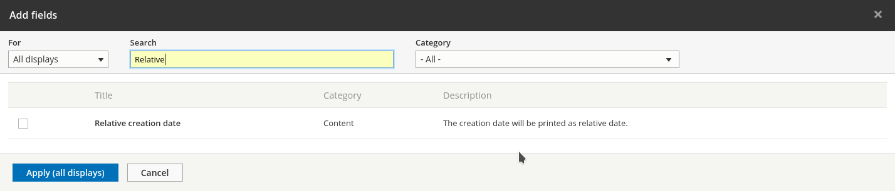
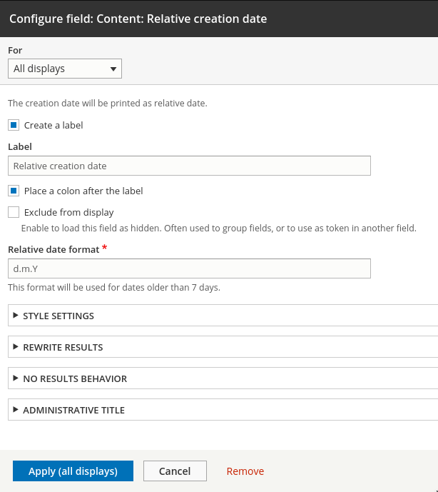
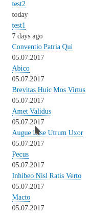
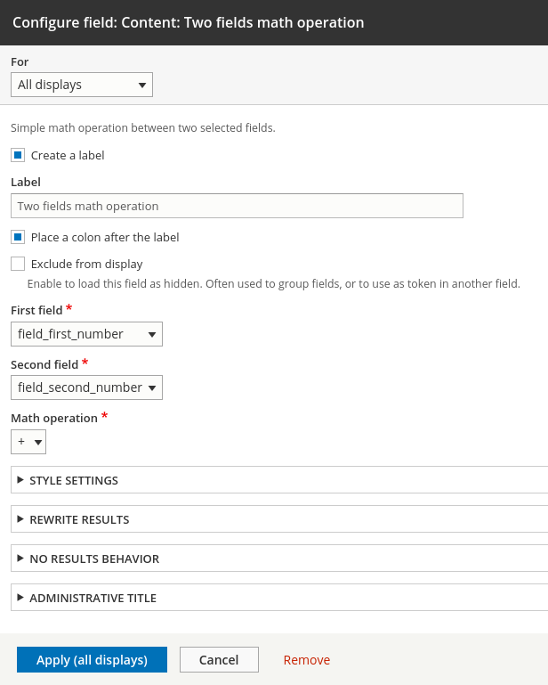
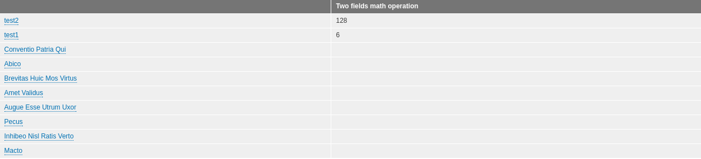

Потихоньку начал разбирать Views API и буду публиковать гайды по различным его
частям. В Drupal 7 мне всего пару раз довелось пописать плагины под Views и
особого понимания там так и не получил, во многом, наверное, что материалы по
которым я делал были очень и очень поверхностные. Даже сейчас, если погуглить по
тем же полям Views гайды, везде очень поверхностно и как правило очень
простенький пример в виде каркаса обьекта для поля. Поэтому, порывшись в
исходниках, я попытаюсь расписать более подробно, и раскрыть другие части views
в следующих статьях.

Большинство плагинов для Views объявляются по единому принципу и имеют очень
похожие структуры и поведение, поэтому данный материал я постараюсь сделать чуть
поподробнее, чтобы в дальнейших ссылаться на него.

## Из чего состоит плагин Views Field Handler

Первым делом нужно хорошо понимать что такое Views и как он работает. Иметь хоть
какой-то опыт кликанья там мышкой в каждом из его разделов. Думаю это не
составит проблем, особенно в 8-ке где Views уже в ядре и он очень сильно
задействован из коробки.

Затем, при помощи хука `hook_views_data_alter()` наше поле добавляется в
качестве виртуального поля для Views, в котором мы указываем всю необходимую
базовую информацию. Затем, мы уже объявляем плагин который полностью отвечает за
получение данных, генерацию, настройки т.д.

И это всё. Да, так просто. Вот только этого недостаточно для полного понимания
работы, особенно если требуется сделать поле посложнее.

Сам плагин поля является объектом который расширяет `FieldPluginBase`, а также
может содержать следующие методы:

- `query()`: метод для работы с запросом, про него ниже отдельный раздел.
- `defineOptions()`: значения настроек по умолчанию. Используется если вы хотите
  сделать свою форму с настройками для поля. Должен возвращать массив. Значения
  настроек хранятся в `$this->options` в виде массива.
- `buildOptionsForm(&$form, FormStateInterface $form_state)`: форма с
  собственными настройками для вашего поля, используется обычный Form API.
- `submitOptionsForm(&$form, FormStateInterface $form_state, &$options = [])`:
  метод вызываемый при субмите формы.
- `render(ResultRow $values)`: данный метод отвечает за вывод результата поля.
  Возвращает render array. Результатом может быть что угодно. Он принимает
  значения выполнения запроса и данные для конкретно текущего материала для
  которого рендирится поле. Если это view который работает с сущностями, то
  текущая сущность, для которой идет подготовка поля находится
  в `$values->_entity`, вы можете спокойно получать оттуда значения для своих
  нужд.
- `clickSortable()`: данный метод отвечает за то, можно ли данное поле
  сортировать или же нет. Используется в различных типах вывода, например "
  таблица", где нажав на заголовок столбца происходит сортировка таблицы по
  возрастанию\убыванию. Вот это значение отвечает за то, можно ли будет по нему
  сортировать. Возвращает `TRUE` или `FALSE`. Данный метод переопределяет
  настройки по умолчанию, которые также можно задать
  в `hook_views_data_alter()`. Данное значение по умолчанию является `TRUE`.
  Единственное его применение в коде потребуется только тогда, когда возможность
  сортировать по полю является динамическим и зависит от каких-то настроек
  самого поля, во всех остальных случаях оно включено, либо отключено прямо в
  хуке.
- `clickSort($order)`: метод, который отвечает за сортировку, если данное поле
  является доступным для сортировки и используется формат вывода поддерживающий
  сортировку по значениям полей. В данном методе вам нужно добавить
  в `$this->query` необходимую сортировку. `$order`, который передается в метод
  содержит запрошенный вариант сортировки, может принимать лишь `ASC` и `DESC`.
  Данный метод <mark>должен быть объявлен обязательно</mark>,
  если `clickSortable()` может возвращать `TRUE`, или вы не переопределили в
  хуке на `FALSE`. Отсутствие данного метода приведет к ошибке при попытке
  отсортировать по значению данного поля.

Это далеко не все методы которые могут быть использованы и задействованы, но
самые ходовые и необходимые. Остальные сильно специфические, и поняв как всё это
работает на данных методах, вам не составит труда понять что делают другие, так
как те что выше являются основными.

### query() и $this->query

_inb4 опять многА букАв_

Данный метод почему-то в гайдах обходят стороной, все оставляют его пустым и
пишут типа "нам не нужно корректировать запрос" и на этом всё. А что если нужно?
Как тогда это делать? Там не `\Drupal::database()->select()` и оно работает
несколько по другим правилам. Я считаю, что пропускать данный метод в гайдах про
Views Field Handler просто безумие, учитывая что Views это такой построитель
запросов, а поле зачастую является частью запроса, то не описать такую важную
часть, как внедрение в этот самый запрос, совершенно неразумно, это отрезает от
остального функционала данных полей. Да, сделать поле, которое выводит что-то
очень просто, но когда требуется сделать какой-то доп. запрос или как-то вообще
с ним поработать для поля, то не понимая как работает данный метод, это сделать
невозможно. Я уже сам [попался](http://dru.io/question/7940) на такое в Drupal
7, банально потому что у меня не было полной картины и понимания как оно
работает, так как и под 7-ку и под 8-ку все гайды просто описывают данный метод
как незначительный, при всём при этом это самый важный метод! По сути данный
метод и является самым движущим фактором для написания данной статьи. У андеада
есть [заметка](http://xandeadx.ru/blog/drupal/611) на этот счет, но тогда, опять
же, из-за того что я не видел всей картины, меня это не сдвинуло с мертвой
точки. Вообще, вся сложность работы с Views API, по сути, это понять как оно
работает под капотом, когда это понимание приходит, он становится не таким уж и
страшным, а даже логичным.

Чтобы понять данный метод, нужно понимать что View работает с конкретной
таблицой в БД. Например, выбрав при создании view "Содержимое", это означает что
он будет работать с таблицой `node` и добавляя какой-либо Handler для views,
буть то поле, сортировка, контекстуальный фильтр — они обязаны учитывать что они
будут использоваться только в пределах определенного view и табилцы БД. Таким
образом, данные полей получаются при помощи inner join запроса от этой таблицы,
сортировка основывается опять же, на данных текущей таблицы или также inner join
через связь в другую. Те же <abbr title="связи :|">relationships</abbr>, это
опять же join по какому-то значению из БД текущей таблицы или ранее подключенных
через связь. Это <mark>очень важно понимать</mark>, что запрос строится от
основной таблицы, остальные подключаются только в качествве join. <mark>Views
выполняет всего один запрос при генерации</mark>, и это тот самый запрос который
хранится в `$this->query` и который вы также можете править через специальные
для этого методы, главный из которых `query()`.

Соответственно, если ваше поле требует получать какие-то данные из БД, вам нужно
обращаться к `query()` методу. Тут, опять же, <mark>важно понимать</mark>
что `$this->query` — свойство объекта, которое содержит итоговый объект запроса,
общий для всех полей и Views в целом. Он содержит вообще всё что нужно и <mark>
выполняется один раз</mark>, а не каждый раз на каждое поле. Каждый handler и
плагин добавляет туда свои "требования" после чего он превращается в единый
большой запрос к БД, а полученный результат Views отдает каждому полю, в
зависимости от текущей обработки, а также затем это скармливает формату вывода,
чтобы он уже с готовыми данными подготовил нужный вывод. Тут <mark>нельзя писать
что хочешь</mark>. Если у вас не выходит через основной запрос получить нужные
данные, то вы, конечно же, можете сделать обычный запрос к БД и получить нужные
данные. Но, я не знаю верно это или нет, но что-то мне подсказывает что нет. И
не забывайте, что вызовится он один раз. Вызов самостоятельных запросов в других
методах, особенно в рендер методе, это явно проблема с логикей, с чем, как я
упоминал выше, и столкнулся когда делал поля для 7-ки, все данные в идеале
должны получаться при помощи одного единственного запроса.

Что можно сделать в данном методе? Подключить другие таблицы через связи, тем
самым добавив поля (значения столбца из другой таблицы), добавить дополнительные
condition к запросу (но лучше этого не делать тут) и многое другое. Тут <mark>
можно делать вообще все что угодно с запросом, но делать этого не стоит</mark>.
Опять же, надо четко понимать что за плагин вы делаете и что ему можно править.
Никто не мешает в плагине для поля поправить в запросе кол-во результатов на
страницу, или условия выборки (фильтрацию), но я думаю вы и сами понимаете,
такое потом никто не найдет, это говнокод. Если хотите повлиять на сортировку
значений (не поля, а именно результатов), надо делать плагин сортировки, если на
выборку, то плагин фильтрации. Об этом я позже распишу, но в целом они все
идентичные, просто на каждую задачу свой плагин, и не надо всё делать в одном
плагине. Каждый решает свою задачу и никакую другую.

Что же мы можем тут использовать? Сразу пишу, это список полезных методов, не в
контексте плагина поля, а вообще всех плагинов Views. Так вот, <mark>Views
использует для построения запроса не
стандартный</mark> `\Drupal::database()->select()`, а свой собственный
построитель
запроса [Sql.php](https://api.drupal.org/api/drupal/core!modules!views!src!Plugin!views!query!Sql.php/class/Sql/8.2.x) (
core/modules/views/src/Plugin/views/query/Sql.php). Да, и даже такие плагины
есть. Все его методы вы можете увидеть по ссылке, прямо на странице
вбивайте `Sql::` и смотрите, всё описывать не буду, опишу, на мой взгляд, самые
ходовые и полезные:

#### addField()

Как понятно из названия, служит для добавления в запрос дополнительных
значений (полей). Принимает следующие аргументы:

- `$table`: название таблицы которая будет подключена при помощи inner join
  или `NULL`. В случае `NULL` подразумевается что поле является формулой.
  Например, какое-то простенькое математическое выражение на основе существующих
  полей. В случае если указали название таблицы, она обязана существовать, Views
  это проверит автоматически.
- `$field`: название поля которое будет добавлено (столбца из таблицы указнной
  выше). Если в первом аргументе указано `NULL`, то тут должна быть формула.
- `$alias`: синоним для значения, который будет использоваться в дальнейшем.
  Например, если вы передадите первые два параметра `node__body`
  и `body_summary` соответственно, то указав синоним `body`, значение будет
  доступно по данному синониму. Это делается на уровне SQL запроса в том числе,
  например, текущий пример будет построен как `node__body.body_summary AS body`.
  Вы можете использовать данный синоним для дальнейших нужд при запросе,
  например при добавлении поля формулы вы уже сможете ссылаться на значение при
  помощи синонима. Автоматически Views дает синоним по следующему
  шаблону `$table_$field`. Вы можете передать `NULL` чтобы отключить присвоение
  синонима.
- `$params`: массив с дополнительными параметрами. Может принимать `function`
  который может содержать функцию для аггрегации, например `SUM`, а
  также `aggregate`, который в случае `TRUE` пометит поле что оно требует
  аггрегации. <mark>Используется самим Views</mark>, самим это использовать нет
  никакого смысла, никакого эффекта не даст. Так что этот параметр можно всегда
  смело опускать.

Данный метод возвращает строку с синонимом поля. Если потрбуется, можете
принимать, но как правило нет смысла.

Собственно данный метод служит для добавления каких-либо данных к текущему
запросу. Он самый полезный при работе с полями. Вот несколько примеров:

```php {"header":"Примеры $this->query->addField()"}
// Assuming your node entity has fields 'field_example_first` and 'field_example_second' as
// integers.

// Add first field.
$this->query->addField('node__field_example_first', 'field_example_first_value', 'first');
// Add second field.
$this->query->addField('node__field_example_second', 'field_example_second_value', 'second');
// Calculate SUM of this two fields. You CAN'T use aliases here.
$this->query->addField(NULL, 'node__field_example_first.field_example_first_value + node__field_example_second.field_example_second_value', 'first_second_sum');
```

Значения полей подключаются при помощи inner join запроса, и если вы знаете что
это такое и как оно работает, у вас должен был появиться вопрос, а как же связь?
Связи устанавливаются автоматически на основе объявления данного типа данных для
Views. Например у `node` связь идет через `entity_id` у таблицы которая
подключается. Так что просто так не подключить что попало, подключаемая табилца,
для `node` должна содержать столбец с `entity_id`, который и будет задействован
для связи и получения значения. Например, для сущности File, связующим столбцом
будет `fid`. Всё это можно посмотреть у тех модулей, что объявляют таблицы для
Views в файле `MODULENAME.views.inc` в хуке `file_field_views_data` (
см. `base field`). Вообще, это касается по сути только кастомных таблиц, для
остальных сущностей интеграция происходит автоматическая, и надо смотреть в
объявление сущности на их entity key id (src/Entity/EntityName.php модуля где
объявляется сущность). _Тут могу немного ошибаться, если дальше в раскопках
обнаружу иное поведение, заменю. Или можете в комментах меня поправить._

#### Condition()

Это не совсем метод, но это очень важный объект для дальнейшего описания
методов. Позволяет создать условие для запроса, в виде объекта, для дальнейшего
использования его в методах. Сначала объявляется `Condition()` нужного типа и
записывется в переменную, затем добавляются условия, и данная переменная
передается методам которые это поддерживают. Принимает различные операторы для
сравнения основнывая на SQL запросах.

```php {"header":"Пример Condition()"}
$or = new Condition('OR');
$or->condition('field_name', 'VALUE');
$or->condition('field_name2', 'VALUE', '<>');
$or->condition('field_name2', 'VALUE', 'IS NULL');
$this->query->addWhere(0, $or)
```

Это замена `db_or()` и подобным функциям из 7-ки.

#### addWhere()

Данный метод служит для добавления условий выборки запросу. Принимает следующие
аргументы:

- `$group`: название группы для которой будет использовано условие. Если
  указанной группы не существует, то она будет создана, если же не нужно вообще,
  указывается `0` (общая, по умолчанию).
- `$field`: название поля по которому будет проводиться проверка. В данный
  аргумент можно передавать `DatabaseCondition` объект (см. предыдущий
  пример `Condition()`).
- `$value = NULL`: значение по которому будет производиться условие. Может быть
  как простым значением на проверку, так и массивом с данными, где каждый
  элемент массива будет зависеть от `$operator`.
- `$operator = NULL`: оператор сровнения SQL.
  Например: `=`, `<`, `>=`, `IN`, `LIKE`, `BETWEEN` и т.д. По умолчанию, если
  передан `NULL`, будет использоваться сравнение `=`.

```php {"header":"Пример addWhere()"}
// Aliases doesn't supported here.
// WHERE (node__field_example_first.field_example_first_value = '2')
$this->query->addWhere(0, 'node__field_example_first.field_example_first_value', 2);
// WHERE (node__field_example_first.field_example_first_value IN ('1', '2', '3'))
$this->query->addWhere(0, 'node__field_example_first.field_example_first_value', ['1', '2', '3'], 'IN');
// WHERE ((node__field_first_number.field_first_number_value IN ('1', '2', '3')) AND (node__field_first_number.field_first_number_value LIKE 'test' ESCAPE '/')) … else
$this->query->addWhere('my_group', 'node__field_first_number.field_first_number_value', ['1', '2', '3'], 'IN');
$this->query->addWhere('my_group', 'node__field_first_number.field_first_number_value', 'test', 'LIKE');
```

#### addOrderBy()

А данный метод ответчает за сортировку (`ORDER BY`) результатов запроса. Данный
метод можно использовать в Views полях в определенном случае (`clickSort()`),
для этого будет отдельный пример.

Принимает следующие аргументы:

- `$table`: название таблицы по которой будет производиться сортировка. Если
  сортировка должны быть по какой-то формуле, то указывается `NULL`.
- `$field = NULL`:  поле (столбец таблицы), по которому будет производиться
  сортировка, если нужна формула, как и выше, указывается `NULL`.
- `$order = 'ASC'`: вид сортировки, либо `ASC` — по возрастанию, либо `DESC` —
  по убыванию.
- `$alias = ''`: синоним для поле, по которому будет производиться сортировка.
  Аналогично из `addField()`. Если первые два аргумента переданы как `NULL`, тут
  можно указать уже существующий синоним, и по нему будет произведена
  сортировка.
- `$params = []`: дополнительные параметры при добавления поля
  через `addField()` (если указаны первые два).

```php {"header":"Пример addOrderBy()"}
$this->query->addOrderBy('node__field_example_first', 'field_first_number_value', 'ASC', 'first');
// If field is already added 
$this->query->addField('node__field_example_second', 'field_example_second_value', 'second');
$this->query->addOrderBy(NULL, NULL, 'DESC', 'second');
```

#### addTag()

Это очень простенький метод, я даже примеров приводить не буду. В него
передается лишь один аргумент с названием тега. Данный тег будет добавлен
запросу, в дальнейшем, чтобы в логах запросов вы могли найти запросы которые
помечены им, и решить какие-то проблемы, если такие возникли.

#### $this->ensureMyTable()

Если вы собираетесь использовать `query()` метод, в начале принято
писать `$this->ensureMyTable()`, так как он проверяет, добавлена ли основная
таблица по которой будет проходить запрос, непосредственно в сам запрос, во
избежание проблем с генераций самого запроса. Без него тоже будет работать, но
возможно при каких-то обстоятельствах произойдет сбой. Так что не поленитесь
написать :)

Я задел все основные методы для построения запроса Views. Если вы их поняли, и
поняли что Views работает на одном запросе, то считайте вы уже поняли как делать
все плагины, и учитывать особенности Views с его запросом. Это самая сложная
часть для понимания, серьезно. Она совершенно не очевидна без пинка или если не
копать в сам Views. Надеюсь это вам хоть как-то облегчит понимание того что
происходит под капотом у Views.

Возвращаемся непосредственно к нашему главному топику, о том как добавлять поля.
Так как всё уже разжевано, и то как создается, и то как можно подлезать к
запросу, осталось только набросать примеров.

## Пример №1

Данный пример будет очень простой, примерно то что все и показывают в своих
гайдах. В нём мы добавим к таблице `node` поле "Относительная дата создания",
которое будет выводить дату создания по принципу: сегодня, вчера, позавчера, 3
дня назад, …, 7 дней назад, d.m.Y. Иными словами, дата будет выводиться текстом,
а спустя 7 дней, на 8-ой, становиться обычной в нужном формате. В данном случае
нам даже не придется влезать в запрос, так как дата создания материала
автоматически добавляется для `node` самим Views.

Первым делом нам нужно объявить наше поле для Views. Так как мы добавляем свое "
поле" в чужую БД, мы должны добавлять информацию о нем через alter. Для этого
используется `hook_views_data_alter()`. Данный хук в 8-ке нужно писать
в `MYMODULE.views.inc`. Он также будет работать и в обычном `MYMODULE.module`,
но это своего рода такой стандарт в 8-ке, чтобы четко видеть что в конкретном
модуле есть какая-то интеграция с Views.

Добавляем наше поле:

```php {"header":"dummy.views.inc"}
<?php

/**
 * @file
 * Views hooks.
 */

/**
 * Implements hook_views_data_alter().
 *
 * Alter DB tables defined via hook_views_data().
 */
function dummy_views_data_alter(array &$data) {
  $data['node']['dummy_created_relative'] = [
    'title' => t('Relative creation date'),
    'field' => [
      'title' => t('Relative creation date'),
      'help' => t('The creation date will be printed as relative date.'),
      'id' => 'dummy_created_relative',
    ],
  ];
}
```

Бегло пробегусь по хуку, так как это первый пример.

`$data` содержит информацию о всех таблицах подключенных к Views
через `hook_views_data`. Вы можете добавлять в каждую из них свои поля, например
циклом, или в какие-то конкретные, как в данном примере `node`. Первый ключ —
название таблицы, воторой — название поля. Будьте аккуратны, там уже есть другие
данные и также добавленные поля, не поломайте случайно ничего. Для безопасности,
так как вы лезете в чужую таблицу, лучше добавлять названию поля также название
модуля, чтобы наверняка.

Дальше задается масив с данными. В нашем случае поле, и нам нужно указать:

- `title`: заголовок для нашего поля что мы объявляем. Не могу сказать где точно
  данный заголовок используется, я не обнаружил. Возможно чтобы в альтере другие
  поняли что к чему.
- `field`: массив с информацией о новом поле для указанной таблицы:
  - `title`: название поля, будет отображаться во Views UI.
  - `help`: описание поля, будет отображаться во Views UI.
  - `id`: машинное название поля, <mark>по нему Views будет искать</mark> Field
    Handler Plugin.
  - `click sortable`: можно установить `FALSE` если сортировку по полю надо
    жестко отключить.
    Далее нам уже нужно объвлять сам плагин поля. Плагины Views находятся по
    пути `src/Plugin/views`, далее, там каждый тип плагина имеет свою папку. Для
    полей это очевидный `field`. Называть объект для поля, лучше всего как и
    само машинное поле, только трансформировав его в CamelCase. В итоге, для
    нашего примера нужно создать `DummyCreatedRelative.php`.

Мы также добавим настройки для нашего поля, мы дадим пользователям возможность
задавать формат даты, которая будет выводиться спустя 7 дней, а по умолчанию она
будет d.m.Y.

Вот собственно и код поля:

```php {"header":"src/Plugin/views/field/DummyCreatedRelative.php"}
<?php

namespace Drupal\dummy\Plugin\views\field;

use Drupal\Core\Form\FormStateInterface;
use Drupal\views\Plugin\views\field\FieldPluginBase;
use Drupal\views\ResultRow;

/**
 * @ingroup views_field_handlers
 *
 * @ViewsField("dummy_created_relative")
 */
class DummyCreatedRelative extends FieldPluginBase {

  /**
   * {@inheritdoc}
   */
  public function query() {
    // We don't need to modify query for this particular example.
  }

  /**
   * {@inheritdoc}
   */
  protected function defineOptions() {
    $options = parent::defineOptions();
    $options['relative_date_format'] = ['default' => 'd.m.Y'];
    return $options;
  }

  /**
   * {@inheritdoc}
   */
  public function buildOptionsForm(&$form, FormStateInterface $form_state) {
    $form['relative_date_format'] = [
      '#type' => 'textfield',
      '#required' => TRUE,
      '#title' => $this->t('Relative date format'),
      '#description' => $this->t('This format will be used for dates older than 7 days.'),
      '#default_value' => $this->options['relative_date_format'],
    ];
    parent::buildOptionsForm($form, $form_state);
  }

  /**
   * {@inheritdoc}
   */
  public function render(ResultRow $values) {
    $created = $values->node_field_data_created;
    // Default result if conditions will fail.
    $pub_date = date($this->options['relative_date_format'], $created);
    if ($created >= strtotime('today')) {
      $pub_date = $this->t('today');
    }
    else if ($created >= strtotime('-1 day')) {
      $pub_date = $this->t('tomorrow');
    }
    else if ($created >= strtotime('-2 days')) {
      $pub_date = $this->t('day before yesterday');
    }
    else if ($created >= strtotime('-3 days')) {
      $pub_date = \Drupal::translation()->formatPlural(3, '@count day ago', '@count days ago', ['@count' => 3]);
    }
    else if ($created >= strtotime('-4 days')) {
      $pub_date = \Drupal::translation()->formatPlural(4, '@count day ago', '@count days ago', ['@count' => 4]);
    }
    else if ($created >= strtotime('-5 days')) {
      $pub_date = \Drupal::translation()->formatPlural(5, '@count day ago', '@count days ago', ['@count' => 5]);
    }
    else if ($created >= strtotime('-6 days')) {
      $pub_date = \Drupal::translation()->formatPlural(6, '@count day ago', '@count days ago', ['@count' => 6]);
    }
    else if ($created >= strtotime('-7 days')) {
      $pub_date = \Drupal::translation()->formatPlural(7, '@count day ago', '@count days ago', ['@count' => 7]);
    }

    return [
      '#markup' => $pub_date,
    ];
  }

  /**
   * {@inheritdoc}
   */
  public function clickSort($order) {
    $this->query->addOrderBy('node_field_data', 'created', $order);
  }

}
```

Тут должно быть всё ясно, так как каждый метод описан отдельно. Единственное на
что я обращу внимание, то что тут отсутствует `submitOptionsForm()`. Настройки
сохраняются автоматически если их названия сходятся. Этот метод нужен только для
более сложных структур, а также обработки значений из формы перед сохранением,
если это требуется.

Сбросив кэш, данное поле станет доступно для использования и добавив его, оно
начнет выводить свои значения.







## Пример №2

В данном примере мы добавим поле которое будет производить простые
арифметические выражения между двумя полями сущности. Мы дадим пользователю
возможность выбирать необходимые два поля и математическую операцию которая
будет выполнена. Всё очень просто, возможно бесполезно, но тут какраз в дело
пойдет `query()`, так как поля заранее не известны нам, и нам нужно будет
динамически данные поля добавлять в запрос.

Математическую операцию мы будем проводить в `render()`, хотя это возможно
сделать прямо в запросе, так как они простые и общие для всех. Поэтому, так как
результат не будет доступен в запросе, мы отключим сортировку по данному полю,
заодно и будет видно как можно отключить её без метода.

На выбор пользователю мы будем предоставлять только поля из сущности `node`, и
только типов `integer`, `float`, `decimal`.

Собственно начнем как и раньше, с добавления инфомрации о поле
в `hook_views_data_alter()`:

```php {"header":"dummy.views.inc — dummy_views_data_alter()"}
$data['node']['dummy_two_fields'] = [
  'title' => t('Two fields math operation'),
  'field' => [
    'title' => t('Two fields math operation'),
    'help' => t('Simple math operation between two selected fields.'),
    'id' => 'dummy_two_field_math',
    'click sortable' => FALSE,
  ],
];
```

Ну и сам код поля:

```php {"header":"src/Plugin/views/field/DummyTwoFieldMath.php"}
<?php

namespace Drupal\dummy\Plugin\views\field;

use Drupal\Core\Form\FormStateInterface;
use Drupal\field\Entity\FieldStorageConfig;
use Drupal\views\Plugin\views\field\FieldPluginBase;
use Drupal\views\ResultRow;

/**
 * @ingroup views_field_handlers
 *
 * @ViewsField("dummy_two_field_math")
 */
class DummyTwoFieldMath extends FieldPluginBase {

  /**
   * {@inheritdoc}
   */
  public function query() {
    $this->ensureMyTable();
    $first_field = $this->options['first_field'];
    $second_field = $this->options['second_field'];
    if ($first_field && $second_field) {
      $table = $this->table;
      $first_field_db_table = $table . '__' . $first_field;
      $second_field_db_table = $table . '__' . $second_field;
      $this->query->addField($first_field_db_table, $first_field . '_value', 'dummy_first_field');
      $this->query->addField($second_field_db_table, $second_field . '_value', 'dummy_second_field');
    }
  }

  /**
   * {@inheritdoc}
   */
  protected function defineOptions() {
    $options = parent::defineOptions();
    $options['first_field'] = ['default' => NULL];
    $options['second_field'] = ['default' => NULL];
    $options['math_operation'] = ['default' => '+'];
    return $options;
  }

  /**
   * {@inheritdoc}
   */
  public function buildOptionsForm(&$form, FormStateInterface $form_state) {
    $field_options = $this->getFieldOptions();
    $form['first_field'] = [
      '#type' => 'select',
      '#title' => $this->t('First field'),
      '#required' => TRUE,
      '#options' => $field_options,
      '#default_value' => $this->options['first_field'],
    ];
    $form['second_field'] = [
      '#type' => 'select',
      '#title' => $this->t('Second field'),
      '#required' => TRUE,
      '#options' => $field_options,
      '#default_value' => $this->options['second_field'],
    ];
    $form['math_operation'] = [
      '#type' => 'select',
      '#title' => $this->t('Math operation'),
      '#required' => TRUE,
      '#options' => [
        '+' => '+',
        '-' => '-',
        '*' => '*',
        '/' => '/',
      ],
      '#default_value' => $this->options['math_operation'],
    ];
    parent::buildOptionsForm($form, $form_state);
  }

  /**
   * {@inheritdoc}
   */
  public function render(ResultRow $values) {
    if (isset($values->dummy_first_field) && isset($values->dummy_second_field)) {
      $result = NULL;
      switch ($this->options['math_operation']) {
        case '+':
          $result = $values->dummy_first_field + $values->dummy_second_field;
          break;

        case '-':
          $result = $values->dummy_first_field - $values->dummy_second_field;
          break;

        case '*':
          $result = $values->dummy_first_field * $values->dummy_second_field;
          break;

        case '/':
          $result = $values->dummy_first_field / $values->dummy_second_field;
          break;
      }

      return [
        '#markup' => $result,
      ];
    }
  }

  /**
   * {@inheritdoc}
   */
  public function getFieldOptions() {
    $allowed_type_list = ['integer', 'float', 'decimal'];
    $exclude_fields = ['nid', 'vid'];
    $field_map = \Drupal::service('entity_field.manager')->getFieldMap();
    $options = [];
    foreach ($field_map['node'] as $field_name => $field_info) {
      if (in_array($field_info['type'], $allowed_type_list) && !in_array($field_name, $exclude_fields)) {
        $options[$field_name] = $field_name;
      }
    }
    return $options;
  }

}
```

После этого сбрасываем кэш, и наслаждаемся!





На этом думаю хватит. Принцип работы полей и Views с его запросом должен стать
куда яснее. Далее, чуть позже, я понапишу гайды про остальные хендлеры. Если вам
прямо нетерпится и их попробовать, принцип у них одинаковый, даже объявляются
одинакого, только вместо `field` везде используется нужный тип плагина. Их
особенности можно всегда разрыть в ядре у самого views.

## P.s.

И возможно, у вас когда-нибудь назреет вопрос как был в своё время у меня и
из-за чего я жестко забуксовал с Views. Допустим вы сделали поле которое по
какой-то сложной формуле считает что-либо, например рейтинг пользователя, вы
сделали поле, всё выводится, всё круто, но вот решили сделать сортировку по
данному полю. Если сортировать нужно все результаты, а не в таблице, то
во-первых, нужно писать `sort` плагин, а во-вторых, результат подсчета придется
где-то хранить в БД. Т.е. нужно создавать новую таблицу, и там хранить результат
рассчетов с проставлением связей с нужными материалами чтобы Views смог
заджойнить данные таблицы. И только тогда вы сможете сделать сортировку по
данному значению.

## Ссылки

- [Исходный код модуля с примером](example/dummy)
