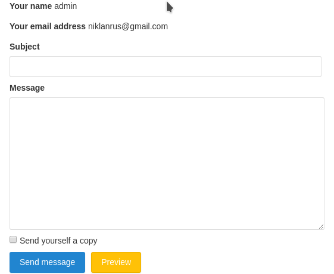
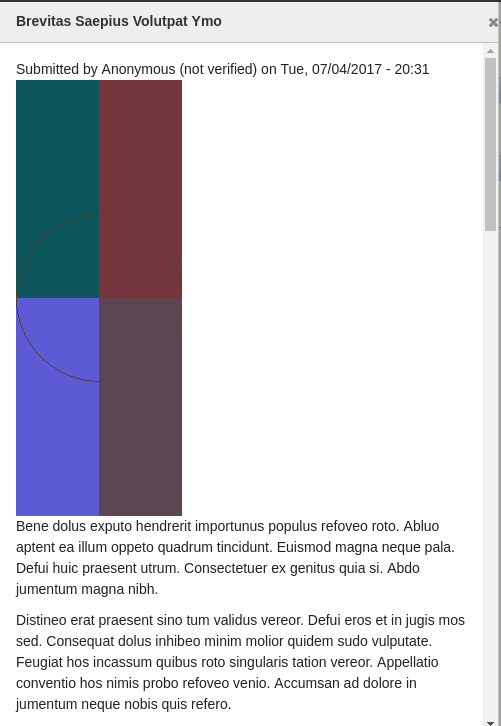

Кто-то, наверное, уже читал мою статью о том [как я верстаю на DS+FG](/blog/86)
в Drupal 7. В 8-ке, я, конечно же, начал делать также и всё работает, абсолютно
также как и в 7-ке. Но я начал замечать что в реалиях 8-ки это не самый
сбалансированный способ верстки и попробовал поверстать через темплейты, которые
перевели на шаблонизатор Twig со всеми вытекающими. Я был приятно удивлен что
это быстрее, приятнее, удобнее и лишено недостатков которые были в 7-ке и с
PHPTemplate, и пробовал, пробовал и ещё раз пробовал, за последнюю неделю у меня
уже четко устоялось, что DS+FG в 8-ке пашет, но это уже не лучший способ и
подход, хотя в 7-ке, если придется, я продолжу так делать, но вот в 8-ке, уж как
бы я не любил DS, он просто похоронен Twig, пока что я не вижу применения для DS
вообще. Лейауты особо не нужны, но они в ядре, интерфейс для вариантов
отображения в ядре, в случае с твиг темплейтами, кастомные поля не нужны, и
собственно, DS становится не нужен. Но статья не об этом.

Twig очень жестко ограничивает возможности в своих темплейтах, так что там
нагадить как в 7-ке с PHPTemplate, надо постараться. Понятно что будут такие
проекты всплывать, но не так часто и тут уже придется реально заморочиться чтобы
наговнокодить. Банально SQL запросов и прочих обработчиков сущностей не будет в
темплейтах. Так как твиг изначально ограничивает возможности, в нем есть
возможность добавлять функции и фильтры для того чтобы расширять его базовую
функциональность, Drupal добавляет парочку своих, а также для этого есть
инструментарий, чтобы каждый желающий мог добавить свои фильтры и функции через
модули. Я сразу рекомендую
использовать [Twig Tweak](https://www.drupal.org/project/twig_tweak), так как он
покроет большинство
самых [востребованных функций и фильтров](https://www.drupal.org/docs/8/modules/twig-tweak/cheat-sheet),
но не вступайте на темную сторону, не включайте php фильтр.

Если вы видите что вы из проекта в проект или внутри одного проекта, постоянно
что-то делаете в препроцессах, что можно как-то унифицировать в виде функции и
фильтра, сделайте его, не поленитесь, ведь это делается в буквальном смысле за
пару минут. Twig расширения делятся на два типа:

- **функции** (`{{ my_function() }}`): работают по аналогии с функциями в php,
  вы вызываете функцию, передаете, если нужно, параметры, функция возвращает
  результат и Twig её выводит или записывает в переменную.
- **фильтры** (`{{ 'Some data' | my_filter }}`): это такие обработчики которые
  применяются к выводимому значению, то есть применяются в тех случаях, когда
  необходимо как-то обработать выводимые данные. Их особенность в том, что их
  легко применять друг за другом: `{{ 'Some data' | filter1 | filter2 }}`.
  Выполняться они будут в указанном порядке, каждому последующему будет
  передаваться результат выполнения предыдущего фильтра, они также могут
  принимать аргументы.

В этом гайде я распишу базовое их применение. Twig имеет достаточно широкий API,
за их более детальными описаниями обращайтесь
к [документации Twig](https://twig.symfony.com/doc/2.x/advanced.html), она
исчерпывающая поняв как это работает внутри Drupal, не составит труда
пользоваться всем API.

## Этапы объявления расширения Twig в Drupal 8

Twig в Drupal 8 идет без каких-либо особых друпальных фишек, практически в голом
виде как есть, единственное, вам необходимо объявлять свои расширения
как [Drupal сервисы](/blog/150). В общем то это вся особенность. А полностью
этапы выглядят следующим образом:

1. Создание объекта\объектов для будущих функций и фильтров. Хранить ли все в
   одном объекте, или делить на несколько, выбор за вами, разницы абсолютно
   никакой.
2. В объекте объявляются соотстветствующие методы `getFunctions()`
   и `getFilters()`, которые возвращают массивы с названием фильтра\функции и
   колбека.
3. Вы создаете колбек, обычно это метод текущего объекта где и описывается вся
   логика с возвращением результата.
4. Данный объект объявляется как сервис.
5. ????
6. PROFIT!

Всё. Погнали за примерами, ибо это действительно так просто.

_Twig Tweak просто не оставляет никаких шансов для меня, я с большим трудом
придумал эти примеры, так как самые очевидные покрыты тем модулем и смысла их
расписывать нет, можете
сами [посмотреть в исходниках](http://cgit.drupalcode.org/twig_tweak/tree/src/TwigExtension.php),
считайте после статьи будет всё ясно и это будет с десяток доп. примеров._

_Все дальнейшие примеры подразумевают что код пишется в модуле с названием
dummy._

## Пример №1 — функция

Сразу оговорюсь, что все примеры у нас будут в одном объекте, поэтому в первом
примере будет полная структура, а в остальных лишь то что добавлено, не
теряйтесь!

Объекты для Twig расширений могут находиться где угодно внутри папки `src`
модуля, который их объявляет. Четких указаний нет, но я, как обычно, последую
примеру из ядра что я смог отрыть и положу объект в `src/Twig/Extension`.

Итак, первый пример будет очень простой, мы сделаем функцию, которая будет
возвращать текущий адрес сайта с протоколом, например `http://example.com` (без
слеша на конце).

Создаем наш файл с объектом и добавляем нужный код:

```php {"header":"src/Twig/Extension/Extensions.php"}
<?php

namespace Drupal\dummy\Twig\Extension;

/**
 * Custom twig extensions.
 */
class Extensions extends \Twig_Extension {

  /**
   * {@inheritdoc}
   */
  public function getFunctions() {
    $functions = [];

    $functions[] = new \Twig_SimpleFunction('site_url', [
      $this,
      'siteUrl',
    ]);

    return $functions;
  }

  /**
   * Return the base site URL with protocol.
   */
  public function siteUrl() {
    return \Drupal::request()->getSchemeAndHttpHost();
  }

}
```

Теперь нужо подключить данный объект в качестве сервиса чтобы Drupal его нашел.
Для этого в корне модуле создаем, если нет, **dummy.services.yml** и добавляем:

```yaml {"header":"dummy.services.yml"}
services:
  dummy.twig_extensions:
    class: Drupal\dummy\Twig\Extension\Extensions
    tags:
      - { name: twig.extension }
```

Теперь, сбросив кэширование, у вас будет возможность использовать данную функцию
во всех Twig шаблонах.

```html {"header":"Примеры использования"}
{{ site_url() }}

{{ site_url }}
```

Это достаточно простой пример не имеющий никакой ценности. В нем мы разберем сам
объект и методы.

Как вы можете заметить, метод `getFunctions()` возвращает массив, где каждый
элемент массив является экземпляром `\Twig_SimpleFunction()` в который первый
аргументом передается название функции, которое будет использоваться в Twig, а
вторым, либо строка с названием функции, либо массив из экземпляра объекта и
названия метода данного объекта.

Затем мы объявляем наш метод, и возвращаем нужный результат. Так как функция не
имеет аргументов, то нам ничего обрабатывать и не нужно.

## Пример №2 — функция

В данном примере мы добавим функцию, которая будет выводить форму модуля
Contact. В качестве аргумента будет передаваться название формы, если оно не
будет передано, то будет возвращена форма по умолчанию (которая выбрана в
настройках contact).

Первым делом добавляем информацию о функции и методе, который нужно вызвать:

```php {"header":"Extensions::getFunctions()"}
$functions[] = new \Twig_SimpleFunction('contact_form', [
  $this,
  'contactForm',
]);
```

А теперь напишем метод со всей логикой:

```php {"header":"Extensions::contactForm()"}
/**
 * Return contact form if set otherwise default will be printed.
 */
public function contactForm(string $contact_form_id = 'default_form') {
  $contact_message = \Drupal::entityTypeManager()
    ->getStorage('contact_message')
    ->create([
      'contact_form' => $contact_form_id,
    ]);
  $form = \Drupal::service('entity.form_builder')
    ->getForm($contact_message, 'default');
  $form['#title'] = $contact_message->label();
  $form['#cache']['contexts'][] = 'user.permissions';
  return $form;
}
```

А вызывать это можно следующим образом:

```php {"header":"Примеры"}
{# Will print default contact form selected in contact admin settings #}
{{ contact_form() }}

{# Print specific form #}
{{ contact_form('feedback') }}
```



Если вы пользуетесь модулем Contact, то могу посоветовать не париться и
взять [мой модуль](https://github.com/Niklan/contact_tools) где есть аналогичный
вызов для Twig, и не только, с поддержкой AJAX отправки, а также добавление
ссылок с вызовом форм в модальном окне, аналогично, с аяксом или нет, внизу
страницы примеры. _Модуль стабильный, на 100% рабочий, но не обновляйте, я пока
архитектурно его не завершил, и возможны ломающие совместимость изменения, так
что просто не обнлвяйте, заливайте как кастом._

Действительно удобно?

## Пример №3 — функция

В этом примере мы сделаем следующее. Мы будем генерировать сыслку, при нажатии
на которую, будет грузиться нода в модальном окне при
помощи [Modal API](/blog/125). Мы будем принимать id ноды, заголовок для ссылки
мы сделаем не обязательным, и если данный аргумент не указан, то заголовком
ссылки станет заголовок материала, а третьим аргументом будем принимать
дополнительные параметры для ссылки, где можно передать настройки для модальных
окон, установить классы и т.д.

Начинаем, как и раньше, с объявления функции:

```php {"header":"Extensions::getFunctions()"}
$functions[] = new \Twig_SimpleFunction('node_modal_link', [
  $this,
  'nodeModalLink',
]);
```

```php {"header":"Extensions::nodeModalLink()"}
/**
 * Prints link which open node in modal window.
 */
public function nodeModalLink(int $nid, string $link_title = NULL, array $link_options = []) {
  $link_options_defaults = [
    'attributes' => [
      'class' => ['use-ajax'],
      'data-dialog-type' => 'modal',
      'data-dialog-options' => [
        'width' => 'auto',
      ],
      'rel' => 'nofollow',
    ],
  ];

  // This array is not need to be merged.
  if (!empty($link_options['attributes']['data-dialog-options']['width'])) {
    unset($link_options_defaults['attributes']['data-dialog-options']['width']);
  }
  $link_options_merged = array_merge_recursive($link_options_defaults, $link_options);
  // Modal settings must be in json format.
  $link_options_merged['attributes']['data-dialog-options'] = Json::encode($link_options_merged['attributes']['data-dialog-options']);

  if (!$link_title) {
    $node = Node::load($nid);
    $link_title = $node->label();
  }

  return [
    '#type' => 'link',
    '#title' => $link_title,
    '#url' => Url::fromRoute('entity.node.canonical', ['node' => $nid]),
    '#options' => $link_options_merged,
    '#attached' => ['library' => ['core/drupal.dialog.ajax']],
  ];
}
```

```html {"header":"Примеры"}
{{ node_modal_link(4993) }}

{{ node_modal_link(4993, 'Read this!') }}

{# Pass options. #}

{{ node_modal_link(4993, null, modal_options) }}
```



И послее что осталось, фильтры.

## Пример №4 — фильтр

Пример с фильтром будет один, так как я и его то еле придумал, а всё остальное
как функций. Мы сделаем фильтр, который строку с номером телефона превращает в
ссылку с `tel:`. Очень простой, он даже не будет парсить строку регуляркой, т.е.
будет прямо оборачивать что дали. Будем только удалять пробелы, скобочки, и
черточки чтобы ссылка была валидной.

Отличие фильтров от методов лишь в том, что они в Twig вызываются иначе,
объявляются в методе `getFitlers()` анологичным функциям способом. Вот только в
колбек тут всегда передается первым аргументом результат к которому применили
фильтр, а остальными аргументами, то что передано через `|filter(arg1, arg2)`.
Наш же фильтр будет простой, без аргументов.

```php {"header":"Extensions::getFilters()"}
/**
 * {@inheritdoc}
 */
public function getFilters() {
  $filters = [];

  $filters[] = new \Twig_SimpleFilter('tel', [
    $this,
    'tel',
  ]);

  return $filters;
}
```

```php {"header":"Extensions::tel()"}
/**
 * Return tel link.
 */
public function tel(string $phone) {
  // Replace all spaces, brackets and dashes to valid tel phone number.
  $tel = preg_replace('/\s+|\(|\)|-/', '', $phone);
  // Workaround for issue #2484693
  return new FormattableMarkup('<a href="tel:@tel">@phone</a>', [
    '@tel' => $tel,
    '@phone' => $phone,
  ]);
}
```

```html {"header":"Пример использования"}
{{ '+7 (900) 123-45-67' | tel }}
```

Вот так вот объявляются Twig расширения в виде функций и фильтров. Всё
действительно настолько просто, зато как это может облегчать жизнь и избавлять
от кучи препроцессов в каждом втором темплейте.
