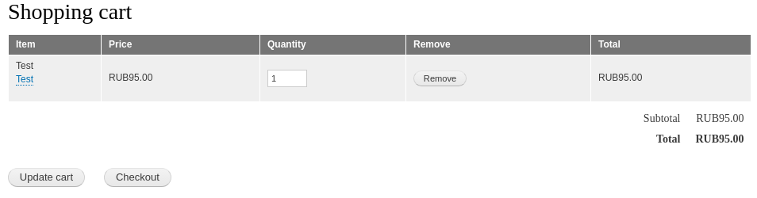

В этом материале я расскажу как влиять на цены товаров в Drupal Commerce 2.0 (
Drupal 8). Если вы знакомы с ценообразованием в Drupal Commerce 1 (D7), то
наверняка помните что цена формировалась из ценовых компонентов, а также
контролировалась при помощи модуля Rules. В новой версии интеграции с Rules из
коробки нет (а может есть, я Rules не ставил), зато есть крутой API, который
позволяет внедряться на любых этапах работы магазина и делать что хочешь. По
первому опыту работы с новым коммерцем, могу сказать, что опыт очень приятный,
особенно это касается кода. Его стало писать проще, легче, он стал прозрачнее и
понятнее.

Так вот, иногда нам нужно влиять на цену товара. Задач может быть просто уйма.
Например, надо скинуть цену для определенной роли, если в корзине лежит другой
товар, или же сбавлять цену от кол-ва товара. Например, 1-10 товаров 100%
стоимости, 11-20 — 95% от стоимости и т.д. Всё это работа ценообразования, и для
этого есть очень простые инструменты для работы.

Для влияния на цену коммерц предоставляет Price Resolver. Это такой обьект, в
него передаётся вся необходимая информация в момент расчета цены, и вы уже
делаете что хотите.

Price Resolver состоит из двух частей:

1. Непосредственно сам Price Resolver — который является очень простеньким
   объектом со всеми необходимыми методами для влияния на цену.
2. Данный resolver объявляется в качестве соответствующего сервиса чтобы drupal
   commerce его смог найти.

Один важный момент — Price Resolver влияет на цену **только** внутри корзины,
т.е. на цену line item, и на странице товара будет оригинальная цена из поля
цены.

_Далее по коду, модуль в котором пишется код — dummy_

## Price Resolver

Вы можете делать сколько угодно данных price resolver объектов, все они будут
применяться (следуя определенным условиям). Тут вы уже сами разберетесь, когда
делить на несколько, а когда все решать в одном. Все они наследуются
от `PriceResolverInterface` и имеют публичный метод `resolve`, в который
передается вся необходимая информация, и который возвращает новую цену. Вот так
он выглядит в минимальном варианте:

```php {"header":"Price Resolver шаблон"}
<?php

namespace Drupal\dummy\Resolvers;

use Drupal\commerce\Context;
use Drupal\commerce\PurchasableEntityInterface;
use Drupal\commerce_price\Resolver\PriceResolverInterface;

/**
 * {@inheritdoc}
 */
class PriceResolverExample implements PriceResolverInterface {

  /**
   * {@inheritdoc}
   */
  public function resolve(PurchasableEntityInterface $entity, $quantity, Context $context) {
  
  }

}
```

В метод передаются три переменные, которые очень и очень полезные:

- `$entity`: сущность ProductVariant для которой идет обработка цены. Отсюда вы
  можете плясать намного дальше, `::getProduct()`, `::getStore()` — в общем там
  обычная сущность, через которую вы можете получить все остальное, а
  соответственно, и иметь всю необходимую информацию для решения как влиять на
  цену.
- `$quantity`: количество товара, например, пригодится как я писал выше, в
  случае когда надо сбрасывать цену при определенных кол-вах. Число <mark>
  является десятичным</mark>, например `1.00`.
- `$context`: это объект который имеет следующие методы:
  - `getCustomer()`: возвращает объект пользователя, кому принадлежит заказ.
  - `getStore()`: возвращает объект магазина, к которому данный заказ относится.
  - `getTime()`: unix timestamp в момент когда вызывался resolver.

Помимо данных аргументов, вы также никак не ограничены в использовании API
самого Drupal для получения какой-либо информации.

Данный метод <mark>должен возвращать</mark> либо `NULL`, либо цену, которая
является экземпляром объекта `Price`. В случае если возвращен `NULL`, будет
вызван следующий резолвер, если такой имеется, в случае возвращения цены, эта
цена и станет финальной. Цена возвращаемая данным методом <mark>должна быть
ценой за единицу товара</mark>, а не за все товары разом.

## Объявление Service

Созданный(е) вами resolver нужно объявить в качестве [сервиса][drupal-8-services].
Объявление выглядит следующим образом:

```yaml {"header":"Пример объявления Price Resolver в качестве сервиса"}
services:
  dummy.price_resolver_example:
    class: Drupal\dummy\Resolvers\PriceResolverExample
    arguments: ['@request_stack']
    tags:
      - { name: commerce_price.price_resolver, priority: 0 }

```

Как это работает я описывал в соответствующей статье, и без этого resolver
просто не будет найден, поэтому останавливаться не будем. Единственное на что
тут стоит <mark>обратить внимание</mark>, так это на `priority`.

Priority для данного сервиса, отвечает, как ни странно, за приоритет вызова. С
Drupal Commerce поставляется всего один Price Resolver, стандартный, он имеет
приоритет -100. Все остальные объявляются либо вами, либо сторонними модулями.
Приоритеты идут от большего к меньшему. Например:

1. Resolver1 - приоритет 100.
2. Resolver2 - приоритет 0.
3. DefaultResolver - приоритет -100.

Они будут вызываться в порядке Resolver1 - Resolver2 - DefaultResolver. Но
вызываются они будут лишь до тех пор <mark>пока один из них не вернет
цену</mark>. То есть, Resolver2 будет вызван только если Resolver1
вернул `NULL`, если же он вернет цену, то все последующие даже не будут вызваны.

Переходим непосредственно к примерам.

## Пример №1 — скидка 5%, полный пример, умножение

На время написания своих Resolver я крайне рекомендую переключить время жизни
кэша корзины с 300 секунд, до 1. Так как эти цены кэшируются на данное время, и
никакой сброс кэша их не
очищает (`/admin/commerce/config/order-types/default/edit`).

В данном примере мы пройдемся от начала до конца. Мы сделаем скидку на все
варианты товары типа `default` (он создается самим комерцем) 5%.

Делаем Resolver. Он должен находится по пути `/src/Resolvers`, а назовем
его `PriceResolverExample`.

```php {"header":"src/Resolvers/PriceResolverExample.php"}
<?php

namespace Drupal\dummy\Resolvers;

use Drupal\commerce\Context;
use Drupal\commerce\PurchasableEntityInterface;
use Drupal\commerce_price\Resolver\PriceResolverInterface;

/**
 * Custom price resolver example.
 */
class PriceResolverExample implements PriceResolverInterface {

  /**
   * {@inheritdoc}
   */
  public function resolve(PurchasableEntityInterface $entity, $quantity, Context $context) {
    if ($entity->bundle() == 'default') {
      // 5% discount for all products "default" type.
      return $entity->getPrice()->multiply('0.95');
    }
    return NULL;
  }

}

```

Первым делом мы получаем bundle сущности ProductVariant и сверяем, является ли
он `default`. Затем применяем скидку 5% умножая оригинальной цены на 0.95. Таким
образом, если цена товара 100 рублей, она станет 95.

`$entity->getPrice()` возвращает `Price` объект для текущего варианта товара. У
данного объекта есть множество полезных методов, почти все мы рассмотрим в
примерах дальше.

Осталось только зарегистрировать данный Resolver в качестве сервиса. Для этого
создаем соответствующий файл и добавляем:

```yaml {"header":"dummy.services.yml"}
services:
  dummy.price_resolver_example:
    class: Drupal\dummy\Resolvers\PriceResolverExample
    arguments: ['@request_stack']
    tags:
      - { name: commerce_price.price_resolver, priority: 0 }
```

Сбрасываем кэш, переходим в коризну, и пробуем!



## Пример №2 — добавление и вычитание определенной цены

Вы можете сделать двумя различными способами. Для этого у `Price` объекта есть
два метода:

- `add(Price $price)`: добавляет переданный объект цены к текущему;
- `subtract(Price $price)`: вычитает переданный объект цены из текущего.

Вы можете, например, добавить отрицательную цену, это будет равносильно
вычитанию и наоборот. Вот парочка примеров:

```php
use Drupal\commerce_price\Price;
...

// Example 1, +100 RUB
$price = new Price(100, $entity->getPrice()->getCurrencyCode());
return $entity->getPrice()->add($price);

// Example 2, -100 RUB
$price = new Price(-100, $entity->getPrice()->getCurrencyCode());
return $entity->getPrice()->add($price);

// Example 3, -100 RUB in more correct way.
$price = new Price(100, $entity->getPrice()->getCurrencyCode());
return $entity->getPrice()->subtract($price);
```

Цена не может опуститься ниже 0. Если товар стоит 50 рублей, а вы сделали
вычитание 100, то цена на товар станет 0, а не -50.

## Пример №3 — деление

Деление происходит путем передачи числа в виде строки, а текущая цена будет
поделена на это число.

```php
// Example 1, base 100, result 50
return $entity->getPrice()->divide('2');

// Example 2, base 100, result 200
return $entity->getPrice()->divide('0.5');
```

## Прочие полезные методы.

У `Price` есть методы не только влияющие на цену, но и другие полезные:

- `convert()`: используется для конвертации из одной валюты в другую. Валюта, в
  которую будет выполнена конвертация, должна быть добавлена в магазине.
  Принимает два параметра:
  - `$currency_code`: код валюты в которую должна быть произведена конвертация
  - `$rate`: строка с обменным курсом. Будет произведено умножение на данное
    число. Поэтому, если вы хотите, например, конвертировать цену из рублей в
    доллары, то вам нужно перевести обменный курс в соответствующий множитель.
    Проще всего сделать так: `$multiplier = (string) (1 / $exchange_rate);` не
    забыв объявить переменную `$exchange_rate` с курсом доллара.
- `compareTo()`: принимает объект с другой ценой и сравнивает их. Возвращает:
  - 0, если обе цены равны;
  - 1, если первая цены больше (первой ценой будет цена товара);
  - -1, если наоборот, вторая цена (переданная в аргументе) больше первой.
- `isZero()`: проверяет, является ли цена нулевой, возвращает `TRUE`
  или `FALSE`.
- `equals()`: принимает объект с ценой и сравнивает, является ли переданная цена
  равной текущей у товара. Вызывает внутри `compareTo()`. Единственное отличие,
  возвращает либо `TRUE`, либо `FALSE`.
- `greaterThan()`: принимает объект с ценой, и возвращает `TRUE`, если цена
  товара больше переданной цены.
- `greaterThanOrEqual()`: принимает объект с ценой, и возвращает `TRUE`, если
  цена товара больше или равна переданной цене.
- `lessThan()`: принимает объект с ценой, и возвращает `TRUE`, в случае если
  текущая цена товара меньше переданной в аргументе.
- `lessThanOrEqual()`:  принимает объект с ценой, и возвращает `TRUE`, если
  переданная цена выше или равна текущей цене товара.

Эти методы облегчат написание и читаемость кода при более сложных
ценообразованиях, не забывайте про них.

## Ссылки

- [Исходный код модуля с примером](example/dummy)

[drupal-8-services]: ../../../../2017/06/21/drupal-8-services/index.ru.md
