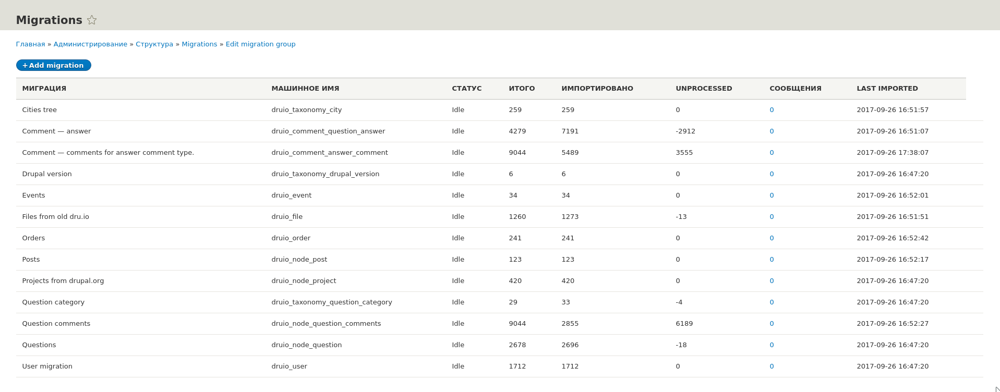
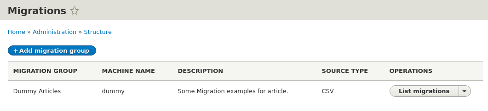
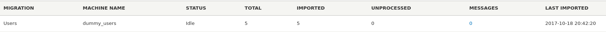
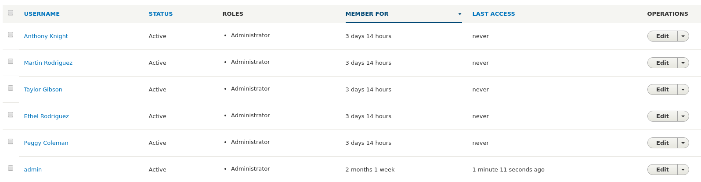
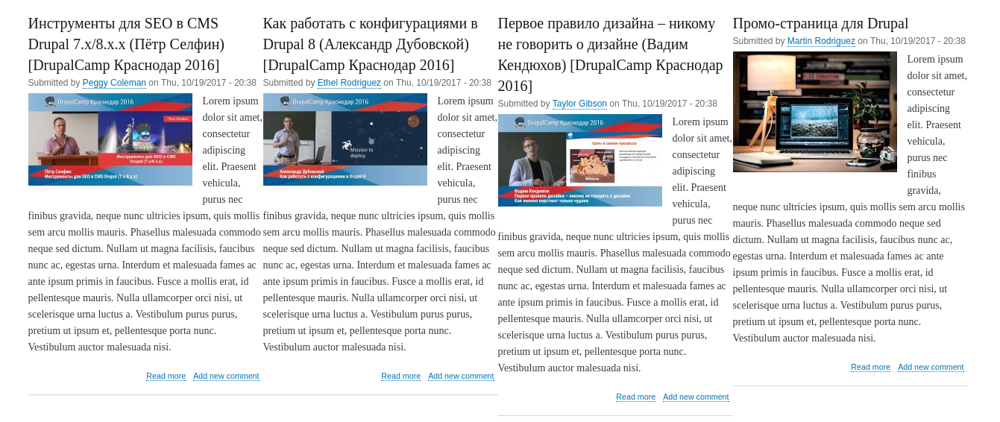

В этом материале мы рассмотрим одно из новшеств Drupal 8 — Migrate API.

**Что это.** Это простой инструмент для написания миграций из различных
источников, в различные назначения. Назначением может быть как Drupal, так и то,
что вы можете описать в коде. По умолчанию он сводится к написаню простеньких
YAML файлов с описанием процесса миграции. Для более сложных и гибких ситуаций
присутствует проработанная система плагинов.

Статья планировалась давно, и писалась практически месяц. Прежде чем начать
писать, я писал миграции с Drupal 7 на Drupal 8 для dru.io. Это было необходимо
из-за специфичной структуры, которая также частично меняется в процессе
миграции. После прочтения, рекомендую
изучить [модуль миграций для dru.io](https://github.com/dru-io/Dru.io/tree/8.x/modules/custom/druio/modules/migrate),
так как он содержит полезные примеры и информацию. Там не всё идеально, так как
миграции пишутся с подходом "запустится один раз и больше не потребуется".
Поэтому там позволительно немного поговнокодить. Прочитав статью, вы сможете
заметить проблемные места и написать как требуется, в статье часть этих
проблемных мест также будет рассмотрено.

**Не пугайтесь.** Материал объемный из-за большого количества примеров с кодом и
YAML файлами, в которых много комментариев. Если вы не знакомы с миграциями,
рекомендую читать статью либо по порядку, либо сразу перейти к последнему общему
примеру, а потом переходить к прочтению статьи с самого начала. Вы увидите, что
миграции это не страшно, а просто.

В материале могут быть неточности, так как API обширный и очень специфичный, во
всех вариантах его проверить и попробовать для одной статьи нереально. Если
заметите неточности, знаете особенность о которой не указано, или хитрость,
пишите в комментариях.

**Не забывайте.** Модуль Migrate на данный момент имеет статус **beta**. Это не
страшно, так как все изменения будут поддерживаться до Drupal 9. Если вы на нём
сильно подвяжете свой проект, рекомендую для ознакомления читать ченджлоги
минорных версий ядра.

## Дополнительная информация

Гайд также подразумевает что вы поставите перечисленные ниже модули:

- [Migrate Tools](https://www.drupal.org/project/migrate_tools) — Добавляет
  команды для Drush. Позволяет запускать и управлять миграциями из консоли. В
  ядре нет универсального интерфейса вызова и запуска миграций, данный модуль
  решает эту проблему. Если вам интересно как писать собственные вызовы и
  обработчики миграций, напишите в комментариях, я постараюсь поглубже изучить
  данную тему. Заметка о такой статье у меня уже стоит, но не в приоритетах.
- [Migrate Plus](https://www.drupal.org/project/migrate_plus) — Модуль выполняет
  утилитарную функцию. Позволяет организовывать миграции в группы, добавляет для
  миграций административный интерфейс со всей необходимой информацией для каждой
  миграции. В планах модуль должен получить интерфейс для запуска миграций, на
  данный момент есть патчи в issue, я не тестил.

Они не обязательные, хотя сильно облегчат вам жизнь. В данной статье они
рассматриваются в самом последнем примере, всё что касается отдельных частей
статьи реализуется на API из ядра. Для этих модулей будут специальные пометки в
статье.



## Миграции — что они из себя представляют и как выглядят

Migrate API — инструментарий который позволяет полностью контролировать
миграции, управляет ими, и объясняет, что и откуда, куда и как.

Миграции — YAML файлы описывающие все этапы и процессы миграции. Это круто и
просто!

Вы ни в чём не ограничены. Миграции даже не обязательно должны быть в Drupal,
как и не обязательно из Drupal. Ядро поставляет собственные плагины, контриб
модули свои, а при сложной ситуации, вы сможете написать собственные.

Наиболее важной частью в изучении миграций, понять три его процесса и как они
между собой связаны:

- **source**:  (откуда) Раздел и плагины данного типа описывают откуда и как
  брать данные, первично обрабатывают их и готовят к процессу обработки. Данные
  на текущем этапе сырые.
- **process**: (что и куда) Процессинг подготоваливает данные на основе данных
  из источника и собственных обработчиков. Позволяет модифицировать значения,
  подгонять их, или создавать совершенно новые. Также позволяет писать
  примитивные условия. Полученные данные отправляются в назначение.
- **destination**: (как и куда) Назначение принимает результат работы
  обработчиков этапа process и на основе этих данных переносит их куда и как
  нужно.

**Запомните.** Порядок их выполнения всегда идентичный: source -> process ->
destination. Данные передаются последовательно от одного процесса к другому. При
этом destination не имеет доступа к данным из source. Об это подробнее расписано
в каждом из соответствующих разделов.

Посмотрим на небольшой пример полноценно описанной миграции:

```yaml
# Название для машин.
id: news_migration
# Название для людей.
label: Новости
# Раздел с описанием как и откуда получать данные.
source:
  # Название плагина, который будет готовить сырые данные.
  plugin: my_new_source
  # Плагины могут иметь настройки. Объявляются как name: value
  setting_name: value
  setting_array:
    key_first:
      value: 'Value'
    key_second:
      value: 'Value'
  # Данная конфигурация зарезервирована Migrate API и позволяет объявлять
  # константы в пределах миграции. Все не динамические данные желательно
  # объявлять в константах.
  constants:
    status: 1
# Раздел позволяет отделить какие данные из источника, куда и как должны быть
# переданы.
process:
  # Означает: в переменную для destination с названием status записать значение
  # из константы settings_name.
  status: 'constants/setting_name'
  # Означает: в переменную для destination с названием uid записать строку "1".
  uid: '1'
  # Означает: в переменную для destination с названием title записать значение
  # переменной из source с названием news_title.
  title: news_title
# Раздел описывающий куда нужно смигрировать данные полученные в результате
# работы process раздела.
destination:
  plugin: entity:node
# Раздел описывает зависимость текущей миграции от других.
migration_dependencies:
  # Без данных миграций текущая не будет выполнена.
  required:
    - my_users
    - my_files
  # Данный раздел будет требовать выполнение зависимых миграций только когда
  # данные миграции обнаружены. Если их нет, они будут пропущены.
  optional:
    - random_stuff
# Дополнительные зависимости. Основывается на Config API.
# @see core/lib/Drupal/Core/Config/Entity/ConfigDependencyManager.php
dependencies:
  # Данные зависимости не пересчитываются при изменении конфигурации.
  enforced:
    # Зависимость от модулей. Обычно указывается как минимум модуль объявляющий
    # миграцию.
    module:
      - my_module
      - migrate_csv_source
    # Зависимость от темы.
    theme:
      - bartik
    # Зависимость от каких-либо конфигураций.
    config:
      - core.system
    # Зависимость от какого-либо содержимого. Имеет формат:
    # "ENTITY_TYPE_ID:BUNDLE:UUID"
    content:
      - node:news:uuid
  # Аналогично значениям выше, только пересчитываются каждый раз при изменении
  # конфигурации.
  module: { }
  theme: { }
  config: { }
  content: { }
```

Пример выше типичный для миграций, примерно так они и выглядят. Это
действительно миграция, а сложно это или нет, решайте сами. Большинство кода уже
написано за вас и оно должно покрывать более 90% ваших потребностей даже в самых
экзотических ситуациях, поэтому YAML описание будет зачастую вашим единственным
инструментом.

Теперь копнем намного глубже в каждый из них. Всё что дальше написано,
подразумевает что модуль в котором пишутся примеры — dummy.

## Source — источник данных

Источники данных отвечают за то, как, откуда и какие данные будут браться.
Источником может быть что угодно, всё зависит от ваших навыков и готовых
решений. Вы ограничены лишь кодом и вашей фантазией, никаких ограничений
миграции не накладывают. Брать данные из БД, CSV, XML, JSONAPI, URL, не важно,
если вы можете это описать, или описали другие — он их будет оттуда брать.

Источники указываются при помощи машинного имени соответствующего Source Plugin,
который будет предоставлять данные на импорт. Также Source Plugin могут иметь
собственные настройки которые будут влиять на его работу.

Ядро предоставляет парочку очень специфичных Source Plugin, которые не пригодны
для использования. Они написаны исключительно для Drupal-to-Drupal миграций. Но
этот пробел активно заполняется контриб решениями на drupal.org, переживать не
стоит. Во всех остальных случаях пишется собственный плагин.

Вы можете скачать модули, которые добавляют новые универсальные источники
данных. Как пример:

- [Migrate Source CSV](https://www.drupal.org/project/migrate_source_csv).
  Плагин добавляет поддержку миграции из CSV файлов.

* Migrate Plus, упомянутый выше, также добавляет свои плагины: Json, Soap, XML
  которые получаются через HTTP запросы.

В специализированных разделах гайда готовые решения с drupal.org игнорируются
для прозрачной работы с ядром.

### Создание Source Plugin

Source плагины хранятся в `src/Plugin/migrate/source`. <mark>Обратите
внимание</mark> что `migrate` с маленькой буквы, это не опечатка и не ошибка.
Сам же плагин это обычный объект. Название файла не имеет никакого значения.

Ваш плагин-источник должен расширять какой-либо базовый класс из ядра. Вы также
можете описывать свои собстсвенные базовые классы на основе интерфейсов.

Ядро предоставляет следующие базовые классы:

- `SourcePluginBase` — универсальный базовый класс, годится для большинства
  источников данных.
- `SqlBase` — это также базовый класс, который является
  надстройкой `SourcePluginBase`. Он необходим, если источником данных является
  SQL БД.

#### Пример №1 — SourcePluginBase

В данном примере расматривается написание собственного плагина источника данных
на основе `SourcePluginBase`.

Мы напишем простой плагин для импорта из CSV. CSV очень простой для понимания
формат и на нём очень легко объяснить как всё работает. Это будет примитивный
аналог упомянутого модуля выше. На рабочих проектах не используйте текущий
плагин, так как о не такой гибкий.

Наш плагин будет как парсить CSV и подготоваливать данные на импорт, так и иметь
свои собственные настройки.

Пишем свой плагин:

```php {"header":"src/Plugin/migrate/source/CSV.php"}
<?php

namespace Drupal\dummy\Plugin\migrate\source;

use Drupal\migrate\MigrateException;
use Drupal\migrate\Plugin\migrate\source\SourcePluginBase;

/**
 * Use csv file data as source.
 *
 * @MigrateSource(
 *   id = "dummy_csv"
 * )
 */
class CSV extends SourcePluginBase {

  /**
   * Path to the file relative to module.
   *
   * @var string
   */
  protected $path;

  /**
   * Module which path will be base for full path.
   *
   * @var string
   */
  protected $module;

  /**
   * Full path to the file.
   *
   * @var string
   */
  protected $fullPath;

  /**
   * Columns definition for csv.
   *
   * @var array
   */
  protected $columns;

  /**
   * The main ID in csv file based on columns keys.
   *
   * @var string
   */
  protected $key;

  /**
   * Is first line must be skipped during import.
   *
   * @var bool
   */
  protected $skipFirstLine;

  /**
   * CSV constructor.
   */
  public function __construct(array $configuration, $plugin_id, $plugin_definition, \Drupal\migrate\Plugin\MigrationInterface $migration) {
    parent::__construct($configuration, $plugin_id, $plugin_definition, $migration);

    if (empty($this->configuration['path']) || empty($this->configuration['module'])) {
      throw new MigrateException('The path or module is not set.');
    }
    else {
      $this->module = $this->configuration['module'];
      $this->path = $this->configuration['path'];
      $this->fullPath = drupal_get_path('module', $this->module) . '/' . $this->path;

      if (!file_exists($this->fullPath)) {
        throw new MigrateException('CSV file is not found in provided path.');
      }
    }

    if (empty($this->configuration['columns'])) {
      throw new MigrateException('Columns is must be set.');
    }
    else {
      $this->columns = $this->configuration['columns'];
    }

    if (empty($this->configuration['key'])) {
      throw new MigrateException('The key is must be set.');
    }
    else {
      $this->key = $this->configuration['key'];

      $is_key_found = FALSE;
      foreach ($this->columns as $column => $info) {
        if ($this->key == $info['key']) {
          $is_key_found = TRUE;
          break;
        }
      }

      if (!$is_key_found) {
        throw new MigrateException('The key is not match any of columns keys.');
      }
    }

    $this->skipFirstLine = $this->configuration['skip_first_line'] ?? FALSE;
  }

  /**
   * Returns available fields on the source.
   *
   * @return array
   *   Available fields in the source, keys are the field machine names as used
   *   in field mappings, values are descriptions.
   */
  public function fields() {
    $fields = [];
    foreach ($this->columns as $key => $info) {
      $fields[$info['key']] = $info['label'];
    }
    return $fields;
  }

  /**
   * Allows class to decide how it will react when it is treated like a string.
   */
  public function __toString() {
    return $this->fullPath;
  }

  /**
   * Defines the source fields uniquely identifying a source row.
   */
  public function getIds() {
    return [
      $this->key => [
        'type' => 'string',
      ],
    ];
  }

  /**
   * Initializes the iterator with the source data.
   */
  protected function initializeIterator() {
    $csv_data = $this->parseCsv();
    return new \ArrayIterator($csv_data);
  }

  /**
   * Parse CSV to array.
   */
  protected function parseCsv() {
    $items = [];
    $delimiter = !empty($this->configuration['delimiter']) ? $this->configuration['delimiter'] : ',';
    $enclosure = !empty($this->configuration['enclosure']) ? $this->configuration['enclosure'] : '"';
    if (($handle = fopen($this->fullPath, 'r')) !== FALSE) {
      if ($this->skipFirstLine) {
        fgetcsv($handle, 0, $delimiter, $enclosure);
      }
      while (($data = fgetcsv($handle, 0, $delimiter, $enclosure)) !== FALSE) {
        $row = [];
        foreach ($this->columns as $key => $info) {
          $row[$info['key']] = $data[$key];
        }
        $items[] = $row;
      }
      fclose($handle);
    }
    return $items;
  }

}
```

Давайте разбирать что там написано, почему, как и зачем.

Начнем с аннотации к нашему плагину: `@MigrateSource`, который
равен `id = "dummy_csv"`, это и есть название нашего плагина для дальнейшего
использования в файлах миграций в качестве источника. Аннотация является
обазятельной.

- `__construct()`: (не обязательно) Обычный конструктор объекта. В нашем случае,
  он нужен для того чтобы сверять настройки переданные нашему плагину, а также
  установка значений по умолчанию. У нашего плагина четыре обязательные
  настройки `path`, `module`, `columns`, `key`. Если хотя бы одна из них не
  задана, мы выдаем ошибку и миграция с использованием данного плагина не
  запустится. Первые проверки сверяют, указаны ли модуль и путь до файла, а
  также существует ли указанный файл. Также мы требуем заполнять "колонки" чтобы
  объяснить миграции что брать и куда складывать, а также ключ, по которому
  будут определяться уникальные записи. Указанный ключ мы проверяем на
  существование в описании колонок. Также мы проверяем переданы ли другие
  настройки, если нет, устанавливаем значения по умолчанию.
- `fields()`: (обязательно) Возвращает массив с полями миграции и их описанием.
  Массив одномерный, ключ — машинное имя поля в соответствии с источником, а
  значением его описание. На данный момент нигде не используется, но по
  возможности указывайте. Как минимум верните пустой массив.
- `__troString()`: (обязательно) Это магический метод из PHP, который
  вызывается, когда наш плагин попробуют вывести в качестве строки. Может
  отдавать какую-то полезную информацию о плагине. Если ничего не приходит на
  ум, возвращайте пустую строку.
- `getIds()`: (обязательно) Возвращает массив одного или нескольких полей
  из `fields()` которые являются ключами. Должен содержать как минимум один
  ключ. Ключу обязательно указывать его тип. Вы можете указать несколько ключей.
  Ключ(и) используется для определения уникальных данных в пределах
  миграции. <mark>Указанный вами ключ, всегда должен возвращать значение.</mark>
  В миграции всегда должно присутствовать значение, уникально идентифицирующее
  данную строку данных. Значение ключа задается по типу данных для полей. Поля,
  которые можно использовать и их доступные данные лучше всего искать через
  плагины `src/Plugin/Field/FieldType` или по аннотации `@FieldType`. Например,
  мы указали что это будет строка, но туда также можно передать
  значение `max_length` и `is_ascii`, которые являются настройками для данного
  типа поля. Нашел я это по аннотации, увидел где id равнялся string и открыл
  объект: `/core/lib/Drupal/Core/Field/Plugin/Field/FieldType/StringItem.php`, а
  дальше там всё очень понятно. Если вы их не укажите, будут использованы
  значения по умолчанию из метода `defaltStorageSettings()`. Там есть парочка
  других вариантов, один мы рассмотрим в следующем примере, а третий я не понял
  зачем вообще есть. Ниже также код, который возвращает список всех типов полей,
  но не так информативно как поискать по коду.

```php {"header":"Получение всех типов полей"}
$plugin_service = \Drupal::service('plugin.manager.field.field_type');
ksm($plugin_service->getDefinitions());
```

- `initializeIterator()`: Данный метод возвращает все данные на импорт.
  Возвращать он должен какой-либо объект, который в итоге расширяет
  интерфейс [Traversable](http://php.net/manual/en/class.traversable.php). Самый
  простой способ вернуть массивом через `ArrayItertor`. Ключи массива должны
  быть ключами (названиями полей).
- `parseCsv()`: Наш собственный метод, который построчно разбирает csv файл и
  записывает их в массив. Название ключа берется на основе настроек columns и
  номера колонки, начиная с 0, а значение и соответствующей колонки строки csv
  файла.

```yml {"header":"Пример использования написанного нами плагина"}
# Остальные настройки миграции исключены.
source:
  # Машинное название плагина-источника.
  plugin: dummy_csv
  # Название модуля, где искать файл. Будет получен путь через drupal_get_path()
  module: dummy
  # Путь до csv файла относительно папки модуля выше. Без начального слэша.
  path: assets/articles.csv
  # (Необязательно) 1 или 0, пропускать первую строку или нет.
  skip_first_line: 1
  # (Необязательно) Разделитель поля.
  delimiter: ';'
  # (Необязательно) Ограничитель поля.
  enclosure: '"'
  # Соответствия столбцов CSV файла. Первым делом указывается номер столбца от 
  # нуля. Далее, обязательно указываются key — ключ для колонки (поле), который 
  # будет использоваться в process для подстановки данных, а также label — 
  # описание.
  columns:
    0:
      key: id
      label: 'Article id'
    1:
      key: title
      label: 'Title'
    2:
      key: body
      label: 'Content'
  # Ключ, который будет идентифицировать строку. Должен быть ключем из columns.
  key: id
```

На данный момент нас не интересует что будет дальше и что с этим делать. Тут
главное понять как это работает. Все указанные настройки можно проследить в
коде, и что с ними происходит. Те что необязательные, можно пропускать, а если
пропустить обязательное, получим ошибку.

Допустим, у вас csv файл: `1;Заголовок;Содержимое`. Если разделителем
служит `;`, то будет 3 колонки. В `columns` мы указали что нулевая будет
идентификатором, вторая заголовком, а третья содержимым. Все они получили также
свои ключи, эти ключи (читай переменные) мы будем использовать как значение в
момент импорта и описания process раздела миграции. Мы указали что определяющим
ключом импорта будет id (содержимое первого столбца). При повторном импорте,
откате или обновлении, он будет смотреть по данному значению, есть ли оно уже на
сайте, актуальная ли там информация и какой идентификатор имеет результат
импорта.

Если у нас указан id = 1 в CSV файле, мы создаем новости на сайте при помощи
миграций. При запуске первой миграции, он создаст материал, и запишет в
специальную таблицу в БД, что id 1 из источника, это id 17 в назначении (17
просто как пример, и если эта новость нода, то 17 это будет nid). При запуске
откате или обновлении миграции, у него уже будут сведения что у id 1 из
источника есть материал на сайте под nid 17 и он сделает соответствующую
операцию, либо откатит (удалив все следы), либо обновит всю информацию, опять
же, взяв данные из источника и при помощи process подставив данные куда
требуется. Соответственно менять id у источника крайне опасно и это должно быть
очень статичное и уникальное значение в пределах источника. Вы можете делать,
как я писал выше, множественные ключи, передав в результативном массиве
метода `getIds()` несколько ключей. В таком случае, запись в источнике будет
определяться по двум значениям. И если, допустим, у вас есть две записи с
одинаковым id, но разными langcode, это будут две разные новости. У нашего
плагина это единичный ключ, но, например, у Migrate CSV source контриб есть
возможность указания нескольких ключей.

#### Пример №2 — SqlBase

Данный базовый объект является лишь надстройкой над `SourcePluginBase` и
позволяет нам писать плагины-источники для импорта из какой-либо MySQL БД. Так
как данный тип основывается на предыдущем, то особо ничего нового тут не будет,
но мы рассмотрим его особенности и отличая.

Данный базовый объект очень активно используется для миграций на dru.io, поэтому
ничего выдумывать не придется, и мы разберем один из таких плагинов:

```php {"header":"Dru.io/modules/custom/druio/modules/migrate/src/Plugin/migrate/source/NodePost.php"}
<?php

namespace Drupal\druio_migrate\Plugin\migrate\source;
use Drupal\migrate\Plugin\migrate\source\SqlBase;
use Drupal\migrate\Row;

/**
 * @MigrateSource(
 *   id = "druio_node_post"
 * )
 */

class NodePost extends SqlBase {

  /**
   * {@inheritdoc}
   *
   * IMPORTANT! This method must return single row result, we can't use joins
   * here. Don't edit!
   */
  public function query() {
    $query = $this->select('node', 'n')
      ->fields('n', [
        'nid',
        'type',
        'title',
        'uid',
        'status',
        'created',
        'changed',
      ])
      ->condition('n.type', 'post');
    return $query;
  }

  /**
   * {@inheritdoc}
   */
  public function fields() {
    $fields = [
      'nid' => $this->t('The primary identifier for a node'),
      'type' => $this->t('The node_type.type of this node'),
      'title' => $this->t('The title of this node, always treated as non-markup plain text'),
      'uid' => $this->t('The users.uid that owns this node; initially, this is the user that created id'),
      'status' => $this->t('Boolean indicating whether the node is published (visible to non-administrators)'),
      'created' => $this->t('The Unix timestamp when the node was created'),
      'changed' => $this->t('The Unix timestamp when the node was most recently saved.'),
      // Custom added fields.
      'body_value' => $this->t('The value of body field'),
      'body_format' => $this->t('The format of body field'),
      'paragraphs' => $this->t('Paragraphs created from old body'),
    ];
    return $fields;
  }

  /**
   * {@inheritdoc}
   */
  public function getIds() {
    return [
      'nid' => [
        'type' => 'integer',
        'alias' => 'n',
      ],
    ];
  }

  /**
   * {@inheritdoc}
   */
  public function prepareRow(Row $row) {
    $nid = $row->getSourceProperty('nid');
    // Body field.
    $body_query = $this->select('field_data_body', 'b')
      ->fields('b', ['body_value', 'body_format'])
      ->condition('entity_type', 'node')
      ->condition('bundle', 'post')
      ->condition('entity_id', $nid)
      ->execute()
      ->fetch();
    $row->setSourceProperty('body_value', $body_query['body_value']);
    $row->setSourceProperty('body_format', $body_query['body_format']);
    // Paragraphs.
    $paragraphs = [];
    $paragraphs[] = [
      'type' => 'text',
      'fields' => [
        'field_text' => [
          'value' => $body_query['body_value'],
          'format' => $body_query['body_format'],
        ],
      ],
    ];
    $row->setSourceProperty('paragraphs', $paragraphs);
    return parent::prepareRow($row);
  }

}
```

Если вы смотрели предыдущий пример, то уже можете увидеть очень много знакомого.
Пройдемся по каждому из методов и закрепим что уже описано под другим углом, а
также распишу специфичные для базового объекта методы.

- `query()`: (обязательно) Данный метод должен возвращать объект запроса к БД. Я
  обращаю ваше внимание на то что указано в комментарии к данному методу. В
  данном методе нельзя использовать джоины, иначе будут дубли данных. Метод
  должен возвращать простой запрос, где на каждый результат будет одна
  единственная строка. Каждый указанный столбец из таблицы БД или
  указанный `fields()` будет записан в одноименное поле со значением для
  дальнейшего использования в миграции и подготовке строк. О том, куда он шлет
  запросы, чуть позже.
- `fields()`: (обязательно) Знакомый по предыдущему примеру метод. Должен
  возвращать массив полей в данной миграции, где ключом является машинное имя
  поля, а его значение — описанием. При объявлении плагинов через `SqlBase`, вам
  придется задавать их вручную. Не забудьте объявить все поля что возвращает
  запрос выше, и что вы объявите ниже. Как и ранее, данный метод обязательный,
  но вернуть можно и пустой массив.
- `getIds()`: (обязательно) Аналогично предыдущему примеру, массив с ключами для
  миграций. В случае с sql тут особо думать не придется, лучше указывать primary
  key из таблицы. Обратите внимание, что в с лучае с `SqlBase` надо также
  указать `alias` из `query()`, а ключем будет являться поле из запроса.
- `prepareRow()`: (необязательно) Данный метод является общим
  для `SourcePluginBase` (пример выше), но там он не используется, так как нам
  не нужен. В случае с SQL, очень часто вам придется данные как-то обрабатывать,
  перед тем как их отдать на миграцию. Данный метод вызывается на каждую запись,
  и в нём, вы можете не только менять данные, но и добавлять новые. Для всего
  что вам нужно есть объект `Row`, который передается в качестве аргумента. В
  нём вы можете получить уже известные
  данные `$row->getSourceProperty('FIELD_NAME')`, также заменить их, или
  добавить новые при помощи `$row->setSourceProperty('FIELD_NAME', 'VALUE')`. Не
  забудьте также вызывать родительский метод `parent::prepareRow($row);`. Он
  вызывает хук `hook_migrate_prepare_row`, а также
  хук `hook_migrate_MIGRATION_ID_prepare_row`, для того чтобы можно было
  повлиять на данные из вне, например из другого модуля. <mark>Если данный метод
  вернет `FALSE`, то импорт данной строки будет пропущен.</mark> Из примера
  видно, что мы получаем `nid` текущей строки на миграцию, затем, используя
  данное значение, мы берем из старой БД значение для `field_body` и записываем
  их в значения `body_value` и `body_format`, тем самым, мы сможем подставлять
  данные значения в yml файле, также, не забыв добавить информацию о них
  в `field()`. Далее там происходит очень интересная вещь. Так как при переносе
  мы решили что для публикаций мы будем использовать модуль paragraphs, а сейчас
  там единственное поле body, то мы решили в момент миграции все старые поля
  также конвертировать в текстовый параграф. Для этого создается специальный
  массив, с определенной структурой, которая задана нами же. А затем, мы
  написали ProcessPlugin который такой формат массива переносит в параграфы. Но
  об этом позже.

Я ещё раз хочу обратить внимание, на то что в `prepareRow()` можно
возвращать `FALSE` для пропуска строки на миграцию. Это очень важно запомнить,
так как это позволяет выкрутиться в очень неудобных для миграции ситуациях.
Например, при миграции dru.io с 7-ки на 8-ку у нас поменялась архитектура и для
вопросов-ответов. В 7-ке вопросы и ответы — ноды, а комментарии в 7-ке и вовсе
едины для всех нод. В 8-ке же, вопрос — нода, комментарии к нему — обычный тип
комментариев, ответы на вопрос — отдельный тип комментариев, а комментарии к
комментарию-ответу, также имеют собственный тип. В 7-ке всё это дело хранится в
одной общей таблице, а в 8-ке нет, и нам надо как-то это разделять. Мы ничего не
можем сделать на уровне базового запроса в `query()`, так как так в таблице
комментариев в 7-ке нет никакой полезной для этого информации. Поэтому делается
выборка всех комментариев. Вы можете наблюдать данное поведение на первом
скриншоте из текущего материала, где у двух миграций одинаковое кол-во данных на
импорт 9044 — это как раз комментарии. Вы также можете наблюдать сколько реально
из них импортировано. И возможность вернуть `FALSE` по сути решила эту проблему.
В `prepareRow()` делается второй запрос. Так как нам известно `nid` для
комментария, мы делаем запрос в `node`, проверяем, является ли нода нужного
типа, для которой данный комментарий, и если нет, мы возвращаем `FALSE` и импорт
строки пропускается.
Вот [пример](https://github.com/dru-io/Dru.io/blob/8.x/modules/custom/druio/modules/migrate/src/Plugin/migrate/source/NodeQuestionComments.php#L47).

Этим я хочу сказать и показать, что миграции очень простые, и мелкая хитрость,
может серьезно облегчить работу, либо вовсе решить проблему. Для всего есть
всегда простые решения, не надо там ничего выдумывать и лезть в дебри.

Используется данный плагин как предыдущий и все остальные плагины на источник:

```php
source:
  plugin: druio_node_question_comments
  key: druio_old
```

В примере выше вы можете заметить настройку специфичную для плагинов основанных
на `SqlBase`. Они имеются следующие настройки:

- `key`:  (default: migrate) Ключ настроек подключения из settings.php.
- `target`: (default: default) Это варианты подключения для текущего key, не
  имеет смысла менять, особенно если не понимаете о чём это и для чего. Также,
  из settings.php второй ключ массива.
- `database`:  (default: NONE) Массив с подключением в соответствии
  с `Database::addConnectionInfo`.

Всё что вам потребуется — key. Если открыть settings.php, то вы найдете массив с
подключением к БД. По умолчанию друпал делает `default` ключ и `default` target
для основной БД. Всё что вам нужно, добавить аналогичный массив заменив `key` (
первый ключ массива) на любой другой, и указать настройки подключения. Вот как
это настроек но для dru.io и конфига выше:

```php {"header":"/sites/default/settings.php"}
// Основное подключение, которое настраивается при установке.
$databases['default']['default'] = array (
  'database' => 'drupal',
  'username' => 'drupal',
  'password' => 'drupal',
  'prefix' => '',
  'host' => 'mariadb',
  'port' => '3306',
  'namespace' => 'Drupal/Core/Database/Driver/mysql',
  'driver' => 'mysql',
);

// Вторая БД где хранится дамп dru.io из Drupal 7. Не подключается к удаленной БД для
// безопасности и скорости работы.
$databases['druio_old']['default'] = array (
  'database' => 'druio_old',
  'username' => 'drupal',
  'password' => 'drupal',
  'prefix' => '',
  'host' => 'mariadb',
  'port' => '3306',
  'namespace' => 'Drupal/Core/Database/Driver/mysql',
  'driver' => 'mysql',
);
```

#### Описание всех методов SourcePlugin

Больше примеров я писать не будут, так как уже на текущий момент понимаю, статья
растянется надолго, и по одному примеру будет вполне для понимания базового
поведения, для всего остального <s>есть MasterCard</s> проще писать отдельные
гайды под задачу\кейс.

Чтобы облегчить вам жизнь, я распишу все полезные и нужные методы
для `SourcePlugin`:

- `__construct()`: Рассматривался в примерах выше. Позволяет выполнить операции
  на момент подготовки\проверки миграций. Установить значения по умолчанию,
  выбить ошибку что что-то не верно в конфигурации плагина и т.д. В данном
  методе `SourcePluginBase` делает базовые для себя настройки. Самое важное там,
  это то что он резервирует некоторые настройки для себя, и их ни в коем случае
  нельзя использовать для своих плагинов (все значения ниже по умолчанию
  отключены, по факту вы их указываете когда хотите включить, они общие для всех
  плагинов данных типов):
  - `cache_counts`: 1 или 0, указывает кэшировать кол-во данных на импорт или
    нет.
  - `skip_count`:  1 или 0, если установить 1, то подсчет кол-ва данных на
    импорт проводиться вовсе не будет.
  - `track_changes`: 1 или 0. Если данное значение активно, то при импорте,
    каждая строка будет генерировать hash и сверять с тем что в базе. Если
    данных нет — импортировать, если hash изменился (изменились данные) —
    обновлять, если остался прежним, пропускать. Эта настройка примерно то же
    самое что делает `drush mi MIGRATION --update`, только команда в drush
    принудительно запускает обновление всех строк, а данная обновляет только в
    указанных случаях.
  - `cache_key`: Строка с ключом для кэширования кол-ва данных в источнике,
    если `cache_counts` выше имеет значение 1. По дефолту имеет следующую
    логику: `hash('sha256', $this->getPluginId())`. Не вижу смысла и причин
    менять это.
  - `high_water_property`: Название поля с данными, по которому будет
    определятся актуальность импортируемых данных. <mark>Не работает
    с `track_changes`, так как выполняют одну и ту же задачу.</mark> Используйте
    либо тот, либо этот подход. Если тот получает хэш от полученных данных на
    импорт и сверяет с тем что есть уже на сайте, то данный параметр сверяет по
    какому-то конкретному значению. Например, если вы делаете миграцию из нод
    другого сайта, можно указать `node.changed`, и данные будут обновляться
    только если в источнике изменилось данное значение, при этом все остальные
    поля могут меняться, обновление произойдет только в случае
    изменения `node.changed`. Всегда должен быть timestamp, ну или простым
    числом. Иными словами, он определяет нужно ли обновлять строку по числу, и
    если оно больше того что было в последний раз, значит данные обновились,
    если меньше, то данные трогать не стоит.
- `getModuleHandler()`: Возвращает `\Drupal::moduleHandler()`, который можно
  использовать по назначению. Например `SourcePluginBase` использует его для
  объявления хуков для изменения данных о которых я упоминал чутка выше в
  описании про `prepareRow()`, о котором речь идет и дальше. Можете сделать
  своих хуков и альтеров, или вообще задействовать для других задач.
- `prepareRow(Row $row)`: Метод который вызывается при обработке каждой строки.
  О самом Row будет позже.
- `getIterator()`: Метод который вызывает `initializeIterator()` и сохраняет его
  результат, который, в свою очередь, возвращает данные на импорт. Может
  оказаться полезным для дебага чтобы глянуть какие данные в итоге придут на
  импорт.
- `current()`: Текущая строка на обработку. Если обработка не начата, то
  возвращает `NULL`.
- `key()`: Возвращает ключ для текущего элемента.
- `valid()`: Проверка корректности позиции. `TRUE` если всё идет по плану
  и `FALSE` при возникновении ошибки.
- `rewind()`: Возвращает обработчик к первому элементу. При этом он
  вызывает `$this->getIterator()->rewind();`. Именно поэтому возвращаемый
  результат в `initializeIterator()` должен быть объектом
  реализующий `Traversable` и в примере №1 выше, мы
  возвращали `new \ArrayIterator($csv_data)`. Так что `rewind()` в итоге,
  вызовется у `ArrayIterator` или того объекта, что был использован для возврата
  данных.
- `next()`: Подготавливает строку на импорт, сверяет нужно ли ему обновиться,
  валидны ли данные, создает объект `Row`. Затем отдает методу `prepareRow()` на
  дополнительную обработку, если тот не вернул `FALSE` (пропуск строки), то
  дальше он сверяет нужно ли эту строку добавить\обновить. Тут он как раз
  учитывает настройки либо `high_water_property`, либо `track_changes`.
- `fetchNextRow()`: Просто переключает обработчик на следующий элемент для
  обработки.
- `aboveHighwater(Row $row)`: Если данная опция включена, тут он сверяет этот
  самый параметр и решает, требуется ли добавить\обновить строку, или же
  скипнуть.
- `rowChanged(Row $row)`: То же самое что и метод выше, только
  для `track_changes` и его хэшей.
- `getCurrentIds()`: ключ(и) для текущей строки. На основе `getIds()` вернет
  текущие ключи для определения уникального эламента.
- `count($refresh = FALSE)`: Возвращает кол-во элементов в источнике миграции.
  При помощи аргумента можно запросить обновление кол-ва, если используется
  кэширование `cache_counts`. Также тут учитывается `skip_count`, и если
  задано, `cache_key`.
- `getCache()`: Получает объект с хранилищем кэша для мигарций, где он хранит
  кэш о кол-ве, например. В общем-то, больше ничего и не кэширует. Но зато
  можете покэшировать вы, если вдруг потребуется.
- `doCount()`: Подсчет кол-ва данных в источнике
  предоставленных `initializeIterator()`.
- `getHighWaterStorage()`: Возвращает key\value хранилище данных
  для `high_water_property`. Там он хранит данные и сверяет.
- `getHighWater()`: Возвращает текущее значение для high water.
- `saveHightWater($high_water)`: Устанавливает значение.
- `getHighWaterProperty()`: Возвращает значение `high_water_property`.
- `aboveHighwater()`: Вернет `TRUE` если текущее импортируемое значение
  изменилось от того что на сайте в большую сторону, `FALSE` если осталось
  прежним.
- `preRollback(MigrateRollbackEvent $event)`: Метод вызывает когда вызвана
  операция отката, перед самим откатом.
- `postRollback(MigrateRollbackEvent $event)`: Тоже что и выше, только после
  отката.

Это абсолютно все методы `SourcePluginBase`, возможно где-то неточности, но если
что поправите. Большинство из них вам не нужно, всё что по факту нужно, описано
в примере №1. Возможно вы в них найдете что-то полезное для конкретно вашей
задачи. Почти половина, если не больше, утилитарные для самих миграций, и вам
нет смысла их вызывать вручную, если вы не пишите собственную систему выполнения
миграций.

И на этом с плагинами-источниками мы завершаем, и переходим к процессу обработки
данных.

## Process — соответствия и обработка импортируемых данных

Данный раздел миграций выглядит примерно следующим образом:

```yaml
process:
  title: title
  'body/value': content
  field_images:
    - plugin: skip_on_empty
      method: process
      source: images
    - plugin: sub_process
      source: images
      process:
        target_id:
          plugin: migration_lookup
          migration: dummy_file
  type:
    plugin: default_value
    default_value: article
```

Как можно догадаться из примера, данный раздел отвечает за соответствия, какие
данные из источника, куда записывать в назначение. Также вы можете заметить
использование `ProcessPlugin`, о котором и пойдет речь в данном разделе.

Данный раздел создает "переменные" для Destination Plugin, на основе переменных
из Source Plugin, а Process Plugin позволяют данные из источника, как-либо
обработать перед отправкой в Destination.

Если у вас нет возможности подготовить данные в `SourcePlugin` и
его `prepareRow()`, или пишите универсальный плагин, то вся обработка выносится
в process.

Самое главное в разделе процессинга уловить как работают плагины и соответствия.

Пример выше, достаточно показательный, насколько может сильно отличаться
написание. Там мы имеем обычное присвоение где в переменную `title` для
destination будет записано значение из source переменной `title`. Затем
аналогично с `body/value` (которое равносильно `['body']['value']`). Оба этих
примера имеют жесткое присвоение и это значит, что `title` и `content`
переменные из источника должны быть всегда со значением.

Далее посмотрите на пример с `type`. Там используется плагин, который передаётся
как вложенный массив, в котором указывается название `ProcessPlugin`, в данном
случае `default_value`, а затем настройки для него. У каждого плагина свои
настройки, поэтому надо знать что вызываете (об этом ниже). Далее всё
аналогично `SourcePlugin`, переданные в соответствующие поля-настройки данные
отправляются плагину на обработку, он принимает решение что делать, а затем
отдает результат или делает что-то ещё.

Иногда требуется запустить более одного обработчика для одного поля, и это
возможно. Наблюдать применение нескольких обработчиков можно в `field_images`,
которые объявляются в виде массивов друг за другом — в миграциях это называется
pipeline. Пайплайны вызываются сверху-вниз друг за другом, результат предыдущего
передается следующему. Если посмотреть на пример выше, то плагину `sub_process`
передастся результат плагина `skip_on_empty`, но в данном случае, он не меняет
данные и они придут такие же как и пришли в него.

По сути, это основной инструмент миграций и вам стоит его очень хорошенько
понять. Всё очень просто, поверьте, но вот есть один жирный недостаток. Дебажить
процесс плагины достаточно сложно, так как, с большой вероятностью, вы будите
вызывать миграции через drush и классические способы тут не подойдут,
хотя `print_r()` спокойно выведет данные в консольку. Но если там будет объект
или что-то такое же серьезное, то увы, это вам мало чем поможет, с другой
стороны, такие данные в принципе и не должны приходить на импорт, так что всё
ок.

### Process плагины из ядра

`default_value`, `sub_process`, `migration_lookup`, `skip_on_empty` — как они
работает, где искать, а-а-а-а-а!

К нашему счастью, в ядре просто куча процесс плагинов, и вероятность что вы
напишите свой стремится к нулю. Все основные находятся, как ни странно, в модуле
migrate из ядра в качестве плагинов (ну дела). Чтобы было проще, я просто
распишу все эти плагины и как они работают. Этот раздел даже будет полезнее чем
написание собственных плагинов, просто потому что данные на импорт в 99.99%
случаев будут приходить в примитивных типах, массивы, строки, числа, и все
стандартные плагины с лихвой покрывают потребности в их обработке, а в связке с
pipeline и подавно.

#### array_build

Создает ассоциативный массив из других массивов. Данный плагин ожидает что в
него придет массив из других массивов (сплошная тавтология), а он на основе
конфигураций соберет одномерный ассоциативный. Доступные настройки:

- `key`: Ключ будущего элемента массива.
- `value`: Значение будущего элемента массива.

Пример массива на импорт:

```php
$languages = [
  [
    'language' => 'en',
    'domain' => 'http://example.com',
  ],
  [
    'language' => 'ru',
    'domain' => 'http://ru.example.com',
  ],
];
```

Плагин возьмет этот массив и будет обрабатывать каждый элемент (который также
является массивом) на основе указанных вами `key` и `value` создавая при этом
новый массив.

Пример конфигурации и результата:

```php
process:
  domains:
    plugin: array_build
    key: language
    value: domain
    # Подразумевается что массив из примера выше находится в данной переменной.
    source: languages
```

```php {"header":"Результативный массив"}
$domains = [
 'en' => 'http://example.com',
 'ru' => 'http://ru.example.com',
];
```

#### callback

Пропускает значение через колбек. Им может быть как функция, так и метод
какого-то объекта. Передает значение на обработку в одном и единственном
аргументе, поддержки нескольких аргументов нет.

```yaml {"header":"Примеры использования плагина"}
process:
  # Функция strtolower().
  destination_field:
    plugin: callback
    callable: strtolower
    source: source_field
  # Метод Unicode::strtolower().
  destination_field_second:
    plugin: callback
    callable:
      - '\Drupal\Component\Utility\Unicode'
      - strtolower
    source: source_field
```

#### concat

Объединяет несколько строк в одну при помощи `implode()`.

Принимает следующие значения:

- `source`: Массив из строк для конкатенации.
- `delimiter`: (опционально) Разделитель при объединении. По умолчанию его нет и
  они будут соединены в одну большую строку.

```yaml
process:
  new_text_field:
    plugin: concat
    source:
      - foo
      - bar
    delimiter: /
```

Если бы в примере выше `foo` имело значение `Hello`, а `bar` — `world`, то
результат стал: `Hello/world`.

#### default_value

Данный плагин удобно использовать для установки значения по умолчанию в случаях,
когда данные обязательно нужно установить.

Например, самый первый пример из раздела про process плагины имеет не совсем
корректный пример (про type) данного плагина. Его можно использовать для
установки значения в качестве единственного плагина, и вы можете заметить такое
если пороетесь в репозитории dru.io. Для таких целей корректно использовать
константы миграции, о которых будет чуть позже. Разницы особо нет, но по сути,
константы на больших объемах данных дадут чуточку выигрыша по времени так как не
будут вызывать плагин для установки значения.

Лучше всего данный плагин использовать в pipeline обработчиках, в случае если в
предыдущих значение не было установлено. Плагин считает что данные отсутствуют и
установит указанное значение только в случае если значение, которое пришло в
него на момент обработки "пустое": `NULL`, `FALSE`, `0`, `'0'` (строка), пустая
строка или же пустой массив.

Имеет две настройки:

- `default_value`: Значение которое будет установлено данным плагином.
- `strict`: (опционально) Строгая проверка данных. По умолчанию `false`, если
  установить в `true` (на самом деле там хватит любого значения, даже 1, сам
  факт указания данной настройки активирует её), то проверка на отсутствие
  значения будет проводится через `isset()`, а следовательно, значение по
  умолчанию применится только если пришло значение `NULL`.

```yaml
process:
  uid:
    - plugin: migration_lookup
      migration: users
      source: author
    - plugin: default_value
      default_value: 44
```

#### download

Изменено в соответствии с **Drupal 8.6+
** ([2981389](https://www.drupal.org/node/2981389)).

Загружает данные и сохраняет их на сайте.

Принимает следующие значения:

- `source`: Массив с двумя значениями, первым должна быть ссылка на
  файл-источник, вторым URI (не URL) куда сохранять значение на сайте,
  например `public://images/bar.jpg`.
- `file_exists`: Определяет поведение при обнаружении файла по пути destination.

  - `replace`: (по умолчанию) Заменяет существующий файл.
  - `rename`: Если указано, то для второго значения из `source` будет всегда
    генерироваться уникальное значение в destination. Это значит, что если вы
    укажите `public://images/bar.jpg` но файл по данному пути уже имеется, то он
    создаст файл `public://images/bar_0.jpg`, затем `public://images/bar_1.jpg`
    и т.д.
  - `use existing`: Используется уже доступный файл по пути назначения.

- `guzzle_options`: (опционально) Массив с настройками для Guzzle. Все возможные
  настройки можно изучить
  в [официальной документации](http://docs.guzzlephp.org/en/latest/request-options.html).

```yml
process:
  plugin: download
  # Лучше всего, конечно же, чтобы source был примерно таким: source: value, где value, переменная-массив
  # созданная заранее в SourcePlugin, либо две переменные и ввести их как пример ниже.
  source:
    - 'https://www.google.ru/images/branding/googlelogo/2x/googlelogo_color_120x44dp.png'
    - 'public://logos/google.png'
  file_exists: use existing
```

#### entity_exists

Простенький плагин, который позволяет проверить существует ли сущность
указанного типа с указанным id. Если есть, возвращает переданный id, если
нет — `FALSE`.

Принимает следующие значения:

- `source`: ID переменной на проверку.
- `entity_type`: Машинное имя сущности.

```yml
process:
  field_tags:
    plugin: entity_exists
    source: tid
    entity_type: taxonomy_term
```

#### explode

Разделяет строку на массив. Полный аналог функции `explode()` из php.

Доступные параметры:

- `source`: Строка которую нужно разбить на массив.
- `delimiter`: Разделитель по которому разбивать строку на массив.
- `limit`: (опционально) Является значением для третьего одноименного аргумента
  функции. Копирую прямо с php.net:
  - Если аргумент `limit` является положительным, возвращаемый массив будет
    содержать максимум `limit` элементов, при этом последний элемент будет
    содержать остаток строки `string`.
  - Если параметр `limit` отрицателен, то будут возвращены все компоненты кроме
    последних `-limit`.
  - Если `limit` равен нулю, то он расценивается как 1.
- `strict`: (опционально, по умолчанию `true`) Если установлено в `true`, то
  источник должен обязательно быть строкой. Если `false`, то полученные данные
  будут трансформированы в строку, а после отданы на разбивку.

```yml
process:
  bar:
    plugin: explode
    # Если бы в переменной foo было значение 'node/1', то результат бы стал ['node', '1']
    source: foo
    delimiter: /
```

#### extract

Получение значения из массива, даже многоуровнего.

Доступные настройки:

- `source`: Источник данных, должен быть массивом.
- `index`: Массив ключей до значения.
- `default`: (опционально) Значение по умолчанию, если значение не найдено.

```yml
# Допустим вам нужно получить данные из массива: $source['field_name']['und'][0]['value'].
# field_name в данном случае переменная-массив из source которая содержит ['und'][0]['value'].
process:
  new_field:
    plugin: extract
    source: field_name
    index:
      - und
      - 0
      - value
```

#### file_copy

Изменено в соответствии с **Drupal 8.6+
** ([2981389](https://www.drupal.org/node/2981389)).

Позволяет перемещать файлы, переиспользовать, а также переименовывать при
обнаружении одноименного файла.

Доступные настройки:

- `source`: Путь до файла источника, например `/path/to/foo.txt`
  или `public://bar.txt`, а также путь назначения. Не забывайте про ранее
  описанный плагин `download`, если нужно сначала скачать файл. Это массив.
  Первое значение - откуда, второе - куда.
- `file_exists`: Определяет поведение при обнаружении файла по пути destination.

  - `replace`: (по умолчанию) Заменяет существующий файл.
  - `rename`: Если указано, то для второго значения из `source` будет всегда
    генерироваться уникальное значение в destination. Это значит, что если вы
    укажите `public://images/bar.jpg` но файл по данному пути уже имеется, то он
    создаст файл `public://images/bar_0.jpg`, затем `public://images/bar_1.jpg`
    и т.д.
  - `use existing`: Используется уже доступный файл по пути назначения.

```yml
process:
  path_to_file:
    plugin: file_copy
    source:
      - source_url
      - destination_uri
```

#### flatten

Делает из многомерного массива "плоский" (с одним уровнем).

```yml
process:
  tags:
    - plugin: default_value
      source: foo
      default_value: [bar, [qux, quux]]
    - # Если в значении foo ничего не будет, то значение по умолчанию
      # после обработки данным плагином примет значение [bar, qux, quux]
      plugin: flatten
```

#### format_date

Конвертирует один формат даты в другой.

Имеет следующие настройки:

- `source`: Источник данных.
- `from_format`: Исходный формат даты который передается в `source`. Должен
  соответствовать [\DateTime::createFromFormat](http://php.net/manual/ru/datetime.createfromformat.php).
- `to_format`: Формат в который нужно привести дату. Всё также, в соответствие с
  документацией выше.
- `timezone`: (опционально) Таймзона используемая для даты. Задается в
  соответствии с друпальным
  объектом [DateTimePlus::__construct](https://api.drupal.org/api/drupal/core!lib!Drupal!Component!Datetime!DateTimePlus.php/function/DateTimePlus%3A%3A__construct/8.2.x).
  Так как там используются временные зоны из PHP, то список проще всего искать
  в [документации к PHP](http://php.net/manual/ru/timezones.php).
  Например `Asia/Yekaterinburg`.
- `settings`: (опционально) Настройки в соответствии
  с `DateTimePlus::__construct()` (см. выше).

```yml
# Если исходная дата имела вид '2004-12-19T10:19:42-0600', то после обработки
# описанной ниже она примет вид 2004-12-19T10:19:42.
process:
  field_date:
    plugin: format_date
    from_format: 'Y-m-d\TH:i:sO'
    to_format: 'Y-m-d\TH:i:s'
    timezone: 'America/Managua'
    settings:
      validate_format: false
    source: event_time
```

#### get

Получает значение из источника.

Единственная его настройка `source`, которая является не обязательной.

Может показаться что это ненужный плагин, или какой-то странный. На самом деле
это самый популярный и важный плагин в process разделе миграций. Данный плагин
используется по умолчанию если не указан явно иной плагин. И все краткие
записи `foo: bar` являются этим самым плагином. Т.е. его не обязательно
указывать явно до тех пор пока это не потребуется. А вызывать явно, возможно, и
потребуется, так как он умеет делать массивы из нескольких значений!

```yml
process:
  # Краткая запись данного присвоения: bar: foo.
  bar:
    plugin: get
    source: foo
  # Пример ниже создаст массив [foo1, foo2] и запишет его в bar_array.
  bar_array:
    plugin: get
    source:
      - foo1
      - foo2
```

#### sub_process (ранее iterator)

Обрабатывает массивы данных. Этот плагин может немного сбивать с толку, так как
он принимает массив и прогоняет каждый элемент массива через другие плагины,
которые вы укажите. Стоит только вглядеться и он проясняется.

Допустим у вас есть массив следующего содержания на импорт:

```php
// Подразумевая что этот массив будет в источнике под одноименным ключом, как и переменная.
$photos = [
  0 => [
    'url' => 'http://example.com/path/to/old/file.png',
    'uri' => 'public://path/to/photos/photo.png',
  ],
  1 => [
    'url' => 'http://example.com/path/to/old/file1.png',
    'uri' => 'public://path/to/photos/photo1.png',
  ],
];
```

Допустим что вам нужно обработать данный массив прямо в описании миграции не
прибегая к коду.

```yml
process:
  # Обратите внимание что photos является переменной для результата и переменной источника.
  # Мы просто перезаписываем значения данной переменной таким вот способом.
  photos:
    plugin: sub_process
    source: photos
    process:
      path_to_new_file:
        plugin: download
        source:
          - url
          - uri
```

Что там творится? Мы указываем что хотим данные-источника в `photos` прогнать
через плагин `sub_process`, который имеет пару настроек:

- `source`: Источник данных, обязательно массив.
- `process`: Описания процесса обработки, который является точно таким же
  описанием как и `process` самой миграции. Т.е. это обработка в обработке.
- `key`: (опционально) Переменная из вложенного `process`, которая будет
  использоваться в качестве ключа. По умолчанию будет использована стандартная
  нумерация, но вы можете делать ключи такими, какими хотите. Важная
  особенность, чтобы сослаться на ключ внутри `process`, надо указывать его
  название в кавычках и перед именем поставить `@`. Например `key: '@key'`.

Далее `sub_process` берет первый элемент массива и скармливает его `process`,
где ключи текущего массива станут значениями. Если смотреть на пример выше, то
доступные ключи в данном `process` будут: `url` и `uri`, их значениями станут
значения из текущего массива на обработку и вы сможете их использовать как
угодно.

<mark>Важно понимать что результатом работы `sub_process` будет новый
массив.</mark> Вы можете его писать в промежуточную "переменную" для своих
целей, либо сразу в нужный ключ. Результатом примера и описания выше будет
следующий массив:

```php
$result = [
  0 => [
    'path_to_new_file' => 'public://path/to/photos/photo.png',
  ],
  1 => [
    'path_to_new_file' => 'public://path/to/photos/photo1.png',
  ],
];
```

Выходит что наш массив с фотками и данным откуда и куда скачать, будет прогнан
через `download` (см. выше), скачает файлы и создаст массив с путями до
скаченных файлов внутри сайта.

Если коротко описывать данный плагин, примерно выходит так: данный плагин
позволяет обработать элементы массива через процессинг-плагины и создать из
этого новый массив.

#### log

Очень простой плагин для потенциального дебага. Всё что он делает, записывает в
лог текущей миграции нужное значение.

```yml
process:
  bar:
    plugin: log
    source: foo
```

Логи привязаны к конкретной строке импорта и очищаются при обновлении или
откате. Для их удобного просмотра лучше всего использовать migrate_plus.

#### machine_name

Транслитерирует входные данные, убирает все пробелы и знаки препинания, заменяя
их нижним подчеркиванием, также приводит строку в нижний регистр.

```yml
process:
  bar:
    # Если foo имеет значение "Привет!", то станет "privet_"
    plugin: machine_name
    source: foo
```

#### make_unique_entity_field (ранее dedupe_entity)

Данный плагин позволяет сделать так, чтобы в пределах одной сущности у одного
поля были всегда уникальные значения.

Доступные настройки:

- `source`: Источник данных.
- `entity_type`: Название поля по которому будет проводится проверка.
- `migrated`: (опционально) Если `true`, то данная проверка и замена будет
  проводиться только для данных которые относятся к миграциям.
- `start`: (опционально) Позиция, начиная с 0, с которой будет считываться
  значение перед тем как отправится на проверку уникальности. По умолчанию 0.
- `length`: (опционально) Количество символов для считывания.
- `postfix`: (опционально) Строка, которая будет вставлена перед числом, в
  случае если найдено уникальное значение.

```yml
process:
  # Например, если уже есть пользователь с именем admin, то, в случае если попадется
  # ещё одна строка с username admin она станет admin_1, затем admin_2 и т.д.
  username:
    plugin: make_unique_entity_field
    entity_type: user
    field: username
    postfix: _
```

#### menu_link_parent

Данный плагин возвращает Plugin ID для родительской ссылки если такая найдется.
На деле же, возвращает название роута родителя, если найден.

Принимает одно значение `source`, но в виде массива. Должен следовать жесткой
структуре:

- `0`: ID родительской ссылки. Если это корневая ссылка (читай родительно для
  других), то надо чтобы было либо пустой строкой, либо 0.
- `1`: Машинное имя меню в котором искать.
- `2`: Plugin ID ссылки для которой нужно найти родителя (опять же, машинное
  название нужного роута).

```yml
process:
  parent:
    plugin: menu_link_parent
    source:
      - plid
      - 'admin'
      - parent_link_path
```

#### migration_lookup (ранее migration)

Ищет значение основываясь на предыдущих миграциях. Для использования данного
плагина связи должны быть сохранены. Он позволяет, например, получить UID
пользователя зная его старый ID, который был отдан на импорт юзеров, а данный
плагин вернет его UID уже импортированный на сайт.

Допустим у вас есть материал "О компании", который помечен источнике id 17, но
на вашем сайте уже более 1000 нод, и nid 17 уже давным давно занят. Во время
первой миграции где будет добавляться страница "О компании" она получит связь,
что в источнике id - 17, в назначении, допустим - 1007. Затем вы хотите сделать
другую миграцию, где у вас есть связь с материалом "О компании", но вы же не
знаете что на сайте он находится под id 1007, но знаете что id в источнике 17,
таким образом, данный плагин вернет 1007, а ему для этого достаточно указать в
какой миграции находилось данное содержимое и какой id был в исчтонике.

Это очень важный для понимания плагин, так как более сложные миграции будут
сопровождаться зависимыми миграциями. И каждая единица сущности должна
мигрировать, в идеале, если нет особых причин делать иначе, отдельно от других.
Юзеры отдельно, файлы отдельно, материалы отдельно. Данный плагин позволит в
данной цепочке не потерять ничего и сохранить связи. Вам будет достаточно
держать актуальные связи в источнике, а в назначении уже позаботиться Migrate
API и данный плагин.

Доступные настройки:

- `source`: (опционально в определенных случаях, см. примеры) Источник для
  поиска, по сути ID из источника, который был импортирован и надо найти
  актуальный ID в назначении.
- `migration`: ID (машинное имя) миграции или массив с названиями миграций в
  которых нужно искать.
- `source_ids`: (опционально) Массив с ключами в каждой из миграций указанных
  выше, по которым будет идти поиск. Если в `migration` указана одна миграция, а
  не массив, данную настройку можно пропускать.
- `stub_id`: (опционально) ID миграции, которая будет использована для
  создания "сущности-рыбы" для связи. Если данный плагин не сможет найти ID
  материала, а он требуется, то указав название миграции которая за это
  отвечает, он возьмет самый первый элемент этой миграции и на основе его данных
  создаст сущность под данную связь и вернет ID. Данное значение по умолчанию
  имеет id текущей миграции. Если вам вообще нужно отключить данное поведение
  см. `no_stub`.
- `no_stub`: (опционально) Если `true` то никакие сущности-рыбы ни при каких
  условиях не будут создаваться.

```yml
# Пример ниже подразумевает что есть миграция users в которой был импорт юзеров
# сайта, а ключем миграции был UID, а переменная author содержит ID юзера из
# источника. Таким образом миграция откроет таблицу миграций users и найдет
# текущий uid юзера и вернет его сюда.
process:
  uid:
    plugin: migration_lookup
    migration: users
    source: author

# Пример ниже — пример поиска источника сразу в двух разных миграциях. Так как
# миграций несколько, вы можете по прежнему передавать source: author, но также
# можете указывать, для какой миграции, откуда брать источник для поиска. В
# данном примере для миграции users поиск будет производиться по значению
# author, а для members по значению переменной id.
process:
  uid:
    plugin: migration_lookup
    migration:
      - users
      - members
    source_ids:
      users:
        - author
      members:
        - id

# Если source не найдет, то данный плагин сразу создаст для него сущность и
# вернет её id для связи.
process:
  uid:
    plugin: migration_lookup
    migration:
      - users
      - members
    stub_id: authors

# А пример ниже не будет создавать сущность-рыбу ни при каких обстоятельствах.
# Но в данном случае вам надо предусмотреть поведение что связь может
# отсутствовать и если то, куда вы вливаете связь это обязательное значение,
# как минимум придется использовать pipeline из default_value в придачу.
process:
  uid:
    plugin: migration_lookup
    migration: users
    no_stub: true
    source: author
```

#### route

Генерирует роут на основе URL и опций. Принимает только `source` в виде массива
из двух элементов, первый из который является ссылкой/путем, а второй,
опциональный, массивом опций для URL.

```yml
# Пример №1 — ссылка на внешний ресурс. Также для ссылки в атрибут title будет установлено значение Title.
process:
  new_route_field:
    plugin: route
    source:
      - 'https://drupal.org'
      - attributes:
          title: Drupal

# Пример №2 - Внутренняя ссылка с GET параметром ?destination=node/1.
process:
  another_route_field:
    plugin: route
    source:
      - 'user/login'
      - query:
          destination: 'node/1'
```

#### skip_on_empty

Позволяет пропустить выполнение определенной операции в случае отсутствия
значения.

Принимаемые параметры:

- `source`: Данные на проверку.
- `method`: (опционально) Указывает на то, что делать в случае если значение
  отсутствует. Может принимать следующие значения:
  - `row`: Прерывает обработку всей строки миграции. Если, например, это импорт
    ноды, то она не создастся если для данного типа плагина придет пустое
    значение в переменную.
  - `process`: Прерывает дальнейшую обработку значения. Необходимо при
    использовании pipeline обработчиков.
- `message`: (опционально) Добавляет в лог сообщение о том что строка пропущена.
  Работает только если `method: row`.

Что данный плагин подразумевает под отсутствием значения: пустую
строку, `NULL`, `FALSE`, 0, '0', пустой массив.

```yml
# Пример №1 — пропуск всей строки если отсутствует значение в переменной field_name.
process:
  plugin: skip_on_empty
  method: row
  source: field_name
  message: 'Field field_name is missed'

# Пример №2 — прерывает выполнение pipeline если значение отсутствует. Позволяет избежать ошибок.
process:
  parent:
    - plugin: skip_on_empty
      method: process
      source: parent
    - plugin: migration
      migration: d7_taxonomy_term
```

#### skip_row_if_not_set

Пропускает обработку текущей строки на импорт если значение не установлено. В
отличии от `skip_on_empty` он работает несколько иначе. Во-первых, он всегда
будет пропускать всю строку, если результатом станет отсутствие значения.
Во-вторых, проверка на отсутствие тут немного жеще и проводится при
использовании функции `isset()`. То есть в данном плагине отсутствие значения
будет только в случае `NULL`.

Также у данного плагина немного другой подход к доступу данных, он имеет
следующие настройки:

- `source`: Данные на проверку в виде массива, это обязательно!
- `index`: Название индекса в массиве который будет проверен на значение.
- `message`: (опционально) Сообщение в лог если значение отсутствовало.

```yml
# Если значение $data['contact'] отсутствует, то миграция пропустит импорт строки.
proccess:
  settings:
    plugin: skip_row_if_not_set
    index: contact
    source: data
    message: 'Missed the data key'
```

#### static_map

Данный плагин позволяет преобразовать одно значение в другое на основе "
маппинга". Возможно он сначала вызовет непонимание, тогда стоит прочитать о нём
ещё раз, помедленнее и вдумчиво.

Для начала рассмотрим его возможные настройки (если что-то непонятно, просто
пока не нагружайтесь, после примеров станет яснее):

- `source`: Значение по которому будет производится выборка новых данных. Может
  быть как просто значением, так и массивом значений.
- `map`: Массив который определяет какие данные будут возвращены при каких
  источниках. Тут и происходит "маппинг" (не знаю как по-русски правильно),
  что-то типа установки связей что и куда, соотношений.
- `bypass`: (опционально) Определяет поведение в случае если значение не удалось
  сопоставить:
  - `true`: Возвращает полученное значение в `source`.
  - `false`: (по умолчанию) Вызовет исключение `MigrateSkipRowException`, что
    повлечет за собой пропуск строки на обработку.
- `default_value`: (опционально) Значение которое будет использовано если не
  найдено соответствие.

А теперь ближе к примерам.

```yml
process:
  bar:
    plugin: static_map
    source: foo
    map:
      from: to
      this: that
```

В примере выше всё очень просто, в качестве источника получается значение из
переменной `foo` и простой массив связей `from -> to` и `this -> that`. Как это
понимать? Это означает, что если переменная `foo` имеет значение `from`, то
результатом выполнения плагина, а следовательно, и новым значением станет `to`.
Ну а если же `foo` будет содержать строку `this`, то новым значением
станет `that`. Если же `foo` будет содержать что-то отличное от этих двух слов,
обработка строки будет прервана, так как мы не указали ни `default_value`,
ни `bypass: true`.

Перейдем к более комплексному примеру:

```yml
process:
  id:
    plugin: static_map
    source:
      - module
      - delta
    map:
      filter:
        0: filter_html_escape
        1: filter_autop
        2: filter_url
        3: filter_htmlcorrector
        4: filter_html_escape
      php:
        0: php_code
```

Я думаю вы уже уловили что к чему. На этот раз в качестве источника у нас
массив, а в соответствиях многомерный массив.

Принцип работы тут такой же, только в данном случае данный массив из источника
станет ключами для массива соответствий. Например, если `module` будет иметь
значение `filter`, а `delta` равняться 2, то результатом выполнения плагина
станет `filter_url`.

Грубо говоря, это можно объяснить так — плагин возвращает значение
массива `$map['filter'][2]` значением которого является `filter_url`.

#### substr

Аналог одноименной функции из php. Обрезает строку на основе начального номера
символа и конечного.

Принимаемые значения `start` и `length`, который по умолчанию `NULL` и оба не
обязательны для заполнения. Для более подробной информации лучше всего
обратиться к
документации [substr()](http://php.net/manual/ru/function.substr.php).

```yml
process:
  new_text_field:
    plugin: substr
    source: some_text_field
    start: 6
    length: 10
```

#### url_encode

URL-кодирование строки. Делает по сути то же самое что и функция из php
urlencode, но там собственная логика обработки в довесок к основной функции.

```yml
# Результатом выполнения будет 'http://example.com/a%20url%20with%20spaces.html'
process:
  new_url:
    plugin: urlencode
    source: 'http://example.com/a url with spaces.html'
```

И-и-и-и, фух, на этом всё. Это абсолютно все актуальные Process плагины в ядре
на момент написания статьи. Многовато? Возможно, но если вы это осилили хотя бы
бегло прочитать, вы могли прикинуть что они покрывают просто тонну задач и вам
практически не придется писать свои Process Plugin.

**Важное замечание.** Все Process Plugin по умолчанию получают свои данные через
настройку `source`. Делают они что-то с ней или нет, это уже их задача, но
передача данных осуществляется так. Вы можете заметить в примерах с пайплайнами
что второй и далее обработчик, как правило, не имеет указания `source`, даже при
том что плагин его может принимать и поддерживает. Это особенность пайплайнов,
так как обработанные данные передаются другому по цепочке, и достаточно указать
источник данных только первому обработчику, его результат автоматически будет
передан в `source` следующего обработчика. Если вы укажите в середине пайплайна
плагину явный `source`, считайте что все обработчики до него делались напрасно,
так как данные будут взяты из указанной переменной источника, а не результат
работы предыдущих обработчиков.

### Создание Process Plugin

Да, ядро покрывает просто львиную долю всех потребностей, главное данные
отдавать в хорошей структуре, и вероятность что данный раздел вам пригодится
стремится к нулю, но всё же, такая потребность может возникнуть, и данный раздел
будет для вас.

Пишутся они примерно как и Source Plugin, только попроще. И так как они пишутся
с расчетом на универсальное использование для решения одной узкой операции в
процессе подготовки данных, то их можно будет очень безболезненно таскать по
проектам под любые задачи.

Самый простой Process Plugin состоит всего из 1 метода и объявления его где
надо. Также Process Plugin должен содержать аннотацию `@MigrateProcessPlugin` в
комментарии к своему объекту. Данная аннотация имеет всего два значения:

- `id`: Машинное имя нашего плагина, которое будет использоваться при описании
  миграции. Обязательно для заполнения. Должно следовать всем правилам машинного
  именования, никаких спец. символов, заглавных букв, пробелов и т.д.
- `handle_multiples`: (опционально) `TRUE` или `FALSE`, по умолчанию `FALSE`.
  Данный параметр очень важный для понимания. Его значение меняет поведение
  обработчика при получение массива на обработку. Когда плагин будет
  использоваться в pipeline не первым элементом, а в него придет массив, то при
  значении в `TRUE`, плагин получит весь массив на обработку, если значение
  отсутствует (`FALSE`), то каждый элемент массива будет передан плагину по
  отдельности.

Process плагины имеют два метода, которые и делают всю работу, а по факту один:

- `transform()`: Метод который делает всю обработку и возвращает новый
  результат. Более подробно в примере №1.
- `multiple()`: Возвращает `TRUE` или `FALSE` (по умолчанию). Обозначает, данный
  плагин возвращает данные на обработку в единичном экземпляре, или результат
  представлен в виде массива. Более подробно в примере №2.

#### Пример №1 — лайт версия

Для начала надо определиться что делать. Конечно же идей тут ну вообще нет,
учитывая сколько всего есть в ядре, поэтому данный пример будет просто
супер-лайт, считайте каркас. Мы объявим процесс плагин `strrev`, который
вызывает одноименную функцию из php, которая переворачивает строку. Совершенно
бесполезный плагин, но зато легко усвоить!

Процесс плагины создаются в `src/Plugin/migrate/process`, и опять же обращаю
внимание что, то что они в нижнем регистре не ошибка. Все они наследуются от
единственного `ProcessPluginBase` и достаточно иметь всего один
метод `transform`, который даже не обязательный.

**На заметку.** Если вы создали Process плагин без метода transform, то будет
вызван базовый метод, который требует чтобы вместе с плагином был передан
параметр `method` в котором указан метод вашего плагина, который и должен
вызваться. Например `method: 'myMethod'`. В примерах такого не будет.

Давайте создадим его.

```php {"header":"src/Plugin/migrate/process/Strrev.php"}
<?php

namespace Drupal\dummy\Plugin\migrate\process;

use Drupal\migrate\ProcessPluginBase;

/**
 * Return reversed string.
 *
 * @MigrateProcessPlugin(
 *   id = "strrev"
 * )
 */
class Strrev extends ProcessPluginBase {

  /**
   * {@inheritdoc}
   */
  public function transform($value, \Drupal\migrate\MigrateExecutableInterface $migrate_executable, \Drupal\migrate\Row $row, $destination_property) {
    return strrev($value);
  }

}

```

Вот так вот всё просто.

Об аннотации было описано чуть выше, далее только метод transform, который
принимает следующие аргументы:

- `$value`:  Значение на обработку. То что будет ему передано через `source`
  окажется в данной переменной.
- `$migrate_executable`: Интерфейс объекта отвечающего за выполнение операции
  миграции. Имеет два полезных метода:
  - `processRow()`: Позволяет запустить дополнительные обработчики. Этим
    пользуется плагин `sub_process`, который позволяет выполнять обработчики
    внутри обработчиков. Вот как раз этот метод и задействован внутри него.
  - `saveMessage()`: Записывает сообщение в лог, ну мало ли, вы добавите
    какие-то проверки, можете записать об ошибке в лог, если это не очень важно.
    В остальных случаях лучше всего вызывать исключения.
- `$row`: Объект содержащий всю информацию о текущей строке на импорт. Там будут
  все переменные из process и т.д. Данный объект также используется
  в `prepareRow` у SourcePlugin, но в примере мы данный метод лишь упомянули.
  Объект очень интересный и полезный, я о нём распишу ниже и отдельно.
- `$destination_property`: Название переменной куда будет записано значение
  переданное на обработку.

На основе этих данных вы принимаете решение что делать и возвращаете новый
результат.

```yml {"header":"Пример использования"}
process:
  title:
    plugin: strrev
    source: title

```

#### Пример №2

Данный пример не совсем хороший, так как его правильнее всего делать разбивкой
на миграции. Но почему я его решил добавить? Он достаточно комплексный,
по-своему интересный и показывает иное поведение плагина, которое не показано в
первом примере. Лучшего примера я просто не придумал.

Этот плагин прямо копипаст с dru.io, так как он был написан и используется в его
миграциях. Так что это пример реального плагина написанного под конкретную цель
и задачу. (1 строка там изменена для гайда которая прямо супер-плохой пример, и
я, если не забуду, перенесу правку в dru.io)

```php {"header":"src/Plugin/migrate/process/ParagraphsProcessor.php"}
<?php

namespace Drupal\druio_migrate\Plugin\migrate\process;

use Drupal\migrate\MigrateException;
use Drupal\migrate\ProcessPluginBase;
use Drupal\migrate\MigrateExecutableInterface;
use Drupal\migrate\Row;
use Drupal\node\Entity\Node;
use Drupal\paragraphs\Entity\Paragraph;

/**
 * @MigrateProcessPlugin(
 *   id = "druio_paragraphs",
 *   handle_multiples = TRUE
 * )
 */
class ParagraphsProcessor extends ProcessPluginBase {

  /**
   * {@inheritdoc}
   */
  public function transform($value, MigrateExecutableInterface $migrate_executable, Row $row, $destination_property) {
    $result = [];
    if (is_array($value)) {
      foreach ($value as $delta => $item) {
        $paragraph = $this->getParagraph($item['type'], $destination_property, $delta);
        foreach ($item['fields'] as $field_name => $field_value) {
          if ($paragraph->hasField($field_name)) {
            $paragraph->$field_name = $field_value;
          }
        }
        $paragraph->save();
        $result[] = [
          'target_id' => $paragraph->id(),
          'target_revision_id' => $paragraph->getRevisionId(),
        ];
      }
    }
    else {
      throw new MigrateException('Paragraphs value must be an array.');
    }
    return $result;
  }

  /**
   * {@inheritdoc}
   */
  public function multiple() {
    return TRUE;
  }

  /**
   * Trying to get existed paragraph otherwise creates new.
   */
  public function getParagraph($type, $field_name, $delta) {
    // Trying to get existed paragraph.
    if (!empty($this->configuration['nid']) && $node = Node::load($this->configuration['nid'])) {
      if (isset($node->$field_name[$delta]) && $node->$field_name[$delta]->getEntity()) {
        $paragraph = $node->$field_name[$delta]->getEntity();
        return $paragraph;
      }
    }

    // If not find, create new one.
    $paragraph = Paragraph::create(['type' => $type]);
    return $paragraph;
  }

}
```

Пойдем по порядку и начнем с аннотации. Как вы можете заметить тут уже
используется `handle_multiple`, так как данные которые нам придут 100% в виде
массива, мы это знаем заранее, так как соответствующий массив подготавливается в
Source Plugin, и нам нужен полный доступ к массиву, а не конкретным его
элементам.

Далее рассмотрим метод `multiple()`, который также не был в предыдущем примере.
По умолчанию данный метод у всех плагинов возвращает `FALSE`, но мы
указали `TRUE`, что указывает обработчику, что возвращаемые нами данные имеют
сразу несколько результатов и требуют соответствующей обработки. Тут мы немного
тормознем. Суть в том что мы можем возвращать как одно единичное значение, так и
множество значений. Единичное значение также может быть массивом, что совершенно
не означает что там много данных, это значит что это массив. Но иногда плагины
могут и возвращают результаты в виде массива, который содержит результаты, а не
один единственный, и для этого указывается `multiple = TRUE`. Когда данный
процессор выполнится и в pipeline есть ещё один плагин после текущего, он пример
решение как обрабатывать эти данные. Если следующий плагин умеет
в `handle_multiple` и ему это нормально — он отдаст массив целиком, если же нет,
он каждый элемент массива отдаст в плагин по отдельности и соберет массив с
результатами. На основе возвращенных данных с соответствующей пометкой, и
значения `handle_multiple` плагина который получает данные на обработку, Migrate
примет решение, отдать данные как одно целое на обработку и получить результат,
либо разбить массив на кусочки и отдавать по одному, собрав новый массив
самостоятельно.

В нашем случае, мы в Source Plugin создаем массив примерно такого содержания:

```php
$paragraphs = [];
$paragraphs[] = [
  'type' => 'text',
  'fields' => [
    'field_text' => [
      'value' => $body_query['body_value'],
      'format' => $body_query['body_format'],
    ],
  ],
];
```

И сколько бы мы не добавили в данный массив подобных вложенных с соответствующей
конструкцией, он всех их обработает как единое целое, так как нам нужно такое
поведение для связи по дельте, и за это отвечает `handle_multiple = TRUE`.
Затем, мы в плагине создаем или обновляем параграфы и в итоге плагин отдает
новый массив из связей для entityreference поля, и так как там несколько
значений (поле параграфов имеет неограниченное кол-во значений) мы указываем
в `multiple()`, что мы возвращаем массив из значений.

Теперь идем дальше и смотрим что происходит в других методах, дальше станет чуть
яснее.

У нас есть кастомный метод `getParagraph()` в который мы передаем тип
параграфа (его машинное имя), который берется из массива выше, затем, название
поля-параграфа(ов) и дельта параграфа на получение.

Этот метод на основе полученных данных получает ноду, которая сейчас на импорте,
загружает её, проверяет, существует ли параграф в указанном поле по указаной
дельте, если да, то получает этот параграф и возвращает его объект. Если же
ничего не получилось, ни `nid`  не нашел, ни ноду, или поле не заполнено и по
указанной дельте нет связи на параграф, то он создает новый объект параграфа
указанного типа и передает его.

Далее идем в `transform()`. В нём мы жестко проверяем, является ли переданная
переменная в `source` массивом, если нет - выдаем ошибку. Если всё хорошо, идем
в цикл по массиву и работаем с каждым элементом. Первым делом получается объект
параграф через `getParagraph()` о котором написано выше. Обратите внимание
что `type` берется из массива, название поля из `destination_property`, которое,
как ранее писалось, содержит название переменной куда записать значения. Так как
наши данные мигрируют в сущность, то и название переменной будет равно названию
поля. И последним аргументом передается дельта из массива которая приравнивается
к дельте параграфа, подразумевая что данные для параграфов в массиве-источнике
идут в том же порядке что и сами параграфы. После получения объекта параграфа,
мы проходимся по вложеномму массиву `fields` который добавляет все указанные
поля и значения для параграфа. Затем параграф сохраняется, и мы записываем
его `target_id` и `target_revision_id` в результативный массив плагина. Данный
массив уже полностью соответствует тому как хранятся данные для entityreference
полей и друпал спокойно сможет их обработать. Вот возможный результат работы
процессора:

```php
$result = [
  [
    'target_id' => 7,
    'target_revision_id' => 7,
  ],
  [
    'target_id' => 17,
    'target_revision_id' => 17,
  ],
];
```

А вызываться и использоваться будет примерно так:

```php
process:
  # Это значение field_paragraphs - будет у процессора в $destination_property
  field_paragraphs:
    plugin: druio_paragraphs
    source: paragraphs
    nid: nid
```

**Почему это плохой пример.** Потому что он имеет очень специфичное поведение и
подогнан под конкретную структуру. Обновление данных через подобный подход может
вызывать проблемы, так как дельта массива совершенно не надежный источник. Если
мы сначала добавим 3 параграфа, а потом их станет 2, то дельта обновит первые
два, а третий останется висеть.

**Как сделать его правильно.** Надо делать отдельную миграцию, которая будет
получать значение для body и nid и мигрировать это в параграфы. Затем, при
миграции публикаций указать миграцию с параграфами в зависимости и задействовать
migration_lookup плагин для нахождения нужных параграфов. В таком случае откат,
обновление и импорт будут работать корректно.

**Вывод.** Каждая сущность должна иметь свою миграцию.

### Row

И немного поговорим о Row объекте, который есть как в Process Plugin, так и в
Source Plugin.

- `getSourceIdValues()`: Возвращает массив с ключами для миграции.
- `hasSourceProperty($property)`: Проверяет, существует ли указанная переменная
  в источнике или нет.
- `getSourceProperty($property)`: Получение значения нужной переменной из
  source.
- `setSourceProperty($property, $data)`: Устанавливает значение для переменной.
- `getSource()`: Возвращает массив со всей информацией об источнике (source
  раздел из yml файла).
- `freezeSource()`: Замораживает строку. Данные в переменных источника больше
  нельзя будет менять и добавлять.
- `cloneWithoutDestination()`: Отдает текущую строку без переменных назначения.
  Не ясно зачем, но вот есть.
- `hasDestinationProperty($property)`: Проверяет, существует ли указанная
  переменная для назначения или нет.
- `setDestinationProperty($property, $value)`: Устанавливает значение для
  переменной назначения.
- `removeDestinationProperty($property)`: Удаляет переменную назначения.
- `getDestination()`: Возвращает массив со всей информации о назначении (
  destination раздел из yml файла).
- `getRawDestination()`: Возвращает оригинальное название переменной для
  назначения. Это крайне редко нужно, но знать стоит. У yml миграций есть
  особенность, можно записать переменную как `foo: baz`, а можно вот
  так `'foo/bar': baz`. Если вызывать значение данный методом, то название для
  переменной так и придет `['foo/bar']`, если же нет, то такое именование
  превратиться в массив `['foo']['bar']`.
- `getDestinationProperty($property)`: Возвращает значение для переменной
  назначения.
- `setIdMap(array $id_map)`: Позволяет поменять маппинг для строки, а именно,
  там хранится массив содержащий `original_hash`, `hash` и `source_row_status`.
  Эти хэши - такие индентификаторы для связи id из источника в назначение.
- `getIdMap()`: Возвращает маппинг для строки.
- `rehash()`: Пересчитывает хэши для маппинга.
- `changed()`: Возвращает `TRUE` если строка изменилась с последнего момента,
  и `FALSE` если они не изменились.
- `needsUpdate()`: Возвращает `TRUE` если строка требует обновления.
- `getHash()`: Возвращает `hash` из маппинга.
- `isStub()`: Возвращает `TRUE` если строка на импорт предназначена для создания
  материала-рыбы. Для понимания см. Process Plugin `migration_lookup`.

Вот такие методы у Row объекта. Как вы можете заметить get и set property как
для переменных источника, так и для переменных назначения будут самыми
используемыми и полезными.

Тут важно понимать что переменные источника, доступы в разделе `process`
описания миграции, их можно передавать плагинам на обработку, создавать из них
новые переменные, которые уже станут переменными назначения. И когда данные
уйдут в Destination Plugin, переменных источника там не будет!

## Destination — назначение

Плагины данного типа отвечают за то, как подготовленные данные в process разделе
должны быть обработаны, что с ними сделать, куда записать и т.д.

### Destination Plugin в ядре

В ядре не так много Destination Plugin, но один из них покрывает почти все
задачи. Давайте посмотрим на них.

#### entity:NAME

Всего один Destination Plugin, а сколько он покрывает! Работает в автоматическим
режиме и имеет название `entity:NAME`, где вместо `NAME` подставляется машинное
имя сущности. Таким образом, все сущности в Drupal, могут быть установлены в
качестве назначения и поддерживают ядром автоматически. Если, конечно же,
сущность не объявила собственного Destination Plugin, тогда приоритет отдастся
ему, при этом название плагина сохранится. Если вы захотите добавлять контент в
ноды, то достаточно будет написать `plugin: 'entity:node'`, если термины
таксономии то `entity:taxonomy_term`, а чтобы правильно мигрировать
параграфы `entity:paragraph`.

В качестве данных из process они принимают аналогичную структуру как
при [программном создании сущностей][d8-create-entities-programmatically].
Хотите указать статус для ноды? Используйте `status: VAR`, хотите задать
значение для `body`? Вам либо нужно сразу записывать туда массив, так как поле
требует массив с `value` и `format`, либо задавать подобным
способом: `'body/value'`. Об особенностях YAML в миграциях будет позже.

Также может принимать одну настройку `default_bundle`, которая является
опциональной и будет использована для определения подтипа создаваемой сущности
если не указано или не определено type в process разделе.

#### config

Позволяет в качестве назначения записывать данные в конфигурации сайта.

Принимает следующие настройки:

- `'store null'`: (опционально) Если `true`, то когда какое-либо значение не
  определено (`NULL`) он так и запишет это в конфиг, иначе будет использовано
  значение по умолчанию. По умолчанию `false`.
- `translations`: (опционально) Если `true`, то конфиг будет записан для
  определенного языка, по умолчанию `false`. При включении данной опции вы
  обязательно должны передать ID языка в process переменную `langcode`.
- `config_name`: (обязательно) Можно задать как в process разделе через
  переменные, либо как настройку к плагину глобально для всей миграции.
  Указывается название конфигурации куда мигрировать.
- `langcode`: (опционально) Аналогично `config_name`, может быть в двух местах,
  обязательно только если включены переводы.

```yaml
# Пример №1
source:
  plugin: variable
  variables:
    - node_admin_theme
process:
  use_admin_theme: node_admin_theme
destination:
  plugin: config
  config_name: node.settings

# Пример №2
source:
  plugin: i18n_variable
  variables:
    - site_offline_message
process:
  langcode: language
  message: site_offline_message
destination:
  plugin: config
  config_name: system.maintenance
  translations: true
```

#### entity_revision

Позволяет мигрировать в ревизии сущности, а не создавать их. Работает по
принципу 'entity:NAME', только нужно указывать `entity_revision:NAME`.

#### entity:entity_view_mode

Позволяет создавать режимы отображений для сущностей.

Для его корректной работы необходимо передать следующие destination переменные (
в process):

- `mode`: Машинное название отображения.
- `label`: Метка для отображения.
- `targetEntityType`: машинное название сущности.

Является надстройкой на `config`, соответственно поддерживает переводимость и
все настройки для config.

#### null

Миграции в бездну. По сути отличный плагин потестить не падают ли миграции в
процессе обработки.

#### component_entity_display

Позволяет обновить информацию об отображении и настройки конкретного поля, в
конкретной сущности и конкретном отображении.

Обязательно требует указания в process:

- `entity_type`: Машинное название сущности к которой это относится.
- `bundle`: Подтип сущности.
- `view_mode`: Машинное имя отображения.
- `field_name`: Название поле информацию для которого нужно импортировать.
- `options`: (опционально) Настройки поля в виде массива.

```yaml
source:
  constants:
    entity_type: user
    bundle: user
    view_mode: default
    field_name: user_picture
    type: image
    options:
      label: hidden
      settings:
        image_style: ''
        image_link: content
process:
  entity_type: 'constants/entity_type'
  bundle: 'constants/bundle'
  view_mode: 'constants/view_mode'
  field_name: 'constants/field_name'
  type: 'constants/type'
  options: 'constants/options'
  'options/type': '@type'
destination:
  plugin: component_entity_display
```

#### component_entity_form_display

Аналогично компоненту выше, только для форм.

Обязательно требует указания в process:

- `entity_type`: Машинное название сущности к которой это относится.
- `bundle`: Подтип сущности.
- `form_mode`: Машинное имя отображения.
- `field_name`: Название поле информацию для которого нужно импортировать.
- `options`: (опционально) Настройки поля в виде массива.

### Пример создания собственного Destination Plugin

Возможно вам потребуется когда-то сделать свой Destination Plugin, в свою
кастомную таблицу, или ещё куда, так как все сущности поддерживаются из коробки,
то это будет что-то специфичное. Ну и пример я сделал достаточно специфичный, на
коленке, зато он хорошо демонстрирует что там под капотом. Он чутка не
доработан, но оно и не нужно, так как не для реального использования, а вот
демки погонять - вполне сойдет. Так вот, я решил сделать плагин как и Source —
CSV. Таким образом при помощи миграций мы сможем мигрировать что-то, хоть из
друпала, в CSV, что-то вроде экспорта. При этом я добавил туда поддержку
обновления строк и отката.

Прикрепляю пример Destination Plugin.

```php {"header":"src/Plugin/migrate/destination/CSV.php"}
<?php

namespace Drupal\dummy\Plugin\migrate\destination;

use Drupal\migrate\Annotation\MigrateDestination;
use Drupal\migrate\MigrateException;
use Drupal\migrate\Plugin\migrate\destination\DestinationBase;
use Drupal\migrate\Plugin\MigrationInterface;
use Drupal\migrate\Row;

/**
 * Use csv file data as source.
 *
 * @MigrateDestination(
 *   id = "dummy_csv"
 * )
 */
class CSV extends DestinationBase {

  const UPDATE_ROW_STATUS_DELETE = 0;
  const UPDATE_ROW_STATUS_UPDATE = 1;

  /**
   * Path to the file relative to file scheme.
   *
   * @var string
   */
  protected $path;

  /**
   * File scheme where to save results.
   *
   * @var string
   */
  protected $fileScheme = 'public';

  /**
   * Full path to the file.
   *
   * @var string
   */
  protected $fullPath;

  /**
   * Columns definition for csv.
   *
   * @var array
   */
  protected $columns;

  /**
   * The main ID in csv file based on columns keys.
   *
   * @var string
   */
  protected $key;

  /**
   * Delta for key in array.
   *
   * @var int
   */
  protected $keyDelta;

  /**
   * Delimiter for CSV.
   *
   * @var string
   */
  protected $delimiter;

  /**
   * Enclosure for CSV.
   *
   * @var string
   */
  protected $enclosure;

  /**
   * CSV constructor.
   */
  public function __construct(array $configuration, $plugin_id, $plugin_definition, \Drupal\migrate\Plugin\MigrationInterface $migration) {
    parent::__construct($configuration, $plugin_id, $plugin_definition, $migration);

    if (empty($this->configuration['path'])) {
      throw new MigrateException('The path is not set.');
    }
    else {
      $this->fileScheme = $this->configuration['file_scheme'];
      $this->path = $this->configuration['path'];
      $this->fullPath = $this->fileScheme . '://' . $this->path;
    }

    $this->delimiter = !empty($this->configuration['delimiter']) ? $this->configuration['delimiter'] : ',';
    $this->enclosure = !empty($this->configuration['enclosure']) ? $this->configuration['enclosure'] : '"';

    if (empty($this->configuration['columns'])) {
      throw new MigrateException('Columns is must be set.');
    }
    else {
      $this->columns = $this->configuration['columns'];
    }

    if (empty($this->configuration['key'])) {
      throw new MigrateException('The key is must be set.');
    }
    else {
      $this->key = $this->configuration['key'];

      $is_key_found = FALSE;
      foreach ($this->columns as $delta => $info) {

        if ($this->key == $info['key']) {
          $is_key_found = TRUE;
          $this->keyDelta = $delta;
          break;
        }
      }

      if (!$is_key_found) {
        throw new MigrateException('The key is not match any of columns keys.');
      }
    }

    // Create empty file if not exists.
    if (!file_exists($this->fullPath)) {
      touch($this->fullPath);
      $csv = fopen($this->fullPath, 'w');

      // Add headers.
      if (!empty($this->configuration['add_titles']) && empty($old_destination_id_values)) {
        $headers = [];
        foreach ($this->columns as $key => $info) {
          $headers[$key] = $info['label'];
        }
        fputcsv($csv, $headers, $this->delimiter, $this->enclosure);
      }
      fclose($csv);
    }
  }

  /**
   * Gets the destination IDs.
   */
  public function getIds() {
    return [
      'id' => [
        'type' => 'integer',
      ],
    ];
  }

  /**
   * Returns an array of destination fields.
   */
  public function fields(MigrationInterface $migration = NULL) {
    $fields = [];
    foreach ($this->configuration['columns'] as $key => $info) {
      $fields[$info['key']] = $info['label'];
    }
    return $fields;
  }

  /**
   * Import the row.
   *
   * @param \Drupal\migrate\Row $row
   *   Object with information about alld destination values.
   * @param array $old_destination_id_values
   *   An array of old values for keys. Is empty, this means current row is new,
   *   otherwise it's update.
   *
   * @return array|mixed
   *   An array of new ID's according to keys.
   */
  public function import(Row $row, array $old_destination_id_values = []) {
    $csv = fopen($this->fullPath, 'a+');
    $key_value = $row->getDestinationProperty($this->key);

    $values = [];
    foreach ($this->columns as $key => $info) {
      $values[$key] = $row->getDestinationProperty($info['value']);
    }

    if (empty($old_destination_id_values)) {
      // Import.
      fputcsv($csv, $values, $this->delimiter, $this->enclosure);
    }
    else {
      // Update.
      // Create temp file to rewrite csv for modify CSV.
      $is_found = FALSE;
      while (($data = fgetcsv($csv, 0, $this->delimiter, $this->enclosure)) !== FALSE || $is_found == FALSE) {
        list($old_id) = $old_destination_id_values;
        $current_id = $data[$this->keyDelta];
        if ($current_id == $old_id) {
          $this->updateRow($current_id, $values);
          #fputcsv($csv, $values, $this->delimiter, $this->enclosure);
          $is_found = TRUE;
        }
      }
    }
    fclose($csv);
    return [$key_value];
  }

  /**
   * Updates or remove row from CSV.
   *
   * Because CSV in php doesn't support modifying of row on it's own, we need to
   * create new file with modified data. Yes, this is a lot of unnecessary
   * operations, but this is the only way.
   *
   * @param mixed $id
   *   Identifier of the row which need to be updated or delete.
   * @param array $values
   *   An array of new values to replace if identifier founded.
   * @param int $status
   *   The status for row to be process. Available values:
   *   - delete: self::UPDATE_ROW_STATUS_DELETE.
   *   - update: self::UPDATE_ROW_STATUS_UPDATE.
   */
  public function updateRow($id, array $values, $status = self::UPDATE_ROW_STATUS_UPDATE) {
    $temp_file = \Drupal::service('file_system')->tempnam('/tmp', 'csv_migrate');
    $current_csv = fopen($this->fullPath, 'r');
    $temp_csv = fopen($temp_file, 'a+');
    $is_founded = FALSE;
    while (($data = fgetcsv($current_csv, 0, $this->delimiter, $this->enclosure)) !== FALSE || !$is_founded) {
      if ($data[$this->keyDelta] == $id) {
        $is_founded = TRUE;

        switch ($status) {
          // Add new values instead of old.
          case self::UPDATE_ROW_STATUS_UPDATE:
            fputcsv($temp_csv, $values, $this->delimiter, $this->enclosure);
            break;

          // If we need to delete it, we just don't add it to the new file.
          case self::UPDATE_ROW_STATUS_DELETE:
            continue;
        }
      }
      else {
        fputcsv($temp_csv, $data, $this->delimiter, $this->enclosure);
      }
    }
    fclose($current_csv);
    fclose($temp_csv);
    // Remove the old CSV.
    unlink($this->fullPath);
    // Move new file to the original path.
    copy($temp_file, $this->fullPath);
  }

  /**
   * We add support to rollback CSV.
   *
   * @return bool
   */
  public function supportsRollback() {
    return TRUE;
  }

  /**
   * Rollback process for CSV.
   *
   * As an update, the CSV files doesn't support to directy access needed value
   * by any data. So we need to create file and remove it from it. We can't just
   * remove file, because the rollback can be limited to specific amount or ids
   * and we will handle it.
   *
   * @param array $destination_identifier
   */
  public function rollback(array $destination_identifier) {
    $this->updateRow($destination_identifier[$this->key], [], self::UPDATE_ROW_STATUS_DELETE);
  }

}
```

```yaml {"header":"Пример описания на миграции в CSV"}
destination:
  plugin: dummy_csv
  file_scheme: public
  path: destination-articles.csv
  delimiter: ';'
  ecnlosure: '"'
  add_titles: 1
  key: id
  columns:
    0:
      label: 'Article id'
      key: id
      value: id
    1:
      label: 'Title'
      key: title
      value: title
    2:
      label: 'Content'
      key: body
      value: body
```

За основу был взят плагин Source и модифицирован под Destination. Да кода много,
но это CSV, по сути там "костыли" для апдейта и отката строк из файла, которые
CSV не поддерживает сам по себе.

Я не буду сильно задерживаться на этом, код постарался максимально
задокументировать, если захочется понять что там происходит и как фундамент для
понимания что там происходит на достаточно простом примере и реализации.

### Доступные методы для DestinationBase

Как и с SourcePlugin, всё очень сильно ситуативно и может иметь кучу кейсов, все
рассмотреть на примерах нереально, так что лучше понимать что там происходит.
Методов маловато, но все они по своему полезны и имеют очень важную роль. В
качестве примеров для них, можете обращаться к коду выше, там почти все они
использованы.

- `__construct()`: Само-собой не обязательный, полезен как в случае с
  SourcePlugin, проверить настройки (если есть), как-то всё организовать для
  дальнейшего удобного использования.
- `rollbackAction()`: Возвращает то, как должен вести себя плагин при откате
  данных (в плагине выше это никак не учитывается). Может вернуть одно из двух
  значений:
  - `MigrateIdMapInterface::ROLLBACK_DELETE`: (по умолчанию) Требуется удалять
    данные при откате.
  - `MigrateIdMapInterface::ROLLBACK_PRESERVE`:  Грубо говоря, ничего не делать,
    пропускать.
- `checkRequirements()`:  Проверяет удовлетворены ли требования для плагина или
  нет.
- `rollback()`: Непосредственно метод, который и отвечает за откат данных. К
  нему приходит массив `['key-name' => $old_id]` с ключами и id которые
  требуется откатить.
- `supportsRollback()`: Должен возвращать `TRUE` или `FALSE` (по умолчанию).
  Обозначает может ли плагин откатывать данные. Если ничего не указано `FALSE`,
  данные при откате будут просто оставаться на своих местах.
- `setRollbackAction()`: Позволяет менять статус для отката на основе вашей
  логики.
- `getDestinationModule()`: Позволяет указать какой модуль отвечает за плагин,
  без острой необходимости даже нет смысла трогать, по умолчанию ссылается на
  текущий модуль что и объявил плагин.

Вот и всё, чуть больше методов можно найти в `MigrateIdMapInterface`, где больше
методов над процессом контроля миграций по принципу SourcePlugin, счетчики,
сообщения в логи, поиск связи т.д.

Как вы можете заметить, я не сильно углубляюсь в DestinationPlugin. Как я уже
писал, необходимость в их написании самая низкая из всех трех типов, а часть
методов и подходов плотно пересекается с SourcePlugin с единственным отличием,
тут мы объясняем не как и откуда брать данные, а как и куда их записывать.

## Синтаксис YAML файлов в миграциях

Как ранее писалось и видно из множества примеров, миграции описываются в YAML
файлах. YAML файлы имеют очень жесткие требования к синтаксису сами по себе,
например, чтобы каждая вложенность была выполнена через 2 пробела и т.д. Нет,
это не раздел про YAML и как им пользоваться, если у вас возникнут с ним
трудности или же недопонимание, лучше сразу обращаться к официальной
документации или любому другому источнику.

Раздел о том, какие особенности привносят в YAML файлы миграции. У них есть ряд
захардкоженых поведений о которых просто обязательно нужно знать. Так как это
полезно, а также не введет вас в ступор в случае проблем.

В самую первую очередь, нужно хорошо понимать как это YAML скушает Migrate API,
особенно раздел process, ведь к нему, в основном, этот раздел и относится. Самое
главное запомнить на простом примере:

```yaml
process:
  foo: bar
  foo1: 'baz'
```

Пример небольшой, но уже даже в таком примере можно наделать ошибки, и даже
данный пример может стать некорректным при определенных условиях.

Начнём с самого важного, что происходит. Если вы осилили прочитать всю статью
хотя бы по вертикали, то уже имеете общее представление о процессе миграций. В
данном случае пример описывает процесс миграции, но нужно понимать как это
связано с source и destination. В этом и таится злобная подстава.

Допустим, из примера выше, `bar` — это переменная, добавленная в source, не
важно как и какое там содержимое. И вы это должны знать, и вы будите это знать,
так как источник данных вы так или иначе опишите самостоятельно, в коде или
настройками для какого-то плагина. <mark>Суть тут в том, что `bar` является
переменной Source Plugin, а `foo` переменной Destination Plugin.</mark> Это
означает, что переменная `bar` не будет доступна в Destination Plugin, и тот
плагин что отвечает за назначение, не будет знать о ней вообще ничего и не
получит к ней доступа, как вы уже догадались, аналогичная ситуация с `foo` —
которая является переменной для назначения и не доступна в Source и не может
быть там объявлена. Если вы хотите чтобы переменная `bar` из источника стала
доступна под данным названием в назначении, то необходимо это явно
описать: `bar: bar`.

Вроде всё логично, понятно, но назревает вопрос, а как Migrate отличает их, и
самое главное, как вам использовать данное поведение в своих целях? И тут мы
переходим к новой особенности описания YAML файлов для миграций.

Ну на вопрос о том как миграции их отличают, всё очень просто. У него есть два
хранилища для переменных источников, задающиеся Source Plugin, и есть хранилище
для переменных назначения, задающиеся в Process, который потом превращается в
массив, а их названия превращаются в переменные.

Но как же их использовать в своих нуждах? Например, ведь есть плагины которым
можно передавать значения и аргументы, а что если вы результат получили только в
разделе process? Например, сделали конкатенацию массива в строку или скачали
файл, но при этом сделали это без pipeline. Для этого есть синтаксис вызова
значения переменной для destination, и выглядит он как обычный вызов переменной,
из source, только <mark>обязательно должен быть обернут как строка и иметь `@` в
начале</mark>. Таким образом можно ссылаться на переменные для назначения и
использовать для своих нужд. Если, по каким-то причинам, у вас переменная в
источнике имеет аналогичное название (что почти нереально, но мало ли), тогда
добавляется ещё один `@` для обработки и выходит что вызов будет `@@variable`.
Ну и т.д.

Вот вам пример использования данной особенности:

```yaml
process:
  downloaded_photo:
    plugin: download
    source:
      - url
      - 'constants/destination'
    rename: true
  uri:
    plugin: skip_on_empty
    method: row
    source: '@downloaded_photo'
    message: 'Field downloaded_photo is missed'
```

Как вы можете заметить в примере выше, мы создали переменную downloaded_photo в
которой вызываем плагин download и результатом станет путь до загруженного
файла. Затем мы создаем новую переменную uri, в которой также вызываем другой
плагин, но в качестве источника данных передаем только что созданную переменную
downloaded_photo. Так что да, вы можете объявлять переменные прямо на лету и
использовать данный подход для достижения своей конечной цели в миграции. Но
будьте аккуратны с их неймингом, главное чтобы они не пересеклись с реальными
данными, например `status` или `field_body`.

Также в данном примере вы можете заметить вызов константы, что также является
особенностью описания файлов миграции. Миграции позволяют нам создавать
константы, куда мы можем заранее занести переменные и значения которые
универсальны и уникальны для всей миграции, например статус материала, uid
автора, да что угодно! Об этом я упоминал в начале статьи, но и тут не забуду
объяснить.

Их фишка в том, что они позволяют вам немного оптимизировать скорость миграций
не теряя время на обработку плагинов типа default_value когда они не в pipeline,
не заставят вас создавать source переменные в своих плагинах, вы просто их
объявляете прямо в разделе source, а затем используются
конструкцию `constants/NAME` вызываете значение.

Также это позволяет избежать некоторые неприятные моменты. Вернемся к упоминанию
статуса материала, для которого константы отлично подходят. Например, вы можете
при создании сущности указать `status: 1` и получить ошибку, так как 1 может
оказаться переменной из Source, вам как минимум нужно обернуть это в
строку `'1'`, но тогда это станет строкой и если в назначении требуется число —
результатом будет null. Собственно константы и решают эту проблему, в значение
константы можно смело указывать число, и оно придет как значение, а не как
переменная. Если вы будите писать миграции для Commerce 2, то вы не можете
указать `price: '1'`, цена не будет смигрирована, так как он подумает что это
строка а не число! True story. Учитывая что вы задаете не динамичное значение,
то и вынос его в константу очень разумный.

Простенький пример использования, и ещё один кейс для констант:

```yaml
source:
  plugin: my_awesome_source_plugin
  constants:
    status: 1
    format: 'full_html'
process:
  status: 'constants/status'
  'field_body/value': body
  'field_body/format': 'constants/format'
```

При этом вы можете использовать одну и ту же константу где угодно и сколько
угодно раз, а затем достаточно будет поменять значение только в source разделе,
а не везде где вам надо задавать руками.

Тут же в примере очередная уникальная особенность синтаксиса YAML исключительно
для миграций. Запись имени переменной с разделителем `/` превратит её в массив с
анологичными ключами. <mark>Не забудьте такую переменную обернуть в кавычки,
иначе будут проблемы.</mark> Они не обязательны, но могут появиться артефакты в
работе, я уже нарывался. И соответственно две строки из примера превратятся в
следующий массив:

```php
$field_body = [
  // На самом деле вместо $body там будет его значение.
  'value' => $body,
  'format' => 'full_html',
];
```

И если в качестве Destination Plugin стоит, например `entity:node` с полем body,
то он попытается найти поле с аналогичным названием `field_body` и если всё в
порядке и это поле, то он установит данный массив в качестве его значения.

Это же, кстати, и ответ на возможный вопрос, а не будет ли конфликтов если
создавать переменные прям в process разделе? С сущностями не будет, до тех пор,
пока вы называете их не именами переменных, проблем не будет, там всё
проверяется по типу объекта и на существование, так что всё крайне безопасно, а
вот с контриб плагинами и собственными, придется либо почитать доку, либо самим
подумать об этом когда будите писать свой плагин.

И на это данный раздел заканчивается, как и заканчивается сам гайд по миграциям,
я описал всё что вам может пригодиться и, возможно, даже больше того что нужно и
когда-либо вам пригодится. Но куда же без финального примера?

## Полноценный пример написание своих миграций

Дочитал? Молодец! Теперь время показать какие миграции на самом деле, без кучи
кода и прочих нюансов что если и потребуется, то проще загуглить чем учить всё
сразу.

Да, он один, сразу разносторонний и крайне простой. Весь пример я продолжу
писать в модуле dummy, который был подопытным для плагинов, поэтому, если будите
делать у себя, учтите это.

Итак, для данного примера нам уже понадобятся модули: Migrate Tools, Migrate
Plus и Migrate Source CSV. Данный пример подразумевает что импортироваться он
будет в только что установленный друпал с профилем standart. Соответственно
никаких типов содержимого мы не создаем, полей не добавляем, всё основывается на
том что ставит стандартный профиль. Так будет проще и быстрее.

Самое важное отличие от ядра здесь будет в том, что предоставляет плагин Migrate
Plus. Он позволяет объявлять миграции несколько иным способом. Хуже или лучше,
судить вам, да и из ядра я не тестил, так как мне нужны были особенности Migrate
Plus и объявление миграций в ядре достаточно не очевидное, и по всей видимости
требует дополнительного кода. Сами файлы и все содержимое будет идентично,
различие лишь в их местоположении, возможности группировать миграции, которой в
ядре нет.

Что же мы будем делать? А мы сделаем импорт статей из CSV файла, пользователей,
а также файлов для статей. Это будет просто, понятно, и главное, покажет как
работают зависимые друг от друга миграции, так что пример при этом получится
очень полезным и комплексным.

Я подготовил два файла на
импорт [users.csv](/sites/default/files/blog/attachment/2017/10/18/users.csv)
и [articles.csv](/sites/default/files/blog/attachment/2017/10/18/articles.csv) и
расположил их в папке модуля assets. Таким образом они доступы по пути
/modules/custom/dummy/assets/users.csv и articles.csv.

Оба содержат данные на импорт. Файл с пользователями 5 пользователей с их ID
чтобы можно было определять уникальность, а также имя и email. Файл со статьями
уже чутка комплекснее, там есть ID, заголовок, ссылка до промо картинки, причем
на удаленных серверах и разных, id пользователя кто является автором и
содержимое самой статьи.

Не забываем правило: каждой сущности своя миграция. Ей мы и будем
придерживаться. Файлов два, а сущностей задействовано будет три, что будет
крайне показательно.

Миграции мы будем объявлять через Migrate Plus. Миграции для него объявляются
через конфигурации. У этого подхода есть свои недостатки. Чтобы изменения в
файле миграции вступили в силу, нужно либо вливать измененную конфигурацию через
админку, либо переустанавливать модуль. Я рекомендую для миграций делать
отдельный модуль чтобы его можно безопасно переустанавливать в случае чего.

Конфигурации миграций для Migrate Plus делятся на два типа: миграции и группа
миграций. Группы миграций позволяют группировать миграции в группы и в
дальнейшем запускать их разом. Также, сгруппированные миграции отображаются в
соответствующем административном интерфейсе предоставляемым Migrate Plus.

Конфигурации мы будем объявлять в собственном модуле где им и место:
config/install. Файлы конфигураций для Migrate Plus имеют следующую структуру:
migrate_plus.TYPE.NAME.yml — где TYPE либо migration, либо migration_group, а
NAME название либо группы, либо миграции. Важно здесь то, что NAME должен
обязательно соответствовать названию миграции в самом файле.

Первым делом объявим свою группу миграций. Для этого создаем файл *
*migrate_plus.migration_group.dummy.yml**.

```yaml {"header":"config/install/migrate_plus.migration_group.dummy.yml"}
# Очень важно чтобы данный id совпадал с последней частью в названии файла.
id: dummy
label: Dummy Articles
description: Some Migration examples for article.
source_type: CSV
dependencies:
  enforced:
    module:
      - dummy
# Также можно задать значения общие для всех миграций в группе.
#shared_configuration:
#  source:
#    key: druio_old
```

В нём лишь базовые описания и информация о группе. Они отображаются в админке.
Все остальные элементы мы уже разбирали.

После включения, или переустановки модуля с группой
миграций (`drush dre -y MODULE`), мы можем зайти на страницу миграций и увидеть
результат.



Теперь начнем писать собственные миграции. Для начала импортируем пользователей.
Создаем файл там же: config/install и называем в этот раз *
*migrate_plus.migration.dummy_users.yml**.

```yaml {"header":"config/install/migrate_plus.migration.dummy_users.yml"}
# Машинное имя миграции.
id: dummy_users
label: 'Users'
# Группы добавляются модулем Migrate Plus, это его настройка.
migration_group: dummy
# Данная настройка не обзятельна и позволяет задавать теги миграциям.
# Например, вы можете сделать два источника для пользоватетелей из разных мест
# пометить тегами user и запускать их на выполнение одновременно при помощи
# общего тега.
migration_tags:
  - user
# Описываем источник данных.
source:
  # Тип плагина при помощи которого получаются данные.
  plugin: csv
  # Его настройки.
  path: modules/custom/dummy/assets/users.csv
  delimiter: ';'
  enclosure: '"'
  # Так как первая строка используется для заголовков в файле, мы должны её
  # пропускать, чтобы они не ушли на импорт.
  header_row_count: 1
  column_names:
    0:
      uid: 'User ID'
    1:
      name: 'User name'
    2:
      email: 'User email'
  # Ключи данного источника. Данный плагин требует указание ключей в виде
  # массива, так что даже единственный ключ должен объявляться как массив.
  keys:
    - uid
  # Ниже константы для данной миграции. Это уже особенность миграций, а не
  # конкретного плагина и работает со всеми.
  constants:
    # Статус для аккаунта пользоваетля — активный. Все пользователи будут
    # активны.
    status: 1
    # Наши пользователи получат две роли, авторизованный и администратор.
    roles:
      - authenticated
      - administrator
# Описываем процесс миграции что и куда нужно передать.
process:
  mail: email
  # init — это email который был использован при регистрации, когда mail текущий
  init: email
  status: 'constants/status'
  roles: 'constants/roles'
  name: name
# Описываем то, куда эти данные должны быть смигрированы.
destination:
  plugin: entity:user
# В данном разделе указывается от каких миграций зависит текущая. У нас данная
# миграция не зависит от други, поэтому оставляем значением пустым массивом.
migration_dependencies: { }
# В данном разделе мы указываем от каких модулей зависит данная миграция,
# включая текущий. Так, при удалении модуля, удалятся и даныне конфигурации
# и при следующем включении не будет конфликта что уже имеются данные
# кофигурации. В случае со сторонними модулями, не будет проблемы что нет
# какого-то плагина. Это больше от Configuration API чем от миграций.
dependencies:
  enforced:
    module:
      - dummy
      - migrate_source_csv
```

После этого, опять же, переустанавливаем модуль и вы увидите свою миграцию в
группе, можете запустить её на импорт сразу через драш: `drush mi dummy_users`.





Эти пользователи станут авторами статей. Это значит что текущая миграция станет
зависимостью для миграции статей, так как при импорте статей авторы уже должны
существовать.

У нас осталось смигрировать файл статей articles.csv. Но там материала хватат на
две сущности: материал (нода) и картинка (файл). Мы не можем взять и проставить
связь с картинкой которой нет. В Drupal все файлы являются сущностями и имеют
свои ID, статусы и прочие особенности. Поэтому промо картинки нам необходимо
перегнать в сущности, а затем уже добавлять материалы ссылаясь на сущность
картинки которая является нужной для статьи.

Если открыть файл статьями, вы заметите что картинки там просто столбец без
дополнительных признаков и данных для них. Это не проблема, мы можем
использовать ID материала как идентификатор каждой уникальной картинки.

Для этой миграции создаем файл **migrate_plus.migration.dummy_article_files.yml
**.

```yaml {"header":"config/install/migrate_plus.migration.dummy_article_files.yml"}
id: dummy_articles_files
label: 'Article files'
migration_group: dummy
migration_tags:
  - file
  - article
source:
  plugin: csv
  path: modules/custom/dummy/assets/articles.csv
  delimiter: ';'
  enclosure: '"'
  header_row_count: 1
  column_names:
    0:
      id: 'Article ID'
    1:
      title: 'Title'
    2:
      image_url: 'Promo image URL'
    3:
      uid: 'Author ID'
    4:
      body: 'Content'
  keys:
    - id
  constants:
    status: 1
    uid: 1
    destination: 'public://migration-downloads/articles/image.jpg'
process:
  uri:
    - # Мы будем пробовать качать каждый файл и называть его image_N.jpg чтобы
      # не заморачиваться и не добавлять для этого плагинов и новых данных.
      plugin: download
      source:
        - image_url
        - 'constants/destination'
      rename: true
    - plugin: skip_on_empty
      method: row
      message: 'Field downloaded_photo is missed'
  status: 'constants/status'
  uid: 'constants/uid'
destination:
  plugin: entity:file
migration_dependencies: { }
dependencies:
  enforced:
    module:
      - dummy
      - migrate_source_csv
```

Если хотите, можете сразу запускать миграцию на импорт, он скачает файлы и
сохранит все связи для будущей миграции статей.

Последнее что осталось, это смигрировать сами статьи. Файлы для картинок у нас
уже смигрируют, пользователи аналогично, если ещё не смигрированы, также будут
добавлены. Всё что требуется статьям у нас уже готово. Осталось описать миграцию
статей и указать предыдущие две в зависимости чтобы она запускались при запуске
миграции статей.

```yaml {"header":"config/install/migrate_plus.migration.dummy_articles.yml"}
id: dummy_articles
label: 'Article'
migration_group: dummy
migration_tags:
  - node
  - article
source:
  plugin: csv
  path: modules/custom/dummy/assets/articles.csv
  delimiter: ';'
  enclosure: '"'
  header_row_count: 1
  column_names:
    0:
      id: 'Article ID'
    1:
      title: 'Title'
    2:
      image_url: 'Promo image URL'
    3:
      uid: 'Author ID'
    4:
      body: 'Content'
  keys:
    - id
  constants:
    status: 1
    sticky: 0
    body_format: 'full_html'
process:
  title: title
  uid:
    - # В данном плагине мы ищем актуальный uid юзера зная его UID в источнике.
      plugin: migration_lookup
      migration: dummy_users
      source: uid
    - # Если по каким-то причинам связь не нашлась, отдаем авторство админу.
      plugin: default_value
      default_value: 1
  sticky: 'constants/sticky'
  status: 'constants/status'
  'body/value': body
  'body/format': 'constants/body_format'
  # Находим fid загруженного файла и записываем его в поле для изображения.
  'field_image/target_id':
    plugin: migration_lookup
    migration: dummy_article_files
    source: id
destination:
  plugin: entity:node
  # Вы также можете установить данное значение в process как type.
  default_bundle: article
migration_dependencies:
  required:
    - dummy_users
    - dummy_article_files
dependencies:
  enforced:
    module:
      - dummy
      - migrate_source_csv
```

Вот и всё! Мы написали три миграции и ни строчки кода.

Если вы до сих пор не запустили каких-либо миграций, или не запускали их вообще,
вы можете запустить их вызвав конкретно каждую из миграций и посмотреть что
будет, либо вызвать всю группу сразу: `drush mi --group=dummy`. Он автоматически
сначала импортирует зависимые миграции, а потом те что от них зависят. У вас не
будет никаких конфликтов и все данные будут на местах. А когда данные
потребуется убрать `drush mr --group=dummy` и все данные за собой удалятся.

Если всё сделали верно, после захода на сайт вы увидите импортированные
материалы.



## Война с конфигурациями

Вы уже явно озаботились тем что надо каждый раз переустанавливать модуль чтобы
обновить конфигурации миграций. Да это крайне неудобно, занимает время и крайне
опасно, в такой модуль не получится добавить админку с настройками, ведь они
также будут слетать.

**Решаем эту проблему.** И поможет в решении
модуль [Configuration development](https://www.drupal.org/project/config_devel).
Он позволяет вливать и обновлять определенные конфигурации на лету не
переустанавливая при этом весь модуль. Это намного быстрее переустановки и
намного безопаснее.

Качаем, включаем данный модуль и переходим в **dummy.info.yml** или info файл
вашего модуля миграций и добавляем следующий раздел:

```yaml
config_devel:
  install:
    - migrate_plus.migration_group.dummy
    - migrate_plus.migration.dummy_users
    - migrate_plus.migration.dummy_article_files
    - migrate_plus.migration.dummy_articles
```

В нём мы перечисляем название всех конфигураций которые должны обновляться
данным модулем. Сбрасываем кэш и всё готово.

Чтобы привести в актуальное состояние все перечисленные конфигурации, достаточно
сделать одну из двух операций: сбросить кэш (из админки, должен быть HTTP
запрос, drush тут не прокатит), либо выполнить команду драша `drush cdi MODULE`.
И всё!

Поправили миграцию, `drush cdi MODULE`, вливаем!

## Drush команды Migrate Tools

Так как это является основным инструментом для миграций на данный момент и в
этой статье, опишу все его основные команды.

### migrate-import (mi)

- `migrate-import NAME`, `migrate-import NAME,NAME2`: Запускает указанные
  миграции на выполнение.
- `migrate-import --all`: Запускает все доступные миграции на импорт.
- `migrate-import --group=dummy`: Запускает на выполнения все миграции
  определенной группы.
- `migrate-import NAME --limit=5`: Запускает на выполнение указанное количество
  строк с предыдущего места импорта.
- `migrate-import NAME --idlist=7`: Запускает на импорт строку где ключ в
  миграции равен 7.
- `--execute-dependencies`: Сначала запускает на миграцию все зависимости. При
  вызове импорта группы разруливается автоматически.
- `--feedback`: Выводит информацию о процессе миграции.
- `--force`: Запускает миграцию на импорт даже если зависимости не
  импортированы.
- `--update`: Принудительно обновляет ранее импортированные данные, если данных
  нет, создает.

### migrate-rollback (mr)

Позволяет откатывать импортированные ранее данные.

- `migrate-rollback --all`: Откатывает все доступные миграции.
- `migrate-rollback --group=dummy`: Откатывает миграции определенной группы.
- `migrate-rollback NAME`, `migrate-rollback NAME,NAME1`: Откатывает указанные
  миграции.
- `--feedback`: Откатывает и выводит информацию об этом.

### migrate-status (ms)

Выводит список все миграций с их текущим статусом.

- `migrate-status`: Все обнаруженные миграции и их статусы.
- `migrate-status --group=dummy`: Выводит информацию только для миграций
  определенной группы.
- `migrate-status NAME`, `migrate-status NAME,NAME`: Информация только для
  указанных миграций.
- `--names-only`:  Выводит только названия миграций.

### migrate-messages (mmsg)

Показывает сообщения для определенных миграций (логи ошибок и предупреждений).

- `migrate-messages NAME`: Показывает сообщения для определенной миграции.
- `--csv`: Экспортирует сообщения в CSV файл.

### migrate-stop (mst)

Останавливает выполнение миграции которая сейчас активна.

- `migrate-stop NAME`: Остановит указанную миграцию.

### migrate-reset-status (mrs)

Восстанавливает статус миграции в состояние ожидания (idle).

- `migrate-reset-status NAME`: Откатывает статус в состояние ожидания для
  указанной миграции.

### migrate-fields-source (mfs)

Выводит список всех доступных переменных из источника для использования в
process. Это как раз данные из `fields()` если не поленились заполнить.

- `migrate-fields_source NAME`: Выведет все доступные для использования
  переменные из источника.

Удачных миграций ;)

[d8-create-entities-programmatically]: ../../../../2015/11/26/d8-create-entities-programmatically/index.ru.md
