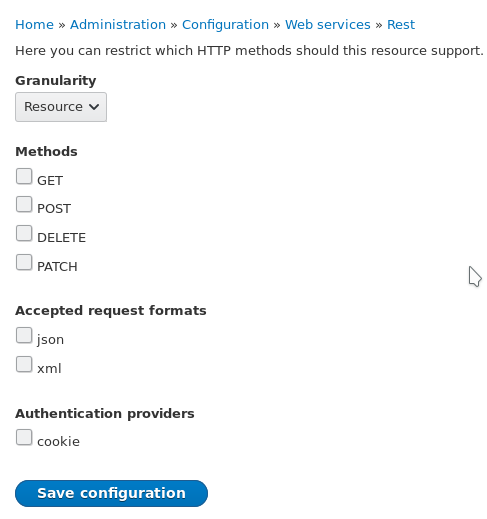

Вы наверняка уже заметили, что Дрис часто говорит и поднимает тему Decoupled
Drupal. Также вы, скорее всего, уже знакомы с различными фронтенд-библиотеками,
такими как Vuejs, React, Angular и т. д. И понять, куда движется веб, в
общем-то, несложно, как и друпал. Если говорить кратко, во всём этом
многообразии терминов и технологий Drupal служит как бэкенд, хранилище и
структуризация данных, как некий менеджер, а не всё в одном.

REST и Decoupled идут рука об руку, и это, если уже не на первом месте, то
однозначно находилось в ТОПе задач для Drupal 8 в момент его создания. Начиная с
версии 8, Drupal можно использовать как сервис, и для этого есть огромное
количество инструментов в ядре, и очень много было пересмотрено под это дело. В
версии 7 всё это также можно реализовать, но версия 8 позволяет это сделать
намного проще и элегантнее.

Если вы следите за моим телеграм-каналом, вы должны были обратить внимание, как
регулярно я стал поднимать тему про Vuejs и ему подобные. И это неспроста.
Вместо этого материала должен был быть материал о Vue.js + Search API и о том,
как сделать свой красивый, быстрый и отзывчивый поиск на сайте на такой связке.
Но недавно я решил завести личный проект и изучить Drupal 8 в тех местах, где
ещё мне не доводилось это делать на клиентских сайтах, и ставил себе задачи,
которые не совсем ясно, как решать с ходу и использовать на клиентских —
страшно, и я нашёл это — REST Resource, ответ на многие мои вопросы и источник
для целой цепочки материалов. Это отлично, ведь если бы я написал
запланированную статью раньше этой, то она была бы не совсем корректной, как мне
теперь кажется. Итак, перейдём к делу.

## Кому и зачем это нужно

Задачи у вас могут быть совершенно разные, точно сказать не выйдет. Если все
сильно обобщать, то данные плагины помогут построить "мосты" между Drupal и
сторонними решениями. Вы сможете делать в прямом смысле API для сайта легко и
непринужденно и использовать это в своих проектах. Надо подтянуть на фронтенд
Vue, React и настроить общением между ними — без проблем, надо сделать нативное
мобильное приложение для сайта, но при этом управление должно быть через
Drupal — как пить дать.

Если вам нужны данные из друпал, или вы хотите добавлять данные в друпал из
сторонних источников и ПО — эта статья для вас.

## REST Resource Plugin — из чего состоит и что умеет

Как и все плагины в Drupal 8, он создается в определенном месте (
src/Plugin/rest/resource), имеет аннотацию и наследует базовую структуру.

В базовом виде он выглядит так:

```php
<?php

namespace Drupal\MYMODULE\Plugin\rest\resource;

use Drupal\Core\Session\AccountProxyInterface;
use Drupal\rest\Plugin\ResourceBase;
use Drupal\rest\ResourceResponse;
use Drupal\user\UserInterface;
use Psr\Log\LoggerInterface;
use Symfony\Component\DependencyInjection\ContainerInterface;

/**
 * @RestResource(
 *   id = "example",
 *   label = @Translation("Example"),
 *   uri_paths = {
 *     "canonical" = "/path"
 *   }
 * )
 */
class Example extends ResourceBase {

  /**
   * A current user instance.
   *
   * @var \Drupal\Core\Session\AccountProxyInterface
   */
  protected $currentUser;

  /**
   * {@inheritdoc}
   */
  public function __construct(
    array $configuration,
    $plugin_id,
    $plugin_definition,
    array $serializer_formats,
    LoggerInterface $logger,
    AccountProxyInterface $current_user) {
    parent::__construct($configuration, $plugin_id, $plugin_definition, $serializer_formats, $logger);

    $this->currentUser = $current_user;
  }

  /**
   * {@inheritdoc}
   */
  public static function create(ContainerInterface $container, array $configuration, $plugin_id, $plugin_definition) {
    return new static(
      $configuration,
      $plugin_id,
      $plugin_definition,
      $container->getParameter('serializer.formats'),
      $container->get('logger.factory')->get('dummy'),
      $container->get('current_user')
    );
  }

}

```

Для их создания я крайне рекомендую использовать Drupal
Console `drupal generate:plugin:rest:resource` или же сокращение `drupal gprr`.

Рассмотрим его по быстрому.

### Аннотация @RestResource()

Аннотация как и у других плагинов служит описанием плагина с какими-то
необходимыми значениями и является обязательной. Аннотация данного типа
принимает следующие значения.

* `id`: Машинное название для плагина.
* `label`: Понятное название для людей. Показывается в админке.
* `uri_paths`: Массив с URL. На них мы остановимся подробнее на примерах, но
  данный массив также может принимать всего два значения:
  * `canonical`: Принимает путь по которому будет находится REST ресурс,
    например `/api/name`. Может принимать аргументы и указываются они следующим
    образом `/api/name/{id}`.
  * `create`: Аналогично canonical, используется только в определенных случаях.
    В более ранних версия 8-го друпала он имел
    имя `https://www.drupal.org/link-relations/create` и оно до сих пор
    поддерживается, но в качестве фолбека. Поддержка краткого названия доступа с
    8.4.0.

Тут мы немного притормозим и разжуем чтобы к этому больше не возвращаться. Оба
параметра `canonical` и `create` задают путь для ресурса и по сути будут всегда
равны, но могут и отличаться, тут никаких ограничений нет.

**Зачем есть `create` и в чём отличие от `canonical`.** REST, это по сути
обращение к сервису и получение от него ответа. Все это строится на запросах к
REST ресурсу, URL для которого мы тут и задаем. А запросы в вебе могут быть
различные: `GET`, `HEAD`, `POST`, `PUT`, `DELETE`, `TRACE`, `OPTIONS`, `CONNECT`
и `PATCH`.

Друпал делит их на две группы:

1. Первая: `HEAD`, `GET`, `OPTIONS` и `TRACE`, `DELETE`, `CONNECT` и `PATCH`.
2. Вторая: `POST`,  (обратите внимание `PUT` нет ни там, ни там, так как
   он [не поддерживается REST в Drupal 8](https://groups.drupal.org/node/284948)).

Возвращаясь `uri_paths`, выходит что для первой группы используется `canonical`,
а для второй (`POST`) `create`.

Также их можно разделить на безопасные и небезопасные:

1. Безопасные (только для чтения): `HEAD`, `GET`, `OPTIONS` и `TRACE` .
2. Небезопасные (поддержка записи):  `POST`, `DELETE`, `CONNECT` и `PATCH`.

Но при этом, <mark>в одном плагине могут быть как первая группа, так и
вторая</mark>!

### Как плагин понимает что обрабатывать

А тут всё очень просто. Для каждого типа запроса (разумеется, кроме `PUT`) в
плагине просто объявляется одноименный метод. Для `GET` будет `get()`,
для `POST` будет `post()` и т.д. Они будут возвращать `ResourceResponse` или его
аналоги.

Вы можете создавать методы для всех запросов сразу в одном плагине и даже
обрабатывать как вам нужно каждый индивидуально. Единственное, не забывайте
указать корректный `uri_paths`. Если вы используете только безопасные запросы,
то указывать uri для небезопасных не нужно, это правило работает и наоборот. Но
если у вас есть и `get()` и `post()` в одном плагине, то указывать нужно оба,
даже если они будут одинаковые — это нормально.

<mark>Вам не нужно регистрировать route</mark>, это будет сделано автоматически!
Вам достаточно создать плагин, описать в нём что нужно, включить, и всё, оно
просто работает.

## Как делать запросы к REST Resource

Прежде чем мы перейдем к примерам, нам стоит рассмотреть данный вопрос. Если вы
знакомы с чужими API и вообще в целом с подходом, то все равно прочитайте данный
раздел, так как в Drupal есть <mark>специфичные требования</mark>, без которых
можно долго искать причину ошибки.

Все примеры запросов к REST я буду приводить в примерах запросов через JS, так
как вариантов как к ним обратиться очень много, а этот будет, вероятнее всего,
самый востребованный.

### Запросы к безопасным ресурсам

Запрос происходит как обычный AJAX, вы запрашиваете нужный URI, передаете, если
нужно, данные и получаете от него свой же ответ. Всё просто как 2х2, но <mark>
есть одно НО</mark>.

<mark>Все запросы к безопасным ресурсам</mark> должны иметь параметр `_format` с
каким-либо значением. Из коробки друпал предоставляет два варианта `json`
и `xml`. При включении ресурса вы сами выбираете какие форматы данный ресурс
может отдавать, вы можете запретить один, или скачать модуль\написать плагин и
объявить новый тип данных которые он будет отдавать, но параметр этот всегда
обязателен.

```js {"header":"Пример запроса к GET ресурсу"}
$.ajax({
  url: '/api/v1/example-resource',
  dataType: 'json',
  data: {
    '_format': 'json',
    'key': 'value',
  },
  type: 'GET',
  success: response => {
    // Do something if succed.
  },
  error: response => {
    // Do something on error.
  },
});
```

### Запросы к небезопасным ресурсам

Аналогично примеру выше, тут также есть свои требования к запросу. Здесь нет
необходимости указывать `_format`, **если данный ресурс не отдает что-либо** (
если вы ожидаете ответ от подобных запросов, указывать необходимо).

Для запроса к небезопасным ресурсам <mark>нужно обязательно указать</mark>
заголовки `X-CRSF-Token` и `Content-Type`.

* `X-CRSF-Token`: Здесь указывается токен сессии для отправки данных. Получить
  его можно по пути `/session/token`, либо выполнив `POST` запрос на
  авторизацию `/user/login?_format=json` передав туда `name` и `pass`.
* `Content-Type`: Указывается MIME тип данных которые вы шлете на ресурс.
  Например, для `json` это `application/json`.

```js {"header":"Получение Session Token и выполнение POST запроса с поддержкой cookie авторизации"}
let sessionToken = new Promise((resolve, reject) => {
  $.ajax({
    url: '/session/token',
    dataType: 'text',
    type: 'GET',
    success: response => {
      resolve(response);
    },
    error: response => {
      reject(response);
    },
  });
});

sessionToken.then(
    token => {
      $.ajax({
        url: '/api/v1/add-something',
        type: 'POST',
        headers: {
          'Content-Type': 'application/json',
          'X-CSRF-Token': token,
        },
        dataType: 'json',
        data: JSON.stringify({
          'key': 'value',
        }),
        success: () => {
          location.reload();
        },
        error: response => {
          alert('ERROR');
        },
      });
    },
);
```

## Доступ к REST ресурсам.

Доступ к REST ресурсам контролируется на двух этапах:

1. `AuthenticationProvider`: данные провайдеры выбираются в момент включается
   REST Resource и могут быть изменены в момент редактирования. Их может быть
   несколько сразу и вы можете объявить свои. Об этом будет мой следующий
   материал. В ядре их два:
   * `Cookie`: Авторизация посредством Cookie файла. Все очень просто. При
   обращении он проверяет, есть ли cookie с сессией, и если есть, то активна ли она
   или нет. Если активна (читай авторизован) — доступ будет разрешен, в противном
   случае нет.
   * `Basic auth`: Авторизация при помощи пары логин-пароль. Отсылается вместе с
   header запроса. По умолчанию данный способ не будет доступен. Для того чтобы он
   появился необходимо включить одноименный модуль из ядра.
2. Пермишеном для конкретного ресурса/роли. Для каждого REST Resource создается
   permission вида `restful [TYPE] [RESOURCE_NAME]`. Например, если ваш resource
   имеет два типа `GET` и `POST`, а называется `example` то в админке появятся
   два пермишина: `restful get example` и `restful post example`.
3. Управляется самим ресурсом. Вы можете делать проверку для юзера по всем
   доступным пермишенам и решать, давать доступ или нет.

```js {"header":"Выполнение запроса и использование Basic Auth"}
$.ajax({
  url: '/session/token',
  dataType: 'text',
  type: 'GET',
  header: {
    'Authorization:': 'Basic login:password',
  },
  success: response => {
    this.restToken = response;
    resolve(response);
  },
  error: response => {
    this.error = response.statusText;
    reject(response);
  },
});
```

Если Basic Auth не устраивает, нужно через Cookie, а пользователь не
авторизован? Авторизовываем и записываем его CRSF Token. Для этого необходимо
отправить POST запрос следующего вида:

```js {"header":"Авторизация через POST"}
$.ajax({
  url: '/user/login?_format=json',
  type: 'POST',
  headers: {
    'Content-Type': 'application/json',
  },
  dataType: 'json',
  data: JSON.stringify({
    'name': 'admin',
    'pass': 'admin'
  }),
  success: response => {
    // Log in successful.
  },
  error: response => {
    // Some error.
  },
});
```

```json {"header":"Пример успешного ответа"}
{
  "current_user": {
    "uid": "1",
    "roles": [
      "authenticated",
      "administrator"
    ],
    "name": "admin"
  },
  "csrf_token": "RhBRVldrNVToPc4nHx-GPk00cE-Jwk-U2kX8338bEs0",
  "logout_token": "Epw4MKM3p0ZsmdFeEbkS8R7FQDU-VLZ4SAsP6ULNCGk"
}
```

## Дополнительно

Как вы могли догадаться, просто так ничего не заработает. Нужно включить модуль
из ядра RESTful Services (rest) для работы плагинов. Также, для того чтобы эти
самые ресурсы включать и настраивать необходимо установить и включить модуль
REST UI (`composer require drupal/restui`). В противном случае конфиги на
активацию и настройку ресурсов придется писать руками.

Весь код подразумевает что модуль, в котором мы его пишем, имеет название dummy.

## Пример №1 — получение пользователя по email

В данном примере мы создадим REST Resource, который будет отдавать id юзера, его
имя и email по email. Если пользователя с указанным email не будет найдено, мы
будем выдавать соответствующую ошибку. Данный ресурс мы сделаем доступным по
адресу `/api/v1/get-user-by-email`.

Плагин должен находиться по пути `/src/Plugin/rest/resource`. Назовем мы его
соответственно: `GetUserByEmailResource.php`.

```php {"header":"/src/Plugin/rest/resource/GetUserByEmailResource.php"}
<?php

namespace Drupal\dummy\Plugin\rest\resource;

use Drupal\Core\Session\AccountProxyInterface;
use Drupal\rest\Plugin\ResourceBase;
use Drupal\rest\ResourceResponse;
use Drupal\user\UserInterface;
use Psr\Log\LoggerInterface;
use Symfony\Component\DependencyInjection\ContainerInterface;

/**
 * Provides a resource to get user by email.
 *
 * @RestResource(
 *   id = "get_user_by_email_resource",
 *   label = @Translation("Get user by email resource"),
 *   uri_paths = {
 *     "canonical" = "/api/v1/get-user-by-email"
 *   }
 * )
 */
class GetUserByEmailResource extends ResourceBase {

  /**
   * A current user instance.
   *
   * @var \Drupal\Core\Session\AccountProxyInterface
   */
  protected $currentUser;

  /**
   * {@inheritdoc}
   */
  public function __construct(
    array $configuration,
    $plugin_id,
    $plugin_definition,
    array $serializer_formats,
    LoggerInterface $logger,
    AccountProxyInterface $current_user) {
    parent::__construct($configuration, $plugin_id, $plugin_definition, $serializer_formats, $logger);

    $this->currentUser = $current_user;
  }

  /**
   * {@inheritdoc}
   */
  public static function create(ContainerInterface $container, array $configuration, $plugin_id, $plugin_definition) {
    return new static(
      $configuration,
      $plugin_id,
      $plugin_definition,
      $container->getParameter('serializer.formats'),
      $container->get('logger.factory')->get('dummy'),
      $container->get('current_user')
    );
  }

  /**
   * Responds to GET requests.
   */
  public function get() {
    $query = \Drupal::request()->query;
    $response = [];
    if ($query->has('email')) {
      $result = \Drupal::entityTypeManager()
        ->getStorage('user')
        ->loadByProperties(['mail' => $query->get('email')]);
      $user = reset($result);

      if ($user instanceof UserInterface) {
        $response['user'] = [
          'name' => $user->label(),
          'uid' => $user->id(),
          'mail' => $user->getEmail(),
        ];
        return new ResourceResponse($response);
      }
      else {
        $response['user'] = NULL;
        $response['message'] = 'User with email ' . $query->get('email') . ' is not found';
        return new ResourceResponse($response);
      }
    }
    else {
      return new ResourceResponse('Required parameter email is not set.', 400);
    }
  }

}
```

Давайте рассмотрим файл по порядку, за исключением стандартных
методов `__construct()` и `create()`.

**Аннотация.** Первым делом мы смотрим на неё и видим, я задал машинное имя
ресурса (`id`), его метку (`label`) и указал путь для ресурса:
/api/v1/get-user-by-email. Так как наш ресурс будет работать только с `GET`, то
мы указываем только `canonical`.

**Метод `get()`.** Так как наш ресурс будет принимать только `GET` запросы, то
мы создаем всего один одноименный метод. Он то и отвечает за ответ сервера в
нашем случае. В нем:

1. Мы получаем query текущего запроса в переменную для быстрого обращения.
2. Проверяем, передан ли параметр `email` вместе с запросом. Если передан, идём
   дальше, если же нет, мы возвращаем ответ с кодом 400 и сообщением что данный
   параметр обязательный.
3. Мы пытаемся загрузить пользователя с email который был передан в параметре.

   3.1 Если юзер найден, отдаем его имя, id и почту.

   3.2 Если не найден, выдаем ответ что пользователь не найден указав email
   который был передан.

Вот и всё!

```js {"header":"Пример запроса к ресурсу"}
$.ajax({
  url: '/api/v1/get-user-by-email',
  type: 'GET',
  dataType: 'json',
  headers: {
    'test': 'test',
  },
  data: {
    '_format': 'json',
    'email': 'niklanrus@gmail.com',
  },
  success: response => {
    console.log(response);
  },
  error: response => {
    console.log(response.respononseText);
  },
});
```

```js {"header":"Примеры ответов"}
// Пользователь  найден
{
  user: {
    mail: "niklanrus@gmail.com"
    name: "admin"
    uid: "1"
  }
}

// Пользователь не найден
{
  message: "User with email niklanrus1@gmail.com is not found"
  user: null
}
```

## Пример №2 — список статей

В данном примере всё остается прежним, мы меняем задачу на получение статей с
сайта, а также немного её усложняем добавляя туда поддержку пейджера,
ограничения результатов и дополнительные пару данных.

Перейдем сразу к коду:

```php {"header":"src/Plugin/rest/resource/ListArticlesResource.php"}
<?php

namespace Drupal\dummy\Plugin\rest\resource;

use Drupal\Core\Session\AccountProxyInterface;
use Drupal\Core\Url;
use Drupal\rest\Plugin\ResourceBase;
use Drupal\rest\ResourceResponse;
use Psr\Log\LoggerInterface;
use Symfony\Component\DependencyInjection\ContainerInterface;
use Symfony\Component\HttpKernel\Exception\AccessDeniedHttpException;

/**
 * Provides a resource to get articles.
 *
 * @RestResource(
 *   id = "list_articles_resource",
 *   label = @Translation("List articles resource"),
 *   uri_paths = {
 *     "canonical" = "/api/v1/list-articles"
 *   }
 * )
 */
class ListArticlesResource extends ResourceBase {

  /**
   * A current user instance.
   *
   * @var \Drupal\Core\Session\AccountProxyInterface
   */
  protected $currentUser;

  /**
   * Default limit entities per request.
   */
  protected $limit = 10;

  /**
   * Constructs a new ListArticlesResource object.
   *
   * @param array $configuration
   *   A configuration array containing information about the plugin instance.
   * @param string $plugin_id
   *   The plugin_id for the plugin instance.
   * @param mixed $plugin_definition
   *   The plugin implementation definition.
   * @param array $serializer_formats
   *   The available serialization formats.
   * @param \Psr\Log\LoggerInterface $logger
   *   A logger instance.
   * @param \Drupal\Core\Session\AccountProxyInterface $current_user
   *   A current user instance.
   */
  public function __construct(
    array $configuration,
    $plugin_id,
    $plugin_definition,
    array $serializer_formats,
    LoggerInterface $logger,
    AccountProxyInterface $current_user) {
    parent::__construct($configuration, $plugin_id, $plugin_definition, $serializer_formats, $logger);

    $this->currentUser = $current_user;
  }

  /**
   * {@inheritdoc}
   */
  public static function create(ContainerInterface $container, array $configuration, $plugin_id, $plugin_definition) {
    return new static(
      $configuration,
      $plugin_id,
      $plugin_definition,
      $container->getParameter('serializer.formats'),
      $container->get('logger.factory')->get('dummy'),
      $container->get('current_user')
    );
  }

  /**
   * Responds to GET requests.
   */
  public function get() {
    if (!$this->currentUser->hasPermission('access content')) {
      throw new AccessDeniedHttpException();
    }

    $response = [
      'items' => [],
      'next_page' => FALSE,
      'prev_page' => FALSE,
    ];
    $request = \Drupal::request();
    $request_query = $request->query;
    $request_query_array = $request_query->all();
    $limit = $request_query->get('limit') ?: $this->limit;
    $page = $request_query->get('page') ?: 0;

    // Find out how many articles do we have.
    $query = \Drupal::entityQuery('node')->condition('type', 'article');
    $articles_count = $query->count()->execute();
    $position = $limit * ($page + 1);
    if ($articles_count > $position) {
      $next_page_query = $request_query_array;
      $next_page_query['page'] = $page + 1;
      $response['next_page'] = Url::createFromRequest($request)
        ->setOption('query', $next_page_query)
        ->toString(TRUE)
        ->getGeneratedUrl();
    }

    if ($page > 0) {
      $prev_page_query = $request_query_array;
      $prev_page_query['page'] = $page - 1;
      $response['prev_page'] = Url::createFromRequest($request)
        ->setOption('query', $prev_page_query)
        ->toString(TRUE)
        ->getGeneratedUrl();
    }

    // Find articles.
    $query = \Drupal::entityQuery('node')
      ->condition('type', 'article')
      ->sort('created', 'DESC')
      ->pager($limit);
    $result = $query->execute();
    $articles = \Drupal::entityTypeManager()
      ->getStorage('node')
      ->loadMultiple($result);

    /** @var \Drupal\node\Entity\Node $article */
    foreach ($articles as $article) {
      $response['items'][] = [
        'label' => $article->label(),
        'id' => $article->id(),
        'created' => $article->getCreatedTime(),
      ];
    }

    return new ResourceResponse($response, 200);
  }

}
```

Весь каркас остался прежним. Изменилось название, URL и появилось новое свойство
у объекта `$limit`, которое содержит ограничение результатов на страницу
равное 10.

А теперь пойдем по логике:

1. В этот раз мы первым делом проверяем, есть ли у пользователя доступ на
   просмотр опубликованного содержимого. Если его нет, мы сразу возвращаем
   ошибку.
2. Далее мы подготавливаем значения по умолчанию для нашего ответа в
   переменной `$response`.
3. Также мы сохраняем в переменную текущий query, адрес и устанавливаем лимит
   элементов на страницу, если он не был передан с запросом, и текущую страницу.
4. Затем выполняем простенький запрос чтобы узнать сколько у нас статей на
   сайте.
5. После того как мы узнали сколько статей на сайте, мы генерируем ссылки для
   предыдущей и следующей страницы, которые будут возвращены с результатом. Эти
   ссылки будут содержать все те же параметры что были переданы пользователем,
   мы лишь меняем номер страницы, если такой применим. Если следующей или
   предыдущей страницы нет, условия не пройдут и результат отдаст `FALSE`. Так
   мы сделали небольшую навигацию по материалам и ослабили запросы. Хоть мы и
   позволяем пользователю передать кол-во элементов на страницу, вы можете это и
   запретить, таким образом снизив нагрузку на ресурс если материалов
   действительно много. Возможно, тому кто будет запрашивать и не нужны все
   материалы, а хватит последних 5, зачем грузить лишнюю информацию и
   увеличивать время ответа, верно?
6. Затем мы непосредственно грузим нужное кол-во материалов и добавляем
   информацию о каждом материале в `items`, куда мы складываем заголовок
   материала, его id и дату создания.
7. Отдаем результат пользователю!

```js {"header":"Пример запроса к ресурсу"}
$.ajax({
  url: '/api/v1/list-articles',
  type: 'GET',
  dataType: 'json',
  data: {
    '_format': 'json',
    'limit': 5,
  },
  success: response => {
    console.log(response);
  },
  error: response => {
    console.log(response.respononseText);
  },
});
```

```json {"header":"Пример ответа"}
{
  "items": [
    {
      "label": "Created via REST",
      "id": "57",
      "created": "1515932692"
    },
    {
      "label": "test",
      "id": "38",
      "created": "1506701746"
    },
    {
      "label": "test",
      "id": "54",
      "created": "1506701746"
    },
    {
      "label": "test",
      "id": "39",
      "created": "1506701746"
    },
    {
      "label": "test",
      "id": "55",
      "created": "1506701746"
    }
  ],
  "next_page": "\/api\/v1\/list-articles?_format=json\u0026limit=5\u0026page=1",
  "prev_page": false
}
```

## Пример №3 — получение всей информации о статье

Из коробки в Drupal 8 для всех типов сущности генерируются ресурсы по которым
можно запросить определенную сущность и даже опубликовать её через данные роуты.
Например, для нод будет `/node/{node}` для `GET`, `PATCH`, `DELETE` и
просто `/node` для `POST` запросов.

Мы же напишем аналог со своим URL и которые будет отдавать **только** статьи.
Например, если по запрошенному id окажется новость или другой тип материала — мы
будем выдавать ошибку.

Данный пример крайне простой и несет в себе больше "показательный" характер, что
можно и так, о чём я, вы поймете посмотрев на код:

```php {"header":"src/Plugin/rest/resource/GetArticleResource.php"}
<?php

namespace Drupal\dummy\Plugin\rest\resource;

use Drupal\Core\Session\AccountProxyInterface;
use Drupal\rest\Plugin\ResourceBase;
use Drupal\rest\ResourceResponse;
use Psr\Log\LoggerInterface;
use Symfony\Component\DependencyInjection\ContainerInterface;
use Symfony\Component\HttpKernel\Exception\AccessDeniedHttpException;

/**
 * Provides a resource to get article info.
 *
 * @RestResource(
 *   id = "get_article_resource",
 *   label = @Translation("Get article resource"),
 *   uri_paths = {
 *     "canonical" = "/api/v1/get-article/{id}"
 *   }
 * )
 */
class GetArticleResource extends ResourceBase {

  /**
   * A current user instance.
   *
   * @var \Drupal\Core\Session\AccountProxyInterface
   */
  protected $currentUser;

  /**
   * Constructs a new GetArticleResource object.
   *
   * @param array $configuration
   *   A configuration array containing information about the plugin instance.
   * @param string $plugin_id
   *   The plugin_id for the plugin instance.
   * @param mixed $plugin_definition
   *   The plugin implementation definition.
   * @param array $serializer_formats
   *   The available serialization formats.
   * @param \Psr\Log\LoggerInterface $logger
   *   A logger instance.
   * @param \Drupal\Core\Session\AccountProxyInterface $current_user
   *   A current user instance.
   */
  public function __construct(
    array $configuration,
    $plugin_id,
    $plugin_definition,
    array $serializer_formats,
    LoggerInterface $logger,
    AccountProxyInterface $current_user) {
    parent::__construct($configuration, $plugin_id, $plugin_definition, $serializer_formats, $logger);

    $this->currentUser = $current_user;
  }

  /**
   * {@inheritdoc}
   */
  public static function create(ContainerInterface $container, array $configuration, $plugin_id, $plugin_definition) {
    return new static(
      $configuration,
      $plugin_id,
      $plugin_definition,
      $container->getParameter('serializer.formats'),
      $container->get('logger.factory')->get('dummy'),
      $container->get('current_user')
    );
  }

  /**
   * Responds to GET requests.
   */
  public function get(int $id) {
    if (!$this->currentUser->hasPermission('access content')) {
      throw new AccessDeniedHttpException();
    }

    $article = \Drupal::entityTypeManager()->getStorage('node')->load($id);
    if ($article && $article->bundle() == 'article') {
      return new ResourceResponse($article);
    }
    else {
      $response['message'] = 'Article with provided ID is not found.';
      return new ResourceResponse($response, 400);
    }
  }

}
```

Описывать особо тут и нечего, всё также как и в предыдущих примерах. Обращаю
лишь ваше внимание на то что мы не подготавливаем данные которые хотим вернуть.
Мы просто отдаем в качестве результата объект сущности, и всё!

Если я правильно понимаю как оно работает, затем REST вызывает `toArray()` и это
становится результатом.

Также тут можно заметить что в url появился параметр `id`, который соответствует
материалу. Параметры в ресурсах работают аналогично параметрам в роутах, так как
этот URL превращается в роут программным способом. Если вы с ними не знакомы, то
лучше обратиться
к [соответствующей документации](https://www.drupal.org/node/2186285). А данные
значения передаются в аргументы методу.

```js {"header":"Пример запроса к ресурсу"}
let nid = 57;
$.ajax({
  url: '/api/v1/get-article/' + nid,
  type: 'GET',
  dataType: 'json',
  data: {
    '_format': 'json',
  },
  success: response => {
    console.log(response);
  },
  error: response => {
    console.log(response.respononseText);
  },
});
```

```json {"header":"Пример ответа ресурса"}
{
  "nid": [
    {
      "value": 57
    }
  ],
  "uuid": [
    {
      "value": "a926af69-3f8b-410f-a7b6-29b99fb8e875"
    }
  ],
  "vid": [
    {
      "value": 107
    }
  ],
  "langcode": [
    {
      "value": "en"
    }
  ],
  "type": [
    {
      "target_id": "article",
      "target_type": "node_type",
      "target_uuid": "fceeaa32-5ea0-4d4c-b359-1ef3b2d866c7"
    }
  ],
  "revision_timestamp": [
    {
      "value": "2018-01-14T12:24:52+00:00",
      "format": "Y-m-d/TH:i:sP"
    }
  ],
  "revision_uid": [
    {
      "target_id": 1,
      "target_type": "user",
      "target_uuid": "50ea3e78-85c6-4834-8d15-5680bc258617",
      "url": "\/en\/user\/1"
    }
  ],
  "revision_log": [
  ],
  "status": [
    {
      "value": true
    }
  ],
  "title": [
    {
      "value": "Created via REST"
    }
  ],
  "uid": [
    {
      "target_id": 1,
      "target_type": "user",
      "target_uuid": "50ea3e78-85c6-4834-8d15-5680bc258617",
      "url": "\/en\/user\/1"
    }
  ],
  "created": [
    {
      "value": "2018-01-14T12:24:52+00:00",
      "format": "Y-m-d/TH:i:sP"
    }
  ],
  "changed": [
    {
      "value": "2018-01-14T12:24:52+00:00",
      "format": "Y-m-d/TH:i:sP"
    }
  ],
  "promote": [
    {
      "value": true
    }
  ],
  "sticky": [
    {
      "value": false
    }
  ],
  "default_langcode": [
    {
      "value": true
    }
  ],
  "revision_translation_affected": [
    {
      "value": true
    }
  ],
  "metatag": {
    "value": {
      "title": "Created via REST | Drupal8 DEVELOPMENT"
    }
  },
  "path": [
    {
      "alias": null,
      "pid": null,
      "langcode": "en"
    }
  ],
  "menu_link": [
  ],
  "content_translation_source": [
    {
      "value": "und"
    }
  ],
  "content_translation_outdated": [
    {
      "value": false
    }
  ],
  "body": [
  ],
  "comment": [
    {
      "status": 2,
      "cid": 0,
      "last_comment_timestamp": 1515932692,
      "last_comment_name": null,
      "last_comment_uid": 1,
      "comment_count": 0
    }
  ],
  "field_image": [
  ],
  "field_tags": [
  ],
  "field_test": [
    "Metatags are normalized in the metatag field."
  ]
}
```

## Пример №4 — создание статьи

В текущем примере мы уже перейдем от `GET` к `POST` и напишем ресурс, который
будет создавать материал из того что пришлют в теле запроса.

Мы не будем усложнять пример различными проверками, мы просто будем сразу
передавать тело запроса в `Node::create()` и дальше он будет разруливать
полученные данные. На реальные ресурсах так делать я не рекомендую. Какие-то
проверки лучше будет добавить.

```php {"header":"src/Plugin/rest/resource/CreateArticleResource.php"}
<?php

namespace Drupal\dummy\Plugin\rest\resource;

use Drupal\Core\Session\AccountProxyInterface;
use Drupal\rest\Plugin\ResourceBase;
use Drupal\rest\ResourceResponse;
use Psr\Log\LoggerInterface;
use Symfony\Component\DependencyInjection\ContainerInterface;
use Symfony\Component\HttpKernel\Exception\AccessDeniedHttpException;

/**
 * Provides a resource to create new article.
 *
 * @RestResource(
 *   id = "create_article_resource",
 *   label = @Translation("Create article resource"),
 *   uri_paths = {
 *     "create" = "/api/v1/create-article",
 *   }
 * )
 */
class CreateArticleResource extends ResourceBase {

  /**
   * A current user instance.
   *
   * @var \Drupal\Core\Session\AccountProxyInterface
   */
  protected $currentUser;

  /**
   * Constructs a new CreateArticleResource object.
   *
   * @param array $configuration
   *   A configuration array containing information about the plugin instance.
   * @param string $plugin_id
   *   The plugin_id for the plugin instance.
   * @param mixed $plugin_definition
   *   The plugin implementation definition.
   * @param array $serializer_formats
   *   The available serialization formats.
   * @param \Psr\Log\LoggerInterface $logger
   *   A logger instance.
   * @param \Drupal\Core\Session\AccountProxyInterface $current_user
   *   A current user instance.
   */
  public function __construct(
    array $configuration,
    $plugin_id,
    $plugin_definition,
    array $serializer_formats,
    LoggerInterface $logger,
    AccountProxyInterface $current_user) {
    parent::__construct($configuration, $plugin_id, $plugin_definition, $serializer_formats, $logger);

    $this->currentUser = $current_user;
  }

  /**
   * {@inheritdoc}
   */
  public static function create(ContainerInterface $container, array $configuration, $plugin_id, $plugin_definition) {
    return new static(
      $configuration,
      $plugin_id,
      $plugin_definition,
      $container->getParameter('serializer.formats'),
      $container->get('logger.factory')->get('dummy'),
      $container->get('current_user')
    );
  }

  /**
   * Responds to POST requests.
   */
  public function post($entity_data) {
    if (!$this->currentUser->hasPermission('create article content')) {
      throw new AccessDeniedHttpException();
    }

    try {
      $entity_data['type'] = 'article';
      $article = \Drupal::entityTypeManager()
        ->getStorage('node')
        ->create($entity_data);
      $article->save();
      return new ResourceResponse($article);
    } catch (\Exception $e) {
      return new ResourceResponse('Something went wrong during entity creation. Check your data.', 400);
    }
  }

}
```

Первое отличие от предыдущих примеров, теперь у нас в `uri_paths` не `canonical`
а `create`. Второе отличие в названии метода. Так как теперь мы ожидаем `POST`
запрос, то и метод назван `post()`.

Внутри метода всё просто:

1. Проверяем, есть ли у пользователя права на создание статей на сайте.
2. Если есть, мы принудительно устанавливаем тип "статья", не важно что нам
   прислали и пытаемся скормить данные `entityTypeManager()`.
3. Если все ок, и сущность создалась, мы возвращаем полные данные этой сущности
   как в примере №3. Если что-то пошло не так (а тут может пойти не так лишь то
   что данные переданы некорректно или в некорректном формате) мы делаем ответ с
   ошибкой.

Ничего особенно в отличии от других примеров нет, просто разные назначения и
слегонца отличаются данные.

```js {"header":"Пример запроса"}
let sessionToken = new Promise((resolve, reject) => {
  $.ajax({
    url: '/session/token',
    dataType: 'text',
    type: 'GET',
    success: response => {
      resolve(response);
    },
    error: response => {
      reject(response);
    },
  });

  sessionToken.then(
      token => {
        $.ajax({
          url: '/api/v1/create-article',
          type: 'POST',
          headers: {
            'Content-Type': 'application/json',
            'X-CSRF-Token': token,
          },
          dataType: 'json',
          data: JSON.stringify({
            title: 'Created from jQuery',
            body: {
              0: {
                value: 'Description for body field!'
              }
            }
          }),
          success: response => {
            console.log(response);
          },
          error: response => {
            alert('ERROR');
          },
        });
      },
  );
});
```

## Включение REST ресурса

С плагинами разобрались. Как писать понятно, модуль REST из ядра включили, но
страницы отдают "Страница не найдена"? Всё правильно, вы нигде не ошиблись!
Проблема в том, что плагины сами по себе не будут работать, есть куча
универсальных плагинов из ядра, есть от других модулей и делать их всех
доступными не правильно, поэтому ресурсы нужно включать. Для этого есть два
варианта:

1. Создать руками конфигурацию `rest.resource.{resource_id}`, импортировать в
   систему и так поддерживать активность ресурса. Такой подход имеет кучу
   недостатков и ни одного плюса. Вы должны очень хорошо понимать что вы имеете,
   какие возможности доступны, хорошо знать структуру конфиг файла и делать
   множество лишних движений. Мы его даже не будем рассматирвать. Но если по
   каким-то причинам он вам потребуется, например, включать ресурс при включении
   модуля, то вы можете все понять используя второй способ.
2. Использовать модуль [REST UI](https://www.drupal.org/project/restui).

Мы воспользуемся вторым способом. Качаем, включаем и готово. Переходим в "
Конфигурация - Веб сервисы - REST". У вас откроется страница со всеми доступными
REST ресурсами.

Для того чтобы включить какой-то ресурс, находим его в разделе отключенных и
жмем кнопку "Включить" справа от него. У вас откроется примерно следующая форма:



Данная форма будет также открываться при заходе в настройки для активных
ресурсов, так что не особо то и важно что вы зададите при включении, вы всегда
можете безболезненно поменять настройки.

Пройдемся по настройкам:

1. **Granuality (Детализация)**: Здесь вам доступно два варианта:
   1. **Resource**: Настройки будут применяться в целом для ресурса.
   2. **Method**: Настройки будут для каждого метода индивидуальные. Например, вы
   можете сделать чтобы `GET` отдавал только в json, `POST` в xml, а для `DELETE`
   способ авторизации был при помощи basic_auth.
2. **Methods (Методы)**: Галочками выбираются какие методы из плагина будут
   активны. Как я писал, вы можете делать все доступные методы в одном плагине,
   при этом работать они могут не все. Этот раздел настроек и решает какие из
   них будут доступны. Там появляются только те методы, которые доступны для
   выбранного плагина. Если вы объявили только `post()` меод, то только он и
   будет доступен для включения.
3. **Accepted request formats (Доступные форматы запроса)**: В каком типе данные
   могут быть возвращены. Юзер выбирает тип при помощи параметра `_format` в
   запросе, а какие будут действовать — выбираете вы для ресурса\метода.
4. **Authentication providers**: Способы авторизации. Здесь выбираются плагины,
   по которым будет определяться имеет ли пользователь доступ к ресурсу или нет.
   По умолчанию будет доступен только `Cookie`, также вы можете включить модуль
   из ядра `basic_auth` для второго способа, о котором я упоминал выше.

После этого вы сохраняете и ваш ресурс должен стать активным и запросы начнут
выполняться.


## И немножечко про кэш

В качестве заключения будет дополнение к примеру №2.

Все `ResourceResponse` кэшируются по умолчанию. Вы можете встретить проблему что
у вас отдаются одни и те же данные, когда нужны другие. Это очень критично для
динамики. С другой стороны, там где динамика не нужна, вы можете помочь друпалу
закэшировать данные ещё сильнее, тем самым увеличив производительность ресурса.

`ResourceResponse` использует `CacheableResponseTrait`, который позволяет
добавлять зависимости для кэширование при помощи
метода `addCacheableDependency()`. Этот метод и поможет нам творить с кэшем что
хотим.

По умолчанию `addCacheableDependency` принимает только объекты
с `CacheableDependencyInterface` интерфейсом. Вы можете передать туда объект
сущности, например, как в примере №3 и он подтащит кэш оттуда, а именно, он
сделает тег под сущность и он будет сбрасывать кэш когда сущность обновлена.

Второй вариант — использовать render array для кэша. Для этого достаточно просто
создать пустой массив с `#cache` render array и описать все требования. Так
как `addCacheableDependency` его не примет из-за расхождения в типах, нам надо
будет заранее помочь ему завернуть в соответствующий объект.

**Что мы сделаем.** Мы возьмем пример плагина №2 и добавим ему следующее
кэширование:

1. Мы добавим кэш теги для сущностей которые были возвращены в результате. Таким
   образом, если мы отдаем 5 последних материалов и один из них обновится —
   результат будет также обновлен.
2. Мы добавим максимальное время жизни кэша в 10 минут.
3. Мы добавим кэш контекст по `url.query_args`, тем самым кэшируя различные
   варианты комбинаций limit, page, и _format.

Привожу лишь измененный метод `get()`, где все изменения и происходят.

```php
/**
 * Responds to GET requests.
 */
public function get() {
  if (!$this->currentUser->hasPermission('access content')) {
    throw new AccessDeniedHttpException();
  }

  // Add default cache parameters.
  $cache = CacheableMetadata::createFromRenderArray([
    '#cache' => [
      'max-age' => 600,
      'contexts' => ['url.query_args'],
    ],
  ]);

  $response = [
    'items' => [],
    'next_page' => FALSE,
    'prev_page' => FALSE,
  ];
  $request = \Drupal::request();
  $request_query = $request->query;
  $request_query_array = $request_query->all();
  $limit = $request_query->get('limit') ?: $this->limit;
  $page = $request_query->get('page') ?: 0;

  // Find out how many articles do we have.
  $query = \Drupal::entityQuery('node')->condition('type', 'article');
  $articles_count = $query->count()->execute();
  $position = $limit * ($page + 1);
  if ($articles_count > $position) {
    $next_page_query = $request_query_array;
    $next_page_query['page'] = $page + 1;
    $response['next_page'] = Url::createFromRequest($request)
      ->setOption('query', $next_page_query)
      ->toString(TRUE)
      ->getGeneratedUrl();
  }

  if ($page > 0) {
    $prev_page_query = $request_query_array;
    $prev_page_query['page'] = $page - 1;
    $response['prev_page'] = Url::createFromRequest($request)
      ->setOption('query', $prev_page_query)
      ->toString(TRUE)
      ->getGeneratedUrl();
  }

  // Find articles.
  $query = \Drupal::entityQuery('node')
    ->condition('type', 'article')
    ->sort('created', 'DESC')
    ->pager($limit);
  $result = $query->execute();
  $articles = \Drupal::entityTypeManager()
    ->getStorage('node')
    ->loadMultiple($result);

  /** @var \Drupal\node\Entity\Node $article */
  foreach ($articles as $article) {
    $response['items'][] = [
      'label' => $article->label(),
      'id' => $article->id(),
      'created' => $article->getCreatedTime(),
    ];
    $cache->addCacheableDependency($article);
  }

  return (new ResourceResponse($response, 200))->addCacheableDependency($cache);
}
```

Быстро пробежимся по изменениям:

1. В самом начале я объявил новую переменную `$cache` в которую сразу добавил
   кэш-объект созданные из render array.
2. В цикле где добавляются результаты со статьями, мы каждую статью добавляем в
   зависимость. По умолчанию они будут попадать в cache tags в виде `node:NID`.
3. Результат возвращается почти также, только мы добавили вызов
   метода `addCacheableDependency` куда передали наш кэш-объект.

Хотите убедиться что всё ок? Посмотрите на заголовки ответа запрашиваемого
ресурса, и вы увидите наши данные.


По умолчанию будут следующие кэш данные:

1. **Contexts:** `languages:language_interface user.permissions`
2. **Tags:** `config:rest.resource.list_articles_resource http_response`

**Что это значит.** Это значит что результаты REST ресурсов по умолчанию имеют
варианты кэша под язык и доступы пользователя (читай роль). Возвращаясь про
упоминание динамики, чтобы вырубить их, вам нужно передать `max-age` равным 0,
либо возвращать `ModifiedResourceResponse()` вместо `ResourceResponse()`.

Если для вас данный раздел полон вопросов, то рекомендую почитать материал
про [кэширование в 8-ке][d8-cache-metadata].

Готовый модуль со всеми примерами прилагается.

## Ссылки

- [Исходный код модуля с примером](example/dummy)

[d8-cache-metadata]: ../../../../2017/07/15/drupal-8-cache-metadata/article.ru.md
