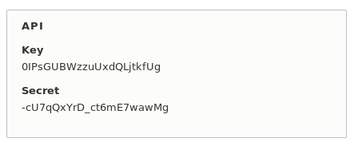
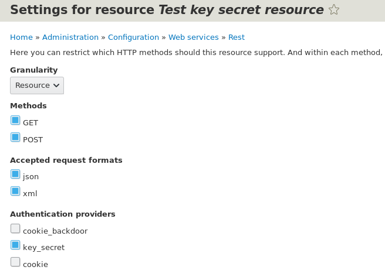
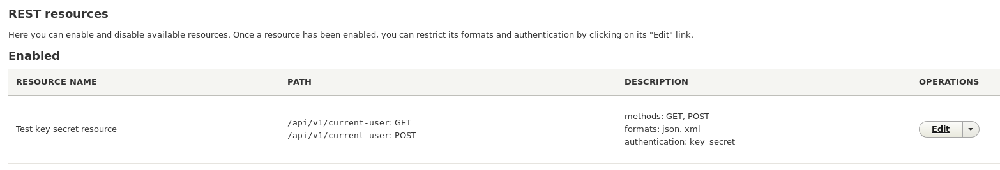
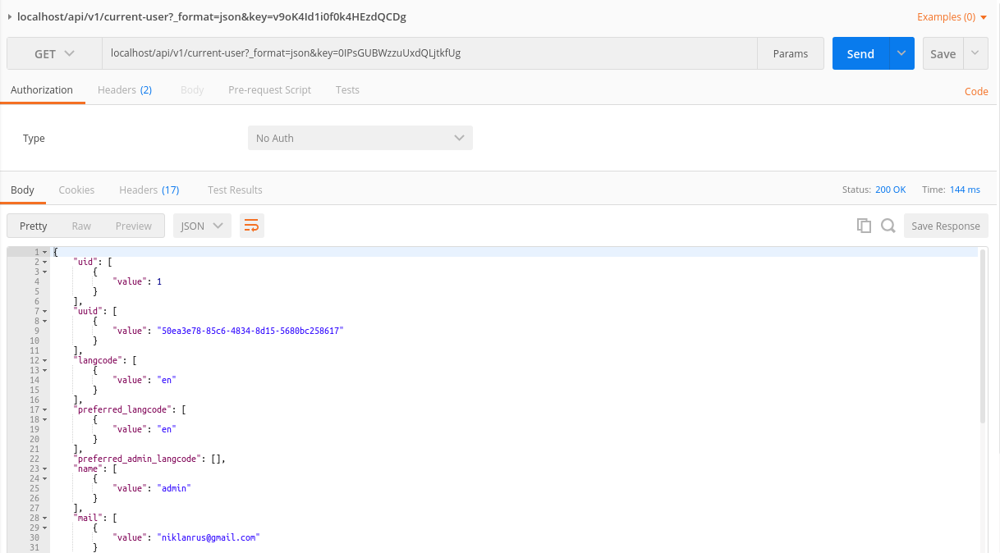
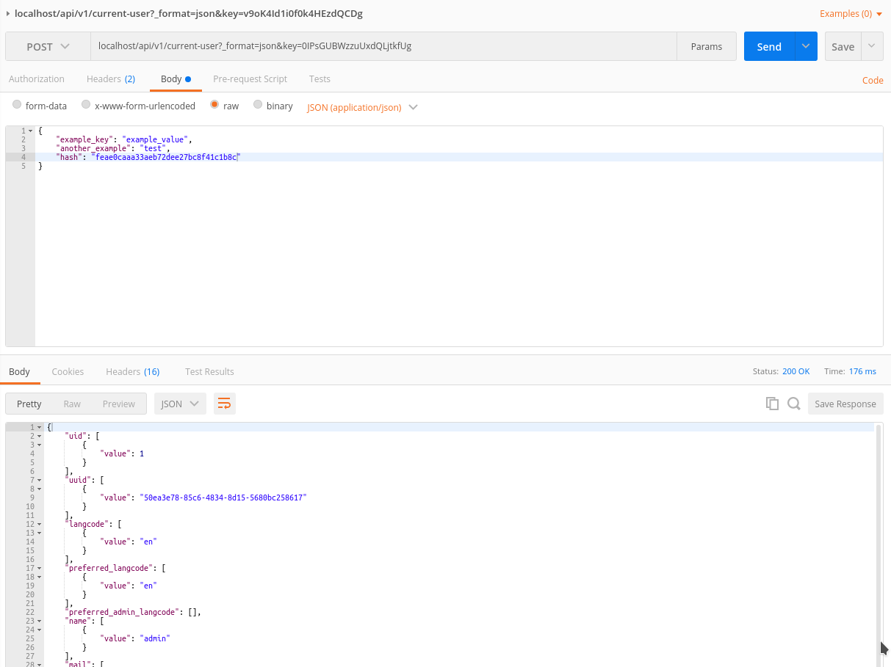
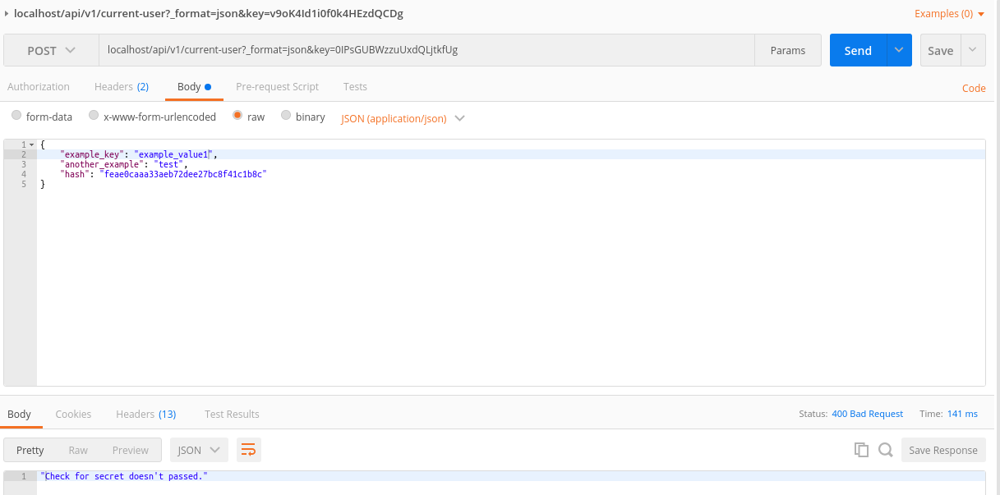

**Что это.** Authentication Provider — это [сервис][d8-services] который
позволяет
описывать собственные способы авторизации на сайте отличные от стандартных.

**Кейсы.** Данные сервисы могут помочь в реализации различных специфичных
способов авторизации, например:

- Авторизация при помощи API ключа.
- Автоматическая авторизация с определенных IP.
- Авторизация под разных пользователей при разных условиях.
- Специфическая авторизация для определенных роутов в системе.
- и т.д.

## Из чего состоит

Данные провайдеры являются сервисами и объявляются как и иные сервисы и,
соответственно, имеют два файла:

1. Объект провайдера которые реализует всю логику.
2. `MYMODULE.services.yml` где объявляется наш сервис с определенными
   требованиями.

Объект, да и сами сервисы, достаточно просты в реализации и очень маленькие.
Объект провайдера наследует `AuthenticationProviderInterface` и состоит, в самой
простой реализации, из трех методов:

1. `__construct()`: Конструктор как и у всех сервисов, туда передается лишь то,
   что мы укажем в .services.yml.
2. `applies(Request $request)`: (обязательно) Данный метод возвращает
   либо `TRUE`, либо `FALSE`. Это определяет, должен ли текущий провайдер
   сработать при текущем запросе или нет.
3. `authenticate(Request $request)`: (обязательно) Метод отвечающий за всю
   остальную логику авторизации если данный провайдер был вызван.

**Объявление сервиса.** Провайдеры объявляются абсолютно идентично как и другие
сервисы. Располагаются они по пути `/src/Authentication/Provider`. Так как этот
сервис используется ядром и это не плагин, мы помечаем его тегами:

1. `name`: (обязательно) Имя тега для сервиса, **должно быть
   ** `authentication_provider`, иначе менеджер данных сервисов не найдет его.
2. `provider_id`: (обязательно) Машинное имя сервиса и провайдера авторизации.
3. `priority`: (0) Вес провайдера. У стандартных `cookie` = 0, и
   модуля `basic_auth` = 100.
4. `global`: (`FALSE`) Если `TRUE` то данный провайдер будет применяться
   глобально по всему сайту. Если же оставить по умолчанию, то применяться он
   будет только на роутах где это явно указано. Должен возвращать либо объект
   типа `AccountInterface`, либо `NULL`.

## Как это работает

В момент обращения к серверу, запускается **Authentication manager**. Он
собирает все найденные сервисы провайдеров и начинает их вызывать в порядке
приоритета от большего к меньшему, до тех пор пока пользователь не будет
определен или же не кончатся провайдеры.

В процессе цикла по всем найденным провайдерам он проверяет, является ли этот
провайдер глобальным, или применим для текущего роута который был запрошен. Если
нет, провайдер пропускается, если хоть одно вернет `TRUE` он начинает вызывать
сервис. Первым делом он вызывает `applies()`, и если тот вернул `FALSE`, то идет
к следующему провайдеру в списке, если вернул `TRUE`, то
вызывает `authenticate()`. Если же метод авторизации вернул объект
типа `AccountInterface` (читай объект юзера) то он авторизовывает под ним и
завершает все свои операции, если возвращен `NULL`, то вызывает следующий
провайдер, если такой есть в списке.

## Провайдер для роута

Каждый объявленный провайдер, если не имеет метки `global` просто так не
заработает. Он будет работать только в том случае, если на вызываемой странице (
роуте) доступен данный способ авторизации. Для того чтобы задать доступные
способы авторизация для роутов используется `_auth` параметр из `options`. По
умолчанию он имеет значение `['basic_auth', 'cookie']`

```yml {"header":"Пример указания провайдера авторизации для роута"}
example.content:
  path: '/example'
  defaults:
    _controller: '\Drupal\example\Controller\ExampleController::content'
    _title: 'Hello World'
  requirements:
    _permission: 'access content'
  options:
    _auth: ['basic_auth', 'cookie', 'my_provider']
```

_Примеры подразумевают, что код пишется в модуле dummy._

## Пример №1 — авторизация через спец. cookie

Этот пример с одной стороны плохой, так как является самым настоящим бэкдором, с
другой же стороны он хороший, в том что он очень легок для понимания что там
происходит, а также показывает на практике как можно заложить в 8-ке дыру для
бэкдора. Таким образом, вы будете знать где проверять потенциальные дыры на
сайте.

Данный провайдер будет делать простейшую вещь. Он будет глобальным, и будет
активироваться только если у пользователя есть кука с именем `backdoor_uid`. Он
будет пытаться найти пользователя с указанным uid на сайте, и если найдет,
авторизовывать под ним.

Первым делом объявим наш сервис в **dummy.services.yml**.

```yml {"header":"dummy.services.yml"}
services:
  authentication.dummy.cookie_backdoor:
    class: Drupal\dummy\Authentication\Provider\CookieBackdoorProvider
    arguments: ['@entity_type.manager']
    tags:
      - { name: authentication_provider, provider_id: cookie_backdoor, priority: 100, global: TRUE }
```

Мы указали аргумент `entity_type.manager` для нашего сервиса. Так как в итоге
нам необходимо загрузить юзера и вернуть его при успешном ответе, этот сервис
будет крайне полезным. Затем мы указали теги где выставили приоритет в 100,
чтобы он был выше стандартного `cookie` и указали на то, что он является
глобальным (будет срабатывать везде). Также мы указали объект который будет
обрабатывать всю логику, его то мы сейчас и создадим:

```php {"header":"/src/Authentication/Provider/CookieBackdoorProvider.php"}
<?php

namespace Drupal\dummy\Authentication\Provider;

use Drupal\Core\Authentication\AuthenticationProviderInterface;
use Drupal\Core\Entity\EntityTypeManagerInterface;
use Symfony\Component\HttpFoundation\Request;

/**
 * Class CookieBackdoorProvider.
 */
class CookieBackdoorProvider implements AuthenticationProviderInterface {

  /**
   * The entity type manager.
   *
   * @var \Drupal\Core\Entity\EntityTypeManagerInterface
   */
  protected $entityTypeManager;

  /**
   * {@inheritdoc}
   */
  public function __construct(EntityTypeManagerInterface $entity_type_manager) {
    $this->entityTypeManager = $entity_type_manager;
  }

  /**
   * Checks whether suitable authentication credentials are on the request.
   */
  public function applies(Request $request) {
    return $request->cookies->has('backdoor_uid');
  }

  /**
   * {@inheritdoc}
   */
  public function authenticate(Request $request) {
    $user = $this->entityTypeManager
      ->getStorage('user')
      ->load($request->cookies->get('backdoor_uid'));

    if ($user) {
      \Drupal::service('session_manager')->regenerate();
      return $user;
    }
    return NULL;
  }

}

```

Пройдемся по каждому методу:

- `__construct()`: В нём мы принимаем наш аргумент с `EntityTypeManager`. Он
  пригодится для загрузки пользователя.
- `applies()`: Тут мы сразу проверяем, есть ли cookie с именем `backdoor_uid` у
  пользователя. Если нету, то провайдер прекратит свою работу вернув `FALSE`.
- `authenticate()`: Самый важный метод где и происходит проверка и ответ,
  авторизовывать ли, и если да, то под кем. Тут всё просто, мы пытаемся
  загрузить пользователя с uid указанным в cookie. Если такой пользователь
  нашелся и загрузился, мы очищаем текущую сессию (если этого не сделать в
  данном примере, то чтобы зайти под другим пользователем, придется сначало
  выйти с текущего, а потом подставлять cookie с новым uid, а так он будет
  авторизовывать даже если поменять на лету и перезагрузить страницу) и отдаем
  объект пользователя. Если никого не нашлось, мы возвращаем `NULL` как знак
  того, что мы не смогли определить пользователя.

Всё готово. Можно включить модуль, установить соответствующую cookie через
инструменты разработчика в браузере и наблюдать за работой.

**Никогда так не делайте** на реальных проектах, даже с благой целью, это жесть.
Дрис будет очень опечален. Но и будьте на чеку, знайте что дыру можно занести
через данные провайдеры очень незаметно.

## Пример №2 — авторизация при помощи API key и secret

Данный пример будет более комплексный и приближен к реальным задачам. Сделан он
на коленке чтобы показать пример соответствующего провайдера, всё что выходит за
пределы провайдера вбито по-быстрому чтобы не перегружать материал лишней
информацией. Например проверки для secret, да и вообще всей логики, я бы вынес в
отдельный сервис, так как грязи при каждом новом примере появится немерено.

**Что мы сделаем.** Мы добавим каждому пользователю программно два новых
поля `dummy_key` и `dummy_secret`. Они будут скрыты от редактирования, но будут
показываться в момент редактирования профиля пользователя. Генерироваться они
будут при первом открытии редактирования профиля пользователя.

Далее мы напишем свой собственный провайдер, он будет авторизовывать по API key
под тем пользователем, которому он принадлежит.

Затем мы напишем [REST Resource Plugin][d8-rest-plugin] с `GET` и `POST`
методами для теста. В случае с `GET` мы будем возвращать объект текущего
пользователя. А текущим пользователем будет тот, кому данный ключ принадлежит.
Если же запрос на ресурс оказался небезопасным `POST`, то мы делаем
дополнительную проверку при помощи secret ключа, шифруя полученные данные при
помощи его в качестве соли, и если hash суммы нашей проверки сойдутся с hash
отправленным пользователем, значит что данные не были скомпрометированы в
процессе передачи и мы также возвращаем информацию о текущем пользователе.

Для данного примера нам потребуется включить модуль `rest` из ядра, а также
установить и включить REST UI `composer require drupal/restui`.

Пойдем в том порядке как я и описал весь процесс. Первым делом добавим два поля,
генерацию ключей и их вывод. Всё это я написал в **dummy.module**.

```php {"header":"dummy.module"}
<?php

/**
 * @file
 * Main file for hooks and custom functions.
 */

use Drupal\Component\Utility\Crypt;
use Drupal\Core\Entity\EntityTypeInterface;
use Drupal\Core\Field\BaseFieldDefinition;
use Drupal\user\Entity\User;

/**
 * Implements hook_entity_base_field_info().
 *
 * This hook requires to run `drush entity:updates` (entity-updates for older
 * versions).
 */
function dummy_entity_base_field_info(EntityTypeInterface $entity_type) {
  if ($entity_type->id() == 'user') {
    $fields = [];
    $fields['dummy_key'] = BaseFieldDefinition::create('string')
      ->setLabel(t('API Key'))
      ->setRevisionable(FALSE)
      ->setTranslatable(FALSE);
    $fields['dummy_secret'] = BaseFieldDefinition::create('string')
      ->setLabel(t('API Secret'))
      ->setRevisionable(FALSE)
      ->setTranslatable(FALSE);
    return $fields;
  }
}

/**
 * Implements hook_form_FORM_ID_alter().
 */
function dummy_form_user_form_alter(&$form, \Drupal\Core\Form\FormStateInterface $form_state, $form_id) {
  $user = \Drupal::routeMatch()->getParameter('user');
  if ($user) {
    $key_secret = _dummy_get_key_and_secret($user->id());

    $form['dummy_api'] = [
      '#type' => 'fieldset',
      '#title' => 'API',
    ];
    $form['dummy_api']['key'] = [
      '#type' => 'item',
      '#title' => 'Key',
      '#markup' => $key_secret['key'],
    ];
    $form['dummy_api']['secret'] = [
      '#type' => 'item',
      '#title' => 'Secret',
      '#markup' => $key_secret['secret'],
    ];
  }
}

/**
 * Returns key and secret for API. If the are not exists, generate new one.
 */
function _dummy_get_key_and_secret($uid) {
  $user = User::load($uid);

  if ($user->dummy_key->isEmpty()) {
    $user->dummy_key->value = Crypt::randomBytesBase64(16);
    $user->save();
  }

  if ($user->dummy_secret->isEmpty()) {
    $user->dummy_secret->value = Crypt::randomBytesBase64(16);
    $user->save();
  }

  return [
    'key' => $user->dummy_key->value,
    'secret' => $user->dummy_secret->value,
  ];
}

```

Идём сверху вниз:

- `dummy_entity_base_field_info()`: В данном хуке мы добавляем два новых поля
  для сущности `user` типа "строка". Мы не указываем настройки отображения и
  ввода для данных полей, так как их ввод и вывод в профиле нам не нужен вообще.
- `dummy_form_user_form_alter()`: Модифицируем форму редактирования
  пользователя. Добавляем туда раздел и выводим наши ключ и секрет.
- `_dummy_get_key_and_secret()`: Генерирует случайные ключ и секрет если их нет
  у пользователя и возвращает в виде массива.

После того как вы сделаете такой же код, нужно
запустить `drush entity:updates` (для старых `drush entity-updates`) чтобы
данные поля появились в сущности пользователя. Аналогичную команду надо
выполнить когда модуль с этими полями вы удалите.

Затем можно зайти в редактирование любого пользователя и вы должны увидеть его
API ключ и секрет



Далее нам нужно уже готовить провайдер под задачу. Начнем с того что объявим наш
будущий сервис как и из примера №1.

```yml {"header":"dummy.services.yml"}
  authentication.dummy.key_secret:
    class: Drupal\dummy\Authentication\Provider\KeySecretProvider
    arguments: ['@entity_type.manager']
    tags:
      - { name: authentication_provider, provider_id: key_secret, priority: 100 }

```

**Обратите внимание** что данный сервис не имеет в начале `services` так как мы
его добавляем к тому что в примере №1. Если это ваш первый сервис в модуле, то
не забудьте объявить что это сервис массив :)

Остальное тут очень похоже, только на этот раз мы не хотим чтобы данный
провайдер был глобальным. Мы его будем включать только для REST запросов.

Описываем наш провайдер.

```php {"header":"/src/Authentication/Provider/KeyScretProvider.php"}
<?php

namespace Drupal\dummy\Authentication\Provider;

use Drupal\Core\Authentication\AuthenticationProviderInterface;
use Drupal\Core\Entity\EntityTypeManagerInterface;
use Symfony\Component\HttpFoundation\Request;

/**
 * Class KeySecretProvider.
 */
class KeySecretProvider implements AuthenticationProviderInterface {

  /**
   * The entity type manager.
   *
   * @var \Drupal\Core\Entity\EntityTypeManagerInterface
   */
  protected $entityTypeManager;

  /**
   * {@inheritdoc}
   */
  public function __construct(EntityTypeManagerInterface $entity_type_manager) {
    $this->entityTypeManager = $entity_type_manager;
  }

  /**
   * {@inheritdoc}
   */
  public function applies(Request $request) {
    return $request->query->has('key');
  }

  /**
   * {@inheritdoc}
   */
  public function authenticate(Request $request) {
    $key = $request->query->get('key');
    $user = $this->entityTypeManager
      ->getStorage('user')
      ->loadByProperties([
        'dummy_key' => $key,
      ]);

    if (!empty($user)) {
      return reset($user);
    }
    else {
      throw new AccessDeniedHttpException();
    }
  }

}

```

- `__construct()`: Всё как и в первом примере. Принимаем наш аргумент для
  сервиса чтобы было проще грузить пользователя.
- `applies()`: Проверяет, передан ли с запросом в качестве `GET` параметра
  значение `key`.
- `authenticate()`: Пытаемся загрузить пользователя с таким API ключем по
  значению поля `dummy_key`, которое мы объявили в **dummy.modules**. Если такой
  пользователь найден, авторизовываем под ним. Но в этот раз мы не отдаем `NULL`
  в случае если пользователь не нашелся, мы сразу выдаем ошибку что доступ
  запрещен. Таким образом мы прерываем вызов остальных провайдеров, тем самым
  говоря — либо по ключу, либо никак иначе. Но если `applies()` вернул `FALSE`,
  то все остальные провайдеры будут вызываться в штатном режиме.

**Почему мы тут не используем API secret.** Важно понимать что мы пишем *
*Authentication** Provider, а он должен отвечать только за процесс авторизации,
в случае с друпалом, он отвечает за выбор пользователя под которым требуется
авторизовать человека. API secret служит для проверки поступивших данных на их
достоверность, что их не подменили по пути до нашего сервера, и это не является
задачей для данного провайдера.

Выходит что наш провайдер написан. Поэтому сразу двигаемся писать REST Resource
для проверки нашего провайдера.

```php {"header":"/src/Plugin/rest/resource/TestKeySecretResource.php"}
<?php

namespace Drupal\dummy\Plugin\rest\resource;

use Drupal\Core\Session\AccountProxyInterface;
use Drupal\rest\ModifiedResourceResponse;
use Drupal\rest\Plugin\ResourceBase;
use Drupal\rest\ResourceResponse;
use Psr\Log\LoggerInterface;
use Symfony\Component\DependencyInjection\ContainerInterface;
use Symfony\Component\HttpKernel\Exception\AccessDeniedHttpException;

/**
 * Provides a resource to get view modes by entity and bundle.
 *
 * @RestResource(
 *   id = "test_key_secret_resource",
 *   label = @Translation("Test key secret resource"),
 *   uri_paths = {
 *     "canonical" = "/api/v1/current-user",
 *     "create" = "/api/v1/current-user"
 *   }
 * )
 */
class TestKeySecretResource extends ResourceBase {

  /**
   * A current user instance.
   *
   * @var \Drupal\Core\Session\AccountProxyInterface
   */
  protected $currentUser;

  /**
   * Safe request methods.
   */
  protected $safeMethods = [
    'HEAD',
    'GET',
    'OPTIONS',
    'TRACE',
  ];

  /**
   * Constructs a new TestKeySecretResource object.
   *
   * @param array $configuration
   *   A configuration array containing information about the plugin instance.
   * @param string $plugin_id
   *   The plugin_id for the plugin instance.
   * @param mixed $plugin_definition
   *   The plugin implementation definition.
   * @param array $serializer_formats
   *   The available serialization formats.
   * @param \Psr\Log\LoggerInterface $logger
   *   A logger instance.
   * @param \Drupal\Core\Session\AccountProxyInterface $current_user
   *   A current user instance.
   */
  public function __construct(
    array $configuration,
    $plugin_id,
    $plugin_definition,
    array $serializer_formats,
    LoggerInterface $logger,
    AccountProxyInterface $current_user) {
    parent::__construct($configuration, $plugin_id, $plugin_definition, $serializer_formats, $logger);

    $this->currentUser = $current_user;
  }

  /**
   * {@inheritdoc}
   */
  public static function create(ContainerInterface $container, array $configuration, $plugin_id, $plugin_definition) {
    return new static(
      $configuration,
      $plugin_id,
      $plugin_definition,
      $container->getParameter('serializer.formats'),
      $container->get('logger.factory')->get('dummy'),
      $container->get('current_user')
    );
  }

  /**
   * {@inheritdoc}
   */
  public function get() {
    return new ResourceResponse($this->currentUser->getAccount(), 200);
  }

  /**
   * {@inheritdoc}
   */
  public function post(array $data = []) {
    if ($this->checkAccess($data)) {
      return new ResourceResponse($this->currentUser->getAccount(), 200);
    }
    else {
      return new ResourceResponse("Check for secret doesn't passed.", 400);
    }
  }

  /**
   * Check for key and secret. If secret is used, we check if it valid.
   */
  protected function checkAccess($data) {
    $request = \Drupal::request();
    if (in_array($request->getMethod(), $this->safeMethods)) {
      // Safe method, so if user with valid key is found, we grant access.
      return TRUE;
    }
    else {
      // Unsafe methods is unsafe :) We will check data send to server with
      // simple encryption using secret key.
      // Save hash send by user with request and remove it from data array.
      $user_hash = $data['hash'];
      unset($data['hash']);
      // Added user secret to array with data.
      $data[] = $this->currentUser->getAccount()->dummy_secret->value;
      // Create string from data.
      $string = implode(':', $data);
      // Hash it.
      $our_hash = md5($string);

      if ($user_hash == $our_hash) {
        // The data is valid for user, grant access.
        return TRUE;
      }
      else {
        // Seems like data was compromised.
        return FALSE;
      }
    }
  }

}

```

Я не буду заострять внимание на самом ресурсе, всё должно быть предельно ясно, а
более детальные объяснения лучше почитать
в [соответствующем материале][d8-rest-plugin].

Остановимся мы лишь на методе `checkAccess()`, который вызывается для проверки
доступа. Именно здесь мы используем API secret, и если вы захотите сделать такое
же где-то на проекте, то данную логику нужно выносить за пределы ресурса, иначе
вам придется копипастить её в каждый плагин, а это куча повторяющегося кода.

Напоминаю, что API key у нас проверяется в провайдере авторизации и служит
определением пользователя, от кого данный запрос поступил, поэтому данный метод
вызывается только в `post()` методе. Мы передаем в него массив данных из тела
запроса.

В нем мы проверяем, является ли данный запрос к серверу небезопасным. На всякий
случай, вдруг метод вызвали по ошибке, если это безопасный способ мы просто
вернем `TRUE` и забудем. Если запрос попал в категорию небезопасных, мы начинаем
работать с его данными. Нужно понимать, что когда человек посылает запрос на
данный ресурс в качестве `POST` запроса, он вместе со своими данными должен
прислать hash этих самых данных. А получать мы его будем при помощи добавления к
этим самым данным API secret в конец массива, слияния массива в строку при
помощи `:`, а затем прогон через `md5()`. Так сторонние ресурсы должны готовить
hash для нашего ресурса, и так же мы его проверяем. Так как API Secret известен
только нам и пользователю, а он больше нигде не передается, то подделать hash
невозможно. Учтите что данная реализация крайне ненадежная, особенно если там
будут вложенные массивы, это всего лишь пример.

Так как мы получили данные от пользователя, мы записываем его `hash` в
переменную и удаляем его из данных. Затем берем API secret из профиля и
вставляем последним значением в данные. Прогоняем все по той же логике
хэширования. Затем сверяем то что получили мы, и то что прислал пользователь с
данными. Если совпали — значит данные корректные, собственно как и API secret, а
если не совпали, то либо данные подписаны некорректно, либо API secret был
использован некорректный, либо какие-то данные были подменены в момент передачи.

Если после этих кругов ада проверка вернула `TRUE`, мы возвращаем текущего
пользователя, который был получен из API key, или же выводим ошибку.

Затем этот ресурс необходимо включить. При помощи REST UI мы включаем данный
ресурс и указываем что поддерживаемый способ авторизации для данного ресурса
будет `key_secret` — id нашего провайдера из **dummy.services.yml**.





Осталось только проверить!







[d8-services]: ../../../../2017/06/21/d8-services/index.ru.md
[d8-rest-plugin]: ../../../../2018/01/16/d8-rest-plugin/index.ru.md
