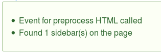
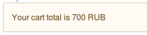

:: youtube {vid=LXToJDZmGdE}

Drupal 8 большая система, и в процессе выполнения запроса, происходит множество
различных действий. Благодаря событиям из Symfony, мы можем "подписываться" на
события и при их возникновении, выполнять что-то. Также мы можем создавать свои
собственные, чтобы другие могли подписаться и иметь возможность выполняться на
определенном этапе обработки запроса.

События очень просты как для понимания, так и для написания. Если приводить
какую-то аналогию, то первое, что приходит в голову — модуль Rules. Это почти
то же самое в программном виде, но всё же несколько отличающееся. Возможно, я
именно поэтому ни разу не встретил потребности в данном модуле в 8-ке, так как
ядро + symfony покрывают все его задачи. Если абстрагироваться от Drupal
Commerce, то в 7-ке там очень много логики завязано на Rules, а в 8-ке
зависимости от Rules нет, так как большинство задач, что решалось рулсом, теперь
решается событиями, и даже больше.

## Что такое событие и как оно работает

Весь Event API можно разделить на три маленьких части:

- **Event:** Непосредственно событие. Каждое событие — это объект. У него есть
  свои собственные уникальные методы, которые добавляет тот, кто данное событие
  объявил и вызывает. Как правило, туда передаются необходимые данные для
  данного события, чтобы на их основе можно было принять решение.
- **Event Dispatcher:** Это сервис, который позволяет получать всю необходимую
  информацию о событии и производить его "активацию", чтобы весь код, который
  подписан, был активирован.
- **EventSubscriber:** Подписчики на события это объекты, которые и выполняют
  код при определенных событиях. В них описывается на какие события подписан
  конкретный объект, их позиция в процессе выполнения, и, как правило, сам код
  для события.

<mark>Не стоит путать события с `\Drupal::moduleHandler()->alter()`</mark>.
Альтер подразумевает изменение информации, когда передает данные, что явно
указано в его названии. Событие же, "оповещает", что что-то произошло, о чём вам
необходимо знать, и передает вам дополнительную информацию о событии, чтобы вы
могли что-то сделать, на основе полученной информации. Там также можно изменять
часть данных, но это можно сделать когда в событие передается объект, со своими
внутренними свойствами, где хранятся данные, и куда можно при помощи его же
методов добавить новые. В общем случае, событие лишь оповещает модули, дает им
информацию, и **не ожидает** ответа. Но если уж прямо приспичит, то реализовать
реально.

### Создание собственного события

_Далее по тексту в коде подразумевается что название модуля dummy._

Для создания собственного события вам потребуется модуль, и совсем немножко
кода. События создаются в `/src/Event`. Подходов к их созданию можно наблюдать
несколько. Я покажу самый стандартный, а другой, можно подсмотреть у drupal
commerce (названия ивентов в отдельном объекте).

Первым делом, вам нужно определиться, для чего будут ваши события. Я, для
примера, объявлю два события:

- `dummy.frontpage.preprocess_html`: Событие будет вызываться в процессе
  выполнения `hook_preprocess_html()` в модуле где и объявлено событие.
- `dummy.frontpage.preprocess_page`: Аналогично первому событию, только
  вызываться будет в `hook_preprocess_page()`.

Если вы знакомы с `hook_preprocess_HOOK()`, то знаете, что туда передается
массив `$variables`. Мы будем данный массив отдавать событию и хранить там, для
нужд тех, кто подпишется на одно, или сразу оба события. Надо понимать,
что `$variables` будет передано в событие не как ссылка, и следовательно,
изменять данные там через событие не выйдет, это будет просто информационный
массив.

Создаем файл для своего события, и пишем в нем код события.

```php {"header":"src/Event/DummyPreprocessEvent.php"}
<?php

namespace Drupal\dummy\Event;

use Symfony\Component\EventDispatcher\Event;

/**
 * Event firing on page and html preprocesses.
 */
class DummyPreprocessEvent extends Event {

  /**
   * Called during hook_preprocess_html().
   */
  const PREPROCESS_HTML = 'dummy.frontpage.preprocess_html';

  /**
   * Called during hook_preprocess_page().
   */
  const PREPROCESS_PAGE = 'dummy.frontpage.preprocess_page';

  /**
   * Variables from preprocess.
   */
  protected $variables;

  /**
   * DummyFrontpageEvent constructor.
   */
  public function __construct($variables) {
    $this->variables = $variables;
  }

  /**
   * Returns variables array from preprocess.
   */
  public function getVariables() {
    return $this->variables;
  }

}
```

Вот мы объявили целых 2 события! Проще просто некуда, но давайте пройдемся по
коду:

1. Мы объявили объект события, который расширяет `Event` от симфони. Он не
   требует вообще ничего. Вам достаточно в объекте объявить хотя бы название,
   которое тоже не обязательно объявлять там, но это правильно, если вы не
   используете подход как у drupal commerce.
2. Мы "объявили" два события. События — просто названия, их названия принято
   хранить в константах для простоты и удобства. Поэтому мы создали две
   константы для двух событий, о которых выше в задаче я и упомянул.
3. Мы добавили свойство `$variables`, чтобы там хранить переданный массив из
   preprocess.
4. Мы объявили `__construct()`, в который мы передаем тот самый массив из
   препроцесса. Если в ваше событие не нужно передавать никаких данных, то и
   данный метод не нужен.
5. И в конце добавили геттер для `$variables`, чтобы "подписчики" на событие
   могли получить переменную через метод.

Больше объяснять тут даже нечего, всё настолько просто, что мы идем дальше. А
дальше у нас по плану **Event Dispatcher**. Это как раз то, что буде вызывать
наши события когда они должны вызываться по нашему мнению. Так как оба наших
события вызываются в момент `hook_preprocess_HOOK()` из модуля, там мы его и
будем вызывать.

Переходим в **dummy.module**, регистрируем наши хуки и диспатчер.

```php {"header":"dummy.module"}
<?php

/**
 * @file
 * Custom hooks and functions for module.
 */

use Drupal\dummy\Event\DummyPreprocessEvent;

/**
 * Implements hook_preprocess_HOOK().
 */
function dummy_preprocess_html(&$variables) {
  /** @var \Drupal\Component\EventDispatcher\ContainerAwareEventDispatcher $dispatcher */
  $dispatcher = \Drupal::service('event_dispatcher');
  // Create event object passing arguments.
  $event = new DummyPreprocessEvent($variables);
  // Call it.
  $dispatcher->dispatch(DummyPreprocessEvent::PREPROCESS_HTML, $event);
}

/**
 * Implements hook_preprocess_HOOK().
 */
function dummy_preprocess_page(&$variables) {
  /** @var \Drupal\Component\EventDispatcher\ContainerAwareEventDispatcher $dispatcher */
  $dispatcher = \Drupal::service('event_dispatcher');
  // Create event object passing arguments.
  $event = new DummyPreprocessEvent($variables);
  // Call it.
  $dispatcher->dispatch(DummyPreprocessEvent::PREPROCESS_PAGE, $event);
}
```

Как вы можете заметить, код вызванный в обоих случая абсолютно идентичный, кроме
того, что название события передается соответствующее хуку.

Пройдемся по коду из `dummy_preprocess_html`:

1. Мы получаем сервис `event_dispatcher`.
2. Создаем событие как новый инстант объекта. Так как мы принимает
   переменную `$variables` в конструкторе события, то мы его передаем сразу при
   инициализации объекта.
3. При помощи сервиса диспатчера, мы "триггерим" событие методом `dispatch()`,
   передавая туда название события (через вызов константы из объекта события), а
   также, непосредственно объект события.

Всё, все кто подписался на данное событие, будут оповещены и вызваны в нужной им
последовательности. Им будет передан объект `$event`, и они смогут
получить `$variables` и что-то сделать на основе этих данных.

## Подписка на события

Подписка на события происходит при помощи `EventSubscriber`, которые находятся
по пути `src/EventSubscriber` и также являются объектами.

Для скорости генерации вы можете использовать `drush event-subscriber`
или `drupal ges`.

Подписчик на событие наследуется от `EventSubscriberInterface` и имеет
метод `getSubscribedEvents()`, который должен отдавать массив с интересующими
его событиями в формате.

Массив отдаваемый `getSubscribedEvents()` может иметь несколько вариантов.
Ключом у каждого элемента всегда является название события на которое он
подписывает, а значение либо строка, либо массив:

1. `'event_name' => 'methodName'`: Подписка на событие `event_name`, которое
   вызовет метод с именем `methodName()`.
2. `'event_name' => ['methodName', $priority]`: Все тоже что и выше, но с
   приоритетом `$priority`. По умолчанию приоритет у всех подписчиков 0, если не
   указан иной. Выполняются они в порядке убывания и могут иметь отрицательные
   значения. Допустим, если есть три подписчика с приоритетами: 100, 0 и -100,
   то они в таком порядке и выполнятся. Это означает, что подписчик с
   приоритетом -100, перезапишет все что сделали подписчики с приоритетами 100
   и 0.
3. `'event_name' => [['methodName', $priority], ['methodNameSecond']]`: Тоже что
   и выше, только в данном случае вызовется два метода на одно событие. Если
   первому методу передать в качестве веса 10, то сначала
   вызовется `methodNameSecond`, а затем `methodName`. Это может быть удобно,
   когда вы не единственный подписчик на событие. Можно подписаться задолго до
   всех других подписчиков, например, установив приоритет 500, записать данные,
   а затем второй метод подписать с приоритетом -500, и сравнить данные. В общем
   это уже достаточно специфичная особенность.

После того как вы подписались на событие, при их возникновении, в указанные вами
методы будет передан всего один аргумент `$event`, типа того события, на которое
вы подписались. А дальше, уже вы уже делаете что реально и что нужно.

В качестве примера, создадим два подписчика на оба наших события объявленных
ранее. Для этого создаем подписчик:

```php {"header":"src/EventSubscriber/DummySubscriber.php"}
<?php

namespace Drupal\dummy\EventSubscriber;

use Drupal\dummy\Event\DummyPreprocessEvent;
use Symfony\Component\EventDispatcher\EventSubscriberInterface;

/**
 * Dummy event subscriber.
 */
class DummySubscriber implements EventSubscriberInterface {

  /**
   * {@inheritdoc}
   */
  public static function getSubscribedEvents() {
    return [
      DummyPreprocessEvent::PREPROCESS_HTML => ['preprocessHtml', 100],
      DummyPreprocessEvent::PREPROCESS_PAGE => ['preprocessPage'],
    ];
  }

  /**
   * Example for DummyFrontpageEvent::PREPROCESS_HTML.
   */
  public function preprocessHtml(DummyPreprocessEvent $event) {
    /** @var \Drupal\Core\Messenger\MessengerInterface $messenger */
    $messenger = \Drupal::service('messenger');
    $messenger->addMessage('Event for preprocess HTML called');
  }

  /**
   * Example for DummyFrontpageEvent::PREPROCESS_HTML.
   */
  public function preprocessPage(DummyPreprocessEvent $event) {
    /** @var \Drupal\Core\Messenger\MessengerInterface $messenger */
    $messenger = \Drupal::service('messenger');
    $variables = $event->getVariables();
    $sidebars_found = 0;
    foreach ($variables['page'] as $key => $value) {
      if (preg_match("/sidebar_(.+)/", $key)) {
        $sidebars_found++;
      }
    }
    $messenger->addMessage("Found {$sidebars_found} sidebar(s) on the page");
    // Stop further execution.
    $event->stopPropagation();
  }

}
```

1. Мы объявили `getSubscribedEvents()`, в результате массива отдаем что мы хотим
   подписаться на два события и какие методы чтобы были вызваны.
2. Добавили первый метод `preprocessHtml()` который будет вызван
   из `dummy_preprocess_html()`. При его вызове мы выведем системное сообщение
   что событие было вызвано из HTML. Ничего более.
3. Аналогично мы сделалb и для `preprocessPage()`, который вызывается
   из `dummy_preprocess_page()`. В нем мы считаем, сколько регионов на странице
   является сайдбарами, а затем, выводим это в системном сообщении и используя
   стандартный для всех `Event` объектов метод `stopPropagation()`, мы прерываем
   дальнейший вызов данного события. Это значит, что те подписчики, что имели
   больший вес чем наш, просто не будут выполнены. Используйте это только когда
   действительно нужно. По-хорошему, такое не должно требоваться.

Осталось совсем чуть-чуть. Все подписчики на события должны быть объявлены в
виде [сервиса][drupal-8-services] с тегом `event_subscriber`. Давайте добавим наш
подписчик в сервисы:

```yaml {"header":"dummy.services.yml"}
services:
  dummy.dummy_subscriber:
    class: Drupal\dummy\EventSubscriber\DummySubscriber
    tags:
      - { name: event_subscriber }
```

Вот и всё! Мы объявили свои события, сделали его вызов, а также подписались на
них. Сбросив кэш и зайдя на страницу, вы должны увидеть результаты его работы.



## Пример на Drupal Commerce

Я не спроста неоднократно упоминал Drupal Commerce и то, что они перенесли часть
задач из Rules на события. Мы также добавим два подписчика на его события. Так
сказать, real world example.

У DrupalCommerce вагон и целая тележка событий. Их легко найти в каждом его
модуле в папке `src/Event/{Something}Events.php`. У них все названия событий
хранятся в отдельном файлике состоящим исключительно из констант, чтобы было
понятно от какого модуля события вызывается, так как с их кол-вом событий, была
бы путаница.

Мы возьмем по событию из модулей `commerce_product` и `commerce_cart`:

1. `ProductEvents::PRODUCT_VARIATION_AJAX_CHANGE`: Данное событие вызывается
   когда у товара есть несколько вариантов, а в форме добавления в корзину,
   пользователь выбирает другой вариант. Комерц вызывает AJAX чтобы получить
   новые данные и поля для замены на странице в соответствии с выбранным
   вариантом, и заодно данное событие, чтобы вы могли также поучаствовать в
   этом. Например, у меня на странице товара есть вывод SKU (артикул) с
   измененной разметкой, и стандартный AJAX это не увидет и не заменит, а надо,
   так как товар то уже другой. Для этого я могу подписаться, получить новый SKU
   и добавить новую команду к ответу.
2. `CartEvents::CART_ENTITY_ADD`: Событие вызывается когда пользователь добавил
   что-то в корзину. Здесь ничего выдумывать не будем и просто будем писать на
   какую сумму товаров в корзине.

Поехали! Для удобства, мы создадим отдельный объект-подписчик на эти события,
чтобы они отличались и не были все в одной куче, и назовем мы
его `CommerceSubscriber`.

```php {"header":"src/EventSubscriber/CommerceSubscriber.php"}
<?php

namespace Drupal\dummy\EventSubscriber;

use Drupal\commerce_cart\Event\CartEntityAddEvent;
use Drupal\commerce_cart\Event\CartEvents;
use Drupal\commerce_product\Event\ProductEvents;
use Drupal\commerce_product\Event\ProductVariationAjaxChangeEvent;
use Drupal\Core\Ajax\HtmlCommand;
use Symfony\Component\EventDispatcher\EventSubscriberInterface;

/**
 * Class CommerceAjaxSubscriber.
 */
class CommerceSubscriber implements EventSubscriberInterface {

  /**
   * {@inheritdoc}
   */
  static function getSubscribedEvents() {
    return [
      ProductEvents::PRODUCT_VARIATION_AJAX_CHANGE => ['onResponse', 50],
      CartEvents::CART_ENTITY_ADD => ['addToCart', 50],
    ];
  }

  /**
   * Respond to AJAX variation update.
   */
  public function onResponse(ProductVariationAjaxChangeEvent $event) {
    $product_variation = $event->getProductVariation();
    $sku = $product_variation->getSku();
    $response = $event->getResponse();
    $response->addCommand(new HtmlCommand('.sku-value', $sku));
  }

  /**
   * React when products added to cart.
   */
  public function addToCart(CartEntityAddEvent $event) {
    $cart = $event->getCart();
    /** @var \Drupal\Core\Messenger\MessengerInterface $messenger */
    $messenger = \Drupal::service('messenger');
    $messenger->addWarning('Your cart total is ' . $cart->getTotalPrice());
  }

}
```

```yaml {"header":"dummy.services.yml"}
services:
  # Подписчик от предыдущего примера
  dummy.dummy_subscriber:
    class: Drupal\dummy\EventSubscriber\DummySubscriber
    tags:
      - { name: event_subscriber }
  # Новый подписчик
  dummy.commerce_subscriber:
    class: Drupal\dummy\EventSubscriber\CommerceSubscriber
    tags:
      - { name: event_subscriber }
```

1. Объяснять подписку на события, думаю уже бессмысленно и мы её проскочим.
2. Наш первый метод `onResponse()`, как я уже писал, сработает когда
   пользователь выберет новый вариант товара и комерц запросит данные для
   данного варианта. Мы получаем какой-именно вариант выбрал пользователь, затем
   его SKU, а затем добавляем AJAX команду в общий список команд комерца на
   ответ. После чего все элементы классом `sku-value` получат в качестве
   содержимого новый SKU.
3. Второй же метод `addToCart()`, ещё проще. Мы просто получаем корзину,
   запрашиваем у неё сумму всех товаров и выводим в виде сообщения.
4. И добавляем информацию о нашем подписчике в services.yml

Если первый пример лучше проверять вживую, то второй проверить очень просто:



Если вам не ясно откуда я взял все эти `getProductVariation()` и `getCart()` —
то это из объектов тех самых ивентов, на что мы подписываемся. Их тип я явно
указываю для аргументов метода, поэтому в любом IDE достаточно сделать CTRL +
click по их названию и вы увидите все их доступные методы. Это какраз, аналоги
нашего `getVariables()` из раздела про объявление событий.

Также не забывайте что события объявляет ядро и сам Symfony. Например, у симфони
есть `KernelEvents` где можно подписать свой код на этапе где только запрос ещё
получен.

[drupal-8-services]: ../../../../2017/06/21/drupal-8-services/index.ru.md
