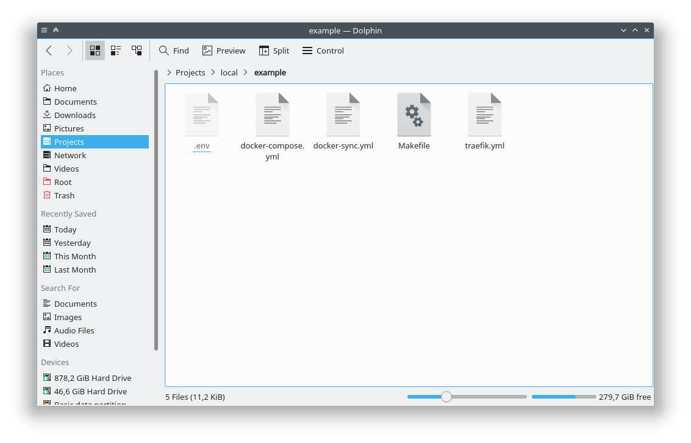
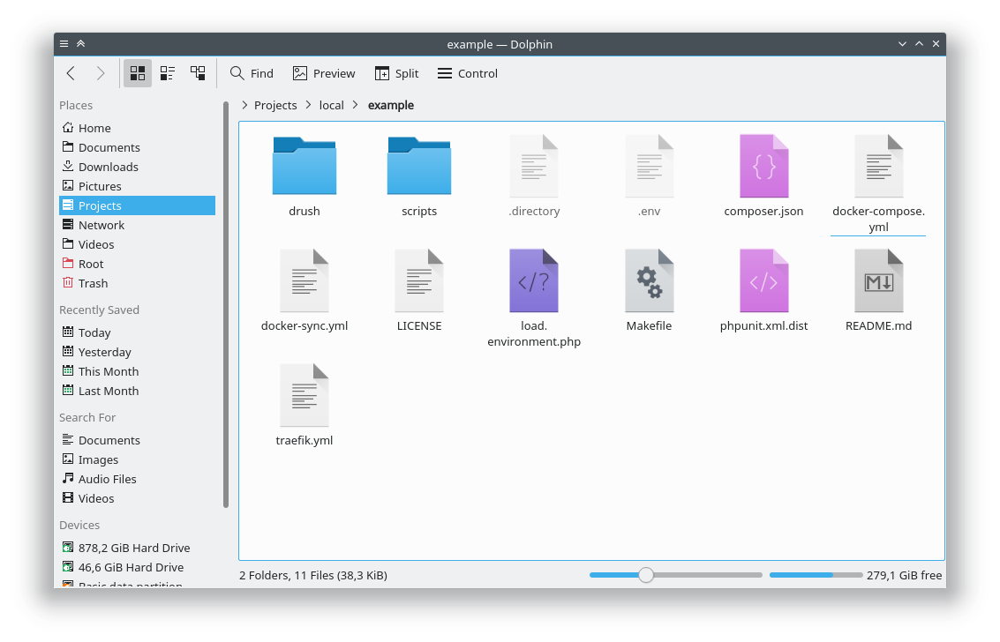
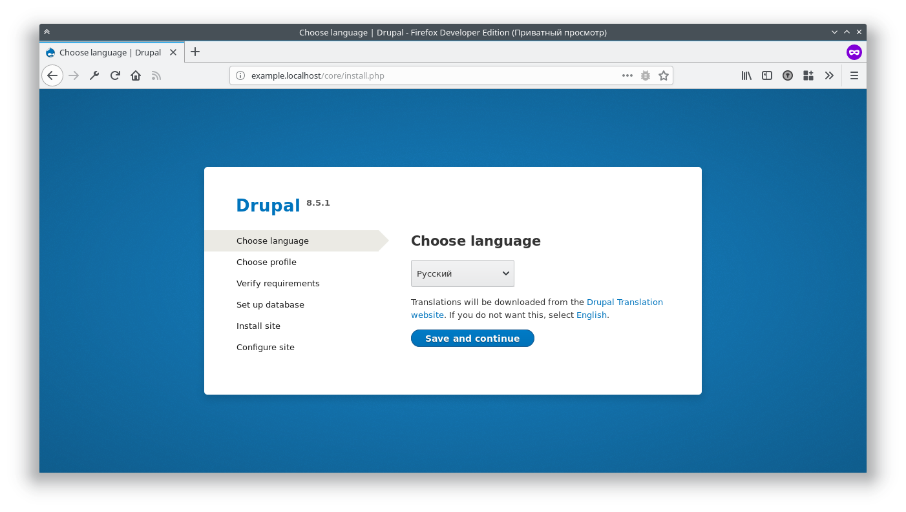
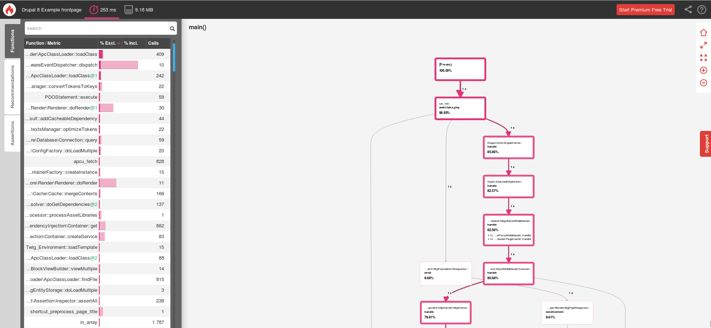
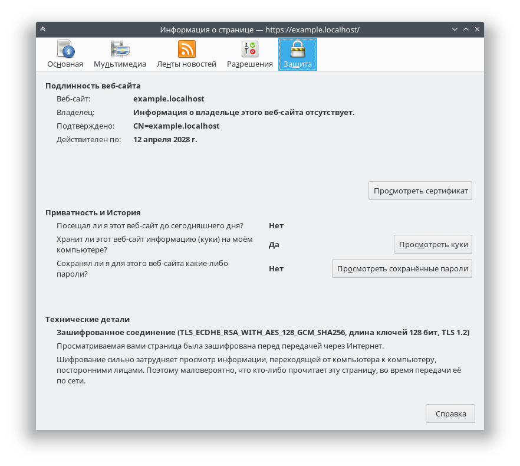

:: youtube {vid=VEIOmxAnoTg}

В последние пол года, а может и больше, я перешел на Docker4Drupal с ранее
описанного [Drupal VM][drupal-vm-ubuntu]. Всё это время я набивал шишки,
эксперементировал, и вот делюсь тем как всё "варить".

Сразу отвечу почему я перешел на вариант с Docker против Vagrant. Ответ один и
очень простой — **производительность**. Докер работает под линуксом очень
шустро (читай нативно), шустрее чем на Mac и Windows, точка. На виндоусах он
разворачивает полноценную виртуальную машину для своей работы, что по сути,
аналог Vagrant и какая между ними разница, не знаю, на Mac, как мне обьяснили,
ситуация получше, но все же он доустанавливает какие-то либы и, вроде, часть
ядра линукса, для работы и все же, работает медленнее чем под линуксом. На
линуксе же, он не ставит вообще ничего, кроме того что требуется контейнеру для
его работы. Он просто берет использует напрямую с хоста. В итоге, когда
запущенный контейнер проекта от докера простаивает, он не ест практически
никаких ресурсов вообще. Более того, докер может динамически забирать себе
ресурсы для своей работы прямо с хоста, тогда как вагрант, требует задавать
ограничения изначально, и резервирует ресурсы под виртуалку даже если она
простаивает. Ну и сам докер, запускается, разворачивается, сворачивается
нереально шустро. Когда Drupal VM у меня может стартовать под минуту с уже
полноценным проектом, docker стартует с аналогичным проектом за секунд 5-10.

Также у вас может сложиться вопрос, а почему именно Docker4Drupal, ведь есть ещё
куча аналогичных проектов заточенных под Drupal, но я пробовал лишь два:

- Dockerized Drupal: Проект походу мертв, даже сайт не открывается. Но
  использовал я его давненько, и все было круто, но лагал он по сравнению с
  Drupal VM просто нереально. Как оказалось, внутри запускается 11 контейнеров
  под проект, и в каждом контейнере запускается Vagrant =_=. Думаю дальше
  продолжать не стоит и разьяснять, почему Drupal VM с одним вагрантом работал
  быстрее чем 11 завернутых в докер контейнеры :)
- [Docker4Drupal](https://github.com/wodby/docker4drupal): Этот вариант
  использую на данный момент, так как с ним, у меня практически нет проблем (
  парочка всплыла когда у них появилась 5.x ветка и происходит какая-то
  путанница с правами на проектах, но я, вроде, их поборол уже, у вас же их не
  должно быть вообще, так как мы начнем сразу с 5.х). Работает шустро, гнется
  простой правкой конфигов. Легко развернуть и зачистить всё за ним. Всё
  предельно просто и понятно, работает очень быстро, никаких вирутуалок внутри
  не заметил.

И ведь никто не мешает вам собрать собственную сборочку сервера в докере под
друпал и поделиться! Например, такой проектик есть у
Chi — [Drupal Lemp](https://github.com/Chi-teck/drupal-lemp) и у
politsin — [drupal-docker](https://github.com/politsin/drupal-docker).

## Установка Docker на Ubuntu

При установке, обратите внимание чтобы версия была Community Edition (CE).

Обновляем информацию о пакетах.

```sh
$ sudo apt update
```

Устанавливаем доп пакеты, которые необходимы для установки докера и поддержки
загрузки через https.

```sh
$ sudo apt install apt-transport-https ca-certificates curl software-properties-common
```

Добавляем ключ репозитория Docker

```sh
$ curl -fsSL https://download.docker.com/linux/ubuntu/gpg | sudo apt-key add -
```

Устанавливаем репозиторий Docker

```sh
$ sudo add-apt-repository "deb [arch=amd64] https://download.docker.com/linux/ubuntu $(lsb_release -cs) stable"
```

Обновляем индекс и устанавливаем Docker CE

```sh
$ sudo apt update && sudo apt install docker-ce
```

Проверяем установку Docker

```sh
$ sudo docker run hello-world
```

Если все сделали корректно, то он должен скачать образ и вывести приветственное
сообщение Hello from Docker! и немного информации. Если появились ошибки или
что-то пошло не так, пройдитесь по пунктам заново.

Теперь мы сделаем так, чтобы докер не требовал sudo каждый раз для запуска. Это
опционально, и если вас устраивает, то шаги ниже можно пропускать.

Для начала создаем группу `docker`

```sh
$ sudo groupadd docker
```

Вероятнее всего, он напишет что такая группа уже существует, ничего страшного в
этом нет, просто идем дальше.

Добавляем своего текущего пользователя в данную группу

```sh
$ sudo usermod -aG docker $USER
```

После этого необходимо разлогиниться и залогиниться под юзером в систему
обратно. В некоторых случаях может потребоваться полная перезагрузка системы.

Теперь вновь можно проверить, работает ли докер без `sudo`:

```sh
$ docker run hello-world
```

Он должен вернуть все то же сообщение. На этом установка docker завершена.

### Дополнительные действия после установки

#### Автозапуск docker

По-умолчанию, докер сам должен настроить автозапуск своего демона. Но если по
каким-то причинам этого не произошло, или наоборот, вы желаете его отключить, то
вот пара команд:

```sh
# Добавить автозапуск
$ sudo systemctl enable docker
# Отключить автозапуск
$ sudo systemctl disable docker
```

#### Хранение данных в альтернативном месте

**Данный раздел рекомендую прочитать всем.** Может вам и не нужно будет это
делать, но знать об этом точно стоит.

По умолчанию Docker хранит все свои образы и данные для будущих контейнеров
в `/var/lib/docker`, и это может вызвать серьезные проблемы со временем. Причина
проблем кроется в том, что некоторые люди, например я, разбивают диск для Linux
руками по разным на то причинам. Я, например, при установке линукса, отдаю 30-45
гб. для ядра `/`, а все остальное отдаю `/home` (_это позволяет
переустанавливать линукс или менять дистрибутив за считанные минуты, не теряя
никакие данные вообще_). Таким образом, директория `/var` попадает под
ограничение 30-45 гб. А контейнера могут весить со временем очень много, и не
стоит забывать что система также занимает место, как и другие програмки. У
кого-то это может быть вообще два разных диска, где ядро на SSD, а остальное на
HDD и место также ограниченно.

Проблема таится в том, что когда кончится место, а с докером оно кончится
стремительно быстро, то все ваши контейнера просто откажут в работе. Они не
будут отвечать, они не будут старотавать, они просто напросто откажут, вам
придется делать всё что тут написано, и заботиться о переносе данных вручную и
надеется что все пройдет гладко. И это может произойти в процессе работы с
докером, и вы, возможно, даже не поймете почему ваш проект развалился и перестал
отвечать, или в момент установки нового пакета или обновления системы, где с
кэшем и временными файлами места просто не хватит и опять же, все приведет к
краху.

Если у вас аналогичная ситуация, то нужно менять место хранения данных докера.
Если у вас общий раздел для всех данных и ядра, вам все что написано ниже в
данном разделе не нужно и можно пропускать.

Для того чтобы изменить местоположение файлов для докера, нам необходимо
поменять значение по умолчанию для демона. Мы можем переопределять значения для
демона докера при помощи файла `daemon.json`, который нужно создать в
папке `/etc/docker`. В данном файлике в формате JSON достаточно задать
переменную `graph`, где значением будет путь до места хранения файлов докера.

Давайте это сделаем:

```sh
# Создаем файл
sudo touch /etc/docker/daemon.json
# Открываем его на правку
sudo nano /etc/docker/daemon.json
```

Добавляем значение

```json
{
  "graph": "/home/USERNAME/.docker"
}
```

Сохраняем, закрываем.

Путь можете указать какой вам удобно. Я указываю домашнюю директорию своего
юзера и скрытую папку `.docker`. Если папки нет, докер создаст её сам и все
необходимые вложенные.

После чего необходимо перезапустить демон докера чтобы он увидел изменения.

```sh
$ sudo service docker restart
```

И для того чтобы убедиться что всё ок, запустите тест hello world заново. Если
вы не переносили уже имеющиеся данные из `/var/lib/docker`, то он заново скачает
образ и выведет сообщение.

## Установка Docker Compose

**Docker Compose** — это небольшая обертка для докера, которая позволяет
описывать контейнеры в конфигурационном файле `docker-compose.yml` и управлять
ими одновременно через данную утилиту. Это необходимо установить, потому что это
во-первых, удобно, а во-вторых, требуется для Docker4Drupal.

Установка Docker Compose

```sh
# Качаем
$ sudo curl -L https://github.com/docker/compose/releases/download/1.21.0/docker-compose-$(uname -s)-$(uname -m) -o /usr/local/bin/docker-compose
# Делаем метку выполняемого файла
$ sudo chmod +x /usr/local/bin/docker-compose
# Проверяем
$ docker-compose --version
```

Если вернул версию, всё готово.

## Установка Docker4Drupal

**Docker4Drupal** — это по-сути, парочка конфиг файлов с настройками для Docker
Compose, которые, под капотом, дергают определенные контейнера и связывают их
между собой. Поэтому установка проста настолько, насколько это только реально.

Вариантов использования их конфиг файлов может быть уйма, тут уж как вам удобнее
и лучше. Я покажу так, как это устроено у меня.

Для проектов у меня в домашней директории есть папка Projects, внутри которой
ещё несколько: **github** (для всяких контриб модулей и прочих разработок), *
*local** (для локальной разработки), **remote** (подключенные внешние проекты
по (S)FTP). Как не сложно догадаться, разработка ведется в папке local, внутри
которой, у меня есть папка для каждого проекта. В итоге я имею примерно такой
путь `~/Projects/local/project-name`. И вот внутрь папки проекта я кидаю конфиги
Docker4Drupal.

Можете использовать всё по своему усмотрению, откуда вызывать - нет никакой
разницы, я же приведу пример, создав папку для тестового
проекта: `~/Projects/local/example`.

После того как создали папку для своего проекта, необходимо скачать
Docker4Drupal. Для этого переходим в
их [репозиторий](https://github.com/wodby/docker4drupal), а затем, на
вкладку [releases](https://github.com/wodby/docker4drupal/releases) и качаем
самый последний релиз. На момент написания статьи, это 5.0.4, внутри которого
есть архив **docker4drupal.tar.gz**, вот его то нам нужно скачать.


Распаковываем архив в нашу папку с будущим проектом. Получится примерно
следующее:



И на этом "установка" завершена.

## Настройка Docker4Drupal

Из коробки всё само заведется и заработает, но я правлю конфиги под себя и
покажу как это делаю, и какие полезные изменения можно внести.

Для базовой настройки нам интересны всего два файла `.env` (скрытый файл, в
Ubuntu чтобы показать скрытые файлы CTRL + H, в KDE Dolphin F8)
и `docker-compose.yml`.

Начем с `.env`, в нем настраиваются все базовые настройки для контейнеров. Их
название, версии и доступы.

Первым делом стоит поменять название проекта под своё, чтобы контейнера не
перепутались. Я указываю название такое же, как и папки проекта. Я
меняю `PROJECT_NAME`, в нашем случае на `example`. Данная переменная может
содержать только латиницу, цифры и знак подчеркивания. Так что тире заменяйте на
подчеркивание или вообще пишите слитно. Далее я меняю `PROJECT_BASE_URL`, это
адрес, по которому будет открываться сайт, а также базовый адрес для остальных
поддоменов типа phpmyadmin и прочего. Я аналогично, указываю в нашем
случае `example.localhost` чтобы было проще вводить. Больше я ничего не меняю.

Ниже можно настроить специфичные версии для каждого из контейнеров. Для этого
достаточно раскомментировать нужную строку с переменной, убрав в начале `#`, а
затем закомментировать ту, что использовалась ранее, добавив `#`.

Например, на момент написания статьи, раздел настройки PHP имеет следующий вид:

```sh
### --- PHP ----

PHP_TAG=7.1-dev-4.2.5
#PHP_TAG=7.0-dev-4.2.5
#PHP_TAG=5.6-dev-4.2.5
#PHP_TAG=5.3-dev-4.2.5
#PHP_TAG=7.1-dev-macos-4.2.5
#PHP_TAG=7.0-dev-macos-4.2.5
#PHP_TAG=5.6-dev-macos-4.2.5
#PHP_TAG=5.3-dev-macos-4.2.5
```

Т.е. по умолчанию, версия php будет 7.1. Если вы хотите 5.6, то файл будет
выглядить следующим образом:

```sh
### --- PHP ----

#PHP_TAG=7.1-dev-4.2.5
#PHP_TAG=7.0-dev-4.2.5
PHP_TAG=5.6-dev-4.2.5
#PHP_TAG=5.3-dev-4.2.5
#PHP_TAG=7.1-dev-macos-4.2.5
#PHP_TAG=7.0-dev-macos-4.2.5
#PHP_TAG=5.6-dev-macos-4.2.5
#PHP_TAG=5.3-dev-macos-4.2.5
```

Настройки версий можно менять в дальнейшем, после чего надо перезапускать
контейнеры. Но вот название проекта я бы менять уже не рискнул.

Теперь перейдем к настройке **docker-compose.yml**.

В первую очередь, в данном файле нас интересует конфиг traefik в самом низу, там
где раздел ports и установлено `'8000:80'` я меняю на `'80:80'`. Если этого не
поменять, то сайт будет открываться по адресу example.com:8000, если поменять,
то просто по example.com. Согласитесь, удобнее.

Затем, я включаю Adminer, для этого надо найти его раздел в файле и убрать от
всех его строк комментарии `#`. Получится так:

```yaml
  adminer:
    container_name: "${PROJECT_NAME}_adminer"
    image: wodby/adminer:$ADMINER_TAG
    environment:
      ADMINER_SALT: adminer-salt
    labels:
      - 'traefik.backend=adminer'
      - 'traefik.port=9000'
      - 'traefik.frontend.rule=Host:adminer.${PROJECT_BASE_URL}'
```

Если вы предпочитаете PhpMyAdmin или хотите оба, то расскоменнтируйте pma раздел
аналогичным обарзом. Тут же вы можете заметить в последней строке где задается
по какому хосту будет открываться adminer. В нашем случае это превратиться в
adminer.example.localhost (если вы поменяли порт 8000 на 80, если нет, то
adminer.example.localhost:8000).

По такому принципу включаются дополнительные контейнеры, вы сами можете
наблюдать какие там есть, и если какой-то нужен, или хотите потестить, то всё
так просто. После изменения этого файла, проект надо рестаровать чтобы изменения
вступили в силу.

Также в docker-compose.yml есть две **очень важные** настройки. Первая находится
в разделе `php.volumes`. Там, вы можете заметить, значение по
умолчанию `./:/var/www/html`. Это маппинг `откуда:куда`. Если опираться на
стандартное значение, то его следует понимать следующим образом. Файлы из
текущей (`./`) директории, нужно переносить в директорию `/var/www/html`
контейнера php. Это настройка синхронизации исходного кода с контейнером.
Папка "откуда", указывается относительно текущего
местоположения `docker-compose.yml`.

Вторая аналогичная настройка есть в nginx, её тоже не забудьте поменять, если
изменили в php. В nginx также находится ещё одна очень важная
настройка `nginx.environment.NGINX_SERVER_ROOT`. Она отвечает за то, где в
контейнере php находится index.php файл сайта. По умолчанию она имеет
значение `/var/www/html/web`. Во-первых, если вы меняли место назначения файлов,
это также должно быть изменено. Во-вторых, оно настроено под Drupal 8
drupal-project композер установку. Если у вас Drupal 7 или стандартная установка
Drupal 8, то значение нужно поменять на `/var/www/html`.

На этом настройка Docker4Drupal завершена. Правьте как хотите под себя, я делаю
по минимуму.

## Настройка алиасов

Docker4Drupal в PHP контейнере из коробки поставит вам composer, drupal console
и drush launcher. Для их вызова, лучше всего, сделать алиасы.

Для этого надо добавить три алиаса, называйте их как хотите, я называл их
обычными именами. Если вы не меняли шел в системе, то следующие правки вносите
в `~/.bash_profile` (если нету, то создайте `touch ~/.bash_profile`), если у
вас [Zsh][oh-my-zsh], то следующие строки вносите в `~/.zshrc`.

```sh
alias drush="docker-compose exec php drush"
alias drupal="docker-compose exec php drupal"
alias composer="docker-compose exec php composer"
```

Можно их добавить снизу файла, сохранить, закрыть и
прописать `source ~/.bash_profile` или же `source ~/.zshrc`. В зависимости куда
внесли алиасы.

Теперь, набирая в консоли drush, он будет вызывать команду docker-compose exec в
контейнер php где он вызовет drush, а он, в свою очередь, уже вызовет драш.
Аналогично и с остальными.

Данные команды будут работать в корне проекта, а также во всех вложенных его
папках, за пределами проекта будет выдавать ошибку что docker-compose.yml не
найден. Поэтому, перед тем как выполнять эти команды, зайдите в терминале в
папку с проектом `cd ~/Projects/local/example` и вызывайте `drush status` или
что вам нужно.

## Запуск, установка, отключение, удаление

Если все установили и настроили как следует, то можно проверять.

### Запуск сервера

Для того чтобы запустить сервер, заходите при помощи терминала в директорию с
проектом `cd ~/Projects/local/example` и вызываете команду
запуска `docker-compose up -d` (параметр `-d` отключит вывод сообщений после
запуска и отдаст контроль над терминалом). У вас всё скачается, настроится и
запустится. И по адресу example.localhost должна открываться страница и писать "
File not found", потому что index.php по пути `/var/www/html/web` не обнаружен.

Если у вас пишет что соединение не удалось установить, вероятнее всего у вас
Firefox или же ещё какие-то особенности. Для этого просто достаточно добавить
в `/etc/hosts` записи для всех нужных вам доменов `127.0.0.1 example.localhost`
и, например, если включили adminer `127.0.0.1 adminer.localhost`. Адреса начнут
работать.

### Установка Drupal

Для примера мы
поставим [Drupal 8 drupal-project](https://github.com/drupal-composer/drupal-project).
Так как стандартные настройки полностью под него подходят, и делается это крайне
быстро и легко. _Да и вообще drupal-project крутейшая штука, я, если интересно,
могу о нем расписать, хотя там все предельно понятно и просто._

Для этого достаточно выполнить пару команд в терминале

```sh
# Переходим в папку проекта, если ещё не там или вышли
$ cd ~/Projects/local/example
# Клонируем проект
$ git clone https://github.com/drupal-composer/drupal-project.git
# Переносим клонируемые файлы в нашу основную директорию
$ cp -R drupal-project/* .
# Удаляем файлы которые скопировали из старой папки
$ rm -rf drupal-project/
```

У вас должно получиться примерно следующее.



Так как это drupal-project и он не содержит в себе ядра друпала из коробки, мы
устанавливаем его со всеми зависимостями.

Для того чтобы это сделать просто пишем `composer install` и ждём окончания. Не
будет лишним сразу помочь создать ему папку `config/sync`, на которую он может
ругаться в начале установки, для этого просто напишите `mkdir -p config/sync`.

После окончания установки композера всё готово. Установщик Drupal будет доступен
по адресу example.localhost.



**Важно!**. В процессе установки, или, если вы разворачиваете готовый проект, в
качестве хоста для базы данных нужно указывать `mariadb`, вместо `localhost`.

## Остановка сервера

Для того чтобы остановить сервер просто пишем `docker-compose stop`. Он выключит
все контейнеры и всё, сервер больше не работает. Если захотите опять запустить
его, просто пишите `docker-compose up -d` и сайт снова заработает.

## Удаление данных

Что делать если данные устарели, проект больше не нужен, и нужно освободить
место на диске? Первым делом, нужно удалить все контейнера докера, а уже затем
удалять папку проекта, иначе у вас в системе останутся мертвые данные от
проекта.

Для того чтобы удалить все данные по текущему проекту в докере, достаточно
остановить сервер и написать `docker-compose rm`, он спросит подтверждение,
убедитесь что удаляются файлы нужного проекта, это будет видно по названиям в
подтверждении, если всё ок, соглашайтесь, они удалятся. После чего, уже можно
удалять папку проекта, если она больше не нужна и у вас не останется никаких
следов текущего проекта.

Также есть ещё одна команда, `docker-compose halt`. Её можно вызывать когда
сервер запущен, и вы решили его удалить. Он выполнит
команду `docker-compose stop` и `docker-compose rm` за вас.

**Будьте очень аккуратны при удалении, данные будет не восстановить.**

## Дополнительные конфигурации и возможности

Данные конфигурации необязательны и только чтобы вы знали как, где и если
потребуется, чтобы быстро сориентироваться.

### Xdebug

В 8-ке xdebug порой необходим как воздух, с ним очень легко отследить как
выполняется определенная часть кода и найти ошибку. К нашему счастью, с
Docker4Drupal это делается очень просто.

Первым делом, рекомендую поставить расширение для браузера Xdebug
helper [Chrome](https://chrome.google.com/webstore/detail/xdebug-helper/eadndfjplgieldjbigjakmdgkmoaaaoc?hl=ru) \ [Firefox](https://addons.mozilla.org/en-US/firefox/addon/xdebug-helper-for-firefox/).
Он позволит простым нажатием в браузрной строке включать режим отладки.

Для того чтобы включить Xdebug в Docker4Drupal, заходим в файл *
*docker-compose.yml** и находим раздел php. Там будут закомментированы две
переменные `PHP_XDEBUG` и `PHP_XDEBUG_DEFAULT_ENABLE`. Нам необходимо их
раскомментировать.

```yaml
  php:
    image: wodby/drupal-php:$PHP_TAG
    container_name: "${PROJECT_NAME}_php"
    environment:
      PHP_SENDMAIL_PATH: /usr/sbin/sendmail -t -i -S mailhog:1025
      DB_HOST: $DB_HOST
      DB_USER: $DB_USER
      DB_PASSWORD: $DB_PASSWORD
      DB_NAME: $DB_NAME
      DB_DRIVER: $DB_DRIVER
      ## Read instructions at https://wodby.com/stacks/drupal/docs/local/xdebug/
      PHP_XDEBUG: 1
      PHP_XDEBUG_DEFAULT_ENABLE: 1
    #      PHP_XDEBUG_REMOTE_CONNECT_BACK: 0
    #      PHP_IDE_CONFIG: serverName=my-ide
    #      PHP_XDEBUG_REMOTE_HOST: 172.17.0.1 # Linux
    #      PHP_XDEBUG_REMOTE_HOST: 10.254.254.254 # macOS
    #      PHP_XDEBUG_REMOTE_HOST: 10.0.75.1 # Windows
    volumes:
      - ./:/var/www/html
  ## For macOS users (https://wodby.com/stacks/drupal/docs/local/docker-for-mac/)
  #      - ./:/var/www/html:cached # User-guided caching
  #      - docker-sync:/var/www/html # Docker-sync
  ## For Xdebug profiler files
  #      - files:/mnt/files
```

После чего перезапускаем контейнера, если они запущены и запускаем
заново `docker-compose stop && docker-compose up -d`.

После запуска, Xdebug начнет работу. В браузерном расширении ставим зеленого
жука, в IDE включаем режим дебага и пользуемся.

_Xdebug очень сильно снижает производительность даже в режиме ожидания. Чем
крупнее проект, тем сильнее будет ощущаться его присутствие. Так что после
успешного дебага под свои нужды, я рекомендую комментировать конфиги которые его
включают и перезапускать контейнера. Включайте только когда действительно
нужно._

### Blackfire

[Blackfire](https://blackfire.io) — это сервис профилирования проекта от
создателей Symfony. Для локальных проектов он бесплатный. Его очень круто
использовать, когда на проекте есть какие-то тормоза, которых раньше не было. Он
помогает вам найти узкие места в проекте, а затем провести ещё одну проверку, и
сравнить насколько изменился результат и были ли внесенные изменения
действенные.

Для его использования, нам также потребуется браузерное расширение Blackfire
Companion [Chrome](https://chrome.google.com/webstore/detail/blackfire-companion/miefikpgahefdbcgoiicnmpbeeomffld) \ [Firefox](https://addons.mozilla.org/en-US/firefox/addon/blackfire/),
а также, вы должны зарегистрировать в данном сервисе.

После регистрации в сервисе вам нужно нажать на свою аватарку, зайти в Account и
получить Server ID и Server Token.

После чего заходим в docker-compose.yml, расскомментируем соответствующий раздел
и укажем `BLACKFIRE_SERVER_ID` и `BLACKFIRE_SERVER_TOKEN` в соответствии с тем
что вам выдали в профиле.

```yaml
  blackfire:
    image: blackfire/blackfire
    container_name: "${PROJECT_NAME}_blackfire"
    environment:
      BLACKFIRE_SERVER_ID: XXXXX
      BLACKFIRE_SERVER_TOKEN: YYYYY
```

Также в раздел php нужно добавить переменную `PHP_BLACKFIRE` со значением `1`.
Видимо в новой версии про неё забыли, но без неё не заведется.

```yaml
  php:
    image: wodby/drupal-php:$PHP_TAG
    container_name: "${PROJECT_NAME}_php"
    environment:
      PHP_SENDMAIL_PATH: /usr/sbin/sendmail -t -i -S mailhog:1025
      DB_HOST: $DB_HOST
      DB_USER: $DB_USER
      DB_PASSWORD: $DB_PASSWORD
      DB_NAME: $DB_NAME
      DB_DRIVER: $DB_DRIVER
## Read instructions at https://wodby.com/stacks/drupal/docs/local/xdebug/
#      PHP_XDEBUG: 1
#      PHP_XDEBUG_DEFAULT_ENABLE: 1
#      PHP_XDEBUG_REMOTE_CONNECT_BACK: 0
#      PHP_IDE_CONFIG: serverName=my-ide
#      PHP_XDEBUG_REMOTE_HOST: 172.17.0.1 # Linux
#      PHP_XDEBUG_REMOTE_HOST: 10.254.254.254 # macOS
#      PHP_XDEBUG_REMOTE_HOST: 10.0.75.1 # Windows
      PHP_BLACKFIRE: 1
```

Перезапускаем контейнера `docker-compose stop && docker-compose up -d` и всё
готово!

Заходим на страницу где хотите профилировать. Жмете на иконку расширения, если
всё корректно, будет кнопка "Profile!". Жмете на неё и начнется профилирование.
Вы можете сразу тут задать название для своего профилирования.


При нажатии на время выполнения или другие кнопки, он откроет страницу с
результатами профилирования.



Например, на скриншоте выше, дерево вызова для главной страницы. Видно, что
вызов занял 253ms и в пике требовал 9.18MB оперативной памяти.

### Поддержка HTTPS

По различным причинам, вам может потребоваться HTTPS для локалки. Например,
захотите написать авторизацию через OAuth 2.0 на локалке, а без HTTPS этого
сделать просто невозможно, так как https требуется на уровне OAuth 2.0 и все
запросы с http, даже с локалки, будут просто откланяться. Что же делать в таком
случае? И тут все просто!

Первым делом, нам надо сгенерировать самоподписанный сертификат для домена. Это
очень просто, можно воспользоваться
сервисом [Self-Signed Certificate Generator](http://www.selfsignedcertificate.com/).
Заходим на сайт, вводим домен, в нашем примере example.localhost и жмем
Generate. В результате он выдаст вам 2 ссылки на файлы example.localhost.key и
example.localhost.cert. Их вам нужно скачать.

Вы также можете сгенерировать **самостоятельно** без всяких сайтов. Для этого
достаточно ввести две команды заменив домен на нужный:

```sh
$ openssl genrsa -out example.localhost.key 2048
$ openssl req -new -x509 -key example.localhost.key -out example.localhost.cert -days 3650 -subj /CN=example.localhost
```

Эти файлы придется положить в проект. Я предлагаю сделать папку `certs` внутри
проекта и положить оба файла туда. После чего, **не забудьте эту папку добавить
в .gitgnore** (правило `certs/`).

Тогда как оба файла будут в этой папке, открываем **docker-compose.yml**.
Находим настройки для **traefik** в самом низу и меняем `command` на новое
значение (будет в примере ниже), добавить порты для SSL 443, а также подключить
папку с сертификатами.

```yaml
  traefik:
    image: traefik
    container_name: "${PROJECT_NAME}_traefik"
    command: -c /dev/null --web --docker --logLevel=INFO --defaultEntryPoints='https' --entryPoints="Name:https Address::443 TLS:/certs/example.localhost.cert,/certs/example.localhost.key" --entryPoints="Name:http Address::80"
    ports:
      - '80:80'
      - '443:443'
#      - '8080:8080' # Dashboard
    volumes:
      - /var/run/docker.sock:/var/run/docker.sock
      - ./certs:/certs
```

Не забудьте заменить название файлов на свои, и папку указать нужную, если вы
решили хранить в другом месте.

Перезапускаем контейнера `docker-compose stop && docker-compose up -d`.

Теперь сайт будет открываться по `https://example.com`.



## Поддержка поддоменов\алиасов

Например, вы захотели добавить алиас для домена. Тут всё просто. Находим
в `nginx.label` следующую
строку: `- 'traefik.frontend.rule=Host:${PROJECT_BASE_URL}'` и добавляем новое
правило через
запятую `- 'traefik.frontend.rule=Host:${PROJECT_BASE_URL},www.${PROJECT_BASE_URL}'` —
теперь сайт будет открываться и по www.example.localhost.

Но что если нужно открывать сайт по любом поддомену (читай регулярка) ?. Тогда
под данной строкой нужно добавить
новую: `- 'traefik.frontend.rule=HostRegexp:{subdomain:[a-z]+}.${PROJECT_BASE_URL}'`
где `[a-z]+` регулярное выражение. Перезапускаете сервак, и всё готово. Теперь
сайт будет открываться по любому поддомену, например moscow.example.localhost.
На этом, пожалуй всё. Если что интересного узнаю, напишу отдельно или дополню.

[drupal-vm-ubuntu]: ../../../../2017/04/16/drupal-vm-ubuntu/index.ru.md
[oh-my-zsh]: ../../../../2017/06/19/oh-my-zsh/index.ru.md
