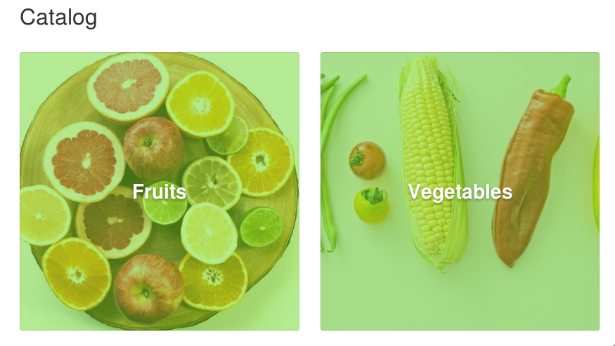
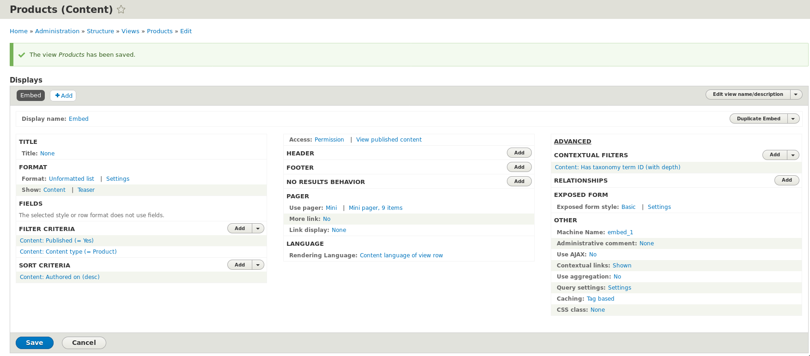
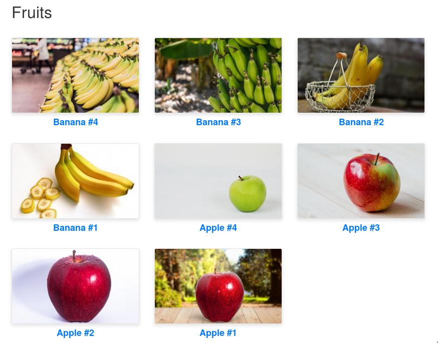
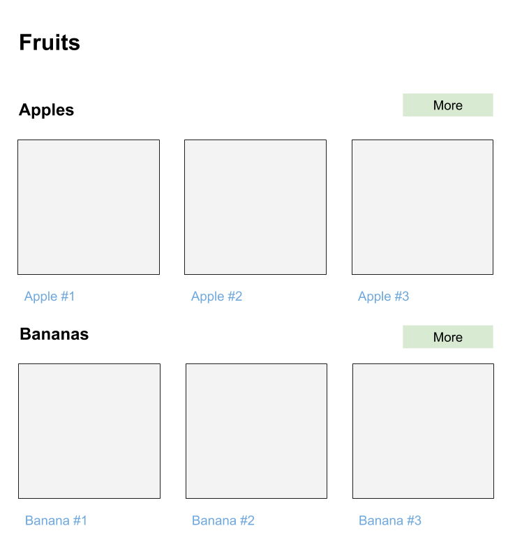
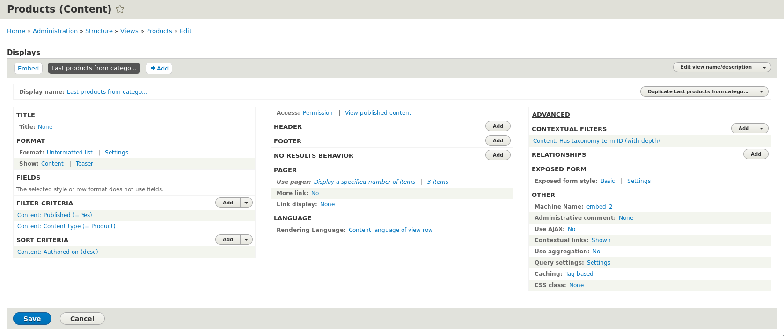
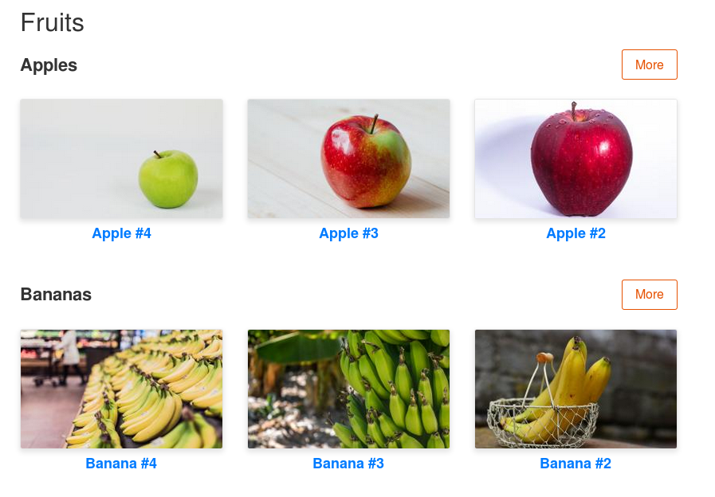
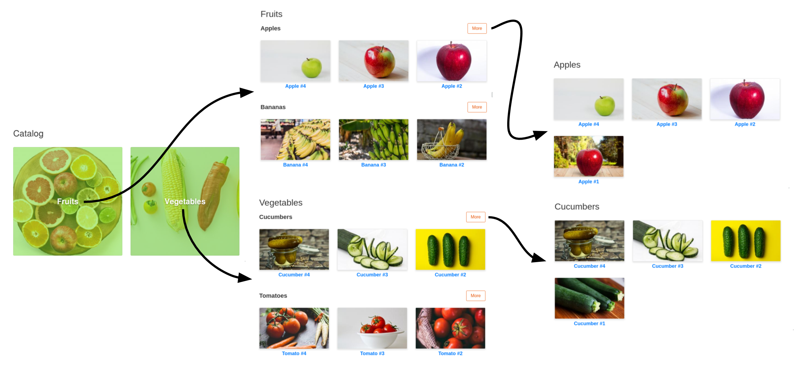

Текущий материал уже будет не столько обучающим, сколько показательным как
использовать несколько инструментов
одновременно: [Route Subscriber](/blog/171), [hook_theme()](https://niklan.net/blog/151)
и чутка [кэширование](/blog/155). Возможно заденет что-то ещё, но это два
основных фундамента для статьи, ноичего побочного, что расписано в своих
статьях, я разжевывать особо не буду.

Пример будет фейковый магазин, где товары — обычные ноды, так как с комерцем,
все аналогично, но пришлось бы чуть больше расписывать из-за особенностей (нет
возможности вывода по глубине без доп. модуля и т.д.).

**Что нам дано:**

- Тип материа Product без каких либо отличительных особенностей. У него есть:
  заголовок, описание, фотка и категория.
- Словарь таксономии "Категории" со следющими категориями:
  - Фрукты
    - Яблоки
    - Бананы
  - Овощи
    - Огурцы
    - Помидоры
- Созданная руками вьюшка с адресом `/catalog`, которая выводит все категории
  первого уровня (фрукты и овощи). Она нам нужна лишь как точка входа, и
  визульное отличие, больше ничего, дальше по материалу это совершенно
  бесполезная вьюшка.
- В каждой категории есть по 4 товара.



**Что мы сделаем для начала.** При переходе в каждую из категорий, срабатывает
стандартный Views, который выводит все материалы помеченные данным термином
таксономии. Стандартная вьюшка нам не подходит, так как нам надо лимитировать
вывод только по нодам типа Product, а также с учетом глубины термина, при этом
не задевая другие словари. Например, у товара Apple #1 стоит категория "Яблоки",
которая является дочерней для "Фрукты". Перейдя на страницу "Фрукты", мы не
видим яблоки, там будет пустая страница, так как данным тегом не помечено ничего
напрямую. Я думаю, вы уже сталкивались с этим, поэтому решение простое, добавить
контекстный фильтр по глубине термина.

Поэтому, первым делом мы создаем новый Views, назовем его, пускай Products,
который выводит содержимое типа Product. В нем мы добавляем новый дисплей
типа <abbr title="Встроенный">Embed</abbr>, так как нам не нужен URL, он есть у
самого термина таксономии (вы дальше поймете о чём я). Хотя, по сути, это не так
важно, можете хоть блок делать, это не изменит дальнейшей сути материала.
Просто, мне кажется, Embed лучше всего подходит под данный кейс. Так вот, создав
его, настройки как хотите, и добавьте контекстуальный фильтр по термину
таксономии с глубиной.

У меня получилось вот так:



Как вы видите, ничего особенного я не сделал совершенно. Типичные задачи для
каталогов и магазинов.

Теперь нам необходимо чтобы данный дисплей вьюса использовался на всех страницах
терминов из словаря "Категории". Вы мне такие скажите, так есть
же [TVI](https://www.drupal.org/project/tvi) и вы окажитесь правы. Мы сделаем
ровно тоже, что делает данный модуль, но без интерфейса настроек с выбором
вьюса. Во-первых, это полезно, вы будете знать как он работает под капотом.
Во-вторых, это реальный кейс, который может потребовать решение которое TVI не
осилит, например, разные вьюсы в зависимости от условий в пределах одного
словоря. Ну и в-третьих, мы после этого усложним задачу, где TVI сдуется сразу
же.

Нам потребуется кастом модуль, и в моём случае, это будет модуль с названием
dummy.

Итак, у нас есть словарь, есть вьюс, есть пустой модуль, нам надо всё это
связать. На помощь нам приходит [Route Subscriber](/blog/171). При помощи него,
нам нужно отловить роут для термина таксономии и подменить стандартный
контроллер на собственный.

```php {"header":"src/EventSubscriber/RouteSubscriber.php"}
<?php

namespace Drupal\dummy\EventSubscriber;

use Drupal\Core\Routing\RouteSubscriberBase;
use Drupal\Core\Routing\RoutingEvents;
use Symfony\Component\Routing\RouteCollection;

/**
 * Dummy route subscriber.
 */
class RouteSubscriber extends RouteSubscriberBase {

  /**
   * {@inheritdoc}
   */
  public static function getSubscribedEvents() {
    $events = parent::getSubscribedEvents();
    $events[RoutingEvents::ALTER] = ['onAlterRoutes', -200];
    return $events;
  }

  /**
   * {@inheritdoc}
   */
  protected function alterRoutes(RouteCollection $collection) {
    if ($route = $collection->get('entity.taxonomy_term.canonical')) {
      $route->setDefault('_controller', '\Drupal\dummy\Controller\DummyTaxonomyTermController::render');
    }
  }

}
```

Что мы сделали. Мы создали подписчик на событие `RoutingEvents::ALTER` с весом
-200. Напоминаю, что подписчики выполняются от большего к меньшему. Стандартный
роут переопределяет другой подписчик — views. Он устанавливает свой вес на
значение -175. Если мы укажем значение больше -175, то оно просто перетрется
вьюсом и не будет работать, указывая -200, мы перетираем значение views, тем
самым, полностью берем контроль над выводом терминов. Мы подменили контроллер
на `\Drupal\dummy\Controller\DummyTaxonomyTermController` и вызов его
метода `render` (название метода вообще не имеет значение, как назовете так и
будет, всё как с кастом роутами).

Для того чтобы подписчик был завершен, нам необходимо его объявить как сервис.

```yaml {"header":"dummy.services.yml"}
services:
  dummy.route_subscriber:
    class: Drupal\dummy\EventSubscriber\RouteSubscriber
    tags:
      - { name: event_subscriber }
```

С подписчиком готово, но вот контроллер, который указан сейчас для терминов
таксономии, не существует. Прежде чем двигаться дальше. Нам нужно описать свой
контроллер который и будет отвечать за вывод на страницах терминов.

```php {"header":"src/Controller/DummyTaxonomyTermController.php"}
<?php

namespace Drupal\dummy\Controller;

use Drupal\Core\Controller\ControllerBase;
use Drupal\taxonomy\TermInterface;

/**
 * Class DummyTaxonomyTermController
 */
class DummyTaxonomyTermController extends ControllerBase {

  /**
   * {@inheritdoc}
   */
  public function render(TermInterface $taxonomy_term) {
    if ($taxonomy_term->bundle() == 'catalog') {
      return views_embed_view('products', 'embed_1', $taxonomy_term->id());
    }
    else {
      // Default term view shipped with drupal core.
      return views_embed_view('taxonomy_term', 'page_1', $taxonomy_term->id());
    }
  }

}
```

В итоге, мы объявили свой подписчик с самым низким приоритетм, мы последними
переопределяем контроллер для термина таксономии на свой. В нём, мы проверяем,
если текущий термин из словаря `catalog`, то мы выводим views products и его
дисплей embed_1, передавая в качестве аргумента ID термина, чтобы работал
конеткстуальный фильтр.

Если же термин не принадлежит словарю каталога, то будет использован стандартный
views поставляемый с ядром.

Вот мы и написали контроллер. После сброса кэша он начнет работать.



И вот мы сделали по сути то, что делает TVI. Причём, это можно спокойно
использовать в связке с ним, о чём будет в конце статьи как дополнение, чтобы не
перегружать сейчас лишней информацией.

Всё работает как надо, но мы не остановимся на достигнутом и пойдем дальше. Мы
сделаем так, что на страницах терминов, которые имеют свои собственные
подкатегории, выводились эти самые подкатегории, с заголовком, тремя последними
товарами и кнопкой для перехода в категорию.

Примерно вот так:



А если это категория конечная (Яблоки, Бананы, Огурцы, Помидоры), то будут
выводиться все товары как сейчас при помощи текущего вьюса products embed_1. То
есть наша задача сейчас, определять что мы находимся на странице термина у
которого есть дочерние категории, и выводить так как нам надо.

Тут мы уже подключим [hook_theme()](https://niklan.net/blog/151). Мы объявим
собственный theme hook, который будет выводить все подкатегории как на мокапе
выше.

Первым делом, нам нужно создать ещё один вью, который будет выводить три
последних товара из категории. Для этого достаточно сделать копию текущего
projects embed_1, установить вывод определенного кол-ва материалов вместо
пейджера и готово!

У меня получилось вот так:



Теперь объявим наш theme hook.

```php {"header":"dummy.module"}
<?php

/**
 * @file
 * Contains custom functions and hooks.
 */

/**
 * Implements hook_theme().
 */
function dummy_theme($existing, $type, $theme, $path) {
  return [
    'dummy_last_products_in_category' => [
      'variables' => [
        'taxonomy_term' => NULL,
      ],
      'file' => 'dummy.theme.inc',
    ],
  ];
}
```

Далее подготовим переменные для нашего theme hook в его препроцессе

```php {"header":"dummy.theme.inc"}
<?php

/**
 * @file
 * Dummy custom theme hook preprocesses.
 */

use Drupal\Core\Cache\CacheableMetadata;

/**
 * Implements template_preprocess_HOOK().
 */
function template_preprocess_dummy_last_products_in_category(&$variables) {
  /** @var \Drupal\taxonomy\TermInterface $taxonomy_term */
  $taxonomy_term = $variables['taxonomy_term'];
  /** @var \Drupal\taxonomy\TermStorageInterface $term_storage */
  $term_storage = \Drupal::entityTypeManager()->getStorage('taxonomy_term');
  $cache = CacheableMetadata::createFromRenderArray([
    '#context' => [
      'url.path',
    ],
  ]);
  // Add current term to cache dependency (tags).
  $cache->addCacheableDependency($taxonomy_term);
  // Create array for our categories data.
  $items = [];
  // Load child terms.
  $childs = $term_storage->loadChildren($taxonomy_term->id());
  // Loop through each child and add it to our result array.
  /** @var \Drupal\taxonomy\TermInterface $child */
  foreach ($childs as $child) {
    $items[] = [
      'id' => $child->id(),
      'weigh' => $child->getWeight(),
      'label' => $child->label(),
      'url' => $child->toUrl()->toString(TRUE)->getGeneratedUrl(),
      'view' => views_embed_view('products', 'embed_2', $child->id()),
    ];
    // Add every child to cache dependency.
    $cache->addCacheableDependency($child);
  }
  // Add items to variables.
  $variables['items'] = $items;
  // Apply cache data to render array.
  $cache->applyTo($variables);
}
```

В данном коде мы добавляем все вложенные категории в массив `$items`, а также
контролируем кэш чтобы при изменении любого из термина родителя или дочернего,
информация обновилась. Там же мы вызываем сразу view для вывода трех товаров,
как мы это делали в контроллере.

Ну и добавляем наш темплейт для всего этого.

```twig {"header":"templates/dummy-last-products-in-category.html.twig"}
<div{{ attributes.addClass('last-products-in-category') }}>
  
    <div class="last-products-in-category__category">
      <div class="last-products-in-category__header">
        <h2 class="last-products-in-category__title">{{ item.label }}</h2>
        <a href="{{ item.url }}" class="last-products-in-category__more">{{ 'More'|t }}</a>
      </div>

      <div class="last-products-in-category__content">
        {{ item.view }}
      </div>
    </div>
  
</div>
```

После чего немного меняем наш контроллер, чтобы он использовал наш theme hook
если есть дочерние категории.

```php {"header":"src/Controller/DummyTaxonomyTermController.php"}
<?php

namespace Drupal\dummy\Controller;

use Drupal\Core\Controller\ControllerBase;
use Drupal\taxonomy\TermInterface;

/**
 * Class DummyTaxonomyTermController
 */
class DummyTaxonomyTermController extends ControllerBase {

  /**
   * {@inheritdoc}
   */
  public function render(TermInterface $taxonomy_term) {
    if ($taxonomy_term->bundle() == 'catalog') {
      /** @var \Drupal\taxonomy\TermStorageInterface $term_storage */
      $term_storage = \Drupal::entityTypeManager()->getStorage('taxonomy_term');
      $childs = $term_storage->loadChildren($taxonomy_term->id());
      if ($childs) {
        return [
          '#theme' => 'dummy_last_products_in_category',
          '#taxonomy_term' => $taxonomy_term,
        ];
      }
      return views_embed_view('products', 'embed_1', $taxonomy_term->id());
    }
    else {
      // Default term view shipped with drupal core.
      return views_embed_view('taxonomy_term', 'page_1', $taxonomy_term->id());
    }
  }

}
```

Немножко шаманим со стилями, и вуаля!



В итоге мы имеем следующее поведение:



## Использование в связке с TVI

Отказываться от TVI ради такого решения нет смысла. TVI делает то же самое, при
этом позволяет вам все это делать мышкой из админки, и ничего более. Если вы
посмотрите в его код, вы увидите прямую аналогию с тем что сделано в статье. Он
не сможет вам сделать то, что сделали мы, переопределив вывод на странице
категории с подкатегориями, но если такое потребуется, то в связке с TVI это
делается ничуть не сложнее. Нам лишь слегка надо поправить подписчик и
контролер.

В случае с подписчиком, я даже не буду приводить измененный вариант. Всё что
нужно поправить у подписчика — вес. У TVI аналогичный вес -200, для того чтобы
его перекрыть, достаточно указать -201, и всё, контроль снова наш.

Затем поправить наш контроллер так, чтобы он всю логику отдавал TVI, если мы не
обнаружили нужный нам словарь и термин с подкатегориями.

```php {"header":"src/Controller/DummyTaxonomyTermConrtoller.php"}
<?php

namespace Drupal\dummy\Controller;

use Drupal\Core\Controller\ControllerBase;
use Drupal\taxonomy\TermInterface;
use Drupal\tvi\Service\TaxonomyViewsIntegratorManagerInterface;
use Symfony\Component\DependencyInjection\ContainerInterface;

/**
 * Class DummyTaxonomyTermController
 */
class DummyTaxonomyTermController extends ControllerBase {

  /**
   * @var \Drupal\tvi\Service\TaxonomyViewsIntegratorManager
   */
  private $term_display_manager;

  /**
   * TaxonomyViewsIntegratorTermPageController constructor.
   *
   * @param \Drupal\tvi\Service\TaxonomyViewsIntegratorManagerInterface $term_display_manager
   */
  public function __construct(TaxonomyViewsIntegratorManagerInterface $term_display_manager) {
    $this->term_display_manager = $term_display_manager;
  }

  /**
   * {@inheritdoc}
   */
  public static function create(ContainerInterface $container) {
    $term_display_manager = $container->get('tvi.tvi_manager');
    return new static($term_display_manager);
  }

  /**
   * {@inheritdoc}
   */
  public function render(TermInterface $taxonomy_term) {
    if ($taxonomy_term->bundle() == 'catalog') {
      /** @var \Drupal\taxonomy\TermStorageInterface $term_storage */
      $term_storage = \Drupal::entityTypeManager()->getStorage('taxonomy_term');
      $childs = $term_storage->loadChildren($taxonomy_term->id());
      if ($childs) {
        return [
          '#theme' => 'dummy_last_products_in_category',
          '#taxonomy_term' => $taxonomy_term,
        ];
      }
    }
    return $this->term_display_manager->getTaxonomyTermView($taxonomy_term);
  }

}
```

В нём мы добавили два новых метода:

- `create()`: В нем мы указываем контейнер иньектору что для нашего обьекта
  нужен сервис `tvi.tvi_manager`, который содержит всю логику TVI для
  контроллера.
- `__construct()`: В конструкторе мы принимаем сервис и записываем его в
  свойство.

В рендере мы оставили лишь логику для вывода страницы с подкатегориями, если
страница не имеет вложенных категорий, или вовсе не является словарём каталога,
то он отдает обработку TVI, а он, на основе своих настроек, вызовет тот вьюс,
что указан в настройках словаря. А если не указан, то стандартный вьюс. Тем
самым, нам меньше забот.

TVI также полезен в таком подходе тем, что для вьюсов, что он вызывает, он
передает помимо аргумента с TID ещё и аргументы из URL, чего мы в примере делать
не стали. Дополнив наш код под это дело, он бы ещё разросся чутка, что опять же,
плюс TVI сервису, который проще и быстрее вызывать, и он все сделает за нас, так
мы ещё и сможем управлять самой простой и очевидной частью логики из админки.
