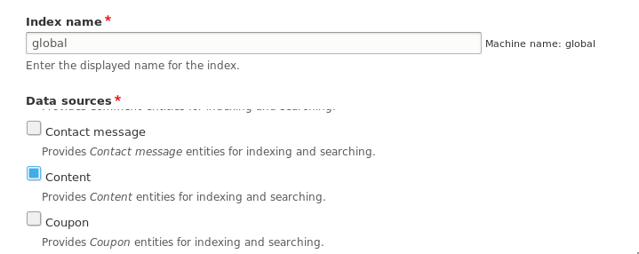
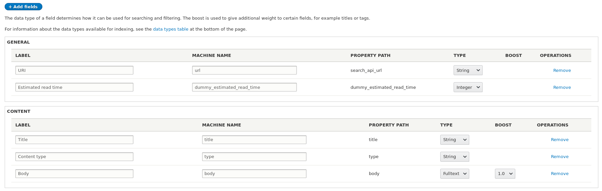
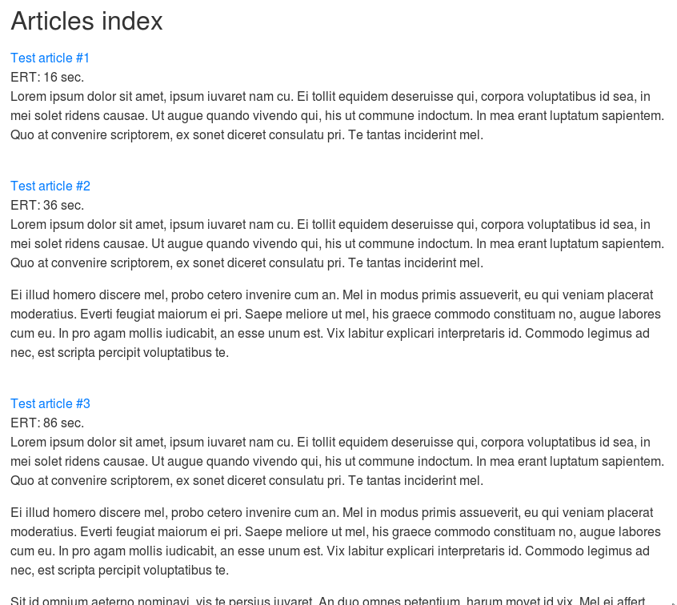
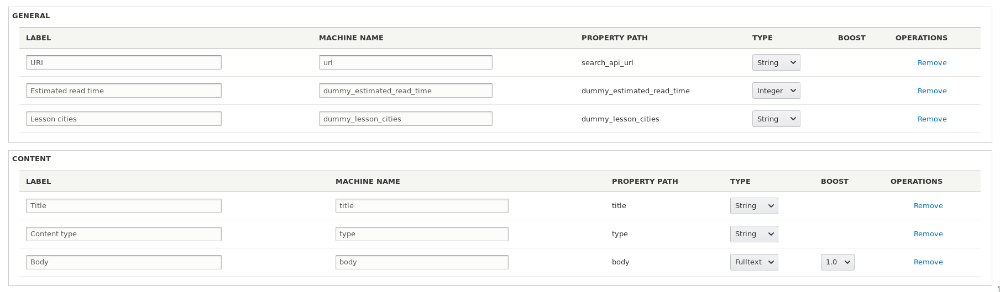

Порой требуется добавить в поисковый индекс данные, которые хранятся разрозненно
или не совсем очевидно. Например, часть данных находится в параграфах, или в
двух разных полях, а нужно эти данные собирать для индекса, чтобы в дальнейшем
по ним искалось, или же вообще использовать в фасетах. А возможно, вам нужно на
основе имеющихся данных в индекс добавлять совершенно новые. Всё это сводится к
тому, что нужно как-то добавить кастомное значение (поле) в индекс Search API,
для этого существует Processor Plugin.

**Processor Plugin** имеет шесть областей применения, один из них — возможность
добавлять новые значения в поисковый индекс. Эту возможность мы и рассмотрим.

Данные плагины состоят из аннотации и парочки методов. Объявляются по
пути `src/Plugin/search_api/processor`.

**Аннотация** `@SearchApiProcessor` описывает плагин и принимает следующие
значения:

- `id`: Машинное имя процессора\плагина.
- `label`: Название для людей.
- `description`: Описание.
- `stages`: Массив из стадий, на которых данный плагин будет вызываться,
  состояющий из названия стадии выполнения и веса, при котором плагин будет
  выполнен. Вес указывается по умолчанию. Финальный вес задается в админке в
  соответствующем разделе.
- `hidden` (false): Чекбокс для данного процессора не будет показан на вкладке
  настроек.
- `locked` (false): Если не скрыто, то чекбокс будет неактивным. Если скрыт
  и `locked` установлен в `true`, то данный процессор будет включен всегда.

Как я написал выше, процессор плагин имеет 6 областей применения, и может
работать сразу со всеми в одном плагине. В каких именно, определяет
какраз `stages` массив.

На данный момент они следующие:

- `add_properties`: Стадия добавления новых значений в индекс. Это какраз та
  стадия, которая нам нужена.
- `pre_index_save`: Препроцессор для сущности Index.
- `alter_items`: Передает массив с сущностями Item, которые уйдут на индексацию.
  Тут можно модифицировать данные после того как они были добавлены, но перед
  тем как они ушли на обработку. Например, убирать из индекса сущность если у
  неё не прошли какие-либо условия.
- `preprocess_index`: Передает массив с сущностями Item. Тут подразумевается что
  вы можете изменить данные полей. На этом уровне выполняются Stemmer, Type
  boost.
- `preprocess_query`: Передает объект запроса Search API, чтобы вы могли его
  поправить, если требуется.
- `postprocess_query`: Передает найденные результаты по запросу, где вы можете
  подредактировать или убрать ненужные. Например, на данном этапе срабатывает
  процессор подсветки найденных результатов.

Как уже указал, мы в этой статье рассмотрим только стадию `add_properties`, так
как в ней добавляются значения в индекс.

Пример аннотации:

```php
/**
 * @SearchApiProcessor(
 *   id = "example_processor_name",
 *   label = @Translation("My processor"),
 *   description = @Translation("We add some stuff here."),
 *   stages = {
 *     "add_properties" = 0,
 *   },
 * )
 */
```

**Специфичные методы, которые используются** на стадии `add_properties`:

- `getPropertyDefinitions()`: В этом методе объявляются свойства поискового
  индекса. Это какраз поля, которые индексируются. Метод должен возвращать
  массив со "свойствами", где ключ - название свойства, а значение,
  инстанс `ProcessorProperty`.
  - **Ключ** — машинное имя свойства (поля) в индексе, должно начинаться либо с
    буквы, либо со знака подчеркивания, далее можно использовать также числа.
    Разумеется, только латиница.
  - **Значение** — инстанс `ProcessorProperty`, который передается в виде
    массива:
    - `label`: Название свойства для людей.
    - `description`: Его описание.
    - `type`: Тип данных который будет отдан в виде значения. Какие доступны
      типы определяет бэкенд поиска. С модулем поставляется Database Search, он
      имеет следующие типы
      данных: `text`, `string`, `uri`, `integer`, `duration`, `date`, `decimal`, `boolean`.
    - `processor_id`: id плагина-процессора который за него отвечает.
    - `hidden` (FALSE): Скрыто ли данное свойство.
    - `is_list` (FALSE): Если указано `TRUE`, это означает, что данное
      свойство (поле) будет возвращать несколько занчений (массив значений).
      Следует понимать как multivalue поле.
- `addFieldValues()`: Метод, в котором добавляются новые значения. Тут какраз
  описывается вся логика, откуда, что, как брать и как сохранить. В него
  передается сущность Item, в которой можно спокойно вытащить оригинальный
  объект индекса и прочую информацию.

Также нам пригодится общий метод для всех процесс плагинов `supportsIndex()`.
Данный метод должен возвращать `TRUE` или `FALSE`. Если возвращает `TRUE`, то
плагин будет выполнен, если `FALSE`, то пропустится. По умолчанию там
возвращается `TRUE`, это значит, что ваш плагин будет доступен во всех поисковых
индексах.

Время переходить к примерам!

_Далее по коду подразумевается что код пишется в модуле dummy._

## Пример №1 количество времени необходимое на прочтение

Для примера, я возьму стандартный тип содержимого Article, который идет с ядром
и его поле body. Мы добавим в индекс поле, которое будет считать, сколько
примерно нужно времени на прочтение материала в секундах. Практической пользы
это не будет нести, чисто как пример. Но если вы потом подключите фасеты, то
можно будет сделать фильтр по данному значению и фильтровать материалы в
определенном промежутке предположительного времени чтения!

У меня есть индекс `global` поисковый индекс, который индексирует все сущности
типа Node.



В полях добавлены URI, Title, Content type и Body. То что там добавлено - не
важно для нас, это лишь для вывода во вьюсах для примера. Мы будем брать данные
напрямую из сущности.

Поэтому сразу приступаем к написанию процессора:

```php {"header":"src/Plugin/search_api/processor/EstimatedReadTime.php"}
<?php

namespace Drupal\dummy\Plugin\search_api\processor;

use Drupal\Core\Entity\EntityInterface;
use Drupal\search_api\Datasource\DatasourceInterface;
use Drupal\search_api\IndexInterface;
use Drupal\search_api\Item\ItemInterface;
use Drupal\search_api\Processor\ProcessorPluginBase;
use Drupal\search_api\Processor\ProcessorProperty;

/**
 * @SearchApiProcessor(
 *   id = "dummy_estimated_read_time",
 *   label = @Translation("Estimated read time"),
 *   description = @Translation("Calculate estimated read time in seconds."),
 *   stages = {
 *     "add_properties" = 0,
 *   },
 *   hidden = true,
 *   locked = true,
 * )
 */
class EstimatedReadTime extends ProcessorPluginBase {

  /**
   * {@inheritdoc}
   */
  public static function supportsIndex(IndexInterface $index) {
    foreach ($index->getDatasources() as $datasource) {
      if ($datasource->getEntityTypeId() == 'node') {
        return TRUE;
      }
    }
    return FALSE;
  }

  /**
   * {@inheritdoc}
   */
  public function getPropertyDefinitions(DatasourceInterface $datasource = NULL) {
    $properties = [];

    if (!$datasource) {
      $definition = [
        'label' => $this->t('Estimated read time'),
        'description' => $this->t('Calculate estimated read time in seconds.'),
        'type' => 'integer',
        'processor_id' => $this->getPluginId(),
      ];
      $properties['dummy_estimated_read_time'] = new ProcessorProperty($definition);
    }

    return $properties;
  }

  /**
   * {@inheritdoc}
   */
  public function addFieldValues(ItemInterface $item) {
    /** @var EntityInterface $entity */
    $entity = $item->getOriginalObject()->getValue();

    if ($entity instanceof EntityInterface && $entity->hasField('body')) {
      $body_value = $entity->body->value;
      if ($body_value) {
        // Average word per minute reading for all languages.
        // @see https://en.wikipedia.org/wiki/Words_per_minute
        $word_per_minute = 184;
        $word_count = str_word_count(strip_tags($body_value));
        $estimated_read_time = floor(($word_count / $word_per_minute) * 60);

        // Add value to index.
        $fields = $this->getFieldsHelper()
          ->filterForPropertyPath($item->getFields(), NULL, 'dummy_estimated_read_time');
        foreach ($fields as $field) {
          $field->addValue($estimated_read_time);
        }
      }
    }
  }

}
```

Пройдемся по порядку:

1. Мы объявили аннотацию к плагину. Обратите внимание что мы добавили `hidden`
   и `locked` в true. Таким образом, наше "поле" для индекса будет сразу
   доступно для добавления, и не будет отображаться в списке других процессоров,
   так как нам это просто не нужно.
2. В методе `supportsIndex()` мы написали условие, где мы пропускаем наш
   процессор только в те поисковые индексы, где есть сущности Node для
   индексации. В остальных индексах данное поле не появится.
3. В `getPropertyDefinitions()` мы объявили наше свойство (поле) и вернули его.
   Наш плагин будет обслуживать одно поле. Если вы хотите несколько, то не
   проблема.
4. И наконец, в методе `addFieldValues()` мы описали всю логику. Мы получаем
   объект который сейчас проходит индексацию и проверяем, является ли он
   сущностью друпала и имеет ли поле `body`. Если нет, ничего не будет, если
   пройдет, то мы получаем значение поля body и если оно не пустое, считаем
   приблизительное время чтения материала в секундах. После чего, мы вызываем
   метод `getFieldsHelper()`, который вернет нам
   сервис `search_api.fields_helper`. У данного сервиса, мы
   вызываем `filterForPropertyPath()` в который передаем поля которые сейчас
   доступны для элемента на индексацию, и в третьем аргументе указываем, что нам
   нужны свойства типа `dummy_estimated_read_time`. Таким образом, он вернет нам
   все поля из индекса, которые имеют наш тип. Проходимся циклом по ним и
   добавляем полученное значение к ним на хранение.

Почему там цикл? Все потому, что полей можно в индексе обьявлять сколько угодно.
Можно объвяить 2, 3, да хоть 10 полей нашего свойства, с разными названиями и
даже типами хранения. Таким образом, мы на 100% уверены что во все эти поля
попадет наше значение.

Сбрасываем кэш, заходим в наш индекс и добавляем новое поле. Оно будет в разделе
General.



После этого сохраняем информацию о полях и запускаем новую индексацию. Если у
вас ещё нет никакой странички, можно быстро во вьюсе набросать вывод всех данных
из поискового индекса и значения их полей и посмотреть на результат. У меня
получилось вот что:



Вот и всё! Дальше по этому значению делайте что хотите, ищите, фильтруйте, да
хоть фасеты настраивайте.

## Пример №2 список городов из параграфов

Данный рекомендую пробежать хотя бы бегло глазами, как минимум про особенность
под кодом.

Для данного примера я создал новый тип материала Lesson (`lesson`). У него
ничего особенного, заголовок, поле body и множественное поле для
параграфов (`field_lesson_places`) с доступным типом параграфа Lesson place. Сам
параграф Lesson place — текстовое поле местом проведения (`field_lesson_place`),
а также текстовым полем City (`field_lesson_city`). Оба поля обязательные, как и
поле параграфа для Lesson.

Для примера я добавил 2 содержимого, первый Test lesson содержит два параграфа
где города: Moscow, Yekaterinburg, второй Test lesson #2 содержит один параграф
с городом Perm.

Мы напишем поле, которое будет собирать все города из Lesson. Так что переходим
сразу к процессору.

```php {"header":"src/Plugin/search_api/processor/LessonCities.php"}
<?php

namespace Drupal\dummy\Plugin\search_api\processor;

use Drupal\Core\Entity\EntityInterface;
use Drupal\search_api\Datasource\DatasourceInterface;
use Drupal\search_api\IndexInterface;
use Drupal\search_api\Item\ItemInterface;
use Drupal\search_api\Processor\ProcessorPluginBase;
use Drupal\search_api\Processor\ProcessorProperty;

/**
 * @SearchApiProcessor(
 *   id = "dummy_lesson_cities",
 *   label = @Translation("Lesson cities"),
 *   description = @Translation("Parse cities from paragraphs of lesson
 *   places."), stages = {
 *     "add_properties" = 0,
 *   },
 *   hidden = true,
 *   locked = true,
 * )
 */
class LessonCities extends ProcessorPluginBase {

  /**
   * {@inheritdoc}
   */
  public static function supportsIndex(IndexInterface $index) {
    foreach ($index->getDatasources() as $datasource) {
      if ($datasource->getEntityTypeId() == 'node') {
        return TRUE;
      }
    }
    return FALSE;
  }

  /**
   * {@inheritdoc}
   */
  public function getPropertyDefinitions(DatasourceInterface $datasource = NULL) {
    $properties = [];

    if (!$datasource) {
      $definition = [
        'label' => $this->t('Lesson cities'),
        'description' => $this->t('Parse cities from paragraphs of lesson places.'),
        'type' => 'string',
        'processor_id' => $this->getPluginId(),
        'is_list' => TRUE,
      ];
      $properties['dummy_lesson_cities'] = new ProcessorProperty($definition);
    }

    return $properties;
  }

  /**
   * {@inheritdoc}
   */
  public function addFieldValues(ItemInterface $item) {
    /** @var EntityInterface $entity */
    $entity = $item->getOriginalObject()->getValue();

    if ($entity instanceof EntityInterface && $entity->hasField('field_lesson_places')) {
      $cities = [];

      /** @var \Drupal\paragraphs\ParagraphInterface $paragraph */
      foreach ($entity->field_lesson_places->referencedEntities() as $paragraph) {
        $city = $paragraph->field_lesson_city->value;
        // To exclude duplicates.
        $cities[$city] = $city;
      }

      // Add value to index.
      $fields = $this->getFieldsHelper()
        ->filterForPropertyPath($item->getFields(), NULL, 'dummy_lesson_cities');
      foreach ($fields as $field) {
        $field->setValues($cities);
      }
    }
  }

}
```

Бегло пробегаемся по коду:

1. Аннотация, как и в примере №1.
2. `supportsIndex()` аналогично, без изменений.
3. `getPropertyDefinitions()`, тут мы уже поменяли тип на `string`, а также
   указали что это множественное поле, установив `TRUE` для `is_list`. Так как у
   нас может быть множество параграфов? То городов может получиться
   неограниченное кол-во.
4. Вся логика примерно такая же. Только тут мы собираем массив уникальных
   городов указанных в параграфах в пределах одной сущности и добавляем сразу
   массив значений через `setValues()`, чтобы не крутить циклом
   для `addField()`.

И вот в четвертом пункте уже стоит отсутпить и сообщить об **особенности работы
данных плагинов**. Когда код подготовки значения будет разрастаться, вам,
возможно, придеться добавить некоторые свои методы и свойства. Так вот,
особенность заключается тут в том, что <mark>процессоры вызываются один раз в
пределах одного запроса</mark>. Это значит, если вы запустите батч на
индексацию, указав что нужно индексировать по 50 значений за раз, то на каждые
50 записей отправленных на индексацию **будет создаваться один единственный
инстанц** процессора. Следовательно, если вы создадите свойство или напишите
иную логику для временного хранения результатов, вам её нужно обнулять каждый
раз в `addFieldValues()`, иначе у вас будут копиться данные от предыдущих
материалов из данного процесса, и данные смешаются. Особенно это заметно на
мультиязычных сайтах. Он сначала, допустим, передаст вам сущность на русском, вы
добавите значения "Москва, Екатеринбург", не очистите переменную в начале
метода, он передаст матераил на английском, и у вас для английской версии
материала в индекс попадут уже "Москва, Екатеринбург, Moscow, Yekaterinburg",
что, естественно, скажется на дальнейшей работе поиска и куче левых данных в
фасетах.

Возвращаясь к примеру. Добавляем данное поле к индексу:



Накидайте какой-нибудь простой вьюс, и смотрите результат!


Я даже сделал фасетный блок для городов. Ничего дополнительно писать не
пришлось.
