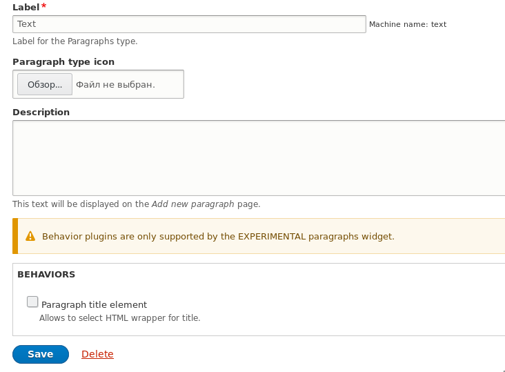
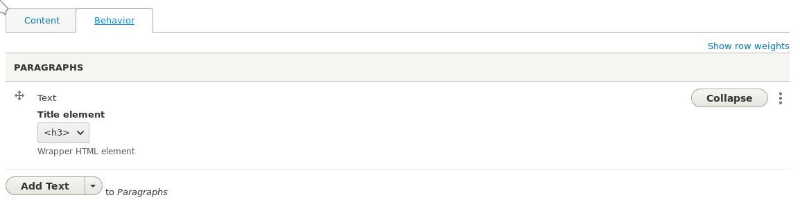
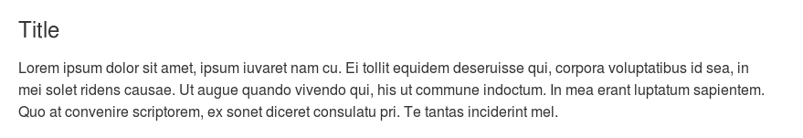
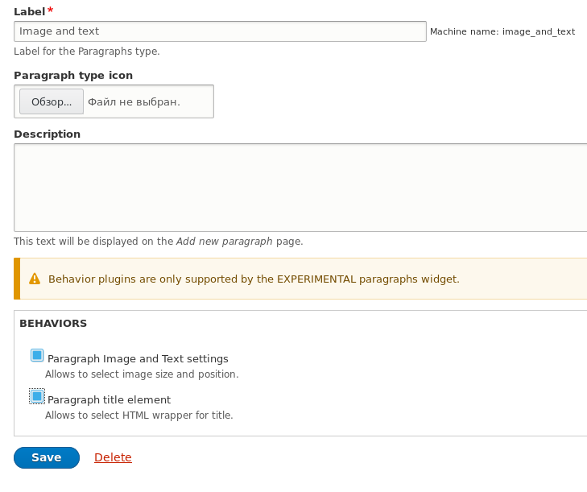
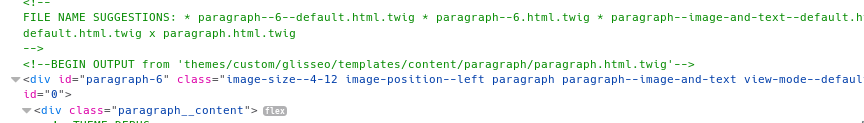
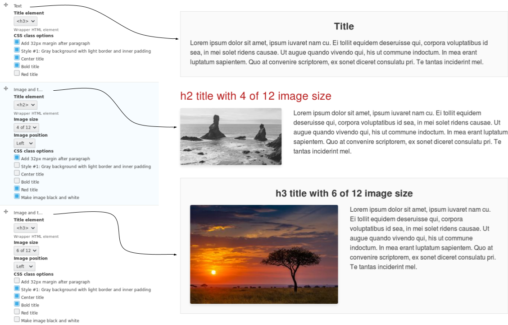

Модуль [Paragraphs](https://www.drupal.org/project/paragraphs) позволяет делать
наполнение сайта намного приятнее, гибче и унифицированнее. Если вы активно
пользуетесь параграфами, вы, скорее всего, уже сталкивались с такой проблемой,
что для параграфа нужно добавить какие-то настройки и вы цепляете под это дело
поля, что иногда, выглядит немного странновато и запутанно, а в некоторых
случаях, совершенно превращается либо в костыли, либо в пытку. И для этого есть
решение, на которое, я случайно нарвался капаясь в исходниках модуля. Я
попробовал — и это кардинально поменяло мои взгляды на то, как можно расширять
параграфы.

**Paragraphs Behavior Plugin** позволяет вам добавлять свои собственные
настройки в параграфы! И это не поля, а сомостоятельная штука, хранящаяся
отдельно в каждом параграфе как дополнетельное свойство. Я не буду тут
расписывать как он решает кучу проблем, по ходу обьяснения что это и как
работает, вы сами сможете прикинуть применение на свой личный опыт решения этих
же задач без плагина, и понять, подойдет он вам или нет.

Данный плагин позволяет добавить новое "поведение" для параграфа. Если
переводить на более понятный язык — настройки для параграфов. Он умеет обьявлять
свои формы, сохранять и подгружать настройки, применяться только там где надо,
препроцессить параграфы до того как они отдадутся hook_preprocess, а затем
темплейту и ещё по мелочи. Ну и подобная реализация, позволяет переносить
наработки между проектами безболезненно, с легкими правками если даже структура
у них отличается кардинально.

То что вы делали раньше через поля, с большой вероятностью, больше делать не
придется!

**Плагин состоит** из аннотации и методов `ParagraphsBehaviorInterface`. Сейчас
пробежимся по каждому из них.

**Аннотация** `@ParagraphsBehavior` принимает следующие значения:

- `id`: Машинное название плагина.
- `label`: Название плагина для людей, будет показано на странице настройки
  параграфа.
- `description`: Описание плагина, также как и лейбл, будет показываться на
  странице настройки параграфа.
- `weight`: Вес плагина относительно других. Это удобно когда вы хотите чтобы
  один плагин выполнялся после другого.

**Методы** для плагина тоже, немногочислены и очень просты:

- `buildBehaviorForm()`: Данный метод позволяет объявить форму с настройками для
  плагина используя Form API.
- `validateBehaviorForm()`: Позволяет валидировать выбор, и выдавать ошибку,
  если настроено некорректно.
- `submitBehaviorForm()`: Вызывается при успешном субмите формы. Позволяет вам
  написать собственную логику сохранения данных или выполнения дополнительного
  кода. Из коробки он сам всё разруливает.
- `preprocess()`: Полный аналог `hook_preprocess_paragraph()`, в него передается
  тот же самый массив `$variables` где вы можете отредактировать данные, или
  добавить новые. Он вызывается раньше всех `hook_preprocess_HOOK()`.
- `view()`: Аналог `hook_entity_view()`. Позволяет вам скорректировать render
  array сущности.
- `isApplicable()`: Определят, будет ли ваш плагин доступен для активиции в
  определенных типах параграфов. Благодря ему, ваш плагин может работать только
  в определенных параграфах и нигде больше.
- `settingsSummary()`: Позволяет задать сводку по вашему плагину. Эта сводка
  выводится в форме редактирования поля с параграфами когда они свернуты в режим
  summary.
- `getFieldNameOptions()`: Возвращает массив с лейблами для полей, где ключ -
  машинное имя поля параграфа, а значение - его лейбл. Не очень понимаю зачем,
  но видимо в каких-то ситуациях полезно.

Благодаря этим методам, можно сделать настройки для параграфов и максиамльно
контролировать всё это из централизованного места - плагина.

**Важное замечание**, что данные плагины на данный момент добавляют интерфейс с
настройками только при выборе виджета для поля с
параграфом `Paragraphs EXPERIMENTAL`. Они будут работать и с классическим
виджежтом, но настройки выводиться не будут.

Время переходить на примеры и смотреть как можно использовать.

_Далее по тексту подразумевается что код пишется в модуле с названием dummy._

## Пример №1 — Обёртка для заголовка параграфа

Допустим, у вас есть параграф Text (`text`), в нём два поля Text (`field_text`,
длинное с форматированием) и Title `field_title` для заголовка параграфа.
Возможно поле заголовка даже используется в других ваших параграфах для
унификации. Но по умолчанию, там будет `<div>` обёртка от поля, если вы не
поменяете на свою или не добавите какую-то логику для замены. Очень вероятно вы
с таким уже сталкивались.

Давайте решать её при помощи плагина, которые объявляются
в `src/Plugin/paragraphs/Behavior`.

```php {"header":"src/Plugin/paragraphs/Behavior/ParagraphTitleBehavior.php"}
<?php

namespace Drupal\dummy\Plugin\paragraphs\Behavior;

use Drupal\Core\Entity\Display\EntityViewDisplayInterface;
use Drupal\Core\Form\FormStateInterface;
use Drupal\paragraphs\Annotation\ParagraphsBehavior;
use Drupal\paragraphs\Entity\Paragraph;
use Drupal\paragraphs\Entity\ParagraphsType;
use Drupal\paragraphs\ParagraphInterface;
use Drupal\paragraphs\ParagraphsBehaviorBase;

/**
 * @ParagraphsBehavior(
 *   id = "dummy_paragraph_title",
 *   label = @Translation("Paragraph title element"),
 *   description = @Translation("Allows to select HTML wrapper for title."),
 *   weight = 0,
 * )
 */
class ParagraphTitleBehavior extends ParagraphsBehaviorBase {

  /**
   * {@inheritdoc}
   */
  public static function isApplicable(ParagraphsType $paragraphs_type) {
    return TRUE;
  }

  /**
   * {@inheritdoc}
   */
  public function view(array &$build, Paragraph $paragraph, EntityViewDisplayInterface $display, $view_mode) { }

  /**
   * {@inheritdoc}
   */
  public function buildBehaviorForm(ParagraphInterface $paragraph, array &$form, FormStateInterface $form_state) {
    if ($paragraph->hasField('field_title')) {
      $form['title_element'] = [
        '#type' => 'select',
        '#title' => $this->t('Title element'),
        '#description' => $this->t('Wrapper HTML element'),
        '#options' => $this->getTitleOptions(),
        '#default_value' => $paragraph->getBehaviorSetting($this->getPluginId(), 'title_element', 'h2'),
      ];
    }

    return $form;
  }

  /**
   * {@inheritdoc}
   */
  public function settingsSummary(Paragraph $paragraph) {
    $title_element = $paragraph->getBehaviorSetting($this->getPluginId(), 'title_element');
    return [$title_element ? $this->t('Title element: @element', ['@element' => $title_element]) : ''];
  }

  /**
   * Return options for heading elements.
   */
  private function getTitleOptions() {
    return [
      'h2' => '<h2>',
      'h3' => '<h3>',
      'h4' => '<h4>',
      'div' => '<div>',
    ];
  }

}
```

Пройдем по порядку:

1. `isApplicable()`: Возвращаем всегда `TRUE`. Наш плагин поддерживаться на всех
   параграфах, а где он будет показывать настроки, мы подрежем позже. Так как в
   данном методе определяется ограничение по типу параграфа.
2. `view()`: В данном случае нам не нужен, в базовом плагине его нет, нам его
   обязательно нужно объявить, хотябы пустой.
3. `buildBehaviorForm()`: Объявляем форму с настройками для нашего плагина. В
   нём мы проверяем, есть ли у текущего параграфа поле `field_title`, если да,
   то добавляем наши настройки, если нет, настроек не будет и по сути, плагин
   перестанет работать. Здесь мы объявляем нашу настройку `title_element`.
   Данное название станет названием значения в настройках плагина.
4. `settingsSummary()`: Получаем значение настройки `title_element` и возвращаем
   её. Данный метод должен возвращать массив из строк. Т.е. можете каждую
   настройку плагина передавать в качестве элемента массива, он все выведет. А
   можете не передавать. Сводка сейчас работает так, что если там есть текст, то
   считайте от неё толку мало, ваши просто уже не влезут.
5. `getTitleOptions()`: Наш кастомный метод, который возвращает массив опций для
   нашей настройки `title_element`. Мы его также вызываем в сводке, для того
   чтобы выводить не ключ выбранной опции, который будет храниться в настройках,
   а его лейбл.

Сбросив кэш, мы можем перейти в настройку любого параграфа, в моём случае Text,
и при его редактировании у вас появятся доступные плагины:



Можем включить, сохранить и попровать зайти в любую сущность где используются
параграфы данного типа.



Вы можете заметить что появилась новая вкладка Behavior и перейдя в неё, режим
редактирования параграфов меняется на их настройки.

Но сохранив материал, заголовок не станет оборачиваться в выбранный вами
элемент. Для этого нужно поправить шаблон поля, где обертка по умолчанию жестко
задана в `<div>`.

В своей теме переопределяем шаблон поля, в моём случае он будет иметь следующее
название: `field--paragraph--field-title.html.twig` — я задаю шаблон для всех
полей `field_title` для сущности параграфа и меняю шаблон на следующий:

```twig {"header":"field--paragraph--field-title.html.twig"}
{#
/**
 * @file
 * Theme override for a field.
 *
 * @see template_preprocess_field()
 */
#}







  <{{ title_element }}{{ attributes.addClass(classes, 'field__item') }}>{{ item.content }}</{{ title_element }}>

```

Я его очень серьезно подрезал. Убрал варианты вывода с меткой, так как её точно
никогда не будет у данного поля, убрал обработчик для множественного поля, так
как это поле с одним значением и добавил две новые переменные `paragraph` - в
которую я записываю объект сущности параграфа и `title_element` - в которую я
получаю значение настройки при помощи метода от сущности
параграфа `getBehaviorSetting()`. Аналогично как эта настройка получается в
самом плагине в методах `buildBehaviorForm()` и `settingsSummary()`, только в
темплейте нам надо явно указать id нашего плагина, которому принадлежат
настройки.

И вот теперь, сбросив кэш и перейдя на страницу, заголовок станет `<h3>`.



Теперь можно управлять элементом заголовка прямо из параграфа, без единого
нового поля, препроцессоров и т.д. Один плагин + переопределенный темплейт.

## Пример №2 — Размер и позиция изображения

Этот пример будет чуточку сложнее. За основу мы возьмем параграф типа Image and
text (`image_and_text`) у которого три поля: Title (`field_title`) - заголовок,
для которого мы писали плагин в примере №1, Image (`field_image`) - поле
одиночного изображения, Text (`field_text`) — текстовое поле с форматированием.
Последние два поля - обязательные.

Я также создал 3 стиля
изображений: `image_and_text_4_of_12`, `image_and_text_6_of_12`, `image_and_text_8_of_12`.
Для вывода картинки я установил по умолчанию `image_and_text_4_of_12`.

Мы сдалем плагин, который добавит две настройки данному типу параграфов: выбор
размера изображения и позицию изображения.

Давайте сделаем такой плагин:

```php {"header":"src/Plugin/paragraphs/Behavior/ImageNadTextBehavior.php"}
<?php

namespace Drupal\dummy\Plugin\paragraphs\Behavior;

use Drupal\Core\Entity\Display\EntityViewDisplayInterface;
use Drupal\Core\Form\FormStateInterface;
use Drupal\paragraphs\Annotation\ParagraphsBehavior;
use Drupal\paragraphs\Entity\Paragraph;
use Drupal\paragraphs\Entity\ParagraphsType;
use Drupal\paragraphs\ParagraphInterface;
use Drupal\paragraphs\ParagraphsBehaviorBase;

/**
 * @ParagraphsBehavior(
 *   id = "dummy_image_and_text",
 *   label = @Translation("Paragraph Image and Text settings"),
 *   description = @Translation("Allows to select image size and position."),
 *   weight = 0,
 * )
 */
class ImageAndTextBehavior extends ParagraphsBehaviorBase {

  /**
   * {@inheritdoc}
   */
  public static function isApplicable(ParagraphsType $paragraphs_type) {
    if ($paragraphs_type->id() == 'image_and_text') {
      return TRUE;
    }
    return FALSE;
  }

  /**
   * {@inheritdoc}
   */
  public function view(array &$build, Paragraph $paragraph, EntityViewDisplayInterface $display, $view_mode) {
    $image_size = $paragraph->getBehaviorSetting($this->getPluginId(), 'image_size', '4_12');
    $image_position = $paragraph->getBehaviorSetting($this->getPluginId(), 'image_position', 'left');
    $build['#attributes']['class'][] = 'image-size--' . str_replace('_', '-', $image_size);
    $build['#attributes']['class'][] = 'image-position--' . str_replace('_', '-', $image_position);

    if ($build['field_image']['#formatter'] == 'image') {
      switch ($image_size) {
        case '6_12':
          $build['field_image'][0]['#image_style'] = 'image_and_text_6_of_12';
          break;

        case '8_12':
          $build['field_image'][0]['#image_style'] = 'image_and_text_8_of_12';
          break;
      }
    }
  }

  /**
   * {@inheritdoc}
   */
  public function buildBehaviorForm(ParagraphInterface $paragraph, array &$form, FormStateInterface $form_state) {
    $form['image_size'] = [
      '#type' => 'select',
      '#title' => $this->t('Image size'),
      '#options' => $this->getImageSizeOptions(),
      '#default_value' => $paragraph->getBehaviorSetting($this->getPluginId(), 'image_size', '4_12'),
    ];

    $form['image_position'] = [
      '#type' => 'select',
      '#title' => $this->t('Image position'),
      '#options' => $this->getImagePositionOptions(),
      '#default_value' => $paragraph->getBehaviorSetting($this->getPluginId(), 'image_position', 'left'),
    ];

    return $form;
  }

  /**
   * {@inheritdoc}
   */
  public function settingsSummary(Paragraph $paragraph) {
    $image_size = $paragraph->getBehaviorSetting($this->getPluginId(), 'image_size', '4_12');
    $image_size_options = $this->getImageSizeOptions();
    $image_position = $paragraph->getBehaviorSetting($this->getPluginId(), 'image_position', 'left');
    $image_position_options = $this->getImagePositionOptions();

    $summary = [];
    $summary[] = $this->t('Image size: @value', ['@value' => $image_size_options[$image_size]]);
    $summary[] = $this->t('Image posiion: @value', ['@value' => $image_position_options[$image_position]]);
    return $summary;
  }

  /**
   * Return options for image size.
   */
  private function getImageSizeOptions() {
    return [
      '4_12' => $this->t('4 of 12'),
      '6_12' => $this->t('6 of 12'),
      '8_12' => $this->t('8 of 12'),
    ];
  }

  /**
   * Return options for image position.
   */
  private function getImagePositionOptions() {
    return [
      'left' => $this->t('Left'),
      'right' => $this->t('Right'),
    ];
  }

}
```

1. `isApplicable()`: Мы проверяем, является ли текущий типа параграфа Image and
   text, если нет, то данное "поведение" не будет доступно.
2. `view()`: Тут мы получаем настройки нашего плагина и задаем два класса. Один
   класс отвечает за размер картинки, а второй за её позицию. Далее мы смотрим,
   если размер изображения отличный от стандартного `4_12`, то мы меняем стиль
   изображения на соответствующий, чтобы картинка всегда была не больше чем
   контейнер для неё, тем самым экономя трафик и увеличивая отзывчивость сайта.
   Не совсем уверен что это хорошй способ подмены, но лучшего не знаю. **Важно**
   понимать, что render array может отличаться, он имеет разный вид в
   зависимости от выбранного форматтера поля. Я добавил проверку на тип
   форматтера для надежности. Если он по каким-то причинам изменится, то
   изменения стиля перестанет работать, зато ничего не развалится на сайте и не
   будет ошибок. Будьте аккуратны здесь!
3. `buildBehaviorForm()`: Тут мы объявляем форму с настройками для плагина.
4. `settingsSummary()`: Готовим массив со сводкой информации о текущих значениях
   наших настроек.
5. `getImageSizeOptions()`: Массив с нашими доступными значениями размера
   изображения. Подразумевается что это кол-во колонок занимаемое изображением.
6. `getImagePositionOptions()`: Массив с доступными позициями картинками.

После этого сбрасываем кэш, и заходит в редактирование параграфа Image and text
и там будут наши плагин, из первого примера и текущий. В других параграфах будет
только для заголовка, так как текущий не пройдет через `isApplicable()`.



Я включил оба плагина и добавил 3 параграфа для примера + немного набросав
стилей под добавляемые классы.



Вот наши классы на обертке параграфа, а вот сами параграфы:


И всё это в одном плагине! Чтобы такое провернуть через поля, потребуется
полазить в куче мест и сделать намного больше действий. Что уж говорить о
переносимости. По сути текущий плагин можно легко адаптировать под любой сайт, а
в случае с полями проще собрать с нуля.

## Пример №3 — Дополнительные настройки для параграфов

В этом примере мы не будем писать плагин под какой-то конкретный параграф, мы
напишем общий плагин для всех, но с некоторыми особенностями, если есть какие-то
поля. Мы сделаем плагин с настройками, который будет добавлять настройку из
чекбоксов, которые будут добавлять классы к параграфу, как это сделано в примере
2 и влиять на что-то.

```php {"header":"src/Plugin/paragraphs/Behavior/CssClassOptionsBehavior.php"}
<?php

namespace Drupal\dummy\Plugin\paragraphs\Behavior;

use Drupal\Core\Entity\Display\EntityViewDisplayInterface;
use Drupal\Core\Form\FormStateInterface;
use Drupal\paragraphs\Annotation\ParagraphsBehavior;
use Drupal\paragraphs\Entity\Paragraph;
use Drupal\paragraphs\Entity\ParagraphsType;
use Drupal\paragraphs\ParagraphInterface;
use Drupal\paragraphs\ParagraphsBehaviorBase;

/**
 * @ParagraphsBehavior(
 *   id = "dummy_css_class_options",
 *   label = @Translation("CSS class options"),
 *   description = @Translation("Options that adds some classes to paragraph and change specific styles."),
 *   weight = 0,
 * )
 */
class CssClassOptionsBehavior extends ParagraphsBehaviorBase {

  /**
   * {@inheritdoc}
   */
  public static function isApplicable(ParagraphsType $paragraphs_type) {
    return TRUE;
  }

  /**
   * {@inheritdoc}
   */
  public function view(array &$build, Paragraph $paragraph, EntityViewDisplayInterface $display, $view_mode) {
    $css_class_options = $paragraph->getBehaviorSetting($this->getPluginId(), 'css_class_options', []);
    foreach ($css_class_options as $class_option) {
      $build['#attributes']['class'][] = 'option--' . str_replace('_', '-', $class_option);
    }
  }

  /**
   * {@inheritdoc}
   */
  public function buildBehaviorForm(ParagraphInterface $paragraph, array &$form, FormStateInterface $form_state) {
    $form['css_class_options'] = [
      '#type' => 'checkboxes',
      '#title' => $this->t('CSS class options'),
      '#options' => $this->getCssClassOptions($paragraph),
      '#default_value' => $paragraph->getBehaviorSetting($this->getPluginId(), 'css_class_options', []),
    ];

    return $form;
  }

  /**
   * Return options for heading elements.
   */
  private function getCssClassOptions(ParagraphInterface $paragraph) {
    $options = [];

    // Options global.
    $options['margin_bottom_32'] = $this->t('Add 32px margin after paragraph');
    $options['style_1'] = $this->t('Style #1: Gray background with light border and inner padding');

    // Options for title.
    if ($paragraph->hasField('field_title')) {
      $options['title_centered'] = $this->t('Center title');
      $options['title_bold'] = $this->t('Bold title');
      $options['title_red'] = $this->t('Red title');
    }

    // Options for image field.
    if ($paragraph->hasField('field_image')) {
      $options['image_black_and_white'] = $this->t('Make image black and white');
    }

    return $options;
  }

}
```

Всё как везде, даже особо объснять нет никакого смысла в третий раз.
Единственное на что обращу внимание - `getCssClassOptions()`. Там часть настроек
добавляется только если у параграфа есть определенное поле. Таким образом, мы
можем регулировать какие настройки будут доступны. Можно ещё сильнее
заморочиться, разбивать их на подгруппы для удобного выбора, а также добавить
валидацию и запрещать выбирать один при выборе другого, если они выполняют одну
и ту же задачу только чутка по разному.

Сбрасываем кэш, включаем, настраиваем в каких-нибудь параграфах и смотрим:



Вот такие вот плагины. Если вы, как и я, активно пользуетесь параграфами и
настройки делаете черз поля, то повод задуматься, так как через плагины такое
делать намного проще и местами, гибче.

_Например, если сделать пример 3 через поле список, пользоваться, а потом решить
убрать 1 пункт, будет знатное веселье, так как друпал не даст убрать опцию
которая уже используется, придется писать код который вычестить его отовсюду.
Это раз проблемка, а вторая в том, что все эти опции будут доступны всегда, либо
придется писать [динамические селекты][drupal-7-8-dynamic-select-options-list], что явно
подольше и не так удобно как всё в одном месте._

## Ссылки

- [Исходный код модуля с примером](example/dummy)

[drupal-7-8-dynamic-select-options-list]: ../../../../2017/06/27/drupal-7-8-dynamic-select-options-list/index.ru.md
