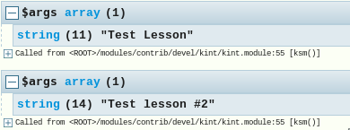
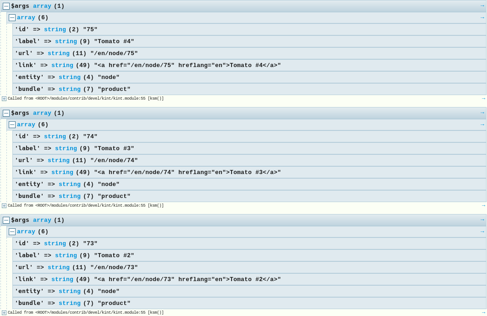
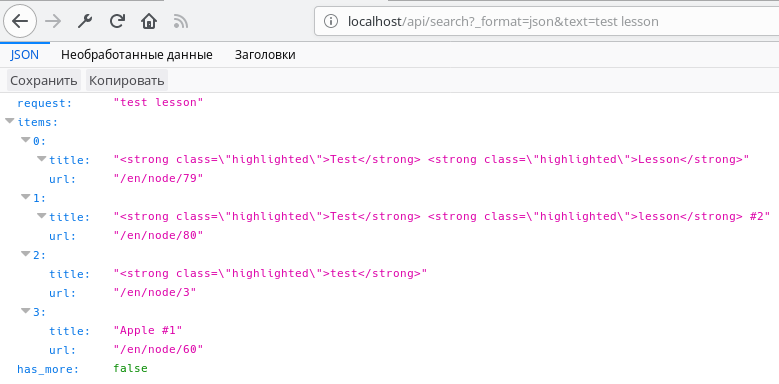

[Search API](https://www.drupal.org/project/search_api) мощный инструмент для
организации поиска на сайте, и уметь осуществлять поиск программно — очень
полезный опыт. Задачи, решаемые программным поиском, могут быть разные, но
потребность так или иначе со временем может появиться.

Програмный поиск с использованием Search API состоит из нескольких
самостоятельных частей самого модуля: поисковый индекс, режим парсинга и
менеджера запросов. А также вытекающий из этого результат поиска.

**Поисковый индекс (Search API Index)** — это сущность-конфигурация, которая
хранит информацию о поисковых индексах. Это то, что вы настраиваете в админке
Search API. Нужные нам методы:

- `load()`: Загружает сущность индекса по его машинному имени. Так Search API
  будет знать куда осуществлять поиск.
- `query()`: Создает и возвращает инстанс `SearchApiQuery` для выполнения в
  данный индекс.

**Режим парсинга (Parse Mode)** — это плагины, которые отвечаю за то, как текст
переданный для поиска будет обрабатываться. Для поиска создается инстанц
плагина, того типа парсинга, который будет использоваться при поиске и
передается в поисковый запрос. В нем всего один полезный для нас метод:

- `setConjunction()`: Данный метод может принимать `'AND'` и `'OR'`. По
  умолчанию, если не устаноивить, он будет использовать `'AND'`. Этот параметр
  определяет то, как полученные ключи для поиска, при помощи выбранного вами
  плагина Parse Mode, будут обрабатываться. При `'AND'` — все ключи должны
  присутствовать в материале который ищем, `'OR'` — любой из ключей, один или
  более. Не все плагины режимов парсинга поддерживают смену данного значения. У
  некоторых он может быть прописан жестко прямо в плагине.

По умолчанию в ядре имеются следующие Parse Mode плагины:

- `phrase`: Поиск по определенной строке. Разбивает строку на массив ключей и
  принудительно используется `setConjunction()` = `'AND'`. Это значит, что будет
  искать те материалы, где все слова из поисковой строки присутствуют.
- `direct`: Аналогично `phrase`, только совершенно не обрабатывает строку, из-за
  чего могут быть проблемы с синтаксисом при запросе. На стандартном Database
  Server он ничем не будет отличаться от `phrase`, он также имеет
  условие `'AND'` для ключей. Но вот, допустим, если подключить Solr или что-то
  ещё серьезное, то данный способ будет учитывать синтаксис поискового движка и
  его особенности и не будет очищать запрос от них.
- `terms`: Разбивает строку на ключи и ищет их вхождение. Здесь уже
  работает `setConjunction()` и вы сами определяете как поиск будет производить
  поиск по ключам.

Если вы вдруг захотите узнать все доступные плагины для парсинга на проекте,
выполните данный код:

```php
/** @var \Drupal\search_api\ParseMode\ParseModePluginManager $parse_mode */
$parse_mode_manager = \Drupal::service('plugin.manager.search_api.parse_mode');
$parse_modes = $parse_mode_manager->getDefinitions();
```

**Поисковый запрос (Search API Query)** — объект для построения запроса к
поисковому индексу. Вот этот объект нам уже намного интереснее, так как он в
итоге делает всю основную работу, и методов, полезных нам, тут будет больше
всего (они не все, а лишь самые полезные).

- `setParseMode()`: Устанавливает режим парсинга для данного запроса. В него
  нужно передать инстанс нужного плагина Parse Mode.
- `keys()`: Указывается строка для поиска, она и будет использована для парсинга
  при помощи указанного плагина Parse Mode. Вы также можете не указывать Parse
  Mode и передать в данный метод массив с нужными для вас ключами и способм
  поиска по ним. Массив должен содержать `#conjunction` элемент со значением.
  Пример: `['lorem', 'ipsum', '#conjunction' => 'AND']`. Таким образом, можно
  сделать указание Parse Mode необязательным или игнорировать его. Можно также
  передать `NULL`, в таком случае будут выбраны вообще данные из поискового
  индекса.
- `setFulltextFields()`: Позволяет указать массив из имен полей (поискового
  индекса) типа fulltext по которым будет происходить поиск. Этот метод
  позволяет задать ограничение на данные поля, если метод вызвать пустым, или не
  вызвать вообще, то в таком случае поиск будет производиться по всем fulltext
  полям из индекса.
- `range()`: Позволяет огарничить результаты как и обычный запрос. Передается
  смещение и лимит результатов относительно смещения.
- `addTag()`: Позволяет задать тег запросу. Это полезно чтобы другие модули
  могли вмешиваться в альтер запроса и точно определять что это он. Для этого
  есть `hook_search_api_query_TAG_alter()`. Можно задавать несколько тегов, для
  этого данный метод нужно вызывать несколько раз.
- `setProcessingLevel()`: Позволяет задать уровень обработки запроса. Может
  иметь следующие значения:
  - `QueryInterface::PROCESSING_NONE` — никакие обработчики настроенные у
    поискового индекса не будут вызваны.
  - `QueryInterface::PROCESSING_BASIC` — будут вызваны только базовые
    процессинги, например фасеты, проверка правописания.
  - `QueryInterface::PROCESSING_FULL` (по умолчанию) — будут вызваны все
    обработчики установленные и настроенные для индекса.
- `sort()`: Позволяет задать сортировку по полю из индекса и его
  направление: `QueryInterface::SORT_ASC` (по возрастанию, по умолчанию)
  и `QueryInterface::SORT_DESC` (по убыванию). Также в качестве имени поля можно
  передать одно из специальных зачений Search API:
  - `search_api_relevance`: Сортировка по релевантности. Этот вариант сортировки
    учитывает boost настройки для полей и от процессоров, а также то, насколько
    точно вхождение. В данном случае, чем больше релевантность, тем точнее
    результат совпадает с тем что ищут, поэтому тут лучше всего использовать
    сортировку по убыванию. Иными словами, сортировка по score.
  - `search_api_datasource`: Сортировка по источнику данных.
  - `search_api_language`: Сортировка по языку.
  - `search_api_id`: Сортировка по ID.
- `setLanguages()`: Массив из ID языков по которым нужно искать. По умолчанию
  поиск производится по всем языкам на сайте. Если сайт мультиязычный, про это
  не стоит забывать.
- `setOption($name, $value)`: Позволяет задать опции для поиска. Из коробки
  имеются следующие опции:
  - `offest`: Позициая первого результата относительно всех результатов.
  - `limit`: Максимальное кол-во результатов которое может вернуть поиск. -1 —
    не ограничений.
  - `skip result count`:  Если передать `TRUE`, то подсчет кол-ва найденых
    результатов всего, не зависимот от ограничений, не будет определяться.
  - `search_api_access_account`: В качестве значение можно передать объект
    пользователя для которого будет выполняться поиск. Таким образом, если
    используются процессоры которые могут выдавать разные результаты для разных
    ролей\пользователей, это поможет достичь результатов.
  - `search_api_bypass_access`: Если передать `TRUE`, все ограничения по
    доступам в индексе будут проигнорированы. Будьте аккуратны, так как таким
    образом могут утечь важные данные, если такие имеются в индексе.
  - `search_api_retrieved_properties`: Массив из данных, которые должны быть в
    результате. По умолчанию там возвращаются все поля добавленные вами в
    индекс + объект оригинальной сущности, которой пренадлежит результат. Этот
    массив позволяет ограничить данные результатов.
    Например `['entity:node' => ['_object' => 'entity:node/_object'], '' => ['search_api_url' => 'search_api_url']]`.
    _У меня почему-то не удалось завести это, он всегда отдает все данные,
    возможно это только для поисковых серверов типа Solr._
- `addCondition()`: Добавляет условие по полю. Всё как и у обычных запросов,
  поле, значение, операция сравнения. Помимо названий полей из индекса также
  поддерживаются специальные поля которые рассмотрены выше в `sort()` методе.
- `addConditionGroup()`: Как и у штатных запросов, позволяет добавлять группы
  условий. `new \Drupal\search_api\Query\ConditionGroup()`.
- `execute()`: Выполняет запроса и возвращает результаты.

Если вы знакомы с PDO запросов от Drupal, вам многие вещу уже должны быть
знакомы. Есть свои особвенности типа спец. полей, но в целом, всё аналогично.

**Набор результатов (Result Set)** — объект содержащий результаты выполнения
запроса (поиска). Нам интересны лишь два метода:

- `getResultItems()`: Возвращает массив результатов состоящий
  из `Drupal\search_api\Item\Item` объектов.
- `getResultCount()`: Возвращает кол-во результатов по вашему запросу итого.
  Например, если указали `range(0,5)`, вы получите 5 результатов `Item`, но по
  факту там может быть 100 материалов, этот метод вернет это кол-во.

**Элемент результат поиска (Item)** — объект, содержащий информацию о конкретном
результате поиска. Полезные методы:

- `getOriginalObject()`: При вызове вернет
  объект `Drupal\Core\Entity\Plugin\DataType\EntityAdapter` где есть вся
  необходимая информация из сущности, и сама сущность `->getValue()`. Если все
  нужные вам поля для формирования результата поиска имеются в виде полей
  индекса, обращайтесь к ним напрямую.
- `getField()`: Возвращает инстанс `Drupal\search_api\Item\Field` поля. Для того
  чтобы получить итоговое значение нужно вызывать
  дальше: `$result_item->getField('title')->getValues()`.
- `getFields()`: Аналогично методу выше, только возвращает все доступные поля.
- `getScore()`: Возвращает какой результат был присвоен данному результату.
- `checkAccess()`: Передав в него объект пользователя, проверяет, имеет ли
  пользователь доступ к данному результату поиска.
- `getExtraData()`: Позволяет получить доступ к дополнительным данным
  результата. Они могут добавляться различными процессорами. Чтобы узнать что
  там есть, проще всего вызывать `getAllExtraData()` и посмотреть. Например,
  если у вас включена подсветка найденного вхождения, то оно будет доступно по
  ключу `highlighted_fields`.

Это самые ходовые методы по каждому из разделу, остальные уже можно поглубже
откапать в конкретных объектах.

Время посмотреть на примеры. _Далее по коду подразумевается что модуль имеет
название dummy._

_У меня нет особо конкретных примеров и долго было бы под каждый подбирать
индексы и данные, поэтому примеры в данном материале будут почти все "голые", я
думаю не составит труда понять как их использовать под свои нужды, так как код
можно вызывать откуда угодно._

## Пример №1 — Минимальный набор для поиска

Для того чтобы просто вызывать поиск в индексе, достаточно выполнить следующий
код.

```php
/** @var \Drupal\search_api\IndexInterface $index_storage */
$index_storage = \Drupal::entityTypeManager()->getStorage('search_api_index');
$index = $index_storage->load('global');
/** @var \Drupal\search_api\Plugin\views\query\SearchApiQuery $query */
$search_query = $index->query();
$search_query->keys(['Test', 'lesson', '#conjunction' => 'AND'])
  ->range(0, 5)
  ->sort('search_api_relevance', \Drupal\search_api\Query\QueryInterface::SORT_DESC);
/** @var \Drupal\search_api\Query\ResultSetInterface $search_result */
$search_result = $search_query->execute();
foreach ($search_result->getResultItems() as $result_item) {
  $fields = $result_item->getFields();
  // Do something.
}
```

В коде выше:

- Мы получаем хранилище сущности `search_api_index` в `$index_storage`.
- Загружаем индекс по машинному имени `global` (так называется мой индекс по
  которому я хочу осуществлять поиск).
- Получаем объект `SearchApiQuery` под загруженный индекс.
- Формируем запрос к поисковому индексу:
  - Устанавливаем поиск по словам Test и lesson, со связью AND. Это значит, мы
    ищем все материалы где есть слова Test и lesson.
  - Мы указываем что нам нужно первые 5 результатов.
  - Задаем сортировку по релевантности и убыванию. Так как релевантные будут
    иметь больший вес, следовательно надо сортировать от большего к меньшему.
- Выполняем запрос и полученные результаты записываем в `$search_result`.
- Идем циклом, записываем все поля результата в поле и ничего с этим не делаем.

Даже `range()` и `sort()` тут не обязательны. Можно обойтись вообще
одним `keys()`.

Если, например, после присвоения полей
сделать `ksm($result_item->getField('title')->getValues()[0]);`, то он выведет
через devel заголовки найденых материалов.



## Пример №2 — Плагин парсинга

В этот раз мы добавим парсинг плагин к примеру выше и доработаем код:

```php
/** @var \Drupal\search_api\IndexInterface $index_storage */
$index_storage = \Drupal::entityTypeManager()->getStorage('search_api_index');
$index = $index_storage->load('global');
/** @var \Drupal\search_api\ParseMode\ParseModePluginManager $parse_mode */
$parse_mode_manager = \Drupal::service('plugin.manager.search_api.parse_mode');
/** @var \Drupal\search_api\ParseMode\ParseModeInterface $parse_mode */
$parse_mode = $parse_mode_manager->createInstance('terms');
$parse_mode->setConjunction('AND');
/** @var \Drupal\search_api\Plugin\views\query\SearchApiQuery $query */
$search_query = $index->query();
$search_query->setParseMode($parse_mode)
  ->keys('Tomato 4')
  ->range(0, 5)
  ->sort('nid', \Drupal\search_api\Query\QueryInterface::SORT_DESC);
/** @var \Drupal\search_api\Query\ResultSetInterface $search_result */
$search_result = $search_query->execute();
foreach ($search_result->getResultItems() as $result_item) {
  /** @var \Drupal\Core\Entity\EntityInterface $entity */
  $entity = $result_item->getOriginalObject()->getValue();
  $result = [
    'id' => $entity->id(),
    'label' => $entity->label(),
    'url' => $entity->toUrl()->toString(),
    'link' => $entity->toLink()->toString()->getGeneratedLink(),
    'entity' => $entity->getEntityTypeId(),
    'bundle' => $entity->bundle(),
  ];
  ksm($result);
}
```

В этом примере, мы дополнительно:

- Загрузили менеджер плагинов Parse Mode в `$parse_mode_manager`.
- Создали инстанс плагина `terms` и задали ему связь для ключей AND.
- В запросе мы передаем инстанс нашего режима парсинга.
- Сортировку поменяли на `nid`.
- В результатах мы теперь получаем оригинальный объект сущности откуда данные, а
  из сущности получаем некоторую информацию, которой нет в индексе (не добавлены
  поля для них). Как я упоминал, эти поля проще добавить в индекс и вызывать из
  результата - при больших объемах должно быть шустрее. Также, будьте аккуратны
  с таким подходом - в 8-ке один индекс может иметь несколько типов сущностей в
  себе, и следовательно, методы, которые вызываются, должны быть написаны с умом
  и понимаем этого и обернуты в доп условия, если вызываются значение из полей
  или ещё какие-то данные не присущие всем сущностям.



Как видно, сортировка работае корректно, данные выводятся и вытаскиваются из
сущности.

## Пример №3 — REST ресурс с поиском

_На момент написания статьи, для корректной работы программного поиска в REST
Resource плагинах требуется патчить search
api - [ишью с проблемой и патчем](https://www.drupal.org/project/search_api/issues/2958811)._

В этом примере мы напишем рест ресурс `GET /api/search` который будет возвращать
5 результатов по запросу, каждый результат будет содержать URL из индекса, а
также заголовок с подсветкой найденных результатов в нём. Для подсветки придется
включить процессор плагин Highlight (_подсветка работает только на fulltext
поля. Если хотите чтобы заголовок также парсился - надо добавить поле в индекс
для поля заголовка типа fulltext, у меня в примере это будет `title_fulltext`_).

Вам также потребуется REST UI для активации ресурса. Для более детальной
информации о коде и примере в целом обращайтесь к
материалу - [создание REST Resource Plugin](/blog/165).

```php {"header":"src/Plugin/rest/resource/GlobalSearchResource.php"}
<?php

namespace Drupal\dummy\Plugin\rest\resource;

use Drupal\rest\Plugin\ResourceBase;
use Drupal\rest\ResourceResponse;

/**
 * Global search index REST resource.
 *
 * @RestResource (
 *   id = "dummy_global_search",
 *   label = @Translation("Global search"),
 *   uri_paths = {
 *     "canonical" = "/api/search",
 *   }
 * )
 */
class GlobalSearchResource extends ResourceBase {

  /**
   * Responds to GET requests.
   */
  public function get() {
    $text = \Drupal::request()->query->get('text');
    $results = [
      'request' => $text,
      'items' => [],
      'has_more' => FALSE,
    ];

    /** @var \Drupal\search_api\IndexInterface $index_storage */
    $index_storage = \Drupal::entityTypeManager()
      ->getStorage('search_api_index');
    $index = $index_storage->load('global');
    /** @var \Drupal\search_api\ParseMode\ParseModePluginManager $parse_mode */
    $parse_mode_manager = \Drupal::service('plugin.manager.search_api.parse_mode');
    /** @var \Drupal\search_api\ParseMode\ParseModeInterface $parse_mode */
    $parse_mode = $parse_mode_manager->createInstance('terms');
    $parse_mode->setConjunction('OR');
    /** @var \Drupal\search_api\Plugin\views\query\SearchApiQuery $query */
    $search_query = $index->query();
    $search_query->setParseMode($parse_mode)
      ->keys($text)
      ->range(0, 5)
      ->sort('search_api_relevance', \Drupal\search_api\Query\QueryInterface::SORT_DESC);
    /** @var \Drupal\search_api\Query\ResultSetInterface $search_result */
    $search_result = $search_query->execute();
    foreach ($search_result->getResultItems() as $result_item) {
      $highlighted = $result_item->getExtraData('highlighted_fields', []);
      if (!empty($highlighted['title_fulltext'])) {
        $title = $highlighted['title_fulltext'][0];
      }
      else {
        $title = $result_item->getField('title')->getValues()[0];
      }

      $results['items'][] = [
        'title' => $title,
        'url' => $result_item->getField('url')->getValues()[0],
      ];
    }

    if ($search_result->getResultCount() > 5) {
      $results['has_mode'] = TRUE;
    }

    $cache = [
      '#cache' => [
        'context' => ['url'],
      ],
    ];
    return (new ResourceResponse($results))->addCacheableDependency($cache);
  }

}
```

Не забываем включить ресурс, и можно
тестить `/api/search?_format=json&text=test lesson`:



Также обратите внимание что результат будет кэшироваться под каждый запрос
отдельно. Таким образом со временем этот ресурс будет работать нереально шустро,
но и БД разрастется от большго кол-ва поиска. Поэтому, если что, скорректируйте
кэширование под себя. Если не знакомы с кэшированием,
почитайте [статью про кэширование в 8-ке](/blog/155).

_На момент публикации, поиск по блогу работает именно так, в связке с Vue.js._
