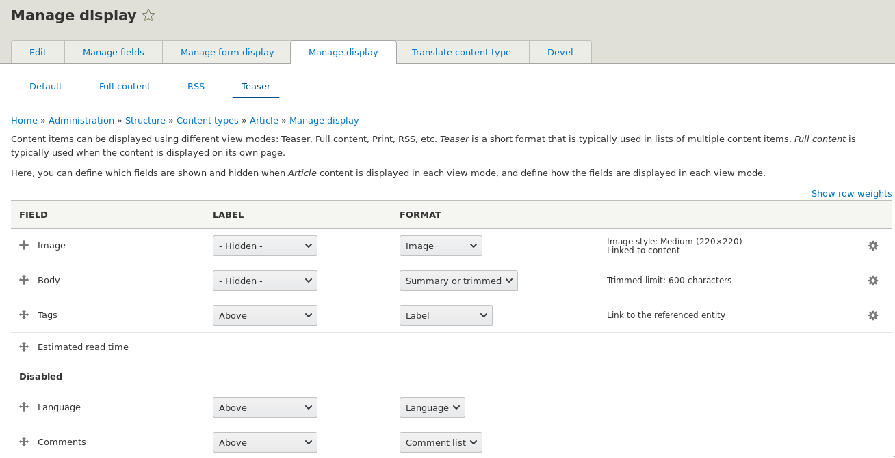
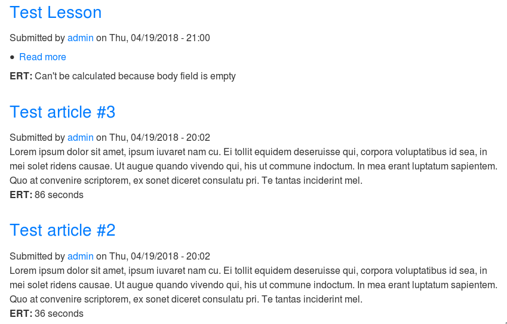
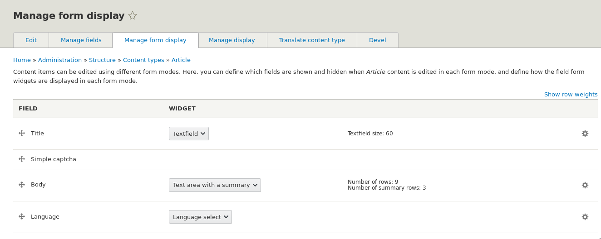
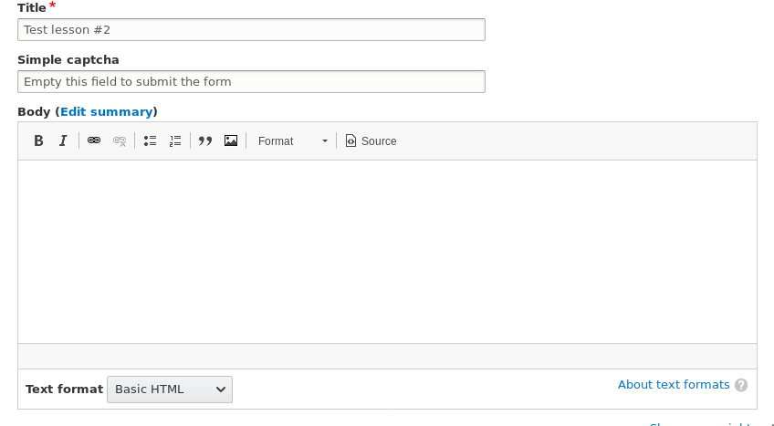
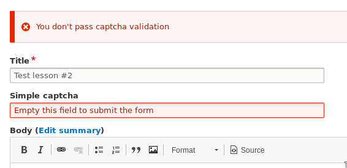

Псевдо-поля (pseudo-fields), они же экстра-поля (extra-fields) — поля, которые
позволяют выводить какие-либо данные внутри сущности или добавлять что-то к
форме сущности.

Если вы знакомы с Display Suite, то уже, наверное, в курсе как создавать его
поля [в Drupal 7][drupal-7-how-to-create-display-suite-field] и 
[в Drupal 8][drupal-8-how-to-create-display-suite-plugin]. Это примерно то же самое, только в
ядре.

Данные поля можно использовать, когда нужно выводить какие-то повторяющиеся
данные в сущности, контролировать видимость, и при этом не залезая в
темплейт\препроцесс для того чтобы добавить данные. Также их можно добавлять в
форму редактирования и добавления сущностей.

Псевдо-поля это очень простая штука, она состоит из двух
хуков `hook_entity_extra_field_info()` и `hook_ENTITY_TYPE_view()`
или `hook_form_alter()`, в зависимости от задачи. Они отличаются от обычных
полей тем, что они: не хранят никаких данных в БД (ну если вы сами это как-то не
опишите), не имеют виджетов и форматеров как [типы полей][drupal-8-how-to-create-custom-field-type].

Если проводить аналогию с DS полям, то можно разделить на плюсы и минусы
псевдо-полей перед DS полями:

- **Плюсы псевдо-полей**
  - Не требует никаких модулей, прямо в ядре, два хука и всё готово.
  - Работает вообще везде. Не требует никаких дополнительных телодвижений и
    интеграций. Это к тому, что DS поля для своей работы требуют активации DS
    лейаута.
  - Можно спокойно контролировать их вес и отображение из админки, либо через
    темплейт где они используются.
  - Просты в понимании.
  - Могут интегрироваться в формы редактирования и добавления материала.
- **Минусы псевдо-полей перед DS полями**
  - Не имеют никаких настроек и форматтеров. Как зададите вывод в хуках, так и
    будет выводиться. Если нужны настройки, придется их выносить за пределы форм
    управления отображением или использовать в связке
    с [Third Party Settings](http://xandeadx.ru/blog/drupal/927). Собственно,
    это единственное и главное отличие от DS полей.

Если вам нужно сделать простое поле для вывода данных, но вы не хотите тащить в
зависимость Display Suite, подрубать его лейауты и править весь проект под него,
то проще всего использовать псевдо-поля. Также, они вам подойдут если вы хотите
добавить какой-то кастомный элемент в форму редактирования и добавления
материала, но чтобы его положение и отображение регулировалось из админки (
например хотите модуль сделать универсальным без жесткой привязки в коде).

Немножко остановимся на `hook_entity_extra_field_info()` и перейдем к примеру.
Данный хук должен возвщарать массив псевдо-полей. Массив многоуровневый и
состоит из следующих уровней: тип сущности, бандл, контекст псевдо поля (
либо `form`, либо `display`). Далее идет ключ, который станет названием для
нашего псевдо-поля, он должен содержать в себе массив, который может иметь
следующие значения:

- `label`: Метка для людей. Видно на странице управления отображением где это
  поле доступно.
- `description`: Короткое описание поля.
- `weight`: Вес поля в отображении по умолчанию, до того пока его перетащит
  пользователеь куда ему нужно.
- `visible`: (опционально) Отображение поля по умолчанию. Значение по
  умолчанию `TRUE`.
- `edit`: (опционально) Строка содержащая разметку (обычно ссылку), для того
  чтобы перенаправить пользователя на страницу с настройки, если такие нужны.
  Только для контекста `form`.
- `delete`: (опционально) Строка содержащая разметку (обычно ссылку), для того
  чтобы перенаправить пользователя на страницу удаления. Только для
  контекста `form`.

_На счёт `edit` и `delete` не совсем понятно как их заводить. В документации
числятся, но не работают._ ?‍

## Пример

_Далее по тексту подразумевается что модуль где пишется код имеет название
dummy._

Мы добавим два поля во всех типы содержимого сущности `node`. Одно поле будет
для формы, в виде простой капчи, не пройдя которую, материал нельзя будет
опубликовать или же отредактировать, другое поле будет для отображения
материала, и оно будет выводить приблизительное время прочтения материала в
секундах на основе поля `body`.

Так как всё решается на хуках, то весь код мы пишем прямо в dummy.module файле.

```php {"header":"dummy.module"}
<?php

/**
 * @file
 * Main file for hooks and custom functions.
 */

use Drupal\Core\Entity\Display\EntityViewDisplayInterface;
use Drupal\Core\Entity\Entity\EntityFormDisplay;
use Drupal\Core\Entity\EntityInterface;
use Drupal\Core\Form\FormStateInterface;
use Drupal\node\Entity\NodeType;

/**
 * Implements hook_entity_extra_field_info().
 */
function dummy_entity_extra_field_info() {
  $extra = [];

  foreach (NodeType::loadMultiple() as $bundle) {
    $extra['node'][$bundle->id()]['display']['estimated_read_time'] = [
      'label' => t('Estimated read time'),
      'description' => t('Calculate estimated read time'),
      'weight' => 100,
      'visible' => FALSE,
    ];

    $extra['node'][$bundle->id()]['form']['simple_captcha'] = [
      'label' => t('Simple captcha'),
      'weight' => 100,
    ];
  }

  return $extra;
}

/**
 * Implements hook_ENTITY_TYPE_view().
 */
function dummy_node_view(array &$build, EntityInterface $entity, EntityViewDisplayInterface $display, $view_mode) {
  if ($display->getComponent('estimated_read_time') && $entity->hasField('body')) {
    if ($entity->body->isEmpty()) {
      $value = t("Can't be calculated because body field is empty");
    }
    else {
      // Average word per minute reading for all languages.
      // @see https://en.wikipedia.org/wiki/Words_per_minute
      $word_per_minute = 184;
      $word_count = str_word_count(strip_tags($entity->body->value));
      $estimated_read_time = floor(($word_count / $word_per_minute) * 60);
      $value = \Drupal::translation()
        ->formatPlural($estimated_read_time, '1 second', '@count seconds');
    }

    $build['estimated_read_time'] = [
      '#type' => 'markup',
      '#markup' => "<p><strong>ERT:</strong> {$value}</p>",
    ];
  }
}

/**
 * Implements hook_form_BASE_FORM_ID_alter().
 */
function dummy_form_node_form_alter(&$form, FormStateInterface $form_state, $form_id) {
  $storage = $form_state->getStorage();
  if (!empty($storage['form_display']) && $storage['form_display'] instanceof EntityFormDisplay) {
    $form_display = $storage['form_display'];
    if ($component = $form_display->getComponent('simple_captcha')) {
      $form['simple_captcha'] = [
        '#type' => 'textfield',
        '#title' => t('Simple captcha'),
        '#default_value' => t('Empty this field to submit the form'),
        '#weight' => $component['weight'],
      ];
      $form['#validate'][] = '_dummy_simple_captcha_validation';
    }
  }
}

/**
 * Validation for captcha.
 */
function _dummy_simple_captcha_validation(&$form, FormStateInterface $form_state) {
  if (strlen($form_state->getValue('simple_captcha'))) {
    $form_state->setError($form['simple_captcha'], t("You don't pass captcha validation"));
  }
}
```

Первая функция у нас `dummy_entity_extra_field_info()`, которая является
хуком `hook_entity_extra_field_info()`. В ней мы получаем все типы (бандлы)
сущности `node` и добавляем в массив псевдо-полей по 2 поля на каждый тип
материала. Одно поле мы добавляем в `display` и дали ему
имя `estimated_read_time`. Оно будет, дальше по коду, выводить приблизительное
время прочтения материала. Мы также отключили его по умолчанию, таким образом
оно будет изначально отключено у всех материалов, пока мы сами не включим там
где оно нужно. Второе поле для формы с именем `simple_captcha`. Данное
псевдо-поле будет появляться во всех формах по умоланию, если не будет отключено
в настройках формы сущности.

Далее идёт `dummy_node_view()`, что является хуком `hook_ENTITY_TYPE_view()`. Мы
подключаемся только к нодам, и на этапе подготовки отображения материала,
пытаемся получить компонент `estimated_read_time`, что по-факту, является нашим
псевдо-полем. Если оно нашлось, значит оно было вынесено в область отображения в
настройках материала для данного типа материала и варианта просмотра. Тут же мы
проверяем, есть ли у материала поле `body`, так как вся логика основана на нём,
если его нет, мы ничего делать не будем. Если поле есть, мы проверяем, пустое ли
оно. Если пустое, выводим информацию об этом, если нет, считаем приблизительное
время на прочтение материала в секундах. После этого, мы добавляем наше "
псевдо-поле" к билду сущности в виде render array. Для примера мы взяли простой
маркап, на деле же, это может быть более сложная конструкция в пределах Render
API.

Первое поле уже готово, осталось добить поле для формы. Поэтому мы пишем
функцию `dummy_form_node_form_alter()`, которая является
хуком `hook_form_BASE_FORM_ID_alter()`. Мы подключаемся только к формам
сущности `node`, куда и добавляется наше псевдо-поле. В холостую прогонять нашу
логику по всем формам нет смысла. Тут мы получаем хранилище формы и проверяем,
есть ли там объект управления отображением форм сущностей. Если есть, мы как и
для поля отображения, пытаемся получить наш компонент (псевдо-поле) по его
названию `simple_captcha`, и если оно нашлось, мы добавляем в форму новое поле
используя самый обычный Form API, а также свой колбек для валидации формы.

Последней функцией у нас идет `_dummy_simple_captcha_validation`, которая будет
валидировать наше поле `simple_captcha`. И тут всё очень просто. Если строка в
поле добавленном нашим псевдо-полем пустая - мы ничего не будем делать и форма
отправится, если там есть данные, мы сообщим об ошибке и форма не отправится.

Для проверки первого поля, нужно зайти в любой тип материала и его настройки
отображения. Выбрать интересующий вас вариант отображения и вытащить псевдо-поле
в нужный регион.



После того как перенесли поле в нужное место в нужном варианте отображения,
можно зайти и проверить.



И аналогично со вторым полем. Только его положение и отображение настраивается в
настройках отображения формы.





Если попробовать отправить форму со значением, то сработает наша валидация.



Если с полями для форм ещё кейсы под вопросом, то вот для псевдо-полей для
вывода их в сущности можно насобирать прилично. Например: ссылки соц. сетей,
различные доп кнопки и вставка вьюсов. В общем область применения у псевдо-полей
для `display` куда шире и это будет самый популярный юз-кейс для данных "полей".

## Ссылки

- [Исходный код модуля с примером](example/dummy)

[drupal-7-how-to-create-display-suite-field]: ../../../../2016/03/29/drupal-7-how-to-create-display-suite-field/index.ru.md
[drupal-8-how-to-create-display-suite-plugin]: ../../../../2016/04/02/drupal-8-how-to-create-display-suite-plugin/index.ru.md
[drupal-8-how-to-create-custom-field-type]: ../../../../2016/09/06/drupal-8-how-to-create-custom-field-type/index.ru.md
