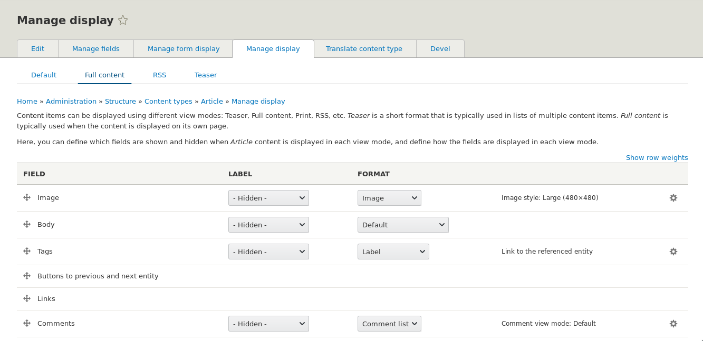
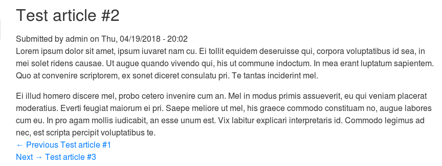
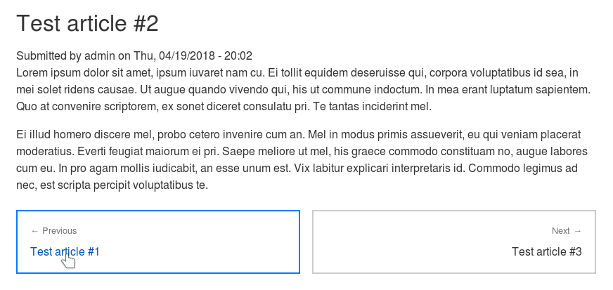

Кнопки на предыдущий и следующий материалы достаточно популярны в наши дни, особенно на сайтах с упором на контент. Периодически такие вопросы всплывают в друпал чатиках, а иногда просят и клиенты. 

Давайте пробежимся по очень простой реализации и сделаем кнопки на предыдущий и следующий материал. Также данный материал будет как пример использования [hook_theme()](/blog/151) и [псевдо-полей](/blog/177) вместе. _Далее по тексту подразумевается что код пишется в модуле dummy._

**Первым делом** нам потребуется сделать свой theme hook с использованием `hook_theme()`, который будет генерировать разметку для предыдущего и следующего материала. В нём и будет вся логика, как и 90% всего материала. Для начала регистрируем наш theme hook, назовем его `dummy_previous_next`:

```php {"header":"dummy.module"}
/**
 * Implements hook_theme().
 */
function dummy_theme($existing, $type, $theme, $path) {
  $file = 'dummy.theme.inc';
  return [
    'dummy_previous_next' => [
      'variables' => [
        'entity' => NULL,
      ],
      'file' => $file,
    ],
  ];
}
```

Итак, наш theme hook `dummy_previous_next` объявлен. Мы указали что нам будет требоваться переменная `entity`. В неё мы будем передавать объект сущности для которой нужно сделать кнопки. Наш код будет максимально универсальным и не привязан к какой-либо сущности или материалу, вы сможете пользоваться им в любом месте. И для того чтобы оно так работало, нам нужно написать логику. А логика для theme hook пишется в обработчиках (preprocess). Препроцессор мы вынесем в файл **dummy.theme.inc**, который мы указываем в массиве объявляющий наш theme hook.

? Напоминаю что препроцессоры для собственных theme hook имеют вид `template_preprocess_HOOK()`. Объявляем такой препроцессор в файле **dummy.theme.inc**:

```php {"header":"dummy.theme.inc"}
<?php

/**
 * @file
 * Contains preprocess functions for custom theme hooks.
 */

/**
 * Implements template_preprocess_HOOK().
 */
function template_preprocess_dummy_previous_next(&$variables) {
  /** @var \Drupal\Core\Entity\EntityInterface $entity */
  $entity = $variables['entity'];
  $variables['next'] = [];
  $variables['previous'] = [];

  // Trying to find next entity ID.
  $next_entity_id = \Drupal::entityQuery($entity->getEntityTypeId())
    ->condition('type', $entity->bundle())
    ->condition('created', $entity->getCreatedTime(), '>')
    ->range(0, 1)
    ->sort('created', 'ASC')
    ->execute();
  if (!empty($next_entity_id)) {
    $next_entity = \Drupal::entityTypeManager()
      ->getStorage($entity->getEntityTypeId())
      ->load(reset($next_entity_id));
    $variables['next']['label'] = $next_entity->label();
    $variables['next']['url'] = $next_entity->toUrl()->toString(TRUE)->getGeneratedUrl();
  }

  // Trying to find previous entity ID.
  $previous_entity_id = \Drupal::entityQuery($entity->getEntityTypeId())
    ->condition('type', $entity->bundle())
    ->condition('created', $entity->getCreatedTime(), '<')
    ->range(0, 1)
    ->sort('created', 'DESC')
    ->execute();
  if (!empty($previous_entity_id)) {
    $previous_entity = \Drupal::entityTypeManager()
      ->getStorage($entity->getEntityTypeId())
      ->load(reset($previous_entity_id));
    $variables['previous']['label'] = $previous_entity->label();
    $variables['previous']['url'] = $previous_entity->toUrl()->toString(TRUE)->getGeneratedUrl();
  }
}
```

А теперь пройдемся по порядку:

- Обратите внимание, что вместо `HOOK` в название функции мы подставили название нашего theme hook, который мы хотим обрабатывать.
- Первым делом в обработчике мы записываем переменную переданную в наш theme hook в локальную переменную `$entity`, для удобства обращения.
- Далее мы задаем две новые переменные для нашего будущего темплейта кнопок: `next` и `previous`. Это будут массивы с данными, по умолчанию пустые.
- Затем, мы пытаемся получить ID следующего материала. Это получается следующим образом — мы выполняем запрос в пределах типа сущности (`$entity->getEntityTypeId()`) которая была передана нашему theme hook. Также мы добавляем условие чтобы подтип (bundle `$entity->bundle()`) сущности был аналогичный тому, что у текущей сущности. Это значит, если вы передадите сущность `node` с подтипом `news`, он будет искать материал в пределах новостей, и если у вас есть ещё `page` и `blog`, они не будут учитываться. Затем, указываем что дата создания материала должна быть больше текущей — так мы определяем что материал следующий, так как опубликован позже текущего. Далее, ограничиваем кол-во результатов до одного, сортируем результаты по возрастанию — таким образом, если после текущего материала вышло 2 новых, то мы получим тот что был опубликован сразу после текущего, ведь у более позднего (свежего) дата создания будет больше.
- Если ID нашелся, мы загружаем сущность следующего материала.
- Из материала мы добавляем в наш массив для `next` заголовок материала и URL на него.
- Далее мы проделываем аналогично для предыдущего материала. Отличие лишь в том, что дата создания должна быть меньше текущего материала, а сортировать результаты нужно по убыванию.

В результате данного обработчика будет формироваться два массива, каждый из которых будет в переменной `next` и `previous` соответственно. Если ссылки на следующий или предыдущий материал нет, то массив останется пустым.

Далее нам нужно **объявить и описать темплейт**, который будет готовить разметку для наших кнопок на основе этих двух массивов. Мы не указали определенный темплейт, поэтому название его будет идентично нашему theme hook, а Drupal будет искать его в templates папке модуля.

```twig {"header":"templates/dummy-previous-next.html.twig"}
<div class="previous-next">
  <div class="previous-next__previous">
    
      <a href="{{ previous.url }}" class="previous-next__link previous-next__link--previous">
        <span>← {{ 'Previous'|t }}</span>
        {{ previous.label }}
      </a>
    
  </div>
  <div class="previous-next__next">
    
      <a href="{{ next.url }}" class="previous-next__link previous-next__link--next">
        <span>{{ 'Next'|t }} →</span>
        {{ next.label }}
      </a>
    
  </div>
</div>
```

В темплейте ме объявляем всю разметку. Мы проверяем пустые ли переменные `next` и `previous` (Twig возвращает `FALSE` если массив пустой), и если нет, выводим url и заголовок сущности.

? Обратите внимание что условия на кнопки сделаны внутри их основных обёрток. Это сделано нарошно, чтобы в CSS при помощи флексбоксов эти элементы могли занимать свою область даже будучи пустыми. Это необходимо, когда ссылка на предыдущий материал отсутствует (слева), а ссылка на следующий присутствует (справа), и чтобы при этом ссылка на следующий не прыгала на место предыдущего. ?

Theme hook полностью готов, им можно пользоваться в любом месте. Но мы добавим его вызов в качестве псевдо-поля, чтобы можно было цеплять к материалам из админки и управлять его положением и видимостью. Мы добавим соответствующее псевдо-поле только для сущности `node`, как пример.

**Для добавления псевдо-поля** нам нужно будет объявить два хука: `hook_entity_extra_field_info()` и `hook_ENTITY_TYPE_view()`. Оба они объявляются в **dummy.module**.

```php {"header":"dummy.module"}
use Drupal\Core\Entity\Display\EntityViewDisplayInterface;
use Drupal\Core\Entity\EntityInterface;
use Drupal\node\Entity\NodeType;

/**
 * Implements hook_entity_extra_field_info().
 */
function dummy_entity_extra_field_info() {
  $extra = [];
  foreach (NodeType::loadMultiple() as $bundle) {
    $extra['node'][$bundle->id()]['display']['previous_next'] = [
      'label' => t("Buttons to previous and next entity"),
      'weight' => 100,
      'visible' => FALSE,
    ];
  }
  return $extra;
}

/**
 * Implements hook_ENTITY_TYPE_view().
 */
function dummy_node_view(array &$build, EntityInterface $entity, EntityViewDisplayInterface $display, $view_mode) {
  if ($display->getComponent('previous_next')) {
    $build['previous_next'] = [
      '#theme' => 'dummy_previous_next',
      '#entity' => $entity,
    ];
  }
}
```

Как можете заметить, мы добавляем в `$build` сущности наш render array с вызовом нашего theme hook и передачей ему текущей сущности, для которой это псевдо-поле готовится. Таким образом, нам нет нужды заботиться о текущей сущности и её получении.

После чего включаем модуль, если включен, сбрасываем кэш и заходим в любой тип материала `node`, и в управлении отображением включаете данное псевдо-поле перетаскивая его в любой активный регион, так как по умолчанию оно будет отключено.



Заходим на страницу и смотрим результат!



А дальше дело за малым, немного стилей, например таких:

```scss
.previous-next {
  display: flex;
  flex-flow: wrap;

  &__previous {
    flex: 0 1 49%;
  }

  &__next {
    flex: 0 1 49%;
    margin-left: auto;
  }

  &__link {
    display: block;
    border: 2px solid #CCC;
    padding: 18px;
    height: 100%;
    color: #333;

    &:hover {
      border-color: #007bff;
    }

    span {
      display: block;
      margin-bottom: gap();
      font-size: 80%;
      color: #757575;
    }

    &--next {
      text-align: right;
    }
  }
}
```

И вуаля!



Вот у нас и готовы универсальные кнопочки на предыдущий и следующий материал для всех типов сущностей. ?
