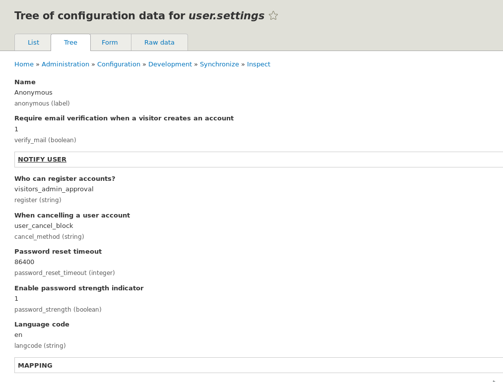
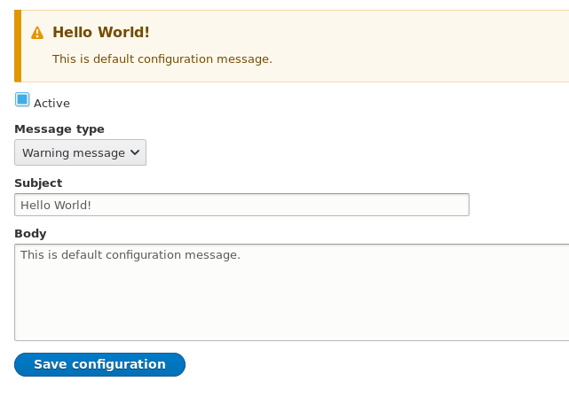
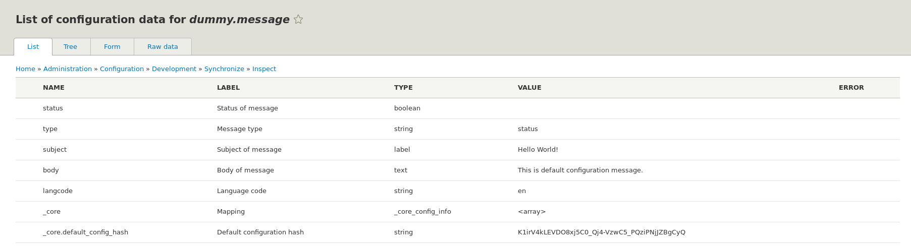
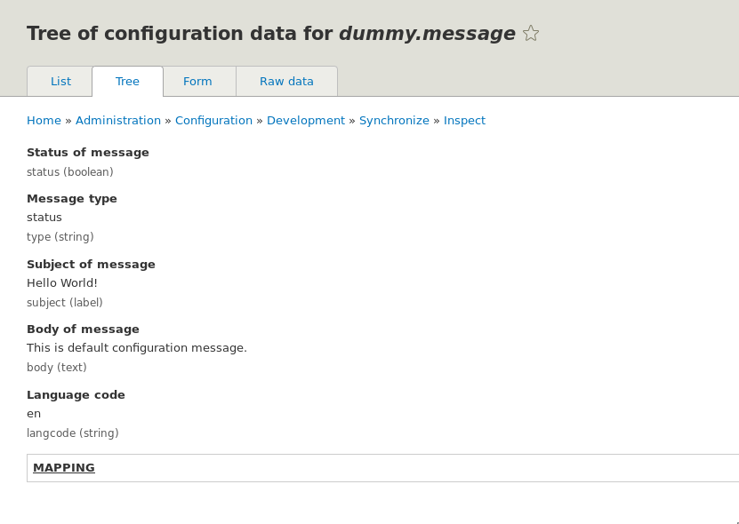
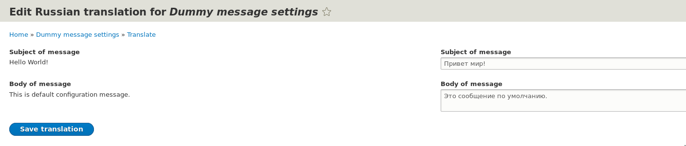
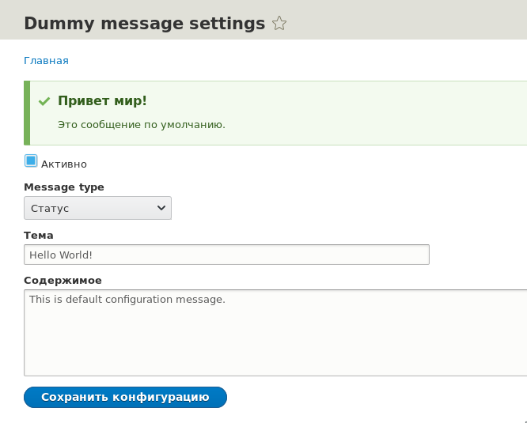

Конфигурации в Drupal 8 являются неотъемлимой частью системы. Вы можете
создавать собственные конфигурации, править, экспортировать и импортировать уже
существующие. Это не требует особо никаких действий.

Если вы решили создать свои конфигурации, например, для своего модуля, то это
тоже не требует особо никаких телодвижений. Но есть такая вещь, как *
*Configuration Schema**, которая позволяет объявлять схему ваших конфигураций,
примерно так, как это работает с БД. Вы можете опускать данную часть при работе
с конфигами, но вы теряете некоторые возможности, порой, крайней критические. *
*Желательно объявлять схему для всех своих конфигураций**.

Есть
отличная [шпаргалка](https://www.drupal.org/files/ConfigSchemaCheatSheet1.5.pdf)
и можете даже не тратить время на прочтение статьи и быстро пробежаться глазами.
Если там будут возникать вопросы или трудности, вот уже тогда можно будет
прочитать и дальше.

**Для чего нужны схемы** конфигураций:

- Самая важная причина — они позволяют делать вашу конфигурацию мультиязычной (
  читай: переводимой). На основе этих схем будут генерироваться формы для
  переводов ваших конфигураций. Например, при помощи данной особенности работает
  перевод для текста модуля FZ152.
- Также схема позволяет описать, какое значение, какого типа, и в случае ввода
  некорректных данных они будут автоматически сконвертированы в нужный тип для
  конфигурации. Таким образом, не получиться записать строку, там где ожидается
  булевое значение конфигурацией, что также спасает от дальнейших ошибок из-за
  некорректных данных.
- Позволяет понимать как работают те или иные конфигурации, в особенности крайне
  крупные и зависимые от других. Куча ключей в дефолтном конфигурационном файле
  может совершенно ни о чем не говорить, конфигурационная схема позволяет четко
  определить что и как ожидает конфиг конкретного типа.

Если вы собрались писать свои схемы конфигураций, рекомендую поставить
модуль [Configuration inspector](https://www.drupal.org/project/config_inspector).
Он добавляет интерфейс, который позволяет просматривать конфигурации, типы их
данных, какие есть значения, дерево конфигурации, сырые значения и генерирует
форму, чтобы проверить как друпал понимает эти данные. Он позволит вам увидеть
ошибки в схемах, и более наглядно посмотреть как видит её друпал.



## Структура scheme файла

Схема файлы сами являются конфигурациями описываемые на YAML. Они находятся в
config дериктории модуля, который описывает схему конфигураций, только в
дополнительной папке schema (config/schema). Если вы с модулем поставляете
конфиги по умолчанию, то вы их создаете в config/install или config/optional,
так что всё очень похоже.

Название файла схем имеет следующий формат: `[NAME].schema.yml` (вы можете
делать по файлу на каждый свой конфиг, или собрать всё в одном файле, это как
вам удобнее). Обычно вместо `[NAME]` подставляется название модуля.

Внутри данного файла описывается структура(ы) для конфигураций данного же
модуля. Например, выдернем **tour.schema.yml** из модуля tour, что в ядре (
можете прочитать про [Tour API][drupal-8-tour-api] отдельно):

```yaml
# Schema for the configuration files of the Tour module.

tour.tour.*:
  type: config_entity
  label: 'Tour settings'
  mapping:
    id:
      type: string
      label: 'ID'
    label:
      type: label
      label: 'Label'
    module:
      type: string
      label: 'Providing module'
    routes:
      type: sequence
      label: 'Route settings'
      sequence:
        type: route
        label: 'Route'
    tips:
      type: sequence
      label: 'Tips'
      sequence:
        type: tour.tip.[plugin]
        label: 'Tour tip'

tour.tip:
  type: mapping
  label: 'Tour tip'
  mapping:
    id:
      type: string
      label: 'ID'
    plugin:
      type: string
      label: 'Plugin'
    label:
      type: label
      label: 'Label'
    weight:
      type: integer
      label: 'Weight'
    location:
      type: string
      label: 'Location'
    attributes:
      type: sequence
      label: 'Attributes'
      sequence:
        type: string
        label: 'Attribute'

tour.tip.text:
  type: tour.tip
  label: 'Textual tour tip'
  mapping:
    body:
      type: text
      label: 'Body'
```

Конфиг хоть и большой, но достаточно комплексный и охватывает многие аспекты
схем.

Туры по сайту при помощи Tour API объявляются через конфиг сущности. Поэтому, не
удивительно что у этих конфигураций есть собственная схема описывающая что и как
хранить.

Первые ключи в конфиг схемах — это названия конфигураций к которым они относятся
или просто какая-то структура, которая будет в дальнейшем использовать внутри
других. Если вы не читали про Tour API, то конфиги туров имеют следующий формат
для имени: `tour.tour.[TOUR_NAME].yml`. Так как каждый тур имеет
свой `TOUR_NAME`, а следовательно, и файл конфигурации, мы не можем написать
схему под каждый из них, поэтому в названиях конфигов схемы можно
использовать `*`. Таким образом `tour.tour.*` охватывает **все** конфигурации
формата `tour.tour.[TOUR_NAME]`.

Далее уже описываются вложенные данные конфигурации, их типы и т.д.

Если забегать наперёд, то описание `tour.tour.*` охватывает все конфигурации для
туров. Внутри этих конфигураций есть `tips`, что является множественным
значением. А тип получается при помощи `tour.tip.[plugin]`. Данный тип всегда (
из коробки) будет превращаться в `tour.tip.text` (почему и как ниже), который в
свою очередь, повторно использует тип `tour.tip`. Это такая вот вложенная
схема: `tour.tour.*` > `tour.tip.text` > `tour.tip`.

## Свойства

Внутри конфигурации идёт описание всех данных внутри конфигурации с
использованием свойств:

- `type`: Тип конфигурации или данных.
- `label`: Метка для значения конфигурации.
- `translatable`: Булевое значение, определяющее может ли данное значение
  конфигурации быть переводимым или нет. _Не все типы могут быть переводимыми,
  например, Boolean не может быть переведен, с другой стороны как некоторые,
  переводимые по умолчанию: text, label и date_format._
- `translation context`: Строка являющаяся контекстом для перевода. Всё как с
  обычными переводами и `t()`.
- `nullable`: Булевое значение определяющее, может ли данное значение
  отсутствовать. По умолчанию (`false`) все значения требуются и не могут быть
  пустыми.
- `class`: Класс отвечающий за реализацию парсинга. Используется только при
  объявлении своих базовых типов данных, это мы затрагивать не будем.
- `langcode`: Для того чтобы конфигурация была переводимой, необходимо явно
  указывать данное значение.
- Специфичные значения для определенных типов:
  - `mapping`: Может использоваться не только с `type` = `mapping`, но и с
    другими. Позволяет задать вложенную структуру ключ-значение по принципу
    ассоциативных массивов. _Ключи известны._
  - `sequence`: Аналогично `mapping`, тоже может быть использовать с другими
    типами, не обязательно с одноименным и больше похож на обычный массив с
    индексами. _Ключи неизвестны/не важны._

Если вернуться к примеру выше, то там видно, что все конфигурации
формата `tour.tour.*` - являются конфигурационными сущностями, `mapping` сразу в
нём же, указывает какие вложенные значения может иметь конфиг: `id`  с лейблом
ID и типом `string`, метка, с одноименными типами и меткой, `module (string)`,
который хранит название модуля которому принадлежит конфиг, `routes (sequence)`
в котором будет массив из путей на которым будет работать тур, каждый элемент
которого, должен быть типа `route` и `tips (sequence)` - это подсказки, которые
тоже идут в виде массива но уже типа `tour.tip.[plugin]` — который объявлен чуть
ниже и мы рассмотрим такую конструкцию чуть позже.

## Типы конфигураций и их значений

Из коробки уже объявлены все базовые типы, при необходимости, можно объявлять
свои. Пройдемся по тем что есть в ядре (core.data_types.schema.yml):

- `undefined`: Позволяет указать что данный тип не определен. Не имеет никакого
  смысла указывать данный тип явно. Проще данное значение просто не описывать
  так как оно не несет в себе смысла.
- `ignore`: Используется когда тип данных определить невозможно. При этом, не
  рекомендуется использовать данный тип, а лучше объявить свои структуры\типы и
  ссылаться на них.
- `boolean`
- `email` (= `string`, тут больше о семантике)
- `integer`
- `timestamp`
- `float`
- `string`
- `uri` (= `string`)
- `mapping` — простое соответствие ключ-значение (где элементы имеют свои типы).
  Похоже на ассоциативные массивы. Как упоминалось выше: массив где ключи
  известны;
- `sequence` — это почти тоже самое что и `mapping`, только отличие в том, что
  это подразумевает последовательность. Иными словами, если `mapping` имеет
  жесткую структуру дерева указанную в нем, то `sequence` может иметь несколько
  вложенных данных определенного формата. Похоже на обычные массивы. Где ключ -
  какое-то число, а уже значение имеет определенную структуру. Как упоминалось
  выше: массив, где ключи неизвестны и значений может быть множество.;
- `label`: (= `string`) Имеет свойство `translatable: true`;
- `path`: Внутренний путь для Drupal, также просто типа `string`;
- `text`: Аналогично `label`, только подразумевает большой объем текста (
  textfield). Имеет свойство `translatable: true`;
- `date_format`: Аналогично `label`, но также установлен
  контекст `translation context: 'PHP date format'`;
- `config_entity` — для конфиг сущностей, как ясно из названия;
- `config_object` — для общих и глобальных конфигураций (сам по себе является
  обычным `mapping` объявляенный как тип конфиг схемы);
- `color_hex` (= `string`)

В общем случае для самого первого уровня объявления конфигураций обычно
используется либо `config_entity` или `config_object`, а для всех внутренних
данных конфигурации прочие типы. Config entity - для конфигурационных сущностей,
а Config object для всех прочих конфигураций на сайте.

`config_object` также добавляет `langcode`, что позволяет сделать конфигурацию
мультиязычной, попутно он добавляет `default_config_hash` для хранения хэша
конфигурации.

## Повторное использование типов данных

Это уже было упомянуто выше, например так работает `config_object` — это просто
объявленная схема, которая является типом `mapping`, указывает что у него
есть `langcode` и `_core`, `_core` в свою очередь ссылается
на `_core_config_info`, а `_core_config_info`
добавляет `default_config_hash` (`string`).

Возможно уже стало ясно, что мы можем объявить свои "типы" на лету через
конфиги. Так объявлены многие типы указанные выше,
например `label`, `path`, `text`. Если значения для вашего типа не требуют
какой-то специальной обработки в PHP для конвертации из одного типа в другой, и
могут опираться на базовые типа `string`, `boolean`, `integer` и так далее, то
свои типы проще, лучше и быстрее объявлять прямо в схеме аналогичным образом.

Например в ядре есть такое объявление в **core.data_types.schema.yml**:

```yaml
# Mail text with subject and body parts.
mail:
  type: mapping
  label: 'Mail'
  mapping:
    subject:
      type: label
      label: 'Subject'
    body:
      type: text
      label: 'Body'
```

Наипростейшая схема которая объявлена для того чтобы её можно было повторно
использовать в дальнейшем. Можно это называть как тип `mail`. Сам `mail`
является типом `mapping` и имеет вложенные ключи `subject` типа `label` и `body`
типа `text`.

Если вы хотите сделать конфиг, например, `my_config.mail` у которого должны
быть `subject` и `body`, вам не нужно описывать это заново, вы можете сослаться
на уже описанный:

```yaml
my_config:
  type: config_object
  label: 'My configuration'
  mail:
    type: mail
```

Без повторного использования, выглядела бы эта схема следующим образом:

```yaml
my_config:
  type: config_object
  label: 'My configuration'
  mail:
    type: mapping
    label: 'Mail'
    mapping:
      subject:
        type: label
        label: 'Subject'
      body:
        type: text
        label: 'Body'
```

## Динамически ссылки

Одну динамическую ссылку можно увидеть уже в самом первом
примере: `type: tour.tip.[plugin]`.

Всего их есть три типа:

- `[type]`: Позволяет ссылаться данные из конфига. Вместо `type` можно
  подставлять значение (ключ) откуда возьмутся значения. Если опираться на
  пример с Tour и `type: tour.tip.[plugin]`. То тип будет сформирован на основе
  конфигурации тура из ключа `plugin`, который будет находиться внутри
  последовательности (массива). Если посмотреть на объявление туров, то там
  видно, что `plugin` для подсказки из коробки может быть только
  типа `plugin: text`. Таким образом, строка `type: tour.tip.[plugin]`
  превращается в `type: tour.tip.text`. А это точное совпадение
  с `tour.tip.text` в самом низу **tour.schema.yml**, что является повторным
  использованием данных. По сути, данная динамическая ссылка нужна для разбиение
  на различные типы и повторное использование.
- `[%key]`: Позволяет получить ключ.
- `[%parent]`: Позволяет сослаться на родителя. Можно использовать даже
  так `[%parent.%parent.type]`.

Как правило, они используются для формирования корректного типа данных для
каждого элемента `sequence`. Поэтому они опираются на ключи, значения или же
родительские данные относительно самой последовательности.

По данным особенностям рекомендую ещё раз обратиться
к [шпаргалке](https://www.drupal.org/files/ConfigSchemaCheatSheet1.5.pdf). Там
это визуально продемонстрировано.

## Включение переводов для конфигураций

Конфигурации, как упоминалось выше, могут быть переводимы. Возможно, вам
потребуется включить для этого модуль Configuration Translation из ядра, если он
ещё не включен. Иначе конфигурации не будут переводимыми ни при каких условиях.

Для того чтобы ваши конфигурации стали переводимыми, в конфиге должно быть
значение `langcode`, в котором будет храниться язык перевода, а также данные
с `translatable: true`. Это также, уже описывалось выше. Но этого будет
недостаточно, помимо этого, надо также явно указать что конфигурации
определенного типа являются переводимыми.

Для того чтобы ваши конфигурации появились в интерфейсе на перевод, необходимо в
корне модуля создать файл `[MODULENAME].config_translation.yml` примерно
следующего содержания:

```yaml
my_configuration_name:
  title: 'My config settings'
  base_route_name: my_route_to_config_form
  names:
    - my_config.first
    - my_config.second
```

- `my_configuration_name` для конфиг сущностей должен соответствовать названию
  сущности, для обычных конфигов название конфигурации. Оно не обязательно
  должно быть одноименным переводимой конфигурации, главное чтобы было
  уникальным.
  - `title`: Это имя, показываемое на странице переводов конфигураций
  - `base_route_name`: Название роута для которого будет прикреплен интерфейс
    перевода. Может быть обычной страницей, так и конфиг формой.
  - `names`: (опционально) Название конфигураций для которых нужно включить
    переводы.
  - `weight`: (опционально) Вес, по умолчанию 20.
  - `list_controller`: (опционально) Название класса который будет отвечать за
    генерацию списка конфигураций. _Скорее всего, это для генерации `names`
    через класс, если кто в курсе, поделитесь опытом. В ядре вообще ничего по
    этому нет. Что самое странное, данный параметр даже не используется
    в `ConfigNamesMapper`, что по сути, делает его не рабочим и похоже что это
    вырезали и забыли потереть документацию в исходнике. ?_

При таком объявлении не получится сделать динамическую генерацию для конфигов.
Если вам это требуется, или вы хотите поправить данные, для этого есть два
хука: `hook_config_translation_info()` и `hook_config_translation_info_alter()`.

## Стандарты схема файлов

У данных файлов даже есть свои небольшие стандарты:

- Очень желательно добавлять комментарий для каких конфигураций(ии) данная
  схема.
- Избегать ненужных и бессмысленных комментариев.
- Использовать одинарные кавычки для строковых значений.
- Всегда использовать одинарные кавычки для label, даже если там одно слово.
- Для типов и ключей не использовать кавычки. По умолчанию они всегда строки, не
  допускающие пробелов.
- Целые числа (`integer`) также оборачиваются в одинарные кавычки так как
  конвертируются в строку для хранения.
- Метки можно объявлять не всем типам данным, но те что будут переводимы -
  обязательно.

## API

С программной стороны есть API, который позволяет получить данные схемы по их
конфигам:

```php
// Получение схемы конфигурации system.maintenance
$definition = \Drupal::service('config.typed')->getDefinition('system.maintenance');
// Получение схемы конфигурации для конфигурации image.style.medium и его эффекта.
// Так вы получите схему для image.effect.*, а не image.style.*.
$effects = \Drupal::service('config.typed')->get('image.style.medium')->get('effects.bddf0d06-42f9-4c75-a700-a33cafa25ea0.data')->getDataDefinition();
// Также можно получить ещё больше информации.
// Получаем все эффекты для стиля изображений medium.
$effects = \Drupal::service('config.typed')->get('image.style.medium')->get('effects');
// Получаем ключ (uuid) первого эффекта, так как это массив.
$first_uuid = key($effects->getValue());
// Получаем данные первого эффекта
$data = $effects->get($first_uuid)->get('data');
// Получает тип и значение для ширины эффекта. Тип возьмется из схемы, а значение из
// акутального конфиг файла.
$data->get('width')->getPluginId();
$data->get('width')->getValue();
```

## Пример

_Далее по тексту подразумевается что модуль в котором пишется код - dummy._

На самом деле не так всё сложно, как может показаться! Поэтому лучше испробовать
это на практике, так как это будет намного понятнее и проще.

В качестве примера мы создадим форму, которая будет редактировать и сохранять
конфигурацию под названием `dummy.message`. Эта конфигурация будет содержать
информацию о "сообщении", а затем оно будет выводиться на всех страницах сайта.

Конфигурация будет иметь следующие значения:

- `status`: В нём мы будем хранить, выводить данное сообщение или нет.
- `type`: Тип сообщения.
- `subject`: Заголовок сообщения.
- `body`: Тело сообщения.

А также будет переводимой.

Начнём, мы с объявления схемы конфигурации. Для этого создаем
файл `dummy.schema.yml` в config/schema и описываем:

```yaml {"header":"config/schema/dummy.schema.yml"}
# Configuration schema for dummy message.

dummy.message:
  type: config_object
  label: 'Dummy message'
  mapping:
    status:
      type: boolean
      label: 'Status of message'
    type:
      type: string
      label: 'Message type'
    subject:
      type: label
      label: 'Subject of message'
    body:
      type: text
      label: 'Body of message'
```

_Обратите внимание, мы не указываем нигде langcode в схеме, так как данное
значение объявлено в `config_object` и нам незачем дублировать его. Об этом
объяснялось в разделе про повторное использование данных._

Ничего сложного тут нет. Обращу лишь внимание на то, что `subject` и `body` у
нас таких типов, что они по умолчанию будут переводимы. В связке с `langcode`,
который добавит `config_object`, а также `label` и `text` оно станет
переводимым, явно мы это нигде не указываем, так как нет необходимости.

Мы также предоставим конфигурацию по умолчанию вместе с модулем.

```yaml {"header":"config/install/dummy.message.yml"}
status: false
type: 'status'
subject: 'Hello World!'
body: 'This is default configuration message.'
langcode: 'en'
```

Также, чтобы конфигурация стала переводимой, недостаточно указать `langcode`
и `translatable`, нужно явно указать что данная конфигурация переводима. Для
этого в корне модуля создается файл `[MODULENAME].config_translation.yml`:

```yaml {"header":"dummy.config_translation.yml"}
dummy.message:
  title: 'Dummy message settings'
  base_route_name: dummy.message.settings
  names:
    - dummy.message
```

Схема есть, конфиг есть, теперь время
объявить [конфигурационную форму][drupal-8-form-api] для того чтобы всё это править.

```php {"header":"src/Form/DummyMessageSettings.php"}
<?php

namespace Drupal\dummy\Form;

use Drupal\Core\Form\ConfigFormBase;
use Drupal\Core\Form\FormStateInterface;

/**
 * Configure dummy settings for this site.
 */
class DummyMessageSettings extends ConfigFormBase {

  /**
   * {@inheritdoc}
   */
  public function getFormId() {
    return 'dummy_message_settings';
  }

  /**
   * {@inheritdoc}
   */
  protected function getEditableConfigNames() {
    return ['dummy.message'];
  }

  /**
   * {@inheritdoc}
   */
  public function buildForm(array $form, FormStateInterface $form_state) {
    $form['status'] = [
      '#type' => 'checkbox',
      '#title' => $this->t('Active'),
      '#default_value' => $this->config('dummy.message')->get('status'),
    ];

    $form['type'] = [
      '#type' => 'select',
      '#title' => $this->t('Message type'),
      '#default_value' => $this->config('dummy.message')->get('type'),
      '#options' => [
        'status' => $this->t('Status message'),
        'warning' => $this->t('Warning message'),
        'error' => $this->t('Error message'),
      ],
    ];

    $form['subject'] = [
      '#type' => 'textfield',
      '#title' => $this->t('Subject'),
      '#default_value' => $this->config('dummy.message')->get('subject'),
    ];

    $form['body'] = [
      '#type' => 'textarea',
      '#title' => $this->t('Body'),
      '#default_value' => $this->config('dummy.message')->get('body'),
    ];

    return parent::buildForm($form, $form_state);
  }

  /**
   * {@inheritdoc}
   */
  public function validateForm(array &$form, FormStateInterface $form_state) {
    parent::validateForm($form, $form_state);
  }

  /**
   * {@inheritdoc}
   */
  public function submitForm(array &$form, FormStateInterface $form_state) {
    $this->config('dummy.message')
      ->set('status', $form_state->getValue('status'))
      ->set('type', $form_state->getValue('type'))
      ->set('subject', $form_state->getValue('subject'))
      ->set('body', $form_state->getValue('body'))
      ->save();
    parent::submitForm($form, $form_state);
  }

}
```

Добавляем роут для данной формы

```yaml {"header":"dummy.routing.yml"}
dummy.message.settings:
  path: '/dummy-message'
  defaults:
    _title: 'Dummy message settings'
    _form: 'Drupal\dummy\Form\DummyMessageSettings'
  requirements:
    _permission: 'administer site configuration'
```

И описываем вывод сообщения через препроцессор страницы.

```php {"header":"dummy.module"}
<?php

/**
 * @file
 * File for custom hooks and functions.
 */

use Drupal\Core\Render\Markup;

/**
 * Implements hook_preprocess_HOOK().
 */
function dummy_preprocess_page(&$variables) {
  $dummy_message = \Drupal::config('dummy.message');
  if ($dummy_message->get('status')) {
    $subject = $dummy_message->get('subject');
    $body = $dummy_message->get('body');
    $message = Markup::create("<h3>{$subject}</h3> {$body}");

    switch ($dummy_message->get('type')) {
      case 'status':
        \Drupal::messenger()->addStatus($message);
        break;

      case 'warning':
        \Drupal::messenger()->addWarning($message);
        break;

      case 'error':
        \Drupal::messenger()->addError($message);
        break;
    }
  }
}
```

Если включить модуль, то наши сообщения не будут появляться, так как в конфиге
по умолчанию они отключены. Мы можем перейти на `/dummy-message` и включить, а
также изменить какие нужно значения.



Если вы поставили Configuration inspector, то можно зайти на страницу
/admin/config/development/configuration/inspect и найти данную конфигурацию. И
посмотреть как видит её Drupal.





А если перейти в перевод конфигураций /admin/config/regional/config-translation,
то можно обнаружить на перевод нашу конфигурацию Dummy message settings.



Перейдя на русскую версию сайта, сообщение будет переведено!



## Ссылки

- [Исходный код модуля с примером](example/dummy)

[drupal-8-tour-api]: ../../../../2015/11/04/drupal-8-tour-api/index.ru.md
[drupal-8-form-api]: ../../../../2015/10/16/drupal-8-form-api/index.ru.md
