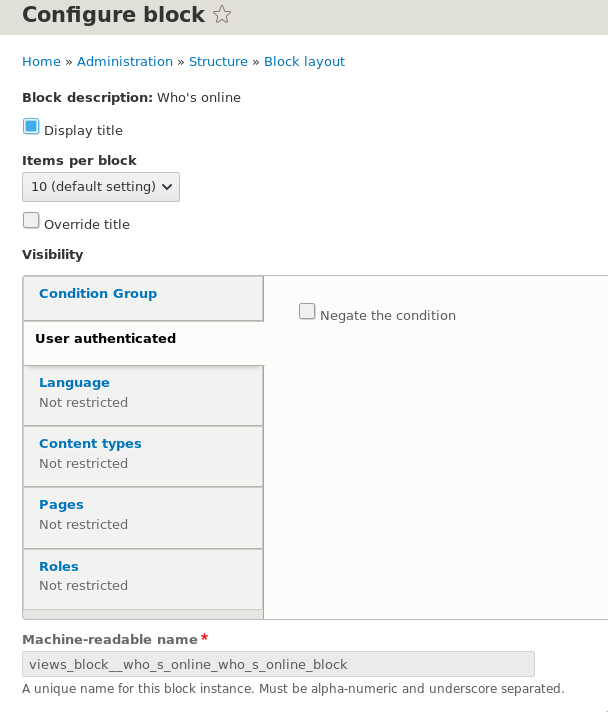
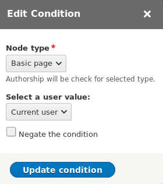

::: note [Материал обновлен для соответствия Drupal 8.7.0+]
В 8.7.0 аннотации "context" для ConditionPlugin теперь должны называться "
context_definitions". Смотрите соответствующее
[изменение](https://www.drupal.org/node/3016699).
:::

Текст материала и примерны обновлены соответствующе.

**Condition Plugin** — плагины, которые выполняют какие-либо проверки и
возвращают булевый результат. Иными словами, это унифицированный инструмент,
благодаря которому, можно описывать и переиспользовать различные условия.

**Когда использовать плагины, а когда достаточно `if`?** Заворачивать логику
каких-то булевых операций стоит тогда, когда данное условие будет использовано
множество раз, когда условие может иметь какие-то различные варианты поведения,
а также, когда условие должно быть доступно модулям. Если вы пишите какое-то
очень узкое условие, только для использования в своем коде, которое никак не
должно вылезать за его пределы, только там где сами вызвали, плагин теряет
смысл, в этом случае лучше использовать обычную функцию внутри модуля или метод
объекта где это требуется.

**В чем их преимущество?** Ведь можо завернуть условие в функцию, проще и
быстрее. Да, можно, но о функции не будут знать сторонние модули. Объявив
условие как плагин, оно будет обнаруживаться при помощи `ConditionManager`, и
любой желающий модуль сможет сможет использовать их в собственных целях. Также,
данные плагины могут иметь собственные настройки, форму для настройки, а также
контексты (аргументы) для передачи, что делает их очень гибкими и прозрачными
для понимания, при этом, доступными для всех, а не только вас и вашего кода.

Вы встречаетесь с данными плагинами на регулярной основе, хоть их всего ничего
поставляется с ядром.


Знакомая картинка? Это Condition плагины. И да, вы можете к ним обращаться из
своего кода, и вам не придется описывать соответствующую логику у себя в модуле,
достаточно будет вызвать конкретный Condition плагин, и всё, у вас абсолютно
идентичное поведение.

Возможно вы используете
модуль [Block Visibility Groups](https://www.drupal.org/project/block_visibility_groups).
Все условия, добавляемые для группы блоков — Condition Plugin. Написав его один
раз, он уже станет доступен сразу в двух местах, в обычных блоках, и в условиях
данного модуля. А таких модулей может быть множество, вы и сами можете написать
модуль, который будет базироваться на данных плагинах.

Также данные плагины доступны в
модуле [Snippet manager](https://www.drupal.org/project/snippet_manager), вы
можете создать из них переменную и пользоваться в своем шаблоне для условий.

Возможно данный тип плагина окажется полезен, когда вы пишите одни и те же
условия\проверки из проекта в проект, вы хотите это унифицировать, и завернуть в
отдельный модуль — отличное решение. И такие решения уже можно найти на
drupal.org: [Menu Condition](https://www.drupal.org/project/menu_condition), [Term Condition](https://www.drupal.org/project/term_condition), [Token Conditions](https://www.drupal.org/project/token_conditions) (
заброшен, лучше используйте как
пример), [Vocabulary Condition](https://github.com/md-systems/vocabulary_condition).

## API

_Если данный раздел вызывает некоторые трудности с пониманием как плагины
работают, рекомендую почитать [отдельную статью][drupal-8-how-to-create-custom-plugin-type]._

Первым делом рассмотрим как можно общаться с данными плагинами из кода. Для
обращения к плагинам всегда используется сервис-менеджер который позволяет их
загружать и создавать их экземпляры. Иногда может потребоваться узанть, какие
вообще Condition плагины доступны на сайте. Для этого достаточно вызвать метод
менеджера:

```php {"header":"Список всех доступных Condition Plugin"}
/** @var \Drupal\Core\Condition\ConditionManager $condition_manager */
$condition_manager = \Drupal::service('plugin.manager.condition');
ksm($condition_manager->getDefinitions());
```


Для того чтобы воспользоваться плагином(ами), необходимо создать экземпляр
плагина, и передать ему все что он просит или вам необходимо, а затем вызвать.

Несколько примеров на основе стандартных плагинов:

```php
/** @var \Drupal\Core\Condition\ConditionManager $condition_manager */
$condition_manager = \Drupal::service('plugin.manager.condition');

// Example #1.
// Checks for node type and user role.
$node_type_check = $condition_manager->createInstance('node_type');
$node_type_check->setConfig('bundles', ['article'])
  ->setContextValue('node', $node);
$user_role_check = $condition_manager->createInstance('user_role');
$user_role_check->setConfig('roles', ['administrator'])
  ->setContextValue('user', $user);

if ($node_type_check->execute() && $user_role_check->execute()) {
  // Do something.
}

// Example #2.
// Check if current path is not listed.
$pages = [
  '<front>',
  '/news',
  '/catalog/*',
];
$path_check = $condition_manager->createInstance('request_path');
$path_check->setConfig('pages', implode(PHP_EOL, $pages))
  ->setConfig('negate', TRUE);
if ($path_check->execute()) {
  \Drupal::messenger()->addStatus('This page is not listed.');
}
```

Второй пример, это вызов плагина, который используется в блоках (и других
местах) для управления видимостью на страницах. В данном случае мы установили
что результать должен быть обратным (`negate`), это значит, что плагин будет
возвращать `TRUE` на всех страницах кроме указанных.

Немного пробежимся по методам:

- `createInstance($plugin_id)`: Создает экземпляр указанного плагина.
- `setConfig($key, $value)`: Задает плагину его определенную настройку по ключу.
  Несколько настроек задается через повторный вызов метода.
- `setContextValue($name, $value)`: Задает значение контектста для плагина. У
  каких-то плагинов их может не быть, у каких-то может быть сразу несколько,
  также некоторые из них могут быть обязательными.
- `execute()`: Вызывает выполнение логики плагина и возвращает либо `TRUE`,
  либо `FALSE`.

Узнать о том, какие конфигурации и контексты принимает тот или иной плагин, и
как он ведет себя в определенных ситуациях, можно только изучив его исходник. Но
учитывая базовую задачу данных плагинов, они очень просты для понимания.

## Создание собственного Condition Plugin

_Для быстрого старта можно использовать `drush generate condition`._

**Плагин состоит из нескольких частей:**

- Аннотация **@Condition**.
- Объект, наследующий `ConditionPluginBase` и расположенный в *
  *src/Plugin/Condition**.
- Как минимум двух методов `evaluate()` и `summary()`.
- А также [Configuration Schema][d8-configuration-schema] для настроек плагина.

### Аннотации @Condition и @ContextDefinition

Аннотация **@Condition** обязательна для плагина, и описывает его.

Имеет следующие значения:

- **id**: Машинное имя плагина.
- **label**: Метка плагина.
- **context_definitions**: (опционально) Массив состоящий из ключа - названия
  контекста, и значения - аннотации **@ContextDefinition**.
- **category**: (опционально) Категория плагина, может быть использована для
  группировки условий в UI сторонними модулями.

Если вы хотите чтобы ваш плагин получал какие-то аргументы (контекст), то тут
придеться использовать дополнительную аннотацию **@ContextDefinition** для
каждого элемента контекста.

**@ContextDefinition** имеет следующие значения:

- **value**: Тип значения. Данный параметр передается просто как значение без
  ключа **value**. Особенность данного параметра в том, что данный тип должен
  быть зарегистрирован в друпале, иначе будет ошибка. Это всё относится к Typed
  Data API, и мы так глубоко не полезем, я лишь перечислю в общих чертах:

  - **Обычные типы
    **: `boolean`, `uri`, `list`, `float`, `string`, `any`, `binary`, `integer`, `language`, `email`, `timestamp`, `datetime_iso8601`.
  - **Сущности**: Для них ест два вида ключей, обычный `entity`, для любой
    сущности и `entity:NAME` для конкретного типа сущности,
    например `entity:node`.
  - **Поля**: Поля описываются по шаблону `field_item:FIELD_TYPE`,
    например `field_item:image`, `field_item:password`.
  - Также там есть прочие типы данных, включая те, что могли быть объявлены
    различными модулями. Для того чтобы просмотреть весь список доступных типов
    пользуйтесь `ksm(\Drupal::typedDataManager()->getDefinitions());`, либо
    ищите по кодовой базе все классы что наследуются от `DataDefinition`.

- **label**: (опционально) Метка для контекста. Будет использована в UI.
- **required**: (опционально) Булевое значение, является ли данный контекст
  обязательным или нет. По умолчанию `TRUE`.
- **multiple**: (опционально) Булевое значение, указывает, является ли данный
  контекст множественным значением. По умолчанию `FALSE`.
- **description**: (опционально) Описание контекста для UI.
- **default_value**: (опционально) Значение по умолчанию, если значение не было
  передано.
- **class**: (опционально) Объект типа `ContextDefinitionInterface` который
  будет заниматься обработкой контекста. По
  умолчанию `Drupal\Core\Plugin\Context\ContextDefinition`.

### Объект плагина

В минимальном наборе он выглядит так:

```php
<?php

namespace Drupal\my_module\Plugin\Condition;

use Drupal\Core\Condition\ConditionPluginBase;

/**
 * @Condition(
 *   id = "my_condition_plugin",
 *   label = @Translation("My condition plugin"),
 * )
 */
class MyConditionPlugin extends ConditionPluginBase {

  /**
   * {@inheritdoc}
   */
  public function evaluate() { }

  /**
   * {@inheritdoc}
   */
  public function summary() { }

}
```

И может иметь следующие **основные методы** (данные меоды вы, вероятнее всего,
будете переопределять):

- `buildConfigurationForm()`: Позволяет описать форму настройки для плагина.
  Очень желательно вызывать родительский метод от базового класса, так как он
  добавляет базовые конфигурации типа `negate` и `context_mapping`.
- `validateConfigurationForm()`: Валидация конфигурационной формы.
- `submitConfigurationForm()`: Обработчик конфигурационной формы. Также, если
  вызывали родительский метод для `buildConfigurationForm()`, то вызывайте и
  тут, так как он сохранит дефолтные настройки.
- `execute()`: Самый основной метод, в котором выполняется вся логика плагина,
  по итогу его выполнения он должен вернуть либо `TRUE`, либо `FALSE`.
- `summary()`: Задает сводку настроек для плагина.
- `defaultConfiguration()`: Возвращает массив с настройками по умолчанию.
  Аналогично `buildConfigurationForm()`, не забудьте вызвать родительский метод,
  чтобы подтянулись его значения по умолчанию.

А также второстепенные методы (они очень специфичны и для большинства случаев
хватает базовой реализации и переопределять их без острой необходимости не
нужно):

- `isNegated()`: Возвращает, инвертировано ли условие или нет.
- `getConfiguration()`: Возвращает массив со всеми настройками для текущего
  плагина.
- `setConfiguration()`: Устанавливает настройки для текущего плагина.
- `calculateDependencies()`: Позволяет задать зависимости для данного плагина.
  Как правило, это не требуется.
- `setExecutableManager()`: Позволяет задать новый менеджер на выполнение
  плагина. Лучше не переопределять без острой необходимости.

### Configuration Schema

Все конфигурации что идут с Condition Plugin должны быть обхявлены
в [configuration scheme][d8-configuration-schema]. _На самом деле работать будет
и без схемы, но какие могут всплыть проблемы — можно только гадать, поэтому,
лучше потратить минутку, объявить схему и спать спокойно._

Название схемы для плагинов имеет следующий формат
именования `condition.plugin.{plugin_id}`. Тип должен быть `condition.plugin`,
так подтянутся базовые настройки для конфигураций. А в `mapping` уже описываете
свои конфигурации. Стандартные `negate`, `context_mapping`, `id`, `uuid`
подтянутся уже от унаследованного типа. Если у вас нет никаких собственных
настроек, просто объявите с нужным названием, типом и добавьте лейбл.

Простенький пример:

```yaml
condition.plugin.my_condion_plugin:
  type: condition.plugin
  label: 'My condition plugin'
  mapping:
    my_custom_setting:
      type: sequence
      sequence:
        type: string
    another_custom_setting:
      type: string
      label: 'Another custom setting'
```

#### Замечание по поводу context_mapping

Condition Plugin по умолчанию имет конфигурацию `context_mapping`, которая
позволяет задать значение для контекста посредством серисов в
формате `@service_name:result_array_key`.

Это специальные сервисы, найти их можно по проекту используя поиск
по `name: 'context_provider'` или же по объектам
наследующих `ContextProviderInterface`.

В ядре имеются всего три таких сервиса, которые позволяют получить четыре
значения:

- `@node.node_route_context:node`: Нода из URL.
- `@user.current_user_context:current_user`: Текущий пользователь.
- `@language.current_language_context:language_interface`, `@language.current_language_context:language_content`:
  Язык интерфейса, или материала, соответственно.

Вы также можете создавать собственные контекстные провайдеры.

Это полезно знать, если вы решите писать какой-либо интерфейс поддерживающий
данные плагины. Ну или просто захотите добавить другое значение контекста для
интерфейса. В этой конфигурации хранятся какраз эти связи для дальнейшего вызова
Condition Plugin.

## Примеры

_Далее по тексту подразумевается что модуль имеет название dummy._

А теперь рассмотрим их на простых примерах.

### Пример №1

В данном примере мы создадим наипростейший плагин, который будет проверять,
авторизован ли текущий пользователь или нет. Так как это очень просто, плагин
будет ну очень минималистичен, и будет показывать самый простой способ
реализации плагина данного типа.

Начнем с объявления плагина. Для этого создаем **UserAuthenticated.php** по пути
**src/Plugin/Condition** и пишем всё что надо.

```php {"header":"src/Plugin/Condition/UserAuthenticated.php"}
<?php

namespace Drupal\dummy\Plugin\Condition;

use Drupal\Core\Condition\ConditionPluginBase;

/**
 * @Condition(
 *   id = "dummy_user_authenticated",
 *   label = @Translation("User authenticated"),
 * )
 */
class UserAuthenticated extends ConditionPluginBase {

  /**
   * {@inheritdoc}
   */
  public function evaluate() {
    return \Drupal::currentUser()->isAuthenticated();
  }

  /**
   * {@inheritdoc}
   */
  public function summary() {
    return 'This plugin has no settings.';
  }

}
```

- `summary()`: Метод обязательный, настроек никаких нет (не считая
  стандартного `negated`), так что сводку готовить смысла нет, и выводим что у
  плагина нет настроек.
- `evaluate()`: Тут происходит вся логика плагина. Мы получаем статус
  пользователя при помощи стандартного объекта `Drupal`, и сразу возвращаем его
  результат.

После чего нам нужно добавить схему конфигурации для стандартных настроек. Для
этого создадим файл **dummy.schema.yml** в **config/schema**.

```yaml {"header":"config/schema/dummy.schema.yml"}
condition.plugin.dummy_user_authenticated:
  type: condition.plugin
  label: 'User authenticated condition'
```

Всё, **плагин готов**!

Для того чтобы пользоваться им из кода, достаточно вызвать:

```php
/** @var \Drupal\Core\Condition\ConditionManager $condition_manager */
$condition_manager = \Drupal::service('plugin.manager.condition');
$user_authenticated_check = $condition_manager->createInstance('dummy_user_authenticated');
// If user authenticated.
if ($user_authenticated_check->execute()) {
  // Do something.
}

// If user is anonymous.
$user_authenticated_check->setConfig('negate', TRUE);
if ($user_authenticated_check->execute()) {
  // Do something.
}
```

Также, данный плагин сразу станет доступен в настройках всех блоков:



Сохранив настройки блока, плагин начнет работать. И блок будет показываться
только для авторизованых пользователей. Если поставить
галочку <abbr title="Обратить условие">Negate the condition</abbr>, то будет
показываться только для анонимов.

Если пользуетесь модулем Block Visibility Groups, то он также там станет
доступен.


А в Snippet Manager, например, можно задействовать вот так:


### Дополнение к примеру

Как вы уже заметили. Condition Plugin автоматически подцепился к другим условиям
блока, но возможно, вы не хотите чтобы он там был. Ведь с условием типа нашего,
выходит что теперь блоки будут показываться либо только авторизованым, либо
только анонимам. Это не есть хорошо.

На данный момент для этого есть [issue](https://www.drupal.org/node/2284687), но
когда он будет закрыт, и будет ли вообще, не ясно. Поэтому, если вы уверены что
ваше условие не подходит для блоков (работа условия по умолчанию может поломать
отображение уже имеющихся блоков, как это делает пример 1) и вы используете
стандартные условия для видимости блока (у Block Visbility Group таких проблем
нет, так как там условия добавляются раздельно, а не все сразу), то плагин надо
оттуда убирать. Для этого нужно альтернуть форму и удалить оттуда наш плагин:

```php {"header":"dummy.module"}
/**
 * Implements hook_form_FORM_ID_alter().
 */
function dummy_form_block_form_alter(&$form, \Drupal\Core\Form\FormStateInterface $form_state, $form_id) {
  unset($form['visibility']['dummy_user_authenticated']);
}
```

## Пример №2

В этом примере мы воспользуемся сразу и конфигурациями и контекстами. Для этого
мы сделаем плагин, который проверяет, есть ли у конкретного пользователя
материалы определенного типа в пределах сущности `node`.

Начнём с создания плагина с логикой:

```php {"header":"src/PluginCondition/UserHasNodeTypeContent.php"}
<?php

namespace Drupal\dummy\Plugin\Condition;

use Drupal\Core\Condition\ConditionPluginBase;
use Drupal\Core\Form\FormStateInterface;
use Drupal\node\Entity\NodeType;

/**
 * @Condition(
 *   id = "dummy_user_has_node_type_content",
 *   label = @Translation("User has node type content"),
 *   context_definitions = {
 *     "user" = @ContextDefinition("entity:user", label = @Translation("User"))
 *   }
 * )
 */
class UserHasNodeTypeContent extends ConditionPluginBase {

  /**
   * {@inheritdoc}
   */
  public function buildConfigurationForm(array $form, FormStateInterface $form_state) {
    $node_types = [];
    /** @var \Drupal\node\NodeTypeInterface $item */
    foreach (NodeType::loadMultiple() as $item) {
      $node_types[$item->id()] = $item->label();
    }

    $form['node_type'] = [
      '#type' => 'select',
      '#title' => $this->t('Node type'),
      '#default_value' => $this->configuration['node_type'],
      '#options' => $node_types,
      '#description' => $this->t('Authorship will be check for selected type.'),
      '#required' => TRUE,
    ];

    return parent::buildConfigurationForm($form, $form_state);
  }

  /**
   * {@inheritdoc}
   */
  public function submitConfigurationForm(array &$form, FormStateInterface $form_state) {
    $this->configuration['node_type'] = $form_state->getValue('node_type');
    parent::submitConfigurationForm($form, $form_state);
  }

  /**
   * {@inheritdoc}
   */
  public function defaultConfiguration() {
    return ['node_type' => ''] + parent::defaultConfiguration();
  }

  /**
   * {@inheritdoc}
   */
  public function evaluate() {
    // Default result if node_type config is not set.
    if (empty($this->configuration['node_type']) && !$this->isNegated()) {
      return TRUE;
    }

    $user = $this->getContextValue('user');
    $query = \Drupal::database()->select('node_field_data', 'n')
      ->condition('n.uid', $user->id())
      ->condition('n.type', $this->configuration['node_type']);
    $query->addField('n', 'nid');
    $result = $query->countQuery()->execute()->fetchField();
    return $result ? TRUE : FALSE;
  }

  /**
   * {@inheritdoc}
   */
  public function summary() {
    return $this->t('Checks if there is content of the "@node_type" from user.', [
      '@node_type' => $this->configuration['node_type'],
    ]);
  }

}
```

Пройдемся по порядку:

- Аннотация **@Condition** теперь содержит значение **context_definitions**. В
  нём мы указываем что наш плагин ожидает получение контекста под именем `user`
  типа `entity:user`. Так как больше мы ничего не указываем, это означает что он
  обязательный для работы условия.
- `buildConfigurationForm()` — Для данного плагина мы уже описываем свой метод с
  формой для настроек. Внутри него мы собираем все типы материалов, доступные на
  данный момент на сайте, объявляем селект и передаем в него этот выбор.
  Возвращаем мы результат при помощи вызова родительского метода, который
  добавит также галочку для `negate` и элемент формы для выбора контекста.
- `submitConfigurationForm()` — Получаем выбранное значение в нашем
  элементе `node_type` и сохраняем его в свойство с конфигурацией. После чего
  вызываем родительский метод, который сохранит что требуется ему. Обратите
  внимание, мы не описываем процесс сохранения конфигурации, мы просто их
  записываем должным образом в свойство `configuration`, а как сохранять эти
  настройки и куда, это уже забота того модуля, который вызывает данные формы и
  использует в дальнейшем эти значения. Например, стандартные блоки сами
  отвечают за сохранение этих настроек для конкретного блока, а Block Visibility
  Group для группы.
- `defaultConfiguration()` — Так как у нас появилась своя настройка, то мы
  задаем значение по умолчанию в виде пустой строки, попутно объединяя наш
  массив с настройками по умолчанию, с настройками по умолчанию от базового
  класса.
- `evaluate()` — Уже знакомый метод, в нем мы первым делом проверяем на то как
  вызван плагин. Если он вызыван и в него не передана конфигурация
  для `node_type`, а также `negate` находится в значении по умолчанию, то мы
  сразу возвращаем `TRUE`. Почему `TRUE`? Да потому что настройки для выполнения
  условия не были переданы, а возвращая `TRUE`, мы обезопасим нестандартные
  вызовы данного плагина от провала. Иными словами, вызывать Condition Plugin
  без настроек не имеет никакого смысла, в данном случае, а таким образом, оно
  хотябы не поломает поведение модулей, которые автоматически подхватят его на
  лету, как это делают блоки. Далее всё просто, мы получаем контекст `user`, а
  затем выполняем COUNT запрос и получаем кол-во материалов типа, переданного
  в `node_type`, где автором является данный пользователь. Если материалов нет,
  вернет `FALSE`, если один и более `TRUE`.
- `summary()` — Готовим небольшую сводку, где просто указываем выбранный типа
  материала.

После того как плагин описали, добавляем схему для нашего плагина. Чтобы не
усложнять, мы просто добавим его схему в уже существующий файл *
*dummy.schema.yml**.

```yaml {"highlighted_lines":"5:11","header":"config/schema/dummy.schema.yml"}
condition.plugin.dummy_user_authenticated:
  type: condition.plugin
  label: 'User authenticated condition'

condition.plugin.dummy_user_has_node_type_content:
  type: condition.plugin
  label: 'User has node type content'
  mapping:
    node_type:
      type: string
      label: 'Node type to check for'
```

Всё, плагин готов.

Воспользоваться программно можно следующим образом

```php
/** @var \Drupal\Core\Condition\ConditionManager $condition_manager */
$condition_manager = \Drupal::service('plugin.manager.condition');
$user_has_node_type_content_check = $condition_manager->createInstance('dummy_user_has_node_type_content');
$user_has_node_type_content_check->setConfig('node_type', 'page')
  ->setContextValue('user', \Drupal::currentUser());
if ($user_has_node_type_content_check->execute()) {
  // Do some stuff.
}
```

В Block Visibility Group, при добавлении данного плагина будет уже более
расширенная форма, где также будет выбор контекста.




[drupal-8-how-to-create-custom-plugin-type]: ../../../../2016/09/17/drupal-8-how-to-create-custom-plugin-type/index.ru.md
[d8-configuration-schema]: ../../../../2018/05/04/d8-configuration-schema/index.ru.md
