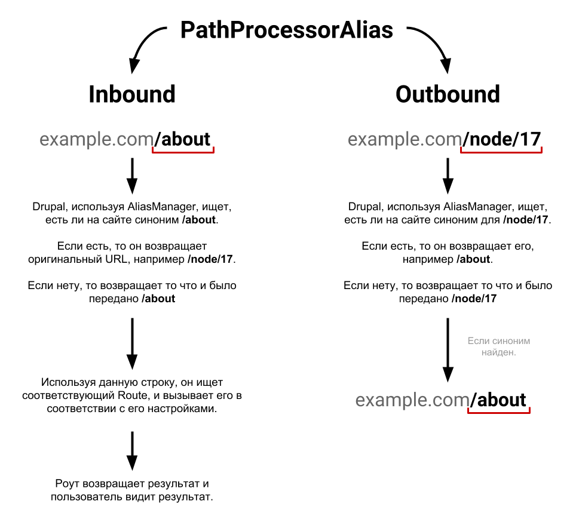
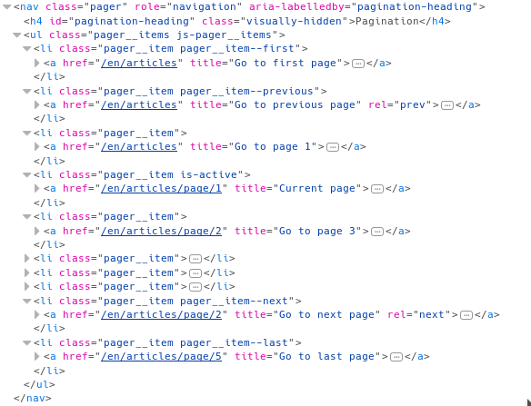

**Inbound** и **Outbound** Processor плагины позволяют вмешиваться в процесс обрабтки входящих и исходящих URL. Их аналоги в 7-ке: [hook_url_inbound_alter()](https://api.drupal.org/api/drupal/modules%21system%21system.api.php/function/hook_url_inbound_alter/7.x) и [hook_url_outbound_alter()](https://api.drupal.org/api/drupal/modules%21system%21system.api.php/function/hook_url_outbound_alter/7.x). Возможно, вам уже доводилось с ними работать, тогда проблем при переходе на 8-ку возникнуть не должно. Хуки заменили на соответствующие сервисы и ООП, сам процесс остался прежним.

Если вы о них ничего не слышали, или не знаете что это и как работает, то лучше прочитать для общего понимания как работают URL в Drupal. Эти обработчики **экзотичны**, поэтому вы можете о них не знать. Они используются крайне редко и только тогда, когда надо Drupal помочь правильно понять URL, и соответственно, правильно подготовить.

Благодаря данным процессорам работает стандартная система алиасов для материалов, поверх которой работает Pathauto модуль. Данные процессоры используются мультиязычностью для добавление префиксов в URL о текущем языке и определении языка сайта.

Областей применений у них может быть очень много, например, можно сделать реферальную систему, где для пользователей будут генерироваться URL с их рефералкой будучи авторизованными и т.д.

**Из чего состоят процессоры?** Так как они не делают ничего необычного и выполняемая ими задача достаточно узкая, то делать их достаточно просто, но вот их написание, может по началу ставить в тупики. Достаточно создать объект реализующий `InboundPathProcessorInterface` и\или `OutboundPathProcessorInterface` и объявить его как сервис с тегами и приоритетом. Иными словами, это [сервисы](/blog/150).

**Простой пример-каркас**:

```php {"header":"src/PathProcessor/MyPathProcessor.php"}
<?php

namespace Drupal\my_module\PathProcessor;

use Drupal\Core\PathProcessor\InboundPathProcessorInterface;
use Drupal\Core\PathProcessor\OutboundPathProcessorInterface;
use Drupal\Core\Render\BubbleableMetadata;
use Symfony\Component\HttpFoundation\Request;

/**
 * Processes the inbound\outbound path.
 */
class MyPathProcessor implements InboundPathProcessorInterface, OutboundPathProcessorInterface {

  /**
   * {@inheritdoc}
   */
  public function processInbound($path, Request $request) {
    // Do something.
    return $path;
  }

  /**
   * {@inheritdoc}
   */
  public function processOutbound($path, &$options = [], Request $request = NULL, BubbleableMetadata $bubbleable_metadata = NULL) {
    // Do something.
    return $path;
  }

}
```

И сервис для данного процессора:

```yaml {"header":"my_module.services.yml"}
services:
  my_module.my_path_processor:
    class: Drupal\my_module\PathProcessor\MyPathProcessor
    tags:
      - { name: path_processor_inbound, priority: 300 }
      - { name: path_processor_outbound, priority: 300 }
```

Как вы можете заметить, для Inbound и Outbound указываются их персональные теги, так как сервис может содержать только нужные.

После этого в них будут приходить URL на обработку.


## Inbound Processor


**Inbound Processor** обрабатывает **входящие URL (запросы)**, и вызывается в момент валидации пути.

Задача данного процессора в том, чтобы привести запрашиваемый URL в какой-либо существующий `path` для роута сайта. Таким образом, Drupal будет знать что вызывать и отдаст результат.


## Outbound Processor


**Outbound Processor** обрабатывает **генерируемые URL** проходящие через `UrlGenerator` (url_generator.non_bubbling), который используется уже в **Router**, **Url**  и других объектах и сервисах. Если url  генерируется штатными сервисами и объектами, то он будет обработан, например ссылка в меню, если же ссылка просто вставлена где-то в тексте, то, разумеется, она не будет обработана данным процессором.

Его задача уже в том, что он корректирует генерируемые URL в нужный вам формат и вид. Он позволяет полностью изменить результат работы генераторов URL.

**Примечание.** URL генерируемые только из query параметров (`Url::fromUserInput('?test=yes')`) не вызывают outbound processor. То есть те, у которых не указан валидный роут. См. `Url::toString()`, но, например, `Url::fromRoute('<current>', [], ['query' => ['test' => 'yes']])` будет обработан.

Также для генерируемого URL можно отключить outbound обработку передав в качестве опции `path_processing` установленного в `FALSE`.


## Сервис


**Сервис** имеет два тега, на каждый из процессоров который вам нужен. Приоритет, как и у всех сервисов, чем больше - тем раньше выполнится. Вы должны четко понимать что делаете, и подобрать корректный приоритет, чтобы обработчики не вызывались слишком рано, или слишком поздно.

Все объявленные path processor сервисы вызываются друг за другом и передают результат предыдущего следующему. То что вернет последний обработчик, то и будет отдано на исполнение, в случае inbound или как результат, в случае outbound.


## Пример №1 — PathProcessorAlias


Чтобы ничего не выдумывать, возьмем для первого примера код из ядра и разберемся с ним. Он очень простой, понятный и самый наглядный пример, для чего эти обработчики и как они работают.

Все контент сущности в Drupal имеют какой-то определенный путь. Для стандартного содержимого - сущность `node`, регистрируется роут с `path` равным `/node/{node}`, где в `{node}` передается id материала. Однозначно вы знакомы с этим путем. Но вот вы решили добавить алиас данному пути, а как оно работает?

Допустим, у вас материал имеет стандартный путь **/node/17**, а вы добавили ему алиас **/about**. Откуда друпал узнает что при запросе **/about** страницы надо выполнить роут с путём **/node/17**? Ведь такого роута не существует, это всего лишь алиас и он хранится в базе. Для этого в ядре уже написан сервис `PathProcessorAlias`, который полностью отвечает за обработку алиасов сущностей.

Давайте на него посмотрим:

```php {"highlighted_lines":"34:37,42:48","header":"core/lib/Drupal/Core/PathProcessor/PathProcessorAlias.php"}
<?php

namespace Drupal\Core\PathProcessor;

use Drupal\Core\Path\AliasManagerInterface;
use Drupal\Core\Render\BubbleableMetadata;
use Symfony\Component\HttpFoundation\Request;

/**
 * Processes the inbound path using path alias lookups.
 */
class PathProcessorAlias implements InboundPathProcessorInterface, OutboundPathProcessorInterface {

  /**
   * An alias manager for looking up the system path.
   *
   * @var \Drupal\Core\Path\AliasManagerInterface
   */
  protected $aliasManager;

  /**
   * Constructs a PathProcessorAlias object.
   *
   * @param \Drupal\Core\Path\AliasManagerInterface $alias_manager
   *   An alias manager for looking up the system path.
   */
  public function __construct(AliasManagerInterface $alias_manager) {
    $this->aliasManager = $alias_manager;
  }

  /**
   * {@inheritdoc}
   */
  public function processInbound($path, Request $request) {
    $path = $this->aliasManager->getPathByAlias($path);
    return $path;
  }

  /**
   * {@inheritdoc}
   */
  public function processOutbound($path, &$options = [], Request $request = NULL, BubbleableMetadata $bubbleable_metadata = NULL) {
    if (empty($options['alias'])) {
      $langcode = isset($options['language']) ? $options['language']->getId() : NULL;
      $path = $this->aliasManager->getAliasByPath($path, $langcode);
    }
    return $path;
  }

}
```

Также данные обработчики объявлены в качестве сервиса:

```yaml {"header":"core/core.services.yml"}
services:
  path_processor_alias:
    class: Drupal\Core\PathProcessor\PathProcessorAlias
    tags:
      - { name: path_processor_inbound, priority: 100 }
      - { name: path_processor_outbound, priority: 300 }
    arguments: ['@path.alias_manager']
```

А теперь разберемся по порядку.

В данный сервис передается аргумент-сервис **path.alias_manager**, который отвечает за работу с алиасами на сайте. Он позволяет получать оригинальный путь, предоставив алиас, и наоборот, алиас, предоставив оригинальный путь. То есть проводить конвертацию /node/17 <-> /about.

И в нем есть два метода `processInbound()` и `processOutbound()`, которые отвечают соответственно за обработку Inbound и Outbount URL.

**Что происходит?** Когда пользователь запрашивает страницу, не важно какую, всегда вызывается метод `processInbound()`, а когда вы, например, указали `/node/17` для пункта меню, и происходит рендер этого самого меню, то вызывается `processOutbound()`.

И вот, пользователь вводит у себя в браузере example.com/about. Вызывается данный сервис и метод `processInbound()`. Ему передается запрошенный путь = /about, а также объект запроса. Он запрашивает у сервиса **path.alias_manager** оригинальный путь для /about. Если есть такой синоним, то он получит оригинальный url, в нашем случае /node/17, а затем вернет как результат, если не найдет, то так и вернет /about и отдаст следующему обработчику, если такой имеется. Когда обработчики кончатся, Drupal будет искать подходящий роут по тому что пришло в итоге. Если он нашел оригинал /node/17, то он увидит что такой роут принадлежит сущности `node`, и выполнит его, в итоге пользователь получит страницу с результатом. Если не нашел, то он попытается найти роут для /about, если найдет, например вы или другой модуль объявили его, то также вернет его результат, а если нет, то 404 ошибку.

C outbound все куда проще. Он не влияет на результат выполнения запроса, так как помогает генерировать корректные URL. Когда вы делаете меню, генерирует роут или что-то ещё, т.е. пытаетесь получить URL через API, он будет проходить через outbound и вы сможете его скорректировать. В данном случае, он, получая /node/17 в качестве аргумента, пытается найти алиас. Если находит, то ссылка станет /about, если же нет, то так и останется /node/17. Например: `<a href="{{ path('entity.node.canonical', {'node': 17}) }}">About</a>` пройдет через outbound и превратится на выходе в `<a href="/about">About</a>` (при условии что алиас для ноды задан).

Вот так работает система алиасов в Drupal, и это самый яркий пример того, для чего и как используются данные обработчики.

Все тоже самое в виде небольшой схемки.



## Пример №2 — семантические пейджеры


_Модуль в котором пишется код имеет название dummy._

_⚠️ **ACHTUNG!** Не используйте данный пример на продакшене. Это пример ради примера, чтобы показать ещё один вариант и база для экспериментов. Он не тестировался полноценно, будет создавать дубли в индексе, не имеет поддержки множественных пейджеров и, возможно, ещё куча других проблем. Не говоря о том, что, возможно, тут по уму бы ещё Middleware задействовать._

В этом примере мы сделаем как Inbound, так и Outbound обработчики, которые будут переделывать query для пейджеров в алиасы. Например **/articles?page=1** будет становиться **/articles/page/1**. Наша задача, в текущем примере, лишь посмотреть, как данная подмена будет происходить на уровне обработчиков. Прочие ньюансы мы реализовывать не будем.

Собственно переходим сразу к написанию обработчика.

```php {"header":"src/PathProcessor/DummyPageProcessor.php"}
<?php

namespace Drupal\dummy\PathProcessor;

use Drupal\Core\PathProcessor\InboundPathProcessorInterface;
use Drupal\Core\PathProcessor\OutboundPathProcessorInterface;
use Drupal\Core\Render\BubbleableMetadata;
use Symfony\Component\HttpFoundation\Request;

/**
 * Processes the inbound and outbound pager query.
 */
class DummyPageProcessor implements InboundPathProcessorInterface, OutboundPathProcessorInterface {

  /**
   * {@inheritdoc}
   */
  public function processInbound($path, Request $request) {
    if (preg_match('/.*\\/page\\/([0-9]+)$/', $request->getRequestUri(), $matches)) {
      $path = preg_replace('/(.*)\\/page\\/[0-9]+/', '${1}', $path);
      if ($path == '') {
        $path = '/';
      }
      $request->query->set('page', $matches[1]);
      $request->overrideGlobals();
    }
    return $path;
  }

  /**
   * {@inheritdoc}
   */
  public function processOutbound($path, &$options = [], Request $request = NULL, BubbleableMetadata $bubbleable_metadata = NULL) {
    if (!empty($options['query']['page']) || $options['query']['page'] == 0) {
      if ($options['query']['page'] > 0) {
        $path .= '/page/' . $options['query']['page'];
      }
      unset($options['query']['page']);
    }
    return $path;
  }

}
```

`processInbound()`:

- Первым делом, мы проверяем регуляркой, имеет ли текущий URL окончание /page/{N}, где N - номер страницы. Если не имеет, значит этот URL нам не интересен и мы возвращаем его как есть, передавая следующим обработчикам.
- Затем, мы производим замену, уберая /page/{N} из url. Например /articles/page/1 превратится в /articles.
- Если после замены путь остался пустым, мы задаем корневой путь /.
- Далее мы делаем решение для пейджеров. Пейджеры по умолчанию ищутся в query параметре page. Так как мы его вырезаем и заменяем на /page/{N}, то весь код, что опирался на этот параметр просто напросто поломается, включая и пейджеры. Мы возвращаем это значение уже в момент обработки запроса, а затем, делаем подмену объекта запроса на новый, с нашим изменением. Таким образом, весь код, что запрашивал `\Drupal::request()->query->get('page')` будет получать корректый номер страницы. Но при этом в query строке браузера его уже не будет, только на бэкенде.


`processOutbound()`:

- Первым делом проверяем, есть ли в опциях к генерируемуму URL query параметр page. Мы также проверяем на значение 0, так как это считается первой страницей в друпале, но `empty()` посчитатет что значение пустое.
- Внутри мы сразу проверяем, если номер страницы больше 0, мы добавляем текущему пути приставку /page/{N}.
- После чего удаляем этот query параметр. Если page=0, то мы просто его удаляем. Таким образом у нас не будет ни /articles?page=0, ни /articles/page/0, что дубли /articles.

Далее нам требуется объявить наш объект в виде сервиса.

```yaml {"header":"dummy.services.yml"}
services:
  dummy.page_path_processor:
    class: Drupal\dummy\PathProcessor\DummyPageProcessor
    tags:
      - { name: path_processor_inbound, priority: 1000 }
      - { name: path_processor_outbound, priority: -1000 }
```

А теперь немного про приорит тегов. Как я написал ранее, чем больше - тем раньше выполнится. И это очень важно понимать когда пишите данные сервисы. По умолчанию оба сервиса для Path Alias имеют вес 100 и 300, соответственно. Я же для наглядности и уверенности что ничто другое больше их не перекроет, поставил 1000 и -1000.

**Почему для inboud 1000?** Когда мы получаем URL /articles/page/1, мы должны убрать из него /page/1 раньше чем Path Alias обработчик начнет искать его оригинальный URL. Если он вызовется раньше нашего, то он всегда будет фейлиться. Получается следующий процесс:

- Запрашивается страница /articles/page/1
- Вызывается наш обработчик, так как его приоритет выше стандартного Path Alias. В нём мы срезаем /page/1, возвращая /articles
- Вызывается Path Alias обработчик, он не находит такой алиас (или находит, уже не важно), и отдает снова /articles
- Drupal находит что /articles это path для конкретного вьюса, и вызывает его и выполняет.
- Пользователь получает результат.

В данном случае вариант с меньшим приоритетом ещё пройдет успешно. Но если /articles окажется алиасом другой страницы, допустим, /info, а он пусть тоже будет вьюсом, то он уже выдаст 404. Так как Drupal будет искать /articles роут, но такого не будет, зато есть роут /info у которого есть алиас /articles. И в случае текущего порядка (из кода), он это увидит и найдет, вернет /info и результат будет корректный.

**Почему для outbound -1000?** Абсолютная противоположность inbound. В outbound мы добавляем приставку /page/1 к урл. Если вызвать, опять же, раньше Path Alias обработчика, сделать /info/page/1, то он не найдет алиас /articles и URL станет некорректным. В случае с нодами, URL станет /node/17/page/1, вместо /about/page/1, так как мы добавили приставку пейдж, раньше, чем /node/17 стало /about, а о /node/17/page/1 друпал ничего знать не будет. Поэтому друпал сначала вызывает Path Alias: /node/17 -> /about, а затем вызывается наш, который добавляет пейдж /about/page/1.

Можно сбросить кэш, и включать, должно уже работать.


### Доработка


У текущего примера есть проблемка на уровне ядра. Например, если вы будете использовать mini pager от вьюса, всё будет работать корректно, но на стандартном пейджере outbound не будет генерировать корректные ссылки.

Всё дело в том, что у обычного pager из ядра генерация URL идет немного некорректно, из-за чего outbound не вызывается. Проблема та, что была описана в примечании к Outbound Processor — URL генерится из одной query, а не из роута `<current>` и query опций, из-за чего outbound процессинг пропускается.

Для того чтобы исправить данную ситуацию, нам достаточно вмешаться в препроцесс пейджера и подменить Url на корректные, с правильным вызовом, который вызовет outbound обработки.

```php {"header":"dummy.module"}
<?php

/**
 * @file
 * File for custom hooks and code.
 */

use Drupal\Core\Url;

/**
 * Implements hook_preprocess_pager().
 */
function dummy_preprocess_pager(array &$variables) {
  foreach ($variables['items'] as $type => $items) {
    if ($type == 'pages') {
      foreach ($items as $key => $item) {
        if (isset($item['href'])) {
          $variables['items'][$type][$key]['href'] = _dummy_clean_pager_url($item['href']);
        }
      }
    }
    else {
      if (isset($items['href'])) {
        $variables['items'][$type]['href'] = _dummy_clean_pager_url($items['href']);
      }
    }
  }
}

/**
 * Clean pager URL't to support outbound processing.
 */
function _dummy_clean_pager_url($url) {
  // If no query args.
  if (strpos($url, '?') !== 0) {
    return $url;
  }
  parse_str(substr($url, 1), $query);
  return Url::fromRoute('<current>', [], ['query' => $query]);
}
```

После этого, генерация ссылок у пейджера будет корректной.


