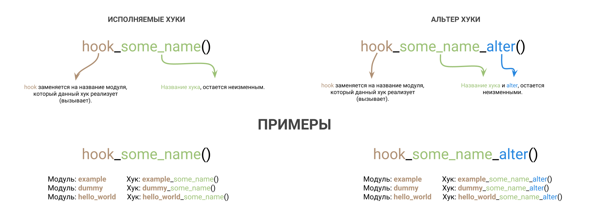
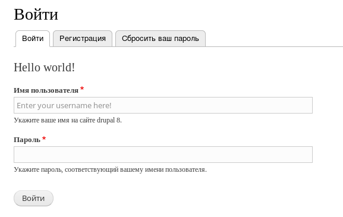
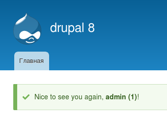
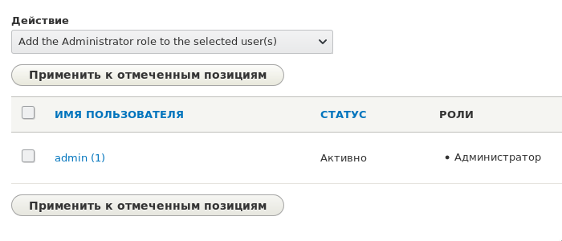
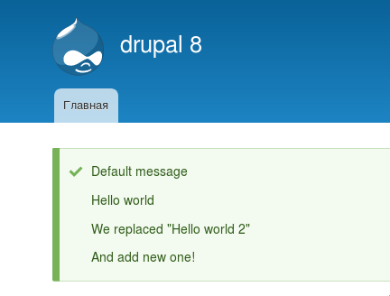

:: youtube {vid=RCiPmxaqeEk}

Хуки в Drupal 8 — неотъемлимый инструмент разработчика. Если вы решили научиться
разрабатывать сайты на Drupal, а именно, писать код, вам придется понять что
такое хуки, как они работают и как ими пользоваться.

**Хуки** — это обычные функции, вызываемые в процессе обработки запроса.
Отличить их от других можно по префиксу **hook** в названии функции. **hook** в
названии хуков — всего лишь placeholder, который позволяет понять разработчикам,
что эта фукнция — хук, а не самодостаточная функция.

**Цель хуков** — позволить сторонним модулям внедряться в работу других модулей
или ядра. Как правило, они вызываются в тех местах кода, где сторонние
разработчики, вероятнее всего, захотят добавить свою логику, повлиять на ход
выполнения операции или результат. Хуки позволяют защищать код, как ядра, так и
модулей, от стороннего и непредсказуемого вмешательства в него, то есть хака.

## Типы хуков

Хуки не принято делить на типы. Их просто называют хуками, так как они
выполняют, в общем, одну цель. Но с технической стороны их можно разделить на
два типа:

* **Исполняемые хуки** — данный тип хуков очень универсальный. Он может быть
  вызван для того, чтобы вы могли вернуть какие-то данные модулю, который данный
  хук вызывает. Он также может быть вызван без ожидания ответа от него. Своего
  рода [Events][drupal-8-events], и да, некоторые хуки ведут себя как события и
  постепенно их переносят на Events или другие плагины Drupal 8, то что не
  успели сделать к релизу.
* **Альтер хуки** — в отличии от исполняемых, передают данные на изменение. То
  есть, когда вы используете такие хуки, то это автоматически подразумевает то,
  что вы хотите изменить какое-то поведение или данные, а когда их вызывает
  разработчик (автор), он также, подразумевает что данные, с высокой
  вероятностью будут изменены. Их легко отлечить от исполняемых по суффиксу *
  *alter** в названии хука. Аргументы которые передаются в такие хуки,
  передаются [по ссылке](http://php.net/manual/en/language.references.pass.php) (`&$var`).

## Как работают хуки

Немного забудем о Drupal, и разберемся, как работают хуки в принципе. Это самое
важное в изучении хуков. Как только вы поймете как они работают, отпадет 90%
вопросов. Это самая сложная для понимания часть для многих новичков, как и для
меня в своё время. Возможно, если вы пришли из других CMS, вы увидите аналогию с
их API.

Если говорить очень просто, то Drupal, в определенный момент, на ранних этапах
бутстрапа ядра собирает список всех активных модулей. А затем, когда приходит
время вызова хука, он программно формирует название функций проходясь по массиву
активных модулей, и заменяя hook на названия модуля. Если данная функция
найдена, вызывает её, передаваяя всё что необходимо.

* Слово **hook** заменяется на название модуля, в котором данный хук было решено
  использовать. Например: вы пишите код в модуле **example**, и хотите
  использовать **hook**_some_example(), то вам нужно написать функцию
  **example**_some_example() и Drupal, обнаружив её, вызовет её, а вы сделаете
  что необходимо. Это уже будет зависить от того хука, который вы решили
  использовать.
* В альтер хуках, суффикс **alter** остается без изменения. Например: модуль
  **example**, хук **hook**\_some_example_**alter**(), то результат будет
  **example**\_some_example_**alter**().
* Название хука написанного **в нижнем регистре**, остается неизменным.
  Например: модуль **example**, хук **hook**_some_example(), то результат будет
  **example**_some_example().
* Название хука, содержащий вставки **в верхнем регистре**, должны быть заменены
  на определенное значение, которое определяется хуком. Например: модуль
  **example**, хук **hook**\_some_**TYPE**_example_alter(), то результат _может
  быть_ **hook**\_some_**more_complex**_example_alter(). Такие хуки — уточняют
  область действия хука. Они **всегда** имеют хук без вставки. Например
  hook_form_FORM_ID_alter() имеет также хук hook_form_alter(). Разница в том,
  что тот что без уточнения будет вызываться на всех формах, а тот что с
  вставкой FORM_ID, замененной на название формы, будет вызывать только в момент
  генерации той самой формы. <mark>Данный вариант написания и создания хуков
  доступен только для alter хуков</mark>.



## Как использовать хуки в Drupal

В Drupal, принято что хуки описываются в **.module** файле модуля или **.theme**
файле темы. _Не все хуки можно использовать в модулях, и не все можно
использовать в темах._ Об это указывается в самих хуках и их очень мало.

Также хуки могут выноситься в сторонние модули, которые инклудятся из **.module
** или **.theme**. Говоря иначе, хуки, как и обычные функции, должны быть
доступны ядру, он подключает только известные ему файлы и те что подключаеются в
известных (include).

Как выше и было указано, слово hook в названии хука заменяется на название
модуля, в котором пишут код, и он будет вызван автоматически.

Например, у вас есть модуль **dummy** и вы нашли\хотите
объявить [hook_cron()](https://api.drupal.org/api/drupal/core%21core.api.php/function/hook_cron/8.6.x).

Для этого в **dummy.module** необходимо создать функцию:

```php
/**
 * Implements hook_cron().
 */
function dummy_cron() {
  // Do something when cron will launch.
}
```

Включить модуль, если этого ещё не сделано, а если сделано, сбросить кэш, и всё
готово! Данный хук вызывается в момент запуска операций крон. Вы можете написать
там свой код, а затем вызвать принудительное выполнение операций крон, и ваш код
сработает. Тем самым вы внедряетесь в ядро, и можете выполнить свои действия в
момент выполнения крона, которые нужны только вам, при этом не лазя в ядро, не
ищя где, как и куда писать свой код, а потом его поддерживать. Вы объявляете хук
который подходит под вашу задачу, пишите логику — дальше все сделает Drupal.

Обратите внимание на комментарий к функции. Drupal Coding Standards **требует**
написание комментариев к функциям, а хукам для первой строки комментария и вовсе
свои требования. Если функция — hook, то комментарий должен начинаться (первая
строка) с Implements и названия хука. Может иметь такие варианты:

- `Implements hook_foo().` — просто указывается что используется такой-то хук.
  _Обратите внимание на точку в конце, это тоже стандарт ?_
- `Implements hook_foo_BAR_ID_bar() for xyz_bar().`
- `Implements hook_foo_BAR_ID_bar() for xyz-bar.html.twig.`
- `Implements hook_foo_BAR_ID_bar() for educational purposes.`

Так другие разработчики, изучая ваш исходный код, сразу поймут что это не
самодостаточная функция, а реализация такого-то хука. И сразу будет ясно зачем
данный код написан и когда будет вызван.

## Как создавать свои собственные хуки

Хуки создаются проще простого. Для этого достаточно вызвать соответствующие
методы из ядра, в тех местах кода, где вы хотите объявить свой хук. В
зависимости от необходимой задачи вашего хука, вы выбираете его тип, исполняемый
или альтер, и вызываете соответствующий метод, передавая параметры, которые вы
желаете отдать хукам, которые будут его использовать.

### Исполняемые хуки

Регистрируются при помощи:

- `Drupal::moduleHandler()->invokeAll($hook, array $args = [])`, вызывает все
  реализации (у всех активных модулей) указанного хука, передавая ему нужные
  аргументы.
  - `$hook`: Название хука, который хотите вызвать\зарегистрировать. Например,
    если хотите зарегистрировать `hook_some_name()`, то в `$hook`
    передается `some_name`. Приставку в виде модуля, добавит Drupal.
  - `$args`: Массив из аргументов, которые будут переданы во все хуки. Каждый
    элемент данного массива будет передан как самостоятельный аргумент хука.
    Например, `$args = ['foo', 'bar']` => `function hook_some_name($first_arg, $second_arg) {}`,
    где в `$first_arg` придет foo, а в `$second_arg` bar.
- `Drupal::moduleHandler()->invoke($module, $hook, array $args = [])` —
  аналогично первому, только вызывается для конкретного `$module`. Может быть
  полезно, например, чтобы сначала вызывался хук для вашего модуля, тем самым
  вызвав его раньше всех, а затем вызывать все остальные.

Данные методы\хуки могут возвращать результаты. `invokeAll()` возвращает массив
с результатами всех хуков, `invoke()` результат определенного модуля.

```php
// Some stuff you are doing somewhere.
$words = Drupal::moduleHandler()->invokeAll('my_awesome_hook', ['foo']);
$sentence = implode(', ', $words); // foo!, bar

// Some module #1: example

/**
 * Implements hook_my_awesome_hook().
 */
function example_my_awesome_hook($word) {
  return $word . '!';
}

// Some module #2: another_module

/**
 * Implements hook_my_awesome_hook().
 */
function another_module_my_awesome_hook($word) {
  return 'bar';
}
```

### Альтер хуки

Вызываются они практически идентично, но имеют ряд отличительных особенностей.

- `Drupal::moduleHandler()->alter($type, &$data, &$context1 = NULL, &$context2 = NULL)`
  вызов альтер хука. Префикс **hook** и суффикс **alter** будут добавлены
  автоматически.
  - `$type`: Название альтер хука. Особенность тут в том, что **данный аргумент
    может быть как строкой так и массивом**.
    - **Строка.** Например вы передаете `$type` = `some_example`, он
      превратиться в `hook_some_example_alter()`.
    - **Массив.** Масив позволяет задать различные варианты хука, а именно,
      уточняющие. Учтите, что базовый хук очень желательно чтобы был всегда в
      массиве. Например `$type = ['some_example', 'some_example_type']`
      преврататься в 2 хука `hook_some_example_alter()`
      и `hook_some_example_type_alter()`. Как правило, во втором элементе
      массива название хука генерируется на основе какой-то переменной.
      Типа `'some_example_' . $type` — это позволяет сделать динамические альтер
      хуки. А в документации такие пишут
      капсом `hook_some_example_TYPE_alter()`. Где другие разработчики, могут
      поставить любое значение вместо `TYPE`, и если оно совпадет, то хук
      вызовится. Это можно наблюдать в очень популярном хуке `hook_form_alter()`
      и его же варианте `hook_form_FORM_ID_alter()`. Первый вызывается на все
      формы, а второй, только для той формы, form id которой подставят вместо
      FORM_ID в названии хука. То есть ядро
      передает `$type = ['form', 'form_' . $form_id]` в данный метод.
  - `&$data`: Первый и обязательный аргумент для альтер хуков. Альтер хуки будут
    совершенно бессмысленны без аргументов, так как аргументы передаются по
    ссылке, и цель таких хуков, возможность изменить данные. Поэтому, для них
    всегда есть какие-то данные которые необходимо изменить. В данном аргументе,
    как правило, передаются основные данные для изменения.
  - `&$context1, &$context2`: Два необязательных и дополнительных аргумента. Все
    как и `&$data`.

Если по каким-то причинам вам не хватает трёх аргументов для передачи в альтер
хук, то есть, нужно больше. То `$context1` и `$context2` передаются как массивы
с доп данными.

```php
$message = 'Hello world!';
$context = [
  'alterable' => &$alterable,
  'unalterable' => $unalterable,
  'foo' => 'bar',
];
// hook_my_awesome_message_alter().
Drupal::moduleHandler()->alter('my_awesome_message', $message, $context);
```

Альтер хуки не возвращают никаких данных, всё должно решаться на уровне
аргументов переданных по ссылке и их изменении.

## Группировка хуков

Также у хуков есть возможность группировки. Это уже несколько специфичная тема.
Но суть в том, что, когда у хука есть группа, то такие хуки могут быть объявлены
также в файле modulename.**groupname**.inc, который должен находиться в корне
модуля\темы. Такие файлы автоматически обнаруживаются друпалом и хуки в них
становтся доступными. Например, у хуков модуля Views, и Token хуки объявлены с
группами. Таким образом, вы можете встретить в модулях файлы modulename.**views
**.inc и modulename.**tokens**.inc. Это файлы с хуками для этих групп хуков. Они
будут найдены и подгружены друпалом автоматически в момент вызова хука. Если ни
один хук из группы в процессе выполнения запроса не будет вызван, такой файл
даже не подгрузится.

Это можно использовать для оптимизации как кода, так и организации проекта. Так
как когда хуков копится много, желание как-то подробить .module файл приходит
само. И у хуков это уже есть из коробки.

Для того чтобы ваши хуки имели определенные группы, необходимо их явно объявить,
помимо обычного вызова. Для этого есть `hook_hook_info()` ?. В нём нужно указать
название хуков и то, к какой группе они будут принадлежать. Обратите внимание на
то, что приставка hook не указывается, а alter **указывается**.

Например, если вы захотите объединить те два хука что были выше по тексту в
группу **my_group**, то в .module файле вашего модуля, где вызываются данные
хуки, нужно создать соответствующий хук.

```php
/**
 * Implements hook_hook_info().
 */
function mymodule_hook_info() {
  $hooks = [
    'my_awesome_hook',
    'my_awesome_message_alter',
  ];

  return array_fill_keys($hooks, ['group' => 'my_group']);
}
```

После чего, данные два хука можно будет писать в mymodule.**my_group**.inc
файле.

Также есть ещё один хук, `hook_hook_info_alter()`, который позволяет эти группы
для хуков поправить или добавить, там где их нет, например, если хук не от
вашего модуля, а вы хотите их группировать ;). Это какраз показывает, насколько
гибкие хуки, и при этом, нет необходимости лазить в чужих модулях и хакахать их.

## Документирование хуков

Очень важная часть при объявлении своих хуков — их документирование. Как мы уже
посмотрели, хуки объявляются на лету в любых местах кода. Чтобы другие
разработчики знали о них, зачем они вызываются, что могут делать и что в них
передается, все модули, которые объявляют свои хуки, **должны** описывать данные
хуки modulename**.api.php** файле. Если вы сейчас зайдете в любой крупный
модуль, да вообще любой и сразу увидите файл с таким расширением в его корне —
это значит у данного модуля есть хуки, и все их вы сможете найти там, с их
описанием, целями и аргументами. Согласитесь, удобно?

От вас, как от разработчика модуля, который создает хуки, будут ожидать тоже
самое. Это не говоря о том, что, например, phpstorm вообще такие файлы
анализирует и делает более грамотное автодополнение хуков. Вы сами облегчите
себе и другим жизнь, и скорость разработки! **Обязательно делайте такой файл.**

Данный файл содержит, возможно, необычный для вас комментарий. Вы можете его
писать, или нет, это уже на ваше усмотрение.

```php
/**
 * @addtogroup hooks
 * @{
 */

// hooks

/**
 * @} End of "addtogroup hooks".
 */
```

Хуки описываются между этих комментариев. Модули, описывающие так хуки в данном
файле (между комментов такого формата) и опубликованные на drupal.org, должны
парситься сайтом и данные хуки должны появляться на api.drupal.org. Честно
говорю, не знаю какие критерии, но без такой обертки-комментариев, они точно не
появятся.

Ваши хуки в данном файле описываются в виде обычных функций. Название должно
содержать приставку hook, как и alter, для соответствующих хуков. Вы также
указываете аргументы, которые данные хуки получают (если получают), а внутри
функций, как правило, пишутся простые примеры использования. А в комментарии к
хуку описывают его аргументы, что возвращает и т.д. То есть, по максимуму.

Например, опишем те два хука что мы писали для примера выше.

```php
<?php

/**
 * @file
 * Hooks specific to the My Module module.
 */

/**
 * @addtogroup hooks
 * @{
 */

/**
 * Return word which will be implode to sentence.
 *
 * @param string $word
 *   Default word for this call.
 *
 * @return string
 *   A string with word.
 */
function hook_my_awesome_hook($word) {
  return $word . '?';
}

/**
 * Allow you to alter message.
 *
 * @param string $message
 *   Actual message which you can alter.
 * @param array $context
 *   An associative array containing:
 *   - alterable: Alterable context.
 *   - unalterable: Unalterable context.
 *   - foo: String contains "bar" value.
 */
function hook_my_awesome_message_alter(&$message, array &$context) {
  $context['alterable'] = 'New value';
  $message = 'Hello moon!';
}

/**
 * @} End of "addtogroup hooks".
 */
```

Этот файл никак не вызывается в процессе работы ядра. Зато сильно помогает
сторонним разработчикам не шерстить без необходимости по вашему коду, и экономит
кучу времени. Также может парситься различными IDE для удобства написания кода,
а также api.drupal.org.

_Все дальнейшие примеры пишутся в модуле с названием dummy._

## Пример №1

В данном примере мы будем использовать три хука:

- [hook_form_FORM_ID_alter()](https://api.drupal.org/api/drupal/core%21lib%21Drupal%21Core%21Form%21form.api.php/function/hook_form_FORM_ID_alter/8.5.x):
  При помощи него мы добавим небольшое сообщение в форму авторизации на сайте, а
  также в поле ввода имени пользователя, добавим placeholder.
- [hook_user_login()](https://api.drupal.org/api/drupal/core%21modules%21user%21user.api.php/function/hook_user_login/8.5.x):
  Данный хук вызывается в момент авторизации пользователя (любого). Мы будем
  выводить системное сообщение с приветствием пользователя.
- [hook_user_format_name_alter()](https://api.drupal.org/api/drupal/core%21modules%21user%21user.api.php/function/hook_user_format_name_alter/8.5.x):
  Данный хук позволяет отредактировать отображаемое имя пользователя. Мы добавим
  к стандартному имени (логину) id пользователя.

Всё уже разобрано выше, поэтому сразу к коду.

```php {"header":"dummy.module"}
<?php

/**
 * @file
 * Main file for hooks and custom functions.
 */

use Drupal\Core\StringTranslation\TranslatableMarkup;

/**
 * Implements hook_form_FORM_ID_alter().
 */
function dummy_form_user_login_form_alter(&$form, \Drupal\Core\Form\FormStateInterface $form_state, $form_id) {
  $form['welcome'] = [
    '#markup' => '<h2>Hello world!</h2>',
    '#weight' => -100,
  ];

  $form['name']['#attributes']['placeholder'] = 'Enter your username here!';
}

/**
 * Implements hook_user_login().
 */
function dummy_user_login($account) {
  $message = new TranslatableMarkup('Nice to see you again, <strong>@username</strong>!', [
    '@username' => $account->getDisplayName(),
  ]);
  \Drupal::messenger()->addMessage($message);
}

/**
 * Implements hook_user_format_name_alter().
 */
function dummy_user_format_name_alter(&$name, $account) {
  $name .= ' (' . $account->id() . ')';
}
```

**dummy_form_user_login_form_alter**: Теперь на форме авторизации будет наше
сообщение и placeholder для ввода логина.



**dummy_user_login**: После авторизации любого пользователя будет выводиться
приветственное сообщение с его форматированным именем.



**dummy_user_format_name_alter**: Меняем отображаемое имя пользователя, добавляя
к нему в конце в скобочки в которых выводится id юзера. _Уже можно наблюдать
действие при авторизации в приветственном сообщении._



## Пример №2

В данном примере мы добавим и опишем вывод сообщений на каждой странице сайта и
создадим два хука. Один будет позволять добавить свои сообщения к списку
выводимых, второй сможет править эти сообщения до того как они будут выведены.

Продолжаем в том же модуле.

```php {"header":"dummy.module"}
use Drupal\Component\Utility\NestedArray;

...

/**
 * Implements hook_preprocess_HOOK() for page.html.twig.
 */
function dummy_preprocess_page(&$variables) {
  $messages = [
    'Default message',
  ];

  // hook_dummy_page_message().
  $result = \Drupal::moduleHandler()->invokeAll('dummy_page_message');
  $messages = NestedArray::mergeDeep($messages, $result);

  // hook_dummy_page_messages_alter().
  \Drupal::moduleHandler()->alter('dummy_page_messages', $messages);

  if (!empty($messages)) {
    foreach ($messages as $message) {
      \Drupal::messenger()->addMessage($message);
    }
  }
}

/**
 * Implements hook_dummy_page_message().
 */
function dummy_dummy_page_message() {
  return [
    'Hello world',
    'Hello world 2',
  ];
}

/**
 * Implements hook_dummy_page_messages_alter().
 */
function dummy_dummy_page_messages_alter(&$messages) {
  $messages[2] = 'We replaced "Hello world 2"';
  $messages[] = 'And add new one!';
}
```

- Мы используем `hook_preprocess_HOOK()` для того чтобы подключиться к
  page.html.twig, который рендерится на каждой странице где есть тема
  оформления. Например, на REST API такой хук не сработает.
  * В нем мы задаем сообщение Default message по умолчанию что оно будет
    выводиться всегда.
  * Затем регистрируем\вызываем наш новый хук `hook_dummy_page_message()`,
    который собирает новые сообщения для вывода от всех модулей. Мы будем
    подразумевать что он может возвращать как строку (одно значение), так и
    массив с сообщениями. Все результаты мы объединяем в наш массив `$messages`
    так, чтобы он был одноуровневым.
  * Далее мы регистрируем\вызываем `hook_dummy_page_messages_alter()`, чтобы
    другие модули моги изменять сообщения или вовсе удалять их из вывода на своё
    усмотрение.
  * Проверяем остались ли ещё сообщения, мало ли какой модуль их все потер и не
    хочет чтобы они выводились, мы проходим по ним и выводим их через системные
    сообщения.
- Далее мы в своём же модуле используем свой же хук (да так можно) и возвращаем
  два новых сообщения для вывода.
- А затем мы вызываем свой альтер хук, в котором заменяем 3-ий элемент массива с
  сообщениями на новый, а также добавляем новое значение из альтера (не очень
  хорошая практика в данном случае, так как есть для этого соответствующий хук).

Сбросив кэш и зайдя на страницу можно будет наблюдать следующее.



И **не забываем** описать свои хуки в .api.php файле.

```php {"header":"dummy.api.php"}
<?php

/**
 * @file
 * Hooks specific to the Dummy module.
 */

/**
 * @addtogroup hooks
 * @{
 */

/**
 * Adds messages to page.
 *
 * @return string|array
 *   Returns string or array of string with additional messages.
 */
function hook_dummy_page_message() {
  return [
    'First message',
    'Second message',
  ];
}

/**
 * Alter messages being added to page.
 *
 * @param array $messages
 *   Array with messages.
 */
function hook_dummy_page_messages_alter(array &$messages) {
  $messages[0] = 'Replaced!';
}

/**
 * @} End of "addtogroup hooks".
 */
```

Вот и всё, вам больше хакать ядро и модули не придется, как и другим
разработчикам, хакать ваш модуль?

## Ссылки

- [Исходный код модуля с примером](example/dummy)

[drupal-8-events]: ../../../../2018/04/10/drupal-8-events/index.ru.md
