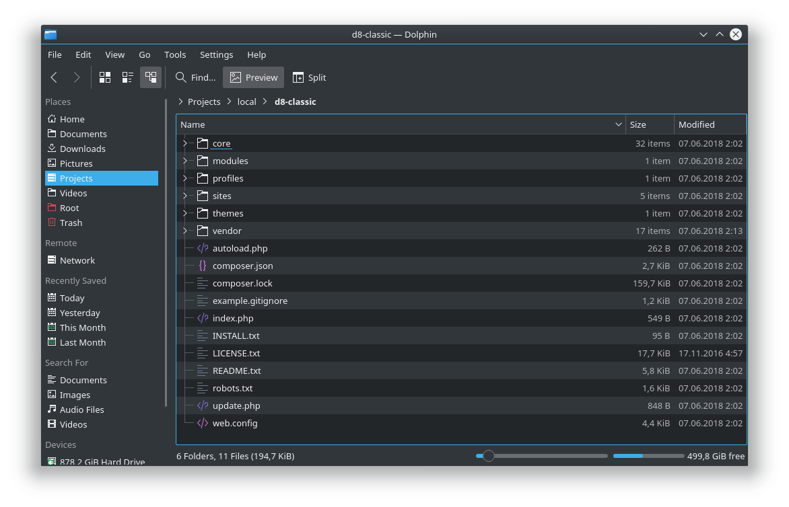
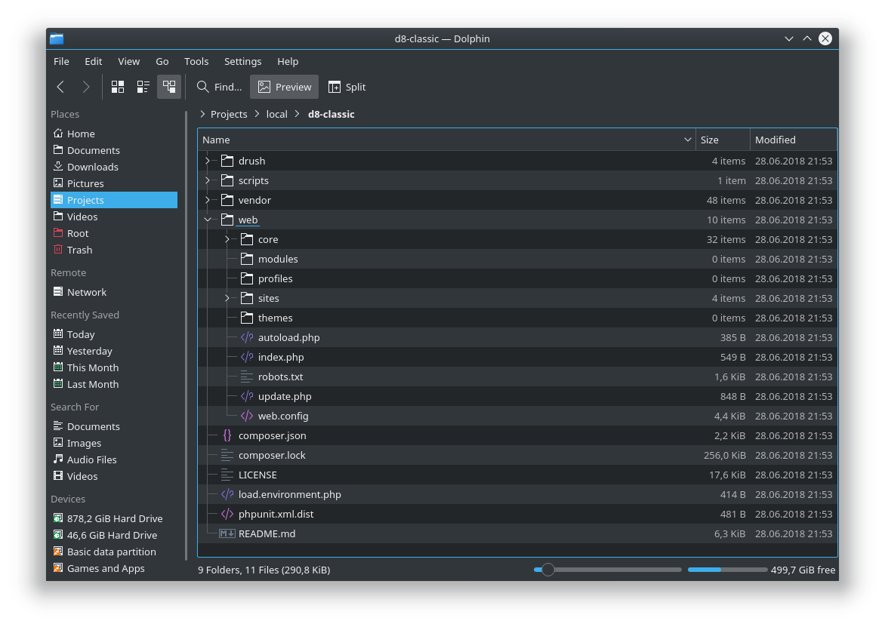

:: youtube {vid=jo-kWx6ujf0}

В Drupal 8.1 управление сторонними зависимостями перешло на Composer, также,
интеграция Composer и Drupal получила новый виток в развитии. С тех пор,
установка Drupal, так, как предлагает официальный сайт, стала не единственным
вариантом.

Вариантов на данный момент уже явно много, но я выделяю всего два:

- **Стандартный** — официальный вариант установки ядра из архива скаченного с
  drupal.org.
- [**Composer Drupal Project
  **](https://github.com/drupal-composer/drupal-project) — установка и
  управления ядром полностью через composer.

**Почему я хочу рассказать об этом?** Потому что считаю что новички, да и не
только, должны знать об этом. Об этом нигде не указано, по пути загрузки ядра,
но об этом, как минимум, нужно знать. Так как **внезапно**, стандартный вариант
хуже стороннего. ?

Мой опыт работы с Drupal 8, заставляет меня делать очень неоднозначный вывод.
Стандартный вариант установки — непрактичный, имеет недостатки, особенно для
новичков, и проблемы с composer. С ним приходиться больше бороться и воевать, а
преимуществ, как таковых, нет.

? Я сразу обращаю ваше внимание, то что всё что я буду писать, **субъективное
мнение на личном опыте**. Оба варианта хороши, особенно при условии что между
ними можно очень безболезненно мигрировать, каждому что-то подойдет лучше. Я
лишь хочу поделиться опытом и показать что есть ещё вот такой способ и какое у
него отличие от стандартного. Ведь такого в Drupal 7 у нас не было.

## Плюсы и минусы вариантов

### Стандартный способ

- **Плюсы**
  - Официальный и стандартный вариант установки. Для кого-то это может стать
    очень важным решающим фактором.
  - Не требует никаких дополнительных знаний и подготовки. Достаточно скачать
    архив, распаковать его в webroot проекта и запустить установку. Если вы
    пришли в Drupal из других CMS, это будет вам знакомо.
  - Данный вариант установки ядра без проблем и доп. настроек переносится на
    всевозможные хостинги и VPS. Опять же, стандартное поведение для большинства
    CMS, если не всех.

Drupal, как минимум с 7-ой версии, позиционируется как CMF решение. То есть, это
некая золотая середина между CMS и чистыми фреймворками. Если у Drupal 7 был
перевес в сторону CMS, то Drupal 8 ещё сильнее перевешивает в сторону
фреймворков. И сторонние зависимости от Symfony ещё сильнее его туда склоняют.
Исходя из этого, я выделяю следующие минусы.

- **Минусы**
  - Самый фатальный недостаток, который и является следствием всех проблем и
    остальных минусов — то что composer внедрили после релиза Drupal 8, в Drupal
    8.1. Получилось так, что структура проекта уже сформировалась и люди уже
    держали продакшен сайты на 8-ке. Но данная структура совершенно неудачное
    решение для такого уровня CMS. Именно поэтому все проблемы с composer на
    данном варианте и возникают. Конфликты версий, проблемы с зависимостями,
    потерянные файлы — всё это отсюда, потому что всё в куче.
  - Структура для такого уровня CMS просто напросто неудобная. Drupal 8 нам
    принес не только новую цифру в версии? и какие-то API и фишки, он также
    полностью меняет процесс разработки сайтов на Drupal в сравнении с Drupal 7,
    а структура, при этом, осталась прежней с косметическими изменениями.
  - Drupal 8 полностью крутится вокруг конфигураций. Конфигурации можно смело
    отнести в разряд кодовой базы. Это самые обычные YAML файлики, но при этом,
    они содержат кучу важной и приватной информации. Такие файлы ни в коем
    случае не должны быть доступны из сети по запросу. К сожалению, структура
    такого подхода делает данный момент максимально уязвимым. Конфиги, как вы ни
    крутите, будут лежать в пределах вебрута проекта, вся надежда на то, что
    .htaccess отработает корректно и вы его не потеряете, а если у вас NGINX, то
    вообще, если сами не проконтролируете, они из коробки будут качаться у вас.
    Такие файлы хранить в вебруте и ниже по иерархии — не нужно. Но выбора тут у
    нас нет.
    - ? Вы и сами можете проверить. Попробуйте запросить любой конфиг файл из
      проекта прямым
      запросом: http://example.com/sites/default/files/config_XYZ/sync/automated_cron.settings.yml (
      XYZ замените на ваш хэш, и если у вас конфиги экспортируются не в
      sites/default/files/config_XYZ, на новый путь). Скачался? Это очень
      тревожный звоночек. А что если эти XYZ узнаеет третье лицо? А если вы
      поменяете путь на какой-нибудь sites/default/config/sync, где даже XYZ
      знать не надо? А это очень популярный способ экспорта конфигов. Конфиги
      имеют стандартное именование у всех сайтов, и если у вас магазин,
      например, подогнать название конфига от какой-нибудь платежной системы или
      друго сервиса, и скомпрометировать ваши API ключи, не составит труда.
      Очень много если, и ни одной причины держать их открытыми для загрузки,
      НИ-О-ДНО-Й.
  - Аналогично и с зависимостями Composer. vendor директория находится в вебруте
    проекта. По умолчанию она хорошо защищена и часть файлов при установке
    оттуда удаляется. Но сторонние зависимости надо контролировать руками и
    слепо верить им, или проверять в ручную. Но вы сами то в это верите, что вы
    будите проводить аудит безопасности всех зависимостей которые у вас
    скачаются по ходу развития проекта, как вами, так и контриб модулями и т.д.
    там по цепочке зависимостей? Там могут быть совершенно неочевидные пути к
    взлому, все это, как минимум, компрометирует инфомрмацию о внутреннем
    устройстве проекта. И опять же, нет ни одной причины их держать открытыми в
    веб. Как по мне, это плохая практика. Посмотрите на структуру
    проекта [Symfony](https://symfony.com/doc/current/best_practices/creating-the-project.html)
    или [Laravel](https://laravel.com/docs/5.6/structure). А это, на минуточку,
    одни из топовых фреймворков, у которых управление зависимостями также
    построено на composer и они активно используют YAML конфигурации. Видите где
    у них index.php, а где конфиги и vendor? Захотите повторить — получится
    composer drupal project.
  - Возможно вы используете или собираетесь использовать данный способ как
    способ избежать взаимодействия с Composer, или свести её к минимуму.
    Возможно, вы сведете, на старте. Но когда у вас начнутся проблемы и
    конфликты версий, вы в итоге потратите больше времени на решение проблем и
    возню с ним. Вы не избежите композера никак.

### Composer Drupal Project

- **Плюсы**
  - От композера вы не убежите, он вас нагонет. А дальнейшая интеграция Drupal и
    Composer будет только усиливаться. Если же это неизбежно, проще сразу вести
    проект полностью на нем. Это решит проблемы в будущем, и текущие проблемы. У
    вас не будет каши, когда часть модулей стоит с drupal.org руками или ещё
    как, а другая через композер. Проще все вести в композере, зачем вам такой
    бардак на проекте? И это я не беру во внимания побочные плюсы самого
    композера, типа лока версий, автопатчинг, и возможность подключать свои
    приватные репы для обновления кастом модулей.
  - Структура файлов тут немного отличается от оригинальной. Тут появляется
    всего один новый уровень в иерархии, и это решает **все** минусы
    стандартного подхода. vendor и конфигурации тут находятся за пределами
    webroot проекта, а следовательно, эти файлы не доступны по прямому запросу,
    никак, вообще. Если вы сами не напишите контроллер который будет их
    отдавать. И не важно уже, apache у вас или nginx, потеряли вы .htaccess
    файли или нет, до них просто физически не добраться. Помните пример на
    проверку выше? Тут даже примера быть не может, так как данные файлы
    находятся на уровень выше вебрута. Если бы такое можно было писать, то было
    бы так: http://example/../config/sync/automated_cron.settings.yml. Но такой
    возможности нет, а следовательно, вы как в танке.
  - Такая структура также очень приятная если вы захотите сделать приватную
    файловую систему. Опять же, её можно положить в корень проекта, и она
    автоматически защищена от прямого запроса. Приватную файловую систему
    рекомендуется выносить за пределы вебрута, тут это будет за пределами и
    внутри проекта. На стандартном проекте, с 99.999% вероятностью она будет у
    вас в пределах вебрута. Так как вынести её за пределы? дело очень веселое и
    повлечет за собой множество проблем. И опять, придется заботиться как бы
    файлы оттуда не начали качаться по прямому запросу. А тут создали и забыли.
    Оно просто работает.
  - Репозиторий проекта максимально чистый. Из-за данной структуры и того, что
    она решает проблемы с композером, как минимум. Вам не придется держать в
    репозитории ядро друпала, что придется делать с очень высокой вероятностью
    на стандартном подходе, так как композер качает ядро на стандартном подходе
    как повезет. В итоге в вашем репозитории окажутся только кастомные темы,
    модули, а также файлы что вы положите, окружения, докер файлы и вот это вот
    всё. Никаких контрибов, ядра и зависимостей там не будет.
- **Минусы**
  - Самый страшный минус. ? Из-за того что вебрут находится на уровень ниже, то
    на хостингах и VPS, с 99% вероятностью потребуется легкая настройка. Как
    правило, просто в настройках сайта\домена меняется настройка индекс файла с
    index.php на web/index.php. Делов, не более чем на 5 минут на 1 раз.
  - Это не минус, больше рекомендация. С данным подходом очень желательно начать
    пользоваться git для деплоя изменений. Иначе из него будет не выжать
    максимум. Деплоить изменения гитом и композером на такой структуре просто
    кайф.

### Вывод

А теперь небольшой мой вывод: Я считаю что способ установки ядра через композер,
в реалиях, друпал 8, должен быть одним единственным, как
это [сделано у Symfony](https://symfony.com/download). Вы у них нигде не
скачаете на официальном сайте архив с фреймворком. Но по понятным причинам,
такое уже сделать просто невозможно, я надеюсь что на такой шаг решатся с
релизом Drupal 9. Тут можно дискутировать очень долго, нравится вам композер или
нет, но факт в том, что если вы решили использовать Drupal 8, то композер
де-факто становится обязательным, поэтому, лучше начать его использовать с
самого старта и для всех задач которые он покрывает, а не выборочно там где у
вас безвыходная ситуация.

Например, модуль [Swift Mailer](https://www.drupal.org/project/swiftmailer)
используется для отправки html писем, очень полезный и нужный. Попробуйте его
установить и завести без композера. По факту то поставить можно, но это займет,
скорее всего, часы в первый раз, а затем, любое обновление\изменение композера
или модуля — опять семь кругов ада и это даже близко не пара минут даже с
опытом. Или [Drupal Commerce](https://www.drupal.org/project/commerce). В общем,
композер вас догонит, как ни крути, да ещё пнет так, что сами не рады будите.
Именно поэтому, многие новички могут посмотреть на это, и сказать — "Drupal
говно!". К сожалению, они так могут и не понять почему у них столько проблем. И
причина тут не в композере, и не в новичках.

Composer — это круто и удобно, но то как он работает и приготовлен в ядре из
коробки, вызывает ненависть к нему. Мысль о том, что что-то вы делаете не так,
все равно начнет со временем расти у вас в голове, отчасти это проблема ядра, и
решение поискать другие варианты установки или ведения проекта на Drupal может
быть совершенно неочевидным решением, особенно для новичков. Поэтому этот
материал и есть, а также есть composer drupal project.

Я не навязываю вам composer drupal project, но очень настоятельно рекомендую,
хотябы просто попробовать. Это совершенно другой экспириенс работы с Drupal, и
для меня, он был в позитивную сторону, чего я не скажу про стандартный вариант.

## Установка

### Стандартный способ

1. Заходим [на страницу](https://www.drupal.org/project/drupal/) с ядром.
2. Качаем актуальную версию в виде архива.
3. Распаковываем в webroot вашего проекта.
4. Устанавливаем.

Корень проекта, он же вебрут выглядит так.

### Composer drupal project

1. Заходите
   на [страницу проекта](https://github.com/drupal-composer/drupal-project).
2. Решаете как ставить, через git clone или composer create-project в корне
   проекта.
  1. **git clone**
    1. В корне
       проекта `git clone https://github.com/drupal-composer/drupal-project.git .`
    2. `composer install`.
  2. **composer create-project**
    1. В корне
       проекта `composer create-project drupal-composer/drupal-project:8.x-dev some-dir --stability dev --no-interaction`
    2. `cp -r some-dir/. ./ && rm -rf some-dir/`
3. Устанавливаем.

Корень проекта будет выглядеть так, а вебрут уже будет находиться в web папке.

А теперь небольшой обзор, в чем же их отлчие. По факту, всем чем отличается
стандартный подход от composer drupal project в том, что, то что в composer
drupal project находится в web, находится в корне проекта на стандартном
варианте. index.php и обработка запросов будет из web/ папки. А всё что выше её
в иерархии — недоступно из сети прямым запросом, а это drush, scripts, vendor
директории, в дальнейшем там будет и config директории для конфигов, и какая-то
папка для приватной файловой системы, если потребуется.

Корень проекта у вас там где composer.json, а вебрут в web. Вот и вся разница.
Никакой магии, всё просто и понятно. В web у вас будет абсолютно вся та же
структура сайта на Drupal, как и в стандартной установке. Вот только
потенциально опасные папки на уровень выше. И это решает все проблемы с
композером и безопасность.

А также:

- Данный проект запрещает по умолчанию качать модули и темы через drush, на
  попытку запроса загрузки модуля будет выдана ошибка с напоминанием, что данный
  проект ведется композером, и чтобы скачать PROJECTNAME надо
  использовать `composer require drupal/PROJECTNAME`.
- composer.json немного модифицирован для вашего удосбтва. Он умеет докачивать
  index.php, robots.txt, update.php и прочие файлы из корня стандартной
  установки в web директорию. Чего не умеет ядро из коробки! ? И всё это
  настраивается! Даже web папка необязательна, правите composer.json где web,
  например, на public, и всё будет там. Только не забудьте написать composer
  update и перенести кастомы с файлами если проект уже рабочий.
- Некоторые модули указывают библиотеки через композер типа `drupal-library`.
  Стандартный вариант установки не распознает их, а этот установит в
  web/libraries/{name}.
- После установки данного варианта, он автоматически создаст вам settings.php и
  настроит чтобы конфигурации были в `../config/sync`. То есть в корне проекта,
  но за пределами вебрута, как и vendor.

Вот и вся их разница в установке и структуре. Это вроде бы незначительно, а
какая разница в их поведении и вашем удобстве! Небо и земля. Попробуйте, 5 минут
это ничто, если оно вам понравится, сэкономит вам часы на борьбе с композером.

## Миграция из одного варианта в другой

_Лучше посмотреть видео, где это продемонстрировано наглядно. Таймкоды: 52:02 и
1:02:29._

**Будьте аккуратны, не забывайте делать бэкапы.**

Миграции из одного варианта в другой очень похожи, нужно лишь учитывать
специфику вариантов, в зависимости от того откуда и куда переносится проект.

Что нужно чтобы сделать миграцию из одного варианта в другой (в обоих случаях):

1. Сделать бэкап кодовой базы, вообще отдельную копию для удобства. Из него
   будем копировать в актуальную папку проекта.
2. Удалить актуальную кодовую базу проекта. Базу данных трогать не нужно, у них
   всё идентично.
3. Закинуть чистое ядро для варианта, в который будет миграция.
4. Отредактировать composer.json — самое важное require раздел, а также всё что
   было добавлено руками: патчи, репозитории, настройки плагинов, скрипты,
   команды.
5. Перенести файлы /sites/default/files
6. Перенести все кастомные модули и темы в новый проект. Если контриб модули и
   темы ставились руками, то переносите руками.
7. Перенести settings.php и скорректировать путь до конфигураций.

### Миграция из стандартного варианта в composer drupal project

1. Сделайте полный бэкап кодовой базы.
2. Удаляете все что было в папке проекта.
3. Качаете composer drupal project любым из вариантов.
4. Отредактируйте composer.json. Для этого переносите все что было добавлено
   вами, а также все зависимости из require. Не нужно копипастить всё, файлы
   сильно отличаются.
5. Перенесите файлы из /sites/default/files в /web/sites/default/files.
6. Перенесите все кастомные модули и темы в /web/modules/custom и
   /web/themes/custom, соответственно. Если контриб модули до этого качались
   руками, то запросите их через
   композер: `composer require drupal/PROJECTNAME`. Если вы решиле вести проект
   на данном варианте, только так, и никак иначе.
7. Копируете /sites/default/settings.php в /web/sites/default/settings.php.
   Затем находите старый вариант `$config_directories['sync']` и ставите
   значение `'../config/sync'`.

Теперь можно зайти на сайт, и всё заработает. Для надежности можно сбросить кэш.

### Миграция из composer drupal project в стандартный вариант

1. Сделайте полный бэкап кодовой базы.
2. Удаляете все что было в папке проекта.
3. Качаете архив с ядром и распаковываете в корень проекта.
4. Отредактируйте composer.json.
  1. Для этого переносите все что было добавлено вами, а также все зависимости
     из require. Не нужно копипастить всё, файлы сильно отличаются.
  2. Удалите или оставьте зависимости, которые ставит для вас composer drupal
     project: `cweagans/composer-patches`, `drupal-composer/drupal-scaffold`, `drupal/console`, `drupal/core` (
     в стандартной установке он не должен быть в
     require), `drush/drush`, `vlucas/phpdotenv`, `webflo/drupal-finder`, `webmozart/path-util`.
     По сути, всё кроме composer-patches можно смело удалять. В зависимости от
     того как вы используете Drush и Drupal Console, решите сами, оставить или
     нет.
  3. Возможно, вам также потребуется перенести extra.installer-paths
     настройку `"web/libraries/{$name}": ["type:drupal-library"]`, только
     поменяйте путь на `"libraries/{$name}": ["type:drupal-library"]`. Если у
     вас не успели появиться такие зависимости на проекте, то, можно в принципе
     и не добавлять. В ядре её нет.
5. Перенесите файлы из /web/sites/default/files в /sites/default/files
6. Перенесите все кастомные модули и темы в /web/modules/custom и
   /web/themes/custom, соответственно. Вы можете продолжать управлять контриб
   модулями и темами через композер. Решайте сами. Можете удалить такие
   зависимости и закинуть их руками. Главное не потрите те модули, что ставятся
   исключительно композером.
7. Копируете /web/sites/default/settings.php в /sites/default/settings.php.
   Затем находите старый вариант `$config_directories['sync']` и ставите
   значение `'sites/default/files/config_XYZ'`, где вместо XYZ поставьте
   какой-нибудь очень длинный хэш. Или настройте куда хотите, главное не
   забудьте позаботиться о защите этой папки.
