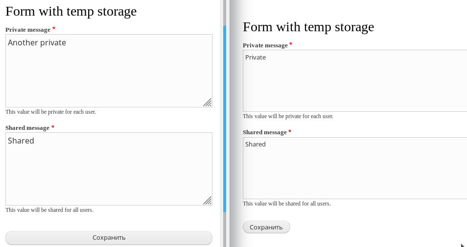

::: note [Материал обновлен для соответствия Drupal 8.7.0+]
Если вы читали и писали код по прошлой версии материала, ознакомьтесь
с [данным изменением](https://www.drupal.org/node/2935639), чтобы быстрее понять
что поменялось.
:::

Текст данного материала, как и его примеры, обновлены в соответствии с
изменениями.

**Temp store** (временное хранилище) — позволяет вам временно хранить какие-либо
данные. Это своего рода хранение данных в `$_SESSION`, так как данное хранилище
привязывается, как правило, к какому-то пользователю. Вот только `$_SESSION` оно
не использует и хранит всё внутри системы (в БД).

В ядре есть два сервиса для временного хранилища `tempstore.private`
и `tempstore.shared`. Работают они идентично, но private всегда хранит данные
для конкретного пользователя. То есть вызов по одному ключу у приватного
хранилища, будет отдавать разные данные для каждого пользователя. Shared же,
доступен из под каждого юзера.

Область применения данных сервисов и их хранилищ может быть очень огромной.
Например, хранить какие-то временные значения форм, и если пользователь их не
сохранил, их можно будет восстановить из этого хранилища, например для
каких-нибудь REST формочек, да и для обычных подойдет. В общем то, на что у вас
хватит фантазии или задач. Например, это можно использовать для каких-нибудь
формочек контролируемых вне Drupal, например на React или Vue.

Данные хранилища работают как для авторизованных, так и для анонимных
пользователей. Для анонимных пользователей owner имеет значение `session_id()`,
для авторизованых uid пользователя.

Значения в данных хранилищах живут по умолчанию 604800 секунд (1 неделю), после
чего автоматически удаляются.

Для того чтобы изменить это значение. Нужно будет подключать например
sites/default/services.yml и в нём переопределить:

```yml
parameters:
  # 10 секунд
  tempstore.expire: 10
```

Но такого, по хорошему, быть не должно.

Давайте рассмотрим возможности каждого из хранилищь, хоть они и похожи, они
немного отличаются.

## tempstore.private — приватное хранилище

Данное хранилище является приватным для каждого пользователя.

Хранилище имеет следующие методы:

- `get($key)`: Получает значение из хранилища по его ключу. Если данных нет,
  вернёт `NULL`, если есть, вернет значение.
- `set($key, $value)`: Записывает в хранилище значение `$value` под
  ключем `$key`.
- `getMetadata($key)`: Возвращает метаданные для конкретного `$key`, без данных.
  Это объект содержащий свойство owner, в котором хранится значение, кому
  принадлежит значение, и свойство updated — unix-таймштампом времени записи
  этого значения.
- `delete($key)`: Удаляет из хранилища данные связанные с данным ключем `$key`.

## tempstore.shared — общее хранилище

Данное хранилище является общим, и может содержать общие для всех пользователей
данные.

Хранилище имеет следующие методы:

- `get($key)`: Получает значение из хранилища по его ключу. Если данных нет,
  вернёт `NULL`, если есть, вернет значение.
- `getIfOwner($key)`: Получает значение из хранилища по его ключу. Если данных
  нет или данные записаны не из под текущего пользователя, вернёт `NULL`, если
  есть и были записаны из под текущего пользователя, вернет значение.
- `setIfNotExists($key, $value)`: Записывает в хранилище значение `$value` под
  ключем `$key`, только если на данный момент нет данных по данному ключу.
  Возвращает `TRUE` если записалось, `FALSE`, если данные уже были.
- `setIfOwner($key, $value)`: Записывает в хранилище значение `$value` под
  ключем `$key`, только если данных на данный момент нет, или владелец
  актуальных данных является текущим пользователем.
- `set($key, $value)`: Записывает в хранилище значение `$value` под
  ключем `$key`.
- `getMetadata($key)`: Возвращает метаданные для конкретного `$key`, без данных.
  Это объект содержащий свойство owner, в котором хранится значение, кому
  принадлежит значение, и свойство updated — unix-таймштампом времени записи
  этого значения.
- `delete($key)`: Удаляет из хранилища данные связанные с данным ключем `$key`.
- `deleteIfOwner($key)`: Удаляет из хранилища данные связанные с данным
  ключем `$key`, только при условии что данные пренадлежат текущему
  пользователю.

## Как они вызываются

Мелкие примеры как их вызывать.

Первым делом получается tempstore нужного хранилища, затем из хранилища
получается "коллекция", где уже и хранятся данные под нужными ключами. Как
правило, название "коллекции" равняется названию модуля.

```php
use Drupal\Core\TempStore\PrivateTempStoreFactory;
use Drupal\Core\TempStore\SharedTempStoreFactory;

/** @var PrivateTempStoreFactory $private_tempstore */
$private_tempstore = \Drupal::service('tempstore.private');
$my_private_storage = $private_tempstore->get('dummy');
$my_private_storage->set('username', 'Drupal');


/** @var SharedTempStoreFactory $shared_tempstore */
$shared_tempstore = \Drupal::service('tempstore.shared');
$my_shared_storage = $shared_tempstore->get('dummy');
$my_shared_storage->set('username', 'Drupal');
```

## Пример

В примере мы создадим форму на странице /temp-store-form с двумя полями, одно из
которых будет хранить сообщение в приватном хранилище, а другое в общем.

Создаём форму:

```php {"header":"src/FormWithTempStore.php"}
<?php

namespace Drupal\dummy\Form;

use Drupal\Core\Form\FormBase;
use Drupal\Core\Form\FormStateInterface;
use Drupal\Core\TempStore\PrivateTempStoreFactory;
use Drupal\Core\TempStore\SharedTempStoreFactory;
use Symfony\Component\DependencyInjection\ContainerInterface;

/**
 * Provides a Dummy form.
 */
class FormWithTempStore extends FormBase {

  /**
   * Private storage.
   *
   * @var PrivateTempStoreFactory
   */
  protected $privateTempStore;

  /**
   * Shared storage.
   *
   * @var SharedTempStoreFactory
   */
  protected $sharedTempStore;

  /**
   * Constructs a FormWithTempStore object.
   */
  public function __construct(PrivateTempStoreFactory $private_temp_store, SharedTempStoreFactory $shared_temp_store) {
    $this->privateTempStore = $private_temp_store->get('dummy');
    $this->sharedTempStore = $shared_temp_store->get('dummy');
  }

  /**
   * {@inheritdoc}
   */
  public static function create(ContainerInterface $container) {
    return new static(
      $container->get('tempstore.private'),
      $container->get('tempstore.shared')
    );
  }

  /**
   * {@inheritdoc}
   */
  public function getFormId() {
    return 'form_with_temp_store';
  }

  /**
   * {@inheritdoc}
   */
  public function buildForm(array $form, FormStateInterface $form_state) {
    $form['private_message'] = [
      '#type' => 'textarea',
      '#title' => $this->t('Private message'),
      '#required' => TRUE,
      '#description' => $this->t('This value will be private for each user.'),
      '#default_value' => $this->privateTempStore->get('message'),
    ];

    $form['shared_message'] = [
      '#type' => 'textarea',
      '#title' => $this->t('Shared message'),
      '#required' => TRUE,
      '#description' => $this->t('This value will be shared for all users.'),
      '#default_value' => $this->sharedTempStore->get('message'),
    ];

    $form['actions'] = ['#type' => 'actions'];
    $form['actions']['submit'] = [
      '#type' => 'submit',
      '#value' => $this->t('Save'),
    ];

    return $form;
  }

  /**
   * {@inheritdoc}
   */
  public function submitForm(array &$form, FormStateInterface $form_state) {
    $this->privateTempStore->set('message', $form_state->getValue('private_message'));
    $this->sharedTempStore->set('message', $form_state->getValue('shared_message'));
  }

}
```

При помощи `ContainerInjectionInterface`, который реализует `FormBase`, котору
мы, в свою очередь, расширяем, мы передаем нужные нам контейнеры сервисов в
статическом методе `create()` и принимаем их `__construct()`. Далее мы их
записываем в свойства, сразу получая "коллекции" одноименные названию модуля.

В форме мы создали два поля для ввода сообщений, значения по умолчанию для
которых берутся из соответствующих хранилищ.

В момент нажатия на кнопку Save (субмита формы), мы записываем текущие значения
поле в соответствующие хранилища.

Нам лишь осталось объявить роут для данной формы.

```yaml {"header":"dummy.routing.yml"}
dummy.form.temp_store:
  path: '/temp-store-form'
  defaults:
    _title: 'Form with temp storage'
    _form: 'Drupal\dummy\Form\FormWithTempStore'
  requirements:
    _permission: 'access content'
```

Всё, сбросив кэш и перейдя на страницу у вас будет форма с двумя полями. Всё что
введете в shared будет видно всем пользователям, они также смогут поменять это
сообщение и оно поменяется у всех в момент следующей генерации формы. Приватные
же значения, у каждого юзера будут персональные.


